# Package dependencies

Arrow direction: **consumer → dependency**. Edges are extracted from literal includes, linker declarations, SoftRelTools references, selected runtime commands, and release manifests. Conditional/optional/test relationships are retained as separate types in the evidence table. This is not a resolved linker graph or a claim about deployed topology.

The snapshot contains **120 packages** and **849 typed relationships**. Use the [interactive explorer](explorer.md) for a focused graph, the individual package pages for immediate dependencies, or the [full Mermaid source](dependencies.mmd) for export.

## Subsystem views

These diagrams show relationships whose source and target are both inside a domain. Cross-domain relationships remain in the complete evidence table and explorer. Build tools and test-only edges are omitted from these views.

### Analysis

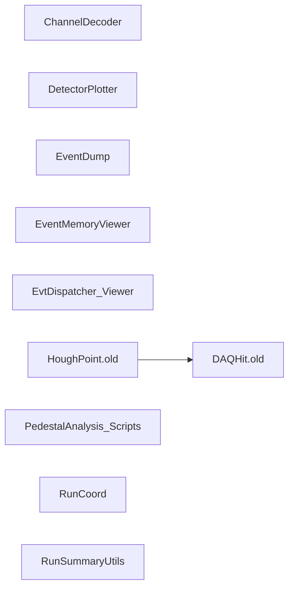

### Build and release

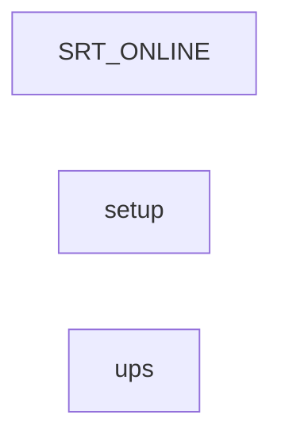

### Control

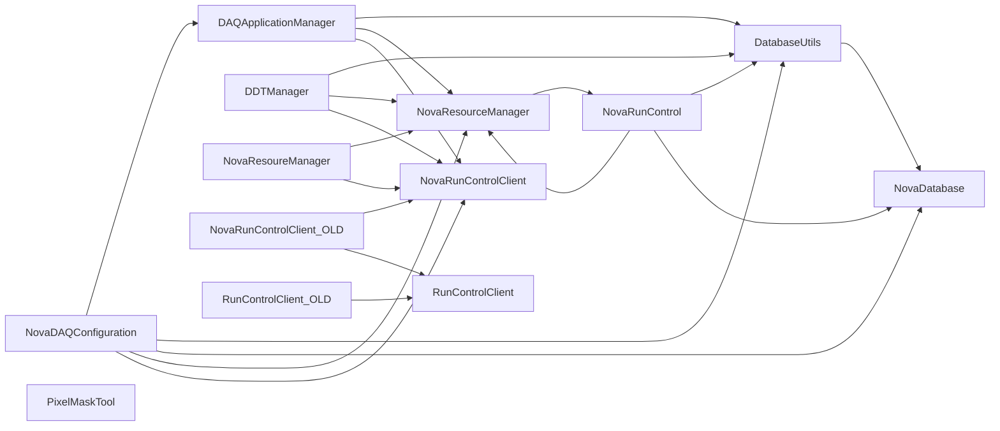

### Core libraries

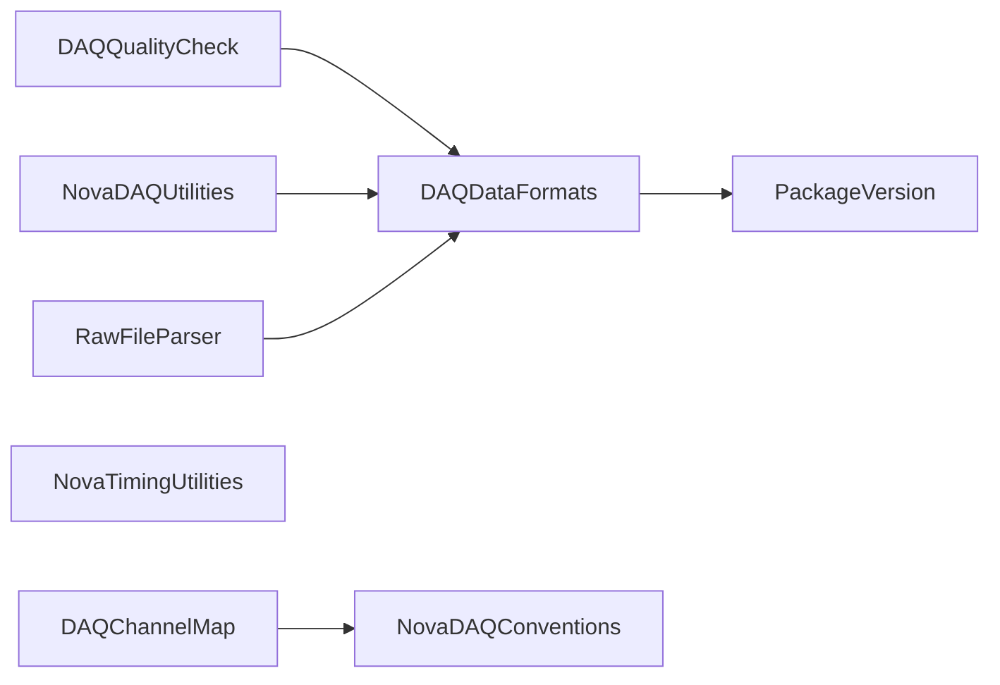

### Data path

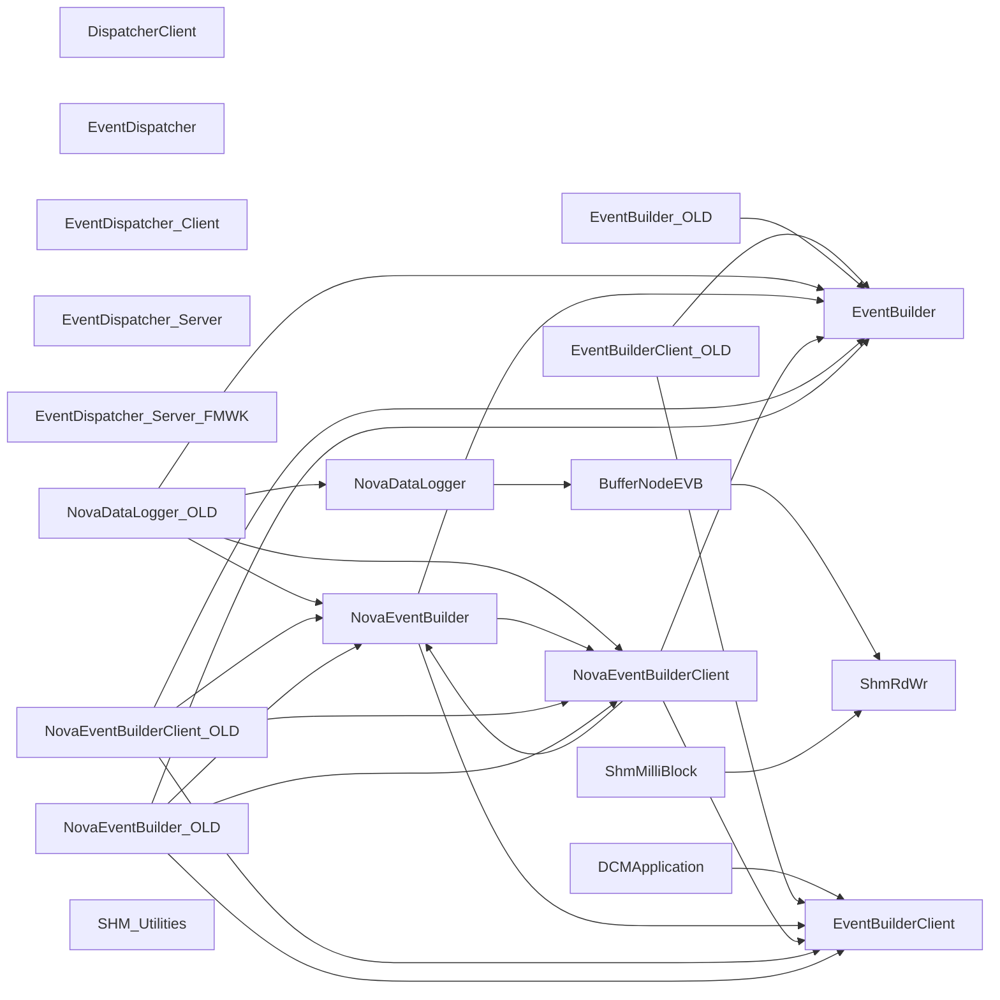

### Hardware

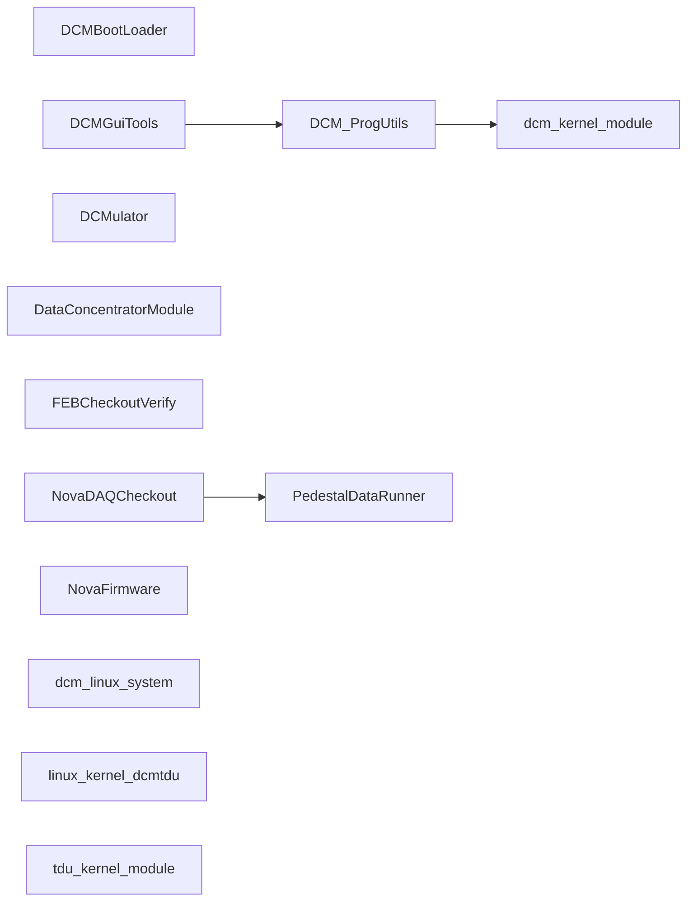

### Messaging

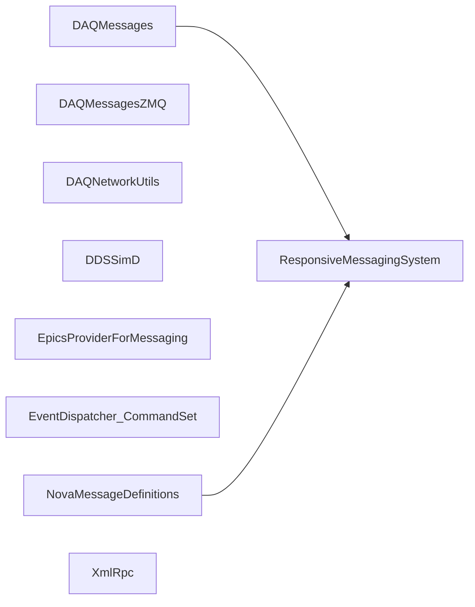

### Monitoring

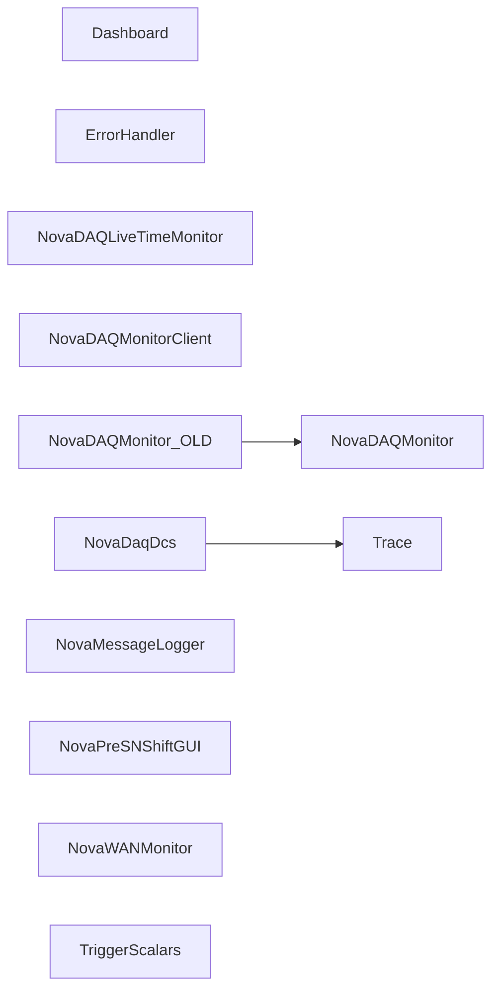

### Operations

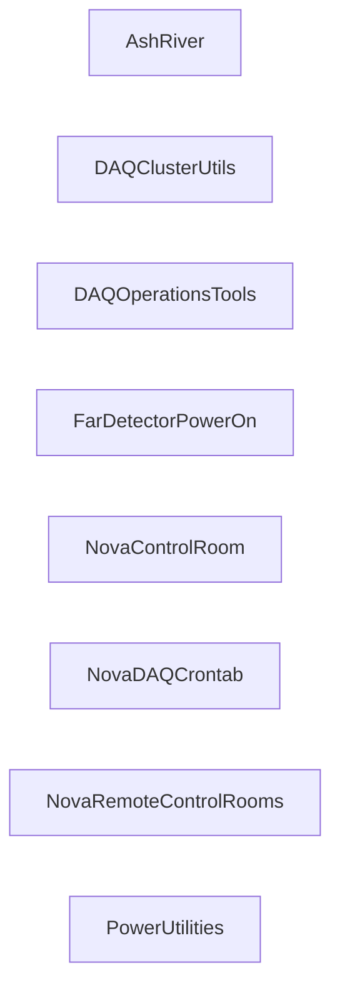

### Simulation and examples

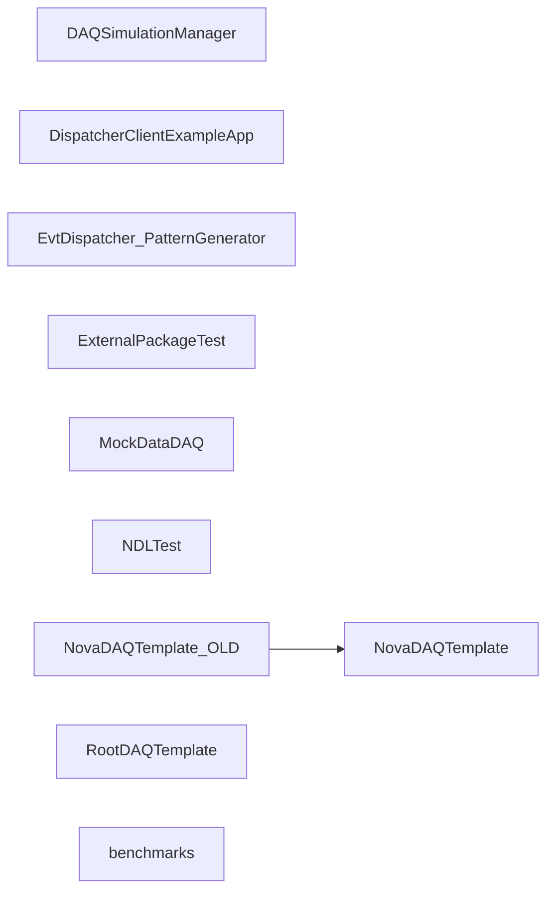

### Storage and metadata

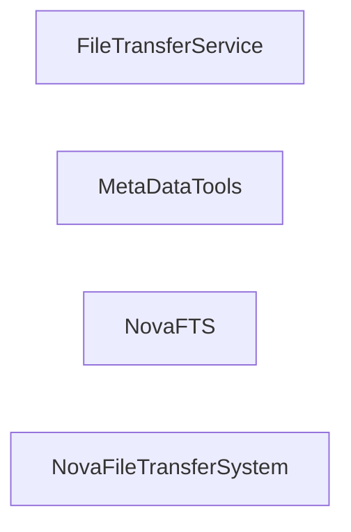

### Timing and triggers

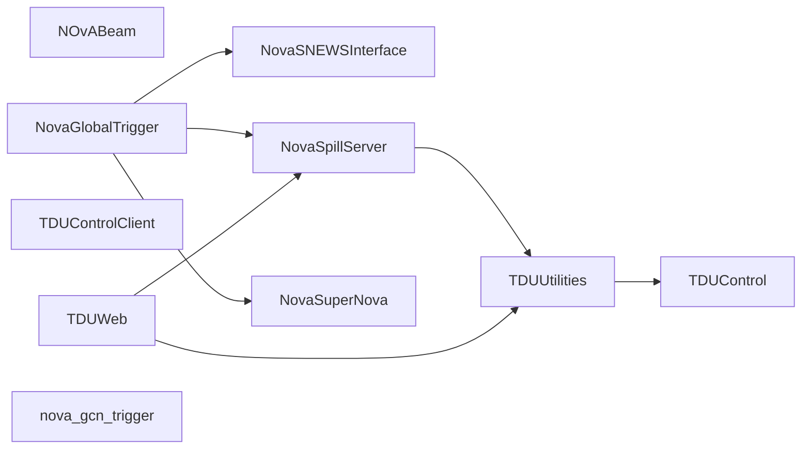

## Relationship evidence

| Consumer | Dependency | Type | First evidence | Occurrences |
| --- | --- | --- | --- | --- |
| [BufferNodeEVB](../packages/BufferNodeEVB.md) | [DAQDataFormats](../packages/DAQDataFormats.md) | build link | [cxx/src/GNUmakefile:32](https://github.com/NovaDAQ/BufferNodeEVB/blob/9c9c0f3b21e37f9e726fa651c6b99284f2a5a14d/cxx/src/GNUmakefile#L32) | 1 |
| [BufferNodeEVB](../packages/BufferNodeEVB.md) | [DAQDataFormats](../packages/DAQDataFormats.md) | source include | [cxx/include/MilliBlock.h:11](https://github.com/NovaDAQ/BufferNodeEVB/blob/9c9c0f3b21e37f9e726fa651c6b99284f2a5a14d/cxx/include/MilliBlock.h#L11) | 18 |
| [BufferNodeEVB](../packages/BufferNodeEVB.md) | [DAQDataFormats](../packages/DAQDataFormats.md) | test include | [cxx/test/SimulatedDataLogger.cc:10](https://github.com/NovaDAQ/BufferNodeEVB/blob/9c9c0f3b21e37f9e726fa651c6b99284f2a5a14d/cxx/test/SimulatedDataLogger.cc#L10) | 13 |
| [BufferNodeEVB](../packages/BufferNodeEVB.md) | [DAQDataFormats](../packages/DAQDataFormats.md) | test link | [cxx/test/GNUmakefile:17](https://github.com/NovaDAQ/BufferNodeEVB/blob/9c9c0f3b21e37f9e726fa651c6b99284f2a5a14d/cxx/test/GNUmakefile#L17) | 1 |
| [BufferNodeEVB](../packages/BufferNodeEVB.md) | [DAQMessages](../packages/DAQMessages.md) | build link | [cxx/src/GNUmakefile:27](https://github.com/NovaDAQ/BufferNodeEVB/blob/9c9c0f3b21e37f9e726fa651c6b99284f2a5a14d/cxx/src/GNUmakefile#L27) | 2 |
| [BufferNodeEVB](../packages/BufferNodeEVB.md) | [DAQMessages](../packages/DAQMessages.md) | source include | [cxx/include/SampleGTC.h:13](https://github.com/NovaDAQ/BufferNodeEVB/blob/9c9c0f3b21e37f9e726fa651c6b99284f2a5a14d/cxx/include/SampleGTC.h#L13) | 4 |
| [BufferNodeEVB](../packages/BufferNodeEVB.md) | [DAQMessages](../packages/DAQMessages.md) | test include | [cxx/test/sendTriggerMessages.cc:23](https://github.com/NovaDAQ/BufferNodeEVB/blob/9c9c0f3b21e37f9e726fa651c6b99284f2a5a14d/cxx/test/sendTriggerMessages.cc#L23) | 1 |
| [BufferNodeEVB](../packages/BufferNodeEVB.md) | [DAQMessages](../packages/DAQMessages.md) | test link | [cxx/test/GNUmakefile:21](https://github.com/NovaDAQ/BufferNodeEVB/blob/9c9c0f3b21e37f9e726fa651c6b99284f2a5a14d/cxx/test/GNUmakefile#L21) | 1 |
| [BufferNodeEVB](../packages/BufferNodeEVB.md) | [NovaDAQConfiguration](../packages/NovaDAQConfiguration.md) | build link | [cxx/src/GNUmakefile:33](https://github.com/NovaDAQ/BufferNodeEVB/blob/9c9c0f3b21e37f9e726fa651c6b99284f2a5a14d/cxx/src/GNUmakefile#L33) | 1 |
| [BufferNodeEVB](../packages/BufferNodeEVB.md) | [NovaDAQConfiguration](../packages/NovaDAQConfiguration.md) | source include | [cxx/src/SampleRCC.cpp:12](https://github.com/NovaDAQ/BufferNodeEVB/blob/9c9c0f3b21e37f9e726fa651c6b99284f2a5a14d/cxx/src/SampleRCC.cpp#L12) | 1 |
| [BufferNodeEVB](../packages/BufferNodeEVB.md) | [NovaDAQMonitorClient](../packages/NovaDAQMonitorClient.md) | source include | [cxx/src/MegaPool.h:21](https://github.com/NovaDAQ/BufferNodeEVB/blob/9c9c0f3b21e37f9e726fa651c6b99284f2a5a14d/cxx/src/MegaPool.h#L21) | 2 |
| [BufferNodeEVB](../packages/BufferNodeEVB.md) | [NovaDAQUtilities](../packages/NovaDAQUtilities.md) | test include | [cxx/test/sendTriggerMessages.cc:26](https://github.com/NovaDAQ/BufferNodeEVB/blob/9c9c0f3b21e37f9e726fa651c6b99284f2a5a14d/cxx/test/sendTriggerMessages.cc#L26) | 1 |
| [BufferNodeEVB](../packages/BufferNodeEVB.md) | [NovaGlobalTrigger](../packages/NovaGlobalTrigger.md) | test include | [cxx/test/sendTriggerMessages.cc:25](https://github.com/NovaDAQ/BufferNodeEVB/blob/9c9c0f3b21e37f9e726fa651c6b99284f2a5a14d/cxx/test/sendTriggerMessages.cc#L25) | 1 |
| [BufferNodeEVB](../packages/BufferNodeEVB.md) | [NovaGlobalTrigger](../packages/NovaGlobalTrigger.md) | test link | [cxx/test/GNUmakefile:20](https://github.com/NovaDAQ/BufferNodeEVB/blob/9c9c0f3b21e37f9e726fa651c6b99284f2a5a14d/cxx/test/GNUmakefile#L20) | 1 |
| [BufferNodeEVB](../packages/BufferNodeEVB.md) | [NovaRunControlClient](../packages/NovaRunControlClient.md) | build link | [cxx/src/GNUmakefile:26](https://github.com/NovaDAQ/BufferNodeEVB/blob/9c9c0f3b21e37f9e726fa651c6b99284f2a5a14d/cxx/src/GNUmakefile#L26) | 1 |
| [BufferNodeEVB](../packages/BufferNodeEVB.md) | [NovaRunControlClient](../packages/NovaRunControlClient.md) | source include | [cxx/include/SampleGTC.h:12](https://github.com/NovaDAQ/BufferNodeEVB/blob/9c9c0f3b21e37f9e726fa651c6b99284f2a5a14d/cxx/include/SampleGTC.h#L12) | 3 |
| [BufferNodeEVB](../packages/BufferNodeEVB.md) | [NovaTimingUtilities](../packages/NovaTimingUtilities.md) | build link | [cxx/src/GNUmakefile:31](https://github.com/NovaDAQ/BufferNodeEVB/blob/9c9c0f3b21e37f9e726fa651c6b99284f2a5a14d/cxx/src/GNUmakefile#L31) | 1 |
| [BufferNodeEVB](../packages/BufferNodeEVB.md) | [NovaTimingUtilities](../packages/NovaTimingUtilities.md) | source include | [cxx/src/MegaPool.cpp:16](https://github.com/NovaDAQ/BufferNodeEVB/blob/9c9c0f3b21e37f9e726fa651c6b99284f2a5a14d/cxx/src/MegaPool.cpp#L16) | 1 |
| [BufferNodeEVB](../packages/BufferNodeEVB.md) | [NovaTimingUtilities](../packages/NovaTimingUtilities.md) | test include | [cxx/test/SimulatedDataLogger.cc:20](https://github.com/NovaDAQ/BufferNodeEVB/blob/9c9c0f3b21e37f9e726fa651c6b99284f2a5a14d/cxx/test/SimulatedDataLogger.cc#L20) | 4 |
| [BufferNodeEVB](../packages/BufferNodeEVB.md) | [NovaTimingUtilities](../packages/NovaTimingUtilities.md) | test link | [cxx/test/GNUmakefile:18](https://github.com/NovaDAQ/BufferNodeEVB/blob/9c9c0f3b21e37f9e726fa651c6b99284f2a5a14d/cxx/test/GNUmakefile#L18) | 1 |
| [BufferNodeEVB](../packages/BufferNodeEVB.md) | [ResponsiveMessagingSystem](../packages/ResponsiveMessagingSystem.md) | source include | [cxx/src/SampleGTC.cpp:11](https://github.com/NovaDAQ/BufferNodeEVB/blob/9c9c0f3b21e37f9e726fa651c6b99284f2a5a14d/cxx/src/SampleGTC.cpp#L11) | 2 |
| [BufferNodeEVB](../packages/BufferNodeEVB.md) | [ResponsiveMessagingSystem](../packages/ResponsiveMessagingSystem.md) | test include | [cxx/test/sendTriggerMessages.cc:7](https://github.com/NovaDAQ/BufferNodeEVB/blob/9c9c0f3b21e37f9e726fa651c6b99284f2a5a14d/cxx/test/sendTriggerMessages.cc#L7) | 3 |
| [BufferNodeEVB](../packages/BufferNodeEVB.md) | [SRT_ONLINE](../packages/SRT_ONLINE.md) | build tool | [GNUmakefile:10](https://github.com/NovaDAQ/BufferNodeEVB/blob/9c9c0f3b21e37f9e726fa651c6b99284f2a5a14d/GNUmakefile#L10) | 19 |
| [BufferNodeEVB](../packages/BufferNodeEVB.md) | [ShmRdWr](../packages/ShmRdWr.md) | build link | [cxx/src/GNUmakefile:29](https://github.com/NovaDAQ/BufferNodeEVB/blob/9c9c0f3b21e37f9e726fa651c6b99284f2a5a14d/cxx/src/GNUmakefile#L29) | 1 |
| [BufferNodeEVB](../packages/BufferNodeEVB.md) | [ShmRdWr](../packages/ShmRdWr.md) | source include | [cxx/src/MegaPool.h:13](https://github.com/NovaDAQ/BufferNodeEVB/blob/9c9c0f3b21e37f9e726fa651c6b99284f2a5a14d/cxx/src/MegaPool.h#L13) | 2 |
| [BufferNodeEVB](../packages/BufferNodeEVB.md) | [Trace](../packages/Trace.md) | build link | [cxx/src/GNUmakefile:30](https://github.com/NovaDAQ/BufferNodeEVB/blob/9c9c0f3b21e37f9e726fa651c6b99284f2a5a14d/cxx/src/GNUmakefile#L30) | 1 |
| [BufferNodeEVB](../packages/BufferNodeEVB.md) | [Trace](../packages/Trace.md) | test link | [cxx/test/GNUmakefile:19](https://github.com/NovaDAQ/BufferNodeEVB/blob/9c9c0f3b21e37f9e726fa651c6b99284f2a5a14d/cxx/test/GNUmakefile#L19) | 1 |
| [ChannelDecoder](../packages/ChannelDecoder.md) | [DAQChannelMap](../packages/DAQChannelMap.md) | build link | [ChannelDecoder.pro:17](https://github.com/NovaDAQ/ChannelDecoder/blob/63bf86485a2c14b3423b43d7c3ecc68bc408cca5/ChannelDecoder.pro#L17) | 2 |
| [ChannelDecoder](../packages/ChannelDecoder.md) | [DAQChannelMap](../packages/DAQChannelMap.md) | source include | [ChannelDecoder.h:8](https://github.com/NovaDAQ/ChannelDecoder/blob/63bf86485a2c14b3423b43d7c3ecc68bc408cca5/ChannelDecoder.h#L8) | 1 |
| [ChannelDecoder](../packages/ChannelDecoder.md) | [PackageVersion](../packages/PackageVersion.md) | build link | [ChannelDecoder.pro:17](https://github.com/NovaDAQ/ChannelDecoder/blob/63bf86485a2c14b3423b43d7c3ecc68bc408cca5/ChannelDecoder.pro#L17) | 2 |
| [ChannelDecoder](../packages/ChannelDecoder.md) | [PackageVersion](../packages/PackageVersion.md) | source include | [version.h:28](https://github.com/NovaDAQ/ChannelDecoder/blob/63bf86485a2c14b3423b43d7c3ecc68bc408cca5/version.h#L28) | 1 |
| [DAQApplicationManager](../packages/DAQApplicationManager.md) | [BufferNodeEVB](../packages/BufferNodeEVB.md) | source include | [cxx/src/DAQApplicationManager.cc:13](https://github.com/NovaDAQ/DAQApplicationManager/blob/08f570a111b259069114837ae7f70434aded5dc1/cxx/src/DAQApplicationManager.cc#L13) | 8 |
| [DAQApplicationManager](../packages/DAQApplicationManager.md) | [DAQMessages](../packages/DAQMessages.md) | build link | [cxx/src/GNUmakefile:36](https://github.com/NovaDAQ/DAQApplicationManager/blob/08f570a111b259069114837ae7f70434aded5dc1/cxx/src/GNUmakefile#L36) | 1 |
| [DAQApplicationManager](../packages/DAQApplicationManager.md) | [DAQMessages](../packages/DAQMessages.md) | source include | [cxx/include/RCHandler.h:5](https://github.com/NovaDAQ/DAQApplicationManager/blob/08f570a111b259069114837ae7f70434aded5dc1/cxx/include/RCHandler.h#L5) | 4 |
| [DAQApplicationManager](../packages/DAQApplicationManager.md) | [DAQMessages](../packages/DAQMessages.md) | test include | [cxx/test/DAQApplicationManagerRecovery.cc:8](https://github.com/NovaDAQ/DAQApplicationManager/blob/08f570a111b259069114837ae7f70434aded5dc1/cxx/test/DAQApplicationManagerRecovery.cc#L8) | 1 |
| [DAQApplicationManager](../packages/DAQApplicationManager.md) | [DAQMessages](../packages/DAQMessages.md) | test link | [cxx/test/GNUmakefile:11](https://github.com/NovaDAQ/DAQApplicationManager/blob/08f570a111b259069114837ae7f70434aded5dc1/cxx/test/GNUmakefile#L11) | 1 |
| [DAQApplicationManager](../packages/DAQApplicationManager.md) | [DAQOperationsTools](../packages/DAQOperationsTools.md) | build link | [cxx/src/GNUmakefile:36](https://github.com/NovaDAQ/DAQApplicationManager/blob/08f570a111b259069114837ae7f70434aded5dc1/cxx/src/GNUmakefile#L36) | 1 |
| [DAQApplicationManager](../packages/DAQApplicationManager.md) | [DAQOperationsTools](../packages/DAQOperationsTools.md) | source include | [cxx/src/TabDisplay.cpp:23](https://github.com/NovaDAQ/DAQApplicationManager/blob/08f570a111b259069114837ae7f70434aded5dc1/cxx/src/TabDisplay.cpp#L23) | 3 |
| [DAQApplicationManager](../packages/DAQApplicationManager.md) | [DatabaseUtils](../packages/DatabaseUtils.md) | build link | [cxx/src/GNUmakefile:36](https://github.com/NovaDAQ/DAQApplicationManager/blob/08f570a111b259069114837ae7f70434aded5dc1/cxx/src/GNUmakefile#L36) | 1 |
| [DAQApplicationManager](../packages/DAQApplicationManager.md) | [DatabaseUtils](../packages/DatabaseUtils.md) | source include | [cxx/include/ApplicationGroupBox.h:7](https://github.com/NovaDAQ/DAQApplicationManager/blob/08f570a111b259069114837ae7f70434aded5dc1/cxx/include/ApplicationGroupBox.h#L7) | 16 |
| [DAQApplicationManager](../packages/DAQApplicationManager.md) | [NovaDAQConventions](../packages/NovaDAQConventions.md) | test include | [cxx/test/DAQApplicationManagerRecovery.cc:10](https://github.com/NovaDAQ/DAQApplicationManager/blob/08f570a111b259069114837ae7f70434aded5dc1/cxx/test/DAQApplicationManagerRecovery.cc#L10) | 1 |
| [DAQApplicationManager](../packages/DAQApplicationManager.md) | [NovaDAQUtilities](../packages/NovaDAQUtilities.md) | build link | [cxx/src/GNUmakefile:36](https://github.com/NovaDAQ/DAQApplicationManager/blob/08f570a111b259069114837ae7f70434aded5dc1/cxx/src/GNUmakefile#L36) | 1 |
| [DAQApplicationManager](../packages/DAQApplicationManager.md) | [NovaDAQUtilities](../packages/NovaDAQUtilities.md) | source include | [cxx/include/KrbTicketRenewer.h:4](https://github.com/NovaDAQ/DAQApplicationManager/blob/08f570a111b259069114837ae7f70434aded5dc1/cxx/include/KrbTicketRenewer.h#L4) | 20 |
| [DAQApplicationManager](../packages/DAQApplicationManager.md) | [NovaDAQUtilities](../packages/NovaDAQUtilities.md) | test include | [cxx/test/DAQApplicationManagerRecovery.cc:9](https://github.com/NovaDAQ/DAQApplicationManager/blob/08f570a111b259069114837ae7f70434aded5dc1/cxx/test/DAQApplicationManagerRecovery.cc#L9) | 1 |
| [DAQApplicationManager](../packages/DAQApplicationManager.md) | [NovaResourceManager](../packages/NovaResourceManager.md) | build link | [cxx/src/GNUmakefile:36](https://github.com/NovaDAQ/DAQApplicationManager/blob/08f570a111b259069114837ae7f70434aded5dc1/cxx/src/GNUmakefile#L36) | 1 |
| [DAQApplicationManager](../packages/DAQApplicationManager.md) | [NovaResourceManager](../packages/NovaResourceManager.md) | source include | [cxx/src/RCHandler.cpp:10](https://github.com/NovaDAQ/DAQApplicationManager/blob/08f570a111b259069114837ae7f70434aded5dc1/cxx/src/RCHandler.cpp#L10) | 2 |
| [DAQApplicationManager](../packages/DAQApplicationManager.md) | [NovaResourceManager](../packages/NovaResourceManager.md) | test include | [cxx/test/DAQApplicationManagerRecovery.cc:7](https://github.com/NovaDAQ/DAQApplicationManager/blob/08f570a111b259069114837ae7f70434aded5dc1/cxx/test/DAQApplicationManagerRecovery.cc#L7) | 1 |
| [DAQApplicationManager](../packages/DAQApplicationManager.md) | [NovaResourceManager](../packages/NovaResourceManager.md) | test link | [cxx/test/GNUmakefile:11](https://github.com/NovaDAQ/DAQApplicationManager/blob/08f570a111b259069114837ae7f70434aded5dc1/cxx/test/GNUmakefile#L11) | 1 |
| [DAQApplicationManager](../packages/DAQApplicationManager.md) | [NovaRunControlClient](../packages/NovaRunControlClient.md) | source include | [cxx/include/RCHandler.h:4](https://github.com/NovaDAQ/DAQApplicationManager/blob/08f570a111b259069114837ae7f70434aded5dc1/cxx/include/RCHandler.h#L4) | 1 |
| [DAQApplicationManager](../packages/DAQApplicationManager.md) | [ResponsiveMessagingSystem](../packages/ResponsiveMessagingSystem.md) | source include | [cxx/include/RmsReceiverDemultiplexer.h:4](https://github.com/NovaDAQ/DAQApplicationManager/blob/08f570a111b259069114837ae7f70434aded5dc1/cxx/include/RmsReceiverDemultiplexer.h#L4) | 14 |
| [DAQApplicationManager](../packages/DAQApplicationManager.md) | [ResponsiveMessagingSystem](../packages/ResponsiveMessagingSystem.md) | test include | [cxx/test/DAQApplicationManagerRecovery.cc:12](https://github.com/NovaDAQ/DAQApplicationManager/blob/08f570a111b259069114837ae7f70434aded5dc1/cxx/test/DAQApplicationManagerRecovery.cc#L12) | 3 |
| [DAQApplicationManager](../packages/DAQApplicationManager.md) | [SRT_ONLINE](../packages/SRT_ONLINE.md) | build tool | [GNUmakefile:10](https://github.com/NovaDAQ/DAQApplicationManager/blob/08f570a111b259069114837ae7f70434aded5dc1/GNUmakefile#L10) | 17 |
| [DAQApplicationManager](../packages/DAQApplicationManager.md) | [Trace](../packages/Trace.md) | build link | [cxx/src/GNUmakefile:36](https://github.com/NovaDAQ/DAQApplicationManager/blob/08f570a111b259069114837ae7f70434aded5dc1/cxx/src/GNUmakefile#L36) | 1 |
| [DAQChannelMap](../packages/DAQChannelMap.md) | [DAQDataFormats](../packages/DAQDataFormats.md) | test include | [cxx/test/CheckDAQChannelMap.cxx:33](https://github.com/NovaDAQ/DAQChannelMap/blob/246341eccee20c964aa894c4a0966b26eae8ba53/cxx/test/CheckDAQChannelMap.cxx#L33) | 4 |
| [DAQChannelMap](../packages/DAQChannelMap.md) | [DAQDataFormats](../packages/DAQDataFormats.md) | test link | [cxx/test/GNUmakefile:19](https://github.com/NovaDAQ/DAQChannelMap/blob/246341eccee20c964aa894c4a0966b26eae8ba53/cxx/test/GNUmakefile#L19) | 1 |
| [DAQChannelMap](../packages/DAQChannelMap.md) | [NovaDAQConventions](../packages/NovaDAQConventions.md) | source include | [cxx/src/DAQChannelMap.cpp:10](https://github.com/NovaDAQ/DAQChannelMap/blob/246341eccee20c964aa894c4a0966b26eae8ba53/cxx/src/DAQChannelMap.cpp#L10) | 8 |
| [DAQChannelMap](../packages/DAQChannelMap.md) | [NovaDAQConventions](../packages/NovaDAQConventions.md) | test include | [cxx/unittest/benchmark.cc:4](https://github.com/NovaDAQ/DAQChannelMap/blob/246341eccee20c964aa894c4a0966b26eae8ba53/cxx/unittest/benchmark.cc#L4) | 2 |
| [DAQChannelMap](../packages/DAQChannelMap.md) | [NovaDAQUtilities](../packages/NovaDAQUtilities.md) | test include | [cxx/unittest/chanmap_unittest.cc:1](https://github.com/NovaDAQ/DAQChannelMap/blob/246341eccee20c964aa894c4a0966b26eae8ba53/cxx/unittest/chanmap_unittest.cc#L1) | 2 |
| [DAQChannelMap](../packages/DAQChannelMap.md) | [NovaDAQUtilities](../packages/NovaDAQUtilities.md) | test link | [cxx/unittest/GNUmakefile:20](https://github.com/NovaDAQ/DAQChannelMap/blob/246341eccee20c964aa894c4a0966b26eae8ba53/cxx/unittest/GNUmakefile#L20) | 1 |
| [DAQChannelMap](../packages/DAQChannelMap.md) | [PackageVersion](../packages/PackageVersion.md) | test link | [cxx/test/GNUmakefile:19](https://github.com/NovaDAQ/DAQChannelMap/blob/246341eccee20c964aa894c4a0966b26eae8ba53/cxx/test/GNUmakefile#L19) | 1 |
| [DAQChannelMap](../packages/DAQChannelMap.md) | [SRT_ONLINE](../packages/SRT_ONLINE.md) | build tool | [GNUmakefile:21](https://github.com/NovaDAQ/DAQChannelMap/blob/246341eccee20c964aa894c4a0966b26eae8ba53/GNUmakefile#L21) | 16 |
| [DAQClusterUtils](../packages/DAQClusterUtils.md) | [SRT_ONLINE](../packages/SRT_ONLINE.md) | build tool | [FarDet/GNUmakefile:9](https://github.com/NovaDAQ/DAQClusterUtils/blob/c4b4a0fed76f3aa605ebf0cc9d4a24dd11713f7d/FarDet/GNUmakefile#L9) | 6 |
| [DAQDataFormats](../packages/DAQDataFormats.md) | [NovaDAQUtilities](../packages/NovaDAQUtilities.md) | test include | [cxx/unittest/ddfunittest.cc:3](https://github.com/NovaDAQ/DAQDataFormats/blob/869a1fc336526c7cccb92bf7cbd31203745ce7c5/cxx/unittest/ddfunittest.cc#L3) | 1 |
| [DAQDataFormats](../packages/DAQDataFormats.md) | [NovaDAQUtilities](../packages/NovaDAQUtilities.md) | test link | [cxx/unittest/GNUmakefile:17](https://github.com/NovaDAQ/DAQDataFormats/blob/869a1fc336526c7cccb92bf7cbd31203745ce7c5/cxx/unittest/GNUmakefile#L17) | 1 |
| [DAQDataFormats](../packages/DAQDataFormats.md) | [PackageVersion](../packages/PackageVersion.md) | build link | [cxx/src/CMakeLists.txt:4](https://github.com/NovaDAQ/DAQDataFormats/blob/869a1fc336526c7cccb92bf7cbd31203745ce7c5/cxx/src/CMakeLists.txt#L4) | 4 |
| [DAQDataFormats](../packages/DAQDataFormats.md) | [PackageVersion](../packages/PackageVersion.md) | source include | [cxx/include/version.h:28](https://github.com/NovaDAQ/DAQDataFormats/blob/869a1fc336526c7cccb92bf7cbd31203745ce7c5/cxx/include/version.h#L28) | 1 |
| [DAQDataFormats](../packages/DAQDataFormats.md) | [PackageVersion](../packages/PackageVersion.md) | test link | [cxx/test/GNUmakefile:21](https://github.com/NovaDAQ/DAQDataFormats/blob/869a1fc336526c7cccb92bf7cbd31203745ce7c5/cxx/test/GNUmakefile#L21) | 2 |
| [DAQDataFormats](../packages/DAQDataFormats.md) | [SRT_ONLINE](../packages/SRT_ONLINE.md) | build tool | [GNUmakefile:16](https://github.com/NovaDAQ/DAQDataFormats/blob/869a1fc336526c7cccb92bf7cbd31203745ce7c5/GNUmakefile#L16) | 19 |
| [DAQDataFormats](../packages/DAQDataFormats.md) | [Trace](../packages/Trace.md) | test link | [cxx/unittest/GNUmakefile:18](https://github.com/NovaDAQ/DAQDataFormats/blob/869a1fc336526c7cccb92bf7cbd31203745ce7c5/cxx/unittest/GNUmakefile#L18) | 1 |
| [DAQHit.old](../packages/DAQHit.old.md) | [DAQChannelMap](../packages/DAQChannelMap.md) | build link | [cxx/src/GNUmakefile:20](https://github.com/NovaDAQ/DAQHit.old/blob/41ff8aaf89a40d421dae961b6a8d770a7080089f/cxx/src/GNUmakefile#L20) | 3 |
| [DAQHit.old](../packages/DAQHit.old.md) | [DAQChannelMap](../packages/DAQChannelMap.md) | source include | [cxx/include/DAQHit.h:8](https://github.com/NovaDAQ/DAQHit.old/blob/41ff8aaf89a40d421dae961b6a8d770a7080089f/cxx/include/DAQHit.h#L8) | 1 |
| [DAQHit.old](../packages/DAQHit.old.md) | [DAQDataFormats](../packages/DAQDataFormats.md) | build link | [cxx/src/GNUmakefile:20](https://github.com/NovaDAQ/DAQHit.old/blob/41ff8aaf89a40d421dae961b6a8d770a7080089f/cxx/src/GNUmakefile#L20) | 3 |
| [DAQHit.old](../packages/DAQHit.old.md) | [DAQDataFormats](../packages/DAQDataFormats.md) | source include | [cxx/include/DAQHit.h:4](https://github.com/NovaDAQ/DAQHit.old/blob/41ff8aaf89a40d421dae961b6a8d770a7080089f/cxx/include/DAQHit.h#L4) | 27 |
| [DAQHit.old](../packages/DAQHit.old.md) | [NovaTimingUtilities](../packages/NovaTimingUtilities.md) | build link | [cxx/src/GNUmakefile:20](https://github.com/NovaDAQ/DAQHit.old/blob/41ff8aaf89a40d421dae961b6a8d770a7080089f/cxx/src/GNUmakefile#L20) | 3 |
| [DAQHit.old](../packages/DAQHit.old.md) | [RawFileParser](../packages/RawFileParser.md) | build link | [cxx/src/GNUmakefile:20](https://github.com/NovaDAQ/DAQHit.old/blob/41ff8aaf89a40d421dae961b6a8d770a7080089f/cxx/src/GNUmakefile#L20) | 2 |
| [DAQHit.old](../packages/DAQHit.old.md) | [RawFileParser](../packages/RawFileParser.md) | source include | [cxx/src/GetDAQHits-SHM.cc:31](https://github.com/NovaDAQ/DAQHit.old/blob/41ff8aaf89a40d421dae961b6a8d770a7080089f/cxx/src/GetDAQHits-SHM.cc#L31) | 2 |
| [DAQHit.old](../packages/DAQHit.old.md) | [SRT_ONLINE](../packages/SRT_ONLINE.md) | build tool | [GNUmakefile:10](https://github.com/NovaDAQ/DAQHit.old/blob/41ff8aaf89a40d421dae961b6a8d770a7080089f/GNUmakefile#L10) | 17 |
| [DAQHit.old](../packages/DAQHit.old.md) | [ShmMilliBlock](../packages/ShmMilliBlock.md) | build link | [cxx/src/GNUmakefile:20](https://github.com/NovaDAQ/DAQHit.old/blob/41ff8aaf89a40d421dae961b6a8d770a7080089f/cxx/src/GNUmakefile#L20) | 3 |
| [DAQHit.old](../packages/DAQHit.old.md) | [ShmMilliBlock](../packages/ShmMilliBlock.md) | source include | [cxx/src/GetDAQHits-SHM.cc:32](https://github.com/NovaDAQ/DAQHit.old/blob/41ff8aaf89a40d421dae961b6a8d770a7080089f/cxx/src/GetDAQHits-SHM.cc#L32) | 1 |
| [DAQMessages](../packages/DAQMessages.md) | [ResponsiveMessagingSystem](../packages/ResponsiveMessagingSystem.md) | build link | [cxx/src/DAQDCSMonitor/CMakeLists.txt:23](https://github.com/NovaDAQ/DAQMessages/blob/cd0e5d09b401afc9f3dad448d7838f00cd60e778/cxx/src/DAQDCSMonitor/CMakeLists.txt#L23) | 8 |
| [DAQMessages](../packages/DAQMessages.md) | [ResponsiveMessagingSystem](../packages/ResponsiveMessagingSystem.md) | source include | [cxx/include/DDSMailbox.hpp:9](https://github.com/NovaDAQ/DAQMessages/blob/cd0e5d09b401afc9f3dad448d7838f00cd60e778/cxx/include/DDSMailbox.hpp#L9) | 4 |
| [DAQMessages](../packages/DAQMessages.md) | [SRT_ONLINE](../packages/SRT_ONLINE.md) | build tool | [GNUmakefile:10](https://github.com/NovaDAQ/DAQMessages/blob/cd0e5d09b401afc9f3dad448d7838f00cd60e778/GNUmakefile#L10) | 50 |
| [DAQMessagesZMQ](../packages/DAQMessagesZMQ.md) | [DAQDataFormats](../packages/DAQDataFormats.md) | source include | [cxx/include/ZMQMessages.h:5](https://github.com/NovaDAQ/DAQMessagesZMQ/blob/48d08a04ebd6e210afed254bb61c7638c9c206a4/cxx/include/ZMQMessages.h#L5) | 1 |
| [DAQMessagesZMQ](../packages/DAQMessagesZMQ.md) | [NovaDAQConventions](../packages/NovaDAQConventions.md) | source include | [cxx/include/ZMQMessages.h:4](https://github.com/NovaDAQ/DAQMessagesZMQ/blob/48d08a04ebd6e210afed254bb61c7638c9c206a4/cxx/include/ZMQMessages.h#L4) | 1 |
| [DAQMessagesZMQ](../packages/DAQMessagesZMQ.md) | [SRT_ONLINE](../packages/SRT_ONLINE.md) | build tool | [GNUmakefile:11](https://github.com/NovaDAQ/DAQMessagesZMQ/blob/48d08a04ebd6e210afed254bb61c7638c9c206a4/GNUmakefile#L11) | 16 |
| [DAQNetworkUtils](../packages/DAQNetworkUtils.md) | [SRT_ONLINE](../packages/SRT_ONLINE.md) | build tool | [GNUmakefile:16](https://github.com/NovaDAQ/DAQNetworkUtils/blob/3d568f6c4080f575377ed6c49dee69d55aa312b3/GNUmakefile#L16) | 8 |
| [DAQOperationsTools](../packages/DAQOperationsTools.md) | [NovaDAQUtilities](../packages/NovaDAQUtilities.md) | build link | [cxx/src/GNUmakefile:26](https://github.com/NovaDAQ/DAQOperationsTools/blob/5b3fd3792f8526e5db7016f961c8e2debea28118/cxx/src/GNUmakefile#L26) | 1 |
| [DAQOperationsTools](../packages/DAQOperationsTools.md) | [NovaDAQUtilities](../packages/NovaDAQUtilities.md) | source include | [cxx/src/DistributedSystem.cc:11](https://github.com/NovaDAQ/DAQOperationsTools/blob/5b3fd3792f8526e5db7016f961c8e2debea28118/cxx/src/DistributedSystem.cc#L11) | 2 |
| [DAQOperationsTools](../packages/DAQOperationsTools.md) | [NovaDAQUtilities](../packages/NovaDAQUtilities.md) | test include | [cxx/test/BackgroundProcessTest.cc:1](https://github.com/NovaDAQ/DAQOperationsTools/blob/5b3fd3792f8526e5db7016f961c8e2debea28118/cxx/test/BackgroundProcessTest.cc#L1) | 1 |
| [DAQOperationsTools](../packages/DAQOperationsTools.md) | [NovaDAQUtilities](../packages/NovaDAQUtilities.md) | test link | [cxx/test/GNUmakefile:11](https://github.com/NovaDAQ/DAQOperationsTools/blob/5b3fd3792f8526e5db7016f961c8e2debea28118/cxx/test/GNUmakefile#L11) | 1 |
| [DAQOperationsTools](../packages/DAQOperationsTools.md) | [SRT_ONLINE](../packages/SRT_ONLINE.md) | build tool | [GNUmakefile:10](https://github.com/NovaDAQ/DAQOperationsTools/blob/5b3fd3792f8526e5db7016f961c8e2debea28118/GNUmakefile#L10) | 14 |
| [DAQQualityCheck](../packages/DAQQualityCheck.md) | [DAQDataFormats](../packages/DAQDataFormats.md) | build link | [cxx/src/CMakeLists.txt:8](https://github.com/NovaDAQ/DAQQualityCheck/blob/3120be800db8cc6c976ec8b7a3f296d173aa47c0/cxx/src/CMakeLists.txt#L8) | 1 |
| [DAQQualityCheck](../packages/DAQQualityCheck.md) | [DAQDataFormats](../packages/DAQDataFormats.md) | source include | [cxx/include/QualityCheck.h:11](https://github.com/NovaDAQ/DAQQualityCheck/blob/3120be800db8cc6c976ec8b7a3f296d173aa47c0/cxx/include/QualityCheck.h#L11) | 11 |
| [DAQQualityCheck](../packages/DAQQualityCheck.md) | [DAQDataFormats](../packages/DAQDataFormats.md) | test include | [cxx/test/RunQualityCheck.cc:16](https://github.com/NovaDAQ/DAQQualityCheck/blob/3120be800db8cc6c976ec8b7a3f296d173aa47c0/cxx/test/RunQualityCheck.cc#L16) | 10 |
| [DAQQualityCheck](../packages/DAQQualityCheck.md) | [DAQDataFormats](../packages/DAQDataFormats.md) | test link | [cxx/test/GNUmakefile:21](https://github.com/NovaDAQ/DAQQualityCheck/blob/3120be800db8cc6c976ec8b7a3f296d173aa47c0/cxx/test/GNUmakefile#L21) | 1 |
| [DAQQualityCheck](../packages/DAQQualityCheck.md) | [SRT_ONLINE](../packages/SRT_ONLINE.md) | build tool | [GNUmakefile:21](https://github.com/NovaDAQ/DAQQualityCheck/blob/3120be800db8cc6c976ec8b7a3f296d173aa47c0/GNUmakefile#L21) | 10 |
| [DAQSimulationManager](../packages/DAQSimulationManager.md) | [BufferNodeEVB](../packages/BufferNodeEVB.md) | build link | [cxx/src/GNUmakefile:38](https://github.com/NovaDAQ/DAQSimulationManager/blob/e3d3b3fb94d991e8b4113b9391c3746c9f6283d7/cxx/src/GNUmakefile#L38) | 1 |
| [DAQSimulationManager](../packages/DAQSimulationManager.md) | [BufferNodeEVB](../packages/BufferNodeEVB.md) | source include | [cxx/src/SimulationMode1.cpp:12](https://github.com/NovaDAQ/DAQSimulationManager/blob/e3d3b3fb94d991e8b4113b9391c3746c9f6283d7/cxx/src/SimulationMode1.cpp#L12) | 2 |
| [DAQSimulationManager](../packages/DAQSimulationManager.md) | [DAQDataFormats](../packages/DAQDataFormats.md) | build link | [cxx/src/GNUmakefile:37](https://github.com/NovaDAQ/DAQSimulationManager/blob/e3d3b3fb94d991e8b4113b9391c3746c9f6283d7/cxx/src/GNUmakefile#L37) | 1 |
| [DAQSimulationManager](../packages/DAQSimulationManager.md) | [DAQDataFormats](../packages/DAQDataFormats.md) | source include | [cxx/include/SimulationMode1.h:10](https://github.com/NovaDAQ/DAQSimulationManager/blob/e3d3b3fb94d991e8b4113b9391c3746c9f6283d7/cxx/include/SimulationMode1.h#L10) | 10 |
| [DAQSimulationManager](../packages/DAQSimulationManager.md) | [DAQMessages](../packages/DAQMessages.md) | build link | [cxx/src/GNUmakefile:39](https://github.com/NovaDAQ/DAQSimulationManager/blob/e3d3b3fb94d991e8b4113b9391c3746c9f6283d7/cxx/src/GNUmakefile#L39) | 1 |
| [DAQSimulationManager](../packages/DAQSimulationManager.md) | [DAQMessages](../packages/DAQMessages.md) | source include | [cxx/include/SimManRunner.h:11](https://github.com/NovaDAQ/DAQSimulationManager/blob/e3d3b3fb94d991e8b4113b9391c3746c9f6283d7/cxx/include/SimManRunner.h#L11) | 2 |
| [DAQSimulationManager](../packages/DAQSimulationManager.md) | [NovaDAQUtilities](../packages/NovaDAQUtilities.md) | source include | [cxx/include/SimManRunner.h:9](https://github.com/NovaDAQ/DAQSimulationManager/blob/e3d3b3fb94d991e8b4113b9391c3746c9f6283d7/cxx/include/SimManRunner.h#L9) | 3 |
| [DAQSimulationManager](../packages/DAQSimulationManager.md) | [NovaRunControlClient](../packages/NovaRunControlClient.md) | source include | [cxx/include/SimManRunner.h:10](https://github.com/NovaDAQ/DAQSimulationManager/blob/e3d3b3fb94d991e8b4113b9391c3746c9f6283d7/cxx/include/SimManRunner.h#L10) | 1 |
| [DAQSimulationManager](../packages/DAQSimulationManager.md) | [NovaTimingUtilities](../packages/NovaTimingUtilities.md) | build link | [cxx/src/GNUmakefile:40](https://github.com/NovaDAQ/DAQSimulationManager/blob/e3d3b3fb94d991e8b4113b9391c3746c9f6283d7/cxx/src/GNUmakefile#L40) | 1 |
| [DAQSimulationManager](../packages/DAQSimulationManager.md) | [NovaTimingUtilities](../packages/NovaTimingUtilities.md) | source include | [cxx/src/SimulationMode1.cpp:9](https://github.com/NovaDAQ/DAQSimulationManager/blob/e3d3b3fb94d991e8b4113b9391c3746c9f6283d7/cxx/src/SimulationMode1.cpp#L9) | 2 |
| [DAQSimulationManager](../packages/DAQSimulationManager.md) | [PackageVersion](../packages/PackageVersion.md) | source include | [cxx/include/version.h:28](https://github.com/NovaDAQ/DAQSimulationManager/blob/e3d3b3fb94d991e8b4113b9391c3746c9f6283d7/cxx/include/version.h#L28) | 1 |
| [DAQSimulationManager](../packages/DAQSimulationManager.md) | [ResponsiveMessagingSystem](../packages/ResponsiveMessagingSystem.md) | source include | [cxx/src/SimManRunner.cpp:6](https://github.com/NovaDAQ/DAQSimulationManager/blob/e3d3b3fb94d991e8b4113b9391c3746c9f6283d7/cxx/src/SimManRunner.cpp#L6) | 4 |
| [DAQSimulationManager](../packages/DAQSimulationManager.md) | [SRT_ONLINE](../packages/SRT_ONLINE.md) | build tool | [GNUmakefile:10](https://github.com/NovaDAQ/DAQSimulationManager/blob/e3d3b3fb94d991e8b4113b9391c3746c9f6283d7/GNUmakefile#L10) | 12 |
| [DAQSimulationManager](../packages/DAQSimulationManager.md) | [Trace](../packages/Trace.md) | build link | [cxx/src/GNUmakefile:41](https://github.com/NovaDAQ/DAQSimulationManager/blob/e3d3b3fb94d991e8b4113b9391c3746c9f6283d7/cxx/src/GNUmakefile#L41) | 1 |
| [DAQSimulationManager](../packages/DAQSimulationManager.md) | [Trace](../packages/Trace.md) | source include | [cxx/include/Utilities.h:14](https://github.com/NovaDAQ/DAQSimulationManager/blob/e3d3b3fb94d991e8b4113b9391c3746c9f6283d7/cxx/include/Utilities.h#L14) | 1 |
| [DCMApplication](../packages/DCMApplication.md) | [DAQDataFormats](../packages/DAQDataFormats.md) | build link | [cxx/src/GNUmakefile:30](https://github.com/NovaDAQ/DCMApplication/blob/9d0a6dbc6d3b5037aa3ab2fb22ff8dec18474425/cxx/src/GNUmakefile#L30) | 1 |
| [DCMApplication](../packages/DCMApplication.md) | [DAQDataFormats](../packages/DAQDataFormats.md) | source include | [cxx/include/DcmConnection.h:10](https://github.com/NovaDAQ/DCMApplication/blob/9d0a6dbc6d3b5037aa3ab2fb22ff8dec18474425/cxx/include/DcmConnection.h#L10) | 16 |
| [DCMApplication](../packages/DCMApplication.md) | [DAQDataFormats](../packages/DAQDataFormats.md) | test include | [cxx/test/DcmEvbTestServer.h:7](https://github.com/NovaDAQ/DCMApplication/blob/9d0a6dbc6d3b5037aa3ab2fb22ff8dec18474425/cxx/test/DcmEvbTestServer.h#L7) | 18 |
| [DCMApplication](../packages/DCMApplication.md) | [DAQDataFormats](../packages/DAQDataFormats.md) | test link | [cxx/test/GNUmakefile:17](https://github.com/NovaDAQ/DCMApplication/blob/9d0a6dbc6d3b5037aa3ab2fb22ff8dec18474425/cxx/test/GNUmakefile#L17) | 2 |
| [DCMApplication](../packages/DCMApplication.md) | [DAQMessages](../packages/DAQMessages.md) | source include | [cxx/include/DcmDirector.h:12](https://github.com/NovaDAQ/DCMApplication/blob/9d0a6dbc6d3b5037aa3ab2fb22ff8dec18474425/cxx/include/DcmDirector.h#L12) | 11 |
| [DCMApplication](../packages/DCMApplication.md) | [DAQMessages](../packages/DAQMessages.md) | test include | [cxx/unittest/DcmConfigurationStateTest.cpp:5](https://github.com/NovaDAQ/DCMApplication/blob/9d0a6dbc6d3b5037aa3ab2fb22ff8dec18474425/cxx/unittest/DcmConfigurationStateTest.cpp#L5) | 3 |
| [DCMApplication](../packages/DCMApplication.md) | [DCM_ProgUtils](../packages/DCM_ProgUtils.md) | build link | [cxx/src/GNUmakefile:30](https://github.com/NovaDAQ/DCMApplication/blob/9d0a6dbc6d3b5037aa3ab2fb22ff8dec18474425/cxx/src/GNUmakefile#L30) | 1 |
| [DCMApplication](../packages/DCMApplication.md) | [DCM_ProgUtils](../packages/DCM_ProgUtils.md) | source include | [cxx/include/DcmControl.h:11](https://github.com/NovaDAQ/DCMApplication/blob/9d0a6dbc6d3b5037aa3ab2fb22ff8dec18474425/cxx/include/DcmControl.h#L11) | 6 |
| [DCMApplication](../packages/DCMApplication.md) | [DCM_ProgUtils](../packages/DCM_ProgUtils.md) | test include | [cxx/test/dcmfebtest.cc:35](https://github.com/NovaDAQ/DCMApplication/blob/9d0a6dbc6d3b5037aa3ab2fb22ff8dec18474425/cxx/test/dcmfebtest.cc#L35) | 2 |
| [DCMApplication](../packages/DCMApplication.md) | [DCM_ProgUtils](../packages/DCM_ProgUtils.md) | test link | [cxx/test/GNUmakefile:17](https://github.com/NovaDAQ/DCMApplication/blob/9d0a6dbc6d3b5037aa3ab2fb22ff8dec18474425/cxx/test/GNUmakefile#L17) | 2 |
| [DCMApplication](../packages/DCMApplication.md) | [EventBuilderClient](../packages/EventBuilderClient.md) | build link | [cxx/src/GNUmakefile:30](https://github.com/NovaDAQ/DCMApplication/blob/9d0a6dbc6d3b5037aa3ab2fb22ff8dec18474425/cxx/src/GNUmakefile#L30) | 1 |
| [DCMApplication](../packages/DCMApplication.md) | [EventBuilderClient](../packages/EventBuilderClient.md) | source include | [cxx/include/DcmConnection.h:9](https://github.com/NovaDAQ/DCMApplication/blob/9d0a6dbc6d3b5037aa3ab2fb22ff8dec18474425/cxx/include/DcmConnection.h#L9) | 1 |
| [DCMApplication](../packages/DCMApplication.md) | [EventBuilderClient](../packages/EventBuilderClient.md) | test link | [cxx/unittest/GNUmakefile:19](https://github.com/NovaDAQ/DCMApplication/blob/9d0a6dbc6d3b5037aa3ab2fb22ff8dec18474425/cxx/unittest/GNUmakefile#L19) | 1 |
| [DCMApplication](../packages/DCMApplication.md) | [NovaDAQMonitorClient](../packages/NovaDAQMonitorClient.md) | source include | [cxx/include/DcmDirector.h:18](https://github.com/NovaDAQ/DCMApplication/blob/9d0a6dbc6d3b5037aa3ab2fb22ff8dec18474425/cxx/include/DcmDirector.h#L18) | 5 |
| [DCMApplication](../packages/DCMApplication.md) | [NovaDAQMonitorClient](../packages/NovaDAQMonitorClient.md) | test link | [cxx/unittest/GNUmakefile:19](https://github.com/NovaDAQ/DCMApplication/blob/9d0a6dbc6d3b5037aa3ab2fb22ff8dec18474425/cxx/unittest/GNUmakefile#L19) | 1 |
| [DCMApplication](../packages/DCMApplication.md) | [NovaDAQUtilities](../packages/NovaDAQUtilities.md) | source include | [cxx/include/DcmDirector.h:10](https://github.com/NovaDAQ/DCMApplication/blob/9d0a6dbc6d3b5037aa3ab2fb22ff8dec18474425/cxx/include/DcmDirector.h#L10) | 2 |
| [DCMApplication](../packages/DCMApplication.md) | [NovaDAQUtilities](../packages/NovaDAQUtilities.md) | test include | [cxx/test/DcmEvbTestServer.h:5](https://github.com/NovaDAQ/DCMApplication/blob/9d0a6dbc6d3b5037aa3ab2fb22ff8dec18474425/cxx/test/DcmEvbTestServer.h#L5) | 2 |
| [DCMApplication](../packages/DCMApplication.md) | [NovaRunControlClient](../packages/NovaRunControlClient.md) | source include | [cxx/include/DcmDirector.h:11](https://github.com/NovaDAQ/DCMApplication/blob/9d0a6dbc6d3b5037aa3ab2fb22ff8dec18474425/cxx/include/DcmDirector.h#L11) | 1 |
| [DCMApplication](../packages/DCMApplication.md) | [NovaTimingUtilities](../packages/NovaTimingUtilities.md) | build link | [cxx/src/GNUmakefile:30](https://github.com/NovaDAQ/DCMApplication/blob/9d0a6dbc6d3b5037aa3ab2fb22ff8dec18474425/cxx/src/GNUmakefile#L30) | 1 |
| [DCMApplication](../packages/DCMApplication.md) | [NovaTimingUtilities](../packages/NovaTimingUtilities.md) | source include | [cxx/src/DcmControl.cpp:12](https://github.com/NovaDAQ/DCMApplication/blob/9d0a6dbc6d3b5037aa3ab2fb22ff8dec18474425/cxx/src/DcmControl.cpp#L12) | 5 |
| [DCMApplication](../packages/DCMApplication.md) | [NovaTimingUtilities](../packages/NovaTimingUtilities.md) | test include | [cxx/test/DcmEvbTestServer.cpp:15](https://github.com/NovaDAQ/DCMApplication/blob/9d0a6dbc6d3b5037aa3ab2fb22ff8dec18474425/cxx/test/DcmEvbTestServer.cpp#L15) | 1 |
| [DCMApplication](../packages/DCMApplication.md) | [NovaTimingUtilities](../packages/NovaTimingUtilities.md) | test link | [cxx/test/GNUmakefile:17](https://github.com/NovaDAQ/DCMApplication/blob/9d0a6dbc6d3b5037aa3ab2fb22ff8dec18474425/cxx/test/GNUmakefile#L17) | 2 |
| [DCMApplication](../packages/DCMApplication.md) | [ResponsiveMessagingSystem](../packages/ResponsiveMessagingSystem.md) | source include | [cxx/src/DcmDirector.cpp:9](https://github.com/NovaDAQ/DCMApplication/blob/9d0a6dbc6d3b5037aa3ab2fb22ff8dec18474425/cxx/src/DcmDirector.cpp#L9) | 3 |
| [DCMApplication](../packages/DCMApplication.md) | [ResponsiveMessagingSystem](../packages/ResponsiveMessagingSystem.md) | test include | [cxx/unittest/DcmReaderTest.cpp:6](https://github.com/NovaDAQ/DCMApplication/blob/9d0a6dbc6d3b5037aa3ab2fb22ff8dec18474425/cxx/unittest/DcmReaderTest.cpp#L6) | 1 |
| [DCMApplication](../packages/DCMApplication.md) | [SRT_ONLINE](../packages/SRT_ONLINE.md) | build tool | [GNUmakefile:10](https://github.com/NovaDAQ/DCMApplication/blob/9d0a6dbc6d3b5037aa3ab2fb22ff8dec18474425/GNUmakefile#L10) | 25 |
| [DCMApplication](../packages/DCMApplication.md) | [Trace](../packages/Trace.md) | build link | [cxx/src/GNUmakefile:30](https://github.com/NovaDAQ/DCMApplication/blob/9d0a6dbc6d3b5037aa3ab2fb22ff8dec18474425/cxx/src/GNUmakefile#L30) | 1 |
| [DCMApplication](../packages/DCMApplication.md) | [Trace](../packages/Trace.md) | source include | [cxx/src/DcmDispatcher.cpp:11](https://github.com/NovaDAQ/DCMApplication/blob/9d0a6dbc6d3b5037aa3ab2fb22ff8dec18474425/cxx/src/DcmDispatcher.cpp#L11) | 2 |
| [DCMApplication](../packages/DCMApplication.md) | [Trace](../packages/Trace.md) | test include | [cxx/test/dcmfebtest.cc:38](https://github.com/NovaDAQ/DCMApplication/blob/9d0a6dbc6d3b5037aa3ab2fb22ff8dec18474425/cxx/test/dcmfebtest.cc#L38) | 2 |
| [DCMApplication](../packages/DCMApplication.md) | [Trace](../packages/Trace.md) | test link | [cxx/test/GNUmakefile:17](https://github.com/NovaDAQ/DCMApplication/blob/9d0a6dbc6d3b5037aa3ab2fb22ff8dec18474425/cxx/test/GNUmakefile#L17) | 2 |
| [DCMApplication](../packages/DCMApplication.md) | [dcm_kernel_module](../packages/dcm_kernel_module.md) | source include | [cxx/include/DcmReader.h:9](https://github.com/NovaDAQ/DCMApplication/blob/9d0a6dbc6d3b5037aa3ab2fb22ff8dec18474425/cxx/include/DcmReader.h#L9) | 2 |
| [DCMGuiTools](../packages/DCMGuiTools.md) | [DCM_ProgUtils](../packages/DCM_ProgUtils.md) | build link | [cxx/src/GNUmakefile:32](https://github.com/NovaDAQ/DCMGuiTools/blob/1a3b588f5627a1d1d4b8e8cc6b193dea82ec9691/cxx/src/GNUmakefile#L32) | 1 |
| [DCMGuiTools](../packages/DCMGuiTools.md) | [DCM_ProgUtils](../packages/DCM_ProgUtils.md) | source include | [cxx/include/DcmRegDumpGui.h:11](https://github.com/NovaDAQ/DCMGuiTools/blob/1a3b588f5627a1d1d4b8e8cc6b193dea82ec9691/cxx/include/DcmRegDumpGui.h#L11) | 3 |
| [DCMGuiTools](../packages/DCMGuiTools.md) | [PackageVersion](../packages/PackageVersion.md) | build link | [cxx/src/GNUmakefile:32](https://github.com/NovaDAQ/DCMGuiTools/blob/1a3b588f5627a1d1d4b8e8cc6b193dea82ec9691/cxx/src/GNUmakefile#L32) | 1 |
| [DCMGuiTools](../packages/DCMGuiTools.md) | [PackageVersion](../packages/PackageVersion.md) | source include | [cxx/src/version.h:28](https://github.com/NovaDAQ/DCMGuiTools/blob/1a3b588f5627a1d1d4b8e8cc6b193dea82ec9691/cxx/src/version.h#L28) | 1 |
| [DCMGuiTools](../packages/DCMGuiTools.md) | [SRT_ONLINE](../packages/SRT_ONLINE.md) | build tool | [GNUmakefile:10](https://github.com/NovaDAQ/DCMGuiTools/blob/1a3b588f5627a1d1d4b8e8cc6b193dea82ec9691/GNUmakefile#L10) | 18 |
| [DCMGuiTools](../packages/DCMGuiTools.md) | [Trace](../packages/Trace.md) | build link | [cxx/src/GNUmakefile:32](https://github.com/NovaDAQ/DCMGuiTools/blob/1a3b588f5627a1d1d4b8e8cc6b193dea82ec9691/cxx/src/GNUmakefile#L32) | 1 |
| [DCM_ProgUtils](../packages/DCM_ProgUtils.md) | [DAQDataFormats](../packages/DAQDataFormats.md) | build link | [cxx/src/GNUmakefile:29](https://github.com/NovaDAQ/DCM_ProgUtils/blob/e294d36d974d7b60042df6e6030fc558acb26a2c/cxx/src/GNUmakefile#L29) | 1 |
| [DCM_ProgUtils](../packages/DCM_ProgUtils.md) | [DAQDataFormats](../packages/DAQDataFormats.md) | source include | [cxx/src/DCMUtils.cpp:16](https://github.com/NovaDAQ/DCM_ProgUtils/blob/e294d36d974d7b60042df6e6030fc558acb26a2c/cxx/src/DCMUtils.cpp#L16) | 23 |
| [DCM_ProgUtils](../packages/DCM_ProgUtils.md) | [NovaTimingUtilities](../packages/NovaTimingUtilities.md) | build link | [cxx/src/GNUmakefile:29](https://github.com/NovaDAQ/DCM_ProgUtils/blob/e294d36d974d7b60042df6e6030fc558acb26a2c/cxx/src/GNUmakefile#L29) | 1 |
| [DCM_ProgUtils](../packages/DCM_ProgUtils.md) | [NovaTimingUtilities](../packages/NovaTimingUtilities.md) | source include | [cxx/src/Dcm.cpp:15](https://github.com/NovaDAQ/DCM_ProgUtils/blob/e294d36d974d7b60042df6e6030fc558acb26a2c/cxx/src/Dcm.cpp#L15) | 4 |
| [DCM_ProgUtils](../packages/DCM_ProgUtils.md) | [SRT_ONLINE](../packages/SRT_ONLINE.md) | build tool | [GNUmakefile:10](https://github.com/NovaDAQ/DCM_ProgUtils/blob/e294d36d974d7b60042df6e6030fc558acb26a2c/GNUmakefile#L10) | 26 |
| [DCM_ProgUtils](../packages/DCM_ProgUtils.md) | [Trace](../packages/Trace.md) | build link | [cxx/src/GNUmakefile:29](https://github.com/NovaDAQ/DCM_ProgUtils/blob/e294d36d974d7b60042df6e6030fc558acb26a2c/cxx/src/GNUmakefile#L29) | 1 |
| [DCM_ProgUtils](../packages/DCM_ProgUtils.md) | [Trace](../packages/Trace.md) | source include | [cxx/src/DCMUtils.cpp:17](https://github.com/NovaDAQ/DCM_ProgUtils/blob/e294d36d974d7b60042df6e6030fc558acb26a2c/cxx/src/DCMUtils.cpp#L17) | 4 |
| [DCM_ProgUtils](../packages/DCM_ProgUtils.md) | [dcm_kernel_module](../packages/dcm_kernel_module.md) | source include | [cxx/include/DCMUtils.h:11](https://github.com/NovaDAQ/DCM_ProgUtils/blob/e294d36d974d7b60042df6e6030fc558acb26a2c/cxx/include/DCMUtils.h#L11) | 8 |
| [DCM_ProgUtils](../packages/DCM_ProgUtils.md) | [dcm_kernel_module](../packages/dcm_kernel_module.md) | test include | [cxx/test/DCMTestUtils.cpp:8](https://github.com/NovaDAQ/DCM_ProgUtils/blob/e294d36d974d7b60042df6e6030fc558acb26a2c/cxx/test/DCMTestUtils.cpp#L8) | 1 |
| [DDTManager](../packages/DDTManager.md) | [DAQMessages](../packages/DAQMessages.md) | build link | [cxx/src/GNUmakefile:36](https://github.com/NovaDAQ/DDTManager/blob/c028da53626cb4ca611c3d8e8780efa7ed78fa0c/cxx/src/GNUmakefile#L36) | 1 |
| [DDTManager](../packages/DDTManager.md) | [DAQMessages](../packages/DAQMessages.md) | source include | [cxx/include/RCHandler.h:5](https://github.com/NovaDAQ/DDTManager/blob/c028da53626cb4ca611c3d8e8780efa7ed78fa0c/cxx/include/RCHandler.h#L5) | 3 |
| [DDTManager](../packages/DDTManager.md) | [DAQOperationsTools](../packages/DAQOperationsTools.md) | build link | [cxx/src/GNUmakefile:36](https://github.com/NovaDAQ/DDTManager/blob/c028da53626cb4ca611c3d8e8780efa7ed78fa0c/cxx/src/GNUmakefile#L36) | 1 |
| [DDTManager](../packages/DDTManager.md) | [DAQOperationsTools](../packages/DAQOperationsTools.md) | source include | [cxx/src/TabDisplay.cpp:24](https://github.com/NovaDAQ/DDTManager/blob/c028da53626cb4ca611c3d8e8780efa7ed78fa0c/cxx/src/TabDisplay.cpp#L24) | 3 |
| [DDTManager](../packages/DDTManager.md) | [DatabaseUtils](../packages/DatabaseUtils.md) | build link | [cxx/src/GNUmakefile:36](https://github.com/NovaDAQ/DDTManager/blob/c028da53626cb4ca611c3d8e8780efa7ed78fa0c/cxx/src/GNUmakefile#L36) | 1 |
| [DDTManager](../packages/DDTManager.md) | [DatabaseUtils](../packages/DatabaseUtils.md) | source include | [cxx/include/ApplicationGroupBox.h:7](https://github.com/NovaDAQ/DDTManager/blob/c028da53626cb4ca611c3d8e8780efa7ed78fa0c/cxx/include/ApplicationGroupBox.h#L7) | 16 |
| [DDTManager](../packages/DDTManager.md) | [NovaDAQUtilities](../packages/NovaDAQUtilities.md) | build link | [cxx/src/GNUmakefile:36](https://github.com/NovaDAQ/DDTManager/blob/c028da53626cb4ca611c3d8e8780efa7ed78fa0c/cxx/src/GNUmakefile#L36) | 1 |
| [DDTManager](../packages/DDTManager.md) | [NovaDAQUtilities](../packages/NovaDAQUtilities.md) | source include | [cxx/include/KrbTicketRenewer.h:4](https://github.com/NovaDAQ/DDTManager/blob/c028da53626cb4ca611c3d8e8780efa7ed78fa0c/cxx/include/KrbTicketRenewer.h#L4) | 19 |
| [DDTManager](../packages/DDTManager.md) | [NovaResourceManager](../packages/NovaResourceManager.md) | build link | [cxx/src/GNUmakefile:36](https://github.com/NovaDAQ/DDTManager/blob/c028da53626cb4ca611c3d8e8780efa7ed78fa0c/cxx/src/GNUmakefile#L36) | 1 |
| [DDTManager](../packages/DDTManager.md) | [NovaResourceManager](../packages/NovaResourceManager.md) | source include | [cxx/src/RCHandler.cpp:10](https://github.com/NovaDAQ/DDTManager/blob/c028da53626cb4ca611c3d8e8780efa7ed78fa0c/cxx/src/RCHandler.cpp#L10) | 2 |
| [DDTManager](../packages/DDTManager.md) | [NovaRunControlClient](../packages/NovaRunControlClient.md) | source include | [cxx/include/RCHandler.h:4](https://github.com/NovaDAQ/DDTManager/blob/c028da53626cb4ca611c3d8e8780efa7ed78fa0c/cxx/include/RCHandler.h#L4) | 1 |
| [DDTManager](../packages/DDTManager.md) | [ResponsiveMessagingSystem](../packages/ResponsiveMessagingSystem.md) | source include | [cxx/include/RmsReceiverDemultiplexer.h:4](https://github.com/NovaDAQ/DDTManager/blob/c028da53626cb4ca611c3d8e8780efa7ed78fa0c/cxx/include/RmsReceiverDemultiplexer.h#L4) | 9 |
| [DDTManager](../packages/DDTManager.md) | [SRT_ONLINE](../packages/SRT_ONLINE.md) | build tool | [GNUmakefile:10](https://github.com/NovaDAQ/DDTManager/blob/c028da53626cb4ca611c3d8e8780efa7ed78fa0c/GNUmakefile#L10) | 13 |
| [DatabaseUtils](../packages/DatabaseUtils.md) | [NovaDAQConventions](../packages/NovaDAQConventions.md) | source include | [cxx/include/Hardware/Installation.h:11](https://github.com/NovaDAQ/DatabaseUtils/blob/ec6eb9e964cafaf2f8a9f8a400e0140c05f3d491/cxx/include/Hardware/Installation.h#L11) | 4 |
| [DatabaseUtils](../packages/DatabaseUtils.md) | [NovaDAQUtilities](../packages/NovaDAQUtilities.md) | build link | [cxx/src/CMakeLists.txt:14](https://github.com/NovaDAQ/DatabaseUtils/blob/ec6eb9e964cafaf2f8a9f8a400e0140c05f3d491/cxx/src/CMakeLists.txt#L14) | 13 |
| [DatabaseUtils](../packages/DatabaseUtils.md) | [NovaDAQUtilities](../packages/NovaDAQUtilities.md) | source include | [cxx/include/DAQConfig/NamedConfigUtils.h:9](https://github.com/NovaDAQ/DatabaseUtils/blob/ec6eb9e964cafaf2f8a9f8a400e0140c05f3d491/cxx/include/DAQConfig/NamedConfigUtils.h#L9) | 22 |
| [DatabaseUtils](../packages/DatabaseUtils.md) | [NovaDAQUtilities](../packages/NovaDAQUtilities.md) | test include | [cxx/test/DumpEnableMasksAndThresholds.cc:7](https://github.com/NovaDAQ/DatabaseUtils/blob/ec6eb9e964cafaf2f8a9f8a400e0140c05f3d491/cxx/test/DumpEnableMasksAndThresholds.cc#L7) | 10 |
| [DatabaseUtils](../packages/DatabaseUtils.md) | [NovaDatabase](../packages/NovaDatabase.md) | build link | [cxx/src/CMakeLists.txt:13](https://github.com/NovaDAQ/DatabaseUtils/blob/ec6eb9e964cafaf2f8a9f8a400e0140c05f3d491/cxx/src/CMakeLists.txt#L13) | 15 |
| [DatabaseUtils](../packages/DatabaseUtils.md) | [NovaDatabase](../packages/NovaDatabase.md) | source include | [cxx/include/DAQConfig/ConfigDataTree.h:6](https://github.com/NovaDAQ/DatabaseUtils/blob/ec6eb9e964cafaf2f8a9f8a400e0140c05f3d491/cxx/include/DAQConfig/ConfigDataTree.h#L6) | 28 |
| [DatabaseUtils](../packages/DatabaseUtils.md) | [NovaDatabase](../packages/NovaDatabase.md) | test include | [cxx/test/ShowDCMHardwareConfig.cc:6](https://github.com/NovaDAQ/DatabaseUtils/blob/ec6eb9e964cafaf2f8a9f8a400e0140c05f3d491/cxx/test/ShowDCMHardwareConfig.cc#L6) | 5 |
| [DatabaseUtils](../packages/DatabaseUtils.md) | [SRT_ONLINE](../packages/SRT_ONLINE.md) | build tool | [GNUmakefile:10](https://github.com/NovaDAQ/DatabaseUtils/blob/ec6eb9e964cafaf2f8a9f8a400e0140c05f3d491/GNUmakefile#L10) | 40 |
| [DetectorPlotter](../packages/DetectorPlotter.md) | [NovaDAQConventions](../packages/NovaDAQConventions.md) | source include | [cxx/include/plotDSOResult.h:4](https://github.com/NovaDAQ/DetectorPlotter/blob/e12078ae40e3f0071d5cfe3fb97e756ae7c97715/cxx/include/plotDSOResult.h#L4) | 2 |
| [DetectorPlotter](../packages/DetectorPlotter.md) | [NovaDAQUtilities](../packages/NovaDAQUtilities.md) | source include | [cxx/src/NovaDCSReader.cpp:11](https://github.com/NovaDAQ/DetectorPlotter/blob/e12078ae40e3f0071d5cfe3fb97e756ae7c97715/cxx/src/NovaDCSReader.cpp#L11) | 1 |
| [DetectorPlotter](../packages/DetectorPlotter.md) | [NovaDatabase](../packages/NovaDatabase.md) | source include | [cxx/src/NovaDCSReader.cpp:9](https://github.com/NovaDAQ/DetectorPlotter/blob/e12078ae40e3f0071d5cfe3fb97e756ae7c97715/cxx/src/NovaDCSReader.cpp#L9) | 2 |
| [DetectorPlotter](../packages/DetectorPlotter.md) | [SRT_ONLINE](../packages/SRT_ONLINE.md) | build tool | [GNUmakefile:10](https://github.com/NovaDAQ/DetectorPlotter/blob/e12078ae40e3f0071d5cfe3fb97e756ae7c97715/GNUmakefile#L10) | 13 |
| [DispatcherClient](../packages/DispatcherClient.md) | [DAQDataFormats](../packages/DAQDataFormats.md) | build link | [GNUmakefile:20](https://github.com/NovaDAQ/DispatcherClient/blob/849494a4c0924281dd0c3b0305ef4a3b60aa6419/GNUmakefile#L20) | 1 |
| [DispatcherClient](../packages/DispatcherClient.md) | [DAQDataFormats](../packages/DAQDataFormats.md) | source include | [DspReadModule.cpp:17](https://github.com/NovaDAQ/DispatcherClient/blob/849494a4c0924281dd0c3b0305ef4a3b60aa6419/DspReadModule.cpp#L17) | 1 |
| [DispatcherClient](../packages/DispatcherClient.md) | [DAQDataFormats](../packages/DAQDataFormats.md) | test link | [test/GNUmakefile:21](https://github.com/NovaDAQ/DispatcherClient/blob/849494a4c0924281dd0c3b0305ef4a3b60aa6419/test/GNUmakefile#L21) | 1 |
| [DispatcherClient](../packages/DispatcherClient.md) | [DAQQualityCheck](../packages/DAQQualityCheck.md) | build link | [GNUmakefile:20](https://github.com/NovaDAQ/DispatcherClient/blob/849494a4c0924281dd0c3b0305ef4a3b60aa6419/GNUmakefile#L20) | 1 |
| [DispatcherClient](../packages/DispatcherClient.md) | [SRT_ONLINE](../packages/SRT_ONLINE.md) | build tool | [GNUmakefile:23](https://github.com/NovaDAQ/DispatcherClient/blob/849494a4c0924281dd0c3b0305ef4a3b60aa6419/GNUmakefile#L23) | 9 |
| [EpicsProviderForMessaging](../packages/EpicsProviderForMessaging.md) | [SRT_ONLINE](../packages/SRT_ONLINE.md) | build tool | [GNUmakefile:7](https://github.com/NovaDAQ/EpicsProviderForMessaging/blob/fb6ddc349448d4d15077292cf0d6dbe3b4b4b565/GNUmakefile#L7) | 4 |
| [ErrorHandler](../packages/ErrorHandler.md) | [DAQDataFormats](../packages/DAQDataFormats.md) | test link | [cxx/test/GNUmakefile:13](https://github.com/NovaDAQ/ErrorHandler/blob/2c97c6860306edd1ea217892d75d389733a39f88/cxx/test/GNUmakefile#L13) | 1 |
| [ErrorHandler](../packages/ErrorHandler.md) | [DAQMessages](../packages/DAQMessages.md) | build link | [cxx/src/GNUmakefile:79](https://github.com/NovaDAQ/ErrorHandler/blob/2c97c6860306edd1ea217892d75d389733a39f88/cxx/src/GNUmakefile#L79) | 1 |
| [ErrorHandler](../packages/ErrorHandler.md) | [DAQMessages](../packages/DAQMessages.md) | source include | [cxx/include/EHListener.h:7](https://github.com/NovaDAQ/ErrorHandler/blob/2c97c6860306edd1ea217892d75d389733a39f88/cxx/include/EHListener.h#L7) | 3 |
| [ErrorHandler](../packages/ErrorHandler.md) | [DAQMessages](../packages/DAQMessages.md) | test include | [cxx/test/EHReceiver.cc:12](https://github.com/NovaDAQ/ErrorHandler/blob/2c97c6860306edd1ea217892d75d389733a39f88/cxx/test/EHReceiver.cc#L12) | 4 |
| [ErrorHandler](../packages/ErrorHandler.md) | [DAQMessages](../packages/DAQMessages.md) | test link | [cxx/test/GNUmakefile:13](https://github.com/NovaDAQ/ErrorHandler/blob/2c97c6860306edd1ea217892d75d389733a39f88/cxx/test/GNUmakefile#L13) | 2 |
| [ErrorHandler](../packages/ErrorHandler.md) | [NovaRunControlClient](../packages/NovaRunControlClient.md) | source include | [cxx/src/ma_rcclient.cpp:2](https://github.com/NovaDAQ/ErrorHandler/blob/2c97c6860306edd1ea217892d75d389733a39f88/cxx/src/ma_rcclient.cpp#L2) | 1 |
| [ErrorHandler](../packages/ErrorHandler.md) | [NovaTimingUtilities](../packages/NovaTimingUtilities.md) | build link | [cxx/src/GNUmakefile:79](https://github.com/NovaDAQ/ErrorHandler/blob/2c97c6860306edd1ea217892d75d389733a39f88/cxx/src/GNUmakefile#L79) | 1 |
| [ErrorHandler](../packages/ErrorHandler.md) | [NovaTimingUtilities](../packages/NovaTimingUtilities.md) | source include | [cxx/src/ma_action_rcmsg.cpp:5](https://github.com/NovaDAQ/ErrorHandler/blob/2c97c6860306edd1ea217892d75d389733a39f88/cxx/src/ma_action_rcmsg.cpp#L5) | 1 |
| [ErrorHandler](../packages/ErrorHandler.md) | [NovaTimingUtilities](../packages/NovaTimingUtilities.md) | test include | [cxx/test/EHReceiver.cc:10](https://github.com/NovaDAQ/ErrorHandler/blob/2c97c6860306edd1ea217892d75d389733a39f88/cxx/test/EHReceiver.cc#L10) | 4 |
| [ErrorHandler](../packages/ErrorHandler.md) | [NovaTimingUtilities](../packages/NovaTimingUtilities.md) | test link | [cxx/test/GNUmakefile:13](https://github.com/NovaDAQ/ErrorHandler/blob/2c97c6860306edd1ea217892d75d389733a39f88/cxx/test/GNUmakefile#L13) | 2 |
| [ErrorHandler](../packages/ErrorHandler.md) | [ResponsiveMessagingSystem](../packages/ResponsiveMessagingSystem.md) | source include | [cxx/include/EHListener.h:1](https://github.com/NovaDAQ/ErrorHandler/blob/2c97c6860306edd1ea217892d75d389733a39f88/cxx/include/EHListener.h#L1) | 10 |
| [ErrorHandler](../packages/ErrorHandler.md) | [ResponsiveMessagingSystem](../packages/ResponsiveMessagingSystem.md) | test include | [cxx/test/EHReceiver.cc:5](https://github.com/NovaDAQ/ErrorHandler/blob/2c97c6860306edd1ea217892d75d389733a39f88/cxx/test/EHReceiver.cc#L5) | 16 |
| [ErrorHandler](../packages/ErrorHandler.md) | [SRT_ONLINE](../packages/SRT_ONLINE.md) | build tool | [GNUmakefile:10](https://github.com/NovaDAQ/ErrorHandler/blob/2c97c6860306edd1ea217892d75d389733a39f88/GNUmakefile#L10) | 21 |
| [EventBuilder](../packages/EventBuilder.md) | [NovaDAQUtilities](../packages/NovaDAQUtilities.md) | source include | [cxx/include/Director.h:22](https://github.com/NovaDAQ/EventBuilder/blob/f937ff36bee8f44971b70ea9c44994c849fa369b/cxx/include/Director.h#L22) | 3 |
| [EventBuilder](../packages/EventBuilder.md) | [NovaDAQUtilities](../packages/NovaDAQUtilities.md) | test include | [cxx/unittest/ConnectionTest.cpp:19](https://github.com/NovaDAQ/EventBuilder/blob/f937ff36bee8f44971b70ea9c44994c849fa369b/cxx/unittest/ConnectionTest.cpp#L19) | 3 |
| [EventBuilder](../packages/EventBuilder.md) | [RunControlClient](../packages/RunControlClient.md) | source include | [cxx/include/Acceptor.h:21](https://github.com/NovaDAQ/EventBuilder/blob/f937ff36bee8f44971b70ea9c44994c849fa369b/cxx/include/Acceptor.h#L21) | 4 |
| [EventBuilder](../packages/EventBuilder.md) | [RunControlClient](../packages/RunControlClient.md) | test link | [cxx/test/GNUmakefile:11](https://github.com/NovaDAQ/EventBuilder/blob/f937ff36bee8f44971b70ea9c44994c849fa369b/cxx/test/GNUmakefile#L11) | 2 |
| [EventBuilder](../packages/EventBuilder.md) | [SRT_ONLINE](../packages/SRT_ONLINE.md) | build tool | [GNUmakefile:10](https://github.com/NovaDAQ/EventBuilder/blob/f937ff36bee8f44971b70ea9c44994c849fa369b/GNUmakefile#L10) | 11 |
| [EventBuilderClient](../packages/EventBuilderClient.md) | [DAQDataFormats](../packages/DAQDataFormats.md) | source include | [cxx/include/EvbcConnection.h:10](https://github.com/NovaDAQ/EventBuilderClient/blob/c09ce105f69b6c71d21b6c680d80db8b1d09b645/cxx/include/EvbcConnection.h#L10) | 1 |
| [EventBuilderClient](../packages/EventBuilderClient.md) | [DAQDataFormats](../packages/DAQDataFormats.md) | test include | [cxx/test/evbcclient.cc:23](https://github.com/NovaDAQ/EventBuilderClient/blob/c09ce105f69b6c71d21b6c680d80db8b1d09b645/cxx/test/evbcclient.cc#L23) | 3 |
| [EventBuilderClient](../packages/EventBuilderClient.md) | [DAQDataFormats](../packages/DAQDataFormats.md) | test link | [cxx/test/GNUmakefile:11](https://github.com/NovaDAQ/EventBuilderClient/blob/c09ce105f69b6c71d21b6c680d80db8b1d09b645/cxx/test/GNUmakefile#L11) | 2 |
| [EventBuilderClient](../packages/EventBuilderClient.md) | [NovaDAQUtilities](../packages/NovaDAQUtilities.md) | test include | [cxx/test/evbcserver.cc:21](https://github.com/NovaDAQ/EventBuilderClient/blob/c09ce105f69b6c71d21b6c680d80db8b1d09b645/cxx/test/evbcserver.cc#L21) | 2 |
| [EventBuilderClient](../packages/EventBuilderClient.md) | [SRT_ONLINE](../packages/SRT_ONLINE.md) | build tool | [GNUmakefile:10](https://github.com/NovaDAQ/EventBuilderClient/blob/c09ce105f69b6c71d21b6c680d80db8b1d09b645/GNUmakefile#L10) | 14 |
| [EventBuilderClient](../packages/EventBuilderClient.md) | [Trace](../packages/Trace.md) | test include | [cxx/test/evbcclient.cc:25](https://github.com/NovaDAQ/EventBuilderClient/blob/c09ce105f69b6c71d21b6c680d80db8b1d09b645/cxx/test/evbcclient.cc#L25) | 2 |
| [EventBuilderClient_OLD](../packages/EventBuilderClient_OLD.md) | [EventBuilder](../packages/EventBuilder.md) | build link | [GNUmakefile:136](https://github.com/NovaDAQ/EventBuilderClient_OLD/blob/48db26a2d720b257472cf538d3a4e859dbbf32f6/GNUmakefile#L136) | 1 |
| [EventBuilderClient_OLD](../packages/EventBuilderClient_OLD.md) | [EventBuilder](../packages/EventBuilder.md) | source include | [cxx/inc/EventBuilderClient/Client.hpp:11](https://github.com/NovaDAQ/EventBuilderClient_OLD/blob/48db26a2d720b257472cf538d3a4e859dbbf32f6/cxx/inc/EventBuilderClient/Client.hpp#L11) | 2 |
| [EventBuilderClient_OLD](../packages/EventBuilderClient_OLD.md) | [EventBuilder](../packages/EventBuilder.md) | test include | [test/cxx/src/ClientConnectionTest.cpp:17](https://github.com/NovaDAQ/EventBuilderClient_OLD/blob/48db26a2d720b257472cf538d3a4e859dbbf32f6/test/cxx/src/ClientConnectionTest.cpp#L17) | 4 |
| [EventBuilderClient_OLD](../packages/EventBuilderClient_OLD.md) | [EventBuilderClient](../packages/EventBuilderClient.md) | source include | [cxx/inc/EventBuilderClient/ClientConnection.hpp:16](https://github.com/NovaDAQ/EventBuilderClient_OLD/blob/48db26a2d720b257472cf538d3a4e859dbbf32f6/cxx/inc/EventBuilderClient/ClientConnection.hpp#L16) | 2 |
| [EventBuilderClient_OLD](../packages/EventBuilderClient_OLD.md) | [EventBuilderClient](../packages/EventBuilderClient.md) | test include | [test/cxx/src/ClientConnectionTest.cpp:16](https://github.com/NovaDAQ/EventBuilderClient_OLD/blob/48db26a2d720b257472cf538d3a4e859dbbf32f6/test/cxx/src/ClientConnectionTest.cpp#L16) | 4 |
| [EventBuilderClient_OLD](../packages/EventBuilderClient_OLD.md) | [ResponsiveMessagingSystem](../packages/ResponsiveMessagingSystem.md) | test include | [test/cxx/src/ClientConnectionTest.cpp:22](https://github.com/NovaDAQ/EventBuilderClient_OLD/blob/48db26a2d720b257472cf538d3a4e859dbbf32f6/test/cxx/src/ClientConnectionTest.cpp#L22) | 2 |
| [EventBuilderClient_OLD](../packages/EventBuilderClient_OLD.md) | [RunControlClient](../packages/RunControlClient.md) | build link | [GNUmakefile:137](https://github.com/NovaDAQ/EventBuilderClient_OLD/blob/48db26a2d720b257472cf538d3a4e859dbbf32f6/GNUmakefile#L137) | 1 |
| [EventBuilderClient_OLD](../packages/EventBuilderClient_OLD.md) | [RunControlClient](../packages/RunControlClient.md) | source include | [cxx/inc/EventBuilderClient/Client.hpp:13](https://github.com/NovaDAQ/EventBuilderClient_OLD/blob/48db26a2d720b257472cf538d3a4e859dbbf32f6/cxx/inc/EventBuilderClient/Client.hpp#L13) | 2 |
| [EventBuilder_OLD](../packages/EventBuilder_OLD.md) | [EventBuilder](../packages/EventBuilder.md) | source include | [cxx/inc/EventBuilder/Acceptor.hpp:14](https://github.com/NovaDAQ/EventBuilder_OLD/blob/43cec6ed4597a360bb982a38d69b827a6ed9d130/cxx/inc/EventBuilder/Acceptor.hpp#L14) | 50 |
| [EventBuilder_OLD](../packages/EventBuilder_OLD.md) | [EventBuilder](../packages/EventBuilder.md) | test include | [test/cxx/src/AcceptorTest.cpp:20](https://github.com/NovaDAQ/EventBuilder_OLD/blob/43cec6ed4597a360bb982a38d69b827a6ed9d130/test/cxx/src/AcceptorTest.cpp#L20) | 21 |
| [EventBuilder_OLD](../packages/EventBuilder_OLD.md) | [ResponsiveMessagingSystem](../packages/ResponsiveMessagingSystem.md) | source include | [cxx/inc/EventBuilder/Director.hpp:22](https://github.com/NovaDAQ/EventBuilder_OLD/blob/43cec6ed4597a360bb982a38d69b827a6ed9d130/cxx/inc/EventBuilder/Director.hpp#L22) | 4 |
| [EventBuilder_OLD](../packages/EventBuilder_OLD.md) | [ResponsiveMessagingSystem](../packages/ResponsiveMessagingSystem.md) | test include | [test/cxx/src/ConnectionTest.cpp:21](https://github.com/NovaDAQ/EventBuilder_OLD/blob/43cec6ed4597a360bb982a38d69b827a6ed9d130/test/cxx/src/ConnectionTest.cpp#L21) | 6 |
| [EventBuilder_OLD](../packages/EventBuilder_OLD.md) | [RunControlClient](../packages/RunControlClient.md) | build link | [GNUmakefile:141](https://github.com/NovaDAQ/EventBuilder_OLD/blob/43cec6ed4597a360bb982a38d69b827a6ed9d130/GNUmakefile#L141) | 1 |
| [EventBuilder_OLD](../packages/EventBuilder_OLD.md) | [RunControlClient](../packages/RunControlClient.md) | source include | [cxx/inc/EventBuilder/Acceptor.hpp:19](https://github.com/NovaDAQ/EventBuilder_OLD/blob/43cec6ed4597a360bb982a38d69b827a6ed9d130/cxx/inc/EventBuilder/Acceptor.hpp#L19) | 4 |
| [EventDispatcher_Client](../packages/EventDispatcher_Client.md) | [EventDispatcher_CommandSet](../packages/EventDispatcher_CommandSet.md) | build link | [cxx/src/GNUmakefile:36](https://github.com/NovaDAQ/EventDispatcher_Client/blob/06d5fd12d6a782b3f7cd377a321a3886b6a369b5/cxx/src/GNUmakefile#L36) | 1 |
| [EventDispatcher_Client](../packages/EventDispatcher_Client.md) | [EventDispatcher_CommandSet](../packages/EventDispatcher_CommandSet.md) | source include | [cxx/include/DispatcherClient.h:11](https://github.com/NovaDAQ/EventDispatcher_Client/blob/06d5fd12d6a782b3f7cd377a321a3886b6a369b5/cxx/include/DispatcherClient.h#L11) | 2 |
| [EventDispatcher_Client](../packages/EventDispatcher_Client.md) | [SRT_ONLINE](../packages/SRT_ONLINE.md) | build tool | [GNUmakefile:10](https://github.com/NovaDAQ/EventDispatcher_Client/blob/06d5fd12d6a782b3f7cd377a321a3886b6a369b5/GNUmakefile#L10) | 16 |
| [EventDispatcher_CommandSet](../packages/EventDispatcher_CommandSet.md) | [SRT_ONLINE](../packages/SRT_ONLINE.md) | build tool | [GNUmakefile:10](https://github.com/NovaDAQ/EventDispatcher_CommandSet/blob/684c4a333c05cef5334c95e3199019c3246cb39b/GNUmakefile#L10) | 15 |
| [EventDispatcher_Server](../packages/EventDispatcher_Server.md) | [DAQDataFormats](../packages/DAQDataFormats.md) | build link | [cxx/src/EventDispatcher.pro:19](https://github.com/NovaDAQ/EventDispatcher_Server/blob/5a77e6af0491d9a6bdbe38d49bda9d6a2070dce2/cxx/src/EventDispatcher.pro#L19) | 3 |
| [EventDispatcher_Server](../packages/EventDispatcher_Server.md) | [DAQDataFormats](../packages/DAQDataFormats.md) | source include | [cxx/src/DataExamineThread.cpp:4](https://github.com/NovaDAQ/EventDispatcher_Server/blob/5a77e6af0491d9a6bdbe38d49bda9d6a2070dce2/cxx/src/DataExamineThread.cpp#L4) | 9 |
| [EventDispatcher_Server](../packages/EventDispatcher_Server.md) | [EventDispatcher_CommandSet](../packages/EventDispatcher_CommandSet.md) | build link | [cxx/src/GNUmakefile:39](https://github.com/NovaDAQ/EventDispatcher_Server/blob/5a77e6af0491d9a6bdbe38d49bda9d6a2070dce2/cxx/src/GNUmakefile#L39) | 1 |
| [EventDispatcher_Server](../packages/EventDispatcher_Server.md) | [EventDispatcher_CommandSet](../packages/EventDispatcher_CommandSet.md) | source include | [cxx/include/DispatchThread.h:7](https://github.com/NovaDAQ/EventDispatcher_Server/blob/5a77e6af0491d9a6bdbe38d49bda9d6a2070dce2/cxx/include/DispatchThread.h#L7) | 3 |
| [EventDispatcher_Server](../packages/EventDispatcher_Server.md) | [PackageVersion](../packages/PackageVersion.md) | build link | [cxx/src/GNUmakefile:39](https://github.com/NovaDAQ/EventDispatcher_Server/blob/5a77e6af0491d9a6bdbe38d49bda9d6a2070dce2/cxx/src/GNUmakefile#L39) | 1 |
| [EventDispatcher_Server](../packages/EventDispatcher_Server.md) | [PackageVersion](../packages/PackageVersion.md) | source include | [cxx/include/version.h:28](https://github.com/NovaDAQ/EventDispatcher_Server/blob/5a77e6af0491d9a6bdbe38d49bda9d6a2070dce2/cxx/include/version.h#L28) | 1 |
| [EventDispatcher_Server](../packages/EventDispatcher_Server.md) | [SRT_ONLINE](../packages/SRT_ONLINE.md) | build tool | [GNUmakefile:10](https://github.com/NovaDAQ/EventDispatcher_Server/blob/5a77e6af0491d9a6bdbe38d49bda9d6a2070dce2/GNUmakefile#L10) | 17 |
| [EventDispatcher_Server_FMWK](../packages/EventDispatcher_Server_FMWK.md) | [DAQDataFormats](../packages/DAQDataFormats.md) | build link | [cxx/src/EventDispatcher.pro:19](https://github.com/NovaDAQ/EventDispatcher_Server_FMWK/blob/e4509ab9ca56cbe17eb6d1e14f9e4634574be626/cxx/src/EventDispatcher.pro#L19) | 2 |
| [EventDispatcher_Server_FMWK](../packages/EventDispatcher_Server_FMWK.md) | [DAQDataFormats](../packages/DAQDataFormats.md) | source include | [cxx/src/DispatchThread.cpp:5](https://github.com/NovaDAQ/EventDispatcher_Server_FMWK/blob/e4509ab9ca56cbe17eb6d1e14f9e4634574be626/cxx/src/DispatchThread.cpp#L5) | 3 |
| [EventDispatcher_Server_FMWK](../packages/EventDispatcher_Server_FMWK.md) | [PackageVersion](../packages/PackageVersion.md) | build link | [cxx/src/GNUmakefile:39](https://github.com/NovaDAQ/EventDispatcher_Server_FMWK/blob/e4509ab9ca56cbe17eb6d1e14f9e4634574be626/cxx/src/GNUmakefile#L39) | 1 |
| [EventDispatcher_Server_FMWK](../packages/EventDispatcher_Server_FMWK.md) | [PackageVersion](../packages/PackageVersion.md) | source include | [cxx/src/version.h:28](https://github.com/NovaDAQ/EventDispatcher_Server_FMWK/blob/e4509ab9ca56cbe17eb6d1e14f9e4634574be626/cxx/src/version.h#L28) | 1 |
| [EventDispatcher_Server_FMWK](../packages/EventDispatcher_Server_FMWK.md) | [SRT_ONLINE](../packages/SRT_ONLINE.md) | build tool | [GNUmakefile:10](https://github.com/NovaDAQ/EventDispatcher_Server_FMWK/blob/e4509ab9ca56cbe17eb6d1e14f9e4634574be626/GNUmakefile#L10) | 17 |
| [EventDump](../packages/EventDump.md) | [DAQDataFormats](../packages/DAQDataFormats.md) | build link | [cxx/src/GNUmakefile:17](https://github.com/NovaDAQ/EventDump/blob/e4fad299cf6b9390d4f75dc65871f67a90a4b30d/cxx/src/GNUmakefile#L17) | 1 |
| [EventDump](../packages/EventDump.md) | [DAQDataFormats](../packages/DAQDataFormats.md) | source include | [cxx/src/DDTLiveTime.cc:17](https://github.com/NovaDAQ/EventDump/blob/e4fad299cf6b9390d4f75dc65871f67a90a4b30d/cxx/src/DDTLiveTime.cc#L17) | 101 |
| [EventDump](../packages/EventDump.md) | [NovaTimingUtilities](../packages/NovaTimingUtilities.md) | build link | [cxx/src/GNUmakefile:17](https://github.com/NovaDAQ/EventDump/blob/e4fad299cf6b9390d4f75dc65871f67a90a4b30d/cxx/src/GNUmakefile#L17) | 1 |
| [EventDump](../packages/EventDump.md) | [NovaTimingUtilities](../packages/NovaTimingUtilities.md) | source include | [cxx/src/IncompleteEvents.cc:28](https://github.com/NovaDAQ/EventDump/blob/e4fad299cf6b9390d4f75dc65871f67a90a4b30d/cxx/src/IncompleteEvents.cc#L28) | 3 |
| [EventDump](../packages/EventDump.md) | [RawFileParser](../packages/RawFileParser.md) | build link | [cxx/src/GNUmakefile:17](https://github.com/NovaDAQ/EventDump/blob/e4fad299cf6b9390d4f75dc65871f67a90a4b30d/cxx/src/GNUmakefile#L17) | 1 |
| [EventDump](../packages/EventDump.md) | [RawFileParser](../packages/RawFileParser.md) | source include | [cxx/src/DDTLiveTime.cc:28](https://github.com/NovaDAQ/EventDump/blob/e4fad299cf6b9390d4f75dc65871f67a90a4b30d/cxx/src/DDTLiveTime.cc#L28) | 4 |
| [EventDump](../packages/EventDump.md) | [SRT_ONLINE](../packages/SRT_ONLINE.md) | build tool | [GNUmakefile:10](https://github.com/NovaDAQ/EventDump/blob/e4fad299cf6b9390d4f75dc65871f67a90a4b30d/GNUmakefile#L10) | 16 |
| [EventMemoryViewer](../packages/EventMemoryViewer.md) | [DAQDataFormats](../packages/DAQDataFormats.md) | build link | [cxx/src/EventMemoryViewer.pro:12](https://github.com/NovaDAQ/EventMemoryViewer/blob/3a09ebcd5586afb9c3a80aa000a7c4bc4de2c24b/cxx/src/EventMemoryViewer.pro#L12) | 2 |
| [EventMemoryViewer](../packages/EventMemoryViewer.md) | [PackageVersion](../packages/PackageVersion.md) | build link | [cxx/src/GNUmakefile:39](https://github.com/NovaDAQ/EventMemoryViewer/blob/3a09ebcd5586afb9c3a80aa000a7c4bc4de2c24b/cxx/src/GNUmakefile#L39) | 1 |
| [EventMemoryViewer](../packages/EventMemoryViewer.md) | [PackageVersion](../packages/PackageVersion.md) | source include | [cxx/src/version.h:28](https://github.com/NovaDAQ/EventMemoryViewer/blob/3a09ebcd5586afb9c3a80aa000a7c4bc4de2c24b/cxx/src/version.h#L28) | 1 |
| [EventMemoryViewer](../packages/EventMemoryViewer.md) | [SRT_ONLINE](../packages/SRT_ONLINE.md) | build tool | [GNUmakefile:10](https://github.com/NovaDAQ/EventMemoryViewer/blob/3a09ebcd5586afb9c3a80aa000a7c4bc4de2c24b/GNUmakefile#L10) | 16 |
| [EvtDispatcher_PatternGenerator](../packages/EvtDispatcher_PatternGenerator.md) | [DAQDataFormats](../packages/DAQDataFormats.md) | build link | [Makefile:19](https://github.com/NovaDAQ/EvtDispatcher_PatternGenerator/blob/38c2c8853051b40138f0f1af99849324bae4d505/Makefile#L19) | 2 |
| [EvtDispatcher_PatternGenerator](../packages/EvtDispatcher_PatternGenerator.md) | [DAQDataFormats](../packages/DAQDataFormats.md) | source include | [PatternGenerator.cpp:33](https://github.com/NovaDAQ/EvtDispatcher_PatternGenerator/blob/38c2c8853051b40138f0f1af99849324bae4d505/PatternGenerator.cpp#L33) | 3 |
| [EvtDispatcher_Viewer](../packages/EvtDispatcher_Viewer.md) | [DAQDataFormats](../packages/DAQDataFormats.md) | build link | [EventMemoryViewer.pro:12](https://github.com/NovaDAQ/EvtDispatcher_Viewer/blob/dbc09a158fd3c687d1918dfaf144340ffad948b6/EventMemoryViewer.pro#L12) | 2 |
| [ExternalPackageTest](../packages/ExternalPackageTest.md) | [NovaDAQUtilities](../packages/NovaDAQUtilities.md) | source include | [cxx/include/EptBoostThread.h:4](https://github.com/NovaDAQ/ExternalPackageTest/blob/60a498f2baf645b3a5571a17501ac3bf88519068/cxx/include/EptBoostThread.h#L4) | 1 |
| [ExternalPackageTest](../packages/ExternalPackageTest.md) | [NovaDAQUtilities](../packages/NovaDAQUtilities.md) | test include | [cxx/unittest/eptunittest.cc:13](https://github.com/NovaDAQ/ExternalPackageTest/blob/60a498f2baf645b3a5571a17501ac3bf88519068/cxx/unittest/eptunittest.cc#L13) | 1 |
| [ExternalPackageTest](../packages/ExternalPackageTest.md) | [NovaDAQUtilities](../packages/NovaDAQUtilities.md) | test link | [cxx/unittest/GNUmakefile:19](https://github.com/NovaDAQ/ExternalPackageTest/blob/60a498f2baf645b3a5571a17501ac3bf88519068/cxx/unittest/GNUmakefile#L19) | 1 |
| [ExternalPackageTest](../packages/ExternalPackageTest.md) | [SRT_ONLINE](../packages/SRT_ONLINE.md) | build tool | [GNUmakefile:10](https://github.com/NovaDAQ/ExternalPackageTest/blob/60a498f2baf645b3a5571a17501ac3bf88519068/GNUmakefile#L10) | 20 |
| [FEBCheckoutVerify](../packages/FEBCheckoutVerify.md) | [DAQChannelMap](../packages/DAQChannelMap.md) | build link | [cxx/src/GNUmakefile:25](https://github.com/NovaDAQ/FEBCheckoutVerify/blob/b6b756e7d36f571faa5becb7941d949327ed40e5/cxx/src/GNUmakefile#L25) | 1 |
| [FEBCheckoutVerify](../packages/FEBCheckoutVerify.md) | [DAQChannelMap](../packages/DAQChannelMap.md) | source include | [cxx/include/DChannelConvert.h:4](https://github.com/NovaDAQ/FEBCheckoutVerify/blob/b6b756e7d36f571faa5becb7941d949327ed40e5/cxx/include/DChannelConvert.h#L4) | 1 |
| [FEBCheckoutVerify](../packages/FEBCheckoutVerify.md) | [PackageVersion](../packages/PackageVersion.md) | build link | [cxx/src/GNUmakefile:25](https://github.com/NovaDAQ/FEBCheckoutVerify/blob/b6b756e7d36f571faa5becb7941d949327ed40e5/cxx/src/GNUmakefile#L25) | 1 |
| [FEBCheckoutVerify](../packages/FEBCheckoutVerify.md) | [PackageVersion](../packages/PackageVersion.md) | source include | [cxx/src/version.h:28](https://github.com/NovaDAQ/FEBCheckoutVerify/blob/b6b756e7d36f571faa5becb7941d949327ed40e5/cxx/src/version.h#L28) | 1 |
| [FEBCheckoutVerify](../packages/FEBCheckoutVerify.md) | [SRT_ONLINE](../packages/SRT_ONLINE.md) | build tool | [GNUmakefile:10](https://github.com/NovaDAQ/FEBCheckoutVerify/blob/b6b756e7d36f571faa5becb7941d949327ed40e5/GNUmakefile#L10) | 9 |
| [HoughPoint.old](../packages/HoughPoint.old.md) | [DAQChannelMap](../packages/DAQChannelMap.md) | build link | [cxx/src/GNUmakefile:31](https://github.com/NovaDAQ/HoughPoint.old/blob/2b9784d0d5502fe53fe8c83218db613789272cdb/cxx/src/GNUmakefile#L31) | 1 |
| [HoughPoint.old](../packages/HoughPoint.old.md) | [DAQHit.old](../packages/DAQHit.old.md) | build link | [cxx/src/GNUmakefile:31](https://github.com/NovaDAQ/HoughPoint.old/blob/2b9784d0d5502fe53fe8c83218db613789272cdb/cxx/src/GNUmakefile#L31) | 1 |
| [HoughPoint.old](../packages/HoughPoint.old.md) | [DAQHit.old](../packages/DAQHit.old.md) | source include | [cxx/src/HoughPoint.cpp:2](https://github.com/NovaDAQ/HoughPoint.old/blob/2b9784d0d5502fe53fe8c83218db613789272cdb/cxx/src/HoughPoint.cpp#L2) | 1 |
| [HoughPoint.old](../packages/HoughPoint.old.md) | [SRT_ONLINE](../packages/SRT_ONLINE.md) | build tool | [GNUmakefile:10](https://github.com/NovaDAQ/HoughPoint.old/blob/2b9784d0d5502fe53fe8c83218db613789272cdb/GNUmakefile#L10) | 16 |
| [MetaDataTools](../packages/MetaDataTools.md) | [DAQDataFormats](../packages/DAQDataFormats.md) | build link | [cxx/src/GNUmakefile:17](https://github.com/NovaDAQ/MetaDataTools/blob/3693eca92edd78c9c7fd55975fbdbddd9766b30e/cxx/src/GNUmakefile#L17) | 1 |
| [MetaDataTools](../packages/MetaDataTools.md) | [DAQDataFormats](../packages/DAQDataFormats.md) | source include | [cxx/src/MetaDataRunTool.cc:19](https://github.com/NovaDAQ/MetaDataTools/blob/3693eca92edd78c9c7fd55975fbdbddd9766b30e/cxx/src/MetaDataRunTool.cc#L19) | 54 |
| [MetaDataTools](../packages/MetaDataTools.md) | [NovaTimingUtilities](../packages/NovaTimingUtilities.md) | build link | [cxx/src/GNUmakefile:17](https://github.com/NovaDAQ/MetaDataTools/blob/3693eca92edd78c9c7fd55975fbdbddd9766b30e/cxx/src/GNUmakefile#L17) | 1 |
| [MetaDataTools](../packages/MetaDataTools.md) | [NovaTimingUtilities](../packages/NovaTimingUtilities.md) | source include | [cxx/src/MetaDataRunTool.cc:39](https://github.com/NovaDAQ/MetaDataTools/blob/3693eca92edd78c9c7fd55975fbdbddd9766b30e/cxx/src/MetaDataRunTool.cc#L39) | 2 |
| [MetaDataTools](../packages/MetaDataTools.md) | [RawFileParser](../packages/RawFileParser.md) | build link | [cxx/src/GNUmakefile:17](https://github.com/NovaDAQ/MetaDataTools/blob/3693eca92edd78c9c7fd55975fbdbddd9766b30e/cxx/src/GNUmakefile#L17) | 1 |
| [MetaDataTools](../packages/MetaDataTools.md) | [RawFileParser](../packages/RawFileParser.md) | source include | [cxx/src/MetaDataRunTool.cc:32](https://github.com/NovaDAQ/MetaDataTools/blob/3693eca92edd78c9c7fd55975fbdbddd9766b30e/cxx/src/MetaDataRunTool.cc#L32) | 1 |
| [MetaDataTools](../packages/MetaDataTools.md) | [SRT_ONLINE](../packages/SRT_ONLINE.md) | build tool | [GNUmakefile:10](https://github.com/NovaDAQ/MetaDataTools/blob/3693eca92edd78c9c7fd55975fbdbddd9766b30e/GNUmakefile#L10) | 16 |
| [MockDataDAQ](../packages/MockDataDAQ.md) | [DAQChannelMap](../packages/DAQChannelMap.md) | source include | [cxx/include/DCMSimulatorAna.h:31](https://github.com/NovaDAQ/MockDataDAQ/blob/d39ffca2fbc2b00b5ce1e7aacb9e9e7f1f37e9c7/cxx/include/DCMSimulatorAna.h#L31) | 1 |
| [MockDataDAQ](../packages/MockDataDAQ.md) | [DAQDataFormats](../packages/DAQDataFormats.md) | source include | [cxx/include/DCMSimulatorAna.h:20](https://github.com/NovaDAQ/MockDataDAQ/blob/d39ffca2fbc2b00b5ce1e7aacb9e9e7f1f37e9c7/cxx/include/DCMSimulatorAna.h#L20) | 8 |
| [MockDataDAQ](../packages/MockDataDAQ.md) | [DAQDataFormats](../packages/DAQDataFormats.md) | test link | [cxx/test/GNUmakefile:24](https://github.com/NovaDAQ/MockDataDAQ/blob/d39ffca2fbc2b00b5ce1e7aacb9e9e7f1f37e9c7/cxx/test/GNUmakefile#L24) | 1 |
| [MockDataDAQ](../packages/MockDataDAQ.md) | [DAQQualityCheck](../packages/DAQQualityCheck.md) | source include | [cxx/include/DCMSimulatorAna.h:27](https://github.com/NovaDAQ/MockDataDAQ/blob/d39ffca2fbc2b00b5ce1e7aacb9e9e7f1f37e9c7/cxx/include/DCMSimulatorAna.h#L27) | 1 |
| [MockDataDAQ](../packages/MockDataDAQ.md) | [SRT_ONLINE](../packages/SRT_ONLINE.md) | build tool | [GNUmakefile:21](https://github.com/NovaDAQ/MockDataDAQ/blob/d39ffca2fbc2b00b5ce1e7aacb9e9e7f1f37e9c7/GNUmakefile#L21) | 24 |
| [NDLTest](../packages/NDLTest.md) | [BufferNodeEVB](../packages/BufferNodeEVB.md) | build link | [cxx/src/GNUmakefile:19](https://github.com/NovaDAQ/NDLTest/blob/b52e99dcd76db26801e39df6b85b591421f8c531/cxx/src/GNUmakefile#L19) | 1 |
| [NDLTest](../packages/NDLTest.md) | [BufferNodeEVB](../packages/BufferNodeEVB.md) | source include | [cxx/src/DataAtom.cpp:12](https://github.com/NovaDAQ/NDLTest/blob/b52e99dcd76db26801e39df6b85b591421f8c531/cxx/src/DataAtom.cpp#L12) | 10 |
| [NDLTest](../packages/NDLTest.md) | [BufferNodeEVB](../packages/BufferNodeEVB.md) | test include | [cxx/test/SimulatedDataBlockSender.cc:14](https://github.com/NovaDAQ/NDLTest/blob/b52e99dcd76db26801e39df6b85b591421f8c531/cxx/test/SimulatedDataBlockSender.cc#L14) | 1 |
| [NDLTest](../packages/NDLTest.md) | [BufferNodeEVB](../packages/BufferNodeEVB.md) | test link | [cxx/test/GNUmakefile:12](https://github.com/NovaDAQ/NDLTest/blob/b52e99dcd76db26801e39df6b85b591421f8c531/cxx/test/GNUmakefile#L12) | 1 |
| [NDLTest](../packages/NDLTest.md) | [DAQDataFormats](../packages/DAQDataFormats.md) | build link | [cxx/src/GNUmakefile:23](https://github.com/NovaDAQ/NDLTest/blob/b52e99dcd76db26801e39df6b85b591421f8c531/cxx/src/GNUmakefile#L23) | 1 |
| [NDLTest](../packages/NDLTest.md) | [DAQDataFormats](../packages/DAQDataFormats.md) | source include | [cxx/src/DataAtom.cpp:11](https://github.com/NovaDAQ/NDLTest/blob/b52e99dcd76db26801e39df6b85b591421f8c531/cxx/src/DataAtom.cpp#L11) | 17 |
| [NDLTest](../packages/NDLTest.md) | [DAQDataFormats](../packages/DAQDataFormats.md) | test include | [cxx/test/NDLProcTest.cc:8](https://github.com/NovaDAQ/NDLTest/blob/b52e99dcd76db26801e39df6b85b591421f8c531/cxx/test/NDLProcTest.cc#L8) | 25 |
| [NDLTest](../packages/NDLTest.md) | [DAQDataFormats](../packages/DAQDataFormats.md) | test link | [cxx/test/GNUmakefile:16](https://github.com/NovaDAQ/NDLTest/blob/b52e99dcd76db26801e39df6b85b591421f8c531/cxx/test/GNUmakefile#L16) | 1 |
| [NDLTest](../packages/NDLTest.md) | [DAQMessages](../packages/DAQMessages.md) | build link | [cxx/src/GNUmakefile:21](https://github.com/NovaDAQ/NDLTest/blob/b52e99dcd76db26801e39df6b85b591421f8c531/cxx/src/GNUmakefile#L21) | 2 |
| [NDLTest](../packages/NDLTest.md) | [DAQMessages](../packages/DAQMessages.md) | source include | [cxx/src/DLRCC.h:4](https://github.com/NovaDAQ/NDLTest/blob/b52e99dcd76db26801e39df6b85b591421f8c531/cxx/src/DLRCC.h#L4) | 2 |
| [NDLTest](../packages/NDLTest.md) | [DAQMessages](../packages/DAQMessages.md) | test link | [cxx/test/GNUmakefile:14](https://github.com/NovaDAQ/NDLTest/blob/b52e99dcd76db26801e39df6b85b591421f8c531/cxx/test/GNUmakefile#L14) | 2 |
| [NDLTest](../packages/NDLTest.md) | [NovaDAQConfiguration](../packages/NovaDAQConfiguration.md) | build link | [cxx/src/GNUmakefile:24](https://github.com/NovaDAQ/NDLTest/blob/b52e99dcd76db26801e39df6b85b591421f8c531/cxx/src/GNUmakefile#L24) | 1 |
| [NDLTest](../packages/NDLTest.md) | [NovaDAQConfiguration](../packages/NovaDAQConfiguration.md) | source include | [cxx/src/DLRCC.cpp:10](https://github.com/NovaDAQ/NDLTest/blob/b52e99dcd76db26801e39df6b85b591421f8c531/cxx/src/DLRCC.cpp#L10) | 1 |
| [NDLTest](../packages/NDLTest.md) | [NovaDAQConventions](../packages/NovaDAQConventions.md) | source include | [cxx/src/DLRCC.cpp:11](https://github.com/NovaDAQ/NDLTest/blob/b52e99dcd76db26801e39df6b85b591421f8c531/cxx/src/DLRCC.cpp#L11) | 2 |
| [NDLTest](../packages/NDLTest.md) | [NovaDAQMonitorClient](../packages/NovaDAQMonitorClient.md) | source include | [cxx/src/EventPool.cpp:19](https://github.com/NovaDAQ/NDLTest/blob/b52e99dcd76db26801e39df6b85b591421f8c531/cxx/src/EventPool.cpp#L19) | 2 |
| [NDLTest](../packages/NDLTest.md) | [NovaDAQUtilities](../packages/NovaDAQUtilities.md) | build link | [cxx/src/GNUmakefile:24](https://github.com/NovaDAQ/NDLTest/blob/b52e99dcd76db26801e39df6b85b591421f8c531/cxx/src/GNUmakefile#L24) | 1 |
| [NDLTest](../packages/NDLTest.md) | [NovaDAQUtilities](../packages/NovaDAQUtilities.md) | source include | [cxx/src/DLRCC.cpp:12](https://github.com/NovaDAQ/NDLTest/blob/b52e99dcd76db26801e39df6b85b591421f8c531/cxx/src/DLRCC.cpp#L12) | 1 |
| [NDLTest](../packages/NDLTest.md) | [NovaRunControlClient](../packages/NovaRunControlClient.md) | build link | [cxx/src/GNUmakefile:20](https://github.com/NovaDAQ/NDLTest/blob/b52e99dcd76db26801e39df6b85b591421f8c531/cxx/src/GNUmakefile#L20) | 1 |
| [NDLTest](../packages/NDLTest.md) | [NovaRunControlClient](../packages/NovaRunControlClient.md) | source include | [cxx/src/DLRCC.cpp:13](https://github.com/NovaDAQ/NDLTest/blob/b52e99dcd76db26801e39df6b85b591421f8c531/cxx/src/DLRCC.cpp#L13) | 2 |
| [NDLTest](../packages/NDLTest.md) | [NovaRunControlClient](../packages/NovaRunControlClient.md) | test link | [cxx/test/GNUmakefile:13](https://github.com/NovaDAQ/NDLTest/blob/b52e99dcd76db26801e39df6b85b591421f8c531/cxx/test/GNUmakefile#L13) | 1 |
| [NDLTest](../packages/NDLTest.md) | [ResponsiveMessagingSystem](../packages/ResponsiveMessagingSystem.md) | source include | [cxx/src/DLRCC.cpp:14](https://github.com/NovaDAQ/NDLTest/blob/b52e99dcd76db26801e39df6b85b591421f8c531/cxx/src/DLRCC.cpp#L14) | 3 |
| [NDLTest](../packages/NDLTest.md) | [SRT_ONLINE](../packages/SRT_ONLINE.md) | build tool | [GNUmakefile:14](https://github.com/NovaDAQ/NDLTest/blob/b52e99dcd76db26801e39df6b85b591421f8c531/GNUmakefile#L14) | 25 |
| [NDLTest](../packages/NDLTest.md) | [Trace](../packages/Trace.md) | build link | [cxx/src/GNUmakefile:19](https://github.com/NovaDAQ/NDLTest/blob/b52e99dcd76db26801e39df6b85b591421f8c531/cxx/src/GNUmakefile#L19) | 1 |
| [NDLTest](../packages/NDLTest.md) | [Trace](../packages/Trace.md) | source include | [cxx/src/DLRCC.cpp:16](https://github.com/NovaDAQ/NDLTest/blob/b52e99dcd76db26801e39df6b85b591421f8c531/cxx/src/DLRCC.cpp#L16) | 9 |
| [NDLTest](../packages/NDLTest.md) | [Trace](../packages/Trace.md) | test link | [cxx/test/GNUmakefile:12](https://github.com/NovaDAQ/NDLTest/blob/b52e99dcd76db26801e39df6b85b591421f8c531/cxx/test/GNUmakefile#L12) | 1 |
| [NOvABeam](../packages/NOvABeam.md) | [NovaDAQUtilities](../packages/NovaDAQUtilities.md) | build link | [cxx/src/GNUmakefile:30](https://github.com/NovaDAQ/NOvABeam/blob/e6c5917a3265e2d85b0b08945daa0a309ccca334/cxx/src/GNUmakefile#L30) | 1 |
| [NOvABeam](../packages/NOvABeam.md) | [NovaDAQUtilities](../packages/NovaDAQUtilities.md) | source include | [cxx/src/BundleParser.cpp:15](https://github.com/NovaDAQ/NOvABeam/blob/e6c5917a3265e2d85b0b08945daa0a309ccca334/cxx/src/BundleParser.cpp#L15) | 1 |
| [NOvABeam](../packages/NOvABeam.md) | [SRT_ONLINE](../packages/SRT_ONLINE.md) | build tool | [GNUmakefile:10](https://github.com/NovaDAQ/NOvABeam/blob/e6c5917a3265e2d85b0b08945daa0a309ccca334/GNUmakefile#L10) | 15 |
| [NovaDAQCheckout](../packages/NovaDAQCheckout.md) | [DAQChannelMap](../packages/DAQChannelMap.md) | build link | [cxx/GUI/GNUmakefile:25](https://github.com/NovaDAQ/NovaDAQCheckout/blob/f2e1d2f2705ae8447d53e8dc118698570c342b37/cxx/GUI/GNUmakefile#L25) | 2 |
| [NovaDAQCheckout](../packages/NovaDAQCheckout.md) | [DAQChannelMap](../packages/DAQChannelMap.md) | source include | [cxx/GUI/NovaDAQCheckoutGUI.cpp:26](https://github.com/NovaDAQ/NovaDAQCheckout/blob/f2e1d2f2705ae8447d53e8dc118698570c342b37/cxx/GUI/NovaDAQCheckoutGUI.cpp#L26) | 3 |
| [NovaDAQCheckout](../packages/NovaDAQCheckout.md) | [DAQDataFormats](../packages/DAQDataFormats.md) | source include | [cxx/src/APDCheckout.cpp:17](https://github.com/NovaDAQ/NovaDAQCheckout/blob/f2e1d2f2705ae8447d53e8dc118698570c342b37/cxx/src/APDCheckout.cpp#L17) | 2 |
| [NovaDAQCheckout](../packages/NovaDAQCheckout.md) | [NovaDAQConventions](../packages/NovaDAQConventions.md) | source include | [cxx/GUI/NovaDAQCheckoutGUI.cpp:29](https://github.com/NovaDAQ/NovaDAQCheckout/blob/f2e1d2f2705ae8447d53e8dc118698570c342b37/cxx/GUI/NovaDAQCheckoutGUI.cpp#L29) | 3 |
| [NovaDAQCheckout](../packages/NovaDAQCheckout.md) | [NovaDAQUtilities](../packages/NovaDAQUtilities.md) | build link | [cxx/GUI/GNUmakefile:25](https://github.com/NovaDAQ/NovaDAQCheckout/blob/f2e1d2f2705ae8447d53e8dc118698570c342b37/cxx/GUI/GNUmakefile#L25) | 4 |
| [NovaDAQCheckout](../packages/NovaDAQCheckout.md) | [NovaDatabase](../packages/NovaDatabase.md) | build link | [cxx/GUI/GNUmakefile:29](https://github.com/NovaDAQ/NovaDAQCheckout/blob/f2e1d2f2705ae8447d53e8dc118698570c342b37/cxx/GUI/GNUmakefile#L29) | 2 |
| [NovaDAQCheckout](../packages/NovaDAQCheckout.md) | [NovaDatabase](../packages/NovaDatabase.md) | source include | [cxx/GUI/NovaDAQCheckoutGUI.cpp:34](https://github.com/NovaDAQ/NovaDAQCheckout/blob/f2e1d2f2705ae8447d53e8dc118698570c342b37/cxx/GUI/NovaDAQCheckoutGUI.cpp#L34) | 5 |
| [NovaDAQCheckout](../packages/NovaDAQCheckout.md) | [PackageVersion](../packages/PackageVersion.md) | source include | [cxx/include/version.h:28](https://github.com/NovaDAQ/NovaDAQCheckout/blob/f2e1d2f2705ae8447d53e8dc118698570c342b37/cxx/include/version.h#L28) | 1 |
| [NovaDAQCheckout](../packages/NovaDAQCheckout.md) | [PedestalDataRunner](../packages/PedestalDataRunner.md) | build link | [cxx/GUI/GNUmakefile:25](https://github.com/NovaDAQ/NovaDAQCheckout/blob/f2e1d2f2705ae8447d53e8dc118698570c342b37/cxx/GUI/GNUmakefile#L25) | 2 |
| [NovaDAQCheckout](../packages/NovaDAQCheckout.md) | [PedestalDataRunner](../packages/PedestalDataRunner.md) | source include | [cxx/GUI/NovaDAQCheckoutGUI.cpp:13](https://github.com/NovaDAQ/NovaDAQCheckout/blob/f2e1d2f2705ae8447d53e8dc118698570c342b37/cxx/GUI/NovaDAQCheckoutGUI.cpp#L13) | 14 |
| [NovaDAQCheckout](../packages/NovaDAQCheckout.md) | [SRT_ONLINE](../packages/SRT_ONLINE.md) | build tool | [GNUmakefile:10](https://github.com/NovaDAQ/NovaDAQCheckout/blob/f2e1d2f2705ae8447d53e8dc118698570c342b37/GNUmakefile#L10) | 25 |
| [NovaDAQConfiguration](../packages/NovaDAQConfiguration.md) | [DAQApplicationManager](../packages/DAQApplicationManager.md) | build link | [cxx/src/GNUmakefile:39](https://github.com/NovaDAQ/NovaDAQConfiguration/blob/f627b7a84096fb9c5cc4f2c0090bc8363b81ea51/cxx/src/GNUmakefile#L39) | 1 |
| [NovaDAQConfiguration](../packages/NovaDAQConfiguration.md) | [DAQApplicationManager](../packages/DAQApplicationManager.md) | source include | [cxx/src/DDTConnectConfigWrapper.cpp:2](https://github.com/NovaDAQ/NovaDAQConfiguration/blob/f627b7a84096fb9c5cc4f2c0090bc8363b81ea51/cxx/src/DDTConnectConfigWrapper.cpp#L2) | 1 |
| [NovaDAQConfiguration](../packages/NovaDAQConfiguration.md) | [DAQApplicationManager](../packages/DAQApplicationManager.md) | test link | [cxx/test/GNUmakefile:18](https://github.com/NovaDAQ/NovaDAQConfiguration/blob/f627b7a84096fb9c5cc4f2c0090bc8363b81ea51/cxx/test/GNUmakefile#L18) | 1 |
| [NovaDAQConfiguration](../packages/NovaDAQConfiguration.md) | [DAQDataFormats](../packages/DAQDataFormats.md) | build link | [cxx/src/GNUmakefile:37](https://github.com/NovaDAQ/NovaDAQConfiguration/blob/f627b7a84096fb9c5cc4f2c0090bc8363b81ea51/cxx/src/GNUmakefile#L37) | 1 |
| [NovaDAQConfiguration](../packages/NovaDAQConfiguration.md) | [DAQDataFormats](../packages/DAQDataFormats.md) | source include | [cxx/src/BNEVBConnectConfigWrapper.cpp:3](https://github.com/NovaDAQ/NovaDAQConfiguration/blob/f627b7a84096fb9c5cc4f2c0090bc8363b81ea51/cxx/src/BNEVBConnectConfigWrapper.cpp#L3) | 3 |
| [NovaDAQConfiguration](../packages/NovaDAQConfiguration.md) | [DAQDataFormats](../packages/DAQDataFormats.md) | test include | [cxx/test/LoadGTRunConfig.cc:2](https://github.com/NovaDAQ/NovaDAQConfiguration/blob/f627b7a84096fb9c5cc4f2c0090bc8363b81ea51/cxx/test/LoadGTRunConfig.cc#L2) | 2 |
| [NovaDAQConfiguration](../packages/NovaDAQConfiguration.md) | [DAQDataFormats](../packages/DAQDataFormats.md) | test link | [cxx/test/GNUmakefile:17](https://github.com/NovaDAQ/NovaDAQConfiguration/blob/f627b7a84096fb9c5cc4f2c0090bc8363b81ea51/cxx/test/GNUmakefile#L17) | 1 |
| [NovaDAQConfiguration](../packages/NovaDAQConfiguration.md) | [DAQMessages](../packages/DAQMessages.md) | source include | [cxx/include/CfgMgrDBHandler.h:7](https://github.com/NovaDAQ/NovaDAQConfiguration/blob/f627b7a84096fb9c5cc4f2c0090bc8363b81ea51/cxx/include/CfgMgrDBHandler.h#L7) | 4 |
| [NovaDAQConfiguration](../packages/NovaDAQConfiguration.md) | [DAQMessages](../packages/DAQMessages.md) | test include | [cxx/test/CreateRunBasedHistoricalConfigs.cc:9](https://github.com/NovaDAQ/NovaDAQConfiguration/blob/f627b7a84096fb9c5cc4f2c0090bc8363b81ea51/cxx/test/CreateRunBasedHistoricalConfigs.cc#L9) | 21 |
| [NovaDAQConfiguration](../packages/NovaDAQConfiguration.md) | [DAQSimulationManager](../packages/DAQSimulationManager.md) | build link | [cxx/src/GNUmakefile:36](https://github.com/NovaDAQ/NovaDAQConfiguration/blob/f627b7a84096fb9c5cc4f2c0090bc8363b81ea51/cxx/src/GNUmakefile#L36) | 1 |
| [NovaDAQConfiguration](../packages/NovaDAQConfiguration.md) | [DAQSimulationManager](../packages/DAQSimulationManager.md) | source include | [cxx/src/CfgMgrFileHandler.cpp:11](https://github.com/NovaDAQ/NovaDAQConfiguration/blob/f627b7a84096fb9c5cc4f2c0090bc8363b81ea51/cxx/src/CfgMgrFileHandler.cpp#L11) | 1 |
| [NovaDAQConfiguration](../packages/NovaDAQConfiguration.md) | [DCMApplication](../packages/DCMApplication.md) | build link | [cxx/src/GNUmakefile:36](https://github.com/NovaDAQ/NovaDAQConfiguration/blob/f627b7a84096fb9c5cc4f2c0090bc8363b81ea51/cxx/src/GNUmakefile#L36) | 1 |
| [NovaDAQConfiguration](../packages/NovaDAQConfiguration.md) | [DCMApplication](../packages/DCMApplication.md) | source include | [cxx/src/CfgMgrFileHandler.cpp:9](https://github.com/NovaDAQ/NovaDAQConfiguration/blob/f627b7a84096fb9c5cc4f2c0090bc8363b81ea51/cxx/src/CfgMgrFileHandler.cpp#L9) | 4 |
| [NovaDAQConfiguration](../packages/NovaDAQConfiguration.md) | [DCMApplication](../packages/DCMApplication.md) | test link | [cxx/test/GNUmakefile:15](https://github.com/NovaDAQ/NovaDAQConfiguration/blob/f627b7a84096fb9c5cc4f2c0090bc8363b81ea51/cxx/test/GNUmakefile#L15) | 1 |
| [NovaDAQConfiguration](../packages/NovaDAQConfiguration.md) | [DatabaseUtils](../packages/DatabaseUtils.md) | build link | [cxx/src/GNUmakefile:37](https://github.com/NovaDAQ/NovaDAQConfiguration/blob/f627b7a84096fb9c5cc4f2c0090bc8363b81ea51/cxx/src/GNUmakefile#L37) | 2 |
| [NovaDAQConfiguration](../packages/NovaDAQConfiguration.md) | [DatabaseUtils](../packages/DatabaseUtils.md) | source include | [cxx/include/APDSettingsWrapper.h:4](https://github.com/NovaDAQ/NovaDAQConfiguration/blob/f627b7a84096fb9c5cc4f2c0090bc8363b81ea51/cxx/include/APDSettingsWrapper.h#L4) | 28 |
| [NovaDAQConfiguration](../packages/NovaDAQConfiguration.md) | [DatabaseUtils](../packages/DatabaseUtils.md) | test include | [cxx/test/CreateRunBasedHistoricalConfigs.cc:1](https://github.com/NovaDAQ/NovaDAQConfiguration/blob/f627b7a84096fb9c5cc4f2c0090bc8363b81ea51/cxx/test/CreateRunBasedHistoricalConfigs.cc#L1) | 61 |
| [NovaDAQConfiguration](../packages/NovaDAQConfiguration.md) | [DatabaseUtils](../packages/DatabaseUtils.md) | test link | [cxx/test/GNUmakefile:15](https://github.com/NovaDAQ/NovaDAQConfiguration/blob/f627b7a84096fb9c5cc4f2c0090bc8363b81ea51/cxx/test/GNUmakefile#L15) | 3 |
| [NovaDAQConfiguration](../packages/NovaDAQConfiguration.md) | [NovaDAQMonitor](../packages/NovaDAQMonitor.md) | build link | [cxx/src/GNUmakefile:39](https://github.com/NovaDAQ/NovaDAQConfiguration/blob/f627b7a84096fb9c5cc4f2c0090bc8363b81ea51/cxx/src/GNUmakefile#L39) | 1 |
| [NovaDAQConfiguration](../packages/NovaDAQConfiguration.md) | [NovaDAQMonitor](../packages/NovaDAQMonitor.md) | source include | [cxx/src/NDMRunConfigWrapper.cpp:2](https://github.com/NovaDAQ/NovaDAQConfiguration/blob/f627b7a84096fb9c5cc4f2c0090bc8363b81ea51/cxx/src/NDMRunConfigWrapper.cpp#L2) | 1 |
| [NovaDAQConfiguration](../packages/NovaDAQConfiguration.md) | [NovaDAQMonitor](../packages/NovaDAQMonitor.md) | test link | [cxx/test/GNUmakefile:18](https://github.com/NovaDAQ/NovaDAQConfiguration/blob/f627b7a84096fb9c5cc4f2c0090bc8363b81ea51/cxx/test/GNUmakefile#L18) | 1 |
| [NovaDAQConfiguration](../packages/NovaDAQConfiguration.md) | [NovaDAQUtilities](../packages/NovaDAQUtilities.md) | source include | [cxx/include/BufferNodeEVBMapCache.h:5](https://github.com/NovaDAQ/NovaDAQConfiguration/blob/f627b7a84096fb9c5cc4f2c0090bc8363b81ea51/cxx/include/BufferNodeEVBMapCache.h#L5) | 18 |
| [NovaDAQConfiguration](../packages/NovaDAQConfiguration.md) | [NovaDAQUtilities](../packages/NovaDAQUtilities.md) | test include | [cxx/test/CreateRunBasedHistoricalConfigs.cc:7](https://github.com/NovaDAQ/NovaDAQConfiguration/blob/f627b7a84096fb9c5cc4f2c0090bc8363b81ea51/cxx/test/CreateRunBasedHistoricalConfigs.cc#L7) | 20 |
| [NovaDAQConfiguration](../packages/NovaDAQConfiguration.md) | [NovaDAQUtilities](../packages/NovaDAQUtilities.md) | test link | [cxx/unittest/GNUmakefile:17](https://github.com/NovaDAQ/NovaDAQConfiguration/blob/f627b7a84096fb9c5cc4f2c0090bc8363b81ea51/cxx/unittest/GNUmakefile#L17) | 1 |
| [NovaDAQConfiguration](../packages/NovaDAQConfiguration.md) | [NovaDatabase](../packages/NovaDatabase.md) | source include | [cxx/src/UpdateCoolingSettings.cc:4](https://github.com/NovaDAQ/NovaDAQConfiguration/blob/f627b7a84096fb9c5cc4f2c0090bc8363b81ea51/cxx/src/UpdateCoolingSettings.cc#L4) | 1 |
| [NovaDAQConfiguration](../packages/NovaDAQConfiguration.md) | [NovaDatabase](../packages/NovaDatabase.md) | test include | [cxx/test/CreateRunBasedHistoricalConfigs.cc:6](https://github.com/NovaDAQ/NovaDAQConfiguration/blob/f627b7a84096fb9c5cc4f2c0090bc8363b81ea51/cxx/test/CreateRunBasedHistoricalConfigs.cc#L6) | 20 |
| [NovaDAQConfiguration](../packages/NovaDAQConfiguration.md) | [NovaGlobalTrigger](../packages/NovaGlobalTrigger.md) | build link | [cxx/src/GNUmakefile:37](https://github.com/NovaDAQ/NovaDAQConfiguration/blob/f627b7a84096fb9c5cc4f2c0090bc8363b81ea51/cxx/src/GNUmakefile#L37) | 1 |
| [NovaDAQConfiguration](../packages/NovaDAQConfiguration.md) | [NovaGlobalTrigger](../packages/NovaGlobalTrigger.md) | source include | [cxx/src/GTRunConfigWrapper.cpp:2](https://github.com/NovaDAQ/NovaDAQConfiguration/blob/f627b7a84096fb9c5cc4f2c0090bc8363b81ea51/cxx/src/GTRunConfigWrapper.cpp#L2) | 1 |
| [NovaDAQConfiguration](../packages/NovaDAQConfiguration.md) | [NovaGlobalTrigger](../packages/NovaGlobalTrigger.md) | test include | [cxx/test/LoadGTRunConfig.cc:10](https://github.com/NovaDAQ/NovaDAQConfiguration/blob/f627b7a84096fb9c5cc4f2c0090bc8363b81ea51/cxx/test/LoadGTRunConfig.cc#L10) | 2 |
| [NovaDAQConfiguration](../packages/NovaDAQConfiguration.md) | [NovaGlobalTrigger](../packages/NovaGlobalTrigger.md) | test link | [cxx/test/GNUmakefile:17](https://github.com/NovaDAQ/NovaDAQConfiguration/blob/f627b7a84096fb9c5cc4f2c0090bc8363b81ea51/cxx/test/GNUmakefile#L17) | 1 |
| [NovaDAQConfiguration](../packages/NovaDAQConfiguration.md) | [NovaResourceManager](../packages/NovaResourceManager.md) | build link | [cxx/src/GNUmakefile:38](https://github.com/NovaDAQ/NovaDAQConfiguration/blob/f627b7a84096fb9c5cc4f2c0090bc8363b81ea51/cxx/src/GNUmakefile#L38) | 1 |
| [NovaDAQConfiguration](../packages/NovaDAQConfiguration.md) | [NovaResourceManager](../packages/NovaResourceManager.md) | source include | [cxx/include/BNEVBConnectConfigWrapper.h:4](https://github.com/NovaDAQ/NovaDAQConfiguration/blob/f627b7a84096fb9c5cc4f2c0090bc8363b81ea51/cxx/include/BNEVBConnectConfigWrapper.h#L4) | 7 |
| [NovaDAQConfiguration](../packages/NovaDAQConfiguration.md) | [NovaResourceManager](../packages/NovaResourceManager.md) | test link | [cxx/test/GNUmakefile:18](https://github.com/NovaDAQ/NovaDAQConfiguration/blob/f627b7a84096fb9c5cc4f2c0090bc8363b81ea51/cxx/test/GNUmakefile#L18) | 1 |
| [NovaDAQConfiguration](../packages/NovaDAQConfiguration.md) | [NovaRunControlClient](../packages/NovaRunControlClient.md) | source include | [cxx/include/ConfigurationManager.h:5](https://github.com/NovaDAQ/NovaDAQConfiguration/blob/f627b7a84096fb9c5cc4f2c0090bc8363b81ea51/cxx/include/ConfigurationManager.h#L5) | 1 |
| [NovaDAQConfiguration](../packages/NovaDAQConfiguration.md) | [ResponsiveMessagingSystem](../packages/ResponsiveMessagingSystem.md) | source include | [cxx/include/BufferNodeEVBMapCache.h:8](https://github.com/NovaDAQ/NovaDAQConfiguration/blob/f627b7a84096fb9c5cc4f2c0090bc8363b81ea51/cxx/include/BufferNodeEVBMapCache.h#L8) | 9 |
| [NovaDAQConfiguration](../packages/NovaDAQConfiguration.md) | [ResponsiveMessagingSystem](../packages/ResponsiveMessagingSystem.md) | test include | [cxx/test/CreateRunBasedHistoricalConfigs.cc:8](https://github.com/NovaDAQ/NovaDAQConfiguration/blob/f627b7a84096fb9c5cc4f2c0090bc8363b81ea51/cxx/test/CreateRunBasedHistoricalConfigs.cc#L8) | 21 |
| [NovaDAQConfiguration](../packages/NovaDAQConfiguration.md) | [SRT_ONLINE](../packages/SRT_ONLINE.md) | build tool | [GNUmakefile:10](https://github.com/NovaDAQ/NovaDAQConfiguration/blob/f627b7a84096fb9c5cc4f2c0090bc8363b81ea51/GNUmakefile#L10) | 27 |
| [NovaDAQConventions](../packages/NovaDAQConventions.md) | [SRT_ONLINE](../packages/SRT_ONLINE.md) | build tool | [GNUmakefile:10](https://github.com/NovaDAQ/NovaDAQConventions/blob/a0e5f7ab5d2c523698bb25346ab08cac5532a973/GNUmakefile#L10) | 2 |
| [NovaDAQCrontab](../packages/NovaDAQCrontab.md) | [NovaDAQUtilities](../packages/NovaDAQUtilities.md) | build link | [cxx/src/GNUmakefile:30](https://github.com/NovaDAQ/NovaDAQCrontab/blob/a76ae472ce40022c603473db1ce84f22097c3e49/cxx/src/GNUmakefile#L30) | 1 |
| [NovaDAQCrontab](../packages/NovaDAQCrontab.md) | [NovaDAQUtilities](../packages/NovaDAQUtilities.md) | source include | [cxx/src/CommandLineParser.cpp:10](https://github.com/NovaDAQ/NovaDAQCrontab/blob/a76ae472ce40022c603473db1ce84f22097c3e49/cxx/src/CommandLineParser.cpp#L10) | 4 |
| [NovaDAQCrontab](../packages/NovaDAQCrontab.md) | [PackageVersion](../packages/PackageVersion.md) | source include | [cxx/include/version.h:28](https://github.com/NovaDAQ/NovaDAQCrontab/blob/a76ae472ce40022c603473db1ce84f22097c3e49/cxx/include/version.h#L28) | 1 |
| [NovaDAQCrontab](../packages/NovaDAQCrontab.md) | [PedestalDataRunner](../packages/PedestalDataRunner.md) | build link | [cxx/src/GNUmakefile:30](https://github.com/NovaDAQ/NovaDAQCrontab/blob/a76ae472ce40022c603473db1ce84f22097c3e49/cxx/src/GNUmakefile#L30) | 1 |
| [NovaDAQCrontab](../packages/NovaDAQCrontab.md) | [PedestalDataRunner](../packages/PedestalDataRunner.md) | source include | [cxx/src/CommandLineParser.cpp:1](https://github.com/NovaDAQ/NovaDAQCrontab/blob/a76ae472ce40022c603473db1ce84f22097c3e49/cxx/src/CommandLineParser.cpp#L1) | 4 |
| [NovaDAQCrontab](../packages/NovaDAQCrontab.md) | [SRT_ONLINE](../packages/SRT_ONLINE.md) | build tool | [GNUmakefile:10](https://github.com/NovaDAQ/NovaDAQCrontab/blob/a76ae472ce40022c603473db1ce84f22097c3e49/GNUmakefile#L10) | 10 |
| [NovaDAQLiveTimeMonitor](../packages/NovaDAQLiveTimeMonitor.md) | [SRT_ONLINE](../packages/SRT_ONLINE.md) | build tool | [GNUmakefile:10](https://github.com/NovaDAQ/NovaDAQLiveTimeMonitor/blob/2fd245adf29cc8fc736221d30625048d50b0a434/GNUmakefile#L10) | 2 |
| [NovaDAQLiveTimeMonitor](../packages/NovaDAQLiveTimeMonitor.md) | [ShmRdWr](../packages/ShmRdWr.md) | runtime command | [py/DAQLiveTimeMonitor.py:247](https://github.com/NovaDAQ/NovaDAQLiveTimeMonitor/blob/2fd245adf29cc8fc736221d30625048d50b0a434/py/DAQLiveTimeMonitor.py#L247) | 1 |
| [NovaDAQMonitor](../packages/NovaDAQMonitor.md) | [DAQMessages](../packages/DAQMessages.md) | source include | [cxx/include/NdmDaqMonitor.h:13](https://github.com/NovaDAQ/NovaDAQMonitor/blob/e0cafc6539ea4dbf3c4cfb26d1149dc57e2d9fd3/cxx/include/NdmDaqMonitor.h#L13) | 11 |
| [NovaDAQMonitor](../packages/NovaDAQMonitor.md) | [DAQMessages](../packages/DAQMessages.md) | test include | [cxx/unittest/NdmConfigurationStateTest.cpp:5](https://github.com/NovaDAQ/NovaDAQMonitor/blob/e0cafc6539ea4dbf3c4cfb26d1149dc57e2d9fd3/cxx/unittest/NdmConfigurationStateTest.cpp#L5) | 2 |
| [NovaDAQMonitor](../packages/NovaDAQMonitor.md) | [NovaDAQUtilities](../packages/NovaDAQUtilities.md) | build link | [cxx/src/GNUmakefile:39](https://github.com/NovaDAQ/NovaDAQMonitor/blob/e0cafc6539ea4dbf3c4cfb26d1149dc57e2d9fd3/cxx/src/GNUmakefile#L39) | 1 |
| [NovaDAQMonitor](../packages/NovaDAQMonitor.md) | [NovaDAQUtilities](../packages/NovaDAQUtilities.md) | source include | [cxx/include/NdmDaqMonitor.h:11](https://github.com/NovaDAQ/NovaDAQMonitor/blob/e0cafc6539ea4dbf3c4cfb26d1149dc57e2d9fd3/cxx/include/NdmDaqMonitor.h#L11) | 2 |
| [NovaDAQMonitor](../packages/NovaDAQMonitor.md) | [NovaDAQUtilities](../packages/NovaDAQUtilities.md) | test link | [cxx/unittest/GNUmakefile:19](https://github.com/NovaDAQ/NovaDAQMonitor/blob/e0cafc6539ea4dbf3c4cfb26d1149dc57e2d9fd3/cxx/unittest/GNUmakefile#L19) | 1 |
| [NovaDAQMonitor](../packages/NovaDAQMonitor.md) | [NovaResourceManager](../packages/NovaResourceManager.md) | build link | [cxx/src/GNUmakefile:39](https://github.com/NovaDAQ/NovaDAQMonitor/blob/e0cafc6539ea4dbf3c4cfb26d1149dc57e2d9fd3/cxx/src/GNUmakefile#L39) | 1 |
| [NovaDAQMonitor](../packages/NovaDAQMonitor.md) | [NovaResourceManager](../packages/NovaResourceManager.md) | source include | [cxx/src/NdmDaqMonitor.cpp:14](https://github.com/NovaDAQ/NovaDAQMonitor/blob/e0cafc6539ea4dbf3c4cfb26d1149dc57e2d9fd3/cxx/src/NdmDaqMonitor.cpp#L14) | 3 |
| [NovaDAQMonitor](../packages/NovaDAQMonitor.md) | [NovaResourceManager](../packages/NovaResourceManager.md) | test link | [cxx/unittest/GNUmakefile:19](https://github.com/NovaDAQ/NovaDAQMonitor/blob/e0cafc6539ea4dbf3c4cfb26d1149dc57e2d9fd3/cxx/unittest/GNUmakefile#L19) | 1 |
| [NovaDAQMonitor](../packages/NovaDAQMonitor.md) | [NovaRunControlClient](../packages/NovaRunControlClient.md) | source include | [cxx/include/NdmDaqMonitor.h:12](https://github.com/NovaDAQ/NovaDAQMonitor/blob/e0cafc6539ea4dbf3c4cfb26d1149dc57e2d9fd3/cxx/include/NdmDaqMonitor.h#L12) | 2 |
| [NovaDAQMonitor](../packages/NovaDAQMonitor.md) | [NovaTimingUtilities](../packages/NovaTimingUtilities.md) | build link | [cxx/src/GNUmakefile:39](https://github.com/NovaDAQ/NovaDAQMonitor/blob/e0cafc6539ea4dbf3c4cfb26d1149dc57e2d9fd3/cxx/src/GNUmakefile#L39) | 1 |
| [NovaDAQMonitor](../packages/NovaDAQMonitor.md) | [NovaTimingUtilities](../packages/NovaTimingUtilities.md) | source include | [cxx/src/NdmDirector.cpp:7](https://github.com/NovaDAQ/NovaDAQMonitor/blob/e0cafc6539ea4dbf3c4cfb26d1149dc57e2d9fd3/cxx/src/NdmDirector.cpp#L7) | 3 |
| [NovaDAQMonitor](../packages/NovaDAQMonitor.md) | [NovaTimingUtilities](../packages/NovaTimingUtilities.md) | test link | [cxx/unittest/GNUmakefile:19](https://github.com/NovaDAQ/NovaDAQMonitor/blob/e0cafc6539ea4dbf3c4cfb26d1149dc57e2d9fd3/cxx/unittest/GNUmakefile#L19) | 1 |
| [NovaDAQMonitor](../packages/NovaDAQMonitor.md) | [SRT_ONLINE](../packages/SRT_ONLINE.md) | build tool | [GNUmakefile:10](https://github.com/NovaDAQ/NovaDAQMonitor/blob/e0cafc6539ea4dbf3c4cfb26d1149dc57e2d9fd3/GNUmakefile#L10) | 19 |
| [NovaDAQMonitorClient](../packages/NovaDAQMonitorClient.md) | [NovaDAQUtilities](../packages/NovaDAQUtilities.md) | source include | [cxx/include/NdmcClient.h:15](https://github.com/NovaDAQ/NovaDAQMonitorClient/blob/fa7c719a201a02f29716ad1493d3a8dfe9a7d71e/cxx/include/NdmcClient.h#L15) | 1 |
| [NovaDAQMonitorClient](../packages/NovaDAQMonitorClient.md) | [SRT_ONLINE](../packages/SRT_ONLINE.md) | build tool | [GNUmakefile:10](https://github.com/NovaDAQ/NovaDAQMonitorClient/blob/fa7c719a201a02f29716ad1493d3a8dfe9a7d71e/GNUmakefile#L10) | 15 |
| [NovaDAQMonitor_OLD](../packages/NovaDAQMonitor_OLD.md) | [NovaDAQMonitor](../packages/NovaDAQMonitor.md) | source include | [cxx/inc/NovaDAQMonitor/NdmDaqMonitor.hpp:9](https://github.com/NovaDAQ/NovaDAQMonitor_OLD/blob/45f2249bb32984da1ccba9015ebbf314f53e4a2b/cxx/inc/NovaDAQMonitor/NdmDaqMonitor.hpp#L9) | 17 |
| [NovaDAQMonitor_OLD](../packages/NovaDAQMonitor_OLD.md) | [NovaDAQMonitor](../packages/NovaDAQMonitor.md) | test include | [test/cxx/src/NdmDaqMonitorTest.hpp:7](https://github.com/NovaDAQ/NovaDAQMonitor_OLD/blob/45f2249bb32984da1ccba9015ebbf314f53e4a2b/test/cxx/src/NdmDaqMonitorTest.hpp#L7) | 7 |
| [NovaDAQMonitor_OLD](../packages/NovaDAQMonitor_OLD.md) | [ResponsiveMessagingSystem](../packages/ResponsiveMessagingSystem.md) | build link | [GNUmakefile:113](https://github.com/NovaDAQ/NovaDAQMonitor_OLD/blob/45f2249bb32984da1ccba9015ebbf314f53e4a2b/GNUmakefile#L113) | 1 |
| [NovaDAQMonitor_OLD](../packages/NovaDAQMonitor_OLD.md) | [ResponsiveMessagingSystem](../packages/ResponsiveMessagingSystem.md) | source include | [cxx/inc/NovaDAQMonitor/NdmMonitorData.hpp:11](https://github.com/NovaDAQ/NovaDAQMonitor_OLD/blob/45f2249bb32984da1ccba9015ebbf314f53e4a2b/cxx/inc/NovaDAQMonitor/NdmMonitorData.hpp#L11) | 7 |
| [NovaDAQMonitor_OLD](../packages/NovaDAQMonitor_OLD.md) | [ResponsiveMessagingSystem](../packages/ResponsiveMessagingSystem.md) | test include | [test/cxx/src/NdmStateManagerTest.cpp:2](https://github.com/NovaDAQ/NovaDAQMonitor_OLD/blob/45f2249bb32984da1ccba9015ebbf314f53e4a2b/test/cxx/src/NdmStateManagerTest.cpp#L2) | 6 |
| [NovaDAQMonitor_OLD](../packages/NovaDAQMonitor_OLD.md) | [RunControlClient](../packages/RunControlClient.md) | build link | [GNUmakefile:120](https://github.com/NovaDAQ/NovaDAQMonitor_OLD/blob/45f2249bb32984da1ccba9015ebbf314f53e4a2b/GNUmakefile#L120) | 1 |
| [NovaDAQMonitor_OLD](../packages/NovaDAQMonitor_OLD.md) | [RunControlClient](../packages/RunControlClient.md) | source include | [cxx/inc/NovaDAQMonitor/NdmDaqMonitor.hpp:8](https://github.com/NovaDAQ/NovaDAQMonitor_OLD/blob/45f2249bb32984da1ccba9015ebbf314f53e4a2b/cxx/inc/NovaDAQMonitor/NdmDaqMonitor.hpp#L8) | 3 |
| [NovaDAQTemplate](../packages/NovaDAQTemplate.md) | [SRT_ONLINE](../packages/SRT_ONLINE.md) | build tool | [GNUmakefile:10](https://github.com/NovaDAQ/NovaDAQTemplate/blob/583982b12985801f9feaaa22f27661d93c17e0e4/GNUmakefile#L10) | 15 |
| [NovaDAQTemplate_OLD](../packages/NovaDAQTemplate_OLD.md) | [NovaDAQTemplate](../packages/NovaDAQTemplate.md) | source include | [cxx/src/CPPStandardsExample.cpp:2](https://github.com/NovaDAQ/NovaDAQTemplate_OLD/blob/e1239768ce95a98f92a7625d325bfb36c4f6169b/cxx/src/CPPStandardsExample.cpp#L2) | 2 |
| [NovaDAQTemplate_OLD](../packages/NovaDAQTemplate_OLD.md) | [NovaDAQTemplate](../packages/NovaDAQTemplate.md) | test include | [test/cxx/src/CPPStandardsExampleTest.hpp:7](https://github.com/NovaDAQ/NovaDAQTemplate_OLD/blob/e1239768ce95a98f92a7625d325bfb36c4f6169b/test/cxx/src/CPPStandardsExampleTest.hpp#L7) | 1 |
| [NovaDAQUtilities](../packages/NovaDAQUtilities.md) | [DAQDataFormats](../packages/DAQDataFormats.md) | source include | [cxx/src/SHMConvention.cpp:16](https://github.com/NovaDAQ/NovaDAQUtilities/blob/6639f70fa710d28a3acf346bb2dff570914bc113/cxx/src/SHMConvention.cpp#L16) | 1 |
| [NovaDAQUtilities](../packages/NovaDAQUtilities.md) | [SRT_ONLINE](../packages/SRT_ONLINE.md) | build tool | [GNUmakefile:16](https://github.com/NovaDAQ/NovaDAQUtilities/blob/6639f70fa710d28a3acf346bb2dff570914bc113/GNUmakefile#L16) | 25 |
| [NovaDaqDcs](../packages/NovaDaqDcs.md) | [DAQMessages](../packages/DAQMessages.md) | test include | [cxx/test/daqdcsReceiver.cc:35](https://github.com/NovaDAQ/NovaDaqDcs/blob/6608428106f589b61afb8942a2a67630cdcf98ff/cxx/test/daqdcsReceiver.cc#L35) | 6 |
| [NovaDaqDcs](../packages/NovaDaqDcs.md) | [DAQMessages](../packages/DAQMessages.md) | test link | [cxx/test/GNUmakefile:18](https://github.com/NovaDAQ/NovaDaqDcs/blob/6608428106f589b61afb8942a2a67630cdcf98ff/cxx/test/GNUmakefile#L18) | 1 |
| [NovaDaqDcs](../packages/NovaDaqDcs.md) | [DCM_ProgUtils](../packages/DCM_ProgUtils.md) | build link | [cxx/src/GNUmakefile:25](https://github.com/NovaDAQ/NovaDaqDcs/blob/6608428106f589b61afb8942a2a67630cdcf98ff/cxx/src/GNUmakefile#L25) | 1 |
| [NovaDaqDcs](../packages/NovaDaqDcs.md) | [DCM_ProgUtils](../packages/DCM_ProgUtils.md) | source include | [cxx/src/thrashCooling.cc:1](https://github.com/NovaDAQ/NovaDaqDcs/blob/6608428106f589b61afb8942a2a67630cdcf98ff/cxx/src/thrashCooling.cc#L1) | 4 |
| [NovaDaqDcs](../packages/NovaDaqDcs.md) | [DCM_ProgUtils](../packages/DCM_ProgUtils.md) | test include | [cxx/test/daqdcsReceiver.cc:48](https://github.com/NovaDAQ/NovaDaqDcs/blob/6608428106f589b61afb8942a2a67630cdcf98ff/cxx/test/daqdcsReceiver.cc#L48) | 8 |
| [NovaDaqDcs](../packages/NovaDaqDcs.md) | [DCM_ProgUtils](../packages/DCM_ProgUtils.md) | test link | [cxx/test/GNUmakefile:18](https://github.com/NovaDAQ/NovaDaqDcs/blob/6608428106f589b61afb8942a2a67630cdcf98ff/cxx/test/GNUmakefile#L18) | 1 |
| [NovaDaqDcs](../packages/NovaDaqDcs.md) | [NovaDAQConfiguration](../packages/NovaDAQConfiguration.md) | build link | [cxx/src/GNUmakefile:26](https://github.com/NovaDAQ/NovaDaqDcs/blob/6608428106f589b61afb8942a2a67630cdcf98ff/cxx/src/GNUmakefile#L26) | 1 |
| [NovaDaqDcs](../packages/NovaDaqDcs.md) | [NovaDAQConfiguration](../packages/NovaDAQConfiguration.md) | source include | [cxx/src/pvBlaster.cc:1](https://github.com/NovaDAQ/NovaDaqDcs/blob/6608428106f589b61afb8942a2a67630cdcf98ff/cxx/src/pvBlaster.cc#L1) | 1 |
| [NovaDaqDcs](../packages/NovaDaqDcs.md) | [NovaDAQConfiguration](../packages/NovaDAQConfiguration.md) | test include | [cxx/test/ReadAndDumpDCSSettingsFile.cc:1](https://github.com/NovaDAQ/NovaDaqDcs/blob/6608428106f589b61afb8942a2a67630cdcf98ff/cxx/test/ReadAndDumpDCSSettingsFile.cc#L1) | 1 |
| [NovaDaqDcs](../packages/NovaDaqDcs.md) | [NovaDAQConfiguration](../packages/NovaDAQConfiguration.md) | test link | [cxx/test/GNUmakefile:17](https://github.com/NovaDAQ/NovaDaqDcs/blob/6608428106f589b61afb8942a2a67630cdcf98ff/cxx/test/GNUmakefile#L17) | 1 |
| [NovaDaqDcs](../packages/NovaDaqDcs.md) | [NovaDAQUtilities](../packages/NovaDAQUtilities.md) | source include | [cxx/src/pvArchiver.cc:28](https://github.com/NovaDAQ/NovaDaqDcs/blob/6608428106f589b61afb8942a2a67630cdcf98ff/cxx/src/pvArchiver.cc#L28) | 2 |
| [NovaDaqDcs](../packages/NovaDaqDcs.md) | [NovaDAQUtilities](../packages/NovaDAQUtilities.md) | test link | [cxx/test/GNUmakefile:18](https://github.com/NovaDAQ/NovaDaqDcs/blob/6608428106f589b61afb8942a2a67630cdcf98ff/cxx/test/GNUmakefile#L18) | 1 |
| [NovaDaqDcs](../packages/NovaDaqDcs.md) | [NovaDatabase](../packages/NovaDatabase.md) | source include | [cxx/src/pvArchiver.cc:26](https://github.com/NovaDAQ/NovaDaqDcs/blob/6608428106f589b61afb8942a2a67630cdcf98ff/cxx/src/pvArchiver.cc#L26) | 4 |
| [NovaDaqDcs](../packages/NovaDaqDcs.md) | [ResponsiveMessagingSystem](../packages/ResponsiveMessagingSystem.md) | test include | [cxx/test/daqdcsReceiver.cc:29](https://github.com/NovaDAQ/NovaDaqDcs/blob/6608428106f589b61afb8942a2a67630cdcf98ff/cxx/test/daqdcsReceiver.cc#L29) | 30 |
| [NovaDaqDcs](../packages/NovaDaqDcs.md) | [SRT_ONLINE](../packages/SRT_ONLINE.md) | build tool | [GNUmakefile:15](https://github.com/NovaDAQ/NovaDaqDcs/blob/6608428106f589b61afb8942a2a67630cdcf98ff/GNUmakefile#L15) | 24 |
| [NovaDaqDcs](../packages/NovaDaqDcs.md) | [Trace](../packages/Trace.md) | build link | [cxx/src/GNUmakefile:25](https://github.com/NovaDAQ/NovaDaqDcs/blob/6608428106f589b61afb8942a2a67630cdcf98ff/cxx/src/GNUmakefile#L25) | 1 |
| [NovaDaqDcs](../packages/NovaDaqDcs.md) | [Trace](../packages/Trace.md) | test link | [cxx/test/GNUmakefile:18](https://github.com/NovaDAQ/NovaDaqDcs/blob/6608428106f589b61afb8942a2a67630cdcf98ff/cxx/test/GNUmakefile#L18) | 1 |
| [NovaDataLogger](../packages/NovaDataLogger.md) | [BufferNodeEVB](../packages/BufferNodeEVB.md) | build link | [cxx/src/GNUmakefile:20](https://github.com/NovaDAQ/NovaDataLogger/blob/e048941cdef398dce47cba02cb8adad3d93945a2/cxx/src/GNUmakefile#L20) | 1 |
| [NovaDataLogger](../packages/NovaDataLogger.md) | [BufferNodeEVB](../packages/BufferNodeEVB.md) | source include | [cxx/src/DLRCC.cpp:17](https://github.com/NovaDAQ/NovaDataLogger/blob/e048941cdef398dce47cba02cb8adad3d93945a2/cxx/src/DLRCC.cpp#L17) | 23 |
| [NovaDataLogger](../packages/NovaDataLogger.md) | [BufferNodeEVB](../packages/BufferNodeEVB.md) | test include | [cxx/test/SimulatedDataBlockSender.cc:16](https://github.com/NovaDAQ/NovaDataLogger/blob/e048941cdef398dce47cba02cb8adad3d93945a2/cxx/test/SimulatedDataBlockSender.cc#L16) | 1 |
| [NovaDataLogger](../packages/NovaDataLogger.md) | [BufferNodeEVB](../packages/BufferNodeEVB.md) | test link | [cxx/test/GNUmakefile:12](https://github.com/NovaDAQ/NovaDataLogger/blob/e048941cdef398dce47cba02cb8adad3d93945a2/cxx/test/GNUmakefile#L12) | 1 |
| [NovaDataLogger](../packages/NovaDataLogger.md) | [DAQDataFormats](../packages/DAQDataFormats.md) | build link | [cxx/src/GNUmakefile:24](https://github.com/NovaDAQ/NovaDataLogger/blob/e048941cdef398dce47cba02cb8adad3d93945a2/cxx/src/GNUmakefile#L24) | 1 |
| [NovaDataLogger](../packages/NovaDataLogger.md) | [DAQDataFormats](../packages/DAQDataFormats.md) | source include | [cxx/src/DataAtom.cpp:11](https://github.com/NovaDAQ/NovaDataLogger/blob/e048941cdef398dce47cba02cb8adad3d93945a2/cxx/src/DataAtom.cpp#L11) | 21 |
| [NovaDataLogger](../packages/NovaDataLogger.md) | [DAQDataFormats](../packages/DAQDataFormats.md) | test include | [cxx/test/NDLProcTest.cc:8](https://github.com/NovaDAQ/NovaDataLogger/blob/e048941cdef398dce47cba02cb8adad3d93945a2/cxx/test/NDLProcTest.cc#L8) | 27 |
| [NovaDataLogger](../packages/NovaDataLogger.md) | [DAQDataFormats](../packages/DAQDataFormats.md) | test link | [cxx/test/GNUmakefile:16](https://github.com/NovaDAQ/NovaDataLogger/blob/e048941cdef398dce47cba02cb8adad3d93945a2/cxx/test/GNUmakefile#L16) | 1 |
| [NovaDataLogger](../packages/NovaDataLogger.md) | [DAQMessages](../packages/DAQMessages.md) | build link | [cxx/src/GNUmakefile:22](https://github.com/NovaDAQ/NovaDataLogger/blob/e048941cdef398dce47cba02cb8adad3d93945a2/cxx/src/GNUmakefile#L22) | 2 |
| [NovaDataLogger](../packages/NovaDataLogger.md) | [DAQMessages](../packages/DAQMessages.md) | source include | [cxx/src/DLRCC.cpp:14](https://github.com/NovaDAQ/NovaDataLogger/blob/e048941cdef398dce47cba02cb8adad3d93945a2/cxx/src/DLRCC.cpp#L14) | 3 |
| [NovaDataLogger](../packages/NovaDataLogger.md) | [DAQMessages](../packages/DAQMessages.md) | test link | [cxx/test/GNUmakefile:14](https://github.com/NovaDAQ/NovaDataLogger/blob/e048941cdef398dce47cba02cb8adad3d93945a2/cxx/test/GNUmakefile#L14) | 2 |
| [NovaDataLogger](../packages/NovaDataLogger.md) | [NovaDAQConfiguration](../packages/NovaDAQConfiguration.md) | build link | [cxx/src/GNUmakefile:25](https://github.com/NovaDAQ/NovaDataLogger/blob/e048941cdef398dce47cba02cb8adad3d93945a2/cxx/src/GNUmakefile#L25) | 1 |
| [NovaDataLogger](../packages/NovaDataLogger.md) | [NovaDAQConfiguration](../packages/NovaDAQConfiguration.md) | source include | [cxx/src/DLRCC.cpp:11](https://github.com/NovaDAQ/NovaDataLogger/blob/e048941cdef398dce47cba02cb8adad3d93945a2/cxx/src/DLRCC.cpp#L11) | 2 |
| [NovaDataLogger](../packages/NovaDataLogger.md) | [NovaDAQConventions](../packages/NovaDAQConventions.md) | source include | [cxx/src/DLRCC.cpp:12](https://github.com/NovaDAQ/NovaDataLogger/blob/e048941cdef398dce47cba02cb8adad3d93945a2/cxx/src/DLRCC.cpp#L12) | 3 |
| [NovaDataLogger](../packages/NovaDataLogger.md) | [NovaDAQMonitorClient](../packages/NovaDAQMonitorClient.md) | source include | [cxx/src/EventPool.cpp:20](https://github.com/NovaDAQ/NovaDataLogger/blob/e048941cdef398dce47cba02cb8adad3d93945a2/cxx/src/EventPool.cpp#L20) | 2 |
| [NovaDataLogger](../packages/NovaDataLogger.md) | [NovaDAQUtilities](../packages/NovaDAQUtilities.md) | build link | [cxx/src/GNUmakefile:25](https://github.com/NovaDAQ/NovaDataLogger/blob/e048941cdef398dce47cba02cb8adad3d93945a2/cxx/src/GNUmakefile#L25) | 1 |
| [NovaDataLogger](../packages/NovaDataLogger.md) | [NovaDAQUtilities](../packages/NovaDAQUtilities.md) | source include | [cxx/src/RunConfigurationContainer.cpp:7](https://github.com/NovaDAQ/NovaDataLogger/blob/e048941cdef398dce47cba02cb8adad3d93945a2/cxx/src/RunConfigurationContainer.cpp#L7) | 2 |
| [NovaDataLogger](../packages/NovaDataLogger.md) | [NovaGlobalTrigger](../packages/NovaGlobalTrigger.md) | source include | [cxx/src/RunStreamContainer.cpp:8](https://github.com/NovaDAQ/NovaDataLogger/blob/e048941cdef398dce47cba02cb8adad3d93945a2/cxx/src/RunStreamContainer.cpp#L8) | 1 |
| [NovaDataLogger](../packages/NovaDataLogger.md) | [NovaRunControlClient](../packages/NovaRunControlClient.md) | build link | [cxx/src/GNUmakefile:21](https://github.com/NovaDAQ/NovaDataLogger/blob/e048941cdef398dce47cba02cb8adad3d93945a2/cxx/src/GNUmakefile#L21) | 1 |
| [NovaDataLogger](../packages/NovaDataLogger.md) | [NovaRunControlClient](../packages/NovaRunControlClient.md) | source include | [cxx/src/DLRCC.cpp:13](https://github.com/NovaDAQ/NovaDataLogger/blob/e048941cdef398dce47cba02cb8adad3d93945a2/cxx/src/DLRCC.cpp#L13) | 2 |
| [NovaDataLogger](../packages/NovaDataLogger.md) | [NovaRunControlClient](../packages/NovaRunControlClient.md) | test link | [cxx/test/GNUmakefile:13](https://github.com/NovaDAQ/NovaDataLogger/blob/e048941cdef398dce47cba02cb8adad3d93945a2/cxx/test/GNUmakefile#L13) | 1 |
| [NovaDataLogger](../packages/NovaDataLogger.md) | [ResponsiveMessagingSystem](../packages/ResponsiveMessagingSystem.md) | source include | [cxx/src/DLRCC.cpp:15](https://github.com/NovaDAQ/NovaDataLogger/blob/e048941cdef398dce47cba02cb8adad3d93945a2/cxx/src/DLRCC.cpp#L15) | 3 |
| [NovaDataLogger](../packages/NovaDataLogger.md) | [SRT_ONLINE](../packages/SRT_ONLINE.md) | build tool | [GNUmakefile:10](https://github.com/NovaDAQ/NovaDataLogger/blob/e048941cdef398dce47cba02cb8adad3d93945a2/GNUmakefile#L10) | 25 |
| [NovaDataLogger](../packages/NovaDataLogger.md) | [Trace](../packages/Trace.md) | build link | [cxx/src/GNUmakefile:20](https://github.com/NovaDAQ/NovaDataLogger/blob/e048941cdef398dce47cba02cb8adad3d93945a2/cxx/src/GNUmakefile#L20) | 1 |
| [NovaDataLogger](../packages/NovaDataLogger.md) | [Trace](../packages/Trace.md) | test link | [cxx/test/GNUmakefile:12](https://github.com/NovaDAQ/NovaDataLogger/blob/e048941cdef398dce47cba02cb8adad3d93945a2/cxx/test/GNUmakefile#L12) | 1 |
| [NovaDataLogger_OLD](../packages/NovaDataLogger_OLD.md) | [EventBuilder](../packages/EventBuilder.md) | build link | [GNUmakefile:153](https://github.com/NovaDAQ/NovaDataLogger_OLD/blob/3e005881299b37e10cadfc05e6b99825b9d087a4/GNUmakefile#L153) | 1 |
| [NovaDataLogger_OLD](../packages/NovaDataLogger_OLD.md) | [EventBuilder](../packages/EventBuilder.md) | source include | [cxx/inc/NovaDataLogger/Acceptor.hpp:14](https://github.com/NovaDAQ/NovaDataLogger_OLD/blob/3e005881299b37e10cadfc05e6b99825b9d087a4/cxx/inc/NovaDataLogger/Acceptor.hpp#L14) | 7 |
| [NovaDataLogger_OLD](../packages/NovaDataLogger_OLD.md) | [EventBuilder](../packages/EventBuilder.md) | test include | [test/cxx/src/EventManagerTest.cpp:12](https://github.com/NovaDAQ/NovaDataLogger_OLD/blob/3e005881299b37e10cadfc05e6b99825b9d087a4/test/cxx/src/EventManagerTest.cpp#L12) | 1 |
| [NovaDataLogger_OLD](../packages/NovaDataLogger_OLD.md) | [NovaDataLogger](../packages/NovaDataLogger.md) | source include | [cxx/inc/NovaDataLogger/Acceptor.hpp:9](https://github.com/NovaDAQ/NovaDataLogger_OLD/blob/3e005881299b37e10cadfc05e6b99825b9d087a4/cxx/inc/NovaDataLogger/Acceptor.hpp#L9) | 27 |
| [NovaDataLogger_OLD](../packages/NovaDataLogger_OLD.md) | [NovaDataLogger](../packages/NovaDataLogger.md) | test include | [test/cxx/src/DataLoggerTest.cpp:10](https://github.com/NovaDAQ/NovaDataLogger_OLD/blob/3e005881299b37e10cadfc05e6b99825b9d087a4/test/cxx/src/DataLoggerTest.cpp#L10) | 2 |
| [NovaDataLogger_OLD](../packages/NovaDataLogger_OLD.md) | [NovaEventBuilder](../packages/NovaEventBuilder.md) | build link | [GNUmakefile:152](https://github.com/NovaDAQ/NovaDataLogger_OLD/blob/3e005881299b37e10cadfc05e6b99825b9d087a4/GNUmakefile#L152) | 1 |
| [NovaDataLogger_OLD](../packages/NovaDataLogger_OLD.md) | [NovaEventBuilder](../packages/NovaEventBuilder.md) | source include | [cxx/inc/NovaDataLogger/DataLogger.hpp:11](https://github.com/NovaDAQ/NovaDataLogger_OLD/blob/3e005881299b37e10cadfc05e6b99825b9d087a4/cxx/inc/NovaDataLogger/DataLogger.hpp#L11) | 5 |
| [NovaDataLogger_OLD](../packages/NovaDataLogger_OLD.md) | [NovaEventBuilder](../packages/NovaEventBuilder.md) | test include | [test/cxx/src/DataLoggerTest.cpp:11](https://github.com/NovaDAQ/NovaDataLogger_OLD/blob/3e005881299b37e10cadfc05e6b99825b9d087a4/test/cxx/src/DataLoggerTest.cpp#L11) | 4 |
| [NovaDataLogger_OLD](../packages/NovaDataLogger_OLD.md) | [NovaEventBuilderClient](../packages/NovaEventBuilderClient.md) | build link | [GNUmakefile:156](https://github.com/NovaDAQ/NovaDataLogger_OLD/blob/3e005881299b37e10cadfc05e6b99825b9d087a4/GNUmakefile#L156) | 1 |
| [NovaDataLogger_OLD](../packages/NovaDataLogger_OLD.md) | [NovaRunControlClient](../packages/NovaRunControlClient.md) | build link | [GNUmakefile:150](https://github.com/NovaDAQ/NovaDataLogger_OLD/blob/3e005881299b37e10cadfc05e6b99825b9d087a4/GNUmakefile#L150) | 1 |
| [NovaDataLogger_OLD](../packages/NovaDataLogger_OLD.md) | [NovaRunControlClient](../packages/NovaRunControlClient.md) | source include | [cxx/inc/NovaDataLogger/Director.hpp:20](https://github.com/NovaDAQ/NovaDataLogger_OLD/blob/3e005881299b37e10cadfc05e6b99825b9d087a4/cxx/inc/NovaDataLogger/Director.hpp#L20) | 2 |
| [NovaDataLogger_OLD](../packages/NovaDataLogger_OLD.md) | [ResponsiveMessagingSystem](../packages/ResponsiveMessagingSystem.md) | build link | [GNUmakefile:144](https://github.com/NovaDAQ/NovaDataLogger_OLD/blob/3e005881299b37e10cadfc05e6b99825b9d087a4/GNUmakefile#L144) | 1 |
| [NovaDataLogger_OLD](../packages/NovaDataLogger_OLD.md) | [ResponsiveMessagingSystem](../packages/ResponsiveMessagingSystem.md) | test include | [test/cxx/src/DataLoggerTest.cpp:14](https://github.com/NovaDAQ/NovaDataLogger_OLD/blob/3e005881299b37e10cadfc05e6b99825b9d087a4/test/cxx/src/DataLoggerTest.cpp#L14) | 2 |
| [NovaDataLogger_OLD](../packages/NovaDataLogger_OLD.md) | [RunControlClient](../packages/RunControlClient.md) | build link | [GNUmakefile:151](https://github.com/NovaDAQ/NovaDataLogger_OLD/blob/3e005881299b37e10cadfc05e6b99825b9d087a4/GNUmakefile#L151) | 1 |
| [NovaDatabase](../packages/NovaDatabase.md) | [NovaDAQConventions](../packages/NovaDAQConventions.md) | source include | [cxx/src/Table.cpp:16](https://github.com/NovaDAQ/NovaDatabase/blob/ea6b6a4118fb76a8f0c8cd81542ed24a0ea89db6/cxx/src/Table.cpp#L16) | 1 |
| [NovaDatabase](../packages/NovaDatabase.md) | [NovaDAQConventions](../packages/NovaDAQConventions.md) | test include | [cxx/unittest/DevelopmentTests.cpp:5](https://github.com/NovaDAQ/NovaDatabase/blob/ea6b6a4118fb76a8f0c8cd81542ed24a0ea89db6/cxx/unittest/DevelopmentTests.cpp#L5) | 1 |
| [NovaDatabase](../packages/NovaDatabase.md) | [NovaDAQUtilities](../packages/NovaDAQUtilities.md) | build link | [cxx/src/CMakeLists.txt:29](https://github.com/NovaDAQ/NovaDatabase/blob/ea6b6a4118fb76a8f0c8cd81542ed24a0ea89db6/cxx/src/CMakeLists.txt#L29) | 7 |
| [NovaDatabase](../packages/NovaDatabase.md) | [NovaDAQUtilities](../packages/NovaDAQUtilities.md) | source include | [cxx/src/NovaCSVtoDB.cc:4](https://github.com/NovaDAQ/NovaDatabase/blob/ea6b6a4118fb76a8f0c8cd81542ed24a0ea89db6/cxx/src/NovaCSVtoDB.cc#L4) | 6 |
| [NovaDatabase](../packages/NovaDatabase.md) | [NovaDAQUtilities](../packages/NovaDAQUtilities.md) | test include | [cxx/test/dbReadTest.cc:4](https://github.com/NovaDAQ/NovaDatabase/blob/ea6b6a4118fb76a8f0c8cd81542ed24a0ea89db6/cxx/test/dbReadTest.cc#L4) | 4 |
| [NovaDatabase](../packages/NovaDatabase.md) | [NovaDAQUtilities](../packages/NovaDAQUtilities.md) | test link | [cxx/test/GNUmakefile:11](https://github.com/NovaDAQ/NovaDatabase/blob/ea6b6a4118fb76a8f0c8cd81542ed24a0ea89db6/cxx/test/GNUmakefile#L11) | 2 |
| [NovaDatabase](../packages/NovaDatabase.md) | [SRT_ONLINE](../packages/SRT_ONLINE.md) | build tool | [GNUmakefile:10](https://github.com/NovaDAQ/NovaDatabase/blob/ea6b6a4118fb76a8f0c8cd81542ed24a0ea89db6/GNUmakefile#L10) | 29 |
| [NovaEventBuilder](../packages/NovaEventBuilder.md) | [EventBuilder](../packages/EventBuilder.md) | build link | [cxx/src/GNUmakefile:17](https://github.com/NovaDAQ/NovaEventBuilder/blob/28b0c3a3778e767202ddcf8512cdd4afaf9e0d3e/cxx/src/GNUmakefile#L17) | 1 |
| [NovaEventBuilder](../packages/NovaEventBuilder.md) | [EventBuilder](../packages/EventBuilder.md) | source include | [cxx/include/Acceptor.h:14](https://github.com/NovaDAQ/NovaEventBuilder/blob/28b0c3a3778e767202ddcf8512cdd4afaf9e0d3e/cxx/include/Acceptor.h#L14) | 18 |
| [NovaEventBuilder](../packages/NovaEventBuilder.md) | [EventBuilder](../packages/EventBuilder.md) | test include | [cxx/unittest/DataSelectorTest.cpp:11](https://github.com/NovaDAQ/NovaEventBuilder/blob/28b0c3a3778e767202ddcf8512cdd4afaf9e0d3e/cxx/unittest/DataSelectorTest.cpp#L11) | 4 |
| [NovaEventBuilder](../packages/NovaEventBuilder.md) | [EventBuilder](../packages/EventBuilder.md) | test link | [cxx/test/GNUmakefile:11](https://github.com/NovaDAQ/NovaEventBuilder/blob/28b0c3a3778e767202ddcf8512cdd4afaf9e0d3e/cxx/test/GNUmakefile#L11) | 2 |
| [NovaEventBuilder](../packages/NovaEventBuilder.md) | [EventBuilderClient](../packages/EventBuilderClient.md) | source include | [cxx/include/DataLogger.h:9](https://github.com/NovaDAQ/NovaEventBuilder/blob/28b0c3a3778e767202ddcf8512cdd4afaf9e0d3e/cxx/include/DataLogger.h#L9) | 1 |
| [NovaEventBuilder](../packages/NovaEventBuilder.md) | [NovaDAQUtilities](../packages/NovaDAQUtilities.md) | build link | [cxx/src/GNUmakefile:17](https://github.com/NovaDAQ/NovaEventBuilder/blob/28b0c3a3778e767202ddcf8512cdd4afaf9e0d3e/cxx/src/GNUmakefile#L17) | 1 |
| [NovaEventBuilder](../packages/NovaEventBuilder.md) | [NovaDAQUtilities](../packages/NovaDAQUtilities.md) | source include | [cxx/include/DataLogger.h:19](https://github.com/NovaDAQ/NovaEventBuilder/blob/28b0c3a3778e767202ddcf8512cdd4afaf9e0d3e/cxx/include/DataLogger.h#L19) | 1 |
| [NovaEventBuilder](../packages/NovaEventBuilder.md) | [NovaDAQUtilities](../packages/NovaDAQUtilities.md) | test include | [cxx/unittest/DataLoggerTest.cpp:19](https://github.com/NovaDAQ/NovaEventBuilder/blob/28b0c3a3778e767202ddcf8512cdd4afaf9e0d3e/cxx/unittest/DataLoggerTest.cpp#L19) | 1 |
| [NovaEventBuilder](../packages/NovaEventBuilder.md) | [NovaEventBuilderClient](../packages/NovaEventBuilderClient.md) | build link | [cxx/src/GNUmakefile:17](https://github.com/NovaDAQ/NovaEventBuilder/blob/28b0c3a3778e767202ddcf8512cdd4afaf9e0d3e/cxx/src/GNUmakefile#L17) | 1 |
| [NovaEventBuilder](../packages/NovaEventBuilder.md) | [NovaEventBuilderClient](../packages/NovaEventBuilderClient.md) | source include | [cxx/include/DataSelector.h:17](https://github.com/NovaDAQ/NovaEventBuilder/blob/28b0c3a3778e767202ddcf8512cdd4afaf9e0d3e/cxx/include/DataSelector.h#L17) | 2 |
| [NovaEventBuilder](../packages/NovaEventBuilder.md) | [NovaEventBuilderClient](../packages/NovaEventBuilderClient.md) | test include | [cxx/unittest/DataSelectorTest.cpp:10](https://github.com/NovaDAQ/NovaEventBuilder/blob/28b0c3a3778e767202ddcf8512cdd4afaf9e0d3e/cxx/unittest/DataSelectorTest.cpp#L10) | 2 |
| [NovaEventBuilder](../packages/NovaEventBuilder.md) | [NovaEventBuilderClient](../packages/NovaEventBuilderClient.md) | test link | [cxx/unittest/GNUmakefile:17](https://github.com/NovaDAQ/NovaEventBuilder/blob/28b0c3a3778e767202ddcf8512cdd4afaf9e0d3e/cxx/unittest/GNUmakefile#L17) | 1 |
| [NovaEventBuilder](../packages/NovaEventBuilder.md) | [NovaRunControlClient](../packages/NovaRunControlClient.md) | build link | [cxx/src/GNUmakefile:17](https://github.com/NovaDAQ/NovaEventBuilder/blob/28b0c3a3778e767202ddcf8512cdd4afaf9e0d3e/cxx/src/GNUmakefile#L17) | 1 |
| [NovaEventBuilder](../packages/NovaEventBuilder.md) | [NovaRunControlClient](../packages/NovaRunControlClient.md) | source include | [cxx/include/Director.h:21](https://github.com/NovaDAQ/NovaEventBuilder/blob/28b0c3a3778e767202ddcf8512cdd4afaf9e0d3e/cxx/include/Director.h#L21) | 2 |
| [NovaEventBuilder](../packages/NovaEventBuilder.md) | [NovaRunControlClient](../packages/NovaRunControlClient.md) | test link | [cxx/test/GNUmakefile:11](https://github.com/NovaDAQ/NovaEventBuilder/blob/28b0c3a3778e767202ddcf8512cdd4afaf9e0d3e/cxx/test/GNUmakefile#L11) | 2 |
| [NovaEventBuilder](../packages/NovaEventBuilder.md) | [ResponsiveMessagingSystem](../packages/ResponsiveMessagingSystem.md) | build link | [cxx/src/GNUmakefile:17](https://github.com/NovaDAQ/NovaEventBuilder/blob/28b0c3a3778e767202ddcf8512cdd4afaf9e0d3e/cxx/src/GNUmakefile#L17) | 1 |
| [NovaEventBuilder](../packages/NovaEventBuilder.md) | [ResponsiveMessagingSystem](../packages/ResponsiveMessagingSystem.md) | test link | [cxx/test/GNUmakefile:11](https://github.com/NovaDAQ/NovaEventBuilder/blob/28b0c3a3778e767202ddcf8512cdd4afaf9e0d3e/cxx/test/GNUmakefile#L11) | 2 |
| [NovaEventBuilder](../packages/NovaEventBuilder.md) | [RunControlClient](../packages/RunControlClient.md) | build link | [cxx/src/GNUmakefile:17](https://github.com/NovaDAQ/NovaEventBuilder/blob/28b0c3a3778e767202ddcf8512cdd4afaf9e0d3e/cxx/src/GNUmakefile#L17) | 1 |
| [NovaEventBuilder](../packages/NovaEventBuilder.md) | [RunControlClient](../packages/RunControlClient.md) | source include | [cxx/include/DataLogger.h:18](https://github.com/NovaDAQ/NovaEventBuilder/blob/28b0c3a3778e767202ddcf8512cdd4afaf9e0d3e/cxx/include/DataLogger.h#L18) | 1 |
| [NovaEventBuilder](../packages/NovaEventBuilder.md) | [RunControlClient](../packages/RunControlClient.md) | test link | [cxx/test/GNUmakefile:11](https://github.com/NovaDAQ/NovaEventBuilder/blob/28b0c3a3778e767202ddcf8512cdd4afaf9e0d3e/cxx/test/GNUmakefile#L11) | 2 |
| [NovaEventBuilder](../packages/NovaEventBuilder.md) | [SRT_ONLINE](../packages/SRT_ONLINE.md) | build tool | [GNUmakefile:10](https://github.com/NovaDAQ/NovaEventBuilder/blob/28b0c3a3778e767202ddcf8512cdd4afaf9e0d3e/GNUmakefile#L10) | 15 |
| [NovaEventBuilderClient](../packages/NovaEventBuilderClient.md) | [EventBuilder](../packages/EventBuilder.md) | build link | [cxx/src/GNUmakefile:17](https://github.com/NovaDAQ/NovaEventBuilderClient/blob/e43f9a9047dc4e0d153159bd364441ca2f837f78/cxx/src/GNUmakefile#L17) | 1 |
| [NovaEventBuilderClient](../packages/NovaEventBuilderClient.md) | [EventBuilder](../packages/EventBuilder.md) | source include | [cxx/include/DCMClient.h:15](https://github.com/NovaDAQ/NovaEventBuilderClient/blob/e43f9a9047dc4e0d153159bd364441ca2f837f78/cxx/include/DCMClient.h#L15) | 5 |
| [NovaEventBuilderClient](../packages/NovaEventBuilderClient.md) | [EventBuilder](../packages/EventBuilder.md) | test link | [cxx/test/GNUmakefile:11](https://github.com/NovaDAQ/NovaEventBuilderClient/blob/e43f9a9047dc4e0d153159bd364441ca2f837f78/cxx/test/GNUmakefile#L11) | 2 |
| [NovaEventBuilderClient](../packages/NovaEventBuilderClient.md) | [EventBuilderClient](../packages/EventBuilderClient.md) | source include | [cxx/include/DCMDispatcher.h:13](https://github.com/NovaDAQ/NovaEventBuilderClient/blob/e43f9a9047dc4e0d153159bd364441ca2f837f78/cxx/include/DCMDispatcher.h#L13) | 2 |
| [NovaEventBuilderClient](../packages/NovaEventBuilderClient.md) | [EventBuilderClient](../packages/EventBuilderClient.md) | test include | [cxx/test/NovaEventBuilderClient.cc:8](https://github.com/NovaDAQ/NovaEventBuilderClient/blob/e43f9a9047dc4e0d153159bd364441ca2f837f78/cxx/test/NovaEventBuilderClient.cc#L8) | 1 |
| [NovaEventBuilderClient](../packages/NovaEventBuilderClient.md) | [NovaDAQUtilities](../packages/NovaDAQUtilities.md) | source include | [cxx/include/DCMDispatcher.h:15](https://github.com/NovaDAQ/NovaEventBuilderClient/blob/e43f9a9047dc4e0d153159bd364441ca2f837f78/cxx/include/DCMDispatcher.h#L15) | 2 |
| [NovaEventBuilderClient](../packages/NovaEventBuilderClient.md) | [NovaEventBuilder](../packages/NovaEventBuilder.md) | source include | [cxx/include/DCMClient.h:16](https://github.com/NovaDAQ/NovaEventBuilderClient/blob/e43f9a9047dc4e0d153159bd364441ca2f837f78/cxx/include/DCMClient.h#L16) | 5 |
| [NovaEventBuilderClient](../packages/NovaEventBuilderClient.md) | [NovaRunControlClient](../packages/NovaRunControlClient.md) | build link | [cxx/src/GNUmakefile:17](https://github.com/NovaDAQ/NovaEventBuilderClient/blob/e43f9a9047dc4e0d153159bd364441ca2f837f78/cxx/src/GNUmakefile#L17) | 1 |
| [NovaEventBuilderClient](../packages/NovaEventBuilderClient.md) | [NovaRunControlClient](../packages/NovaRunControlClient.md) | test link | [cxx/test/GNUmakefile:11](https://github.com/NovaDAQ/NovaEventBuilderClient/blob/e43f9a9047dc4e0d153159bd364441ca2f837f78/cxx/test/GNUmakefile#L11) | 2 |
| [NovaEventBuilderClient](../packages/NovaEventBuilderClient.md) | [ResponsiveMessagingSystem](../packages/ResponsiveMessagingSystem.md) | build link | [cxx/src/GNUmakefile:17](https://github.com/NovaDAQ/NovaEventBuilderClient/blob/e43f9a9047dc4e0d153159bd364441ca2f837f78/cxx/src/GNUmakefile#L17) | 1 |
| [NovaEventBuilderClient](../packages/NovaEventBuilderClient.md) | [ResponsiveMessagingSystem](../packages/ResponsiveMessagingSystem.md) | test link | [cxx/test/GNUmakefile:11](https://github.com/NovaDAQ/NovaEventBuilderClient/blob/e43f9a9047dc4e0d153159bd364441ca2f837f78/cxx/test/GNUmakefile#L11) | 2 |
| [NovaEventBuilderClient](../packages/NovaEventBuilderClient.md) | [RunControlClient](../packages/RunControlClient.md) | build link | [cxx/src/GNUmakefile:17](https://github.com/NovaDAQ/NovaEventBuilderClient/blob/e43f9a9047dc4e0d153159bd364441ca2f837f78/cxx/src/GNUmakefile#L17) | 1 |
| [NovaEventBuilderClient](../packages/NovaEventBuilderClient.md) | [RunControlClient](../packages/RunControlClient.md) | test link | [cxx/test/GNUmakefile:11](https://github.com/NovaDAQ/NovaEventBuilderClient/blob/e43f9a9047dc4e0d153159bd364441ca2f837f78/cxx/test/GNUmakefile#L11) | 2 |
| [NovaEventBuilderClient](../packages/NovaEventBuilderClient.md) | [SRT_ONLINE](../packages/SRT_ONLINE.md) | build tool | [GNUmakefile:10](https://github.com/NovaDAQ/NovaEventBuilderClient/blob/e43f9a9047dc4e0d153159bd364441ca2f837f78/GNUmakefile#L10) | 19 |
| [NovaEventBuilderClient_OLD](../packages/NovaEventBuilderClient_OLD.md) | [EventBuilder](../packages/EventBuilder.md) | source include | [cxx/inc/NovaEventBuilderClient/DCMClient.hpp:15](https://github.com/NovaDAQ/NovaEventBuilderClient_OLD/blob/d0de530f1417315ca2cbc92688c3d222ecbcaa36/cxx/inc/NovaEventBuilderClient/DCMClient.hpp#L15) | 4 |
| [NovaEventBuilderClient_OLD](../packages/NovaEventBuilderClient_OLD.md) | [EventBuilder](../packages/EventBuilder.md) | test include | [test/cxx/src/DataGeneratorTest.cpp:9](https://github.com/NovaDAQ/NovaEventBuilderClient_OLD/blob/d0de530f1417315ca2cbc92688c3d222ecbcaa36/test/cxx/src/DataGeneratorTest.cpp#L9) | 1 |
| [NovaEventBuilderClient_OLD](../packages/NovaEventBuilderClient_OLD.md) | [EventBuilderClient](../packages/EventBuilderClient.md) | build link | [GNUmakefile:155](https://github.com/NovaDAQ/NovaEventBuilderClient_OLD/blob/d0de530f1417315ca2cbc92688c3d222ecbcaa36/GNUmakefile#L155) | 1 |
| [NovaEventBuilderClient_OLD](../packages/NovaEventBuilderClient_OLD.md) | [EventBuilderClient](../packages/EventBuilderClient.md) | source include | [cxx/inc/NovaEventBuilderClient/DCMDispatcher.hpp:13](https://github.com/NovaDAQ/NovaEventBuilderClient_OLD/blob/d0de530f1417315ca2cbc92688c3d222ecbcaa36/cxx/inc/NovaEventBuilderClient/DCMDispatcher.hpp#L13) | 2 |
| [NovaEventBuilderClient_OLD](../packages/NovaEventBuilderClient_OLD.md) | [EventBuilderClient](../packages/EventBuilderClient.md) | test include | [test/cxx/src/NovaEventBuilderClient.cpp:8](https://github.com/NovaDAQ/NovaEventBuilderClient_OLD/blob/d0de530f1417315ca2cbc92688c3d222ecbcaa36/test/cxx/src/NovaEventBuilderClient.cpp#L8) | 1 |
| [NovaEventBuilderClient_OLD](../packages/NovaEventBuilderClient_OLD.md) | [NovaEventBuilder](../packages/NovaEventBuilder.md) | source include | [cxx/inc/NovaEventBuilderClient/DCMClient.hpp:16](https://github.com/NovaDAQ/NovaEventBuilderClient_OLD/blob/d0de530f1417315ca2cbc92688c3d222ecbcaa36/cxx/inc/NovaEventBuilderClient/DCMClient.hpp#L16) | 4 |
| [NovaEventBuilderClient_OLD](../packages/NovaEventBuilderClient_OLD.md) | [NovaEventBuilderClient](../packages/NovaEventBuilderClient.md) | source include | [cxx/inc/NovaEventBuilderClient/DCMClient.hpp:11](https://github.com/NovaDAQ/NovaEventBuilderClient_OLD/blob/d0de530f1417315ca2cbc92688c3d222ecbcaa36/cxx/inc/NovaEventBuilderClient/DCMClient.hpp#L11) | 21 |
| [NovaEventBuilderClient_OLD](../packages/NovaEventBuilderClient_OLD.md) | [NovaEventBuilderClient](../packages/NovaEventBuilderClient.md) | test include | [test/cxx/src/DataGeneratorTest.cpp:12](https://github.com/NovaDAQ/NovaEventBuilderClient_OLD/blob/d0de530f1417315ca2cbc92688c3d222ecbcaa36/test/cxx/src/DataGeneratorTest.cpp#L12) | 3 |
| [NovaEventBuilderClient_OLD](../packages/NovaEventBuilderClient_OLD.md) | [ResponsiveMessagingSystem](../packages/ResponsiveMessagingSystem.md) | source include | [cxx/inc/NovaEventBuilderClient/DCMDispatcher.hpp:15](https://github.com/NovaDAQ/NovaEventBuilderClient_OLD/blob/d0de530f1417315ca2cbc92688c3d222ecbcaa36/cxx/inc/NovaEventBuilderClient/DCMDispatcher.hpp#L15) | 6 |
| [NovaEventBuilder_OLD](../packages/NovaEventBuilder_OLD.md) | [EventBuilder](../packages/EventBuilder.md) | build link | [GNUmakefile:156](https://github.com/NovaDAQ/NovaEventBuilder_OLD/blob/2f8b3b17f4754841ddf6a8de2b2c8d527a36c607/GNUmakefile#L156) | 1 |
| [NovaEventBuilder_OLD](../packages/NovaEventBuilder_OLD.md) | [EventBuilder](../packages/EventBuilder.md) | source include | [cxx/inc/NovaEventBuilder/Acceptor.hpp:14](https://github.com/NovaDAQ/NovaEventBuilder_OLD/blob/2f8b3b17f4754841ddf6a8de2b2c8d527a36c607/cxx/inc/NovaEventBuilder/Acceptor.hpp#L14) | 17 |
| [NovaEventBuilder_OLD](../packages/NovaEventBuilder_OLD.md) | [EventBuilder](../packages/EventBuilder.md) | test include | [test/cxx/src/DataSelectorTest.cpp:9](https://github.com/NovaDAQ/NovaEventBuilder_OLD/blob/2f8b3b17f4754841ddf6a8de2b2c8d527a36c607/test/cxx/src/DataSelectorTest.cpp#L9) | 3 |
| [NovaEventBuilder_OLD](../packages/NovaEventBuilder_OLD.md) | [EventBuilderClient](../packages/EventBuilderClient.md) | build link | [GNUmakefile:159](https://github.com/NovaDAQ/NovaEventBuilder_OLD/blob/2f8b3b17f4754841ddf6a8de2b2c8d527a36c607/GNUmakefile#L159) | 1 |
| [NovaEventBuilder_OLD](../packages/NovaEventBuilder_OLD.md) | [EventBuilderClient](../packages/EventBuilderClient.md) | source include | [cxx/inc/NovaEventBuilder/DataLogger.hpp:9](https://github.com/NovaDAQ/NovaEventBuilder_OLD/blob/2f8b3b17f4754841ddf6a8de2b2c8d527a36c607/cxx/inc/NovaEventBuilder/DataLogger.hpp#L9) | 1 |
| [NovaEventBuilder_OLD](../packages/NovaEventBuilder_OLD.md) | [NovaEventBuilder](../packages/NovaEventBuilder.md) | source include | [cxx/inc/NovaEventBuilder/Acceptor.hpp:9](https://github.com/NovaDAQ/NovaEventBuilder_OLD/blob/2f8b3b17f4754841ddf6a8de2b2c8d527a36c607/cxx/inc/NovaEventBuilder/Acceptor.hpp#L9) | 37 |
| [NovaEventBuilder_OLD](../packages/NovaEventBuilder_OLD.md) | [NovaEventBuilder](../packages/NovaEventBuilder.md) | test include | [test/cxx/src/DataSelectorTest.cpp:11](https://github.com/NovaDAQ/NovaEventBuilder_OLD/blob/2f8b3b17f4754841ddf6a8de2b2c8d527a36c607/test/cxx/src/DataSelectorTest.cpp#L11) | 3 |
| [NovaEventBuilder_OLD](../packages/NovaEventBuilder_OLD.md) | [NovaEventBuilderClient](../packages/NovaEventBuilderClient.md) | build link | [GNUmakefile:158](https://github.com/NovaDAQ/NovaEventBuilder_OLD/blob/2f8b3b17f4754841ddf6a8de2b2c8d527a36c607/GNUmakefile#L158) | 1 |
| [NovaEventBuilder_OLD](../packages/NovaEventBuilder_OLD.md) | [NovaEventBuilderClient](../packages/NovaEventBuilderClient.md) | source include | [cxx/inc/NovaEventBuilder/DataSelector.hpp:17](https://github.com/NovaDAQ/NovaEventBuilder_OLD/blob/2f8b3b17f4754841ddf6a8de2b2c8d527a36c607/cxx/inc/NovaEventBuilder/DataSelector.hpp#L17) | 2 |
| [NovaEventBuilder_OLD](../packages/NovaEventBuilder_OLD.md) | [NovaEventBuilderClient](../packages/NovaEventBuilderClient.md) | test include | [test/cxx/src/DataSelectorTest.cpp:12](https://github.com/NovaDAQ/NovaEventBuilder_OLD/blob/2f8b3b17f4754841ddf6a8de2b2c8d527a36c607/test/cxx/src/DataSelectorTest.cpp#L12) | 1 |
| [NovaEventBuilder_OLD](../packages/NovaEventBuilder_OLD.md) | [NovaRunControlClient](../packages/NovaRunControlClient.md) | build link | [GNUmakefile:154](https://github.com/NovaDAQ/NovaEventBuilder_OLD/blob/2f8b3b17f4754841ddf6a8de2b2c8d527a36c607/GNUmakefile#L154) | 1 |
| [NovaEventBuilder_OLD](../packages/NovaEventBuilder_OLD.md) | [NovaRunControlClient](../packages/NovaRunControlClient.md) | source include | [cxx/inc/NovaEventBuilder/Director.hpp:21](https://github.com/NovaDAQ/NovaEventBuilder_OLD/blob/2f8b3b17f4754841ddf6a8de2b2c8d527a36c607/cxx/inc/NovaEventBuilder/Director.hpp#L21) | 2 |
| [NovaEventBuilder_OLD](../packages/NovaEventBuilder_OLD.md) | [ResponsiveMessagingSystem](../packages/ResponsiveMessagingSystem.md) | build link | [GNUmakefile:148](https://github.com/NovaDAQ/NovaEventBuilder_OLD/blob/2f8b3b17f4754841ddf6a8de2b2c8d527a36c607/GNUmakefile#L148) | 1 |
| [NovaEventBuilder_OLD](../packages/NovaEventBuilder_OLD.md) | [ResponsiveMessagingSystem](../packages/ResponsiveMessagingSystem.md) | source include | [cxx/inc/NovaEventBuilder/DataLogger.hpp:17](https://github.com/NovaDAQ/NovaEventBuilder_OLD/blob/2f8b3b17f4754841ddf6a8de2b2c8d527a36c607/cxx/inc/NovaEventBuilder/DataLogger.hpp#L17) | 1 |
| [NovaEventBuilder_OLD](../packages/NovaEventBuilder_OLD.md) | [RunControlClient](../packages/RunControlClient.md) | build link | [GNUmakefile:155](https://github.com/NovaDAQ/NovaEventBuilder_OLD/blob/2f8b3b17f4754841ddf6a8de2b2c8d527a36c607/GNUmakefile#L155) | 1 |
| [NovaEventBuilder_OLD](../packages/NovaEventBuilder_OLD.md) | [RunControlClient](../packages/RunControlClient.md) | source include | [cxx/inc/NovaEventBuilder/DataLogger.hpp:16](https://github.com/NovaDAQ/NovaEventBuilder_OLD/blob/2f8b3b17f4754841ddf6a8de2b2c8d527a36c607/cxx/inc/NovaEventBuilder/DataLogger.hpp#L16) | 1 |
| [NovaFileTransferSystem](../packages/NovaFileTransferSystem.md) | [DAQDataFormats](../packages/DAQDataFormats.md) | test include | [cxx/test/FTSReadRun.cc:8](https://github.com/NovaDAQ/NovaFileTransferSystem/blob/50fa25c0b329e180a3b7714d0a9c8645fff16e4d/cxx/test/FTSReadRun.cc#L8) | 9 |
| [NovaFileTransferSystem](../packages/NovaFileTransferSystem.md) | [DAQDataFormats](../packages/DAQDataFormats.md) | test link | [cxx/test/GNUmakefile:26](https://github.com/NovaDAQ/NovaFileTransferSystem/blob/50fa25c0b329e180a3b7714d0a9c8645fff16e4d/cxx/test/GNUmakefile#L26) | 1 |
| [NovaFileTransferSystem](../packages/NovaFileTransferSystem.md) | [SRT_ONLINE](../packages/SRT_ONLINE.md) | build tool | [GNUmakefile:10](https://github.com/NovaDAQ/NovaFileTransferSystem/blob/50fa25c0b329e180a3b7714d0a9c8645fff16e4d/GNUmakefile#L10) | 11 |
| [NovaGlobalTrigger](../packages/NovaGlobalTrigger.md) | [DAQDataFormats](../packages/DAQDataFormats.md) | build link | [cxx/src/CMakeLists.txt:36](https://github.com/NovaDAQ/NovaGlobalTrigger/blob/60029922cf9f8adfded977ea1dc60e7a2925c216/cxx/src/CMakeLists.txt#L36) | 3 |
| [NovaGlobalTrigger](../packages/NovaGlobalTrigger.md) | [DAQDataFormats](../packages/DAQDataFormats.md) | source include | [cxx/include/GTDataTrig.h:6](https://github.com/NovaDAQ/NovaGlobalTrigger/blob/60029922cf9f8adfded977ea1dc60e7a2925c216/cxx/include/GTDataTrig.h#L6) | 92 |
| [NovaGlobalTrigger](../packages/NovaGlobalTrigger.md) | [DAQDataFormats](../packages/DAQDataFormats.md) | test include | [cxx/test/DDTSender.cc:14](https://github.com/NovaDAQ/NovaGlobalTrigger/blob/60029922cf9f8adfded977ea1dc60e7a2925c216/cxx/test/DDTSender.cc#L14) | 25 |
| [NovaGlobalTrigger](../packages/NovaGlobalTrigger.md) | [DAQDataFormats](../packages/DAQDataFormats.md) | test link | [cxx/test/GNUmakefile:25](https://github.com/NovaDAQ/NovaGlobalTrigger/blob/60029922cf9f8adfded977ea1dc60e7a2925c216/cxx/test/GNUmakefile#L25) | 1 |
| [NovaGlobalTrigger](../packages/NovaGlobalTrigger.md) | [DAQMessages](../packages/DAQMessages.md) | build link | [cxx/src/CMakeLists.txt:34](https://github.com/NovaDAQ/NovaGlobalTrigger/blob/60029922cf9f8adfded977ea1dc60e7a2925c216/cxx/src/CMakeLists.txt#L34) | 8 |
| [NovaGlobalTrigger](../packages/NovaGlobalTrigger.md) | [DAQMessages](../packages/DAQMessages.md) | source include | [cxx/include/GTSuperNovaTrigger.h:7](https://github.com/NovaDAQ/NovaGlobalTrigger/blob/60029922cf9f8adfded977ea1dc60e7a2925c216/cxx/include/GTSuperNovaTrigger.h#L7) | 21 |
| [NovaGlobalTrigger](../packages/NovaGlobalTrigger.md) | [DAQMessages](../packages/DAQMessages.md) | test include | [cxx/test/DDTSender.cc:19](https://github.com/NovaDAQ/NovaGlobalTrigger/blob/60029922cf9f8adfded977ea1dc60e7a2925c216/cxx/test/DDTSender.cc#L19) | 5 |
| [NovaGlobalTrigger](../packages/NovaGlobalTrigger.md) | [DAQMessages](../packages/DAQMessages.md) | test link | [cxx/test/GNUmakefile:25](https://github.com/NovaDAQ/NovaGlobalTrigger/blob/60029922cf9f8adfded977ea1dc60e7a2925c216/cxx/test/GNUmakefile#L25) | 1 |
| [NovaGlobalTrigger](../packages/NovaGlobalTrigger.md) | [DAQMessagesZMQ](../packages/DAQMessagesZMQ.md) | source include | [cxx/src/GTDataTrig.cpp:34](https://github.com/NovaDAQ/NovaGlobalTrigger/blob/60029922cf9f8adfded977ea1dc60e7a2925c216/cxx/src/GTDataTrig.cpp#L34) | 2 |
| [NovaGlobalTrigger](../packages/NovaGlobalTrigger.md) | [NovaDAQMonitorClient](../packages/NovaDAQMonitorClient.md) | source include | [cxx/include/GT_Stats.h:8](https://github.com/NovaDAQ/NovaGlobalTrigger/blob/60029922cf9f8adfded977ea1dc60e7a2925c216/cxx/include/GT_Stats.h#L8) | 2 |
| [NovaGlobalTrigger](../packages/NovaGlobalTrigger.md) | [NovaDAQUtilities](../packages/NovaDAQUtilities.md) | source include | [cxx/include/NGTMasterRC.h:4](https://github.com/NovaDAQ/NovaGlobalTrigger/blob/60029922cf9f8adfded977ea1dc60e7a2925c216/cxx/include/NGTMasterRC.h#L4) | 5 |
| [NovaGlobalTrigger](../packages/NovaGlobalTrigger.md) | [NovaDAQUtilities](../packages/NovaDAQUtilities.md) | test include | [cxx/test/GTSender.cc:25](https://github.com/NovaDAQ/NovaGlobalTrigger/blob/60029922cf9f8adfded977ea1dc60e7a2925c216/cxx/test/GTSender.cc#L25) | 2 |
| [NovaGlobalTrigger](../packages/NovaGlobalTrigger.md) | [NovaRunControlClient](../packages/NovaRunControlClient.md) | build link | [cxx/src/CMakeLists.txt:44](https://github.com/NovaDAQ/NovaGlobalTrigger/blob/60029922cf9f8adfded977ea1dc60e7a2925c216/cxx/src/CMakeLists.txt#L44) | 1 |
| [NovaGlobalTrigger](../packages/NovaGlobalTrigger.md) | [NovaRunControlClient](../packages/NovaRunControlClient.md) | source include | [cxx/include/NGTMasterRC.h:5](https://github.com/NovaDAQ/NovaGlobalTrigger/blob/60029922cf9f8adfded977ea1dc60e7a2925c216/cxx/include/NGTMasterRC.h#L5) | 2 |
| [NovaGlobalTrigger](../packages/NovaGlobalTrigger.md) | [NovaSNEWSInterface](../packages/NovaSNEWSInterface.md) | build link | [cxx/src/CMakeLists.txt:40](https://github.com/NovaDAQ/NovaGlobalTrigger/blob/60029922cf9f8adfded977ea1dc60e7a2925c216/cxx/src/CMakeLists.txt#L40) | 2 |
| [NovaGlobalTrigger](../packages/NovaGlobalTrigger.md) | [NovaSNEWSInterface](../packages/NovaSNEWSInterface.md) | source include | [cxx/src/GTSNEWSTrig.cpp:24](https://github.com/NovaDAQ/NovaGlobalTrigger/blob/60029922cf9f8adfded977ea1dc60e7a2925c216/cxx/src/GTSNEWSTrig.cpp#L24) | 4 |
| [NovaGlobalTrigger](../packages/NovaGlobalTrigger.md) | [NovaSpillServer](../packages/NovaSpillServer.md) | build link | [cxx/src/CMakeLists.txt:37](https://github.com/NovaDAQ/NovaGlobalTrigger/blob/60029922cf9f8adfded977ea1dc60e7a2925c216/cxx/src/CMakeLists.txt#L37) | 3 |
| [NovaGlobalTrigger](../packages/NovaGlobalTrigger.md) | [NovaSpillServer](../packages/NovaSpillServer.md) | source include | [cxx/src/GTSpillTrig.cpp:27](https://github.com/NovaDAQ/NovaGlobalTrigger/blob/60029922cf9f8adfded977ea1dc60e7a2925c216/cxx/src/GTSpillTrig.cpp#L27) | 1 |
| [NovaGlobalTrigger](../packages/NovaGlobalTrigger.md) | [NovaSuperNova](../packages/NovaSuperNova.md) | build link | [cxx/src/CMakeLists.txt:43](https://github.com/NovaDAQ/NovaGlobalTrigger/blob/60029922cf9f8adfded977ea1dc60e7a2925c216/cxx/src/CMakeLists.txt#L43) | 2 |
| [NovaGlobalTrigger](../packages/NovaGlobalTrigger.md) | [NovaSuperNova](../packages/NovaSuperNova.md) | source include | [cxx/include/GTSuperNovaTrigger.h:5](https://github.com/NovaDAQ/NovaGlobalTrigger/blob/60029922cf9f8adfded977ea1dc60e7a2925c216/cxx/include/GTSuperNovaTrigger.h#L5) | 18 |
| [NovaGlobalTrigger](../packages/NovaGlobalTrigger.md) | [NovaTimingUtilities](../packages/NovaTimingUtilities.md) | build link | [cxx/src/CMakeLists.txt:41](https://github.com/NovaDAQ/NovaGlobalTrigger/blob/60029922cf9f8adfded977ea1dc60e7a2925c216/cxx/src/CMakeLists.txt#L41) | 3 |
| [NovaGlobalTrigger](../packages/NovaGlobalTrigger.md) | [NovaTimingUtilities](../packages/NovaTimingUtilities.md) | source include | [cxx/include/GTTrigTime.h:9](https://github.com/NovaDAQ/NovaGlobalTrigger/blob/60029922cf9f8adfded977ea1dc60e7a2925c216/cxx/include/GTTrigTime.h#L9) | 19 |
| [NovaGlobalTrigger](../packages/NovaGlobalTrigger.md) | [NovaTimingUtilities](../packages/NovaTimingUtilities.md) | test include | [cxx/test/DDTSender.cc:16](https://github.com/NovaDAQ/NovaGlobalTrigger/blob/60029922cf9f8adfded977ea1dc60e7a2925c216/cxx/test/DDTSender.cc#L16) | 5 |
| [NovaGlobalTrigger](../packages/NovaGlobalTrigger.md) | [NovaTimingUtilities](../packages/NovaTimingUtilities.md) | test link | [cxx/test/GNUmakefile:25](https://github.com/NovaDAQ/NovaGlobalTrigger/blob/60029922cf9f8adfded977ea1dc60e7a2925c216/cxx/test/GNUmakefile#L25) | 1 |
| [NovaGlobalTrigger](../packages/NovaGlobalTrigger.md) | [ResponsiveMessagingSystem](../packages/ResponsiveMessagingSystem.md) | build link | [cxx/src/CMakeLists.txt:47](https://github.com/NovaDAQ/NovaGlobalTrigger/blob/60029922cf9f8adfded977ea1dc60e7a2925c216/cxx/src/CMakeLists.txt#L47) | 1 |
| [NovaGlobalTrigger](../packages/NovaGlobalTrigger.md) | [ResponsiveMessagingSystem](../packages/ResponsiveMessagingSystem.md) | source include | [cxx/src/GTDataTrig.cpp:44](https://github.com/NovaDAQ/NovaGlobalTrigger/blob/60029922cf9f8adfded977ea1dc60e7a2925c216/cxx/src/GTDataTrig.cpp#L44) | 26 |
| [NovaGlobalTrigger](../packages/NovaGlobalTrigger.md) | [ResponsiveMessagingSystem](../packages/ResponsiveMessagingSystem.md) | test include | [cxx/test/DDTSender.cc:7](https://github.com/NovaDAQ/NovaGlobalTrigger/blob/60029922cf9f8adfded977ea1dc60e7a2925c216/cxx/test/DDTSender.cc#L7) | 15 |
| [NovaGlobalTrigger](../packages/NovaGlobalTrigger.md) | [SRT_ONLINE](../packages/SRT_ONLINE.md) | build tool | [GNUmakefile:11](https://github.com/NovaDAQ/NovaGlobalTrigger/blob/60029922cf9f8adfded977ea1dc60e7a2925c216/GNUmakefile#L11) | 38 |
| [NovaMessageDefinitions](../packages/NovaMessageDefinitions.md) | [NovaDAQUtilities](../packages/NovaDAQUtilities.md) | test include | [cxx/test/NovaMsgTest.cc:5](https://github.com/NovaDAQ/NovaMessageDefinitions/blob/c49f4d03724fac4c4b7279b5284bbd6ed519ba49/cxx/test/NovaMsgTest.cc#L5) | 1 |
| [NovaMessageDefinitions](../packages/NovaMessageDefinitions.md) | [NovaDAQUtilities](../packages/NovaDAQUtilities.md) | test link | [cxx/test/GNUmakefile:11](https://github.com/NovaDAQ/NovaMessageDefinitions/blob/c49f4d03724fac4c4b7279b5284bbd6ed519ba49/cxx/test/GNUmakefile#L11) | 1 |
| [NovaMessageDefinitions](../packages/NovaMessageDefinitions.md) | [ResponsiveMessagingSystem](../packages/ResponsiveMessagingSystem.md) | build link | [cxx/src/GNUmakefile:40](https://github.com/NovaDAQ/NovaMessageDefinitions/blob/c49f4d03724fac4c4b7279b5284bbd6ed519ba49/cxx/src/GNUmakefile#L40) | 1 |
| [NovaMessageDefinitions](../packages/NovaMessageDefinitions.md) | [ResponsiveMessagingSystem](../packages/ResponsiveMessagingSystem.md) | test include | [cxx/test/NovaMsgTest.cc:4](https://github.com/NovaDAQ/NovaMessageDefinitions/blob/c49f4d03724fac4c4b7279b5284bbd6ed519ba49/cxx/test/NovaMsgTest.cc#L4) | 3 |
| [NovaMessageDefinitions](../packages/NovaMessageDefinitions.md) | [ResponsiveMessagingSystem](../packages/ResponsiveMessagingSystem.md) | test link | [cxx/test/GNUmakefile:11](https://github.com/NovaDAQ/NovaMessageDefinitions/blob/c49f4d03724fac4c4b7279b5284bbd6ed519ba49/cxx/test/GNUmakefile#L11) | 1 |
| [NovaMessageDefinitions](../packages/NovaMessageDefinitions.md) | [SRT_ONLINE](../packages/SRT_ONLINE.md) | build tool | [GNUmakefile:10](https://github.com/NovaDAQ/NovaMessageDefinitions/blob/c49f4d03724fac4c4b7279b5284bbd6ed519ba49/GNUmakefile#L10) | 21 |
| [NovaMessageLogger](../packages/NovaMessageLogger.md) | [NovaDAQUtilities](../packages/NovaDAQUtilities.md) | test include | [cxx/include/demo/StatusLoggerClient.h:16](https://github.com/NovaDAQ/NovaMessageLogger/blob/14081c6b373ecb24e257be3d575af7fff2e54a92/cxx/include/demo/StatusLoggerClient.h#L16) | 1 |
| [NovaMessageLogger](../packages/NovaMessageLogger.md) | [ResponsiveMessagingSystem](../packages/ResponsiveMessagingSystem.md) | test include | [cxx/include/demo/StatusLoggerClient.h:11](https://github.com/NovaDAQ/NovaMessageLogger/blob/14081c6b373ecb24e257be3d575af7fff2e54a92/cxx/include/demo/StatusLoggerClient.h#L11) | 5 |
| [NovaMessageLogger](../packages/NovaMessageLogger.md) | [SRT_ONLINE](../packages/SRT_ONLINE.md) | build tool | [GNUmakefile:10](https://github.com/NovaDAQ/NovaMessageLogger/blob/14081c6b373ecb24e257be3d575af7fff2e54a92/GNUmakefile#L10) | 21 |
| [NovaResourceManager](../packages/NovaResourceManager.md) | [DAQMessages](../packages/DAQMessages.md) | source include | [cxx/src/GUI/ResourceManagerTreeWidget.cpp:8](https://github.com/NovaDAQ/NovaResourceManager/blob/6264431d06372eab744d172ba916324ec23bc84c/cxx/src/GUI/ResourceManagerTreeWidget.cpp#L8) | 1 |
| [NovaResourceManager](../packages/NovaResourceManager.md) | [DAQNetworkUtils](../packages/DAQNetworkUtils.md) | build link | [cxx/src/GUI/GNUmakefile:35](https://github.com/NovaDAQ/NovaResourceManager/blob/6264431d06372eab744d172ba916324ec23bc84c/cxx/src/GUI/GNUmakefile#L35) | 1 |
| [NovaResourceManager](../packages/NovaResourceManager.md) | [DAQNetworkUtils](../packages/DAQNetworkUtils.md) | source include | [cxx/include/GUI/ResourceManagerGUI.h:35](https://github.com/NovaDAQ/NovaResourceManager/blob/6264431d06372eab744d172ba916324ec23bc84c/cxx/include/GUI/ResourceManagerGUI.h#L35) | 1 |
| [NovaResourceManager](../packages/NovaResourceManager.md) | [NovaDAQConventions](../packages/NovaDAQConventions.md) | source include | [cxx/src/GUI/ResourceManagerGUI.cpp:3](https://github.com/NovaDAQ/NovaResourceManager/blob/6264431d06372eab744d172ba916324ec23bc84c/cxx/src/GUI/ResourceManagerGUI.cpp#L3) | 3 |
| [NovaResourceManager](../packages/NovaResourceManager.md) | [NovaDAQUtilities](../packages/NovaDAQUtilities.md) | build link | [cxx/src/GUI/GNUmakefile:35](https://github.com/NovaDAQ/NovaResourceManager/blob/6264431d06372eab744d172ba916324ec23bc84c/cxx/src/GUI/GNUmakefile#L35) | 1 |
| [NovaResourceManager](../packages/NovaResourceManager.md) | [NovaDAQUtilities](../packages/NovaDAQUtilities.md) | source include | [cxx/src/GUI/rsrcWindow.cc:3](https://github.com/NovaDAQ/NovaResourceManager/blob/6264431d06372eab744d172ba916324ec23bc84c/cxx/src/GUI/rsrcWindow.cc#L3) | 3 |
| [NovaResourceManager](../packages/NovaResourceManager.md) | [NovaDAQUtilities](../packages/NovaDAQUtilities.md) | test link | [cxx/test/GNUmakefile:11](https://github.com/NovaDAQ/NovaResourceManager/blob/6264431d06372eab744d172ba916324ec23bc84c/cxx/test/GNUmakefile#L11) | 1 |
| [NovaResourceManager](../packages/NovaResourceManager.md) | [NovaRunControl](../packages/NovaRunControl.md) | source include | [cxx/src/GUI/ResourceManagerTreeWidget.cpp:2](https://github.com/NovaDAQ/NovaResourceManager/blob/6264431d06372eab744d172ba916324ec23bc84c/cxx/src/GUI/ResourceManagerTreeWidget.cpp#L2) | 2 |
| [NovaResourceManager](../packages/NovaResourceManager.md) | [NovaRunControl](../packages/NovaRunControl.md) | test link | [cxx/test/GNUmakefile:11](https://github.com/NovaDAQ/NovaResourceManager/blob/6264431d06372eab744d172ba916324ec23bc84c/cxx/test/GNUmakefile#L11) | 1 |
| [NovaResourceManager](../packages/NovaResourceManager.md) | [ResponsiveMessagingSystem](../packages/ResponsiveMessagingSystem.md) | source include | [cxx/src/ResourceManager.cpp:1](https://github.com/NovaDAQ/NovaResourceManager/blob/6264431d06372eab744d172ba916324ec23bc84c/cxx/src/ResourceManager.cpp#L1) | 1 |
| [NovaResourceManager](../packages/NovaResourceManager.md) | [SRT_ONLINE](../packages/SRT_ONLINE.md) | build tool | [GNUmakefile:10](https://github.com/NovaDAQ/NovaResourceManager/blob/6264431d06372eab744d172ba916324ec23bc84c/GNUmakefile#L10) | 34 |
| [NovaResoureManager](../packages/NovaResoureManager.md) | [DAQMessages](../packages/DAQMessages.md) | source include | [cxx/include/ResourceManager.h:6](https://github.com/NovaDAQ/NovaResoureManager/blob/94f50269161143851d05e694237189de1389f3b8/cxx/include/ResourceManager.h#L6) | 1 |
| [NovaResoureManager](../packages/NovaResoureManager.md) | [NovaDAQUtilities](../packages/NovaDAQUtilities.md) | build link | [cxx/src/GNUmakefile:26](https://github.com/NovaDAQ/NovaResoureManager/blob/94f50269161143851d05e694237189de1389f3b8/cxx/src/GNUmakefile#L26) | 1 |
| [NovaResoureManager](../packages/NovaResoureManager.md) | [NovaDAQUtilities](../packages/NovaDAQUtilities.md) | source include | [cxx/include/ResourceManager.h:4](https://github.com/NovaDAQ/NovaResoureManager/blob/94f50269161143851d05e694237189de1389f3b8/cxx/include/ResourceManager.h#L4) | 1 |
| [NovaResoureManager](../packages/NovaResoureManager.md) | [NovaDAQUtilities](../packages/NovaDAQUtilities.md) | test link | [cxx/test/GNUmakefile:11](https://github.com/NovaDAQ/NovaResoureManager/blob/94f50269161143851d05e694237189de1389f3b8/cxx/test/GNUmakefile#L11) | 1 |
| [NovaResoureManager](../packages/NovaResoureManager.md) | [NovaResourceManager](../packages/NovaResourceManager.md) | source include | [cxx/src/ResourceManager.cpp:7](https://github.com/NovaDAQ/NovaResoureManager/blob/94f50269161143851d05e694237189de1389f3b8/cxx/src/ResourceManager.cpp#L7) | 2 |
| [NovaResoureManager](../packages/NovaResoureManager.md) | [NovaRunControlClient](../packages/NovaRunControlClient.md) | source include | [cxx/include/ResourceManager.h:5](https://github.com/NovaDAQ/NovaResoureManager/blob/94f50269161143851d05e694237189de1389f3b8/cxx/include/ResourceManager.h#L5) | 1 |
| [NovaResoureManager](../packages/NovaResoureManager.md) | [ResponsiveMessagingSystem](../packages/ResponsiveMessagingSystem.md) | source include | [cxx/src/ResourceManager.cpp:6](https://github.com/NovaDAQ/NovaResoureManager/blob/94f50269161143851d05e694237189de1389f3b8/cxx/src/ResourceManager.cpp#L6) | 1 |
| [NovaResoureManager](../packages/NovaResoureManager.md) | [SRT_ONLINE](../packages/SRT_ONLINE.md) | build tool | [GNUmakefile:10](https://github.com/NovaDAQ/NovaResoureManager/blob/94f50269161143851d05e694237189de1389f3b8/GNUmakefile#L10) | 24 |
| [NovaRunControl](../packages/NovaRunControl.md) | [BufferNodeEVB](../packages/BufferNodeEVB.md) | build link | [cxx/src/GNUmakefile:27](https://github.com/NovaDAQ/NovaRunControl/blob/5d4a68ac55efac58bf7cb03c1d4163069f984a0b/cxx/src/GNUmakefile#L27) | 1 |
| [NovaRunControl](../packages/NovaRunControl.md) | [BufferNodeEVB](../packages/BufferNodeEVB.md) | test link | [cxx/test/GNUmakefile:31](https://github.com/NovaDAQ/NovaRunControl/blob/5d4a68ac55efac58bf7cb03c1d4163069f984a0b/cxx/test/GNUmakefile#L31) | 1 |
| [NovaRunControl](../packages/NovaRunControl.md) | [DAQDataFormats](../packages/DAQDataFormats.md) | build link | [cxx/src/GNUmakefile:24](https://github.com/NovaDAQ/NovaRunControl/blob/5d4a68ac55efac58bf7cb03c1d4163069f984a0b/cxx/src/GNUmakefile#L24) | 2 |
| [NovaRunControl](../packages/NovaRunControl.md) | [DAQDataFormats](../packages/DAQDataFormats.md) | source include | [cxx/src/RCServer.cpp:29](https://github.com/NovaDAQ/NovaRunControl/blob/5d4a68ac55efac58bf7cb03c1d4163069f984a0b/cxx/src/RCServer.cpp#L29) | 1 |
| [NovaRunControl](../packages/NovaRunControl.md) | [DAQMessages](../packages/DAQMessages.md) | build link | [cxx/src/GNUmakefile:25](https://github.com/NovaDAQ/NovaRunControl/blob/5d4a68ac55efac58bf7cb03c1d4163069f984a0b/cxx/src/GNUmakefile#L25) | 2 |
| [NovaRunControl](../packages/NovaRunControl.md) | [DAQMessages](../packages/DAQMessages.md) | source include | [cxx/include/RCServer.h:21](https://github.com/NovaDAQ/NovaRunControl/blob/5d4a68ac55efac58bf7cb03c1d4163069f984a0b/cxx/include/RCServer.h#L21) | 6 |
| [NovaRunControl](../packages/NovaRunControl.md) | [DAQMessages](../packages/DAQMessages.md) | test link | [cxx/test/GNUmakefile:29](https://github.com/NovaDAQ/NovaRunControl/blob/5d4a68ac55efac58bf7cb03c1d4163069f984a0b/cxx/test/GNUmakefile#L29) | 2 |
| [NovaRunControl](../packages/NovaRunControl.md) | [DAQNetworkUtils](../packages/DAQNetworkUtils.md) | build link | [cxx/src/GUI/GNUmakefile:53](https://github.com/NovaDAQ/NovaRunControl/blob/5d4a68ac55efac58bf7cb03c1d4163069f984a0b/cxx/src/GUI/GNUmakefile#L53) | 1 |
| [NovaRunControl](../packages/NovaRunControl.md) | [DAQNetworkUtils](../packages/DAQNetworkUtils.md) | source include | [cxx/include/GUI/RCClientGUI.h:21](https://github.com/NovaDAQ/NovaRunControl/blob/5d4a68ac55efac58bf7cb03c1d4163069f984a0b/cxx/include/GUI/RCClientGUI.h#L21) | 1 |
| [NovaRunControl](../packages/NovaRunControl.md) | [DAQSimulationManager](../packages/DAQSimulationManager.md) | build link | [cxx/src/GNUmakefile:25](https://github.com/NovaDAQ/NovaRunControl/blob/5d4a68ac55efac58bf7cb03c1d4163069f984a0b/cxx/src/GNUmakefile#L25) | 1 |
| [NovaRunControl](../packages/NovaRunControl.md) | [DAQSimulationManager](../packages/DAQSimulationManager.md) | source include | [cxx/include/GUI/SimModeDialog.h:24](https://github.com/NovaDAQ/NovaRunControl/blob/5d4a68ac55efac58bf7cb03c1d4163069f984a0b/cxx/include/GUI/SimModeDialog.h#L24) | 2 |
| [NovaRunControl](../packages/NovaRunControl.md) | [DAQSimulationManager](../packages/DAQSimulationManager.md) | test link | [cxx/test/GNUmakefile:30](https://github.com/NovaDAQ/NovaRunControl/blob/5d4a68ac55efac58bf7cb03c1d4163069f984a0b/cxx/test/GNUmakefile#L30) | 1 |
| [NovaRunControl](../packages/NovaRunControl.md) | [DatabaseUtils](../packages/DatabaseUtils.md) | build link | [cxx/src/GNUmakefile:26](https://github.com/NovaDAQ/NovaRunControl/blob/5d4a68ac55efac58bf7cb03c1d4163069f984a0b/cxx/src/GNUmakefile#L26) | 3 |
| [NovaRunControl](../packages/NovaRunControl.md) | [DatabaseUtils](../packages/DatabaseUtils.md) | source include | [cxx/include/GUI/RCClientGUI.h:23](https://github.com/NovaDAQ/NovaRunControl/blob/5d4a68ac55efac58bf7cb03c1d4163069f984a0b/cxx/include/GUI/RCClientGUI.h#L23) | 4 |
| [NovaRunControl](../packages/NovaRunControl.md) | [DatabaseUtils](../packages/DatabaseUtils.md) | test link | [cxx/test/GNUmakefile:32](https://github.com/NovaDAQ/NovaRunControl/blob/5d4a68ac55efac58bf7cb03c1d4163069f984a0b/cxx/test/GNUmakefile#L32) | 1 |
| [NovaRunControl](../packages/NovaRunControl.md) | [NovaDAQConventions](../packages/NovaDAQConventions.md) | source include | [cxx/src/GUI/RCClientGUI.cpp:9](https://github.com/NovaDAQ/NovaRunControl/blob/5d4a68ac55efac58bf7cb03c1d4163069f984a0b/cxx/src/GUI/RCClientGUI.cpp#L9) | 5 |
| [NovaRunControl](../packages/NovaRunControl.md) | [NovaDAQConventions](../packages/NovaDAQConventions.md) | test include | [cxx/test/RCDialogTester.cpp:3](https://github.com/NovaDAQ/NovaRunControl/blob/5d4a68ac55efac58bf7cb03c1d4163069f984a0b/cxx/test/RCDialogTester.cpp#L3) | 1 |
| [NovaRunControl](../packages/NovaRunControl.md) | [NovaDAQMonitorClient](../packages/NovaDAQMonitorClient.md) | source include | [cxx/include/RCServer.h:31](https://github.com/NovaDAQ/NovaRunControl/blob/5d4a68ac55efac58bf7cb03c1d4163069f984a0b/cxx/include/RCServer.h#L31) | 2 |
| [NovaRunControl](../packages/NovaRunControl.md) | [NovaDAQUtilities](../packages/NovaDAQUtilities.md) | source include | [cxx/include/XSD/ECL.h:98](https://github.com/NovaDAQ/NovaRunControl/blob/5d4a68ac55efac58bf7cb03c1d4163069f984a0b/cxx/include/XSD/ECL.h#L98) | 6 |
| [NovaRunControl](../packages/NovaRunControl.md) | [NovaDatabase](../packages/NovaDatabase.md) | build link | [cxx/src/GNUmakefile:28](https://github.com/NovaDAQ/NovaRunControl/blob/5d4a68ac55efac58bf7cb03c1d4163069f984a0b/cxx/src/GNUmakefile#L28) | 2 |
| [NovaRunControl](../packages/NovaRunControl.md) | [NovaDatabase](../packages/NovaDatabase.md) | source include | [cxx/include/RCServer.h:30](https://github.com/NovaDAQ/NovaRunControl/blob/5d4a68ac55efac58bf7cb03c1d4163069f984a0b/cxx/include/RCServer.h#L30) | 2 |
| [NovaRunControl](../packages/NovaRunControl.md) | [NovaDatabase](../packages/NovaDatabase.md) | test link | [cxx/test/GNUmakefile:32](https://github.com/NovaDAQ/NovaRunControl/blob/5d4a68ac55efac58bf7cb03c1d4163069f984a0b/cxx/test/GNUmakefile#L32) | 1 |
| [NovaRunControl](../packages/NovaRunControl.md) | [NovaGlobalTrigger](../packages/NovaGlobalTrigger.md) | build link | [cxx/src/GNUmakefile:27](https://github.com/NovaDAQ/NovaRunControl/blob/5d4a68ac55efac58bf7cb03c1d4163069f984a0b/cxx/src/GNUmakefile#L27) | 1 |
| [NovaRunControl](../packages/NovaRunControl.md) | [NovaGlobalTrigger](../packages/NovaGlobalTrigger.md) | test link | [cxx/test/GNUmakefile:31](https://github.com/NovaDAQ/NovaRunControl/blob/5d4a68ac55efac58bf7cb03c1d4163069f984a0b/cxx/test/GNUmakefile#L31) | 1 |
| [NovaRunControl](../packages/NovaRunControl.md) | [NovaMessageLogger](../packages/NovaMessageLogger.md) | test link | [cxx/test/demo/GNUmakefile:17](https://github.com/NovaDAQ/NovaRunControl/blob/5d4a68ac55efac58bf7cb03c1d4163069f984a0b/cxx/test/demo/GNUmakefile#L17) | 1 |
| [NovaRunControl](../packages/NovaRunControl.md) | [NovaResourceManager](../packages/NovaResourceManager.md) | build link | [cxx/src/GNUmakefile:26](https://github.com/NovaDAQ/NovaRunControl/blob/5d4a68ac55efac58bf7cb03c1d4163069f984a0b/cxx/src/GNUmakefile#L26) | 2 |
| [NovaRunControl](../packages/NovaRunControl.md) | [NovaResourceManager](../packages/NovaResourceManager.md) | source include | [cxx/include/GUI/RCClientGUI.h:20](https://github.com/NovaDAQ/NovaRunControl/blob/5d4a68ac55efac58bf7cb03c1d4163069f984a0b/cxx/include/GUI/RCClientGUI.h#L20) | 4 |
| [NovaRunControl](../packages/NovaRunControl.md) | [NovaTimingUtilities](../packages/NovaTimingUtilities.md) | build link | [cxx/src/GNUmakefile:29](https://github.com/NovaDAQ/NovaRunControl/blob/5d4a68ac55efac58bf7cb03c1d4163069f984a0b/cxx/src/GNUmakefile#L29) | 1 |
| [NovaRunControl](../packages/NovaRunControl.md) | [NovaTimingUtilities](../packages/NovaTimingUtilities.md) | test link | [cxx/test/GNUmakefile:33](https://github.com/NovaDAQ/NovaRunControl/blob/5d4a68ac55efac58bf7cb03c1d4163069f984a0b/cxx/test/GNUmakefile#L33) | 1 |
| [NovaRunControl](../packages/NovaRunControl.md) | [PackageVersion](../packages/PackageVersion.md) | build link | [cxx/src/GNUmakefile:29](https://github.com/NovaDAQ/NovaRunControl/blob/5d4a68ac55efac58bf7cb03c1d4163069f984a0b/cxx/src/GNUmakefile#L29) | 1 |
| [NovaRunControl](../packages/NovaRunControl.md) | [PackageVersion](../packages/PackageVersion.md) | test link | [cxx/test/GNUmakefile:33](https://github.com/NovaDAQ/NovaRunControl/blob/5d4a68ac55efac58bf7cb03c1d4163069f984a0b/cxx/test/GNUmakefile#L33) | 1 |
| [NovaRunControl](../packages/NovaRunControl.md) | [ResponsiveMessagingSystem](../packages/ResponsiveMessagingSystem.md) | source include | [cxx/include/RCServer.h:39](https://github.com/NovaDAQ/NovaRunControl/blob/5d4a68ac55efac58bf7cb03c1d4163069f984a0b/cxx/include/RCServer.h#L39) | 4 |
| [NovaRunControl](../packages/NovaRunControl.md) | [SRT_ONLINE](../packages/SRT_ONLINE.md) | build tool | [GNUmakefile:10](https://github.com/NovaDAQ/NovaRunControl/blob/5d4a68ac55efac58bf7cb03c1d4163069f984a0b/GNUmakefile#L10) | 62 |
| [NovaRunControl](../packages/NovaRunControl.md) | [Trace](../packages/Trace.md) | build link | [cxx/src/GNUmakefile:28](https://github.com/NovaDAQ/NovaRunControl/blob/5d4a68ac55efac58bf7cb03c1d4163069f984a0b/cxx/src/GNUmakefile#L28) | 1 |
| [NovaRunControl](../packages/NovaRunControl.md) | [Trace](../packages/Trace.md) | source include | [cxx/src/RCServer.cpp:31](https://github.com/NovaDAQ/NovaRunControl/blob/5d4a68ac55efac58bf7cb03c1d4163069f984a0b/cxx/src/RCServer.cpp#L31) | 1 |
| [NovaRunControl](../packages/NovaRunControl.md) | [Trace](../packages/Trace.md) | test link | [cxx/test/GNUmakefile:32](https://github.com/NovaDAQ/NovaRunControl/blob/5d4a68ac55efac58bf7cb03c1d4163069f984a0b/cxx/test/GNUmakefile#L32) | 1 |
| [NovaRunControlClient](../packages/NovaRunControlClient.md) | [DAQMessages](../packages/DAQMessages.md) | build link | [cxx/src/CMakeLists.txt:13](https://github.com/NovaDAQ/NovaRunControlClient/blob/1005aac7bfaae11bac3032c20e50e0a7d4fdb221/cxx/src/CMakeLists.txt#L13) | 1 |
| [NovaRunControlClient](../packages/NovaRunControlClient.md) | [DAQMessages](../packages/DAQMessages.md) | source include | [cxx/include/RmsMessageClient.h:10](https://github.com/NovaDAQ/NovaRunControlClient/blob/1005aac7bfaae11bac3032c20e50e0a7d4fdb221/cxx/include/RmsMessageClient.h#L10) | 1 |
| [NovaRunControlClient](../packages/NovaRunControlClient.md) | [DAQMessages](../packages/DAQMessages.md) | test include | [cxx/test/DAQAppDemo.h:6](https://github.com/NovaDAQ/NovaRunControlClient/blob/1005aac7bfaae11bac3032c20e50e0a7d4fdb221/cxx/test/DAQAppDemo.h#L6) | 4 |
| [NovaRunControlClient](../packages/NovaRunControlClient.md) | [NovaDAQUtilities](../packages/NovaDAQUtilities.md) | source include | [cxx/include/RmsMessageClient.h:5](https://github.com/NovaDAQ/NovaRunControlClient/blob/1005aac7bfaae11bac3032c20e50e0a7d4fdb221/cxx/include/RmsMessageClient.h#L5) | 3 |
| [NovaRunControlClient](../packages/NovaRunControlClient.md) | [NovaDAQUtilities](../packages/NovaDAQUtilities.md) | test include | [cxx/test/DAQAppDemo.h:4](https://github.com/NovaDAQ/NovaRunControlClient/blob/1005aac7bfaae11bac3032c20e50e0a7d4fdb221/cxx/test/DAQAppDemo.h#L4) | 2 |
| [NovaRunControlClient](../packages/NovaRunControlClient.md) | [ResponsiveMessagingSystem](../packages/ResponsiveMessagingSystem.md) | build link | [cxx/src/CMakeLists.txt:12](https://github.com/NovaDAQ/NovaRunControlClient/blob/1005aac7bfaae11bac3032c20e50e0a7d4fdb221/cxx/src/CMakeLists.txt#L12) | 1 |
| [NovaRunControlClient](../packages/NovaRunControlClient.md) | [ResponsiveMessagingSystem](../packages/ResponsiveMessagingSystem.md) | source include | [cxx/include/RmsMessageClient.h:7](https://github.com/NovaDAQ/NovaRunControlClient/blob/1005aac7bfaae11bac3032c20e50e0a7d4fdb221/cxx/include/RmsMessageClient.h#L7) | 3 |
| [NovaRunControlClient](../packages/NovaRunControlClient.md) | [ResponsiveMessagingSystem](../packages/ResponsiveMessagingSystem.md) | test include | [cxx/test/DAQAppDemo.cpp:2](https://github.com/NovaDAQ/NovaRunControlClient/blob/1005aac7bfaae11bac3032c20e50e0a7d4fdb221/cxx/test/DAQAppDemo.cpp#L2) | 12 |
| [NovaRunControlClient](../packages/NovaRunControlClient.md) | [SRT_ONLINE](../packages/SRT_ONLINE.md) | build tool | [GNUmakefile:10](https://github.com/NovaDAQ/NovaRunControlClient/blob/1005aac7bfaae11bac3032c20e50e0a7d4fdb221/GNUmakefile#L10) | 21 |
| [NovaRunControlClient_OLD](../packages/NovaRunControlClient_OLD.md) | [NovaRunControlClient](../packages/NovaRunControlClient.md) | source include | [cxx/inc/NovaRunControlClient/NovaStateManager.hpp:9](https://github.com/NovaDAQ/NovaRunControlClient_OLD/blob/0e8aeb3d9b06787819d3483eecf61f7a1246a94b/cxx/inc/NovaRunControlClient/NovaStateManager.hpp#L9) | 3 |
| [NovaRunControlClient_OLD](../packages/NovaRunControlClient_OLD.md) | [ResponsiveMessagingSystem](../packages/ResponsiveMessagingSystem.md) | build link | [GNUmakefile:139](https://github.com/NovaDAQ/NovaRunControlClient_OLD/blob/0e8aeb3d9b06787819d3483eecf61f7a1246a94b/GNUmakefile#L139) | 1 |
| [NovaRunControlClient_OLD](../packages/NovaRunControlClient_OLD.md) | [ResponsiveMessagingSystem](../packages/ResponsiveMessagingSystem.md) | source include | [cxx/inc/NovaRunControlClient/NovaStateManager.hpp:13](https://github.com/NovaDAQ/NovaRunControlClient_OLD/blob/0e8aeb3d9b06787819d3483eecf61f7a1246a94b/cxx/inc/NovaRunControlClient/NovaStateManager.hpp#L13) | 10 |
| [NovaRunControlClient_OLD](../packages/NovaRunControlClient_OLD.md) | [RunControlClient](../packages/RunControlClient.md) | build link | [GNUmakefile:145](https://github.com/NovaDAQ/NovaRunControlClient_OLD/blob/0e8aeb3d9b06787819d3483eecf61f7a1246a94b/GNUmakefile#L145) | 1 |
| [NovaRunControlClient_OLD](../packages/NovaRunControlClient_OLD.md) | [RunControlClient](../packages/RunControlClient.md) | source include | [cxx/inc/NovaRunControlClient/NovaStateManager.hpp:10](https://github.com/NovaDAQ/NovaRunControlClient_OLD/blob/0e8aeb3d9b06787819d3483eecf61f7a1246a94b/cxx/inc/NovaRunControlClient/NovaStateManager.hpp#L10) | 1 |
| [NovaRunControlClient_OLD](../packages/NovaRunControlClient_OLD.md) | [RunControlClient](../packages/RunControlClient.md) | test include | [test/cxx/src/StateReceiver.cpp:3](https://github.com/NovaDAQ/NovaRunControlClient_OLD/blob/0e8aeb3d9b06787819d3483eecf61f7a1246a94b/test/cxx/src/StateReceiver.cpp#L3) | 1 |
| [NovaSNEWSInterface](../packages/NovaSNEWSInterface.md) | [DAQMessages](../packages/DAQMessages.md) | source include | [cxx/include/SNEWSXmlRpcServerClasses.h:23](https://github.com/NovaDAQ/NovaSNEWSInterface/blob/048a0a1b2c6a60c9bf15372a7a11c8da471dd29c/cxx/include/SNEWSXmlRpcServerClasses.h#L23) | 1 |
| [NovaSNEWSInterface](../packages/NovaSNEWSInterface.md) | [NovaDAQUtilities](../packages/NovaDAQUtilities.md) | source include | [cxx/include/SNEWSMessageForwarderConfig.h:98](https://github.com/NovaDAQ/NovaSNEWSInterface/blob/048a0a1b2c6a60c9bf15372a7a11c8da471dd29c/cxx/include/SNEWSMessageForwarderConfig.h#L98) | 4 |
| [NovaSNEWSInterface](../packages/NovaSNEWSInterface.md) | [NovaTimingUtilities](../packages/NovaTimingUtilities.md) | build link | [cxx/src/CMakeLists.txt:29](https://github.com/NovaDAQ/NovaSNEWSInterface/blob/048a0a1b2c6a60c9bf15372a7a11c8da471dd29c/cxx/src/CMakeLists.txt#L29) | 2 |
| [NovaSNEWSInterface](../packages/NovaSNEWSInterface.md) | [NovaTimingUtilities](../packages/NovaTimingUtilities.md) | source include | [cxx/src/SNEWSMessageSender.cc:28](https://github.com/NovaDAQ/NovaSNEWSInterface/blob/048a0a1b2c6a60c9bf15372a7a11c8da471dd29c/cxx/src/SNEWSMessageSender.cc#L28) | 2 |
| [NovaSNEWSInterface](../packages/NovaSNEWSInterface.md) | [NovaTimingUtilities](../packages/NovaTimingUtilities.md) | test include | [cxx/test/SNEWSTestSender.cc:3](https://github.com/NovaDAQ/NovaSNEWSInterface/blob/048a0a1b2c6a60c9bf15372a7a11c8da471dd29c/cxx/test/SNEWSTestSender.cc#L3) | 1 |
| [NovaSNEWSInterface](../packages/NovaSNEWSInterface.md) | [NovaTimingUtilities](../packages/NovaTimingUtilities.md) | test link | [cxx/test/GNUmakefile:11](https://github.com/NovaDAQ/NovaSNEWSInterface/blob/048a0a1b2c6a60c9bf15372a7a11c8da471dd29c/cxx/test/GNUmakefile#L11) | 1 |
| [NovaSNEWSInterface](../packages/NovaSNEWSInterface.md) | [ResponsiveMessagingSystem](../packages/ResponsiveMessagingSystem.md) | build link | [cxx/src/CMakeLists.txt:31](https://github.com/NovaDAQ/NovaSNEWSInterface/blob/048a0a1b2c6a60c9bf15372a7a11c8da471dd29c/cxx/src/CMakeLists.txt#L31) | 1 |
| [NovaSNEWSInterface](../packages/NovaSNEWSInterface.md) | [ResponsiveMessagingSystem](../packages/ResponsiveMessagingSystem.md) | source include | [cxx/include/SNEWSXmlRpcServerClasses.h:19](https://github.com/NovaDAQ/NovaSNEWSInterface/blob/048a0a1b2c6a60c9bf15372a7a11c8da471dd29c/cxx/include/SNEWSXmlRpcServerClasses.h#L19) | 12 |
| [NovaSNEWSInterface](../packages/NovaSNEWSInterface.md) | [SRT_ONLINE](../packages/SRT_ONLINE.md) | build tool | [GNUmakefile:10](https://github.com/NovaDAQ/NovaSNEWSInterface/blob/048a0a1b2c6a60c9bf15372a7a11c8da471dd29c/GNUmakefile#L10) | 13 |
| [NovaSNEWSInterface](../packages/NovaSNEWSInterface.md) | [XmlRpc](../packages/XmlRpc.md) | source include | [cxx/include/SNEWSXmlRpcServerClasses.h:18](https://github.com/NovaDAQ/NovaSNEWSInterface/blob/048a0a1b2c6a60c9bf15372a7a11c8da471dd29c/cxx/include/SNEWSXmlRpcServerClasses.h#L18) | 4 |
| [NovaSNEWSInterface](../packages/NovaSNEWSInterface.md) | [XmlRpc](../packages/XmlRpc.md) | test include | [cxx/test/SNEWSTestSender.cc:2](https://github.com/NovaDAQ/NovaSNEWSInterface/blob/048a0a1b2c6a60c9bf15372a7a11c8da471dd29c/cxx/test/SNEWSTestSender.cc#L2) | 1 |
| [NovaSpillServer](../packages/NovaSpillServer.md) | [DAQMessages](../packages/DAQMessages.md) | build link | [cxx/src/CMakeLists.txt:27](https://github.com/NovaDAQ/NovaSpillServer/blob/01556087270584a079b16d996e512b26b4f3d534/cxx/src/CMakeLists.txt#L27) | 2 |
| [NovaSpillServer](../packages/NovaSpillServer.md) | [DAQMessages](../packages/DAQMessages.md) | source include | [cxx/include/NssXmlRpcServerClasses.h:23](https://github.com/NovaDAQ/NovaSpillServer/blob/01556087270584a079b16d996e512b26b4f3d534/cxx/include/NssXmlRpcServerClasses.h#L23) | 2 |
| [NovaSpillServer](../packages/NovaSpillServer.md) | [NovaDAQUtilities](../packages/NovaDAQUtilities.md) | source include | [cxx/src/NssSpillForwarder.cc:35](https://github.com/NovaDAQ/NovaSpillServer/blob/01556087270584a079b16d996e512b26b4f3d534/cxx/src/NssSpillForwarder.cc#L35) | 5 |
| [NovaSpillServer](../packages/NovaSpillServer.md) | [NovaTimingUtilities](../packages/NovaTimingUtilities.md) | build link | [cxx/src/CMakeLists.txt:26](https://github.com/NovaDAQ/NovaSpillServer/blob/01556087270584a079b16d996e512b26b4f3d534/cxx/src/CMakeLists.txt#L26) | 2 |
| [NovaSpillServer](../packages/NovaSpillServer.md) | [NovaTimingUtilities](../packages/NovaTimingUtilities.md) | source include | [cxx/src/NssSpillReceiverEavesDropper.cc:23](https://github.com/NovaDAQ/NovaSpillServer/blob/01556087270584a079b16d996e512b26b4f3d534/cxx/src/NssSpillReceiverEavesDropper.cc#L23) | 7 |
| [NovaSpillServer](../packages/NovaSpillServer.md) | [NovaTimingUtilities](../packages/NovaTimingUtilities.md) | test include | [cxx/test/NssFakeSpillSender.cc:5](https://github.com/NovaDAQ/NovaSpillServer/blob/01556087270584a079b16d996e512b26b4f3d534/cxx/test/NssFakeSpillSender.cc#L5) | 1 |
| [NovaSpillServer](../packages/NovaSpillServer.md) | [NovaTimingUtilities](../packages/NovaTimingUtilities.md) | test link | [cxx/test/GNUmakefile:11](https://github.com/NovaDAQ/NovaSpillServer/blob/01556087270584a079b16d996e512b26b4f3d534/cxx/test/GNUmakefile#L11) | 1 |
| [NovaSpillServer](../packages/NovaSpillServer.md) | [ResponsiveMessagingSystem](../packages/ResponsiveMessagingSystem.md) | build link | [cxx/src/CMakeLists.txt:28](https://github.com/NovaDAQ/NovaSpillServer/blob/01556087270584a079b16d996e512b26b4f3d534/cxx/src/CMakeLists.txt#L28) | 1 |
| [NovaSpillServer](../packages/NovaSpillServer.md) | [ResponsiveMessagingSystem](../packages/ResponsiveMessagingSystem.md) | source include | [cxx/include/NssXmlRpcServerClasses.h:19](https://github.com/NovaDAQ/NovaSpillServer/blob/01556087270584a079b16d996e512b26b4f3d534/cxx/include/NssXmlRpcServerClasses.h#L19) | 17 |
| [NovaSpillServer](../packages/NovaSpillServer.md) | [SRT_ONLINE](../packages/SRT_ONLINE.md) | build tool | [GNUmakefile:10](https://github.com/NovaDAQ/NovaSpillServer/blob/01556087270584a079b16d996e512b26b4f3d534/GNUmakefile#L10) | 23 |
| [NovaSpillServer](../packages/NovaSpillServer.md) | [TDUUtilities](../packages/TDUUtilities.md) | build link | [cxx/src/GNUmakefile:47](https://github.com/NovaDAQ/NovaSpillServer/blob/01556087270584a079b16d996e512b26b4f3d534/cxx/src/GNUmakefile#L47) | 1 |
| [NovaSpillServer](../packages/NovaSpillServer.md) | [TDUUtilities](../packages/TDUUtilities.md) | source include | [cxx/src/NssStandAloneDecoder.cc:16](https://github.com/NovaDAQ/NovaSpillServer/blob/01556087270584a079b16d996e512b26b4f3d534/cxx/src/NssStandAloneDecoder.cc#L16) | 5 |
| [NovaSpillServer](../packages/NovaSpillServer.md) | [XmlRpc](../packages/XmlRpc.md) | source include | [cxx/include/NssXmlRpcServerClasses.h:18](https://github.com/NovaDAQ/NovaSpillServer/blob/01556087270584a079b16d996e512b26b4f3d534/cxx/include/NssXmlRpcServerClasses.h#L18) | 7 |
| [NovaSpillServer](../packages/NovaSpillServer.md) | [XmlRpc](../packages/XmlRpc.md) | test include | [cxx/test/NssFakeSpillSender.cc:4](https://github.com/NovaDAQ/NovaSpillServer/blob/01556087270584a079b16d996e512b26b4f3d534/cxx/test/NssFakeSpillSender.cc#L4) | 1 |
| [NovaSuperNova](../packages/NovaSuperNova.md) | [DAQDataFormats](../packages/DAQDataFormats.md) | source include | [cxx/src/TriggerSender.cpp:1](https://github.com/NovaDAQ/NovaSuperNova/blob/7c4518bac39203207cbd750f7fd4c112aaac7558/cxx/src/TriggerSender.cpp#L1) | 1 |
| [NovaSuperNova](../packages/NovaSuperNova.md) | [DAQMessages](../packages/DAQMessages.md) | build link | [cxx/src/CMakeLists.txt:4](https://github.com/NovaDAQ/NovaSuperNova/blob/7c4518bac39203207cbd750f7fd4c112aaac7558/cxx/src/CMakeLists.txt#L4) | 1 |
| [NovaSuperNova](../packages/NovaSuperNova.md) | [DAQMessages](../packages/DAQMessages.md) | test link | [cxx/test/CMakeLists.txt:6](https://github.com/NovaDAQ/NovaSuperNova/blob/7c4518bac39203207cbd750f7fd4c112aaac7558/cxx/test/CMakeLists.txt#L6) | 3 |
| [NovaSuperNova](../packages/NovaSuperNova.md) | [DAQMessagesZMQ](../packages/DAQMessagesZMQ.md) | source include | [cxx/include/NSNInbox.h:4](https://github.com/NovaDAQ/NovaSuperNova/blob/7c4518bac39203207cbd750f7fd4c112aaac7558/cxx/include/NSNInbox.h#L4) | 8 |
| [NovaSuperNova](../packages/NovaSuperNova.md) | [DAQMessagesZMQ](../packages/DAQMessagesZMQ.md) | test include | [cxx/test/nsn_recv.cc:15](https://github.com/NovaDAQ/NovaSuperNova/blob/7c4518bac39203207cbd750f7fd4c112aaac7558/cxx/test/nsn_recv.cc#L15) | 4 |
| [NovaSuperNova](../packages/NovaSuperNova.md) | [NovaDAQConventions](../packages/NovaDAQConventions.md) | source include | [cxx/include/TriggerSender.h:7](https://github.com/NovaDAQ/NovaSuperNova/blob/7c4518bac39203207cbd750f7fd4c112aaac7558/cxx/include/TriggerSender.h#L7) | 1 |
| [NovaSuperNova](../packages/NovaSuperNova.md) | [NovaTimingUtilities](../packages/NovaTimingUtilities.md) | build link | [cxx/src/CMakeLists.txt:3](https://github.com/NovaDAQ/NovaSuperNova/blob/7c4518bac39203207cbd750f7fd4c112aaac7558/cxx/src/CMakeLists.txt#L3) | 2 |
| [NovaSuperNova](../packages/NovaSuperNova.md) | [NovaTimingUtilities](../packages/NovaTimingUtilities.md) | source include | [cxx/src/TriggerSender.cpp:2](https://github.com/NovaDAQ/NovaSuperNova/blob/7c4518bac39203207cbd750f7fd4c112aaac7558/cxx/src/TriggerSender.cpp#L2) | 1 |
| [NovaSuperNova](../packages/NovaSuperNova.md) | [NovaTimingUtilities](../packages/NovaTimingUtilities.md) | test include | [cxx/test/SNReceiver.cc:16](https://github.com/NovaDAQ/NovaSuperNova/blob/7c4518bac39203207cbd750f7fd4c112aaac7558/cxx/test/SNReceiver.cc#L16) | 2 |
| [NovaSuperNova](../packages/NovaSuperNova.md) | [NovaTimingUtilities](../packages/NovaTimingUtilities.md) | test link | [cxx/test/CMakeLists.txt:7](https://github.com/NovaDAQ/NovaSuperNova/blob/7c4518bac39203207cbd750f7fd4c112aaac7558/cxx/test/CMakeLists.txt#L7) | 4 |
| [NovaSuperNova](../packages/NovaSuperNova.md) | [ResponsiveMessagingSystem](../packages/ResponsiveMessagingSystem.md) | build link | [cxx/src/CMakeLists.txt:5](https://github.com/NovaDAQ/NovaSuperNova/blob/7c4518bac39203207cbd750f7fd4c112aaac7558/cxx/src/CMakeLists.txt#L5) | 1 |
| [NovaSuperNova](../packages/NovaSuperNova.md) | [ResponsiveMessagingSystem](../packages/ResponsiveMessagingSystem.md) | test link | [cxx/test/CMakeLists.txt:8](https://github.com/NovaDAQ/NovaSuperNova/blob/7c4518bac39203207cbd750f7fd4c112aaac7558/cxx/test/CMakeLists.txt#L8) | 3 |
| [NovaSuperNova](../packages/NovaSuperNova.md) | [SRT_ONLINE](../packages/SRT_ONLINE.md) | build tool | [GNUmakefile:11](https://github.com/NovaDAQ/NovaSuperNova/blob/7c4518bac39203207cbd750f7fd4c112aaac7558/GNUmakefile#L11) | 14 |
| [NovaTimingUtilities](../packages/NovaTimingUtilities.md) | [NovaDAQUtilities](../packages/NovaDAQUtilities.md) | test include | [cxx/unittest/timeutilunittest.cc:1](https://github.com/NovaDAQ/NovaTimingUtilities/blob/6f97c3fba53211f262755d3e5bf7abde275aecd5/cxx/unittest/timeutilunittest.cc#L1) | 1 |
| [NovaTimingUtilities](../packages/NovaTimingUtilities.md) | [SRT_ONLINE](../packages/SRT_ONLINE.md) | build tool | [GNUmakefile:10](https://github.com/NovaDAQ/NovaTimingUtilities/blob/6f97c3fba53211f262755d3e5bf7abde275aecd5/GNUmakefile#L10) | 10 |
| [NovaWANMonitor](../packages/NovaWANMonitor.md) | [SRT_ONLINE](../packages/SRT_ONLINE.md) | build tool | [GNUmakefile:10](https://github.com/NovaDAQ/NovaWANMonitor/blob/014fc2ea62e75a3b2ddaa6f2317ab3b1f56b7602/GNUmakefile#L10) | 16 |
| [PackageVersion](../packages/PackageVersion.md) | [SRT_ONLINE](../packages/SRT_ONLINE.md) | build tool | [GNUmakefile:17](https://github.com/NovaDAQ/PackageVersion/blob/969cbf9703296f91620e7b6010fe1d7ff544c292/GNUmakefile#L17) | 14 |
| [PedestalDataRunner](../packages/PedestalDataRunner.md) | [DAQChannelMap](../packages/DAQChannelMap.md) | source include | [cxx/include/Configuration.h:14](https://github.com/NovaDAQ/PedestalDataRunner/blob/f0bb80529c026ef2eae3baf0f6beca72fe89db62/cxx/include/Configuration.h#L14) | 1 |
| [PedestalDataRunner](../packages/PedestalDataRunner.md) | [NovaDAQConventions](../packages/NovaDAQConventions.md) | source include | [cxx/src/Configuration.cpp:6](https://github.com/NovaDAQ/PedestalDataRunner/blob/f0bb80529c026ef2eae3baf0f6beca72fe89db62/cxx/src/Configuration.cpp#L6) | 2 |
| [PedestalDataRunner](../packages/PedestalDataRunner.md) | [NovaDAQUtilities](../packages/NovaDAQUtilities.md) | build link | [cxx/src/GNUmakefile:42](https://github.com/NovaDAQ/PedestalDataRunner/blob/f0bb80529c026ef2eae3baf0f6beca72fe89db62/cxx/src/GNUmakefile#L42) | 1 |
| [PedestalDataRunner](../packages/PedestalDataRunner.md) | [NovaDAQUtilities](../packages/NovaDAQUtilities.md) | source include | [cxx/include/Configuration.h:13](https://github.com/NovaDAQ/PedestalDataRunner/blob/f0bb80529c026ef2eae3baf0f6beca72fe89db62/cxx/include/Configuration.h#L13) | 5 |
| [PedestalDataRunner](../packages/PedestalDataRunner.md) | [NovaRunControl](../packages/NovaRunControl.md) | source include | [cxx/src/PedestalDataRunner.cpp:3](https://github.com/NovaDAQ/PedestalDataRunner/blob/f0bb80529c026ef2eae3baf0f6beca72fe89db62/cxx/src/PedestalDataRunner.cpp#L3) | 1 |
| [PedestalDataRunner](../packages/PedestalDataRunner.md) | [PackageVersion](../packages/PackageVersion.md) | source include | [cxx/include/version.h:28](https://github.com/NovaDAQ/PedestalDataRunner/blob/f0bb80529c026ef2eae3baf0f6beca72fe89db62/cxx/include/version.h#L28) | 1 |
| [PedestalDataRunner](../packages/PedestalDataRunner.md) | [SRT_ONLINE](../packages/SRT_ONLINE.md) | build tool | [GNUmakefile:10](https://github.com/NovaDAQ/PedestalDataRunner/blob/f0bb80529c026ef2eae3baf0f6beca72fe89db62/GNUmakefile#L10) | 22 |
| [PedestalDataRunner](../packages/PedestalDataRunner.md) | [Trace](../packages/Trace.md) | build link | [cxx/src/GNUmakefile:42](https://github.com/NovaDAQ/PedestalDataRunner/blob/f0bb80529c026ef2eae3baf0f6beca72fe89db62/cxx/src/GNUmakefile#L42) | 1 |
| [PedestalDataRunner](../packages/PedestalDataRunner.md) | [Trace](../packages/Trace.md) | source include | [cxx/include/Utilities.h:16](https://github.com/NovaDAQ/PedestalDataRunner/blob/f0bb80529c026ef2eae3baf0f6beca72fe89db62/cxx/include/Utilities.h#L16) | 1 |
| [PixelMaskTool](../packages/PixelMaskTool.md) | [PackageVersion](../packages/PackageVersion.md) | build link | [cxx/src/GNUmakefile:30](https://github.com/NovaDAQ/PixelMaskTool/blob/a2b10779c37e0e248f031fdc8c296f38acd97f7d/cxx/src/GNUmakefile#L30) | 1 |
| [PixelMaskTool](../packages/PixelMaskTool.md) | [PackageVersion](../packages/PackageVersion.md) | source include | [cxx/src/version.h:28](https://github.com/NovaDAQ/PixelMaskTool/blob/a2b10779c37e0e248f031fdc8c296f38acd97f7d/cxx/src/version.h#L28) | 1 |
| [PixelMaskTool](../packages/PixelMaskTool.md) | [SRT_ONLINE](../packages/SRT_ONLINE.md) | build tool | [GNUmakefile:10](https://github.com/NovaDAQ/PixelMaskTool/blob/a2b10779c37e0e248f031fdc8c296f38acd97f7d/GNUmakefile#L10) | 17 |
| [PowerUtilities](../packages/PowerUtilities.md) | [SRT_ONLINE](../packages/SRT_ONLINE.md) | build tool | [GNUmakefile:5](https://github.com/NovaDAQ/PowerUtilities/blob/18754bf9a24c298bc02de4debe0cddd930992560/GNUmakefile#L5) | 3 |
| [RawFileParser](../packages/RawFileParser.md) | [DAQDataFormats](../packages/DAQDataFormats.md) | build link | [cxx/src/CMakeLists.txt:10](https://github.com/NovaDAQ/RawFileParser/blob/c23da44c4ae2b7770204218a91eacf1b46db1da7/cxx/src/CMakeLists.txt#L10) | 1 |
| [RawFileParser](../packages/RawFileParser.md) | [DAQDataFormats](../packages/DAQDataFormats.md) | source include | [cxx/src/RawFileParser.cpp:14](https://github.com/NovaDAQ/RawFileParser/blob/c23da44c4ae2b7770204218a91eacf1b46db1da7/cxx/src/RawFileParser.cpp#L14) | 9 |
| [RawFileParser](../packages/RawFileParser.md) | [SRT_ONLINE](../packages/SRT_ONLINE.md) | build tool | [GNUmakefile:10](https://github.com/NovaDAQ/RawFileParser/blob/c23da44c4ae2b7770204218a91eacf1b46db1da7/GNUmakefile#L10) | 16 |
| [ResponsiveMessagingSystem](../packages/ResponsiveMessagingSystem.md) | [NovaDAQUtilities](../packages/NovaDAQUtilities.md) | build link | [cxx/src/CMakeLists.txt:24](https://github.com/NovaDAQ/ResponsiveMessagingSystem/blob/e7d72bb3b45279b9564d1dced3725428c3873eba/cxx/src/CMakeLists.txt#L24) | 1 |
| [ResponsiveMessagingSystem](../packages/ResponsiveMessagingSystem.md) | [NovaDAQUtilities](../packages/NovaDAQUtilities.md) | source include | [cxx/include/ClientListenerLoop.h:4](https://github.com/NovaDAQ/ResponsiveMessagingSystem/blob/e7d72bb3b45279b9564d1dced3725428c3873eba/cxx/include/ClientListenerLoop.h#L4) | 5 |
| [ResponsiveMessagingSystem](../packages/ResponsiveMessagingSystem.md) | [NovaDAQUtilities](../packages/NovaDAQUtilities.md) | test include | [cxx/test/FullTest.cc:1](https://github.com/NovaDAQ/ResponsiveMessagingSystem/blob/e7d72bb3b45279b9564d1dced3725428c3873eba/cxx/test/FullTest.cc#L1) | 6 |
| [ResponsiveMessagingSystem](../packages/ResponsiveMessagingSystem.md) | [NovaDAQUtilities](../packages/NovaDAQUtilities.md) | test link | [cxx/test/GNUmakefile:35](https://github.com/NovaDAQ/ResponsiveMessagingSystem/blob/e7d72bb3b45279b9564d1dced3725428c3873eba/cxx/test/GNUmakefile#L35) | 2 |
| [ResponsiveMessagingSystem](../packages/ResponsiveMessagingSystem.md) | [SRT_ONLINE](../packages/SRT_ONLINE.md) | build tool | [GNUmakefile:10](https://github.com/NovaDAQ/ResponsiveMessagingSystem/blob/e7d72bb3b45279b9564d1dced3725428c3873eba/GNUmakefile#L10) | 47 |
| [RootDAQTemplate](../packages/RootDAQTemplate.md) | [SRT_ONLINE](../packages/SRT_ONLINE.md) | build tool | [GNUmakefile:10](https://github.com/NovaDAQ/RootDAQTemplate/blob/25339afbfb46c15aa73cd1df18f4ea26c480f303/GNUmakefile#L10) | 4 |
| [RunControlClient](../packages/RunControlClient.md) | [SRT_ONLINE](../packages/SRT_ONLINE.md) | build tool | [GNUmakefile:10](https://github.com/NovaDAQ/RunControlClient/blob/7f0c86baf1a2ebf25fb6cb0289433338f10361f4/GNUmakefile#L10) | 15 |
| [RunControlClient_OLD](../packages/RunControlClient_OLD.md) | [RunControlClient](../packages/RunControlClient.md) | source include | [cxx/inc/RunControlClient/StateChangeListener.hpp:9](https://github.com/NovaDAQ/RunControlClient_OLD/blob/f543a972032362de6225efeae39f6df1afe3dbac/cxx/inc/RunControlClient/StateChangeListener.hpp#L9) | 6 |
| [RunControlClient_OLD](../packages/RunControlClient_OLD.md) | [RunControlClient](../packages/RunControlClient.md) | test include | [test/cxx/src/StateChangeListenerTest.cpp:12](https://github.com/NovaDAQ/RunControlClient_OLD/blob/f543a972032362de6225efeae39f6df1afe3dbac/test/cxx/src/StateChangeListenerTest.cpp#L12) | 3 |
| [RunSummaryUtils](../packages/RunSummaryUtils.md) | [DAQChannelMap](../packages/DAQChannelMap.md) | build link | [cxx/src/GNUmakefile:17](https://github.com/NovaDAQ/RunSummaryUtils/blob/148d674e4d44ccea03f1375fdaec4242f8c390c2/cxx/src/GNUmakefile#L17) | 1 |
| [RunSummaryUtils](../packages/RunSummaryUtils.md) | [DAQChannelMap](../packages/DAQChannelMap.md) | source include | [cxx/src/GetRawHitTimes.cc:34](https://github.com/NovaDAQ/RunSummaryUtils/blob/148d674e4d44ccea03f1375fdaec4242f8c390c2/cxx/src/GetRawHitTimes.cc#L34) | 1 |
| [RunSummaryUtils](../packages/RunSummaryUtils.md) | [DAQDataFormats](../packages/DAQDataFormats.md) | build link | [cxx/src/GNUmakefile:17](https://github.com/NovaDAQ/RunSummaryUtils/blob/148d674e4d44ccea03f1375fdaec4242f8c390c2/cxx/src/GNUmakefile#L17) | 1 |
| [RunSummaryUtils](../packages/RunSummaryUtils.md) | [DAQDataFormats](../packages/DAQDataFormats.md) | source include | [cxx/src/GetEvent.cc:21](https://github.com/NovaDAQ/RunSummaryUtils/blob/148d674e4d44ccea03f1375fdaec4242f8c390c2/cxx/src/GetEvent.cc#L21) | 70 |
| [RunSummaryUtils](../packages/RunSummaryUtils.md) | [NovaTimingUtilities](../packages/NovaTimingUtilities.md) | build link | [cxx/src/GNUmakefile:17](https://github.com/NovaDAQ/RunSummaryUtils/blob/148d674e4d44ccea03f1375fdaec4242f8c390c2/cxx/src/GNUmakefile#L17) | 1 |
| [RunSummaryUtils](../packages/RunSummaryUtils.md) | [NovaTimingUtilities](../packages/NovaTimingUtilities.md) | source include | [cxx/src/RunTriggerTimeDump.cc:35](https://github.com/NovaDAQ/RunSummaryUtils/blob/148d674e4d44ccea03f1375fdaec4242f8c390c2/cxx/src/RunTriggerTimeDump.cc#L35) | 1 |
| [RunSummaryUtils](../packages/RunSummaryUtils.md) | [RawFileParser](../packages/RawFileParser.md) | build link | [cxx/src/GNUmakefile:17](https://github.com/NovaDAQ/RunSummaryUtils/blob/148d674e4d44ccea03f1375fdaec4242f8c390c2/cxx/src/GNUmakefile#L17) | 1 |
| [RunSummaryUtils](../packages/RunSummaryUtils.md) | [RawFileParser](../packages/RawFileParser.md) | source include | [cxx/src/GetEvent.cc:38](https://github.com/NovaDAQ/RunSummaryUtils/blob/148d674e4d44ccea03f1375fdaec4242f8c390c2/cxx/src/GetEvent.cc#L38) | 5 |
| [RunSummaryUtils](../packages/RunSummaryUtils.md) | [SRT_ONLINE](../packages/SRT_ONLINE.md) | build tool | [GNUmakefile:10](https://github.com/NovaDAQ/RunSummaryUtils/blob/148d674e4d44ccea03f1375fdaec4242f8c390c2/GNUmakefile#L10) | 17 |
| [SHM_Utilities](../packages/SHM_Utilities.md) | [DAQDataFormats](../packages/DAQDataFormats.md) | build link | [cxx/src/GNUmakefile:18](https://github.com/NovaDAQ/SHM_Utilities/blob/06c491c98130fde4cb46d5f860eb5c991a4f6f2f/cxx/src/GNUmakefile#L18) | 1 |
| [SHM_Utilities](../packages/SHM_Utilities.md) | [DAQDataFormats](../packages/DAQDataFormats.md) | source include | [cxx/src/EventFileToSHM.cc:39](https://github.com/NovaDAQ/SHM_Utilities/blob/06c491c98130fde4cb46d5f860eb5c991a4f6f2f/cxx/src/EventFileToSHM.cc#L39) | 10 |
| [SHM_Utilities](../packages/SHM_Utilities.md) | [NovaSpillServer](../packages/NovaSpillServer.md) | source include | [cxx/src/DumpSpillHistory.cc:20](https://github.com/NovaDAQ/SHM_Utilities/blob/06c491c98130fde4cb46d5f860eb5c991a4f6f2f/cxx/src/DumpSpillHistory.cc#L20) | 2 |
| [SHM_Utilities](../packages/SHM_Utilities.md) | [NovaTimingUtilities](../packages/NovaTimingUtilities.md) | build link | [cxx/src/GNUmakefile:18](https://github.com/NovaDAQ/SHM_Utilities/blob/06c491c98130fde4cb46d5f860eb5c991a4f6f2f/cxx/src/GNUmakefile#L18) | 1 |
| [SHM_Utilities](../packages/SHM_Utilities.md) | [NovaTimingUtilities](../packages/NovaTimingUtilities.md) | source include | [cxx/src/DumpSpillHistory.cc:14](https://github.com/NovaDAQ/SHM_Utilities/blob/06c491c98130fde4cb46d5f860eb5c991a4f6f2f/cxx/src/DumpSpillHistory.cc#L14) | 1 |
| [SHM_Utilities](../packages/SHM_Utilities.md) | [PackageVersion](../packages/PackageVersion.md) | source include | [cxx/include/version.h:28](https://github.com/NovaDAQ/SHM_Utilities/blob/06c491c98130fde4cb46d5f860eb5c991a4f6f2f/cxx/include/version.h#L28) | 1 |
| [SHM_Utilities](../packages/SHM_Utilities.md) | [RawFileParser](../packages/RawFileParser.md) | build link | [cxx/src/GNUmakefile:18](https://github.com/NovaDAQ/SHM_Utilities/blob/06c491c98130fde4cb46d5f860eb5c991a4f6f2f/cxx/src/GNUmakefile#L18) | 1 |
| [SHM_Utilities](../packages/SHM_Utilities.md) | [RawFileParser](../packages/RawFileParser.md) | source include | [cxx/src/EventFileToSHM.cc:45](https://github.com/NovaDAQ/SHM_Utilities/blob/06c491c98130fde4cb46d5f860eb5c991a4f6f2f/cxx/src/EventFileToSHM.cc#L45) | 2 |
| [SHM_Utilities](../packages/SHM_Utilities.md) | [SRT_ONLINE](../packages/SRT_ONLINE.md) | build tool | [GNUmakefile:10](https://github.com/NovaDAQ/SHM_Utilities/blob/06c491c98130fde4cb46d5f860eb5c991a4f6f2f/GNUmakefile#L10) | 16 |
| [SRT_ONLINE](../packages/SRT_ONLINE.md) | [DAQMessages](../packages/DAQMessages.md) | build link | [SoftRelTools/arch_spec_rcclient.mk:13](https://github.com/NovaDAQ/SRT_ONLINE/blob/c1d307bb257ebd2537c20637bd5519137bb1b0eb/SoftRelTools/arch_spec_rcclient.mk#L13) | 1 |
| [SRT_ONLINE](../packages/SRT_ONLINE.md) | [DDSSimD](../packages/DDSSimD.md) | build link | [SoftRelTools/arch_spec_osddssimd.mk:23](https://github.com/NovaDAQ/SRT_ONLINE/blob/c1d307bb257ebd2537c20637bd5519137bb1b0eb/SoftRelTools/arch_spec_osddssimd.mk#L23) | 1 |
| [SRT_ONLINE](../packages/SRT_ONLINE.md) | [NovaDAQMonitorClient](../packages/NovaDAQMonitorClient.md) | build link | [SoftRelTools/arch_spec_ndmc.mk:13](https://github.com/NovaDAQ/SRT_ONLINE/blob/c1d307bb257ebd2537c20637bd5519137bb1b0eb/SoftRelTools/arch_spec_ndmc.mk#L13) | 1 |
| [SRT_ONLINE](../packages/SRT_ONLINE.md) | [NovaDAQUtilities](../packages/NovaDAQUtilities.md) | build link | [SoftRelTools/arch_spec_novadb.mk:13](https://github.com/NovaDAQ/SRT_ONLINE/blob/c1d307bb257ebd2537c20637bd5519137bb1b0eb/SoftRelTools/arch_spec_novadb.mk#L13) | 3 |
| [SRT_ONLINE](../packages/SRT_ONLINE.md) | [NovaDatabase](../packages/NovaDatabase.md) | build link | [SoftRelTools/arch_spec_novadb.mk:13](https://github.com/NovaDAQ/SRT_ONLINE/blob/c1d307bb257ebd2537c20637bd5519137bb1b0eb/SoftRelTools/arch_spec_novadb.mk#L13) | 1 |
| [SRT_ONLINE](../packages/SRT_ONLINE.md) | [NovaRunControlClient](../packages/NovaRunControlClient.md) | build link | [SoftRelTools/arch_spec_rcclient.mk:13](https://github.com/NovaDAQ/SRT_ONLINE/blob/c1d307bb257ebd2537c20637bd5519137bb1b0eb/SoftRelTools/arch_spec_rcclient.mk#L13) | 1 |
| [SRT_ONLINE](../packages/SRT_ONLINE.md) | [PackageVersion](../packages/PackageVersion.md) | build link | [SoftRelTools/arch_spec_nova.mk:36](https://github.com/NovaDAQ/SRT_ONLINE/blob/c1d307bb257ebd2537c20637bd5519137bb1b0eb/SoftRelTools/arch_spec_nova.mk#L36) | 2 |
| [SRT_ONLINE](../packages/SRT_ONLINE.md) | [ResponsiveMessagingSystem](../packages/ResponsiveMessagingSystem.md) | build link | [SoftRelTools/arch_spec_rms.mk:13](https://github.com/NovaDAQ/SRT_ONLINE/blob/c1d307bb257ebd2537c20637bd5519137bb1b0eb/SoftRelTools/arch_spec_rms.mk#L13) | 1 |
| [SRT_ONLINE](../packages/SRT_ONLINE.md) | [XmlRpc](../packages/XmlRpc.md) | build link | [SoftRelTools/arch_spec_xmlrpcpp.mk:12](https://github.com/NovaDAQ/SRT_ONLINE/blob/c1d307bb257ebd2537c20637bd5519137bb1b0eb/SoftRelTools/arch_spec_xmlrpcpp.mk#L12) | 1 |
| [ShmMilliBlock](../packages/ShmMilliBlock.md) | [DAQDataFormats](../packages/DAQDataFormats.md) | build link | [cxx/src/CMakeLists.txt:4](https://github.com/NovaDAQ/ShmMilliBlock/blob/210cbdaa667d7d7b0209b2becc8c5b7ffc4c31d3/cxx/src/CMakeLists.txt#L4) | 2 |
| [ShmMilliBlock](../packages/ShmMilliBlock.md) | [DAQDataFormats](../packages/DAQDataFormats.md) | source include | [cxx/include/ShmMilliBlock.h:12](https://github.com/NovaDAQ/ShmMilliBlock/blob/210cbdaa667d7d7b0209b2becc8c5b7ffc4c31d3/cxx/include/ShmMilliBlock.h#L12) | 3 |
| [ShmMilliBlock](../packages/ShmMilliBlock.md) | [DAQDataFormats](../packages/DAQDataFormats.md) | test include | [cxx/test/ShmMilliBlockTester.cc:13](https://github.com/NovaDAQ/ShmMilliBlock/blob/210cbdaa667d7d7b0209b2becc8c5b7ffc4c31d3/cxx/test/ShmMilliBlockTester.cc#L13) | 7 |
| [ShmMilliBlock](../packages/ShmMilliBlock.md) | [DAQDataFormats](../packages/DAQDataFormats.md) | test link | [cxx/test/GNUmakefile:11](https://github.com/NovaDAQ/ShmMilliBlock/blob/210cbdaa667d7d7b0209b2becc8c5b7ffc4c31d3/cxx/test/GNUmakefile#L11) | 1 |
| [ShmMilliBlock](../packages/ShmMilliBlock.md) | [SRT_ONLINE](../packages/SRT_ONLINE.md) | build tool | [GNUmakefile:10](https://github.com/NovaDAQ/ShmMilliBlock/blob/210cbdaa667d7d7b0209b2becc8c5b7ffc4c31d3/GNUmakefile#L10) | 9 |
| [ShmMilliBlock](../packages/ShmMilliBlock.md) | [ShmRdWr](../packages/ShmRdWr.md) | build link | [cxx/src/CMakeLists.txt:5](https://github.com/NovaDAQ/ShmMilliBlock/blob/210cbdaa667d7d7b0209b2becc8c5b7ffc4c31d3/cxx/src/CMakeLists.txt#L5) | 2 |
| [ShmMilliBlock](../packages/ShmMilliBlock.md) | [ShmRdWr](../packages/ShmRdWr.md) | source include | [cxx/include/ShmMilliBlock.h:13](https://github.com/NovaDAQ/ShmMilliBlock/blob/210cbdaa667d7d7b0209b2becc8c5b7ffc4c31d3/cxx/include/ShmMilliBlock.h#L13) | 1 |
| [ShmMilliBlock](../packages/ShmMilliBlock.md) | [ShmRdWr](../packages/ShmRdWr.md) | test link | [cxx/test/GNUmakefile:11](https://github.com/NovaDAQ/ShmMilliBlock/blob/210cbdaa667d7d7b0209b2becc8c5b7ffc4c31d3/cxx/test/GNUmakefile#L11) | 1 |
| [ShmRdWr](../packages/ShmRdWr.md) | [NovaTimingUtilities](../packages/NovaTimingUtilities.md) | build link | [cxx/src/CMakeLists.txt:10](https://github.com/NovaDAQ/ShmRdWr/blob/b5fdeeed788b701ebc4b8a2a2603a2203eb41518/cxx/src/CMakeLists.txt#L10) | 1 |
| [ShmRdWr](../packages/ShmRdWr.md) | [SRT_ONLINE](../packages/SRT_ONLINE.md) | build tool | [GNUmakefile:10](https://github.com/NovaDAQ/ShmRdWr/blob/b5fdeeed788b701ebc4b8a2a2603a2203eb41518/GNUmakefile#L10) | 7 |
| [TDUControl](../packages/TDUControl.md) | [DAQMessages](../packages/DAQMessages.md) | build link | [cxx/src/GNUmakefile:55](https://github.com/NovaDAQ/TDUControl/blob/0848df31c58b7b5b74efcdfa6f14ee0dbb0ea568/cxx/src/GNUmakefile#L55) | 1 |
| [TDUControl](../packages/TDUControl.md) | [DAQMessages](../packages/DAQMessages.md) | source include | [cxx/include/RunControlListenThread.h:7](https://github.com/NovaDAQ/TDUControl/blob/0848df31c58b7b5b74efcdfa6f14ee0dbb0ea568/cxx/include/RunControlListenThread.h#L7) | 3 |
| [TDUControl](../packages/TDUControl.md) | [DAQNetworkUtils](../packages/DAQNetworkUtils.md) | build link | [cxx/src/GNUmakefile:55](https://github.com/NovaDAQ/TDUControl/blob/0848df31c58b7b5b74efcdfa6f14ee0dbb0ea568/cxx/src/GNUmakefile#L55) | 1 |
| [TDUControl](../packages/TDUControl.md) | [DAQNetworkUtils](../packages/DAQNetworkUtils.md) | source include | [cxx/include/TDUArmIdent.h:8](https://github.com/NovaDAQ/TDUControl/blob/0848df31c58b7b5b74efcdfa6f14ee0dbb0ea568/cxx/include/TDUArmIdent.h#L8) | 7 |
| [TDUControl](../packages/TDUControl.md) | [DatabaseUtils](../packages/DatabaseUtils.md) | build link | [cxx/src/GNUmakefile:55](https://github.com/NovaDAQ/TDUControl/blob/0848df31c58b7b5b74efcdfa6f14ee0dbb0ea568/cxx/src/GNUmakefile#L55) | 1 |
| [TDUControl](../packages/TDUControl.md) | [DatabaseUtils](../packages/DatabaseUtils.md) | source include | [cxx/include/TDUDelayMon.h:14](https://github.com/NovaDAQ/TDUControl/blob/0848df31c58b7b5b74efcdfa6f14ee0dbb0ea568/cxx/include/TDUDelayMon.h#L14) | 2 |
| [TDUControl](../packages/TDUControl.md) | [NovaDAQUtilities](../packages/NovaDAQUtilities.md) | build link | [cxx/src/GNUmakefile:55](https://github.com/NovaDAQ/TDUControl/blob/0848df31c58b7b5b74efcdfa6f14ee0dbb0ea568/cxx/src/GNUmakefile#L55) | 1 |
| [TDUControl](../packages/TDUControl.md) | [NovaDAQUtilities](../packages/NovaDAQUtilities.md) | source include | [cxx/src/TDUDelayMon.cpp:33](https://github.com/NovaDAQ/TDUControl/blob/0848df31c58b7b5b74efcdfa6f14ee0dbb0ea568/cxx/src/TDUDelayMon.cpp#L33) | 1 |
| [TDUControl](../packages/TDUControl.md) | [NovaDatabase](../packages/NovaDatabase.md) | build link | [cxx/src/GNUmakefile:55](https://github.com/NovaDAQ/TDUControl/blob/0848df31c58b7b5b74efcdfa6f14ee0dbb0ea568/cxx/src/GNUmakefile#L55) | 1 |
| [TDUControl](../packages/TDUControl.md) | [NovaDatabase](../packages/NovaDatabase.md) | source include | [cxx/src/TDUDelayMon.cpp:34](https://github.com/NovaDAQ/TDUControl/blob/0848df31c58b7b5b74efcdfa6f14ee0dbb0ea568/cxx/src/TDUDelayMon.cpp#L34) | 1 |
| [TDUControl](../packages/TDUControl.md) | [NovaRunControlClient](../packages/NovaRunControlClient.md) | build link | [cxx/src/GNUmakefile:55](https://github.com/NovaDAQ/TDUControl/blob/0848df31c58b7b5b74efcdfa6f14ee0dbb0ea568/cxx/src/GNUmakefile#L55) | 1 |
| [TDUControl](../packages/TDUControl.md) | [NovaRunControlClient](../packages/NovaRunControlClient.md) | source include | [cxx/include/RunControlListenThread.h:6](https://github.com/NovaDAQ/TDUControl/blob/0848df31c58b7b5b74efcdfa6f14ee0dbb0ea568/cxx/include/RunControlListenThread.h#L6) | 1 |
| [TDUControl](../packages/TDUControl.md) | [NovaTimingUtilities](../packages/NovaTimingUtilities.md) | build link | [cxx/src/GNUmakefile:55](https://github.com/NovaDAQ/TDUControl/blob/0848df31c58b7b5b74efcdfa6f14ee0dbb0ea568/cxx/src/GNUmakefile#L55) | 2 |
| [TDUControl](../packages/TDUControl.md) | [NovaTimingUtilities](../packages/NovaTimingUtilities.md) | source include | [cxx/src/RunControlListenThread.cpp:12](https://github.com/NovaDAQ/TDUControl/blob/0848df31c58b7b5b74efcdfa6f14ee0dbb0ea568/cxx/src/RunControlListenThread.cpp#L12) | 4 |
| [TDUControl](../packages/TDUControl.md) | [PackageVersion](../packages/PackageVersion.md) | build link | [cxx/src/GNUmakefile:55](https://github.com/NovaDAQ/TDUControl/blob/0848df31c58b7b5b74efcdfa6f14ee0dbb0ea568/cxx/src/GNUmakefile#L55) | 2 |
| [TDUControl](../packages/TDUControl.md) | [PackageVersion](../packages/PackageVersion.md) | source include | [cxx/include/version.h:28](https://github.com/NovaDAQ/TDUControl/blob/0848df31c58b7b5b74efcdfa6f14ee0dbb0ea568/cxx/include/version.h#L28) | 1 |
| [TDUControl](../packages/TDUControl.md) | [ResponsiveMessagingSystem](../packages/ResponsiveMessagingSystem.md) | source include | [cxx/src/RunControlListenThread.cpp:8](https://github.com/NovaDAQ/TDUControl/blob/0848df31c58b7b5b74efcdfa6f14ee0dbb0ea568/cxx/src/RunControlListenThread.cpp#L8) | 2 |
| [TDUControl](../packages/TDUControl.md) | [SRT_ONLINE](../packages/SRT_ONLINE.md) | build tool | [GNUmakefile:10](https://github.com/NovaDAQ/TDUControl/blob/0848df31c58b7b5b74efcdfa6f14ee0dbb0ea568/GNUmakefile#L10) | 22 |
| [TDUUtilities](../packages/TDUUtilities.md) | [DAQMessages](../packages/DAQMessages.md) | source include | [cxx/src/LoadDCMTimingDelayConstants.cc:1](https://github.com/NovaDAQ/TDUUtilities/blob/6538bc8361c413f191eb31521e3f08aeb00b7d75/cxx/src/LoadDCMTimingDelayConstants.cc#L1) | 4 |
| [TDUUtilities](../packages/TDUUtilities.md) | [DAQNetworkUtils](../packages/DAQNetworkUtils.md) | source include | [cxx/src/tduClearErrors.cc:23](https://github.com/NovaDAQ/TDUUtilities/blob/6538bc8361c413f191eb31521e3f08aeb00b7d75/cxx/src/tduClearErrors.cc#L23) | 3 |
| [TDUUtilities](../packages/TDUUtilities.md) | [DatabaseUtils](../packages/DatabaseUtils.md) | build link | [cxx/src/GNUmakefile:23](https://github.com/NovaDAQ/TDUUtilities/blob/6538bc8361c413f191eb31521e3f08aeb00b7d75/cxx/src/GNUmakefile#L23) | 1 |
| [TDUUtilities](../packages/TDUUtilities.md) | [DatabaseUtils](../packages/DatabaseUtils.md) | source include | [cxx/src/LoadDCMTimingDelayConstants.cc:2](https://github.com/NovaDAQ/TDUUtilities/blob/6538bc8361c413f191eb31521e3f08aeb00b7d75/cxx/src/LoadDCMTimingDelayConstants.cc#L2) | 6 |
| [TDUUtilities](../packages/TDUUtilities.md) | [NovaDAQUtilities](../packages/NovaDAQUtilities.md) | source include | [cxx/src/LoadDCMTimingDelayConstants.cc:3](https://github.com/NovaDAQ/TDUUtilities/blob/6538bc8361c413f191eb31521e3f08aeb00b7d75/cxx/src/LoadDCMTimingDelayConstants.cc#L3) | 4 |
| [TDUUtilities](../packages/TDUUtilities.md) | [NovaDatabase](../packages/NovaDatabase.md) | source include | [cxx/src/LoadDCMTimingDelayConstants.cc:4](https://github.com/NovaDAQ/TDUUtilities/blob/6538bc8361c413f191eb31521e3f08aeb00b7d75/cxx/src/LoadDCMTimingDelayConstants.cc#L4) | 4 |
| [TDUUtilities](../packages/TDUUtilities.md) | [NovaTimingUtilities](../packages/NovaTimingUtilities.md) | build link | [cxx/src/GNUmakefile:20](https://github.com/NovaDAQ/TDUUtilities/blob/6538bc8361c413f191eb31521e3f08aeb00b7d75/cxx/src/GNUmakefile#L20) | 1 |
| [TDUUtilities](../packages/TDUUtilities.md) | [NovaTimingUtilities](../packages/NovaTimingUtilities.md) | source include | [cxx/src/tduErrorMonitor.cc:13](https://github.com/NovaDAQ/TDUUtilities/blob/6538bc8361c413f191eb31521e3f08aeb00b7d75/cxx/src/tduErrorMonitor.cc#L13) | 1 |
| [TDUUtilities](../packages/TDUUtilities.md) | [ResponsiveMessagingSystem](../packages/ResponsiveMessagingSystem.md) | source include | [cxx/src/LoadDCMTimingDelayConstants.cc:5](https://github.com/NovaDAQ/TDUUtilities/blob/6538bc8361c413f191eb31521e3f08aeb00b7d75/cxx/src/LoadDCMTimingDelayConstants.cc#L5) | 4 |
| [TDUUtilities](../packages/TDUUtilities.md) | [SRT_ONLINE](../packages/SRT_ONLINE.md) | build tool | [GNUmakefile:10](https://github.com/NovaDAQ/TDUUtilities/blob/6538bc8361c413f191eb31521e3f08aeb00b7d75/GNUmakefile#L10) | 10 |
| [TDUUtilities](../packages/TDUUtilities.md) | [TDUControl](../packages/TDUControl.md) | build link | [cxx/src/GNUmakefile:23](https://github.com/NovaDAQ/TDUUtilities/blob/6538bc8361c413f191eb31521e3f08aeb00b7d75/cxx/src/GNUmakefile#L23) | 1 |
| [TDUUtilities](../packages/TDUUtilities.md) | [TDUControl](../packages/TDUControl.md) | source include | [cxx/src/tduClearErrors.cc:21](https://github.com/NovaDAQ/TDUUtilities/blob/6538bc8361c413f191eb31521e3f08aeb00b7d75/cxx/src/tduClearErrors.cc#L21) | 9 |
| [TDUUtilities](../packages/TDUUtilities.md) | [Trace](../packages/Trace.md) | build link | [cxx/src/GNUmakefile:20](https://github.com/NovaDAQ/TDUUtilities/blob/6538bc8361c413f191eb31521e3f08aeb00b7d75/cxx/src/GNUmakefile#L20) | 1 |
| [TDUUtilities](../packages/TDUUtilities.md) | [tdu_kernel_module](../packages/tdu_kernel_module.md) | source include | [cxx/include/tdu.h:6](https://github.com/NovaDAQ/TDUUtilities/blob/6538bc8361c413f191eb31521e3f08aeb00b7d75/cxx/include/tdu.h#L6) | 1 |
| [TDUWeb](../packages/TDUWeb.md) | [NovaSpillServer](../packages/NovaSpillServer.md) | runtime command | [server/tdu_webserver.py:58](https://github.com/NovaDAQ/TDUWeb/blob/e9904eba0d5ef9da4adac18c3f6374523bc008f2/server/tdu_webserver.py#L58) | 1 |
| [TDUWeb](../packages/TDUWeb.md) | [SHM_Utilities](../packages/SHM_Utilities.md) | runtime command | [server/tdu_webserver.py:10](https://github.com/NovaDAQ/TDUWeb/blob/e9904eba0d5ef9da4adac18c3f6374523bc008f2/server/tdu_webserver.py#L10) | 1 |
| [TDUWeb](../packages/TDUWeb.md) | [TDUUtilities](../packages/TDUUtilities.md) | runtime command | [server/tdu_webserver.py:22](https://github.com/NovaDAQ/TDUWeb/blob/e9904eba0d5ef9da4adac18c3f6374523bc008f2/server/tdu_webserver.py#L22) | 1 |
| [Trace](../packages/Trace.md) | [SRT_ONLINE](../packages/SRT_ONLINE.md) | build tool | [GNUmakefile:14](https://github.com/NovaDAQ/Trace/blob/b646c76c0a0c311b7a7dd783580c0776b3d40513/GNUmakefile#L14) | 13 |
| [TriggerScalars](../packages/TriggerScalars.md) | [DAQDataFormats](../packages/DAQDataFormats.md) | build link | [cxx/src/GNUmakefile:37](https://github.com/NovaDAQ/TriggerScalars/blob/2d3679cbd6bc36131299921fb51850ea5091cfd5/cxx/src/GNUmakefile#L37) | 1 |
| [TriggerScalars](../packages/TriggerScalars.md) | [DAQDataFormats](../packages/DAQDataFormats.md) | source include | [cxx/src/TriggerDisplay.cpp:19](https://github.com/NovaDAQ/TriggerScalars/blob/2d3679cbd6bc36131299921fb51850ea5091cfd5/cxx/src/TriggerDisplay.cpp#L19) | 8 |
| [TriggerScalars](../packages/TriggerScalars.md) | [DAQMessages](../packages/DAQMessages.md) | build link | [cxx/src/GNUmakefile:37](https://github.com/NovaDAQ/TriggerScalars/blob/2d3679cbd6bc36131299921fb51850ea5091cfd5/cxx/src/GNUmakefile#L37) | 1 |
| [TriggerScalars](../packages/TriggerScalars.md) | [DAQMessages](../packages/DAQMessages.md) | source include | [cxx/src/TriggerListenThread.cpp:22](https://github.com/NovaDAQ/TriggerScalars/blob/2d3679cbd6bc36131299921fb51850ea5091cfd5/cxx/src/TriggerListenThread.cpp#L22) | 1 |
| [TriggerScalars](../packages/TriggerScalars.md) | [NovaTimingUtilities](../packages/NovaTimingUtilities.md) | build link | [cxx/src/GNUmakefile:37](https://github.com/NovaDAQ/TriggerScalars/blob/2d3679cbd6bc36131299921fb51850ea5091cfd5/cxx/src/GNUmakefile#L37) | 1 |
| [TriggerScalars](../packages/TriggerScalars.md) | [NovaTimingUtilities](../packages/NovaTimingUtilities.md) | source include | [cxx/src/TriggerListenThread.cpp:21](https://github.com/NovaDAQ/TriggerScalars/blob/2d3679cbd6bc36131299921fb51850ea5091cfd5/cxx/src/TriggerListenThread.cpp#L21) | 1 |
| [TriggerScalars](../packages/TriggerScalars.md) | [PackageVersion](../packages/PackageVersion.md) | build link | [cxx/src/GNUmakefile:37](https://github.com/NovaDAQ/TriggerScalars/blob/2d3679cbd6bc36131299921fb51850ea5091cfd5/cxx/src/GNUmakefile#L37) | 1 |
| [TriggerScalars](../packages/TriggerScalars.md) | [PackageVersion](../packages/PackageVersion.md) | source include | [cxx/src/version.h:28](https://github.com/NovaDAQ/TriggerScalars/blob/2d3679cbd6bc36131299921fb51850ea5091cfd5/cxx/src/version.h#L28) | 1 |
| [TriggerScalars](../packages/TriggerScalars.md) | [ResponsiveMessagingSystem](../packages/ResponsiveMessagingSystem.md) | source include | [cxx/src/TriggerListenThread.cpp:9](https://github.com/NovaDAQ/TriggerScalars/blob/2d3679cbd6bc36131299921fb51850ea5091cfd5/cxx/src/TriggerListenThread.cpp#L9) | 3 |
| [TriggerScalars](../packages/TriggerScalars.md) | [SRT_ONLINE](../packages/SRT_ONLINE.md) | build tool | [GNUmakefile:10](https://github.com/NovaDAQ/TriggerScalars/blob/2d3679cbd6bc36131299921fb51850ea5091cfd5/GNUmakefile#L10) | 19 |
| [XmlRpc](../packages/XmlRpc.md) | [SRT_ONLINE](../packages/SRT_ONLINE.md) | build tool | [GNUmakefile:10](https://github.com/NovaDAQ/XmlRpc/blob/dd0f907f8942b72d88467ee45ded5308dd6c71f7/GNUmakefile#L10) | 15 |
| [benchmarks](../packages/benchmarks.md) | [SRT_ONLINE](../packages/SRT_ONLINE.md) | build tool | [GNUmakefile:10](https://github.com/NovaDAQ/benchmarks/blob/a9fd55fd331d3fec4f82d18f5f885a15e2706f03/GNUmakefile#L10) | 14 |
| [dcm_kernel_module](../packages/dcm_kernel_module.md) | [SRT_ONLINE](../packages/SRT_ONLINE.md) | build tool | [GNUmakefile:35](https://github.com/NovaDAQ/dcm_kernel_module/blob/e829ed41041a5d95f3f99d048cae63a503f64d79/GNUmakefile#L35) | 1 |
| [nova_gcn_trigger](../packages/nova_gcn_trigger.md) | [SRT_ONLINE](../packages/SRT_ONLINE.md) | build tool | [GNUmakefile:7](https://github.com/NovaDAQ/nova_gcn_trigger/blob/7e4ac0b60808a6fbfa2c2a892e2ed1c6486ec251/GNUmakefile#L7) | 1 |
| [setup](../packages/setup.md) | [BufferNodeEVB](../packages/BufferNodeEVB.md) | release manifest | [nova-online-packages-FD01_00_00:12](https://github.com/NovaDAQ/setup/blob/05629b5b12121fb0b095b53577cfdbd35f8bbe7d/nova-online-packages-FD01_00_00#L12) | 81 |
| [setup](../packages/setup.md) | [DAQApplicationManager](../packages/DAQApplicationManager.md) | release manifest | [nova-online-packages-FD01_00_00:13](https://github.com/NovaDAQ/setup/blob/05629b5b12121fb0b095b53577cfdbd35f8bbe7d/nova-online-packages-FD01_00_00#L13) | 66 |
| [setup](../packages/setup.md) | [DAQChannelMap](../packages/DAQChannelMap.md) | release manifest | [nova-online-packages-FD01_00_00:14](https://github.com/NovaDAQ/setup/blob/05629b5b12121fb0b095b53577cfdbd35f8bbe7d/nova-online-packages-FD01_00_00#L14) | 74 |
| [setup](../packages/setup.md) | [DAQDataFormats](../packages/DAQDataFormats.md) | release manifest | [nova-online-packages-FD01_00_00:15](https://github.com/NovaDAQ/setup/blob/05629b5b12121fb0b095b53577cfdbd35f8bbe7d/nova-online-packages-FD01_00_00#L15) | 81 |
| [setup](../packages/setup.md) | [DAQMessages](../packages/DAQMessages.md) | release manifest | [nova-online-packages-FD01_00_00:16](https://github.com/NovaDAQ/setup/blob/05629b5b12121fb0b095b53577cfdbd35f8bbe7d/nova-online-packages-FD01_00_00#L16) | 81 |
| [setup](../packages/setup.md) | [DAQMessagesZMQ](../packages/DAQMessagesZMQ.md) | release manifest | [nova-online-packages-R17_01_00:17](https://github.com/NovaDAQ/setup/blob/05629b5b12121fb0b095b53577cfdbd35f8bbe7d/nova-online-packages-R17_01_00#L17) | 3 |
| [setup](../packages/setup.md) | [DAQNetworkUtils](../packages/DAQNetworkUtils.md) | release manifest | [nova-online-packages-FD02_01_00:17](https://github.com/NovaDAQ/setup/blob/05629b5b12121fb0b095b53577cfdbd35f8bbe7d/nova-online-packages-FD02_01_00#L17) | 53 |
| [setup](../packages/setup.md) | [DAQOperationsTools](../packages/DAQOperationsTools.md) | release manifest | [nova-online-packages-FD01_00_00:17](https://github.com/NovaDAQ/setup/blob/05629b5b12121fb0b095b53577cfdbd35f8bbe7d/nova-online-packages-FD01_00_00#L17) | 66 |
| [setup](../packages/setup.md) | [DAQQualityCheck](../packages/DAQQualityCheck.md) | release manifest | [nova-online-packages-FD01_00_00:18](https://github.com/NovaDAQ/setup/blob/05629b5b12121fb0b095b53577cfdbd35f8bbe7d/nova-online-packages-FD01_00_00#L18) | 74 |
| [setup](../packages/setup.md) | [DAQSimulationManager](../packages/DAQSimulationManager.md) | release manifest | [nova-online-packages-FD01_00_00:19](https://github.com/NovaDAQ/setup/blob/05629b5b12121fb0b095b53577cfdbd35f8bbe7d/nova-online-packages-FD01_00_00#L19) | 73 |
| [setup](../packages/setup.md) | [DCMApplication](../packages/DCMApplication.md) | release manifest | [nova-online-packages-FD01_00_00:21](https://github.com/NovaDAQ/setup/blob/05629b5b12121fb0b095b53577cfdbd35f8bbe7d/nova-online-packages-FD01_00_00#L21) | 81 |
| [setup](../packages/setup.md) | [DCMBootLoader](../packages/DCMBootLoader.md) | release manifest | [nova-online-packages-FD01_00_00:22](https://github.com/NovaDAQ/setup/blob/05629b5b12121fb0b095b53577cfdbd35f8bbe7d/nova-online-packages-FD01_00_00#L22) | 74 |
| [setup](../packages/setup.md) | [DCM_ProgUtils](../packages/DCM_ProgUtils.md) | release manifest | [nova-online-packages-FD01_00_00:23](https://github.com/NovaDAQ/setup/blob/05629b5b12121fb0b095b53577cfdbd35f8bbe7d/nova-online-packages-FD01_00_00#L23) | 74 |
| [setup](../packages/setup.md) | [DDTManager](../packages/DDTManager.md) | release manifest | [nova-online-packages-FD04_00_00:25](https://github.com/NovaDAQ/setup/blob/05629b5b12121fb0b095b53577cfdbd35f8bbe7d/nova-online-packages-FD04_00_00#L25) | 22 |
| [setup](../packages/setup.md) | [DatabaseUtils](../packages/DatabaseUtils.md) | release manifest | [nova-online-packages-FD01_00_00:20](https://github.com/NovaDAQ/setup/blob/05629b5b12121fb0b095b53577cfdbd35f8bbe7d/nova-online-packages-FD01_00_00#L20) | 72 |
| [setup](../packages/setup.md) | [DispatcherClientExampleApp](../packages/DispatcherClientExampleApp.md) | release manifest | [nova-online-packages-FD01_00_00:24](https://github.com/NovaDAQ/setup/blob/05629b5b12121fb0b095b53577cfdbd35f8bbe7d/nova-online-packages-FD01_00_00#L24) | 74 |
| [setup](../packages/setup.md) | [ErrorHandler](../packages/ErrorHandler.md) | release manifest | [nova-online-packages-FD01_00_00:25](https://github.com/NovaDAQ/setup/blob/05629b5b12121fb0b095b53577cfdbd35f8bbe7d/nova-online-packages-FD01_00_00#L25) | 68 |
| [setup](../packages/setup.md) | [EventBuilderClient](../packages/EventBuilderClient.md) | release manifest | [nova-online-packages-FD01_00_00:26](https://github.com/NovaDAQ/setup/blob/05629b5b12121fb0b095b53577cfdbd35f8bbe7d/nova-online-packages-FD01_00_00#L26) | 81 |
| [setup](../packages/setup.md) | [EventDispatcher](../packages/EventDispatcher.md) | release manifest | [nova-online-packages-FD01_00_00:27](https://github.com/NovaDAQ/setup/blob/05629b5b12121fb0b095b53577cfdbd35f8bbe7d/nova-online-packages-FD01_00_00#L27) | 71 |
| [setup](../packages/setup.md) | [EventDispatcher_CommandSet](../packages/EventDispatcher_CommandSet.md) | release manifest | [nova-online-packages-FD01_00_00:30](https://github.com/NovaDAQ/setup/blob/05629b5b12121fb0b095b53577cfdbd35f8bbe7d/nova-online-packages-FD01_00_00#L30) | 68 |
| [setup](../packages/setup.md) | [EventDispatcher_Server](../packages/EventDispatcher_Server.md) | release manifest | [nova-online-packages-FD01_00_00:28](https://github.com/NovaDAQ/setup/blob/05629b5b12121fb0b095b53577cfdbd35f8bbe7d/nova-online-packages-FD01_00_00#L28) | 73 |
| [setup](../packages/setup.md) | [EventDispatcher_Server_FMWK](../packages/EventDispatcher_Server_FMWK.md) | release manifest | [nova-online-packages-FD01_00_00:29](https://github.com/NovaDAQ/setup/blob/05629b5b12121fb0b095b53577cfdbd35f8bbe7d/nova-online-packages-FD01_00_00#L29) | 65 |
| [setup](../packages/setup.md) | [EventDump](../packages/EventDump.md) | release manifest | [nova-online-packages-FD01_00_00:33](https://github.com/NovaDAQ/setup/blob/05629b5b12121fb0b095b53577cfdbd35f8bbe7d/nova-online-packages-FD01_00_00#L33) | 73 |
| [setup](../packages/setup.md) | [EventMemoryViewer](../packages/EventMemoryViewer.md) | release manifest | [nova-online-packages-FD01_00_00:31](https://github.com/NovaDAQ/setup/blob/05629b5b12121fb0b095b53577cfdbd35f8bbe7d/nova-online-packages-FD01_00_00#L31) | 72 |
| [setup](../packages/setup.md) | [ExternalPackageTest](../packages/ExternalPackageTest.md) | release manifest | [nova-online-packages-FD01_00_00:34](https://github.com/NovaDAQ/setup/blob/05629b5b12121fb0b095b53577cfdbd35f8bbe7d/nova-online-packages-FD01_00_00#L34) | 81 |
| [setup](../packages/setup.md) | [MetaDataTools](../packages/MetaDataTools.md) | release manifest | [nova-online-packages-FD01_00_00:36](https://github.com/NovaDAQ/setup/blob/05629b5b12121fb0b095b53577cfdbd35f8bbe7d/nova-online-packages-FD01_00_00#L36) | 64 |
| [setup](../packages/setup.md) | [NDLTest](../packages/NDLTest.md) | release manifest | [nova-online-packages-FD01_00_00:37](https://github.com/NovaDAQ/setup/blob/05629b5b12121fb0b095b53577cfdbd35f8bbe7d/nova-online-packages-FD01_00_00#L37) | 21 |
| [setup](../packages/setup.md) | [NovaDAQCheckout](../packages/NovaDAQCheckout.md) | release manifest | [nova-online-packages-FD02_03_00:39](https://github.com/NovaDAQ/setup/blob/05629b5b12121fb0b095b53577cfdbd35f8bbe7d/nova-online-packages-FD02_03_00#L39) | 51 |
| [setup](../packages/setup.md) | [NovaDAQConfiguration](../packages/NovaDAQConfiguration.md) | release manifest | [nova-online-packages-FD01_00_00:38](https://github.com/NovaDAQ/setup/blob/05629b5b12121fb0b095b53577cfdbd35f8bbe7d/nova-online-packages-FD01_00_00#L38) | 81 |
| [setup](../packages/setup.md) | [NovaDAQConventions](../packages/NovaDAQConventions.md) | release manifest | [nova-online-packages-FD01_00_00:39](https://github.com/NovaDAQ/setup/blob/05629b5b12121fb0b095b53577cfdbd35f8bbe7d/nova-online-packages-FD01_00_00#L39) | 61 |
| [setup](../packages/setup.md) | [NovaDAQMonitor](../packages/NovaDAQMonitor.md) | release manifest | [nova-online-packages-FD01_00_00:41](https://github.com/NovaDAQ/setup/blob/05629b5b12121fb0b095b53577cfdbd35f8bbe7d/nova-online-packages-FD01_00_00#L41) | 81 |
| [setup](../packages/setup.md) | [NovaDAQMonitorClient](../packages/NovaDAQMonitorClient.md) | release manifest | [nova-online-packages-FD01_00_00:42](https://github.com/NovaDAQ/setup/blob/05629b5b12121fb0b095b53577cfdbd35f8bbe7d/nova-online-packages-FD01_00_00#L42) | 81 |
| [setup](../packages/setup.md) | [NovaDAQTemplate](../packages/NovaDAQTemplate.md) | release manifest | [nova-online-packages-FD01_00_00:43](https://github.com/NovaDAQ/setup/blob/05629b5b12121fb0b095b53577cfdbd35f8bbe7d/nova-online-packages-FD01_00_00#L43) | 81 |
| [setup](../packages/setup.md) | [NovaDAQUtilities](../packages/NovaDAQUtilities.md) | release manifest | [nova-online-packages-FD01_00_00:44](https://github.com/NovaDAQ/setup/blob/05629b5b12121fb0b095b53577cfdbd35f8bbe7d/nova-online-packages-FD01_00_00#L44) | 81 |
| [setup](../packages/setup.md) | [NovaDaqDcs](../packages/NovaDaqDcs.md) | release manifest | [nova-online-packages-FD01_00_00:40](https://github.com/NovaDAQ/setup/blob/05629b5b12121fb0b095b53577cfdbd35f8bbe7d/nova-online-packages-FD01_00_00#L40) | 71 |
| [setup](../packages/setup.md) | [NovaDataLogger](../packages/NovaDataLogger.md) | release manifest | [nova-online-packages-FD01_00_01:37](https://github.com/NovaDAQ/setup/blob/05629b5b12121fb0b095b53577cfdbd35f8bbe7d/nova-online-packages-FD01_00_01#L37) | 60 |
| [setup](../packages/setup.md) | [NovaDatabase](../packages/NovaDatabase.md) | release manifest | [nova-online-packages-FD01_00_00:45](https://github.com/NovaDAQ/setup/blob/05629b5b12121fb0b095b53577cfdbd35f8bbe7d/nova-online-packages-FD01_00_00#L45) | 76 |
| [setup](../packages/setup.md) | [NovaFileTransferSystem](../packages/NovaFileTransferSystem.md) | release manifest | [nova-online-packages-FD01_00_00:46](https://github.com/NovaDAQ/setup/blob/05629b5b12121fb0b095b53577cfdbd35f8bbe7d/nova-online-packages-FD01_00_00#L46) | 72 |
| [setup](../packages/setup.md) | [NovaGlobalTrigger](../packages/NovaGlobalTrigger.md) | release manifest | [nova-online-packages-FD01_00_00:47](https://github.com/NovaDAQ/setup/blob/05629b5b12121fb0b095b53577cfdbd35f8bbe7d/nova-online-packages-FD01_00_00#L47) | 81 |
| [setup](../packages/setup.md) | [NovaMessageLogger](../packages/NovaMessageLogger.md) | release manifest | [nova-online-packages-FD01_00_00:48](https://github.com/NovaDAQ/setup/blob/05629b5b12121fb0b095b53577cfdbd35f8bbe7d/nova-online-packages-FD01_00_00#L48) | 79 |
| [setup](../packages/setup.md) | [NovaResourceManager](../packages/NovaResourceManager.md) | release manifest | [nova-online-packages-FD01_00_00:49](https://github.com/NovaDAQ/setup/blob/05629b5b12121fb0b095b53577cfdbd35f8bbe7d/nova-online-packages-FD01_00_00#L49) | 73 |
| [setup](../packages/setup.md) | [NovaRunControl](../packages/NovaRunControl.md) | release manifest | [nova-online-packages-FD01_00_00:50](https://github.com/NovaDAQ/setup/blob/05629b5b12121fb0b095b53577cfdbd35f8bbe7d/nova-online-packages-FD01_00_00#L50) | 81 |
| [setup](../packages/setup.md) | [NovaRunControlClient](../packages/NovaRunControlClient.md) | release manifest | [nova-online-packages-FD01_00_00:51](https://github.com/NovaDAQ/setup/blob/05629b5b12121fb0b095b53577cfdbd35f8bbe7d/nova-online-packages-FD01_00_00#L51) | 81 |
| [setup](../packages/setup.md) | [NovaSNEWSInterface](../packages/NovaSNEWSInterface.md) | release manifest | [nova-online-packages-R05_00_00:55](https://github.com/NovaDAQ/setup/blob/05629b5b12121fb0b095b53577cfdbd35f8bbe7d/nova-online-packages-R05_00_00#L55) | 35 |
| [setup](../packages/setup.md) | [NovaSpillServer](../packages/NovaSpillServer.md) | release manifest | [nova-online-packages-FD01_00_00:52](https://github.com/NovaDAQ/setup/blob/05629b5b12121fb0b095b53577cfdbd35f8bbe7d/nova-online-packages-FD01_00_00#L52) | 81 |
| [setup](../packages/setup.md) | [NovaSuperNova](../packages/NovaSuperNova.md) | release manifest | [nova-online-packages-R07_00_00:57](https://github.com/NovaDAQ/setup/blob/05629b5b12121fb0b095b53577cfdbd35f8bbe7d/nova-online-packages-R07_00_00#L57) | 32 |
| [setup](../packages/setup.md) | [NovaTimingUtilities](../packages/NovaTimingUtilities.md) | release manifest | [nova-online-packages-FD01_00_00:53](https://github.com/NovaDAQ/setup/blob/05629b5b12121fb0b095b53577cfdbd35f8bbe7d/nova-online-packages-FD01_00_00#L53) | 73 |
| [setup](../packages/setup.md) | [PackageVersion](../packages/PackageVersion.md) | release manifest | [nova-online-packages-FD01_00_00:54](https://github.com/NovaDAQ/setup/blob/05629b5b12121fb0b095b53577cfdbd35f8bbe7d/nova-online-packages-FD01_00_00#L54) | 73 |
| [setup](../packages/setup.md) | [PedestalDataRunner](../packages/PedestalDataRunner.md) | release manifest | [nova-online-packages-FD01_00_00:55](https://github.com/NovaDAQ/setup/blob/05629b5b12121fb0b095b53577cfdbd35f8bbe7d/nova-online-packages-FD01_00_00#L55) | 71 |
| [setup](../packages/setup.md) | [PowerUtilities](../packages/PowerUtilities.md) | release manifest | [nova-online-packages-FD01_00_00:56](https://github.com/NovaDAQ/setup/blob/05629b5b12121fb0b095b53577cfdbd35f8bbe7d/nova-online-packages-FD01_00_00#L56) | 68 |
| [setup](../packages/setup.md) | [RawFileParser](../packages/RawFileParser.md) | release manifest | [nova-online-packages-FD01_00_00:32](https://github.com/NovaDAQ/setup/blob/05629b5b12121fb0b095b53577cfdbd35f8bbe7d/nova-online-packages-FD01_00_00#L32) | 74 |
| [setup](../packages/setup.md) | [ResponsiveMessagingSystem](../packages/ResponsiveMessagingSystem.md) | release manifest | [nova-online-packages-FD01_00_00:11](https://github.com/NovaDAQ/setup/blob/05629b5b12121fb0b095b53577cfdbd35f8bbe7d/nova-online-packages-FD01_00_00#L11) | 81 |
| [setup](../packages/setup.md) | [SHM_Utilities](../packages/SHM_Utilities.md) | release manifest | [nova-online-packages-FD01_00_00:57](https://github.com/NovaDAQ/setup/blob/05629b5b12121fb0b095b53577cfdbd35f8bbe7d/nova-online-packages-FD01_00_00#L57) | 74 |
| [setup](../packages/setup.md) | [SRT_ONLINE](../packages/SRT_ONLINE.md) | build tool | [GNUmakefile:7](https://github.com/NovaDAQ/setup/blob/05629b5b12121fb0b095b53577cfdbd35f8bbe7d/GNUmakefile#L7) | 1 |
| [setup](../packages/setup.md) | [SRT_ONLINE](../packages/SRT_ONLINE.md) | release manifest | [nova-online-packages-FD01_00_00:4](https://github.com/NovaDAQ/setup/blob/05629b5b12121fb0b095b53577cfdbd35f8bbe7d/nova-online-packages-FD01_00_00#L4) | 162 |
| [setup](../packages/setup.md) | [ShmMilliBlock](../packages/ShmMilliBlock.md) | release manifest | [nova-online-packages-FD01_00_00:58](https://github.com/NovaDAQ/setup/blob/05629b5b12121fb0b095b53577cfdbd35f8bbe7d/nova-online-packages-FD01_00_00#L58) | 64 |
| [setup](../packages/setup.md) | [ShmRdWr](../packages/ShmRdWr.md) | release manifest | [nova-online-packages-FD01_00_00:59](https://github.com/NovaDAQ/setup/blob/05629b5b12121fb0b095b53577cfdbd35f8bbe7d/nova-online-packages-FD01_00_00#L59) | 67 |
| [setup](../packages/setup.md) | [TDUControl](../packages/TDUControl.md) | release manifest | [nova-online-packages-FD01_00_00:61](https://github.com/NovaDAQ/setup/blob/05629b5b12121fb0b095b53577cfdbd35f8bbe7d/nova-online-packages-FD01_00_00#L61) | 73 |
| [setup](../packages/setup.md) | [TDUControlClient](../packages/TDUControlClient.md) | release manifest | [nova-online-packages-FD01_00_00:62](https://github.com/NovaDAQ/setup/blob/05629b5b12121fb0b095b53577cfdbd35f8bbe7d/nova-online-packages-FD01_00_00#L62) | 73 |
| [setup](../packages/setup.md) | [TDUUtilities](../packages/TDUUtilities.md) | release manifest | [nova-online-packages-FD01_00_00:63](https://github.com/NovaDAQ/setup/blob/05629b5b12121fb0b095b53577cfdbd35f8bbe7d/nova-online-packages-FD01_00_00#L63) | 73 |
| [setup](../packages/setup.md) | [TDUWeb](../packages/TDUWeb.md) | release manifest | [nova-online-packages-R07_00_00:69](https://github.com/NovaDAQ/setup/blob/05629b5b12121fb0b095b53577cfdbd35f8bbe7d/nova-online-packages-R07_00_00#L69) | 32 |
| [setup](../packages/setup.md) | [Trace](../packages/Trace.md) | release manifest | [nova-online-packages-FD01_00_00:64](https://github.com/NovaDAQ/setup/blob/05629b5b12121fb0b095b53577cfdbd35f8bbe7d/nova-online-packages-FD01_00_00#L64) | 73 |
| [setup](../packages/setup.md) | [TriggerScalars](../packages/TriggerScalars.md) | release manifest | [nova-online-packages-FD01_00_00:65](https://github.com/NovaDAQ/setup/blob/05629b5b12121fb0b095b53577cfdbd35f8bbe7d/nova-online-packages-FD01_00_00#L65) | 74 |
| [setup](../packages/setup.md) | [XmlRpc](../packages/XmlRpc.md) | release manifest | [nova-online-packages-Online_development-Offline_S09.09.19:57](https://github.com/NovaDAQ/setup/blob/05629b5b12121fb0b095b53577cfdbd35f8bbe7d/nova-online-packages-Online_development-Offline_S09.09.19#L57) | 3 |
| [setup](../packages/setup.md) | [benchmarks](../packages/benchmarks.md) | release manifest | [nova-online-packages-FD01_00_00:8](https://github.com/NovaDAQ/setup/blob/05629b5b12121fb0b095b53577cfdbd35f8bbe7d/nova-online-packages-FD01_00_00#L8) | 73 |
| [setup](../packages/setup.md) | [dcm_kernel_module](../packages/dcm_kernel_module.md) | release manifest | [nova-online-packages-FD01_00_00:9](https://github.com/NovaDAQ/setup/blob/05629b5b12121fb0b095b53577cfdbd35f8bbe7d/nova-online-packages-FD01_00_00#L9) | 73 |
| [setup](../packages/setup.md) | [linux_kernel_dcmtdu](../packages/linux_kernel_dcmtdu.md) | release manifest | [nova-online-packages-FD01_00_00:35](https://github.com/NovaDAQ/setup/blob/05629b5b12121fb0b095b53577cfdbd35f8bbe7d/nova-online-packages-FD01_00_00#L35) | 73 |
| [setup](../packages/setup.md) | [nova_gcn_trigger](../packages/nova_gcn_trigger.md) | release manifest | [nova-online-packages-R15_00_00:71](https://github.com/NovaDAQ/setup/blob/05629b5b12121fb0b095b53577cfdbd35f8bbe7d/nova-online-packages-R15_00_00#L71) | 6 |
| [setup](../packages/setup.md) | [tdu_kernel_module](../packages/tdu_kernel_module.md) | release manifest | [nova-online-packages-FD01_00_00:60](https://github.com/NovaDAQ/setup/blob/05629b5b12121fb0b095b53577cfdbd35f8bbe7d/nova-online-packages-FD01_00_00#L60) | 73 |
| [tdu_kernel_module](../packages/tdu_kernel_module.md) | [SRT_ONLINE](../packages/SRT_ONLINE.md) | build tool | [GNUmakefile:35](https://github.com/NovaDAQ/tdu_kernel_module/blob/43b9ed958186477b24109a10ac85e9e357e8d07f/GNUmakefile#L35) | 1 |
