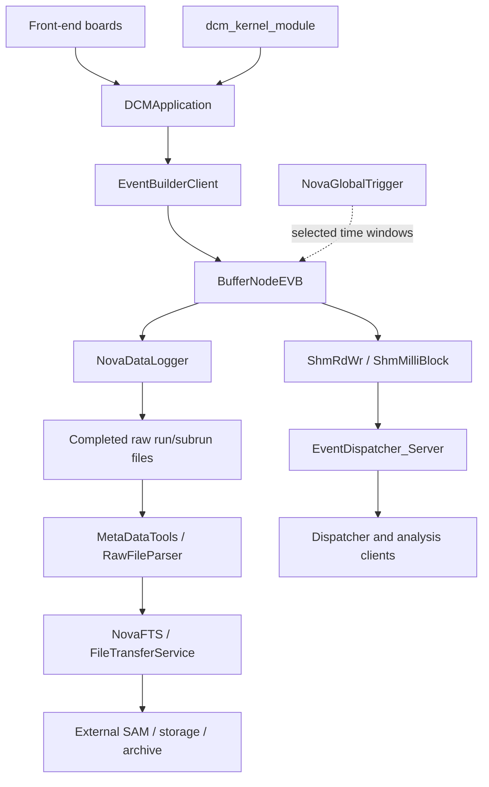
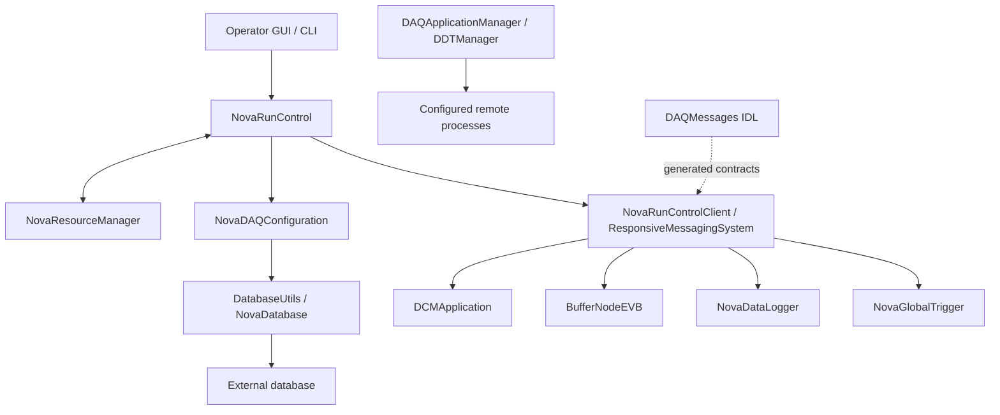
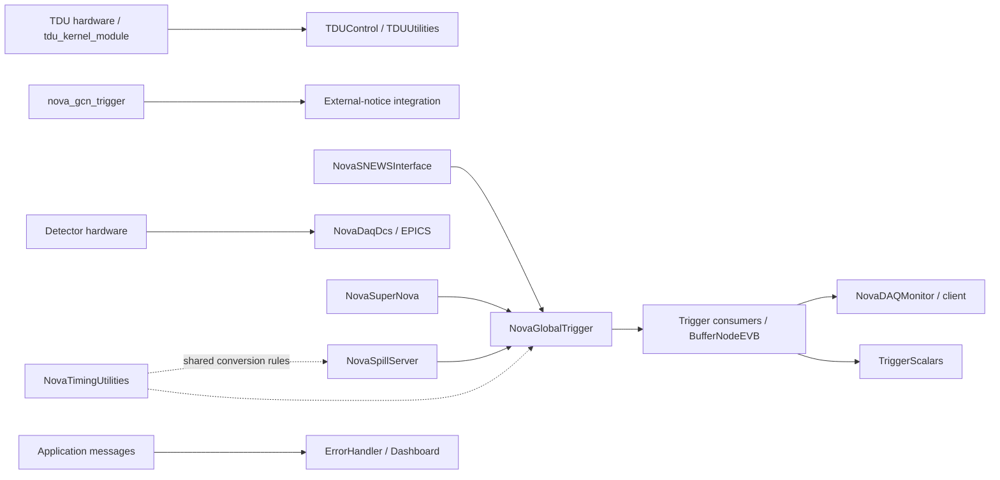

# System architecture

The workspace contains several generations of DAQ software. Similar names such as `EventBuilder`, `NovaEventBuilder`, and `BufferNodeEVB` describe distinct implementations; `_OLD` and `.old` trees are retained separately. The diagram below is a conceptual view of the buffer-node acquisition path, not proof that every node is deployed in one production configuration.

Solid arrows above describe data movement or service use. In the [generated dependency diagrams](dependencies.md), arrows instead mean **consumer → dependency**. The generated diagrams and evidence table are the authority for source/build relationships.

## Control and configuration

Resource selection, configuration generation, and process management have different responsibilities. A running process is not necessarily a configured participant, and a configured participant is not necessarily ready to start a run. Keep detector, DAQ partition, DDS partition, resource identity, and configuration identity consistent through the transition.

## Timing, triggers, and monitoring

Timing correctness depends on clock origin, tick frequency, leap handling, synchronization state, and calibrated delays. Monitoring must account for sample age: a last good value does not prove a currently healthy process. Message-driven actions should be tested with execution disabled before being enabled in an operational environment.

## Shared contracts and change impact

| Contract | Providers | Typical consumers / concerns |
| --- | --- | --- |
| Raw binary structures | DAQDataFormats | Acquisition, logger, parser, dispatcher, analysis; lengths, markers, checksums, versions |
| Detector/channel identifiers | DAQChannelMap, NovaDAQConventions | Configuration, metadata, diagnostics; geometry, enum values, canonical names |
| Control and trigger messages | DAQMessages, DAQMessagesZMQ, NovaMessageDefinitions | Matching schemas, native layout, partitions, endpoints, timeout behavior |
| Shared-memory layout | ShmRdWr, ShmMilliBlock | Segment geometry, overwrite policy, reader groups, semaphore ownership |
| Configuration/database schema | DatabaseUtils, NovaDatabase, NovaDAQConfiguration | Named/global IDs, transactions, generated XML, coherent rollback |
| Time representation | NovaTimingUtilities | Epoch, 64 MHz ticks, fractional time, boundary conversion |
| Build environment | SRT_ONLINE, setup, ups | External products, compiler ABI, architecture, qualifier, generated code |

Use the dependency explorer to identify direct consumers, then inspect their runtime role. A source include is evidence of coupling; it is not enough to establish whether a service is active or how urgently a change must be deployed.

## External systems and unavailable source

The repository set does not contain every required external product or deployed configuration. Examples include DDS implementations, EPICS, Qt, Boost, ROOT, Xerces/XSD tooling, PostgreSQL/libwda, Twisted/SAM, external archive/storage services, and board toolchains. The full release's top-level build and site credentials are not supplied by these 120 sibling repositories alone. Generated package pages link to declared build inputs and configuration artifacts without copying credentials.
