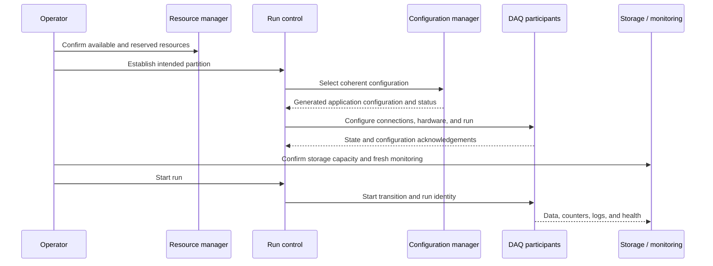

# Operations runbook

These procedures describe the responsibilities visible in source. Reconcile executable names, sites, release versions, host inventories, and service wrappers with the current deployment before executing them. Package-specific details are in the [catalog](../packages/index.md).

## Preflight

1. Record detector/site, DAQ partition, DDS partition, release/qualifier, configuration ID, and the intended host inventory. Identify the operator responsible for the transition.
2. Load the matching `setup` / `DAQOperationsTools` environment in a fresh shell. Verify required executables resolve from that release and the expected configuration and log roots exist.
3. Check management-network reachability, credentials, database connectivity, mounted output storage, available space, and log-write permissions. Consult `DAQClusterUtils` and the site power-on checklist for host/storage checks.
4. Confirm hardware firmware, loaded DCM/TDU modules, device permissions, timing synchronization, and calibration/delay settings. Inspect before writing registers or loading recipes.
5. Verify resource reservations and intended participant counts. Resolve stale reservations and conflicting writers before starting another instance.

## Start and configure

Bring up infrastructure and control services before dependent participants, using the site's wrappers rather than independent ad-hoc instances. Ensure the logger is ready before enabling upstream data flow. Follow the Run Control state machine for the exact transition order: do not issue a blanket start to every process based only on the conceptual sequence above.

At the first data, confirm the assigned run/subrun identity, configured participant count, incoming millislice activity, trigger rates, output file growth, and fresh monitor samples. Check both endpoints of each important connection; a successful launcher return or open socket does not demonstrate complete event delivery.

## During a run

| Surface | Evidence to inspect | Escalate when |
| --- | --- | --- |
| Run Control | Participant state/acknowledgements, run/subrun and configuration IDs | A participant disagrees or stops responding |
| Buffer nodes | Missing microslices/DCMs, dropped buffers, receive timeouts, retained history, logger connectivity | Persistent gaps, growing loss, or windows older than retained data |
| Logger | Write errors, stream counts, output growth, filesystem capacity | Writes fail, output stalls, or counts diverge |
| Timing and trigger | Synchronization/errors, last spill, enabled trigger masks, trigger counters | Timing disagreement, stale spill data, unexpected or absent triggers |
| DCS / cluster monitor | PV/metric age, thresholds, host and mount health | Inputs are stale or thresholds remain violated |
| Transfer service | Pending/failed queue, metadata errors, transfer retries, archive/CRC verification | Backlog grows or local storage approaches capacity |
| Operator displays | Last update time and data source | Display stops updating or disagrees with source logs |

Use the [issue register](../review/index.md) to identify known failure triggers. Save relevant logs, configuration identity, sample timestamps, and file checksums before restarting a failed component.

## Stop and drain

1. Request the supported stop transition through Run Control, allowing trigger/data production to stop in the intended order.
2. Wait for participant acknowledgements and buffered data to drain into the logger. Check for missing or still-active senders rather than assuming a quiet display means a complete drain.
3. Let the logger finalize run headers/tails and close streams. Compare final file size and event counts to the recorded metadata, and inspect reported write errors.
4. Permit transfer/catalog processing only for completed, validated files. Confirm durable archive state and checksums before local cleanup.
5. Shut down consumers and infrastructure in dependency order. Do not remove shared-memory segments, reservation state, or output files merely to make a restart succeed.

## Logs, files, and state to preserve

- Run Control logs, previous resource/configuration XML, run/subrun IDs, and generated per-application configuration.
- Logger output plus file-size/checksum evidence; never overwrite the only copy of a suspicious raw file while diagnosing it.
- Resource-manager persisted state and backups; compare reservations with actual live processes before restoring.
- RRD/PV history and alarm state/checkpoints; preserve SQLite and counter checkpoints as one logical unit for AshRiver alarms.
- FTS configuration, plugin version, failed/pending file inventory, metadata, and catalog/archive confirmation.
- Firmware image checksum, board identity, module/kernel version, and timing/delay settings before hardware maintenance.

## Commands and their scope

The suite does not provide a universal production start command because wrappers and targets differ by site. Use the source-linked entry points on each package page, verify their help and defaults, and select the current site wrapper. `--help` is not assumed side-effect free for arbitrary legacy scripts. Read-only local validation commands such as `bash -n script.sh` inspect syntax without executing the script; mocks and temporary directories are required for recovery/power/transfer tests.
