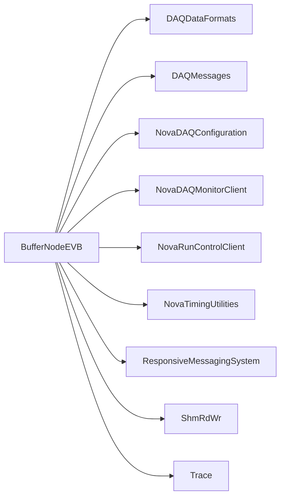

# BufferNodeEVB

Receives DCM millislices, assembles milliblocks in MegaPool, retains recent data, and selects windows requested by global triggers.

## Identity and scope

Repository: [NovaDAQ/BufferNodeEVB](https://github.com/NovaDAQ/BufferNodeEVB) · Reviewed commit: `9c9c0f3b21e37f9e726fa651c6b99284f2a5a14d` · Domain: **Data path**.

Tracked files: **92**. Production deployment and owner are **unconfirmed**.

## Operation

Run BufferNodeEVBapp only with the intended partition and connection/run configuration. Watch receive timeouts, missing microslices, retained-history depth, and downstream logger connectivity. Drain the run before restarting a node; its in-memory history cannot survive a restart.

For prerequisites, safe start/stop sequencing, health checks, and rollback see the [operations guide](../operations/index.md).

## Build and integration

This package uses the SRT/SoftRelTools release context. A standalone `make` in a fresh checkout is not a supported build recipe unless the required context is already configured. See [build and release](../operations/build.md).

| Build definition |
| --- |
| [GNUmakefile](https://github.com/NovaDAQ/BufferNodeEVB/blob/9c9c0f3b21e37f9e726fa651c6b99284f2a5a14d/GNUmakefile) |
| [c/GNUmakefile](https://github.com/NovaDAQ/BufferNodeEVB/blob/9c9c0f3b21e37f9e726fa651c6b99284f2a5a14d/c/GNUmakefile) |
| [c/src/GNUmakefile](https://github.com/NovaDAQ/BufferNodeEVB/blob/9c9c0f3b21e37f9e726fa651c6b99284f2a5a14d/c/src/GNUmakefile) |
| [cxx/GNUmakefile](https://github.com/NovaDAQ/BufferNodeEVB/blob/9c9c0f3b21e37f9e726fa651c6b99284f2a5a14d/cxx/GNUmakefile) |
| [cxx/src/GNUmakefile](https://github.com/NovaDAQ/BufferNodeEVB/blob/9c9c0f3b21e37f9e726fa651c6b99284f2a5a14d/cxx/src/GNUmakefile) |
| [cxx/test/GNUmakefile](https://github.com/NovaDAQ/BufferNodeEVB/blob/9c9c0f3b21e37f9e726fa651c6b99284f2a5a14d/cxx/test/GNUmakefile) |
| [cxx/unittest/GNUmakefile](https://github.com/NovaDAQ/BufferNodeEVB/blob/9c9c0f3b21e37f9e726fa651c6b99284f2a5a14d/cxx/unittest/GNUmakefile) |
| [script/GNUmakefile](https://github.com/NovaDAQ/BufferNodeEVB/blob/9c9c0f3b21e37f9e726fa651c6b99284f2a5a14d/script/GNUmakefile) |

## Entry points

These are source entry points or operational scripts found statically. Installation names and enabled targets depend on the build/configuration; listing a script does not establish that it is deployed.

| Source |
| --- |
| [c/src/cdpr.c](https://github.com/NovaDAQ/BufferNodeEVB/blob/9c9c0f3b21e37f9e726fa651c6b99284f2a5a14d/c/src/cdpr.c) |
| [c/src/conffile.c](https://github.com/NovaDAQ/BufferNodeEVB/blob/9c9c0f3b21e37f9e726fa651c6b99284f2a5a14d/c/src/conffile.c) |
| [c/src/trace_cntl.c](https://github.com/NovaDAQ/BufferNodeEVB/blob/9c9c0f3b21e37f9e726fa651c6b99284f2a5a14d/c/src/trace_cntl.c) |
| [cxx/src/BufferNodeEVBapp.cc](https://github.com/NovaDAQ/BufferNodeEVB/blob/9c9c0f3b21e37f9e726fa651c6b99284f2a5a14d/cxx/src/BufferNodeEVBapp.cc) |
| [cxx/src/bnevb_shm_rd.cc](https://github.com/NovaDAQ/BufferNodeEVB/blob/9c9c0f3b21e37f9e726fa651c6b99284f2a5a14d/cxx/src/bnevb_shm_rd.cc) |
| [script/cfgrstep_1dcm_1tdu_TimeMarkers.py](https://github.com/NovaDAQ/BufferNodeEVB/blob/9c9c0f3b21e37f9e726fa651c6b99284f2a5a14d/script/cfgrstep_1dcm_1tdu_TimeMarkers.py) |
| [script/cfgrstep_dcmControl_dcs_1dcm_1tdu.py](https://github.com/NovaDAQ/BufferNodeEVB/blob/9c9c0f3b21e37f9e726fa651c6b99284f2a5a14d/script/cfgrstep_dcmControl_dcs_1dcm_1tdu.py) |
| [script/cfgrstep_dcmControl_dcs_1node_internal.py](https://github.com/NovaDAQ/BufferNodeEVB/blob/9c9c0f3b21e37f9e726fa651c6b99284f2a5a14d/script/cfgrstep_dcmControl_dcs_1node_internal.py) |
| [script/cfgrstep_dcmControl_dso.py](https://github.com/NovaDAQ/BufferNodeEVB/blob/9c9c0f3b21e37f9e726fa651c6b99284f2a5a14d/script/cfgrstep_dcmControl_dso.py) |
| [script/dcm_code.sh](https://github.com/NovaDAQ/BufferNodeEVB/blob/9c9c0f3b21e37f9e726fa651c6b99284f2a5a14d/script/dcm_code.sh) |
| [script/extern_timing.py](https://github.com/NovaDAQ/BufferNodeEVB/blob/9c9c0f3b21e37f9e726fa651c6b99284f2a5a14d/script/extern_timing.py) |
| [script/fix_dev20111209a.sh](https://github.com/NovaDAQ/BufferNodeEVB/blob/9c9c0f3b21e37f9e726fa651c6b99284f2a5a14d/script/fix_dev20111209a.sh) |
| [script/integtest.sh](https://github.com/NovaDAQ/BufferNodeEVB/blob/9c9c0f3b21e37f9e726fa651c6b99284f2a5a14d/script/integtest.sh) |
| [script/master_tdu_test.sh](https://github.com/NovaDAQ/BufferNodeEVB/blob/9c9c0f3b21e37f9e726fa651c6b99284f2a5a14d/script/master_tdu_test.sh) |
| [script/no_reprogram.py](https://github.com/NovaDAQ/BufferNodeEVB/blob/9c9c0f3b21e37f9e726fa651c6b99284f2a5a14d/script/no_reprogram.py) |
| [script/no_reprogram_external.py](https://github.com/NovaDAQ/BufferNodeEVB/blob/9c9c0f3b21e37f9e726fa651c6b99284f2a5a14d/script/no_reprogram_external.py) |
| [script/rstep.py](https://github.com/NovaDAQ/BufferNodeEVB/blob/9c9c0f3b21e37f9e726fa651c6b99284f2a5a14d/script/rstep.py) |

## Interfaces

Headers and declared types form the API navigation map. Follow the source for method signatures, ownership, units, and error contracts. Generated DDS/XSD types are built from the schemas in the next section.

| Header | Declared types |
| --- | --- |
| [c/src/cdp.h](https://github.com/NovaDAQ/BufferNodeEVB/blob/9c9c0f3b21e37f9e726fa651c6b99284f2a5a14d/c/src/cdp.h) | Functions, constants, or templates |
| [c/src/cdpr.h](https://github.com/NovaDAQ/BufferNodeEVB/blob/9c9c0f3b21e37f9e726fa651c6b99284f2a5a14d/c/src/cdpr.h) | `pcap_pkthdr`, `singleton` |
| [cxx/include/MilliBlock.h](https://github.com/NovaDAQ/BufferNodeEVB/blob/9c9c0f3b21e37f9e726fa651c6b99284f2a5a14d/cxx/include/MilliBlock.h) | `MilliBlock` |
| [cxx/include/MsgPipe.h](https://github.com/NovaDAQ/BufferNodeEVB/blob/9c9c0f3b21e37f9e726fa651c6b99284f2a5a14d/cxx/include/MsgPipe.h) | `MsgPipe` |
| [cxx/include/SampleGTC.h](https://github.com/NovaDAQ/BufferNodeEVB/blob/9c9c0f3b21e37f9e726fa651c6b99284f2a5a14d/cxx/include/SampleGTC.h) | `SampleGTC` |
| [cxx/include/Selector.h](https://github.com/NovaDAQ/BufferNodeEVB/blob/9c9c0f3b21e37f9e726fa651c6b99284f2a5a14d/cxx/include/Selector.h) | `Client`, `PollEvent`, `Selector` |
| [cxx/include/TCPConnect.h](https://github.com/NovaDAQ/BufferNodeEVB/blob/9c9c0f3b21e37f9e726fa651c6b99284f2a5a14d/cxx/include/TCPConnect.h) | Functions, constants, or templates |
| [cxx/include/TCP_listen_fd.h](https://github.com/NovaDAQ/BufferNodeEVB/blob/9c9c0f3b21e37f9e726fa651c6b99284f2a5a14d/cxx/include/TCP_listen_fd.h) | Functions, constants, or templates |
| [cxx/include/ThreadMulticastPipe.h](https://github.com/NovaDAQ/BufferNodeEVB/blob/9c9c0f3b21e37f9e726fa651c6b99284f2a5a14d/cxx/include/ThreadMulticastPipe.h) | `BasicMulticast` |
| [cxx/include/Timeout.h](https://github.com/NovaDAQ/BufferNodeEVB/blob/9c9c0f3b21e37f9e726fa651c6b99284f2a5a14d/cxx/include/Timeout.h) | `Client`, `Timeout`, `timeoutspec`, `timeoutspec_tagdesc` |
| [cxx/include/Trace_BNEVB.h](https://github.com/NovaDAQ/BufferNodeEVB/blob/9c9c0f3b21e37f9e726fa651c6b99284f2a5a14d/cxx/include/Trace_BNEVB.h) | `timeval`, `traceNamLvls_s` |
| [cxx/include/UDP_bound_fd.h](https://github.com/NovaDAQ/BufferNodeEVB/blob/9c9c0f3b21e37f9e726fa651c6b99284f2a5a14d/cxx/include/UDP_bound_fd.h) | Functions, constants, or templates |
| [cxx/include/trace.h](https://github.com/NovaDAQ/BufferNodeEVB/blob/9c9c0f3b21e37f9e726fa651c6b99284f2a5a14d/cxx/include/trace.h) | `traceControl_s`, `traceEntryHdr_s`, `traceNamLvls_s` |
| [cxx/src/BNEVBConf.h](https://github.com/NovaDAQ/BufferNodeEVB/blob/9c9c0f3b21e37f9e726fa651c6b99284f2a5a14d/cxx/src/BNEVBConf.h) | `BNEVBConf` |
| [cxx/src/BNEVBMilliBlock.h](https://github.com/NovaDAQ/BufferNodeEVB/blob/9c9c0f3b21e37f9e726fa651c6b99284f2a5a14d/cxx/src/BNEVBMilliBlock.h) | `BNEVBMilliBlock`, `milliblock_sts` |
| [cxx/src/BNEVBStats.h](https://github.com/NovaDAQ/BufferNodeEVB/blob/9c9c0f3b21e37f9e726fa651c6b99284f2a5a14d/cxx/src/BNEVBStats.h) | `BNEVBStats` |
| [cxx/src/BufferNodeEVB.h](https://github.com/NovaDAQ/BufferNodeEVB/blob/9c9c0f3b21e37f9e726fa651c6b99284f2a5a14d/cxx/src/BufferNodeEVB.h) | `BufferNodeEVB` |
| [cxx/src/BufferNodeEVBoptions.h](https://github.com/NovaDAQ/BufferNodeEVB/blob/9c9c0f3b21e37f9e726fa651c6b99284f2a5a14d/cxx/src/BufferNodeEVBoptions.h) | `BufferNodeEVBoptions` |
| [cxx/src/MegaPool.h](https://github.com/NovaDAQ/BufferNodeEVB/blob/9c9c0f3b21e37f9e726fa651c6b99284f2a5a14d/cxx/src/MegaPool.h) | `InternalTrigger`, `MegaPool` |
| [cxx/src/MilliSliceReader.h](https://github.com/NovaDAQ/BufferNodeEVB/blob/9c9c0f3b21e37f9e726fa651c6b99284f2a5a14d/cxx/src/MilliSliceReader.h) | `MilliSliceReader` |
| [cxx/src/RcvMilliBlkThread2MegaPoolThread.h](https://github.com/NovaDAQ/BufferNodeEVB/blob/9c9c0f3b21e37f9e726fa651c6b99284f2a5a14d/cxx/src/RcvMilliBlkThread2MegaPoolThread.h) | `RcvMilliBlkThread2MegaPoolThread` |
| [cxx/src/SampleRCC.h](https://github.com/NovaDAQ/BufferNodeEVB/blob/9c9c0f3b21e37f9e726fa651c6b99284f2a5a14d/cxx/src/SampleRCC.h) | `SampleRCC` |
| [cxx/src/dprint.h](https://github.com/NovaDAQ/BufferNodeEVB/blob/9c9c0f3b21e37f9e726fa651c6b99284f2a5a14d/cxx/src/dprint.h) | Functions, constants, or templates |

## Configuration and data contracts

No separate XML/IDL/XSD/FHiCL/INI/YAML/JSON configuration was identified. Inspect command-line parsing and site launchers for this package; defaults may be embedded in source.

## Environment and external dependencies

Environment names below are literal lookups found in source, not a guarantee that every value is mandatory. No environment values or credentials are copied into this documentation.

| Variable | Evidence |
| --- | --- |
| `LOGNAME` | [cxx/include/trace.h:804](https://github.com/NovaDAQ/BufferNodeEVB/blob/9c9c0f3b21e37f9e726fa651c6b99284f2a5a14d/cxx/include/trace.h#L804) |
| `OSPL_URI` | [script/integtest.sh:278](https://github.com/NovaDAQ/BufferNodeEVB/blob/9c9c0f3b21e37f9e726fa651c6b99284f2a5a14d/script/integtest.sh#L278) |
| `PWD` | [script/rstep.py:485](https://github.com/NovaDAQ/BufferNodeEVB/blob/9c9c0f3b21e37f9e726fa651c6b99284f2a5a14d/script/rstep.py#L485) |
| `SRT_PRIVATE_CONTEXT` | [cxx/src/BufferNodeEVBapp.cc:381](https://github.com/NovaDAQ/BufferNodeEVB/blob/9c9c0f3b21e37f9e726fa651c6b99284f2a5a14d/cxx/src/BufferNodeEVBapp.cc#L381) |
| `SRT_PUBLIC_CONTEXT` | [cxx/src/BufferNodeEVBapp.cc:381](https://github.com/NovaDAQ/BufferNodeEVB/blob/9c9c0f3b21e37f9e726fa651c6b99284f2a5a14d/cxx/src/BufferNodeEVBapp.cc#L381) |
| `TRACE_ARGSMAX` | [cxx/include/trace.h:948](https://github.com/NovaDAQ/BufferNodeEVB/blob/9c9c0f3b21e37f9e726fa651c6b99284f2a5a14d/cxx/include/trace.h#L948) |
| `TRACE_CONF` | [cxx/include/trace.h:944](https://github.com/NovaDAQ/BufferNodeEVB/blob/9c9c0f3b21e37f9e726fa651c6b99284f2a5a14d/cxx/include/trace.h#L944) |
| `TRACE_FILE` | [cxx/include/trace.h:947](https://github.com/NovaDAQ/BufferNodeEVB/blob/9c9c0f3b21e37f9e726fa651c6b99284f2a5a14d/cxx/include/trace.h#L947) |
| `TRACE_LVLS` | [cxx/include/trace.h:975](https://github.com/NovaDAQ/BufferNodeEVB/blob/9c9c0f3b21e37f9e726fa651c6b99284f2a5a14d/cxx/include/trace.h#L975) |
| `TRACE_MSGMAX` | [cxx/include/trace.h:950](https://github.com/NovaDAQ/BufferNodeEVB/blob/9c9c0f3b21e37f9e726fa651c6b99284f2a5a14d/cxx/include/trace.h#L950) |
| `TRACE_NAME` | [cxx/include/trace.h:945](https://github.com/NovaDAQ/BufferNodeEVB/blob/9c9c0f3b21e37f9e726fa651c6b99284f2a5a14d/cxx/include/trace.h#L945) |
| `TRACE_NAMTBLENTS` | [cxx/include/trace.h:952](https://github.com/NovaDAQ/BufferNodeEVB/blob/9c9c0f3b21e37f9e726fa651c6b99284f2a5a14d/cxx/include/trace.h#L952) |
| `TRACE_NUMENTS` | [cxx/include/trace.h:951](https://github.com/NovaDAQ/BufferNodeEVB/blob/9c9c0f3b21e37f9e726fa651c6b99284f2a5a14d/cxx/include/trace.h#L951) |
| `TRACE_PRINT_FD` | [cxx/include/trace.h:955](https://github.com/NovaDAQ/BufferNodeEVB/blob/9c9c0f3b21e37f9e726fa651c6b99284f2a5a14d/cxx/include/trace.h#L955) |
| `TRACE_SHOW` | [c/src/trace_cntl.c:746](https://github.com/NovaDAQ/BufferNodeEVB/blob/9c9c0f3b21e37f9e726fa651c6b99284f2a5a14d/c/src/trace_cntl.c#L746) |

Unresolved/non-package include roots (some are system or generated headers; this is not a package-manager lockfile):

| Include root | Evidence |
| --- | --- |
| `..` | [cxx/include/ThreadMulticastPipe.h:12](https://github.com/NovaDAQ/BufferNodeEVB/blob/9c9c0f3b21e37f9e726fa651c6b99284f2a5a14d/cxx/include/ThreadMulticastPipe.h#L12) |
| `arpa` | [c/src/cdpr.c:71](https://github.com/NovaDAQ/BufferNodeEVB/blob/9c9c0f3b21e37f9e726fa651c6b99284f2a5a14d/c/src/cdpr.c#L71) |
| `boost` | [cxx/include/SampleGTC.h:10](https://github.com/NovaDAQ/BufferNodeEVB/blob/9c9c0f3b21e37f9e726fa651c6b99284f2a5a14d/cxx/include/SampleGTC.h#L10) |
| `linux` | [cxx/include/trace.h:78](https://github.com/NovaDAQ/BufferNodeEVB/blob/9c9c0f3b21e37f9e726fa651c6b99284f2a5a14d/cxx/include/trace.h#L78) |
| `messagefacility` | [cxx/include/SampleGTC.h:14](https://github.com/NovaDAQ/BufferNodeEVB/blob/9c9c0f3b21e37f9e726fa651c6b99284f2a5a14d/cxx/include/SampleGTC.h#L14) |
| `net` | [c/src/cdpr.c:75](https://github.com/NovaDAQ/BufferNodeEVB/blob/9c9c0f3b21e37f9e726fa651c6b99284f2a5a14d/c/src/cdpr.c#L75) |
| `netinet` | [c/src/cdp.h:24](https://github.com/NovaDAQ/BufferNodeEVB/blob/9c9c0f3b21e37f9e726fa651c6b99284f2a5a14d/c/src/cdp.h#L24) |
| `sys` | [c/src/cdpr.c:70](https://github.com/NovaDAQ/BufferNodeEVB/blob/9c9c0f3b21e37f9e726fa651c6b99284f2a5a14d/c/src/cdpr.c#L70) |

## Package dependencies

Arrow direction is **consumer → dependency**. This diagram includes source/build/runtime relationships and excludes test-only, release-membership, and build-tool edges. Conditional branches are not evaluated.

| Dependency | Relationship | Evidence |
| --- | --- | --- |
| [DAQDataFormats](DAQDataFormats.md) | build link | [cxx/src/GNUmakefile:32](https://github.com/NovaDAQ/BufferNodeEVB/blob/9c9c0f3b21e37f9e726fa651c6b99284f2a5a14d/cxx/src/GNUmakefile#L32) |
| [DAQDataFormats](DAQDataFormats.md) | source include | [cxx/include/MilliBlock.h:11](https://github.com/NovaDAQ/BufferNodeEVB/blob/9c9c0f3b21e37f9e726fa651c6b99284f2a5a14d/cxx/include/MilliBlock.h#L11) |
| [DAQDataFormats](DAQDataFormats.md) | test include | [cxx/test/SimulatedDataLogger.cc:10](https://github.com/NovaDAQ/BufferNodeEVB/blob/9c9c0f3b21e37f9e726fa651c6b99284f2a5a14d/cxx/test/SimulatedDataLogger.cc#L10) |
| [DAQDataFormats](DAQDataFormats.md) | test link | [cxx/test/GNUmakefile:17](https://github.com/NovaDAQ/BufferNodeEVB/blob/9c9c0f3b21e37f9e726fa651c6b99284f2a5a14d/cxx/test/GNUmakefile#L17) |
| [DAQMessages](DAQMessages.md) | build link | [cxx/src/GNUmakefile:27](https://github.com/NovaDAQ/BufferNodeEVB/blob/9c9c0f3b21e37f9e726fa651c6b99284f2a5a14d/cxx/src/GNUmakefile#L27) |
| [DAQMessages](DAQMessages.md) | source include | [cxx/include/SampleGTC.h:13](https://github.com/NovaDAQ/BufferNodeEVB/blob/9c9c0f3b21e37f9e726fa651c6b99284f2a5a14d/cxx/include/SampleGTC.h#L13) |
| [DAQMessages](DAQMessages.md) | test include | [cxx/test/sendTriggerMessages.cc:23](https://github.com/NovaDAQ/BufferNodeEVB/blob/9c9c0f3b21e37f9e726fa651c6b99284f2a5a14d/cxx/test/sendTriggerMessages.cc#L23) |
| [DAQMessages](DAQMessages.md) | test link | [cxx/test/GNUmakefile:21](https://github.com/NovaDAQ/BufferNodeEVB/blob/9c9c0f3b21e37f9e726fa651c6b99284f2a5a14d/cxx/test/GNUmakefile#L21) |
| [NovaDAQConfiguration](NovaDAQConfiguration.md) | build link | [cxx/src/GNUmakefile:33](https://github.com/NovaDAQ/BufferNodeEVB/blob/9c9c0f3b21e37f9e726fa651c6b99284f2a5a14d/cxx/src/GNUmakefile#L33) |
| [NovaDAQConfiguration](NovaDAQConfiguration.md) | source include | [cxx/src/SampleRCC.cpp:12](https://github.com/NovaDAQ/BufferNodeEVB/blob/9c9c0f3b21e37f9e726fa651c6b99284f2a5a14d/cxx/src/SampleRCC.cpp#L12) |
| [NovaDAQMonitorClient](NovaDAQMonitorClient.md) | source include | [cxx/src/MegaPool.h:21](https://github.com/NovaDAQ/BufferNodeEVB/blob/9c9c0f3b21e37f9e726fa651c6b99284f2a5a14d/cxx/src/MegaPool.h#L21) |
| [NovaDAQUtilities](NovaDAQUtilities.md) | test include | [cxx/test/sendTriggerMessages.cc:26](https://github.com/NovaDAQ/BufferNodeEVB/blob/9c9c0f3b21e37f9e726fa651c6b99284f2a5a14d/cxx/test/sendTriggerMessages.cc#L26) |
| [NovaGlobalTrigger](NovaGlobalTrigger.md) | test include | [cxx/test/sendTriggerMessages.cc:25](https://github.com/NovaDAQ/BufferNodeEVB/blob/9c9c0f3b21e37f9e726fa651c6b99284f2a5a14d/cxx/test/sendTriggerMessages.cc#L25) |
| [NovaGlobalTrigger](NovaGlobalTrigger.md) | test link | [cxx/test/GNUmakefile:20](https://github.com/NovaDAQ/BufferNodeEVB/blob/9c9c0f3b21e37f9e726fa651c6b99284f2a5a14d/cxx/test/GNUmakefile#L20) |
| [NovaRunControlClient](NovaRunControlClient.md) | build link | [cxx/src/GNUmakefile:26](https://github.com/NovaDAQ/BufferNodeEVB/blob/9c9c0f3b21e37f9e726fa651c6b99284f2a5a14d/cxx/src/GNUmakefile#L26) |
| [NovaRunControlClient](NovaRunControlClient.md) | source include | [cxx/include/SampleGTC.h:12](https://github.com/NovaDAQ/BufferNodeEVB/blob/9c9c0f3b21e37f9e726fa651c6b99284f2a5a14d/cxx/include/SampleGTC.h#L12) |
| [NovaTimingUtilities](NovaTimingUtilities.md) | build link | [cxx/src/GNUmakefile:31](https://github.com/NovaDAQ/BufferNodeEVB/blob/9c9c0f3b21e37f9e726fa651c6b99284f2a5a14d/cxx/src/GNUmakefile#L31) |
| [NovaTimingUtilities](NovaTimingUtilities.md) | source include | [cxx/src/MegaPool.cpp:16](https://github.com/NovaDAQ/BufferNodeEVB/blob/9c9c0f3b21e37f9e726fa651c6b99284f2a5a14d/cxx/src/MegaPool.cpp#L16) |
| [NovaTimingUtilities](NovaTimingUtilities.md) | test include | [cxx/test/SimulatedDataLogger.cc:20](https://github.com/NovaDAQ/BufferNodeEVB/blob/9c9c0f3b21e37f9e726fa651c6b99284f2a5a14d/cxx/test/SimulatedDataLogger.cc#L20) |
| [NovaTimingUtilities](NovaTimingUtilities.md) | test link | [cxx/test/GNUmakefile:18](https://github.com/NovaDAQ/BufferNodeEVB/blob/9c9c0f3b21e37f9e726fa651c6b99284f2a5a14d/cxx/test/GNUmakefile#L18) |
| [ResponsiveMessagingSystem](ResponsiveMessagingSystem.md) | source include | [cxx/src/SampleGTC.cpp:11](https://github.com/NovaDAQ/BufferNodeEVB/blob/9c9c0f3b21e37f9e726fa651c6b99284f2a5a14d/cxx/src/SampleGTC.cpp#L11) |
| [ResponsiveMessagingSystem](ResponsiveMessagingSystem.md) | test include | [cxx/test/sendTriggerMessages.cc:7](https://github.com/NovaDAQ/BufferNodeEVB/blob/9c9c0f3b21e37f9e726fa651c6b99284f2a5a14d/cxx/test/sendTriggerMessages.cc#L7) |
| [SRT_ONLINE](SRT_ONLINE.md) | build tool | [GNUmakefile:10](https://github.com/NovaDAQ/BufferNodeEVB/blob/9c9c0f3b21e37f9e726fa651c6b99284f2a5a14d/GNUmakefile#L10) |
| [ShmRdWr](ShmRdWr.md) | build link | [cxx/src/GNUmakefile:29](https://github.com/NovaDAQ/BufferNodeEVB/blob/9c9c0f3b21e37f9e726fa651c6b99284f2a5a14d/cxx/src/GNUmakefile#L29) |
| [ShmRdWr](ShmRdWr.md) | source include | [cxx/src/MegaPool.h:13](https://github.com/NovaDAQ/BufferNodeEVB/blob/9c9c0f3b21e37f9e726fa651c6b99284f2a5a14d/cxx/src/MegaPool.h#L13) |
| [Trace](Trace.md) | build link | [cxx/src/GNUmakefile:30](https://github.com/NovaDAQ/BufferNodeEVB/blob/9c9c0f3b21e37f9e726fa651c6b99284f2a5a14d/cxx/src/GNUmakefile#L30) |
| [Trace](Trace.md) | test link | [cxx/test/GNUmakefile:19](https://github.com/NovaDAQ/BufferNodeEVB/blob/9c9c0f3b21e37f9e726fa651c6b99284f2a5a14d/cxx/test/GNUmakefile#L19) |

Direct consumers: [DAQApplicationManager](DAQApplicationManager.md), [DAQSimulationManager](DAQSimulationManager.md), [NDLTest](NDLTest.md), [NovaDataLogger](NovaDataLogger.md), [NovaRunControl](NovaRunControl.md).

Explore upstream/downstream impact in the [dependency explorer](../architecture/explorer.md).

## Validation and review

Static analysis attempted **30 C/C++ translation units**, **4 shell scripts**, and parsed **8 Python files**. Counts are tool input coverage, not proof of successful compilation or exhaustive review. Source/build/configuration inventories and the operating surface were also assessed.

| Severity | Finding | GitHub |
| --- | --- | --- |
| P1 | [NDAQ-007: Handle summary windows older than retained missed-buffer history](../review/issues/NDAQ-007.md) | [Issue](https://github.com/NovaDAQ/BufferNodeEVB/issues/1) |

Existing test/example sources (not executed against production):

| Source |
| --- |
| [cxx/test/OldTimeout.cpp](https://github.com/NovaDAQ/BufferNodeEVB/blob/9c9c0f3b21e37f9e726fa651c6b99284f2a5a14d/cxx/test/OldTimeout.cpp) |
| [cxx/test/OldTimeout.h](https://github.com/NovaDAQ/BufferNodeEVB/blob/9c9c0f3b21e37f9e726fa651c6b99284f2a5a14d/cxx/test/OldTimeout.h) |
| [cxx/test/SimulatedDataLogger.cc](https://github.com/NovaDAQ/BufferNodeEVB/blob/9c9c0f3b21e37f9e726fa651c6b99284f2a5a14d/cxx/test/SimulatedDataLogger.cc) |
| [cxx/test/SimulatedMillisliceSender.cc](https://github.com/NovaDAQ/BufferNodeEVB/blob/9c9c0f3b21e37f9e726fa651c6b99284f2a5a14d/cxx/test/SimulatedMillisliceSender.cc) |
| [cxx/test/SimulatedMillisliceSender2.cc](https://github.com/NovaDAQ/BufferNodeEVB/blob/9c9c0f3b21e37f9e726fa651c6b99284f2a5a14d/cxx/test/SimulatedMillisliceSender2.cc) |
| [cxx/test/ThreadMulticastPipeTest.cc](https://github.com/NovaDAQ/BufferNodeEVB/blob/9c9c0f3b21e37f9e726fa651c6b99284f2a5a14d/cxx/test/ThreadMulticastPipeTest.cc) |
| [cxx/test/Timeout.cpp](https://github.com/NovaDAQ/BufferNodeEVB/blob/9c9c0f3b21e37f9e726fa651c6b99284f2a5a14d/cxx/test/Timeout.cpp) |
| [cxx/test/Timeout.h](https://github.com/NovaDAQ/BufferNodeEVB/blob/9c9c0f3b21e37f9e726fa651c6b99284f2a5a14d/cxx/test/Timeout.h) |
| [cxx/test/TimeoutTest.cc](https://github.com/NovaDAQ/BufferNodeEVB/blob/9c9c0f3b21e37f9e726fa651c6b99284f2a5a14d/cxx/test/TimeoutTest.cc) |
| [cxx/test/invalid_pointer.cc](https://github.com/NovaDAQ/BufferNodeEVB/blob/9c9c0f3b21e37f9e726fa651c6b99284f2a5a14d/cxx/test/invalid_pointer.cc) |
| [cxx/test/sendTriggerMessages.cc](https://github.com/NovaDAQ/BufferNodeEVB/blob/9c9c0f3b21e37f9e726fa651c6b99284f2a5a14d/cxx/test/sendTriggerMessages.cc) |

## Existing documentation

| Source |
| --- |
| [doc/StopRun_incomplete_milliblock.txt](https://github.com/NovaDAQ/BufferNodeEVB/blob/9c9c0f3b21e37f9e726fa651c6b99284f2a5a14d/doc/StopRun_incomplete_milliblock.txt) |
| [doc/SummaryBlock.txt](https://github.com/NovaDAQ/BufferNodeEVB/blob/9c9c0f3b21e37f9e726fa651c6b99284f2a5a14d/doc/SummaryBlock.txt) |
| [doc/TS_time_sync_DCS_conflict.txt](https://github.com/NovaDAQ/BufferNodeEVB/blob/9c9c0f3b21e37f9e726fa651c6b99284f2a5a14d/doc/TS_time_sync_DCS_conflict.txt) |
| [doc/testing_and_results.txt](https://github.com/NovaDAQ/BufferNodeEVB/blob/9c9c0f3b21e37f9e726fa651c6b99284f2a5a14d/doc/testing_and_results.txt) |
