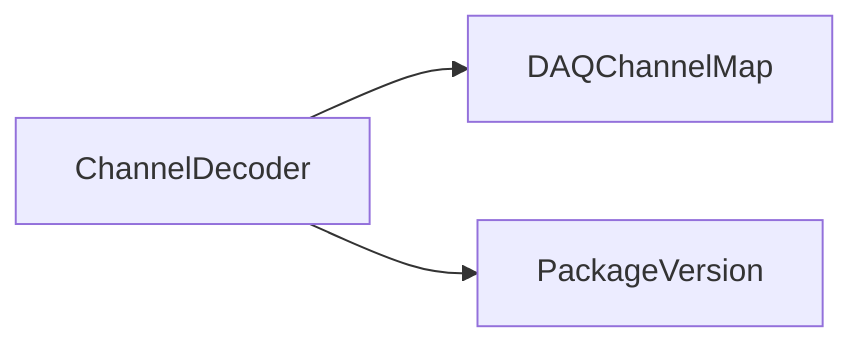

# ChannelDecoder

Qt utility for translating logical and electronics channel identifiers.

## Identity and scope

Repository: [NovaDAQ/ChannelDecoder](https://github.com/NovaDAQ/ChannelDecoder) · Reviewed commit: `63bf86485a2c14b3423b43d7c3ecc68bc408cca5` · Domain: **Analysis**.

Tracked files: **13**. Production deployment and owner are **unconfirmed**.

## Operation

Use with the correct detector map and compare a known channel in both directions. A wrong detector selection can produce plausible but incorrect identifiers; this is an interactive tool, not a daemon.

For prerequisites, safe start/stop sequencing, health checks, and rollback see the [operations guide](../operations/index.md).

## Build and integration

| Build definition |
| --- |
| [ChannelDecoder.pro](https://github.com/NovaDAQ/ChannelDecoder/blob/63bf86485a2c14b3423b43d7c3ecc68bc408cca5/ChannelDecoder.pro) |
| [Makefile](https://github.com/NovaDAQ/ChannelDecoder/blob/63bf86485a2c14b3423b43d7c3ecc68bc408cca5/Makefile) |

## Entry points

These are source entry points or operational scripts found statically. Installation names and enabled targets depend on the build/configuration; listing a script does not establish that it is deployed.

| Source |
| --- |
| [main.cc](https://github.com/NovaDAQ/ChannelDecoder/blob/63bf86485a2c14b3423b43d7c3ecc68bc408cca5/main.cc) |

## Interfaces

Headers and declared types form the API navigation map. Follow the source for method signatures, ownership, units, and error contracts. Generated DDS/XSD types are built from the schemas in the next section.

| Header | Declared types |
| --- | --- |
| [AboutDialog.h](https://github.com/NovaDAQ/ChannelDecoder/blob/63bf86485a2c14b3423b43d7c3ecc68bc408cca5/AboutDialog.h) | `AboutDialog` |
| [ChannelDecoder.h](https://github.com/NovaDAQ/ChannelDecoder/blob/63bf86485a2c14b3423b43d7c3ecc68bc408cca5/ChannelDecoder.h) | `ChannelDecoder` |
| [version.h](https://github.com/NovaDAQ/ChannelDecoder/blob/63bf86485a2c14b3423b43d7c3ecc68bc408cca5/version.h) | Functions, constants, or templates |

## Configuration and data contracts

No separate XML/IDL/XSD/FHiCL/INI/YAML/JSON configuration was identified. Inspect command-line parsing and site launchers for this package; defaults may be embedded in source.

## Environment and external dependencies

Environment names below are literal lookups found in source, not a guarantee that every value is mandatory. No environment values or credentials are copied into this documentation.

No literal environment lookup was identified by this scan; shell setup scripts may still provide required values.

Unresolved/non-package include roots (some are system or generated headers; this is not a package-manager lockfile):

| Include root | Evidence |
| --- | --- |
| `sys` | [ChannelDecoder.cpp:3](https://github.com/NovaDAQ/ChannelDecoder/blob/63bf86485a2c14b3423b43d7c3ecc68bc408cca5/ChannelDecoder.cpp#L3) |

## Package dependencies

Arrow direction is **consumer → dependency**. This diagram includes source/build/runtime relationships and excludes test-only, release-membership, and build-tool edges. Conditional branches are not evaluated.

| Dependency | Relationship | Evidence |
| --- | --- | --- |
| [DAQChannelMap](DAQChannelMap.md) | build link | [ChannelDecoder.pro:17](https://github.com/NovaDAQ/ChannelDecoder/blob/63bf86485a2c14b3423b43d7c3ecc68bc408cca5/ChannelDecoder.pro#L17) |
| [DAQChannelMap](DAQChannelMap.md) | source include | [ChannelDecoder.h:8](https://github.com/NovaDAQ/ChannelDecoder/blob/63bf86485a2c14b3423b43d7c3ecc68bc408cca5/ChannelDecoder.h#L8) |
| [PackageVersion](PackageVersion.md) | build link | [ChannelDecoder.pro:17](https://github.com/NovaDAQ/ChannelDecoder/blob/63bf86485a2c14b3423b43d7c3ecc68bc408cca5/ChannelDecoder.pro#L17) |
| [PackageVersion](PackageVersion.md) | source include | [version.h:28](https://github.com/NovaDAQ/ChannelDecoder/blob/63bf86485a2c14b3423b43d7c3ecc68bc408cca5/version.h#L28) |

Direct consumers: None resolved in this snapshot.

Explore upstream/downstream impact in the [dependency explorer](../architecture/explorer.md).

## Validation and review

Static analysis attempted **3 C/C++ translation units**, **0 shell scripts**, and parsed **0 Python files**. Counts are tool input coverage, not proof of successful compilation or exhaustive review. Source/build/configuration inventories and the operating surface were also assessed.

No actionable defect was confirmed for this package in this review. This is a bounded review result, not a clean bill of health; unvalidated analyzer diagnostics were not filed as bugs.

Existing test/example sources (not executed against production):

No test/example source identified in the scoped inventory.

## Existing documentation

No package README/manual identified in the scoped inventory. Use this page and the source interfaces above.
