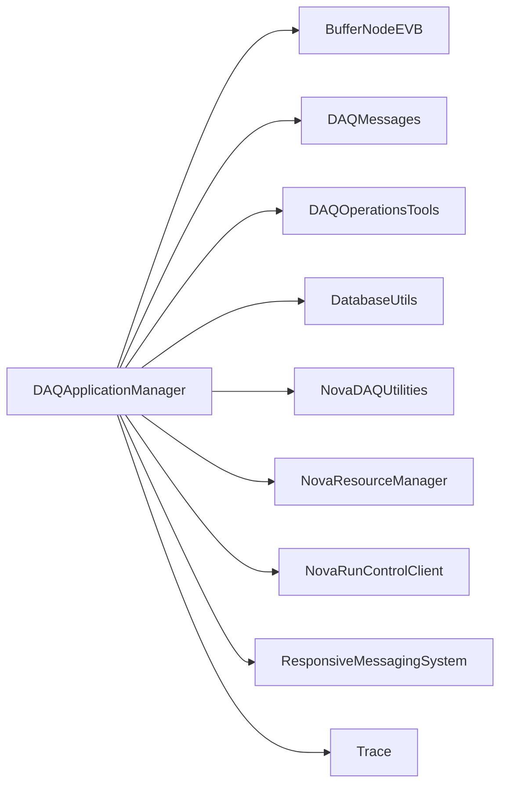

# DAQApplicationManager

Qt process-management application with host/process grouping, status watchers, and a Run Control interface.

## Identity and scope

Repository: [NovaDAQ/DAQApplicationManager](https://github.com/NovaDAQ/DAQApplicationManager) · Reviewed commit: `08f570a111b259069114837ae7f70434aded5dc1` · Domain: **Control**.

Tracked files: **50**. Production deployment and owner are **unconfirmed**.

## Operation

Process definitions come from the configuration/database layer. Verify host, partition, Kerberos credentials, and expected instance counts before launching groups. Inspect process exit status and status-message age when a panel reports an unresponsive application.

For prerequisites, safe start/stop sequencing, health checks, and rollback see the [operations guide](../operations/index.md).

## Build and integration

This package uses the SRT/SoftRelTools release context. A standalone `make` in a fresh checkout is not a supported build recipe unless the required context is already configured. See [build and release](../operations/build.md).

| Build definition |
| --- |
| [GNUmakefile](https://github.com/NovaDAQ/DAQApplicationManager/blob/08f570a111b259069114837ae7f70434aded5dc1/GNUmakefile) |
| [cxx/GNUmakefile](https://github.com/NovaDAQ/DAQApplicationManager/blob/08f570a111b259069114837ae7f70434aded5dc1/cxx/GNUmakefile) |
| [cxx/src/GNUmakefile](https://github.com/NovaDAQ/DAQApplicationManager/blob/08f570a111b259069114837ae7f70434aded5dc1/cxx/src/GNUmakefile) |
| [cxx/test/GNUmakefile](https://github.com/NovaDAQ/DAQApplicationManager/blob/08f570a111b259069114837ae7f70434aded5dc1/cxx/test/GNUmakefile) |
| [cxx/unittest/GNUmakefile](https://github.com/NovaDAQ/DAQApplicationManager/blob/08f570a111b259069114837ae7f70434aded5dc1/cxx/unittest/GNUmakefile) |

## Entry points

These are source entry points or operational scripts found statically. Installation names and enabled targets depend on the build/configuration; listing a script does not establish that it is deployed.

| Source |
| --- |
| [cxx/src/DAQApplicationManager.cc](https://github.com/NovaDAQ/DAQApplicationManager/blob/08f570a111b259069114837ae7f70434aded5dc1/cxx/src/DAQApplicationManager.cc) |

## Interfaces

Headers and declared types form the API navigation map. Follow the source for method signatures, ownership, units, and error contracts. Generated DDS/XSD types are built from the schemas in the next section.

| Header | Declared types |
| --- | --- |
| [cxx/include/ApplicationGroupBox.h](https://github.com/NovaDAQ/DAQApplicationManager/blob/08f570a111b259069114837ae7f70434aded5dc1/cxx/include/ApplicationGroupBox.h) | `ApplicationGroupBox` |
| [cxx/include/DAQProcessPanel.h](https://github.com/NovaDAQ/DAQApplicationManager/blob/08f570a111b259069114837ae7f70434aded5dc1/cxx/include/DAQProcessPanel.h) | `DAQProcessPanel` |
| [cxx/include/KrbTicketRenewer.h](https://github.com/NovaDAQ/DAQApplicationManager/blob/08f570a111b259069114837ae7f70434aded5dc1/cxx/include/KrbTicketRenewer.h) | `KrbTicketRenewer` |
| [cxx/include/LayeredSubsystemDisplay.h](https://github.com/NovaDAQ/DAQApplicationManager/blob/08f570a111b259069114837ae7f70434aded5dc1/cxx/include/LayeredSubsystemDisplay.h) | `LayeredSubsystemDisplay` |
| [cxx/include/PSBroker.h](https://github.com/NovaDAQ/DAQApplicationManager/blob/08f570a111b259069114837ae7f70434aded5dc1/cxx/include/PSBroker.h) | `PSBroker` |
| [cxx/include/PSRunner.h](https://github.com/NovaDAQ/DAQApplicationManager/blob/08f570a111b259069114837ae7f70434aded5dc1/cxx/include/PSRunner.h) | `PSRunner` |
| [cxx/include/ProcessGroupWidget.h](https://github.com/NovaDAQ/DAQApplicationManager/blob/08f570a111b259069114837ae7f70434aded5dc1/cxx/include/ProcessGroupWidget.h) | `ProcessGroupWidget` |
| [cxx/include/ProcessStates.h](https://github.com/NovaDAQ/DAQApplicationManager/blob/08f570a111b259069114837ae7f70434aded5dc1/cxx/include/ProcessStates.h) | `PROCESS_STATE_NUMBER`, `ProcessStates` |
| [cxx/include/ProcessWidget.h](https://github.com/NovaDAQ/DAQApplicationManager/blob/08f570a111b259069114837ae7f70434aded5dc1/cxx/include/ProcessWidget.h) | `ProcessWidget` |
| [cxx/include/RCHandler.h](https://github.com/NovaDAQ/DAQApplicationManager/blob/08f570a111b259069114837ae7f70434aded5dc1/cxx/include/RCHandler.h) | `RCHandler` |
| [cxx/include/RmsReceiverDemultiplexer.h](https://github.com/NovaDAQ/DAQApplicationManager/blob/08f570a111b259069114837ae7f70434aded5dc1/cxx/include/RmsReceiverDemultiplexer.h) | `RmsReceiverDemultiplexer` |
| [cxx/include/RunningProcessWatchdog.h](https://github.com/NovaDAQ/DAQApplicationManager/blob/08f570a111b259069114837ae7f70434aded5dc1/cxx/include/RunningProcessWatchdog.h) | `RunningProcessWatchdog` |
| [cxx/include/ShellCommand.h](https://github.com/NovaDAQ/DAQApplicationManager/blob/08f570a111b259069114837ae7f70434aded5dc1/cxx/include/ShellCommand.h) | `ShellCommand` |
| [cxx/include/ShellCommandSet.h](https://github.com/NovaDAQ/DAQApplicationManager/blob/08f570a111b259069114837ae7f70434aded5dc1/cxx/include/ShellCommandSet.h) | `ShellCommandSet` |
| [cxx/include/SimpleGroup.h](https://github.com/NovaDAQ/DAQApplicationManager/blob/08f570a111b259069114837ae7f70434aded5dc1/cxx/include/SimpleGroup.h) | `SimpleGroup` |
| [cxx/include/StatusMessageBroker.h](https://github.com/NovaDAQ/DAQApplicationManager/blob/08f570a111b259069114837ae7f70434aded5dc1/cxx/include/StatusMessageBroker.h) | `StatusMessageBroker` |
| [cxx/include/StatusMessageWatchdog.h](https://github.com/NovaDAQ/DAQApplicationManager/blob/08f570a111b259069114837ae7f70434aded5dc1/cxx/include/StatusMessageWatchdog.h) | `StatusMessageWatchdog` |
| [cxx/include/SubsystemGroupBox.h](https://github.com/NovaDAQ/DAQApplicationManager/blob/08f570a111b259069114837ae7f70434aded5dc1/cxx/include/SubsystemGroupBox.h) | `SubsystemGroupBox` |
| [cxx/include/TabDisplay.h](https://github.com/NovaDAQ/DAQApplicationManager/blob/08f570a111b259069114837ae7f70434aded5dc1/cxx/include/TabDisplay.h) | `TabDisplay` |

## Configuration and data contracts

| Source artifact |
| --- |
| [config/DDTConfig.xml](https://github.com/NovaDAQ/DAQApplicationManager/blob/08f570a111b259069114837ae7f70434aded5dc1/config/DDTConfig.xml) |
| [config/DDTConfig.xsd](https://github.com/NovaDAQ/DAQApplicationManager/blob/08f570a111b259069114837ae7f70434aded5dc1/config/DDTConfig.xsd) |

## Environment and external dependencies

Environment names below are literal lookups found in source, not a guarantee that every value is mandatory. No environment values or credentials are copied into this documentation.

| Variable | Evidence |
| --- | --- |
| `HOME` | [cxx/test/DAQApplicationManagerRecovery.cc:89](https://github.com/NovaDAQ/DAQApplicationManager/blob/08f570a111b259069114837ae7f70434aded5dc1/cxx/test/DAQApplicationManagerRecovery.cc#L89) |
| `NOVADAQ_ENVIRONMENT` | [cxx/test/DAQApplicationManagerRecovery.cc:145](https://github.com/NovaDAQ/DAQApplicationManager/blob/08f570a111b259069114837ae7f70434aded5dc1/cxx/test/DAQApplicationManagerRecovery.cc#L145) |
| `NOVADAQ_HOST` | [cxx/test/DAQApplicationManagerRecovery.cc:94](https://github.com/NovaDAQ/DAQApplicationManager/blob/08f570a111b259069114837ae7f70434aded5dc1/cxx/test/DAQApplicationManagerRecovery.cc#L94) |
| `NOVADAQ_PARTITION_NUMBER` | [cxx/test/DAQApplicationManagerRecovery.cc:147](https://github.com/NovaDAQ/DAQApplicationManager/blob/08f570a111b259069114837ae7f70434aded5dc1/cxx/test/DAQApplicationManagerRecovery.cc#L147) |

Unresolved/non-package include roots (some are system or generated headers; this is not a package-manager lockfile):

| Include root | Evidence |
| --- | --- |
| `QtCore` | [cxx/include/ApplicationGroupBox.h:8](https://github.com/NovaDAQ/DAQApplicationManager/blob/08f570a111b259069114837ae7f70434aded5dc1/cxx/include/ApplicationGroupBox.h#L8) |
| `QtGui` | [cxx/include/ApplicationGroupBox.h:9](https://github.com/NovaDAQ/DAQApplicationManager/blob/08f570a111b259069114837ae7f70434aded5dc1/cxx/include/ApplicationGroupBox.h#L9) |
| `boost` | [cxx/include/KrbTicketRenewer.h:5](https://github.com/NovaDAQ/DAQApplicationManager/blob/08f570a111b259069114837ae7f70434aded5dc1/cxx/include/KrbTicketRenewer.h#L5) |

## Package dependencies

Arrow direction is **consumer → dependency**. This diagram includes source/build/runtime relationships and excludes test-only, release-membership, and build-tool edges. Conditional branches are not evaluated.

| Dependency | Relationship | Evidence |
| --- | --- | --- |
| [BufferNodeEVB](BufferNodeEVB.md) | source include | [cxx/src/DAQApplicationManager.cc:13](https://github.com/NovaDAQ/DAQApplicationManager/blob/08f570a111b259069114837ae7f70434aded5dc1/cxx/src/DAQApplicationManager.cc#L13) |
| [DAQMessages](DAQMessages.md) | build link | [cxx/src/GNUmakefile:36](https://github.com/NovaDAQ/DAQApplicationManager/blob/08f570a111b259069114837ae7f70434aded5dc1/cxx/src/GNUmakefile#L36) |
| [DAQMessages](DAQMessages.md) | source include | [cxx/include/RCHandler.h:5](https://github.com/NovaDAQ/DAQApplicationManager/blob/08f570a111b259069114837ae7f70434aded5dc1/cxx/include/RCHandler.h#L5) |
| [DAQMessages](DAQMessages.md) | test include | [cxx/test/DAQApplicationManagerRecovery.cc:8](https://github.com/NovaDAQ/DAQApplicationManager/blob/08f570a111b259069114837ae7f70434aded5dc1/cxx/test/DAQApplicationManagerRecovery.cc#L8) |
| [DAQMessages](DAQMessages.md) | test link | [cxx/test/GNUmakefile:11](https://github.com/NovaDAQ/DAQApplicationManager/blob/08f570a111b259069114837ae7f70434aded5dc1/cxx/test/GNUmakefile#L11) |
| [DAQOperationsTools](DAQOperationsTools.md) | build link | [cxx/src/GNUmakefile:36](https://github.com/NovaDAQ/DAQApplicationManager/blob/08f570a111b259069114837ae7f70434aded5dc1/cxx/src/GNUmakefile#L36) |
| [DAQOperationsTools](DAQOperationsTools.md) | source include | [cxx/src/TabDisplay.cpp:23](https://github.com/NovaDAQ/DAQApplicationManager/blob/08f570a111b259069114837ae7f70434aded5dc1/cxx/src/TabDisplay.cpp#L23) |
| [DatabaseUtils](DatabaseUtils.md) | build link | [cxx/src/GNUmakefile:36](https://github.com/NovaDAQ/DAQApplicationManager/blob/08f570a111b259069114837ae7f70434aded5dc1/cxx/src/GNUmakefile#L36) |
| [DatabaseUtils](DatabaseUtils.md) | source include | [cxx/include/ApplicationGroupBox.h:7](https://github.com/NovaDAQ/DAQApplicationManager/blob/08f570a111b259069114837ae7f70434aded5dc1/cxx/include/ApplicationGroupBox.h#L7) |
| [NovaDAQConventions](NovaDAQConventions.md) | test include | [cxx/test/DAQApplicationManagerRecovery.cc:10](https://github.com/NovaDAQ/DAQApplicationManager/blob/08f570a111b259069114837ae7f70434aded5dc1/cxx/test/DAQApplicationManagerRecovery.cc#L10) |
| [NovaDAQUtilities](NovaDAQUtilities.md) | build link | [cxx/src/GNUmakefile:36](https://github.com/NovaDAQ/DAQApplicationManager/blob/08f570a111b259069114837ae7f70434aded5dc1/cxx/src/GNUmakefile#L36) |
| [NovaDAQUtilities](NovaDAQUtilities.md) | source include | [cxx/include/KrbTicketRenewer.h:4](https://github.com/NovaDAQ/DAQApplicationManager/blob/08f570a111b259069114837ae7f70434aded5dc1/cxx/include/KrbTicketRenewer.h#L4) |
| [NovaDAQUtilities](NovaDAQUtilities.md) | test include | [cxx/test/DAQApplicationManagerRecovery.cc:9](https://github.com/NovaDAQ/DAQApplicationManager/blob/08f570a111b259069114837ae7f70434aded5dc1/cxx/test/DAQApplicationManagerRecovery.cc#L9) |
| [NovaResourceManager](NovaResourceManager.md) | build link | [cxx/src/GNUmakefile:36](https://github.com/NovaDAQ/DAQApplicationManager/blob/08f570a111b259069114837ae7f70434aded5dc1/cxx/src/GNUmakefile#L36) |
| [NovaResourceManager](NovaResourceManager.md) | source include | [cxx/src/RCHandler.cpp:10](https://github.com/NovaDAQ/DAQApplicationManager/blob/08f570a111b259069114837ae7f70434aded5dc1/cxx/src/RCHandler.cpp#L10) |
| [NovaResourceManager](NovaResourceManager.md) | test include | [cxx/test/DAQApplicationManagerRecovery.cc:7](https://github.com/NovaDAQ/DAQApplicationManager/blob/08f570a111b259069114837ae7f70434aded5dc1/cxx/test/DAQApplicationManagerRecovery.cc#L7) |
| [NovaResourceManager](NovaResourceManager.md) | test link | [cxx/test/GNUmakefile:11](https://github.com/NovaDAQ/DAQApplicationManager/blob/08f570a111b259069114837ae7f70434aded5dc1/cxx/test/GNUmakefile#L11) |
| [NovaRunControlClient](NovaRunControlClient.md) | source include | [cxx/include/RCHandler.h:4](https://github.com/NovaDAQ/DAQApplicationManager/blob/08f570a111b259069114837ae7f70434aded5dc1/cxx/include/RCHandler.h#L4) |
| [ResponsiveMessagingSystem](ResponsiveMessagingSystem.md) | source include | [cxx/include/RmsReceiverDemultiplexer.h:4](https://github.com/NovaDAQ/DAQApplicationManager/blob/08f570a111b259069114837ae7f70434aded5dc1/cxx/include/RmsReceiverDemultiplexer.h#L4) |
| [ResponsiveMessagingSystem](ResponsiveMessagingSystem.md) | test include | [cxx/test/DAQApplicationManagerRecovery.cc:12](https://github.com/NovaDAQ/DAQApplicationManager/blob/08f570a111b259069114837ae7f70434aded5dc1/cxx/test/DAQApplicationManagerRecovery.cc#L12) |
| [SRT_ONLINE](SRT_ONLINE.md) | build tool | [GNUmakefile:10](https://github.com/NovaDAQ/DAQApplicationManager/blob/08f570a111b259069114837ae7f70434aded5dc1/GNUmakefile#L10) |
| [Trace](Trace.md) | build link | [cxx/src/GNUmakefile:36](https://github.com/NovaDAQ/DAQApplicationManager/blob/08f570a111b259069114837ae7f70434aded5dc1/cxx/src/GNUmakefile#L36) |

Direct consumers: [NovaDAQConfiguration](NovaDAQConfiguration.md).

Explore upstream/downstream impact in the [dependency explorer](../architecture/explorer.md).

## Validation and review

Static analysis attempted **19 C/C++ translation units**, **3 shell scripts**, and parsed **0 Python files**. Counts are tool input coverage, not proof of successful compilation or exhaustive review. Source/build/configuration inventories and the operating surface were also assessed.

No actionable defect was confirmed for this package in this review. This is a bounded review result, not a clean bill of health; unvalidated analyzer diagnostics were not filed as bugs.

Existing test/example sources (not executed against production):

| Source |
| --- |
| [cxx/test/DAQApplicationManagerRecovery.cc](https://github.com/NovaDAQ/DAQApplicationManager/blob/08f570a111b259069114837ae7f70434aded5dc1/cxx/test/DAQApplicationManagerRecovery.cc) |
| [cxx/test/createAppMgrDBTables.sh](https://github.com/NovaDAQ/DAQApplicationManager/blob/08f570a111b259069114837ae7f70434aded5dc1/cxx/test/createAppMgrDBTables.sh) |
| [cxx/test/dropAppMgrDBTables.sh](https://github.com/NovaDAQ/DAQApplicationManager/blob/08f570a111b259069114837ae7f70434aded5dc1/cxx/test/dropAppMgrDBTables.sh) |
| [cxx/test/initAppLocations.sh](https://github.com/NovaDAQ/DAQApplicationManager/blob/08f570a111b259069114837ae7f70434aded5dc1/cxx/test/initAppLocations.sh) |

## Existing documentation

| Source |
| --- |
| [doc/DAQApplicationManagerTesting.txt](https://github.com/NovaDAQ/DAQApplicationManager/blob/08f570a111b259069114837ae7f70434aded5dc1/doc/DAQApplicationManagerTesting.txt) |
