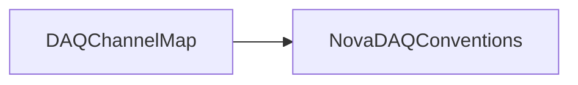

# DAQChannelMap

Maps detector, plane, cell, DCM, FEB, and pixel identifiers for Far Detector, Near Detector, NDOS, and Test Beam geometries.

## Identity and scope

Repository: [NovaDAQ/DAQChannelMap](https://github.com/NovaDAQ/DAQChannelMap) · Reviewed commit: `246341eccee20c964aa894c4a0966b26eae8ba53` · Domain: **Core libraries**.

Tracked files: **56**. Production deployment and owner are **unconfirmed**.

## Operation

Consumers must select a detector-specific map. Validate representative encode/decode round trips, detector boundaries, and view orientation after a mapping change. This is a library; it has no independent service lifecycle.

For prerequisites, safe start/stop sequencing, health checks, and rollback see the [operations guide](../operations/index.md).

## Build and integration

This package uses the SRT/SoftRelTools release context. A standalone `make` in a fresh checkout is not a supported build recipe unless the required context is already configured. See [build and release](../operations/build.md).

CMake definitions are present. Most NOvA fragments use parent-provided cetbuildtools macros and dependency targets; consult the files below before treating this directory as a standalone CMake project.

| Build definition |
| --- |
| [CMakeLists.txt](https://github.com/NovaDAQ/DAQChannelMap/blob/246341eccee20c964aa894c4a0966b26eae8ba53/CMakeLists.txt) |
| [GNUmakefile](https://github.com/NovaDAQ/DAQChannelMap/blob/246341eccee20c964aa894c4a0966b26eae8ba53/GNUmakefile) |
| [cxx/CMakeLists.txt](https://github.com/NovaDAQ/DAQChannelMap/blob/246341eccee20c964aa894c4a0966b26eae8ba53/cxx/CMakeLists.txt) |
| [cxx/GNUmakefile](https://github.com/NovaDAQ/DAQChannelMap/blob/246341eccee20c964aa894c4a0966b26eae8ba53/cxx/GNUmakefile) |
| [cxx/include/CMakeLists.txt](https://github.com/NovaDAQ/DAQChannelMap/blob/246341eccee20c964aa894c4a0966b26eae8ba53/cxx/include/CMakeLists.txt) |
| [cxx/src/CMakeLists.txt](https://github.com/NovaDAQ/DAQChannelMap/blob/246341eccee20c964aa894c4a0966b26eae8ba53/cxx/src/CMakeLists.txt) |
| [cxx/src/GNUmakefile](https://github.com/NovaDAQ/DAQChannelMap/blob/246341eccee20c964aa894c4a0966b26eae8ba53/cxx/src/GNUmakefile) |
| [cxx/test/GNUmakefile](https://github.com/NovaDAQ/DAQChannelMap/blob/246341eccee20c964aa894c4a0966b26eae8ba53/cxx/test/GNUmakefile) |
| [cxx/unittest/GNUmakefile](https://github.com/NovaDAQ/DAQChannelMap/blob/246341eccee20c964aa894c4a0966b26eae8ba53/cxx/unittest/GNUmakefile) |
| [java/GNUmakefile](https://github.com/NovaDAQ/DAQChannelMap/blob/246341eccee20c964aa894c4a0966b26eae8ba53/java/GNUmakefile) |
| [java/src/GNUmakefile](https://github.com/NovaDAQ/DAQChannelMap/blob/246341eccee20c964aa894c4a0966b26eae8ba53/java/src/GNUmakefile) |
| [java/test/GNUmakefile](https://github.com/NovaDAQ/DAQChannelMap/blob/246341eccee20c964aa894c4a0966b26eae8ba53/java/test/GNUmakefile) |
| [java/unittest/GNUmakefile](https://github.com/NovaDAQ/DAQChannelMap/blob/246341eccee20c964aa894c4a0966b26eae8ba53/java/unittest/GNUmakefile) |

## Entry points

These are source entry points or operational scripts found statically. Installation names and enabled targets depend on the build/configuration; listing a script does not establish that it is deployed.

No standalone executable entry point was identified; this package may provide libraries, contracts, configuration, or binary artifacts.

## Interfaces

Headers and declared types form the API navigation map. Follow the source for method signatures, ownership, units, and error contracts. Generated DDS/XSD types are built from the schemas in the next section.

| Header | Declared types |
| --- | --- |
| [cxx/include/BitFields.h](https://github.com/NovaDAQ/DAQChannelMap/blob/246341eccee20c964aa894c4a0966b26eae8ba53/cxx/include/BitFields.h) | Functions, constants, or templates |
| [cxx/include/ChannelMapExceptionOLD.h](https://github.com/NovaDAQ/DAQChannelMap/blob/246341eccee20c964aa894c4a0966b26eae8ba53/cxx/include/ChannelMapExceptionOLD.h) | `ChannelMapException` |
| [cxx/include/DAQChannelMap.h](https://github.com/NovaDAQ/DAQChannelMap/blob/246341eccee20c964aa894c4a0966b26eae8ba53/cxx/include/DAQChannelMap.h) | `DAQChannelMap` |
| [cxx/include/DAQChannelMapBaseOLD.h](https://github.com/NovaDAQ/DAQChannelMap/blob/246341eccee20c964aa894c4a0966b26eae8ba53/cxx/include/DAQChannelMapBaseOLD.h) | `DAQChannelMapBaseOLD` |
| [cxx/include/DAQChannelMapConstants.h](https://github.com/NovaDAQ/DAQChannelMap/blob/246341eccee20c964aa894c4a0966b26eae8ba53/cxx/include/DAQChannelMapConstants.h) | `BlockNumerationOffset`, `DAQChanMASKS`, `DAQValidRange`, `DetBlockSizes`, `DetBlock_TYPE`, `DetDiBlockSizes`, `DetPlane_TYPE`, `DetView_TYPE`, `DiBlock_TYPE`, `ModuleParameters`, `OfflineChanMASKS` |
| [cxx/include/DAQChannelMapConstantsOLD.h](https://github.com/NovaDAQ/DAQChannelMap/blob/246341eccee20c964aa894c4a0966b26eae8ba53/cxx/include/DAQChannelMapConstantsOLD.h) | `DAQChanMASKS`, `DAQValidRange`, `DetBlockSizes`, `DetBlock_TYPE`, `DetDiBlockSizes`, `DetPlane_TYPE`, `DetView_TYPE`, `DiBlock_TYPE`, `ModuleParameters`, `OfflineChanMASKS` |
| [cxx/include/DAQChannelMapErrorsOLD.h](https://github.com/NovaDAQ/DAQChannelMap/blob/246341eccee20c964aa894c4a0966b26eae8ba53/cxx/include/DAQChannelMapErrorsOLD.h) | `DAQChanMapErrorCodes` |
| [cxx/include/DAQChannelMapOLD.h](https://github.com/NovaDAQ/DAQChannelMap/blob/246341eccee20c964aa894c4a0966b26eae8ba53/cxx/include/DAQChannelMapOLD.h) | `DAQChannelMapOLD`, `UniversalDAQChannel`, `UniversalDCMChannel` |
| [cxx/include/FarDetDAQChannelMap.h](https://github.com/NovaDAQ/DAQChannelMap/blob/246341eccee20c964aa894c4a0966b26eae8ba53/cxx/include/FarDetDAQChannelMap.h) | `FarDetDAQChannelMap` |
| [cxx/include/FarDetDAQChannelMapConstants.h](https://github.com/NovaDAQ/DAQChannelMap/blob/246341eccee20c964aa894c4a0966b26eae8ba53/cxx/include/FarDetDAQChannelMapConstants.h) | Functions, constants, or templates |
| [cxx/include/HardwareDisplay.h](https://github.com/NovaDAQ/DAQChannelMap/blob/246341eccee20c964aa894c4a0966b26eae8ba53/cxx/include/HardwareDisplay.h) | `HardwareDisplay` |
| [cxx/include/NDOSDAQChannelMap.h](https://github.com/NovaDAQ/DAQChannelMap/blob/246341eccee20c964aa894c4a0966b26eae8ba53/cxx/include/NDOSDAQChannelMap.h) | `NDOSDAQChannelMap` |
| [cxx/include/NDOSDAQChannelMapConstants.h](https://github.com/NovaDAQ/DAQChannelMap/blob/246341eccee20c964aa894c4a0966b26eae8ba53/cxx/include/NDOSDAQChannelMapConstants.h) | Functions, constants, or templates |
| [cxx/include/NearDetDAQChannelMap.h](https://github.com/NovaDAQ/DAQChannelMap/blob/246341eccee20c964aa894c4a0966b26eae8ba53/cxx/include/NearDetDAQChannelMap.h) | `NearDetDAQChannelMap` |
| [cxx/include/NearDetDAQChannelMapConstants.h](https://github.com/NovaDAQ/DAQChannelMap/blob/246341eccee20c964aa894c4a0966b26eae8ba53/cxx/include/NearDetDAQChannelMapConstants.h) | Functions, constants, or templates |
| [cxx/include/TestBeamDAQChannelMap.h](https://github.com/NovaDAQ/DAQChannelMap/blob/246341eccee20c964aa894c4a0966b26eae8ba53/cxx/include/TestBeamDAQChannelMap.h) | `TestBeamDAQChannelMap` |
| [cxx/include/TestBeamDAQChannelMapConstants.h](https://github.com/NovaDAQ/DAQChannelMap/blob/246341eccee20c964aa894c4a0966b26eae8ba53/cxx/include/TestBeamDAQChannelMapConstants.h) | Functions, constants, or templates |
| [cxx/include/boundscheck.h](https://github.com/NovaDAQ/DAQChannelMap/blob/246341eccee20c964aa894c4a0966b26eae8ba53/cxx/include/boundscheck.h) | Functions, constants, or templates |

## Configuration and data contracts

| Source artifact |
| --- |
| [cxx/test/daqchannel.xml](https://github.com/NovaDAQ/DAQChannelMap/blob/246341eccee20c964aa894c4a0966b26eae8ba53/cxx/test/daqchannel.xml) |
| [cxx/test/gDAQChannelTest.xml](https://github.com/NovaDAQ/DAQChannelMap/blob/246341eccee20c964aa894c4a0966b26eae8ba53/cxx/test/gDAQChannelTest.xml) |
| [cxx/test/gRawFill.xml](https://github.com/NovaDAQ/DAQChannelMap/blob/246341eccee20c964aa894c4a0966b26eae8ba53/cxx/test/gRawFill.xml) |

## Environment and external dependencies

Environment names below are literal lookups found in source, not a guarantee that every value is mandatory. No environment values or credentials are copied into this documentation.

No literal environment lookup was identified by this scan; shell setup scripts may still provide required values.

Unresolved/non-package include roots (some are system or generated headers; this is not a package-manager lockfile):

| Include root | Evidence |
| --- | --- |
| `Config` | [cxx/test/CheckDAQChannelMap.cxx:12](https://github.com/NovaDAQ/DAQChannelMap/blob/246341eccee20c964aa894c4a0966b26eae8ba53/cxx/test/CheckDAQChannelMap.cxx#L12) |
| `EventDataModel` | [cxx/test/CheckDAQChannelMap.cxx:14](https://github.com/NovaDAQ/DAQChannelMap/blob/246341eccee20c964aa894c4a0966b26eae8ba53/cxx/test/CheckDAQChannelMap.cxx#L14) |
| `Geometry` | [cxx/test/CheckDAQChannelMap.cxx:21](https://github.com/NovaDAQ/DAQChannelMap/blob/246341eccee20c964aa894c4a0966b26eae8ba53/cxx/test/CheckDAQChannelMap.cxx#L21) |
| `Header` | [cxx/test/CheckDAQChannelMap.cxx:24](https://github.com/NovaDAQ/DAQChannelMap/blob/246341eccee20c964aa894c4a0966b26eae8ba53/cxx/test/CheckDAQChannelMap.cxx#L24) |
| `IoModules` | [cxx/test/CheckDAQChannelMap.cxx:38](https://github.com/NovaDAQ/DAQChannelMap/blob/246341eccee20c964aa894c4a0966b26eae8ba53/cxx/test/CheckDAQChannelMap.cxx#L38) |
| `JobControl` | [cxx/test/CheckDAQChannelMap.cxx:16](https://github.com/NovaDAQ/DAQChannelMap/blob/246341eccee20c964aa894c4a0966b26eae8ba53/cxx/test/CheckDAQChannelMap.cxx#L16) |
| `RawData` | [cxx/test/CheckDAQChannelMap.cxx:18](https://github.com/NovaDAQ/DAQChannelMap/blob/246341eccee20c964aa894c4a0966b26eae8ba53/cxx/test/CheckDAQChannelMap.cxx#L18) |
| `Utilities` | [cxx/test/CheckDAQChannelMap.cxx:42](https://github.com/NovaDAQ/DAQChannelMap/blob/246341eccee20c964aa894c4a0966b26eae8ba53/cxx/test/CheckDAQChannelMap.cxx#L42) |
| `XMLInterface` | [cxx/test/CheckDAQChannelMap.cxx:26](https://github.com/NovaDAQ/DAQChannelMap/blob/246341eccee20c964aa894c4a0966b26eae8ba53/cxx/test/CheckDAQChannelMap.cxx#L26) |
| `cppunit` | [cxx/unittest/DAQChannelMapTests.cpp:1](https://github.com/NovaDAQ/DAQChannelMap/blob/246341eccee20c964aa894c4a0966b26eae8ba53/cxx/unittest/DAQChannelMapTests.cpp#L1) |
| `sys` | [cxx/include/BitFields.h:4](https://github.com/NovaDAQ/DAQChannelMap/blob/246341eccee20c964aa894c4a0966b26eae8ba53/cxx/include/BitFields.h#L4) |

## Package dependencies

Arrow direction is **consumer → dependency**. This diagram includes source/build/runtime relationships and excludes test-only, release-membership, and build-tool edges. Conditional branches are not evaluated.

| Dependency | Relationship | Evidence |
| --- | --- | --- |
| [DAQDataFormats](DAQDataFormats.md) | test include | [cxx/test/CheckDAQChannelMap.cxx:33](https://github.com/NovaDAQ/DAQChannelMap/blob/246341eccee20c964aa894c4a0966b26eae8ba53/cxx/test/CheckDAQChannelMap.cxx#L33) |
| [DAQDataFormats](DAQDataFormats.md) | test link | [cxx/test/GNUmakefile:19](https://github.com/NovaDAQ/DAQChannelMap/blob/246341eccee20c964aa894c4a0966b26eae8ba53/cxx/test/GNUmakefile#L19) |
| [NovaDAQConventions](NovaDAQConventions.md) | source include | [cxx/src/DAQChannelMap.cpp:10](https://github.com/NovaDAQ/DAQChannelMap/blob/246341eccee20c964aa894c4a0966b26eae8ba53/cxx/src/DAQChannelMap.cpp#L10) |
| [NovaDAQConventions](NovaDAQConventions.md) | test include | [cxx/unittest/benchmark.cc:4](https://github.com/NovaDAQ/DAQChannelMap/blob/246341eccee20c964aa894c4a0966b26eae8ba53/cxx/unittest/benchmark.cc#L4) |
| [NovaDAQUtilities](NovaDAQUtilities.md) | test include | [cxx/unittest/chanmap_unittest.cc:1](https://github.com/NovaDAQ/DAQChannelMap/blob/246341eccee20c964aa894c4a0966b26eae8ba53/cxx/unittest/chanmap_unittest.cc#L1) |
| [NovaDAQUtilities](NovaDAQUtilities.md) | test link | [cxx/unittest/GNUmakefile:20](https://github.com/NovaDAQ/DAQChannelMap/blob/246341eccee20c964aa894c4a0966b26eae8ba53/cxx/unittest/GNUmakefile#L20) |
| [PackageVersion](PackageVersion.md) | test link | [cxx/test/GNUmakefile:19](https://github.com/NovaDAQ/DAQChannelMap/blob/246341eccee20c964aa894c4a0966b26eae8ba53/cxx/test/GNUmakefile#L19) |
| [SRT_ONLINE](SRT_ONLINE.md) | build tool | [GNUmakefile:21](https://github.com/NovaDAQ/DAQChannelMap/blob/246341eccee20c964aa894c4a0966b26eae8ba53/GNUmakefile#L21) |

Direct consumers: [ChannelDecoder](ChannelDecoder.md), [DAQHit.old](DAQHit.old.md), [FEBCheckoutVerify](FEBCheckoutVerify.md), [HoughPoint.old](HoughPoint.old.md), [MockDataDAQ](MockDataDAQ.md), [NovaDAQCheckout](NovaDAQCheckout.md), [PedestalDataRunner](PedestalDataRunner.md), [RunSummaryUtils](RunSummaryUtils.md).

Explore upstream/downstream impact in the [dependency explorer](../architecture/explorer.md).

## Validation and review

Static analysis attempted **14 C/C++ translation units**, **0 shell scripts**, and parsed **0 Python files**. Counts are tool input coverage, not proof of successful compilation or exhaustive review. Source/build/configuration inventories and the operating surface were also assessed.

No actionable defect was confirmed for this package in this review. This is a bounded review result, not a clean bill of health; unvalidated analyzer diagnostics were not filed as bugs.

Existing test/example sources (not executed against production):

| Source |
| --- |
| [cxx/test/CheckDAQChannelMap.cxx](https://github.com/NovaDAQ/DAQChannelMap/blob/246341eccee20c964aa894c4a0966b26eae8ba53/cxx/test/CheckDAQChannelMap.cxx) |
| [cxx/test/CheckDAQChannelMap.h](https://github.com/NovaDAQ/DAQChannelMap/blob/246341eccee20c964aa894c4a0966b26eae8ba53/cxx/test/CheckDAQChannelMap.h) |
| [cxx/test/FillRawDigits.cxx](https://github.com/NovaDAQ/DAQChannelMap/blob/246341eccee20c964aa894c4a0966b26eae8ba53/cxx/test/FillRawDigits.cxx) |
| [cxx/test/FillRawDigits.h](https://github.com/NovaDAQ/DAQChannelMap/blob/246341eccee20c964aa894c4a0966b26eae8ba53/cxx/test/FillRawDigits.h) |
| [cxx/unittest/DAQChannelMapTests.cpp](https://github.com/NovaDAQ/DAQChannelMap/blob/246341eccee20c964aa894c4a0966b26eae8ba53/cxx/unittest/DAQChannelMapTests.cpp) |
| [cxx/unittest/benchmark.cc](https://github.com/NovaDAQ/DAQChannelMap/blob/246341eccee20c964aa894c4a0966b26eae8ba53/cxx/unittest/benchmark.cc) |
| [cxx/unittest/chanmap_unittest.cc](https://github.com/NovaDAQ/DAQChannelMap/blob/246341eccee20c964aa894c4a0966b26eae8ba53/cxx/unittest/chanmap_unittest.cc) |
| [cxx/unittest/daqchannelmap_unittest.cc](https://github.com/NovaDAQ/DAQChannelMap/blob/246341eccee20c964aa894c4a0966b26eae8ba53/cxx/unittest/daqchannelmap_unittest.cc) |

## Existing documentation

| Source |
| --- |
| [cxx/test/README](https://github.com/NovaDAQ/DAQChannelMap/blob/246341eccee20c964aa894c4a0966b26eae8ba53/cxx/test/README) |
