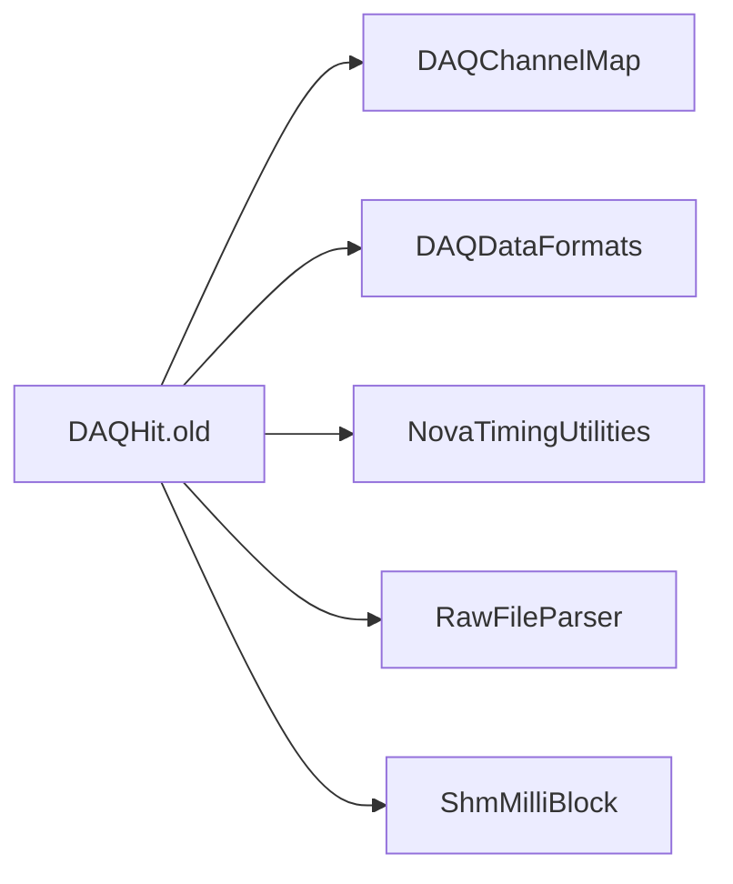

# DAQHit.old

Legacy hit representation and extraction tools for raw files and shared-memory data.

## Identity and scope

Repository: [NovaDAQ/DAQHit.old](https://github.com/NovaDAQ/DAQHit.old) · Reviewed commit: `41ff8aaf89a40d421dae961b6a8d770a7080089f` · Domain: **Analysis**.

Tracked files: **14**. Production deployment and owner are **unconfirmed**. The directory name marks a legacy variant; retirement has not been independently verified.

## Operation

The .old suffix is a lifecycle signal, not confirmed retirement. Link against the matching historical channel map and data formats; compare extracted cell, plane, charge, and timestamp against a known event before reuse.

For prerequisites, safe start/stop sequencing, health checks, and rollback see the [operations guide](../operations/index.md).

## Build and integration

This package uses the SRT/SoftRelTools release context. A standalone `make` in a fresh checkout is not a supported build recipe unless the required context is already configured. See [build and release](../operations/build.md).

| Build definition |
| --- |
| [GNUmakefile](https://github.com/NovaDAQ/DAQHit.old/blob/41ff8aaf89a40d421dae961b6a8d770a7080089f/GNUmakefile) |
| [cxx/GNUmakefile](https://github.com/NovaDAQ/DAQHit.old/blob/41ff8aaf89a40d421dae961b6a8d770a7080089f/cxx/GNUmakefile) |
| [cxx/src/GNUmakefile](https://github.com/NovaDAQ/DAQHit.old/blob/41ff8aaf89a40d421dae961b6a8d770a7080089f/cxx/src/GNUmakefile) |
| [cxx/test/GNUmakefile](https://github.com/NovaDAQ/DAQHit.old/blob/41ff8aaf89a40d421dae961b6a8d770a7080089f/cxx/test/GNUmakefile) |
| [cxx/unittest/GNUmakefile](https://github.com/NovaDAQ/DAQHit.old/blob/41ff8aaf89a40d421dae961b6a8d770a7080089f/cxx/unittest/GNUmakefile) |
| [java/GNUmakefile](https://github.com/NovaDAQ/DAQHit.old/blob/41ff8aaf89a40d421dae961b6a8d770a7080089f/java/GNUmakefile) |
| [java/src/GNUmakefile](https://github.com/NovaDAQ/DAQHit.old/blob/41ff8aaf89a40d421dae961b6a8d770a7080089f/java/src/GNUmakefile) |
| [java/test/GNUmakefile](https://github.com/NovaDAQ/DAQHit.old/blob/41ff8aaf89a40d421dae961b6a8d770a7080089f/java/test/GNUmakefile) |
| [java/unittest/GNUmakefile](https://github.com/NovaDAQ/DAQHit.old/blob/41ff8aaf89a40d421dae961b6a8d770a7080089f/java/unittest/GNUmakefile) |

## Entry points

These are source entry points or operational scripts found statically. Installation names and enabled targets depend on the build/configuration; listing a script does not establish that it is deployed.

| Source |
| --- |
| [cxx/src/GetDAQHits-SHM.cc](https://github.com/NovaDAQ/DAQHit.old/blob/41ff8aaf89a40d421dae961b6a8d770a7080089f/cxx/src/GetDAQHits-SHM.cc) |
| [cxx/src/GetDAQHits.cc](https://github.com/NovaDAQ/DAQHit.old/blob/41ff8aaf89a40d421dae961b6a8d770a7080089f/cxx/src/GetDAQHits.cc) |

## Interfaces

Headers and declared types form the API navigation map. Follow the source for method signatures, ownership, units, and error contracts. Generated DDS/XSD types are built from the schemas in the next section.

| Header | Declared types |
| --- | --- |
| [cxx/include/DAQHit.h](https://github.com/NovaDAQ/DAQHit.old/blob/41ff8aaf89a40d421dae961b6a8d770a7080089f/cxx/include/DAQHit.h) | `ChannelInfo`, `DAQHit`, `OnlineAna` |

## Configuration and data contracts

No separate XML/IDL/XSD/FHiCL/INI/YAML/JSON configuration was identified. Inspect command-line parsing and site launchers for this package; defaults may be embedded in source.

## Environment and external dependencies

Environment names below are literal lookups found in source, not a guarantee that every value is mandatory. No environment values or credentials are copied into this documentation.

No literal environment lookup was identified by this scan; shell setup scripts may still provide required values.

Unresolved/non-package include roots (some are system or generated headers; this is not a package-manager lockfile):

| Include root | Evidence |
| --- | --- |
| `boost` | [cxx/include/DAQHit.h:16](https://github.com/NovaDAQ/DAQHit.old/blob/41ff8aaf89a40d421dae961b6a8d770a7080089f/cxx/include/DAQHit.h#L16) |
| `sys` | [cxx/src/GetDAQHits-SHM.cc:1](https://github.com/NovaDAQ/DAQHit.old/blob/41ff8aaf89a40d421dae961b6a8d770a7080089f/cxx/src/GetDAQHits-SHM.cc#L1) |

## Package dependencies

Arrow direction is **consumer → dependency**. This diagram includes source/build/runtime relationships and excludes test-only, release-membership, and build-tool edges. Conditional branches are not evaluated.

| Dependency | Relationship | Evidence |
| --- | --- | --- |
| [DAQChannelMap](DAQChannelMap.md) | build link | [cxx/src/GNUmakefile:20](https://github.com/NovaDAQ/DAQHit.old/blob/41ff8aaf89a40d421dae961b6a8d770a7080089f/cxx/src/GNUmakefile#L20) |
| [DAQChannelMap](DAQChannelMap.md) | source include | [cxx/include/DAQHit.h:8](https://github.com/NovaDAQ/DAQHit.old/blob/41ff8aaf89a40d421dae961b6a8d770a7080089f/cxx/include/DAQHit.h#L8) |
| [DAQDataFormats](DAQDataFormats.md) | build link | [cxx/src/GNUmakefile:20](https://github.com/NovaDAQ/DAQHit.old/blob/41ff8aaf89a40d421dae961b6a8d770a7080089f/cxx/src/GNUmakefile#L20) |
| [DAQDataFormats](DAQDataFormats.md) | source include | [cxx/include/DAQHit.h:4](https://github.com/NovaDAQ/DAQHit.old/blob/41ff8aaf89a40d421dae961b6a8d770a7080089f/cxx/include/DAQHit.h#L4) |
| [NovaTimingUtilities](NovaTimingUtilities.md) | build link | [cxx/src/GNUmakefile:20](https://github.com/NovaDAQ/DAQHit.old/blob/41ff8aaf89a40d421dae961b6a8d770a7080089f/cxx/src/GNUmakefile#L20) |
| [RawFileParser](RawFileParser.md) | build link | [cxx/src/GNUmakefile:20](https://github.com/NovaDAQ/DAQHit.old/blob/41ff8aaf89a40d421dae961b6a8d770a7080089f/cxx/src/GNUmakefile#L20) |
| [RawFileParser](RawFileParser.md) | source include | [cxx/src/GetDAQHits-SHM.cc:31](https://github.com/NovaDAQ/DAQHit.old/blob/41ff8aaf89a40d421dae961b6a8d770a7080089f/cxx/src/GetDAQHits-SHM.cc#L31) |
| [SRT_ONLINE](SRT_ONLINE.md) | build tool | [GNUmakefile:10](https://github.com/NovaDAQ/DAQHit.old/blob/41ff8aaf89a40d421dae961b6a8d770a7080089f/GNUmakefile#L10) |
| [ShmMilliBlock](ShmMilliBlock.md) | build link | [cxx/src/GNUmakefile:20](https://github.com/NovaDAQ/DAQHit.old/blob/41ff8aaf89a40d421dae961b6a8d770a7080089f/cxx/src/GNUmakefile#L20) |
| [ShmMilliBlock](ShmMilliBlock.md) | source include | [cxx/src/GetDAQHits-SHM.cc:32](https://github.com/NovaDAQ/DAQHit.old/blob/41ff8aaf89a40d421dae961b6a8d770a7080089f/cxx/src/GetDAQHits-SHM.cc#L32) |

Direct consumers: [HoughPoint.old](HoughPoint.old.md).

Explore upstream/downstream impact in the [dependency explorer](../architecture/explorer.md).

## Validation and review

Static analysis attempted **3 C/C++ translation units**, **0 shell scripts**, and parsed **0 Python files**. Counts are tool input coverage, not proof of successful compilation or exhaustive review. Source/build/configuration inventories and the operating surface were also assessed.

No actionable defect was confirmed for this package in this review. This is a bounded review result, not a clean bill of health; unvalidated analyzer diagnostics were not filed as bugs.

Existing test/example sources (not executed against production):

No test/example source identified in the scoped inventory.

## Existing documentation

No package README/manual identified in the scoped inventory. Use this page and the source interfaces above.
