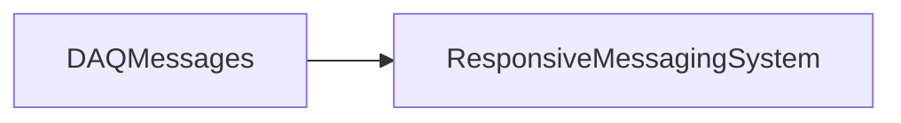

# DAQMessages

DDS IDL contracts for Run Control, global triggers, DCS, DDT, spill, SNEWS, and supernova traffic, plus mailbox helpers and status codes.

## Identity and scope

Repository: [NovaDAQ/DAQMessages](https://github.com/NovaDAQ/DAQMessages) · Reviewed commit: `cd0e5d09b401afc9f3dad448d7838f00cd60e778` · Domain: **Messaging**.

Tracked files: **42**. Production deployment and owner are **unconfirmed**.

## Operation

Regenerate and rebuild generated message libraries with the DDS toolchain used by all communicating peers. Match DDS partition and mailbox names. Changes to IDL layout or enum values require coordinated producer/consumer validation.

For prerequisites, safe start/stop sequencing, health checks, and rollback see the [operations guide](../operations/index.md).

## Build and integration

This package uses the SRT/SoftRelTools release context. A standalone `make` in a fresh checkout is not a supported build recipe unless the required context is already configured. See [build and release](../operations/build.md).

CMake definitions are present. Most NOvA fragments use parent-provided cetbuildtools macros and dependency targets; consult the files below before treating this directory as a standalone CMake project.

| Build definition |
| --- |
| [CMakeLists.txt](https://github.com/NovaDAQ/DAQMessages/blob/cd0e5d09b401afc9f3dad448d7838f00cd60e778/CMakeLists.txt) |
| [GNUmakefile](https://github.com/NovaDAQ/DAQMessages/blob/cd0e5d09b401afc9f3dad448d7838f00cd60e778/GNUmakefile) |
| [cxx/CMakeLists.txt](https://github.com/NovaDAQ/DAQMessages/blob/cd0e5d09b401afc9f3dad448d7838f00cd60e778/cxx/CMakeLists.txt) |
| [cxx/GNUmakefile](https://github.com/NovaDAQ/DAQMessages/blob/cd0e5d09b401afc9f3dad448d7838f00cd60e778/cxx/GNUmakefile) |
| [cxx/src/CMakeLists.txt](https://github.com/NovaDAQ/DAQMessages/blob/cd0e5d09b401afc9f3dad448d7838f00cd60e778/cxx/src/CMakeLists.txt) |
| [cxx/src/ConfigManager/CMakeLists.txt](https://github.com/NovaDAQ/DAQMessages/blob/cd0e5d09b401afc9f3dad448d7838f00cd60e778/cxx/src/ConfigManager/CMakeLists.txt) |
| [cxx/src/ConfigManager/GNUmakefile](https://github.com/NovaDAQ/DAQMessages/blob/cd0e5d09b401afc9f3dad448d7838f00cd60e778/cxx/src/ConfigManager/GNUmakefile) |
| [cxx/src/DAQDCSMonitor/CMakeLists.txt](https://github.com/NovaDAQ/DAQMessages/blob/cd0e5d09b401afc9f3dad448d7838f00cd60e778/cxx/src/DAQDCSMonitor/CMakeLists.txt) |
| [cxx/src/DAQDCSMonitor/GNUmakefile](https://github.com/NovaDAQ/DAQMessages/blob/cd0e5d09b401afc9f3dad448d7838f00cd60e778/cxx/src/DAQDCSMonitor/GNUmakefile) |
| [cxx/src/ErrorHandler/CMakeLists.txt](https://github.com/NovaDAQ/DAQMessages/blob/cd0e5d09b401afc9f3dad448d7838f00cd60e778/cxx/src/ErrorHandler/CMakeLists.txt) |
| [cxx/src/ErrorHandler/GNUmakefile](https://github.com/NovaDAQ/DAQMessages/blob/cd0e5d09b401afc9f3dad448d7838f00cd60e778/cxx/src/ErrorHandler/GNUmakefile) |
| [cxx/src/GNUmakefile](https://github.com/NovaDAQ/DAQMessages/blob/cd0e5d09b401afc9f3dad448d7838f00cd60e778/cxx/src/GNUmakefile) |
| [cxx/src/NovaDDT/CMakeLists.txt](https://github.com/NovaDAQ/DAQMessages/blob/cd0e5d09b401afc9f3dad448d7838f00cd60e778/cxx/src/NovaDDT/CMakeLists.txt) |
| [cxx/src/NovaDDT/GNUmakefile](https://github.com/NovaDAQ/DAQMessages/blob/cd0e5d09b401afc9f3dad448d7838f00cd60e778/cxx/src/NovaDDT/GNUmakefile) |
| [cxx/src/NovaGlobalTrigger/CMakeLists.txt](https://github.com/NovaDAQ/DAQMessages/blob/cd0e5d09b401afc9f3dad448d7838f00cd60e778/cxx/src/NovaGlobalTrigger/CMakeLists.txt) |
| [cxx/src/NovaGlobalTrigger/GNUmakefile](https://github.com/NovaDAQ/DAQMessages/blob/cd0e5d09b401afc9f3dad448d7838f00cd60e778/cxx/src/NovaGlobalTrigger/GNUmakefile) |
| [cxx/src/NovaRunControl/CMakeLists.txt](https://github.com/NovaDAQ/DAQMessages/blob/cd0e5d09b401afc9f3dad448d7838f00cd60e778/cxx/src/NovaRunControl/CMakeLists.txt) |
| [cxx/src/NovaRunControl/GNUmakefile](https://github.com/NovaDAQ/DAQMessages/blob/cd0e5d09b401afc9f3dad448d7838f00cd60e778/cxx/src/NovaRunControl/GNUmakefile) |
| [cxx/src/NovaSNEWSInterface/CMakeLists.txt](https://github.com/NovaDAQ/DAQMessages/blob/cd0e5d09b401afc9f3dad448d7838f00cd60e778/cxx/src/NovaSNEWSInterface/CMakeLists.txt) |
| [cxx/src/NovaSNEWSInterface/GNUmakefile](https://github.com/NovaDAQ/DAQMessages/blob/cd0e5d09b401afc9f3dad448d7838f00cd60e778/cxx/src/NovaSNEWSInterface/GNUmakefile) |
| [cxx/src/NovaSpillServer/CMakeLists.txt](https://github.com/NovaDAQ/DAQMessages/blob/cd0e5d09b401afc9f3dad448d7838f00cd60e778/cxx/src/NovaSpillServer/CMakeLists.txt) |
| [cxx/src/NovaSpillServer/GNUmakefile](https://github.com/NovaDAQ/DAQMessages/blob/cd0e5d09b401afc9f3dad448d7838f00cd60e778/cxx/src/NovaSpillServer/GNUmakefile) |
| [cxx/src/NovaSuperNova/CMakeLists.txt](https://github.com/NovaDAQ/DAQMessages/blob/cd0e5d09b401afc9f3dad448d7838f00cd60e778/cxx/src/NovaSuperNova/CMakeLists.txt) |
| [cxx/src/NovaSuperNova/GNUmakefile](https://github.com/NovaDAQ/DAQMessages/blob/cd0e5d09b401afc9f3dad448d7838f00cd60e778/cxx/src/NovaSuperNova/GNUmakefile) |
| [cxx/test/GNUmakefile](https://github.com/NovaDAQ/DAQMessages/blob/cd0e5d09b401afc9f3dad448d7838f00cd60e778/cxx/test/GNUmakefile) |
| [cxx/unittest/GNUmakefile](https://github.com/NovaDAQ/DAQMessages/blob/cd0e5d09b401afc9f3dad448d7838f00cd60e778/cxx/unittest/GNUmakefile) |
| [java/GNUmakefile](https://github.com/NovaDAQ/DAQMessages/blob/cd0e5d09b401afc9f3dad448d7838f00cd60e778/java/GNUmakefile) |
| [java/src/GNUmakefile](https://github.com/NovaDAQ/DAQMessages/blob/cd0e5d09b401afc9f3dad448d7838f00cd60e778/java/src/GNUmakefile) |
| [java/test/GNUmakefile](https://github.com/NovaDAQ/DAQMessages/blob/cd0e5d09b401afc9f3dad448d7838f00cd60e778/java/test/GNUmakefile) |
| [java/unittest/GNUmakefile](https://github.com/NovaDAQ/DAQMessages/blob/cd0e5d09b401afc9f3dad448d7838f00cd60e778/java/unittest/GNUmakefile) |

## Entry points

These are source entry points or operational scripts found statically. Installation names and enabled targets depend on the build/configuration; listing a script does not establish that it is deployed.

No standalone executable entry point was identified; this package may provide libraries, contracts, configuration, or binary artifacts.

## Interfaces

Headers and declared types form the API navigation map. Follow the source for method signatures, ownership, units, and error contracts. Generated DDS/XSD types are built from the schemas in the next section.

| Header | Declared types |
| --- | --- |
| [cxx/include/DDSMailbox.hpp](https://github.com/NovaDAQ/DAQMessages/blob/cd0e5d09b401afc9f3dad448d7838f00cd60e778/cxx/include/DDSMailbox.hpp) | `DDSConfig` |
| [cxx/include/Error.h](https://github.com/NovaDAQ/DAQMessages/blob/cd0e5d09b401afc9f3dad448d7838f00cd60e778/cxx/include/Error.h) | `errCode` |

## Configuration and data contracts

| Source artifact |
| --- |
| [config/DAQDCSMessages.idl](https://github.com/NovaDAQ/DAQMessages/blob/cd0e5d09b401afc9f3dad448d7838f00cd60e778/config/DAQDCSMessages.idl) |
| [config/DDTMessages.idl](https://github.com/NovaDAQ/DAQMessages/blob/cd0e5d09b401afc9f3dad448d7838f00cd60e778/config/DDTMessages.idl) |
| [config/ErrorHandlerMessages.idl](https://github.com/NovaDAQ/DAQMessages/blob/cd0e5d09b401afc9f3dad448d7838f00cd60e778/config/ErrorHandlerMessages.idl) |
| [config/GTMessages.idl](https://github.com/NovaDAQ/DAQMessages/blob/cd0e5d09b401afc9f3dad448d7838f00cd60e778/config/GTMessages.idl) |
| [config/NSNMessages.idl](https://github.com/NovaDAQ/DAQMessages/blob/cd0e5d09b401afc9f3dad448d7838f00cd60e778/config/NSNMessages.idl) |
| [config/NssMessages.idl](https://github.com/NovaDAQ/DAQMessages/blob/cd0e5d09b401afc9f3dad448d7838f00cd60e778/config/NssMessages.idl) |
| [config/RunControlMessages.idl](https://github.com/NovaDAQ/DAQMessages/blob/cd0e5d09b401afc9f3dad448d7838f00cd60e778/config/RunControlMessages.idl) |
| [config/SNEWSMessages.idl](https://github.com/NovaDAQ/DAQMessages/blob/cd0e5d09b401afc9f3dad448d7838f00cd60e778/config/SNEWSMessages.idl) |

## Environment and external dependencies

Environment names below are literal lookups found in source, not a guarantee that every value is mandatory. No environment values or credentials are copied into this documentation.

No literal environment lookup was identified by this scan; shell setup scripts may still provide required values.

Unresolved/non-package include roots (some are system or generated headers; this is not a package-manager lockfile):

| Include root | Evidence |
| --- | --- |
| `boost` | [cxx/include/DDSMailbox.hpp:6](https://github.com/NovaDAQ/DAQMessages/blob/cd0e5d09b401afc9f3dad448d7838f00cd60e778/cxx/include/DDSMailbox.hpp#L6) |

## Package dependencies

Arrow direction is **consumer → dependency**. This diagram includes source/build/runtime relationships and excludes test-only, release-membership, and build-tool edges. Conditional branches are not evaluated.

| Dependency | Relationship | Evidence |
| --- | --- | --- |
| [ResponsiveMessagingSystem](ResponsiveMessagingSystem.md) | build link | [cxx/src/DAQDCSMonitor/CMakeLists.txt:23](https://github.com/NovaDAQ/DAQMessages/blob/cd0e5d09b401afc9f3dad448d7838f00cd60e778/cxx/src/DAQDCSMonitor/CMakeLists.txt#L23) |
| [ResponsiveMessagingSystem](ResponsiveMessagingSystem.md) | source include | [cxx/include/DDSMailbox.hpp:9](https://github.com/NovaDAQ/DAQMessages/blob/cd0e5d09b401afc9f3dad448d7838f00cd60e778/cxx/include/DDSMailbox.hpp#L9) |
| [SRT_ONLINE](SRT_ONLINE.md) | build tool | [GNUmakefile:10](https://github.com/NovaDAQ/DAQMessages/blob/cd0e5d09b401afc9f3dad448d7838f00cd60e778/GNUmakefile#L10) |

Direct consumers: [BufferNodeEVB](BufferNodeEVB.md), [DAQApplicationManager](DAQApplicationManager.md), [DAQSimulationManager](DAQSimulationManager.md), [DCMApplication](DCMApplication.md), [DDTManager](DDTManager.md), [ErrorHandler](ErrorHandler.md), [NDLTest](NDLTest.md), [NovaDAQConfiguration](NovaDAQConfiguration.md), [NovaDAQMonitor](NovaDAQMonitor.md), [NovaDataLogger](NovaDataLogger.md), [NovaGlobalTrigger](NovaGlobalTrigger.md), [NovaResourceManager](NovaResourceManager.md), [NovaResoureManager](NovaResoureManager.md), [NovaRunControl](NovaRunControl.md), [NovaRunControlClient](NovaRunControlClient.md), [NovaSNEWSInterface](NovaSNEWSInterface.md), [NovaSpillServer](NovaSpillServer.md), [NovaSuperNova](NovaSuperNova.md), [SRT_ONLINE](SRT_ONLINE.md), [TDUControl](TDUControl.md), [TDUUtilities](TDUUtilities.md), [TriggerScalars](TriggerScalars.md).

Explore upstream/downstream impact in the [dependency explorer](../architecture/explorer.md).

## Validation and review

Static analysis attempted **0 C/C++ translation units**, **0 shell scripts**, and parsed **0 Python files**. Counts are tool input coverage, not proof of successful compilation or exhaustive review. Source/build/configuration inventories and the operating surface were also assessed.

| Severity | Finding | GitHub |
| --- | --- | --- |
| P2 | [NDAQ-022: Initialize the receive timeout when copying DDSInbox](../review/issues/NDAQ-022.md) | [Issue](https://github.com/NovaDAQ/DAQMessages/issues/1) |

Existing test/example sources (not executed against production):

No test/example source identified in the scoped inventory.

## Existing documentation

No package README/manual identified in the scoped inventory. Use this page and the source interfaces above.
