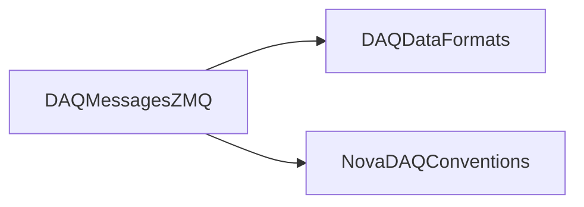

# DAQMessagesZMQ

ZeroMQ context/socket and typed mailbox wrappers with DDT and supernova message structures.

## Identity and scope

Repository: [NovaDAQ/DAQMessagesZMQ](https://github.com/NovaDAQ/DAQMessagesZMQ) · Reviewed commit: `48d08a04ebd6e210afed254bb61c7638c9c206a4` · Domain: **Messaging**.

Tracked files: **15**. Production deployment and owner are **unconfirmed**.

## Operation

Configure bind/connect endpoints consistently. Payloads currently use native C++ object layout; compiler ABI, field sizes, and message length must agree across peers. Test malformed and disconnected-peer behavior before using a new producer.

For prerequisites, safe start/stop sequencing, health checks, and rollback see the [operations guide](../operations/index.md).

## Build and integration

This package uses the SRT/SoftRelTools release context. A standalone `make` in a fresh checkout is not a supported build recipe unless the required context is already configured. See [build and release](../operations/build.md).

| Build definition |
| --- |
| [GNUmakefile](https://github.com/NovaDAQ/DAQMessagesZMQ/blob/48d08a04ebd6e210afed254bb61c7638c9c206a4/GNUmakefile) |
| [cxx/GNUmakefile](https://github.com/NovaDAQ/DAQMessagesZMQ/blob/48d08a04ebd6e210afed254bb61c7638c9c206a4/cxx/GNUmakefile) |
| [cxx/src/GNUmakefile](https://github.com/NovaDAQ/DAQMessagesZMQ/blob/48d08a04ebd6e210afed254bb61c7638c9c206a4/cxx/src/GNUmakefile) |
| [cxx/test/GNUmakefile](https://github.com/NovaDAQ/DAQMessagesZMQ/blob/48d08a04ebd6e210afed254bb61c7638c9c206a4/cxx/test/GNUmakefile) |
| [cxx/unittest/GNUmakefile](https://github.com/NovaDAQ/DAQMessagesZMQ/blob/48d08a04ebd6e210afed254bb61c7638c9c206a4/cxx/unittest/GNUmakefile) |
| [java/GNUmakefile](https://github.com/NovaDAQ/DAQMessagesZMQ/blob/48d08a04ebd6e210afed254bb61c7638c9c206a4/java/GNUmakefile) |
| [java/src/GNUmakefile](https://github.com/NovaDAQ/DAQMessagesZMQ/blob/48d08a04ebd6e210afed254bb61c7638c9c206a4/java/src/GNUmakefile) |
| [java/test/GNUmakefile](https://github.com/NovaDAQ/DAQMessagesZMQ/blob/48d08a04ebd6e210afed254bb61c7638c9c206a4/java/test/GNUmakefile) |
| [java/unittest/GNUmakefile](https://github.com/NovaDAQ/DAQMessagesZMQ/blob/48d08a04ebd6e210afed254bb61c7638c9c206a4/java/unittest/GNUmakefile) |

## Entry points

These are source entry points or operational scripts found statically. Installation names and enabled targets depend on the build/configuration; listing a script does not establish that it is deployed.

No standalone executable entry point was identified; this package may provide libraries, contracts, configuration, or binary artifacts.

## Interfaces

Headers and declared types form the API navigation map. Follow the source for method signatures, ownership, units, and error contracts. Generated DDS/XSD types are built from the schemas in the next section.

| Header | Declared types |
| --- | --- |
| [cxx/include/ZMQMailbox.hpp](https://github.com/NovaDAQ/DAQMessagesZMQ/blob/48d08a04ebd6e210afed254bb61c7638c9c206a4/cxx/include/ZMQMailbox.hpp) | `Inbox`, `Mailbox`, `Outbox`, `context_t`, `exception`, `socket_t` |
| [cxx/include/ZMQMessages.h](https://github.com/NovaDAQ/DAQMessagesZMQ/blob/48d08a04ebd6e210afed254bb61c7638c9c206a4/cxx/include/ZMQMessages.h) | `ddt_message`, `nsn_message` |

## Configuration and data contracts

No separate XML/IDL/XSD/FHiCL/INI/YAML/JSON configuration was identified. Inspect command-line parsing and site launchers for this package; defaults may be embedded in source.

## Environment and external dependencies

Environment names below are literal lookups found in source, not a guarantee that every value is mandatory. No environment values or credentials are copied into this documentation.

No literal environment lookup was identified by this scan; shell setup scripts may still provide required values.

## Package dependencies

Arrow direction is **consumer → dependency**. This diagram includes source/build/runtime relationships and excludes test-only, release-membership, and build-tool edges. Conditional branches are not evaluated.

| Dependency | Relationship | Evidence |
| --- | --- | --- |
| [DAQDataFormats](DAQDataFormats.md) | source include | [cxx/include/ZMQMessages.h:5](https://github.com/NovaDAQ/DAQMessagesZMQ/blob/48d08a04ebd6e210afed254bb61c7638c9c206a4/cxx/include/ZMQMessages.h#L5) |
| [NovaDAQConventions](NovaDAQConventions.md) | source include | [cxx/include/ZMQMessages.h:4](https://github.com/NovaDAQ/DAQMessagesZMQ/blob/48d08a04ebd6e210afed254bb61c7638c9c206a4/cxx/include/ZMQMessages.h#L4) |
| [SRT_ONLINE](SRT_ONLINE.md) | build tool | [GNUmakefile:11](https://github.com/NovaDAQ/DAQMessagesZMQ/blob/48d08a04ebd6e210afed254bb61c7638c9c206a4/GNUmakefile#L11) |

Direct consumers: [NovaGlobalTrigger](NovaGlobalTrigger.md), [NovaSuperNova](NovaSuperNova.md).

Explore upstream/downstream impact in the [dependency explorer](../architecture/explorer.md).

## Validation and review

Static analysis attempted **3 C/C++ translation units**, **0 shell scripts**, and parsed **0 Python files**. Counts are tool input coverage, not proof of successful compilation or exhaustive review. Source/build/configuration inventories and the operating surface were also assessed.

| Severity | Finding | GitHub |
| --- | --- | --- |
| P1 | [NDAQ-023: Reject incorrectly sized messages before exposing typed payloads](../review/issues/NDAQ-023.md) | [Issue](https://github.com/NovaDAQ/DAQMessagesZMQ/issues/1) |

Existing test/example sources (not executed against production):

| Source |
| --- |
| [cxx/test/zmq_pull.cc](https://github.com/NovaDAQ/DAQMessagesZMQ/blob/48d08a04ebd6e210afed254bb61c7638c9c206a4/cxx/test/zmq_pull.cc) |
| [cxx/test/zmq_pull_ddt.cc](https://github.com/NovaDAQ/DAQMessagesZMQ/blob/48d08a04ebd6e210afed254bb61c7638c9c206a4/cxx/test/zmq_pull_ddt.cc) |
| [cxx/test/zmq_push.cc](https://github.com/NovaDAQ/DAQMessagesZMQ/blob/48d08a04ebd6e210afed254bb61c7638c9c206a4/cxx/test/zmq_push.cc) |

## Existing documentation

No package README/manual identified in the scoped inventory. Use this page and the source interfaces above.
