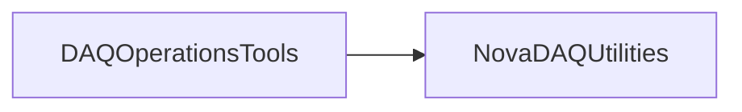

# DAQOperationsTools

Startup, shutdown, health checking, recovery, environment setup, and distributed process orchestration for DAQ services.

## Identity and scope

Repository: [NovaDAQ/DAQOperationsTools](https://github.com/NovaDAQ/DAQOperationsTools) · Reviewed commit: `5b3fd3792f8526e5db7016f961c8e2debea28118` · Domain: **Operations**.

Tracked files: **187**. Production deployment and owner are **unconfirmed**.

## Operation

Use the site setup and explicit DAQ partition before invoking launchers. Prefer status checks and the Run Control lifecycle over killing processes directly. Inspect recovery scripts before execution because they can affect many hosts and hardware services.

For prerequisites, safe start/stop sequencing, health checks, and rollback see the [operations guide](../operations/index.md).

## Build and integration

This package uses the SRT/SoftRelTools release context. A standalone `make` in a fresh checkout is not a supported build recipe unless the required context is already configured. See [build and release](../operations/build.md).

| Build definition |
| --- |
| [GNUmakefile](https://github.com/NovaDAQ/DAQOperationsTools/blob/5b3fd3792f8526e5db7016f961c8e2debea28118/GNUmakefile) |
| [cxx/GNUmakefile](https://github.com/NovaDAQ/DAQOperationsTools/blob/5b3fd3792f8526e5db7016f961c8e2debea28118/cxx/GNUmakefile) |
| [cxx/src/GNUmakefile](https://github.com/NovaDAQ/DAQOperationsTools/blob/5b3fd3792f8526e5db7016f961c8e2debea28118/cxx/src/GNUmakefile) |
| [cxx/test/GNUmakefile](https://github.com/NovaDAQ/DAQOperationsTools/blob/5b3fd3792f8526e5db7016f961c8e2debea28118/cxx/test/GNUmakefile) |
| [cxx/unittest/GNUmakefile](https://github.com/NovaDAQ/DAQOperationsTools/blob/5b3fd3792f8526e5db7016f961c8e2debea28118/cxx/unittest/GNUmakefile) |
| [script/GNUmakefile](https://github.com/NovaDAQ/DAQOperationsTools/blob/5b3fd3792f8526e5db7016f961c8e2debea28118/script/GNUmakefile) |
| [setup/GNUmakefile](https://github.com/NovaDAQ/DAQOperationsTools/blob/5b3fd3792f8526e5db7016f961c8e2debea28118/setup/GNUmakefile) |

## Entry points

These are source entry points or operational scripts found statically. Installation names and enabled targets depend on the build/configuration; listing a script does not establish that it is deployed.

| Source |
| --- |
| [cxx/src/DistributedSystem.cc](https://github.com/NovaDAQ/DAQOperationsTools/blob/5b3fd3792f8526e5db7016f961c8e2debea28118/cxx/src/DistributedSystem.cc) |
| [script/FD_DAQ_Recovery.py](https://github.com/NovaDAQ/DAQOperationsTools/blob/5b3fd3792f8526e5db7016f961c8e2debea28118/script/FD_DAQ_Recovery.py) |
| [script/InUseDAQNodes.sh](https://github.com/NovaDAQ/DAQOperationsTools/blob/5b3fd3792f8526e5db7016f961c8e2debea28118/script/InUseDAQNodes.sh) |
| [script/LoadshedWarning.py](https://github.com/NovaDAQ/DAQOperationsTools/blob/5b3fd3792f8526e5db7016f961c8e2debea28118/script/LoadshedWarning.py) |
| [script/ND_DAQ_Recovery.py](https://github.com/NovaDAQ/DAQOperationsTools/blob/5b3fd3792f8526e5db7016f961c8e2debea28118/script/ND_DAQ_Recovery.py) |
| [script/alertSleepyShifter.sh](https://github.com/NovaDAQ/DAQOperationsTools/blob/5b3fd3792f8526e5db7016f961c8e2debea28118/script/alertSleepyShifter.sh) |
| [script/autoRestartSpillServerBackbone.sh](https://github.com/NovaDAQ/DAQOperationsTools/blob/5b3fd3792f8526e5db7016f961c8e2debea28118/script/autoRestartSpillServerBackbone.sh) |
| [script/checkDDSEverywhere.sh](https://github.com/NovaDAQ/DAQOperationsTools/blob/5b3fd3792f8526e5db7016f961c8e2debea28118/script/checkDDSEverywhere.sh) |
| [script/checkEventDispatcher.sh](https://github.com/NovaDAQ/DAQOperationsTools/blob/5b3fd3792f8526e5db7016f961c8e2debea28118/script/checkEventDispatcher.sh) |
| [script/checkMessageServer.sh](https://github.com/NovaDAQ/DAQOperationsTools/blob/5b3fd3792f8526e5db7016f961c8e2debea28118/script/checkMessageServer.sh) |
| [script/checkPVArchiver.sh](https://github.com/NovaDAQ/DAQOperationsTools/blob/5b3fd3792f8526e5db7016f961c8e2debea28118/script/checkPVArchiver.sh) |
| [script/checkSynch.sh](https://github.com/NovaDAQ/DAQOperationsTools/blob/5b3fd3792f8526e5db7016f961c8e2debea28118/script/checkSynch.sh) |
| [script/checkTDUManager.sh](https://github.com/NovaDAQ/DAQOperationsTools/blob/5b3fd3792f8526e5db7016f961c8e2debea28118/script/checkTDUManager.sh) |
| [script/checkTriggerScalars.sh](https://github.com/NovaDAQ/DAQOperationsTools/blob/5b3fd3792f8526e5db7016f961c8e2debea28118/script/checkTriggerScalars.sh) |
| [script/countProcessInstances.sh](https://github.com/NovaDAQ/DAQOperationsTools/blob/5b3fd3792f8526e5db7016f961c8e2debea28118/script/countProcessInstances.sh) |
| [script/countRemoteProcessInstances.sh](https://github.com/NovaDAQ/DAQOperationsTools/blob/5b3fd3792f8526e5db7016f961c8e2debea28118/script/countRemoteProcessInstances.sh) |
| [script/dashboard.py](https://github.com/NovaDAQ/DAQOperationsTools/blob/5b3fd3792f8526e5db7016f961c8e2debea28118/script/dashboard.py) |
| [script/dashboard_alarms2email.sh](https://github.com/NovaDAQ/DAQOperationsTools/blob/5b3fd3792f8526e5db7016f961c8e2debea28118/script/dashboard_alarms2email.sh) |
| [script/dashboard_statusfilefill.sh](https://github.com/NovaDAQ/DAQOperationsTools/blob/5b3fd3792f8526e5db7016f961c8e2debea28118/script/dashboard_statusfilefill.sh) |
| [script/dbutils_new.py](https://github.com/NovaDAQ/DAQOperationsTools/blob/5b3fd3792f8526e5db7016f961c8e2debea28118/script/dbutils_new.py) |
| [script/depricated/startBeamSpillBackBone.sh](https://github.com/NovaDAQ/DAQOperationsTools/blob/5b3fd3792f8526e5db7016f961c8e2debea28118/script/depricated/startBeamSpillBackBone.sh) |
| [script/depricated/startBeamSpills-Feynman.sh](https://github.com/NovaDAQ/DAQOperationsTools/blob/5b3fd3792f8526e5db7016f961c8e2debea28118/script/depricated/startBeamSpills-Feynman.sh) |
| [script/depricated/startBeamSpills-Minos-AshRiver.sh](https://github.com/NovaDAQ/DAQOperationsTools/blob/5b3fd3792f8526e5db7016f961c8e2debea28118/script/depricated/startBeamSpills-Minos-AshRiver.sh) |
| [script/depricated/startBeamSpills-Minos.sh](https://github.com/NovaDAQ/DAQOperationsTools/blob/5b3fd3792f8526e5db7016f961c8e2debea28118/script/depricated/startBeamSpills-Minos.sh) |
| [script/depricated/startBeamSpills.sh](https://github.com/NovaDAQ/DAQOperationsTools/blob/5b3fd3792f8526e5db7016f961c8e2debea28118/script/depricated/startBeamSpills.sh) |
| [script/depricated/startDDTManager.sh](https://github.com/NovaDAQ/DAQOperationsTools/blob/5b3fd3792f8526e5db7016f961c8e2debea28118/script/depricated/startDDTManager.sh) |
| [script/depricated/startNssSpillForwarder-AshRiver.sh](https://github.com/NovaDAQ/DAQOperationsTools/blob/5b3fd3792f8526e5db7016f961c8e2debea28118/script/depricated/startNssSpillForwarder-AshRiver.sh) |
| [script/depricated/startNssSpillForwarder-Minos.sh](https://github.com/NovaDAQ/DAQOperationsTools/blob/5b3fd3792f8526e5db7016f961c8e2debea28118/script/depricated/startNssSpillForwarder-Minos.sh) |
| [script/depricated/startNssTDUApp-Minos.sh](https://github.com/NovaDAQ/DAQOperationsTools/blob/5b3fd3792f8526e5db7016f961c8e2debea28118/script/depricated/startNssTDUApp-Minos.sh) |
| [script/depricated/startTCRMonitor.sh](https://github.com/NovaDAQ/DAQOperationsTools/blob/5b3fd3792f8526e5db7016f961c8e2debea28118/script/depricated/startTCRMonitor.sh) |
| [script/depricated/startTDUWeb.sh](https://github.com/NovaDAQ/DAQOperationsTools/blob/5b3fd3792f8526e5db7016f961c8e2debea28118/script/depricated/startTDUWeb.sh) |
| [script/depricated/stopBeamSpills.sh](https://github.com/NovaDAQ/DAQOperationsTools/blob/5b3fd3792f8526e5db7016f961c8e2debea28118/script/depricated/stopBeamSpills.sh) |
| [script/depricated/stopNssSpillForwarder-AshRiver.sh](https://github.com/NovaDAQ/DAQOperationsTools/blob/5b3fd3792f8526e5db7016f961c8e2debea28118/script/depricated/stopNssSpillForwarder-AshRiver.sh) |
| [script/depricated/stopNssSpillForwarder-Minos.sh](https://github.com/NovaDAQ/DAQOperationsTools/blob/5b3fd3792f8526e5db7016f961c8e2debea28118/script/depricated/stopNssSpillForwarder-Minos.sh) |
| [script/depricated/stopNssTDUApp-Minos.sh](https://github.com/NovaDAQ/DAQOperationsTools/blob/5b3fd3792f8526e5db7016f961c8e2debea28118/script/depricated/stopNssTDUApp-Minos.sh) |
| [script/depricated/stopSNEWSMessageForwarder-AshRiver.sh](https://github.com/NovaDAQ/DAQOperationsTools/blob/5b3fd3792f8526e5db7016f961c8e2debea28118/script/depricated/stopSNEWSMessageForwarder-AshRiver.sh) |
| [script/depricated/stopSNEWSMessageForwarder-FNAL.sh](https://github.com/NovaDAQ/DAQOperationsTools/blob/5b3fd3792f8526e5db7016f961c8e2debea28118/script/depricated/stopSNEWSMessageForwarder-FNAL.sh) |
| [script/dtl.py](https://github.com/NovaDAQ/DAQOperationsTools/blob/5b3fd3792f8526e5db7016f961c8e2debea28118/script/dtl.py) |
| [script/dtl_report.sh](https://github.com/NovaDAQ/DAQOperationsTools/blob/5b3fd3792f8526e5db7016f961c8e2debea28118/script/dtl_report.sh) |
| [script/emergencyStopRun.sh](https://github.com/NovaDAQ/DAQOperationsTools/blob/5b3fd3792f8526e5db7016f961c8e2debea28118/script/emergencyStopRun.sh) |
| [script/fetchProcessInfo.sh](https://github.com/NovaDAQ/DAQOperationsTools/blob/5b3fd3792f8526e5db7016f961c8e2debea28118/script/fetchProcessInfo.sh) |
| [script/fillShifterRunQuality.py](https://github.com/NovaDAQ/DAQOperationsTools/blob/5b3fd3792f8526e5db7016f961c8e2debea28118/script/fillShifterRunQuality.py) |
| [script/findProcessIds.sh](https://github.com/NovaDAQ/DAQOperationsTools/blob/5b3fd3792f8526e5db7016f961c8e2debea28118/script/findProcessIds.sh) |
| [script/find_release_skews.sh](https://github.com/NovaDAQ/DAQOperationsTools/blob/5b3fd3792f8526e5db7016f961c8e2debea28118/script/find_release_skews.sh) |
| [script/gen_fd_node_list_v2.py](https://github.com/NovaDAQ/DAQOperationsTools/blob/5b3fd3792f8526e5db7016f961c8e2debea28118/script/gen_fd_node_list_v2.py) |
| [script/killRoguePartition.sh](https://github.com/NovaDAQ/DAQOperationsTools/blob/5b3fd3792f8526e5db7016f961c8e2debea28118/script/killRoguePartition.sh) |
| [script/loadThresholdPixelFEB.sh](https://github.com/NovaDAQ/DAQOperationsTools/blob/5b3fd3792f8526e5db7016f961c8e2debea28118/script/loadThresholdPixelFEB.sh) |
| [script/popupLoadshedWarning.sh](https://github.com/NovaDAQ/DAQOperationsTools/blob/5b3fd3792f8526e5db7016f961c8e2debea28118/script/popupLoadshedWarning.sh) |
| [script/printNovaDBEnvVars.sh](https://github.com/NovaDAQ/DAQOperationsTools/blob/5b3fd3792f8526e5db7016f961c8e2debea28118/script/printNovaDBEnvVars.sh) |
| [script/recoverLostRunInfo.py](https://github.com/NovaDAQ/DAQOperationsTools/blob/5b3fd3792f8526e5db7016f961c8e2debea28118/script/recoverLostRunInfo.py) |
| [script/recoverLostRunInfoFar.sh](https://github.com/NovaDAQ/DAQOperationsTools/blob/5b3fd3792f8526e5db7016f961c8e2debea28118/script/recoverLostRunInfoFar.sh) |
| [script/recoverLostRunInfoNear.sh](https://github.com/NovaDAQ/DAQOperationsTools/blob/5b3fd3792f8526e5db7016f961c8e2debea28118/script/recoverLostRunInfoNear.sh) |
| [script/recoverMissingRsrcInfo.py](https://github.com/NovaDAQ/DAQOperationsTools/blob/5b3fd3792f8526e5db7016f961c8e2debea28118/script/recoverMissingRsrcInfo.py) |
| [script/recycleStartBeamSpills.sh](https://github.com/NovaDAQ/DAQOperationsTools/blob/5b3fd3792f8526e5db7016f961c8e2debea28118/script/recycleStartBeamSpills.sh) |
| [script/restartRunControl.sh](https://github.com/NovaDAQ/DAQOperationsTools/blob/5b3fd3792f8526e5db7016f961c8e2debea28118/script/restartRunControl.sh) |
| [script/runRemoteCommand.sh](https://github.com/NovaDAQ/DAQOperationsTools/blob/5b3fd3792f8526e5db7016f961c8e2debea28118/script/runRemoteCommand.sh) |
| [script/runRemoteGUICommand.sh](https://github.com/NovaDAQ/DAQOperationsTools/blob/5b3fd3792f8526e5db7016f961c8e2debea28118/script/runRemoteGUICommand.sh) |
| [script/send-novacr03-XauthCookieToMaster.sh](https://github.com/NovaDAQ/DAQOperationsTools/blob/5b3fd3792f8526e5db7016f961c8e2debea28118/script/send-novacr03-XauthCookieToMaster.sh) |
| [script/sendemail.sh](https://github.com/NovaDAQ/DAQOperationsTools/blob/5b3fd3792f8526e5db7016f961c8e2debea28118/script/sendemail.sh) |
| [script/setupHardwareDBEnvVars.sh](https://github.com/NovaDAQ/DAQOperationsTools/blob/5b3fd3792f8526e5db7016f961c8e2debea28118/script/setupHardwareDBEnvVars.sh) |
| [script/setupNovaDBDevEnvVars.sh](https://github.com/NovaDAQ/DAQOperationsTools/blob/5b3fd3792f8526e5db7016f961c8e2debea28118/script/setupNovaDBDevEnvVars.sh) |
| [script/setupNovaDBEnvVars.sh](https://github.com/NovaDAQ/DAQOperationsTools/blob/5b3fd3792f8526e5db7016f961c8e2debea28118/script/setupNovaDBEnvVars.sh) |
| [script/setupNovaDcsDBEnvVars.sh](https://github.com/NovaDAQ/DAQOperationsTools/blob/5b3fd3792f8526e5db7016f961c8e2debea28118/script/setupNovaDcsDBEnvVars.sh) |
| [script/setupReadOnlyProdDBEnvVars.sh](https://github.com/NovaDAQ/DAQOperationsTools/blob/5b3fd3792f8526e5db7016f961c8e2debea28118/script/setupReadOnlyProdDBEnvVars.sh) |
| [script/setupTemporaryDCSProdDBEnvVars.sh](https://github.com/NovaDAQ/DAQOperationsTools/blob/5b3fd3792f8526e5db7016f961c8e2debea28118/script/setupTemporaryDCSProdDBEnvVars.sh) |
| [script/setupTemporaryProdDBEnvVars.sh](https://github.com/NovaDAQ/DAQOperationsTools/blob/5b3fd3792f8526e5db7016f961c8e2debea28118/script/setupTemporaryProdDBEnvVars.sh) |
| [script/startBeamSpillBackBoneFCC.sh](https://github.com/NovaDAQ/DAQOperationsTools/blob/5b3fd3792f8526e5db7016f961c8e2debea28118/script/startBeamSpillBackBoneFCC.sh) |
| [script/startBeamSpillBackBoneND.sh](https://github.com/NovaDAQ/DAQOperationsTools/blob/5b3fd3792f8526e5db7016f961c8e2debea28118/script/startBeamSpillBackBoneND.sh) |
| [script/startBeamSpillBackBoneTB.sh](https://github.com/NovaDAQ/DAQOperationsTools/blob/5b3fd3792f8526e5db7016f961c8e2debea28118/script/startBeamSpillBackBoneTB.sh) |
| [script/startBeamSpillBackBoneTBL.sh](https://github.com/NovaDAQ/DAQOperationsTools/blob/5b3fd3792f8526e5db7016f961c8e2debea28118/script/startBeamSpillBackBoneTBL.sh) |
| [script/startBufferNodeEVB.sh](https://github.com/NovaDAQ/DAQOperationsTools/blob/5b3fd3792f8526e5db7016f961c8e2debea28118/script/startBufferNodeEVB.sh) |
| [script/startConfigurationManager.sh](https://github.com/NovaDAQ/DAQOperationsTools/blob/5b3fd3792f8526e5db7016f961c8e2debea28118/script/startConfigurationManager.sh) |
| [script/startDAQApplicationManager.sh](https://github.com/NovaDAQ/DAQOperationsTools/blob/5b3fd3792f8526e5db7016f961c8e2debea28118/script/startDAQApplicationManager.sh) |
| [script/startDAQConfigEditor.sh](https://github.com/NovaDAQ/DAQOperationsTools/blob/5b3fd3792f8526e5db7016f961c8e2debea28118/script/startDAQConfigEditor.sh) |
| [script/startDCMApplication.sh](https://github.com/NovaDAQ/DAQOperationsTools/blob/5b3fd3792f8526e5db7016f961c8e2debea28118/script/startDCMApplication.sh) |
| [script/startDCSConfigEditor.sh](https://github.com/NovaDAQ/DAQOperationsTools/blob/5b3fd3792f8526e5db7016f961c8e2debea28118/script/startDCSConfigEditor.sh) |
| [script/startDDS.sh](https://github.com/NovaDAQ/DAQOperationsTools/blob/5b3fd3792f8526e5db7016f961c8e2debea28118/script/startDDS.sh) |
| [script/startDDSEverywhere.sh](https://github.com/NovaDAQ/DAQOperationsTools/blob/5b3fd3792f8526e5db7016f961c8e2debea28118/script/startDDSEverywhere.sh) |
| [script/startDDTFilter.sh](https://github.com/NovaDAQ/DAQOperationsTools/blob/5b3fd3792f8526e5db7016f961c8e2debea28118/script/startDDTFilter.sh) |
| [script/startDDTFilter_noiseMap.sh](https://github.com/NovaDAQ/DAQOperationsTools/blob/5b3fd3792f8526e5db7016f961c8e2debea28118/script/startDDTFilter_noiseMap.sh) |
| [script/startDTL.sh](https://github.com/NovaDAQ/DAQOperationsTools/blob/5b3fd3792f8526e5db7016f961c8e2debea28118/script/startDTL.sh) |
| [script/startDaqMonitor.sh](https://github.com/NovaDAQ/DAQOperationsTools/blob/5b3fd3792f8526e5db7016f961c8e2debea28118/script/startDaqMonitor.sh) |
| [script/startDashboard.sh](https://github.com/NovaDAQ/DAQOperationsTools/blob/5b3fd3792f8526e5db7016f961c8e2debea28118/script/startDashboard.sh) |
| [script/startDataLogger.sh](https://github.com/NovaDAQ/DAQOperationsTools/blob/5b3fd3792f8526e5db7016f961c8e2debea28118/script/startDataLogger.sh) |
| [script/startDiskWatcher.sh](https://github.com/NovaDAQ/DAQOperationsTools/blob/5b3fd3792f8526e5db7016f961c8e2debea28118/script/startDiskWatcher.sh) |
| [script/startEventDispatcher.sh](https://github.com/NovaDAQ/DAQOperationsTools/blob/5b3fd3792f8526e5db7016f961c8e2debea28118/script/startEventDispatcher.sh) |
| [script/startGlobalTrigger.sh](https://github.com/NovaDAQ/DAQOperationsTools/blob/5b3fd3792f8526e5db7016f961c8e2debea28118/script/startGlobalTrigger.sh) |
| [script/startMessageAnalyzer.sh](https://github.com/NovaDAQ/DAQOperationsTools/blob/5b3fd3792f8526e5db7016f961c8e2debea28118/script/startMessageAnalyzer.sh) |
| [script/startMessageServer.sh](https://github.com/NovaDAQ/DAQOperationsTools/blob/5b3fd3792f8526e5db7016f961c8e2debea28118/script/startMessageServer.sh) |
| [script/startMessageViewer.sh](https://github.com/NovaDAQ/DAQOperationsTools/blob/5b3fd3792f8526e5db7016f961c8e2debea28118/script/startMessageViewer.sh) |
| [script/startMsgAnalyzer.sh](https://github.com/NovaDAQ/DAQOperationsTools/blob/5b3fd3792f8526e5db7016f961c8e2debea28118/script/startMsgAnalyzer.sh) |
| [script/startMsgAnalyzer0.sh](https://github.com/NovaDAQ/DAQOperationsTools/blob/5b3fd3792f8526e5db7016f961c8e2debea28118/script/startMsgAnalyzer0.sh) |
| [script/startNssSpillReceiver.sh](https://github.com/NovaDAQ/DAQOperationsTools/blob/5b3fd3792f8526e5db7016f961c8e2debea28118/script/startNssSpillReceiver.sh) |
| [script/startOPICSS.sh](https://github.com/NovaDAQ/DAQOperationsTools/blob/5b3fd3792f8526e5db7016f961c8e2debea28118/script/startOPICSS.sh) |
| [script/startPVArchiver.sh](https://github.com/NovaDAQ/DAQOperationsTools/blob/5b3fd3792f8526e5db7016f961c8e2debea28118/script/startPVArchiver.sh) |
| [script/startPreSNShiftGUI.sh](https://github.com/NovaDAQ/DAQOperationsTools/blob/5b3fd3792f8526e5db7016f961c8e2debea28118/script/startPreSNShiftGUI.sh) |
| [script/startRegIOC.sh](https://github.com/NovaDAQ/DAQOperationsTools/blob/5b3fd3792f8526e5db7016f961c8e2debea28118/script/startRegIOC.sh) |
| [script/startResourceManager.sh](https://github.com/NovaDAQ/DAQOperationsTools/blob/5b3fd3792f8526e5db7016f961c8e2debea28118/script/startResourceManager.sh) |
| [script/startRunControl.sh](https://github.com/NovaDAQ/DAQOperationsTools/blob/5b3fd3792f8526e5db7016f961c8e2debea28118/script/startRunControl.sh) |
| [script/startRunControlGUI.sh](https://github.com/NovaDAQ/DAQOperationsTools/blob/5b3fd3792f8526e5db7016f961c8e2debea28118/script/startRunControlGUI.sh) |
| [script/startSNEWSMessageBackBone.sh](https://github.com/NovaDAQ/DAQOperationsTools/blob/5b3fd3792f8526e5db7016f961c8e2debea28118/script/startSNEWSMessageBackBone.sh) |
| [script/startSNEWSMessageReceiver.sh](https://github.com/NovaDAQ/DAQOperationsTools/blob/5b3fd3792f8526e5db7016f961c8e2debea28118/script/startSNEWSMessageReceiver.sh) |
| [script/startSimulationManager.sh](https://github.com/NovaDAQ/DAQOperationsTools/blob/5b3fd3792f8526e5db7016f961c8e2debea28118/script/startSimulationManager.sh) |
| [script/startSpillServerApp_Standalone.sh](https://github.com/NovaDAQ/DAQOperationsTools/blob/5b3fd3792f8526e5db7016f961c8e2debea28118/script/startSpillServerApp_Standalone.sh) |
| [script/startTCRMonitor-far.sh](https://github.com/NovaDAQ/DAQOperationsTools/blob/5b3fd3792f8526e5db7016f961c8e2debea28118/script/startTCRMonitor-far.sh) |
| [script/startTCRMonitor-near.sh](https://github.com/NovaDAQ/DAQOperationsTools/blob/5b3fd3792f8526e5db7016f961c8e2debea28118/script/startTCRMonitor-near.sh) |
| [script/startTCRMonitor-test.sh](https://github.com/NovaDAQ/DAQOperationsTools/blob/5b3fd3792f8526e5db7016f961c8e2debea28118/script/startTCRMonitor-test.sh) |
| [script/startTDUDelayMonitor.sh](https://github.com/NovaDAQ/DAQOperationsTools/blob/5b3fd3792f8526e5db7016f961c8e2debea28118/script/startTDUDelayMonitor.sh) |
| [script/startTDUManager.sh](https://github.com/NovaDAQ/DAQOperationsTools/blob/5b3fd3792f8526e5db7016f961c8e2debea28118/script/startTDUManager.sh) |
| [script/startTDUManagerRemotely.sh](https://github.com/NovaDAQ/DAQOperationsTools/blob/5b3fd3792f8526e5db7016f961c8e2debea28118/script/startTDUManagerRemotely.sh) |
| [script/startTDUWeb-far.sh](https://github.com/NovaDAQ/DAQOperationsTools/blob/5b3fd3792f8526e5db7016f961c8e2debea28118/script/startTDUWeb-far.sh) |
| [script/startTDUWeb-near.sh](https://github.com/NovaDAQ/DAQOperationsTools/blob/5b3fd3792f8526e5db7016f961c8e2debea28118/script/startTDUWeb-near.sh) |
| [script/startTriggerScalars.sh](https://github.com/NovaDAQ/DAQOperationsTools/blob/5b3fd3792f8526e5db7016f961c8e2debea28118/script/startTriggerScalars.sh) |
| [script/startTriggerScalarsRemotely.sh](https://github.com/NovaDAQ/DAQOperationsTools/blob/5b3fd3792f8526e5db7016f961c8e2debea28118/script/startTriggerScalarsRemotely.sh) |
| [script/start_gmond_dcm.sh](https://github.com/NovaDAQ/DAQOperationsTools/blob/5b3fd3792f8526e5db7016f961c8e2debea28118/script/start_gmond_dcm.sh) |
| [script/start_gmond_dcm_far.sh](https://github.com/NovaDAQ/DAQOperationsTools/blob/5b3fd3792f8526e5db7016f961c8e2debea28118/script/start_gmond_dcm_far.sh) |
| [script/start_gmond_dcm_ndos.sh](https://github.com/NovaDAQ/DAQOperationsTools/blob/5b3fd3792f8526e5db7016f961c8e2debea28118/script/start_gmond_dcm_ndos.sh) |
| [script/start_gmond_dcm_near.sh](https://github.com/NovaDAQ/DAQOperationsTools/blob/5b3fd3792f8526e5db7016f961c8e2debea28118/script/start_gmond_dcm_near.sh) |
| [script/start_gmond_dcm_ts.sh](https://github.com/NovaDAQ/DAQOperationsTools/blob/5b3fd3792f8526e5db7016f961c8e2debea28118/script/start_gmond_dcm_ts.sh) |
| [script/stopBeamSpills-all.sh](https://github.com/NovaDAQ/DAQOperationsTools/blob/5b3fd3792f8526e5db7016f961c8e2debea28118/script/stopBeamSpills-all.sh) |
| [script/stopDAQApplicationManager.sh](https://github.com/NovaDAQ/DAQOperationsTools/blob/5b3fd3792f8526e5db7016f961c8e2debea28118/script/stopDAQApplicationManager.sh) |
| [script/stopDCMApplication.sh](https://github.com/NovaDAQ/DAQOperationsTools/blob/5b3fd3792f8526e5db7016f961c8e2debea28118/script/stopDCMApplication.sh) |
| [script/stopDDS.sh](https://github.com/NovaDAQ/DAQOperationsTools/blob/5b3fd3792f8526e5db7016f961c8e2debea28118/script/stopDDS.sh) |
| [script/stopDDSEverywhere.sh](https://github.com/NovaDAQ/DAQOperationsTools/blob/5b3fd3792f8526e5db7016f961c8e2debea28118/script/stopDDSEverywhere.sh) |
| [script/stopDiskWatcher.sh](https://github.com/NovaDAQ/DAQOperationsTools/blob/5b3fd3792f8526e5db7016f961c8e2debea28118/script/stopDiskWatcher.sh) |
| [script/stopEventDispatcher.sh](https://github.com/NovaDAQ/DAQOperationsTools/blob/5b3fd3792f8526e5db7016f961c8e2debea28118/script/stopEventDispatcher.sh) |
| [script/stopGlobalTrigger.sh](https://github.com/NovaDAQ/DAQOperationsTools/blob/5b3fd3792f8526e5db7016f961c8e2debea28118/script/stopGlobalTrigger.sh) |
| [script/stopNssSpillReceiver.sh](https://github.com/NovaDAQ/DAQOperationsTools/blob/5b3fd3792f8526e5db7016f961c8e2debea28118/script/stopNssSpillReceiver.sh) |
| [script/stopProcess.sh](https://github.com/NovaDAQ/DAQOperationsTools/blob/5b3fd3792f8526e5db7016f961c8e2debea28118/script/stopProcess.sh) |
| [script/stopRegIOC.sh](https://github.com/NovaDAQ/DAQOperationsTools/blob/5b3fd3792f8526e5db7016f961c8e2debea28118/script/stopRegIOC.sh) |
| [script/stopResourceManager.sh](https://github.com/NovaDAQ/DAQOperationsTools/blob/5b3fd3792f8526e5db7016f961c8e2debea28118/script/stopResourceManager.sh) |
| [script/stopRunControl.sh](https://github.com/NovaDAQ/DAQOperationsTools/blob/5b3fd3792f8526e5db7016f961c8e2debea28118/script/stopRunControl.sh) |
| [script/stopSNEWSMessageReceiver.sh](https://github.com/NovaDAQ/DAQOperationsTools/blob/5b3fd3792f8526e5db7016f961c8e2debea28118/script/stopSNEWSMessageReceiver.sh) |
| [script/stopTDUDelayMonitor.sh](https://github.com/NovaDAQ/DAQOperationsTools/blob/5b3fd3792f8526e5db7016f961c8e2debea28118/script/stopTDUDelayMonitor.sh) |
| [script/stop_dso_far.sh](https://github.com/NovaDAQ/DAQOperationsTools/blob/5b3fd3792f8526e5db7016f961c8e2debea28118/script/stop_dso_far.sh) |
| [script/stop_dso_near.sh](https://github.com/NovaDAQ/DAQOperationsTools/blob/5b3fd3792f8526e5db7016f961c8e2debea28118/script/stop_dso_near.sh) |
| [script/warnShifterError.sh](https://github.com/NovaDAQ/DAQOperationsTools/blob/5b3fd3792f8526e5db7016f961c8e2debea28118/script/warnShifterError.sh) |
| [script/watchDataDisk.sh](https://github.com/NovaDAQ/DAQOperationsTools/blob/5b3fd3792f8526e5db7016f961c8e2debea28118/script/watchDataDisk.sh) |
| [script/watchRollover.sh](https://github.com/NovaDAQ/DAQOperationsTools/blob/5b3fd3792f8526e5db7016f961c8e2debea28118/script/watchRollover.sh) |
| [script/watchSpillsHumanReadable.sh](https://github.com/NovaDAQ/DAQOperationsTools/blob/5b3fd3792f8526e5db7016f961c8e2debea28118/script/watchSpillsHumanReadable.sh) |
| [script/watchSpillsNOvAVsTheWorld.sh](https://github.com/NovaDAQ/DAQOperationsTools/blob/5b3fd3792f8526e5db7016f961c8e2debea28118/script/watchSpillsNOvAVsTheWorld.sh) |
| [script/watchSync.sh](https://github.com/NovaDAQ/DAQOperationsTools/blob/5b3fd3792f8526e5db7016f961c8e2debea28118/script/watchSync.sh) |
| [setup/FCCDAQ/novadaq_setup.sh](https://github.com/NovaDAQ/DAQOperationsTools/blob/5b3fd3792f8526e5db7016f961c8e2debea28118/setup/FCCDAQ/novadaq_setup.sh) |
| [setup/grepInPath.sh](https://github.com/NovaDAQ/DAQOperationsTools/blob/5b3fd3792f8526e5db7016f961c8e2debea28118/setup/grepInPath.sh) |
| [setup/moveSetupLinks.sh](https://github.com/NovaDAQ/DAQOperationsTools/blob/5b3fd3792f8526e5db7016f961c8e2debea28118/setup/moveSetupLinks.sh) |

## Interfaces

Headers and declared types form the API navigation map. Follow the source for method signatures, ownership, units, and error contracts. Generated DDS/XSD types are built from the schemas in the next section.

No public C/C++ header was identified in the scoped inventory. Script and schema interfaces are linked elsewhere on this page.

## Configuration and data contracts

| Source artifact |
| --- |
| [config/ApplicationTypeList.xsd](https://github.com/NovaDAQ/DAQOperationsTools/blob/5b3fd3792f8526e5db7016f961c8e2debea28118/config/ApplicationTypeList.xsd) |
| [config/FCCDAQ/PedestalConfiguration.xml](https://github.com/NovaDAQ/DAQOperationsTools/blob/5b3fd3792f8526e5db7016f961c8e2debea28118/config/FCCDAQ/PedestalConfiguration.xml) |
| [config/FCCDAQ/PedestalConfiguration_Standard.xml](https://github.com/NovaDAQ/DAQOperationsTools/blob/5b3fd3792f8526e5db7016f961c8e2debea28118/config/FCCDAQ/PedestalConfiguration_Standard.xml) |
| [config/HostList.xsd](https://github.com/NovaDAQ/DAQOperationsTools/blob/5b3fd3792f8526e5db7016f961c8e2debea28118/config/HostList.xsd) |
| [config/HostTypes.xsd](https://github.com/NovaDAQ/DAQOperationsTools/blob/5b3fd3792f8526e5db7016f961c8e2debea28118/config/HostTypes.xsd) |
| [config/PedestalConfiguration.xml](https://github.com/NovaDAQ/DAQOperationsTools/blob/5b3fd3792f8526e5db7016f961c8e2debea28118/config/PedestalConfiguration.xml) |
| [config/PedestalConfiguration_CooledAPDs.xml](https://github.com/NovaDAQ/DAQOperationsTools/blob/5b3fd3792f8526e5db7016f961c8e2debea28118/config/PedestalConfiguration_CooledAPDs.xml) |
| [config/PedestalConfiguration_NDSBTest.xml](https://github.com/NovaDAQ/DAQOperationsTools/blob/5b3fd3792f8526e5db7016f961c8e2debea28118/config/PedestalConfiguration_NDSBTest.xml) |
| [config/PedestalConfiguration_Standard.xml](https://github.com/NovaDAQ/DAQOperationsTools/blob/5b3fd3792f8526e5db7016f961c8e2debea28118/config/PedestalConfiguration_Standard.xml) |
| [config/PedestalConfiguration_Standard_FarDet.xml](https://github.com/NovaDAQ/DAQOperationsTools/blob/5b3fd3792f8526e5db7016f961c8e2debea28118/config/PedestalConfiguration_Standard_FarDet.xml) |
| [config/PedestalConfiguration_TemperatureReadback.xml](https://github.com/NovaDAQ/DAQOperationsTools/blob/5b3fd3792f8526e5db7016f961c8e2debea28118/config/PedestalConfiguration_TemperatureReadback.xml) |
| [config/ProcessList.xsd](https://github.com/NovaDAQ/DAQOperationsTools/blob/5b3fd3792f8526e5db7016f961c8e2debea28118/config/ProcessList.xsd) |
| [config/System.xsd](https://github.com/NovaDAQ/DAQOperationsTools/blob/5b3fd3792f8526e5db7016f961c8e2debea28118/config/System.xsd) |

## Environment and external dependencies

Environment names below are literal lookups found in source, not a guarantee that every value is mandatory. No environment values or credentials are copied into this documentation.

| Variable | Evidence |
| --- | --- |
| `DAQ_HOST` | [script/dashboard.py:11](https://github.com/NovaDAQ/DAQOperationsTools/blob/5b3fd3792f8526e5db7016f961c8e2debea28118/script/dashboard.py#L11) |
| `DAQ_LOG_ROOT` | [script/dashboard.py:10](https://github.com/NovaDAQ/DAQOperationsTools/blob/5b3fd3792f8526e5db7016f961c8e2debea28118/script/dashboard.py#L10) |
| `HOME` | [script/dtl.py:74](https://github.com/NovaDAQ/DAQOperationsTools/blob/5b3fd3792f8526e5db7016f961c8e2debea28118/script/dtl.py#L74) |
| `LOGNAME` | [script/dtl.py:164](https://github.com/NovaDAQ/DAQOperationsTools/blob/5b3fd3792f8526e5db7016f961c8e2debea28118/script/dtl.py#L164) |
| `NOVADAQ_ENVIRONMENT` | [script/dashboard.py:229](https://github.com/NovaDAQ/DAQOperationsTools/blob/5b3fd3792f8526e5db7016f961c8e2debea28118/script/dashboard.py#L229) |
| `NOVADBHOST` | [script/dtl.py:168](https://github.com/NovaDAQ/DAQOperationsTools/blob/5b3fd3792f8526e5db7016f961c8e2debea28118/script/dtl.py#L168) |
| `NOVADBNAME` | [script/dtl.py:170](https://github.com/NovaDAQ/DAQOperationsTools/blob/5b3fd3792f8526e5db7016f961c8e2debea28118/script/dtl.py#L170) |
| `NOVADBPORT` | [script/dtl.py:169](https://github.com/NovaDAQ/DAQOperationsTools/blob/5b3fd3792f8526e5db7016f961c8e2debea28118/script/dtl.py#L169) |
| `NOVADBUSER` | [script/dtl.py:171](https://github.com/NovaDAQ/DAQOperationsTools/blob/5b3fd3792f8526e5db7016f961c8e2debea28118/script/dtl.py#L171) |

Unresolved/non-package include roots (some are system or generated headers; this is not a package-manager lockfile):

| Include root | Evidence |
| --- | --- |
| `boost` | [cxx/src/DistributedSystem.cc:1](https://github.com/NovaDAQ/DAQOperationsTools/blob/5b3fd3792f8526e5db7016f961c8e2debea28118/cxx/src/DistributedSystem.cc#L1) |
| `messagefacility` | [cxx/src/DistributedSystem.cc:6](https://github.com/NovaDAQ/DAQOperationsTools/blob/5b3fd3792f8526e5db7016f961c8e2debea28118/cxx/src/DistributedSystem.cc#L6) |

## Package dependencies

Arrow direction is **consumer → dependency**. This diagram includes source/build/runtime relationships and excludes test-only, release-membership, and build-tool edges. Conditional branches are not evaluated.

| Dependency | Relationship | Evidence |
| --- | --- | --- |
| [NovaDAQUtilities](NovaDAQUtilities.md) | build link | [cxx/src/GNUmakefile:26](https://github.com/NovaDAQ/DAQOperationsTools/blob/5b3fd3792f8526e5db7016f961c8e2debea28118/cxx/src/GNUmakefile#L26) |
| [NovaDAQUtilities](NovaDAQUtilities.md) | source include | [cxx/src/DistributedSystem.cc:11](https://github.com/NovaDAQ/DAQOperationsTools/blob/5b3fd3792f8526e5db7016f961c8e2debea28118/cxx/src/DistributedSystem.cc#L11) |
| [NovaDAQUtilities](NovaDAQUtilities.md) | test include | [cxx/test/BackgroundProcessTest.cc:1](https://github.com/NovaDAQ/DAQOperationsTools/blob/5b3fd3792f8526e5db7016f961c8e2debea28118/cxx/test/BackgroundProcessTest.cc#L1) |
| [NovaDAQUtilities](NovaDAQUtilities.md) | test link | [cxx/test/GNUmakefile:11](https://github.com/NovaDAQ/DAQOperationsTools/blob/5b3fd3792f8526e5db7016f961c8e2debea28118/cxx/test/GNUmakefile#L11) |
| [SRT_ONLINE](SRT_ONLINE.md) | build tool | [GNUmakefile:10](https://github.com/NovaDAQ/DAQOperationsTools/blob/5b3fd3792f8526e5db7016f961c8e2debea28118/GNUmakefile#L10) |

Direct consumers: [DAQApplicationManager](DAQApplicationManager.md), [DDTManager](DDTManager.md).

Explore upstream/downstream impact in the [dependency explorer](../architecture/explorer.md).

## Validation and review

Static analysis attempted **2 C/C++ translation units**, **152 shell scripts**, and parsed **9 Python files**. Counts are tool input coverage, not proof of successful compilation or exhaustive review. Source/build/configuration inventories and the operating surface were also assessed.

| Severity | Finding | GitHub |
| --- | --- | --- |
| P2 | [NDAQ-013: Remove invalid case terminator from PV archiver health check](../review/issues/NDAQ-013.md) | [Issue](https://github.com/NovaDAQ/DAQOperationsTools/issues/1) |

Existing test/example sources (not executed against production):

| Source |
| --- |
| [cxx/test/BackgroundProcessTest.cc](https://github.com/NovaDAQ/DAQOperationsTools/blob/5b3fd3792f8526e5db7016f961c8e2debea28118/cxx/test/BackgroundProcessTest.cc) |

## Existing documentation

No package README/manual identified in the scoped inventory. Use this page and the source interfaces above.
