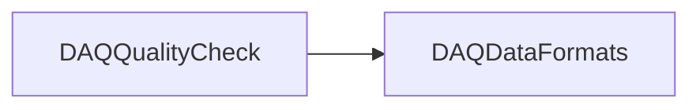

# DAQQualityCheck

Checks internal consistency of raw events and, where enabled, run structures.

## Identity and scope

Repository: [NovaDAQ/DAQQualityCheck](https://github.com/NovaDAQ/DAQQualityCheck) · Reviewed commit: `3120be800db8cc6c976ec8b7a3f296d173aa47c0` · Domain: **Core libraries**.

Tracked files: **17**. Production deployment and owner are **unconfirmed**.

## Operation

Use on captured or synthetic files before accepting data-format changes. Interpret failures by structure level: run/header, trigger, data block, microslice, nanoslice. A successful consistency check is not a physics-quality certification.

For prerequisites, safe start/stop sequencing, health checks, and rollback see the [operations guide](../operations/index.md).

## Build and integration

This package uses the SRT/SoftRelTools release context. A standalone `make` in a fresh checkout is not a supported build recipe unless the required context is already configured. See [build and release](../operations/build.md).

CMake definitions are present. Most NOvA fragments use parent-provided cetbuildtools macros and dependency targets; consult the files below before treating this directory as a standalone CMake project.

| Build definition |
| --- |
| [CMakeLists.txt](https://github.com/NovaDAQ/DAQQualityCheck/blob/3120be800db8cc6c976ec8b7a3f296d173aa47c0/CMakeLists.txt) |
| [GNUmakefile](https://github.com/NovaDAQ/DAQQualityCheck/blob/3120be800db8cc6c976ec8b7a3f296d173aa47c0/GNUmakefile) |
| [cxx/CMakeLists.txt](https://github.com/NovaDAQ/DAQQualityCheck/blob/3120be800db8cc6c976ec8b7a3f296d173aa47c0/cxx/CMakeLists.txt) |
| [cxx/GNUmakefile](https://github.com/NovaDAQ/DAQQualityCheck/blob/3120be800db8cc6c976ec8b7a3f296d173aa47c0/cxx/GNUmakefile) |
| [cxx/include/CMakeLists.txt](https://github.com/NovaDAQ/DAQQualityCheck/blob/3120be800db8cc6c976ec8b7a3f296d173aa47c0/cxx/include/CMakeLists.txt) |
| [cxx/src/CMakeLists.txt](https://github.com/NovaDAQ/DAQQualityCheck/blob/3120be800db8cc6c976ec8b7a3f296d173aa47c0/cxx/src/CMakeLists.txt) |
| [cxx/src/GNUmakefile](https://github.com/NovaDAQ/DAQQualityCheck/blob/3120be800db8cc6c976ec8b7a3f296d173aa47c0/cxx/src/GNUmakefile) |
| [cxx/test/GNUmakefile](https://github.com/NovaDAQ/DAQQualityCheck/blob/3120be800db8cc6c976ec8b7a3f296d173aa47c0/cxx/test/GNUmakefile) |
| [doc/Makefile](https://github.com/NovaDAQ/DAQQualityCheck/blob/3120be800db8cc6c976ec8b7a3f296d173aa47c0/doc/Makefile) |

## Entry points

These are source entry points or operational scripts found statically. Installation names and enabled targets depend on the build/configuration; listing a script does not establish that it is deployed.

No standalone executable entry point was identified; this package may provide libraries, contracts, configuration, or binary artifacts.

## Interfaces

Headers and declared types form the API navigation map. Follow the source for method signatures, ownership, units, and error contracts. Generated DDS/XSD types are built from the schemas in the next section.

| Header | Declared types |
| --- | --- |
| [cxx/include/QualityCheck.h](https://github.com/NovaDAQ/DAQQualityCheck/blob/3120be800db8cc6c976ec8b7a3f296d173aa47c0/cxx/include/QualityCheck.h) | `QualityCheck` |

## Configuration and data contracts

No separate XML/IDL/XSD/FHiCL/INI/YAML/JSON configuration was identified. Inspect command-line parsing and site launchers for this package; defaults may be embedded in source.

## Environment and external dependencies

Environment names below are literal lookups found in source, not a guarantee that every value is mandatory. No environment values or credentials are copied into this documentation.

No literal environment lookup was identified by this scan; shell setup scripts may still provide required values.

Unresolved/non-package include roots (some are system or generated headers; this is not a package-manager lockfile):

| Include root | Evidence |
| --- | --- |
| `boost` | [cxx/test/SimQualityCheck.cc:17](https://github.com/NovaDAQ/DAQQualityCheck/blob/3120be800db8cc6c976ec8b7a3f296d173aa47c0/cxx/test/SimQualityCheck.cc#L17) |
| `netinet` | [cxx/test/SimQualityCheck.cc:20](https://github.com/NovaDAQ/DAQQualityCheck/blob/3120be800db8cc6c976ec8b7a3f296d173aa47c0/cxx/test/SimQualityCheck.cc#L20) |
| `sys` | [cxx/test/RunQualityCheck.cc:1](https://github.com/NovaDAQ/DAQQualityCheck/blob/3120be800db8cc6c976ec8b7a3f296d173aa47c0/cxx/test/RunQualityCheck.cc#L1) |

## Package dependencies

Arrow direction is **consumer → dependency**. This diagram includes source/build/runtime relationships and excludes test-only, release-membership, and build-tool edges. Conditional branches are not evaluated.

| Dependency | Relationship | Evidence |
| --- | --- | --- |
| [DAQDataFormats](DAQDataFormats.md) | build link | [cxx/src/CMakeLists.txt:8](https://github.com/NovaDAQ/DAQQualityCheck/blob/3120be800db8cc6c976ec8b7a3f296d173aa47c0/cxx/src/CMakeLists.txt#L8) |
| [DAQDataFormats](DAQDataFormats.md) | source include | [cxx/include/QualityCheck.h:11](https://github.com/NovaDAQ/DAQQualityCheck/blob/3120be800db8cc6c976ec8b7a3f296d173aa47c0/cxx/include/QualityCheck.h#L11) |
| [DAQDataFormats](DAQDataFormats.md) | test include | [cxx/test/RunQualityCheck.cc:16](https://github.com/NovaDAQ/DAQQualityCheck/blob/3120be800db8cc6c976ec8b7a3f296d173aa47c0/cxx/test/RunQualityCheck.cc#L16) |
| [DAQDataFormats](DAQDataFormats.md) | test link | [cxx/test/GNUmakefile:21](https://github.com/NovaDAQ/DAQQualityCheck/blob/3120be800db8cc6c976ec8b7a3f296d173aa47c0/cxx/test/GNUmakefile#L21) |
| [SRT_ONLINE](SRT_ONLINE.md) | build tool | [GNUmakefile:21](https://github.com/NovaDAQ/DAQQualityCheck/blob/3120be800db8cc6c976ec8b7a3f296d173aa47c0/GNUmakefile#L21) |

Direct consumers: [DispatcherClient](DispatcherClient.md), [MockDataDAQ](MockDataDAQ.md).

Explore upstream/downstream impact in the [dependency explorer](../architecture/explorer.md).

## Validation and review

Static analysis attempted **3 C/C++ translation units**, **0 shell scripts**, and parsed **0 Python files**. Counts are tool input coverage, not proof of successful compilation or exhaustive review. Source/build/configuration inventories and the operating surface were also assessed.

No actionable defect was confirmed for this package in this review. This is a bounded review result, not a clean bill of health; unvalidated analyzer diagnostics were not filed as bugs.

Existing test/example sources (not executed against production):

| Source |
| --- |
| [cxx/test/RunQualityCheck.cc](https://github.com/NovaDAQ/DAQQualityCheck/blob/3120be800db8cc6c976ec8b7a3f296d173aa47c0/cxx/test/RunQualityCheck.cc) |
| [cxx/test/SimQualityCheck.cc](https://github.com/NovaDAQ/DAQQualityCheck/blob/3120be800db8cc6c976ec8b7a3f296d173aa47c0/cxx/test/SimQualityCheck.cc) |

## Existing documentation

| Source |
| --- |
| [doc/DAQQualityChecks.tex](https://github.com/NovaDAQ/DAQQualityCheck/blob/3120be800db8cc6c976ec8b7a3f296d173aa47c0/doc/DAQQualityChecks.tex) |
