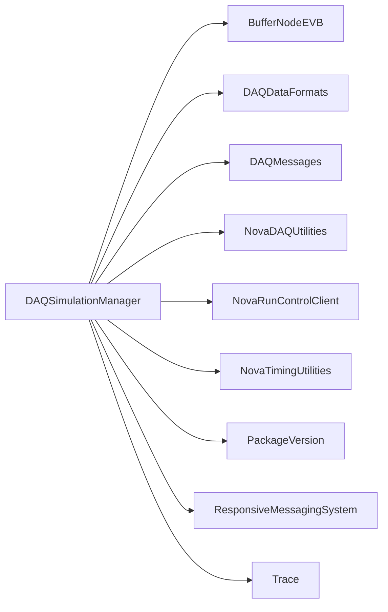

# DAQSimulationManager

Coordinates simulation modes, synthetic data sources, and trigger scheduling.

## Identity and scope

Repository: [NovaDAQ/DAQSimulationManager](https://github.com/NovaDAQ/DAQSimulationManager) · Reviewed commit: `e3d3b3fb94d991e8b4113b9391c3746c9f6283d7` · Domain: **Simulation and examples**.

Tracked files: **28**. Production deployment and owner are **unconfirmed**.

## Operation

Keep simulations in an isolated partition with explicit input/output files and trigger settings. Confirm every destination is a simulator before starting. Observe generated timestamps and event counts at both source and logger.

For prerequisites, safe start/stop sequencing, health checks, and rollback see the [operations guide](../operations/index.md).

## Build and integration

This package uses the SRT/SoftRelTools release context. A standalone `make` in a fresh checkout is not a supported build recipe unless the required context is already configured. See [build and release](../operations/build.md).

| Build definition |
| --- |
| [GNUmakefile](https://github.com/NovaDAQ/DAQSimulationManager/blob/e3d3b3fb94d991e8b4113b9391c3746c9f6283d7/GNUmakefile) |
| [cxx/GNUmakefile](https://github.com/NovaDAQ/DAQSimulationManager/blob/e3d3b3fb94d991e8b4113b9391c3746c9f6283d7/cxx/GNUmakefile) |
| [cxx/src/GNUmakefile](https://github.com/NovaDAQ/DAQSimulationManager/blob/e3d3b3fb94d991e8b4113b9391c3746c9f6283d7/cxx/src/GNUmakefile) |
| [cxx/test/GNUmakefile](https://github.com/NovaDAQ/DAQSimulationManager/blob/e3d3b3fb94d991e8b4113b9391c3746c9f6283d7/cxx/test/GNUmakefile) |
| [cxx/unittest/GNUmakefile](https://github.com/NovaDAQ/DAQSimulationManager/blob/e3d3b3fb94d991e8b4113b9391c3746c9f6283d7/cxx/unittest/GNUmakefile) |

## Entry points

These are source entry points or operational scripts found statically. Installation names and enabled targets depend on the build/configuration; listing a script does not establish that it is deployed.

| Source |
| --- |
| [cxx/src/DAQSimulationManagerapp.cc](https://github.com/NovaDAQ/DAQSimulationManager/blob/e3d3b3fb94d991e8b4113b9391c3746c9f6283d7/cxx/src/DAQSimulationManagerapp.cc) |

## Interfaces

Headers and declared types form the API navigation map. Follow the source for method signatures, ownership, units, and error contracts. Generated DDS/XSD types are built from the schemas in the next section.

| Header | Declared types |
| --- | --- |
| [cxx/include/Configuration.h](https://github.com/NovaDAQ/DAQSimulationManager/blob/e3d3b3fb94d991e8b4113b9391c3746c9f6283d7/cxx/include/Configuration.h) | `Configuration`, `LoadXML`, `dcm_struct` |
| [cxx/include/DAQSimulationManagerapp.h](https://github.com/NovaDAQ/DAQSimulationManager/blob/e3d3b3fb94d991e8b4113b9391c3746c9f6283d7/cxx/include/DAQSimulationManagerapp.h) | Functions, constants, or templates |
| [cxx/include/SimManRunner.h](https://github.com/NovaDAQ/DAQSimulationManager/blob/e3d3b3fb94d991e8b4113b9391c3746c9f6283d7/cxx/include/SimManRunner.h) | `SimManRunner`, `SimulationModes` |
| [cxx/include/SimmanConfiguration.h](https://github.com/NovaDAQ/DAQSimulationManager/blob/e3d3b3fb94d991e8b4113b9391c3746c9f6283d7/cxx/include/SimmanConfiguration.h) | `ConnectionConfiguration_t`, `RunConfiguration_t`, `SimmanConfiguration_t` |
| [cxx/include/SimulationMode1.h](https://github.com/NovaDAQ/DAQSimulationManager/blob/e3d3b3fb94d991e8b4113b9391c3746c9f6283d7/cxx/include/SimulationMode1.h) | `Configuration`, `SimulationMode1`, `TriggerSender` |
| [cxx/include/SimulationMode3.h](https://github.com/NovaDAQ/DAQSimulationManager/blob/e3d3b3fb94d991e8b4113b9391c3746c9f6283d7/cxx/include/SimulationMode3.h) | `SimulationMode3` |
| [cxx/include/TriggerSender.h](https://github.com/NovaDAQ/DAQSimulationManager/blob/e3d3b3fb94d991e8b4113b9391c3746c9f6283d7/cxx/include/TriggerSender.h) | `Configuration`, `TriggerSender` |
| [cxx/include/Utilities.h](https://github.com/NovaDAQ/DAQSimulationManager/blob/e3d3b3fb94d991e8b4113b9391c3746c9f6283d7/cxx/include/Utilities.h) | `ErrorLogs`, `Options`, `Utilities` |
| [cxx/include/version.h](https://github.com/NovaDAQ/DAQSimulationManager/blob/e3d3b3fb94d991e8b4113b9391c3746c9f6283d7/cxx/include/version.h) | Functions, constants, or templates |

## Configuration and data contracts

| Source artifact |
| --- |
| [config/SimmanConfiguration.xml](https://github.com/NovaDAQ/DAQSimulationManager/blob/e3d3b3fb94d991e8b4113b9391c3746c9f6283d7/config/SimmanConfiguration.xml) |
| [config/SimmanConfiguration.xsd](https://github.com/NovaDAQ/DAQSimulationManager/blob/e3d3b3fb94d991e8b4113b9391c3746c9f6283d7/config/SimmanConfiguration.xsd) |
| [config/SimmanMode1.xml](https://github.com/NovaDAQ/DAQSimulationManager/blob/e3d3b3fb94d991e8b4113b9391c3746c9f6283d7/config/SimmanMode1.xml) |
| [config/SimmanMode3.xml](https://github.com/NovaDAQ/DAQSimulationManager/blob/e3d3b3fb94d991e8b4113b9391c3746c9f6283d7/config/SimmanMode3.xml) |
| [config/SimmanRmsMessages.idl](https://github.com/NovaDAQ/DAQSimulationManager/blob/e3d3b3fb94d991e8b4113b9391c3746c9f6283d7/config/SimmanRmsMessages.idl) |

## Environment and external dependencies

Environment names below are literal lookups found in source, not a guarantee that every value is mandatory. No environment values or credentials are copied into this documentation.

No literal environment lookup was identified by this scan; shell setup scripts may still provide required values.

Unresolved/non-package include roots (some are system or generated headers; this is not a package-manager lockfile):

| Include root | Evidence |
| --- | --- |
| `boost` | [cxx/include/SimManRunner.h:12](https://github.com/NovaDAQ/DAQSimulationManager/blob/e3d3b3fb94d991e8b4113b9391c3746c9f6283d7/cxx/include/SimManRunner.h#L12) |
| `messagefacility` | [cxx/include/SimManRunner.h:15](https://github.com/NovaDAQ/DAQSimulationManager/blob/e3d3b3fb94d991e8b4113b9391c3746c9f6283d7/cxx/include/SimManRunner.h#L15) |
| `netinet` | [cxx/src/SimulationMode1.cpp:16](https://github.com/NovaDAQ/DAQSimulationManager/blob/e3d3b3fb94d991e8b4113b9391c3746c9f6283d7/cxx/src/SimulationMode1.cpp#L16) |
| `sys` | [cxx/include/Configuration.h:15](https://github.com/NovaDAQ/DAQSimulationManager/blob/e3d3b3fb94d991e8b4113b9391c3746c9f6283d7/cxx/include/Configuration.h#L15) |
| `xercesc` | [cxx/include/SimmanConfiguration.h:934](https://github.com/NovaDAQ/DAQSimulationManager/blob/e3d3b3fb94d991e8b4113b9391c3746c9f6283d7/cxx/include/SimmanConfiguration.h#L934) |
| `xsd` | [cxx/include/SimmanConfiguration.h:42](https://github.com/NovaDAQ/DAQSimulationManager/blob/e3d3b3fb94d991e8b4113b9391c3746c9f6283d7/cxx/include/SimmanConfiguration.h#L42) |

## Package dependencies

Arrow direction is **consumer → dependency**. This diagram includes source/build/runtime relationships and excludes test-only, release-membership, and build-tool edges. Conditional branches are not evaluated.

| Dependency | Relationship | Evidence |
| --- | --- | --- |
| [BufferNodeEVB](BufferNodeEVB.md) | build link | [cxx/src/GNUmakefile:38](https://github.com/NovaDAQ/DAQSimulationManager/blob/e3d3b3fb94d991e8b4113b9391c3746c9f6283d7/cxx/src/GNUmakefile#L38) |
| [BufferNodeEVB](BufferNodeEVB.md) | source include | [cxx/src/SimulationMode1.cpp:12](https://github.com/NovaDAQ/DAQSimulationManager/blob/e3d3b3fb94d991e8b4113b9391c3746c9f6283d7/cxx/src/SimulationMode1.cpp#L12) |
| [DAQDataFormats](DAQDataFormats.md) | build link | [cxx/src/GNUmakefile:37](https://github.com/NovaDAQ/DAQSimulationManager/blob/e3d3b3fb94d991e8b4113b9391c3746c9f6283d7/cxx/src/GNUmakefile#L37) |
| [DAQDataFormats](DAQDataFormats.md) | source include | [cxx/include/SimulationMode1.h:10](https://github.com/NovaDAQ/DAQSimulationManager/blob/e3d3b3fb94d991e8b4113b9391c3746c9f6283d7/cxx/include/SimulationMode1.h#L10) |
| [DAQMessages](DAQMessages.md) | build link | [cxx/src/GNUmakefile:39](https://github.com/NovaDAQ/DAQSimulationManager/blob/e3d3b3fb94d991e8b4113b9391c3746c9f6283d7/cxx/src/GNUmakefile#L39) |
| [DAQMessages](DAQMessages.md) | source include | [cxx/include/SimManRunner.h:11](https://github.com/NovaDAQ/DAQSimulationManager/blob/e3d3b3fb94d991e8b4113b9391c3746c9f6283d7/cxx/include/SimManRunner.h#L11) |
| [NovaDAQUtilities](NovaDAQUtilities.md) | source include | [cxx/include/SimManRunner.h:9](https://github.com/NovaDAQ/DAQSimulationManager/blob/e3d3b3fb94d991e8b4113b9391c3746c9f6283d7/cxx/include/SimManRunner.h#L9) |
| [NovaRunControlClient](NovaRunControlClient.md) | source include | [cxx/include/SimManRunner.h:10](https://github.com/NovaDAQ/DAQSimulationManager/blob/e3d3b3fb94d991e8b4113b9391c3746c9f6283d7/cxx/include/SimManRunner.h#L10) |
| [NovaTimingUtilities](NovaTimingUtilities.md) | build link | [cxx/src/GNUmakefile:40](https://github.com/NovaDAQ/DAQSimulationManager/blob/e3d3b3fb94d991e8b4113b9391c3746c9f6283d7/cxx/src/GNUmakefile#L40) |
| [NovaTimingUtilities](NovaTimingUtilities.md) | source include | [cxx/src/SimulationMode1.cpp:9](https://github.com/NovaDAQ/DAQSimulationManager/blob/e3d3b3fb94d991e8b4113b9391c3746c9f6283d7/cxx/src/SimulationMode1.cpp#L9) |
| [PackageVersion](PackageVersion.md) | source include | [cxx/include/version.h:28](https://github.com/NovaDAQ/DAQSimulationManager/blob/e3d3b3fb94d991e8b4113b9391c3746c9f6283d7/cxx/include/version.h#L28) |
| [ResponsiveMessagingSystem](ResponsiveMessagingSystem.md) | source include | [cxx/src/SimManRunner.cpp:6](https://github.com/NovaDAQ/DAQSimulationManager/blob/e3d3b3fb94d991e8b4113b9391c3746c9f6283d7/cxx/src/SimManRunner.cpp#L6) |
| [SRT_ONLINE](SRT_ONLINE.md) | build tool | [GNUmakefile:10](https://github.com/NovaDAQ/DAQSimulationManager/blob/e3d3b3fb94d991e8b4113b9391c3746c9f6283d7/GNUmakefile#L10) |
| [Trace](Trace.md) | build link | [cxx/src/GNUmakefile:41](https://github.com/NovaDAQ/DAQSimulationManager/blob/e3d3b3fb94d991e8b4113b9391c3746c9f6283d7/cxx/src/GNUmakefile#L41) |
| [Trace](Trace.md) | source include | [cxx/include/Utilities.h:14](https://github.com/NovaDAQ/DAQSimulationManager/blob/e3d3b3fb94d991e8b4113b9391c3746c9f6283d7/cxx/include/Utilities.h#L14) |

Direct consumers: [NovaDAQConfiguration](NovaDAQConfiguration.md), [NovaRunControl](NovaRunControl.md).

Explore upstream/downstream impact in the [dependency explorer](../architecture/explorer.md).

## Validation and review

Static analysis attempted **7 C/C++ translation units**, **0 shell scripts**, and parsed **0 Python files**. Counts are tool input coverage, not proof of successful compilation or exhaustive review. Source/build/configuration inventories and the operating surface were also assessed.

No actionable defect was confirmed for this package in this review. This is a bounded review result, not a clean bill of health; unvalidated analyzer diagnostics were not filed as bugs.

Existing test/example sources (not executed against production):

No test/example source identified in the scoped inventory.

## Existing documentation

No package README/manual identified in the scoped inventory. Use this page and the source interfaces above.
