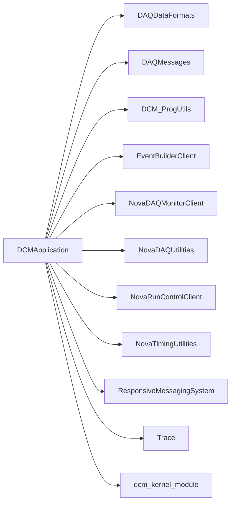

# DCMApplication

DCM state machine, hardware/simulated readers, monitoring, and dispatch of detector data to event-builder clients.

## Identity and scope

Repository: [NovaDAQ/DCMApplication](https://github.com/NovaDAQ/DCMApplication) · Reviewed commit: `9d0a6dbc6d3b5037aa3ab2fb22ff8dec18474425` · Domain: **Data path**.

Tracked files: **145**. Production deployment and owner are **unconfirmed**.

## Operation

Requires the appropriate DCM device nodes or a deliberately selected simulated reader. Establish partition, connection, and run configuration through Run Control. Check FEB links, status flags, data activity, and buffer-node connections before enabling a run.

For prerequisites, safe start/stop sequencing, health checks, and rollback see the [operations guide](../operations/index.md).

## Build and integration

This package uses the SRT/SoftRelTools release context. A standalone `make` in a fresh checkout is not a supported build recipe unless the required context is already configured. See [build and release](../operations/build.md).

| Build definition |
| --- |
| [GNUmakefile](https://github.com/NovaDAQ/DCMApplication/blob/9d0a6dbc6d3b5037aa3ab2fb22ff8dec18474425/GNUmakefile) |
| [cxx/GNUmakefile](https://github.com/NovaDAQ/DCMApplication/blob/9d0a6dbc6d3b5037aa3ab2fb22ff8dec18474425/cxx/GNUmakefile) |
| [cxx/src/GNUmakefile](https://github.com/NovaDAQ/DCMApplication/blob/9d0a6dbc6d3b5037aa3ab2fb22ff8dec18474425/cxx/src/GNUmakefile) |
| [cxx/test/GNUmakefile](https://github.com/NovaDAQ/DCMApplication/blob/9d0a6dbc6d3b5037aa3ab2fb22ff8dec18474425/cxx/test/GNUmakefile) |
| [cxx/unittest/GNUmakefile](https://github.com/NovaDAQ/DCMApplication/blob/9d0a6dbc6d3b5037aa3ab2fb22ff8dec18474425/cxx/unittest/GNUmakefile) |

## Entry points

These are source entry points or operational scripts found statically. Installation names and enabled targets depend on the build/configuration; listing a script does not establish that it is deployed.

| Source |
| --- |
| [cxx/src/dcmapplication.cc](https://github.com/NovaDAQ/DCMApplication/blob/9d0a6dbc6d3b5037aa3ab2fb22ff8dec18474425/cxx/src/dcmapplication.cc) |

## Interfaces

Headers and declared types form the API navigation map. Follow the source for method signatures, ownership, units, and error contracts. Generated DDS/XSD types are built from the schemas in the next section.

| Header | Declared types |
| --- | --- |
| [cxx/include/Dcm.h](https://github.com/NovaDAQ/DCMApplication/blob/9d0a6dbc6d3b5037aa3ab2fb22ff8dec18474425/cxx/include/Dcm.h) | Functions, constants, or templates |
| [cxx/include/DcmBuffer.h](https://github.com/NovaDAQ/DCMApplication/blob/9d0a6dbc6d3b5037aa3ab2fb22ff8dec18474425/cxx/include/DcmBuffer.h) | `DcmBuffer`, `DcmBufferTest` |
| [cxx/include/DcmConfigurationState.h](https://github.com/NovaDAQ/DCMApplication/blob/9d0a6dbc6d3b5037aa3ab2fb22ff8dec18474425/cxx/include/DcmConfigurationState.h) | `DcmConfigurationState`, `DcmConfigurationStateTest` |
| [cxx/include/DcmConnection.h](https://github.com/NovaDAQ/DCMApplication/blob/9d0a6dbc6d3b5037aa3ab2fb22ff8dec18474425/cxx/include/DcmConnection.h) | `DcmConnection`, `DcmConnectionTest` |
| [cxx/include/DcmControl.h](https://github.com/NovaDAQ/DCMApplication/blob/9d0a6dbc6d3b5037aa3ab2fb22ff8dec18474425/cxx/include/DcmControl.h) | `DcmControl`, `DcmControlTest`, `DcmFEBAPDHighVoltage`, `DcmFEBASICRegister`, `DcmFEBDSODataRegulator`, `DcmFEBPixelThreshold`, `DcmFEBPulser` |
| [cxx/include/DcmDataGenerator.h](https://github.com/NovaDAQ/DCMApplication/blob/9d0a6dbc6d3b5037aa3ab2fb22ff8dec18474425/cxx/include/DcmDataGenerator.h) | `DcmDataGenerator`, `DcmDataGeneratorTest` |
| [cxx/include/DcmDataPool.h](https://github.com/NovaDAQ/DCMApplication/blob/9d0a6dbc6d3b5037aa3ab2fb22ff8dec18474425/cxx/include/DcmDataPool.h) | `DcmDataPool`, `DcmDataPoolTest` |
| [cxx/include/DcmDirector.h](https://github.com/NovaDAQ/DCMApplication/blob/9d0a6dbc6d3b5037aa3ab2fb22ff8dec18474425/cxx/include/DcmDirector.h) | `DcmDirector`, `DcmDirectorTest` |
| [cxx/include/DcmDispatcher.h](https://github.com/NovaDAQ/DCMApplication/blob/9d0a6dbc6d3b5037aa3ab2fb22ff8dec18474425/cxx/include/DcmDispatcher.h) | `DcmDispatcher` |
| [cxx/include/DcmMonitor.h](https://github.com/NovaDAQ/DCMApplication/blob/9d0a6dbc6d3b5037aa3ab2fb22ff8dec18474425/cxx/include/DcmMonitor.h) | `DcmMonitor`, `DcmMonitorTest` |
| [cxx/include/DcmPartitionEstablishedState.h](https://github.com/NovaDAQ/DCMApplication/blob/9d0a6dbc6d3b5037aa3ab2fb22ff8dec18474425/cxx/include/DcmPartitionEstablishedState.h) | `DcmPartitionEstablishedState`, `DcmPartitionEstablishedStateTest` |
| [cxx/include/DcmReader.h](https://github.com/NovaDAQ/DCMApplication/blob/9d0a6dbc6d3b5037aa3ab2fb22ff8dec18474425/cxx/include/DcmReader.h) | `DcmDataGenerator`, `DcmDispatcher`, `DcmReader`, `DcmReaderTest` |
| [cxx/include/DcmRunPausedState.h](https://github.com/NovaDAQ/DCMApplication/blob/9d0a6dbc6d3b5037aa3ab2fb22ff8dec18474425/cxx/include/DcmRunPausedState.h) | `DcmRunPausedState`, `DcmRunPausedStateTest` |
| [cxx/include/DcmRunningState.h](https://github.com/NovaDAQ/DCMApplication/blob/9d0a6dbc6d3b5037aa3ab2fb22ff8dec18474425/cxx/include/DcmRunningState.h) | `DcmRunningState`, `DcmRunningStateTest` |
| [cxx/include/DcmSimReader.h](https://github.com/NovaDAQ/DCMApplication/blob/9d0a6dbc6d3b5037aa3ab2fb22ff8dec18474425/cxx/include/DcmSimReader.h) | `DcmSimReader`, `DcmSimReaderTest` |
| [cxx/include/DcmStateBase.h](https://github.com/NovaDAQ/DCMApplication/blob/9d0a6dbc6d3b5037aa3ab2fb22ff8dec18474425/cxx/include/DcmStateBase.h) | `DcmConfigurationState`, `DcmPartitionEstablishedState`, `DcmRunPausedState`, `DcmRunningState`, `DcmStateBase`, `DcmStateMachine` |
| [cxx/include/DcmStateMachine.h](https://github.com/NovaDAQ/DCMApplication/blob/9d0a6dbc6d3b5037aa3ab2fb22ff8dec18474425/cxx/include/DcmStateMachine.h) | `DcmStateMachine` |

## Configuration and data contracts

| Source artifact |
| --- |
| [config/DcmConfiguration.xsd](https://github.com/NovaDAQ/DCMApplication/blob/9d0a6dbc6d3b5037aa3ab2fb22ff8dec18474425/config/DcmConfiguration.xsd) |
| [config/DcmFEBDCSModeConfiguration.xml](https://github.com/NovaDAQ/DCMApplication/blob/9d0a6dbc6d3b5037aa3ab2fb22ff8dec18474425/config/DcmFEBDCSModeConfiguration.xml) |
| [config/DcmFEBDCSModePulserEnabledConfiguration.xml](https://github.com/NovaDAQ/DCMApplication/blob/9d0a6dbc6d3b5037aa3ab2fb22ff8dec18474425/config/DcmFEBDCSModePulserEnabledConfiguration.xml) |
| [config/DcmFEBDSOModePulserEnabledConfiguration.xml](https://github.com/NovaDAQ/DCMApplication/blob/9d0a6dbc6d3b5037aa3ab2fb22ff8dec18474425/config/DcmFEBDSOModePulserEnabledConfiguration.xml) |
| [config/DcmFEBSDPModePulserEnabledConfiguration.xml](https://github.com/NovaDAQ/DCMApplication/blob/9d0a6dbc6d3b5037aa3ab2fb22ff8dec18474425/config/DcmFEBSDPModePulserEnabledConfiguration.xml) |
| [config/DcmFPGAPatternDataModeConfiguration.xml](https://github.com/NovaDAQ/DCMApplication/blob/9d0a6dbc6d3b5037aa3ab2fb22ff8dec18474425/config/DcmFPGAPatternDataModeConfiguration.xml) |
| [config/DcmSimConfiguration.xml](https://github.com/NovaDAQ/DCMApplication/blob/9d0a6dbc6d3b5037aa3ab2fb22ff8dec18474425/config/DcmSimConfiguration.xml) |
| [config/DcmSimConfigurationNoEVB.xml](https://github.com/NovaDAQ/DCMApplication/blob/9d0a6dbc6d3b5037aa3ab2fb22ff8dec18474425/config/DcmSimConfigurationNoEVB.xml) |
| [config/test/DcmAppTestFEBDCSMode.xml](https://github.com/NovaDAQ/DCMApplication/blob/9d0a6dbc6d3b5037aa3ab2fb22ff8dec18474425/config/test/DcmAppTestFEBDCSMode.xml) |
| [config/test/DcmAppTestFEBDCSModePulserEnabled.xml](https://github.com/NovaDAQ/DCMApplication/blob/9d0a6dbc6d3b5037aa3ab2fb22ff8dec18474425/config/test/DcmAppTestFEBDCSModePulserEnabled.xml) |
| [config/test/DcmAppTestFEBDSOModePulserEnabled.xml](https://github.com/NovaDAQ/DCMApplication/blob/9d0a6dbc6d3b5037aa3ab2fb22ff8dec18474425/config/test/DcmAppTestFEBDSOModePulserEnabled.xml) |
| [config/test/DcmAppTestFEBSDPModePulserEnabled.xml](https://github.com/NovaDAQ/DCMApplication/blob/9d0a6dbc6d3b5037aa3ab2fb22ff8dec18474425/config/test/DcmAppTestFEBSDPModePulserEnabled.xml) |
| [config/test/DcmAppTestFPGAPatternDataMode.xml](https://github.com/NovaDAQ/DCMApplication/blob/9d0a6dbc6d3b5037aa3ab2fb22ff8dec18474425/config/test/DcmAppTestFPGAPatternDataMode.xml) |
| [config/test/DcmAppTestSimInput.xml](https://github.com/NovaDAQ/DCMApplication/blob/9d0a6dbc6d3b5037aa3ab2fb22ff8dec18474425/config/test/DcmAppTestSimInput.xml) |
| [config/test/DcmConnectionTest.xml](https://github.com/NovaDAQ/DCMApplication/blob/9d0a6dbc6d3b5037aa3ab2fb22ff8dec18474425/config/test/DcmConnectionTest.xml) |
| [config/test/DcmFEBTestDCSMode.xml](https://github.com/NovaDAQ/DCMApplication/blob/9d0a6dbc6d3b5037aa3ab2fb22ff8dec18474425/config/test/DcmFEBTestDCSMode.xml) |
| [config/test/DcmFEBTestDCSModePulserEnabled.xml](https://github.com/NovaDAQ/DCMApplication/blob/9d0a6dbc6d3b5037aa3ab2fb22ff8dec18474425/config/test/DcmFEBTestDCSModePulserEnabled.xml) |
| [config/test/DcmMonitorTest.xml](https://github.com/NovaDAQ/DCMApplication/blob/9d0a6dbc6d3b5037aa3ab2fb22ff8dec18474425/config/test/DcmMonitorTest.xml) |
| [config/unittest/DcmSimHardwareTestConfig.xml](https://github.com/NovaDAQ/DCMApplication/blob/9d0a6dbc6d3b5037aa3ab2fb22ff8dec18474425/config/unittest/DcmSimHardwareTestConfig.xml) |
| [config/unittest/DcmSimReaderTestConfig.xml](https://github.com/NovaDAQ/DCMApplication/blob/9d0a6dbc6d3b5037aa3ab2fb22ff8dec18474425/config/unittest/DcmSimReaderTestConfig.xml) |

## Environment and external dependencies

Environment names below are literal lookups found in source, not a guarantee that every value is mandatory. No environment values or credentials are copied into this documentation.

| Variable | Evidence |
| --- | --- |
| `SRT_PRIVATE_CONTEXT` | [cxx/src/Dcm.cpp:37](https://github.com/NovaDAQ/DCMApplication/blob/9d0a6dbc6d3b5037aa3ab2fb22ff8dec18474425/cxx/src/Dcm.cpp#L37) |
| `SRT_PUBLIC_CONTEXT` | [cxx/src/Dcm.cpp:41](https://github.com/NovaDAQ/DCMApplication/blob/9d0a6dbc6d3b5037aa3ab2fb22ff8dec18474425/cxx/src/Dcm.cpp#L41) |

Unresolved/non-package include roots (some are system or generated headers; this is not a package-manager lockfile):

| Include root | Evidence |
| --- | --- |
| `arpa` | [cxx/test/DcmEvbTestServer.cpp:8](https://github.com/NovaDAQ/DCMApplication/blob/9d0a6dbc6d3b5037aa3ab2fb22ff8dec18474425/cxx/test/DcmEvbTestServer.cpp#L8) |
| `boost` | [cxx/include/DcmBuffer.h:8](https://github.com/NovaDAQ/DCMApplication/blob/9d0a6dbc6d3b5037aa3ab2fb22ff8dec18474425/cxx/include/DcmBuffer.h#L8) |
| `cppunit` | [cxx/unittest/DcmBufferTest.h:4](https://github.com/NovaDAQ/DCMApplication/blob/9d0a6dbc6d3b5037aa3ab2fb22ff8dec18474425/cxx/unittest/DcmBufferTest.h#L4) |
| `messagefacility` | [cxx/include/DcmBuffer.h:12](https://github.com/NovaDAQ/DCMApplication/blob/9d0a6dbc6d3b5037aa3ab2fb22ff8dec18474425/cxx/include/DcmBuffer.h#L12) |
| `sys` | [cxx/src/Dcm.cpp:5](https://github.com/NovaDAQ/DCMApplication/blob/9d0a6dbc6d3b5037aa3ab2fb22ff8dec18474425/cxx/src/Dcm.cpp#L5) |

## Package dependencies

Arrow direction is **consumer → dependency**. This diagram includes source/build/runtime relationships and excludes test-only, release-membership, and build-tool edges. Conditional branches are not evaluated.

| Dependency | Relationship | Evidence |
| --- | --- | --- |
| [DAQDataFormats](DAQDataFormats.md) | build link | [cxx/src/GNUmakefile:30](https://github.com/NovaDAQ/DCMApplication/blob/9d0a6dbc6d3b5037aa3ab2fb22ff8dec18474425/cxx/src/GNUmakefile#L30) |
| [DAQDataFormats](DAQDataFormats.md) | source include | [cxx/include/DcmConnection.h:10](https://github.com/NovaDAQ/DCMApplication/blob/9d0a6dbc6d3b5037aa3ab2fb22ff8dec18474425/cxx/include/DcmConnection.h#L10) |
| [DAQDataFormats](DAQDataFormats.md) | test include | [cxx/test/DcmEvbTestServer.h:7](https://github.com/NovaDAQ/DCMApplication/blob/9d0a6dbc6d3b5037aa3ab2fb22ff8dec18474425/cxx/test/DcmEvbTestServer.h#L7) |
| [DAQDataFormats](DAQDataFormats.md) | test link | [cxx/test/GNUmakefile:17](https://github.com/NovaDAQ/DCMApplication/blob/9d0a6dbc6d3b5037aa3ab2fb22ff8dec18474425/cxx/test/GNUmakefile#L17) |
| [DAQMessages](DAQMessages.md) | source include | [cxx/include/DcmDirector.h:12](https://github.com/NovaDAQ/DCMApplication/blob/9d0a6dbc6d3b5037aa3ab2fb22ff8dec18474425/cxx/include/DcmDirector.h#L12) |
| [DAQMessages](DAQMessages.md) | test include | [cxx/unittest/DcmConfigurationStateTest.cpp:5](https://github.com/NovaDAQ/DCMApplication/blob/9d0a6dbc6d3b5037aa3ab2fb22ff8dec18474425/cxx/unittest/DcmConfigurationStateTest.cpp#L5) |
| [DCM_ProgUtils](DCM_ProgUtils.md) | build link | [cxx/src/GNUmakefile:30](https://github.com/NovaDAQ/DCMApplication/blob/9d0a6dbc6d3b5037aa3ab2fb22ff8dec18474425/cxx/src/GNUmakefile#L30) |
| [DCM_ProgUtils](DCM_ProgUtils.md) | source include | [cxx/include/DcmControl.h:11](https://github.com/NovaDAQ/DCMApplication/blob/9d0a6dbc6d3b5037aa3ab2fb22ff8dec18474425/cxx/include/DcmControl.h#L11) |
| [DCM_ProgUtils](DCM_ProgUtils.md) | test include | [cxx/test/dcmfebtest.cc:35](https://github.com/NovaDAQ/DCMApplication/blob/9d0a6dbc6d3b5037aa3ab2fb22ff8dec18474425/cxx/test/dcmfebtest.cc#L35) |
| [DCM_ProgUtils](DCM_ProgUtils.md) | test link | [cxx/test/GNUmakefile:17](https://github.com/NovaDAQ/DCMApplication/blob/9d0a6dbc6d3b5037aa3ab2fb22ff8dec18474425/cxx/test/GNUmakefile#L17) |
| [EventBuilderClient](EventBuilderClient.md) | build link | [cxx/src/GNUmakefile:30](https://github.com/NovaDAQ/DCMApplication/blob/9d0a6dbc6d3b5037aa3ab2fb22ff8dec18474425/cxx/src/GNUmakefile#L30) |
| [EventBuilderClient](EventBuilderClient.md) | source include | [cxx/include/DcmConnection.h:9](https://github.com/NovaDAQ/DCMApplication/blob/9d0a6dbc6d3b5037aa3ab2fb22ff8dec18474425/cxx/include/DcmConnection.h#L9) |
| [EventBuilderClient](EventBuilderClient.md) | test link | [cxx/unittest/GNUmakefile:19](https://github.com/NovaDAQ/DCMApplication/blob/9d0a6dbc6d3b5037aa3ab2fb22ff8dec18474425/cxx/unittest/GNUmakefile#L19) |
| [NovaDAQMonitorClient](NovaDAQMonitorClient.md) | source include | [cxx/include/DcmDirector.h:18](https://github.com/NovaDAQ/DCMApplication/blob/9d0a6dbc6d3b5037aa3ab2fb22ff8dec18474425/cxx/include/DcmDirector.h#L18) |
| [NovaDAQMonitorClient](NovaDAQMonitorClient.md) | test link | [cxx/unittest/GNUmakefile:19](https://github.com/NovaDAQ/DCMApplication/blob/9d0a6dbc6d3b5037aa3ab2fb22ff8dec18474425/cxx/unittest/GNUmakefile#L19) |
| [NovaDAQUtilities](NovaDAQUtilities.md) | source include | [cxx/include/DcmDirector.h:10](https://github.com/NovaDAQ/DCMApplication/blob/9d0a6dbc6d3b5037aa3ab2fb22ff8dec18474425/cxx/include/DcmDirector.h#L10) |
| [NovaDAQUtilities](NovaDAQUtilities.md) | test include | [cxx/test/DcmEvbTestServer.h:5](https://github.com/NovaDAQ/DCMApplication/blob/9d0a6dbc6d3b5037aa3ab2fb22ff8dec18474425/cxx/test/DcmEvbTestServer.h#L5) |
| [NovaRunControlClient](NovaRunControlClient.md) | source include | [cxx/include/DcmDirector.h:11](https://github.com/NovaDAQ/DCMApplication/blob/9d0a6dbc6d3b5037aa3ab2fb22ff8dec18474425/cxx/include/DcmDirector.h#L11) |
| [NovaTimingUtilities](NovaTimingUtilities.md) | build link | [cxx/src/GNUmakefile:30](https://github.com/NovaDAQ/DCMApplication/blob/9d0a6dbc6d3b5037aa3ab2fb22ff8dec18474425/cxx/src/GNUmakefile#L30) |
| [NovaTimingUtilities](NovaTimingUtilities.md) | source include | [cxx/src/DcmControl.cpp:12](https://github.com/NovaDAQ/DCMApplication/blob/9d0a6dbc6d3b5037aa3ab2fb22ff8dec18474425/cxx/src/DcmControl.cpp#L12) |
| [NovaTimingUtilities](NovaTimingUtilities.md) | test include | [cxx/test/DcmEvbTestServer.cpp:15](https://github.com/NovaDAQ/DCMApplication/blob/9d0a6dbc6d3b5037aa3ab2fb22ff8dec18474425/cxx/test/DcmEvbTestServer.cpp#L15) |
| [NovaTimingUtilities](NovaTimingUtilities.md) | test link | [cxx/test/GNUmakefile:17](https://github.com/NovaDAQ/DCMApplication/blob/9d0a6dbc6d3b5037aa3ab2fb22ff8dec18474425/cxx/test/GNUmakefile#L17) |
| [ResponsiveMessagingSystem](ResponsiveMessagingSystem.md) | source include | [cxx/src/DcmDirector.cpp:9](https://github.com/NovaDAQ/DCMApplication/blob/9d0a6dbc6d3b5037aa3ab2fb22ff8dec18474425/cxx/src/DcmDirector.cpp#L9) |
| [ResponsiveMessagingSystem](ResponsiveMessagingSystem.md) | test include | [cxx/unittest/DcmReaderTest.cpp:6](https://github.com/NovaDAQ/DCMApplication/blob/9d0a6dbc6d3b5037aa3ab2fb22ff8dec18474425/cxx/unittest/DcmReaderTest.cpp#L6) |
| [SRT_ONLINE](SRT_ONLINE.md) | build tool | [GNUmakefile:10](https://github.com/NovaDAQ/DCMApplication/blob/9d0a6dbc6d3b5037aa3ab2fb22ff8dec18474425/GNUmakefile#L10) |
| [Trace](Trace.md) | build link | [cxx/src/GNUmakefile:30](https://github.com/NovaDAQ/DCMApplication/blob/9d0a6dbc6d3b5037aa3ab2fb22ff8dec18474425/cxx/src/GNUmakefile#L30) |
| [Trace](Trace.md) | source include | [cxx/src/DcmDispatcher.cpp:11](https://github.com/NovaDAQ/DCMApplication/blob/9d0a6dbc6d3b5037aa3ab2fb22ff8dec18474425/cxx/src/DcmDispatcher.cpp#L11) |
| [Trace](Trace.md) | test include | [cxx/test/dcmfebtest.cc:38](https://github.com/NovaDAQ/DCMApplication/blob/9d0a6dbc6d3b5037aa3ab2fb22ff8dec18474425/cxx/test/dcmfebtest.cc#L38) |
| [Trace](Trace.md) | test link | [cxx/test/GNUmakefile:17](https://github.com/NovaDAQ/DCMApplication/blob/9d0a6dbc6d3b5037aa3ab2fb22ff8dec18474425/cxx/test/GNUmakefile#L17) |
| [dcm_kernel_module](dcm_kernel_module.md) | source include | [cxx/include/DcmReader.h:9](https://github.com/NovaDAQ/DCMApplication/blob/9d0a6dbc6d3b5037aa3ab2fb22ff8dec18474425/cxx/include/DcmReader.h#L9) |

Direct consumers: [NovaDAQConfiguration](NovaDAQConfiguration.md).

Explore upstream/downstream impact in the [dependency explorer](../architecture/explorer.md).

## Validation and review

Static analysis attempted **59 C/C++ translation units**, **8 shell scripts**, and parsed **0 Python files**. Counts are tool input coverage, not proof of successful compilation or exhaustive review. Source/build/configuration inventories and the operating surface were also assessed.

No actionable defect was confirmed for this package in this review. This is a bounded review result, not a clean bill of health; unvalidated analyzer diagnostics were not filed as bugs.

Existing test/example sources (not executed against production):

| Source |
| --- |
| [cxx/test/DcmEvbTestServer.cpp](https://github.com/NovaDAQ/DCMApplication/blob/9d0a6dbc6d3b5037aa3ab2fb22ff8dec18474425/cxx/test/DcmEvbTestServer.cpp) |
| [cxx/test/DcmEvbTestServer.h](https://github.com/NovaDAQ/DCMApplication/blob/9d0a6dbc6d3b5037aa3ab2fb22ff8dec18474425/cxx/test/DcmEvbTestServer.h) |
| [cxx/test/activeDetector.cc](https://github.com/NovaDAQ/DCMApplication/blob/9d0a6dbc6d3b5037aa3ab2fb22ff8dec18474425/cxx/test/activeDetector.cc) |
| [cxx/test/bounded_buffer_comparison.cc](https://github.com/NovaDAQ/DCMApplication/blob/9d0a6dbc6d3b5037aa3ab2fb22ff8dec18474425/cxx/test/bounded_buffer_comparison.cc) |
| [cxx/test/corruptmicroburst.C](https://github.com/NovaDAQ/DCMApplication/blob/9d0a6dbc6d3b5037aa3ab2fb22ff8dec18474425/cxx/test/corruptmicroburst.C) |
| [cxx/test/corruptmicroburstperiod.C](https://github.com/NovaDAQ/DCMApplication/blob/9d0a6dbc6d3b5037aa3ab2fb22ff8dec18474425/cxx/test/corruptmicroburstperiod.C) |
| [cxx/test/corruptmicrobursttimeline.C](https://github.com/NovaDAQ/DCMApplication/blob/9d0a6dbc6d3b5037aa3ab2fb22ff8dec18474425/cxx/test/corruptmicrobursttimeline.C) |
| [cxx/test/corruptmicrobursttimeofday.C](https://github.com/NovaDAQ/DCMApplication/blob/9d0a6dbc6d3b5037aa3ab2fb22ff8dec18474425/cxx/test/corruptmicrobursttimeofday.C) |
| [cxx/test/crc_test.cc](https://github.com/NovaDAQ/DCMApplication/blob/9d0a6dbc6d3b5037aa3ab2fb22ff8dec18474425/cxx/test/crc_test.cc) |
| [cxx/test/dcm_lcd_flash.sh](https://github.com/NovaDAQ/DCMApplication/blob/9d0a6dbc6d3b5037aa3ab2fb22ff8dec18474425/cxx/test/dcm_lcd_flash.sh) |
| [cxx/test/dcmconntest.cc](https://github.com/NovaDAQ/DCMApplication/blob/9d0a6dbc6d3b5037aa3ab2fb22ff8dec18474425/cxx/test/dcmconntest.cc) |
| [cxx/test/dcmfebtest.cc](https://github.com/NovaDAQ/DCMApplication/blob/9d0a6dbc6d3b5037aa3ab2fb22ff8dec18474425/cxx/test/dcmfebtest.cc) |
| [cxx/test/dcmmonitortest.cc](https://github.com/NovaDAQ/DCMApplication/blob/9d0a6dbc6d3b5037aa3ab2fb22ff8dec18474425/cxx/test/dcmmonitortest.cc) |
| [cxx/test/drawntuple0.C](https://github.com/NovaDAQ/DCMApplication/blob/9d0a6dbc6d3b5037aa3ab2fb22ff8dec18474425/cxx/test/drawntuple0.C) |
| [cxx/test/drawntuple1.C](https://github.com/NovaDAQ/DCMApplication/blob/9d0a6dbc6d3b5037aa3ab2fb22ff8dec18474425/cxx/test/drawntuple1.C) |
| [cxx/test/drawntuple2.C](https://github.com/NovaDAQ/DCMApplication/blob/9d0a6dbc6d3b5037aa3ab2fb22ff8dec18474425/cxx/test/drawntuple2.C) |
| [cxx/test/drawntuple3.C](https://github.com/NovaDAQ/DCMApplication/blob/9d0a6dbc6d3b5037aa3ab2fb22ff8dec18474425/cxx/test/drawntuple3.C) |
| [cxx/test/drawntuple4.C](https://github.com/NovaDAQ/DCMApplication/blob/9d0a6dbc6d3b5037aa3ab2fb22ff8dec18474425/cxx/test/drawntuple4.C) |
| [cxx/test/drawntuple5.C](https://github.com/NovaDAQ/DCMApplication/blob/9d0a6dbc6d3b5037aa3ab2fb22ff8dec18474425/cxx/test/drawntuple5.C) |
| [cxx/test/dumpmicrotest.cc](https://github.com/NovaDAQ/DCMApplication/blob/9d0a6dbc6d3b5037aa3ab2fb22ff8dec18474425/cxx/test/dumpmicrotest.cc) |
| [cxx/test/dumpsimfpgadata.cc](https://github.com/NovaDAQ/DCMApplication/blob/9d0a6dbc6d3b5037aa3ab2fb22ff8dec18474425/cxx/test/dumpsimfpgadata.cc) |
| [cxx/test/evbtestserver.cc](https://github.com/NovaDAQ/DCMApplication/blob/9d0a6dbc6d3b5037aa3ab2fb22ff8dec18474425/cxx/test/evbtestserver.cc) |
| [cxx/test/febdcsmodedatatest.sh](https://github.com/NovaDAQ/DCMApplication/blob/9d0a6dbc6d3b5037aa3ab2fb22ff8dec18474425/cxx/test/febdcsmodedatatest.sh) |
| [cxx/test/febsinglemodedatatest.sh](https://github.com/NovaDAQ/DCMApplication/blob/9d0a6dbc6d3b5037aa3ab2fb22ff8dec18474425/cxx/test/febsinglemodedatatest.sh) |
| [cxx/test/graphPixelCount.C](https://github.com/NovaDAQ/DCMApplication/blob/9d0a6dbc6d3b5037aa3ab2fb22ff8dec18474425/cxx/test/graphPixelCount.C) |
| [cxx/test/graphPixelCountByDCM.C](https://github.com/NovaDAQ/DCMApplication/blob/9d0a6dbc6d3b5037aa3ab2fb22ff8dec18474425/cxx/test/graphPixelCountByDCM.C) |
| [cxx/test/patterndatatest.sh](https://github.com/NovaDAQ/DCMApplication/blob/9d0a6dbc6d3b5037aa3ab2fb22ff8dec18474425/cxx/test/patterndatatest.sh) |
| [cxx/test/simreadmicroslice.cc](https://github.com/NovaDAQ/DCMApplication/blob/9d0a6dbc6d3b5037aa3ab2fb22ff8dec18474425/cxx/test/simreadmicroslice.cc) |
| [cxx/test/simreadnanoslice.cc](https://github.com/NovaDAQ/DCMApplication/blob/9d0a6dbc6d3b5037aa3ab2fb22ff8dec18474425/cxx/test/simreadnanoslice.cc) |
| [cxx/test/simreadwritemicroslice.cc](https://github.com/NovaDAQ/DCMApplication/blob/9d0a6dbc6d3b5037aa3ab2fb22ff8dec18474425/cxx/test/simreadwritemicroslice.cc) |
| [cxx/test/start_dcmapp.sh](https://github.com/NovaDAQ/DCMApplication/blob/9d0a6dbc6d3b5037aa3ab2fb22ff8dec18474425/cxx/test/start_dcmapp.sh) |
| [cxx/test/start_test.sh](https://github.com/NovaDAQ/DCMApplication/blob/9d0a6dbc6d3b5037aa3ab2fb22ff8dec18474425/cxx/test/start_test.sh) |
| [cxx/test/stop_dcm_lcd_flash.sh](https://github.com/NovaDAQ/DCMApplication/blob/9d0a6dbc6d3b5037aa3ab2fb22ff8dec18474425/cxx/test/stop_dcm_lcd_flash.sh) |
| [cxx/test/validate_dcm.sh](https://github.com/NovaDAQ/DCMApplication/blob/9d0a6dbc6d3b5037aa3ab2fb22ff8dec18474425/cxx/test/validate_dcm.sh) |
| [cxx/unittest/DcmBufferTest.cpp](https://github.com/NovaDAQ/DCMApplication/blob/9d0a6dbc6d3b5037aa3ab2fb22ff8dec18474425/cxx/unittest/DcmBufferTest.cpp) |
| [cxx/unittest/DcmBufferTest.h](https://github.com/NovaDAQ/DCMApplication/blob/9d0a6dbc6d3b5037aa3ab2fb22ff8dec18474425/cxx/unittest/DcmBufferTest.h) |
| [cxx/unittest/DcmConfigurationStateTest.cpp](https://github.com/NovaDAQ/DCMApplication/blob/9d0a6dbc6d3b5037aa3ab2fb22ff8dec18474425/cxx/unittest/DcmConfigurationStateTest.cpp) |
| [cxx/unittest/DcmConfigurationStateTest.h](https://github.com/NovaDAQ/DCMApplication/blob/9d0a6dbc6d3b5037aa3ab2fb22ff8dec18474425/cxx/unittest/DcmConfigurationStateTest.h) |
| [cxx/unittest/DcmConnectionTest.cpp](https://github.com/NovaDAQ/DCMApplication/blob/9d0a6dbc6d3b5037aa3ab2fb22ff8dec18474425/cxx/unittest/DcmConnectionTest.cpp) |
| [cxx/unittest/DcmConnectionTest.h](https://github.com/NovaDAQ/DCMApplication/blob/9d0a6dbc6d3b5037aa3ab2fb22ff8dec18474425/cxx/unittest/DcmConnectionTest.h) |
| [cxx/unittest/DcmControlTest.cpp](https://github.com/NovaDAQ/DCMApplication/blob/9d0a6dbc6d3b5037aa3ab2fb22ff8dec18474425/cxx/unittest/DcmControlTest.cpp) |
| [cxx/unittest/DcmControlTest.h](https://github.com/NovaDAQ/DCMApplication/blob/9d0a6dbc6d3b5037aa3ab2fb22ff8dec18474425/cxx/unittest/DcmControlTest.h) |
| [cxx/unittest/DcmDataGeneratorTest.cpp](https://github.com/NovaDAQ/DCMApplication/blob/9d0a6dbc6d3b5037aa3ab2fb22ff8dec18474425/cxx/unittest/DcmDataGeneratorTest.cpp) |
| [cxx/unittest/DcmDataGeneratorTest.h](https://github.com/NovaDAQ/DCMApplication/blob/9d0a6dbc6d3b5037aa3ab2fb22ff8dec18474425/cxx/unittest/DcmDataGeneratorTest.h) |
| [cxx/unittest/DcmDataPoolTest.cpp](https://github.com/NovaDAQ/DCMApplication/blob/9d0a6dbc6d3b5037aa3ab2fb22ff8dec18474425/cxx/unittest/DcmDataPoolTest.cpp) |
| [cxx/unittest/DcmDataPoolTest.h](https://github.com/NovaDAQ/DCMApplication/blob/9d0a6dbc6d3b5037aa3ab2fb22ff8dec18474425/cxx/unittest/DcmDataPoolTest.h) |
| [cxx/unittest/DcmDirectorTest.cpp](https://github.com/NovaDAQ/DCMApplication/blob/9d0a6dbc6d3b5037aa3ab2fb22ff8dec18474425/cxx/unittest/DcmDirectorTest.cpp) |
| [cxx/unittest/DcmDirectorTest.h](https://github.com/NovaDAQ/DCMApplication/blob/9d0a6dbc6d3b5037aa3ab2fb22ff8dec18474425/cxx/unittest/DcmDirectorTest.h) |
| [cxx/unittest/DcmDispatcherTest.cpp](https://github.com/NovaDAQ/DCMApplication/blob/9d0a6dbc6d3b5037aa3ab2fb22ff8dec18474425/cxx/unittest/DcmDispatcherTest.cpp) |
| [cxx/unittest/DcmDispatcherTest.h](https://github.com/NovaDAQ/DCMApplication/blob/9d0a6dbc6d3b5037aa3ab2fb22ff8dec18474425/cxx/unittest/DcmDispatcherTest.h) |
| [cxx/unittest/DcmMonitorTest.cpp](https://github.com/NovaDAQ/DCMApplication/blob/9d0a6dbc6d3b5037aa3ab2fb22ff8dec18474425/cxx/unittest/DcmMonitorTest.cpp) |
| [cxx/unittest/DcmMonitorTest.h](https://github.com/NovaDAQ/DCMApplication/blob/9d0a6dbc6d3b5037aa3ab2fb22ff8dec18474425/cxx/unittest/DcmMonitorTest.h) |
| [cxx/unittest/DcmPartitionEstablishedStateTest.cpp](https://github.com/NovaDAQ/DCMApplication/blob/9d0a6dbc6d3b5037aa3ab2fb22ff8dec18474425/cxx/unittest/DcmPartitionEstablishedStateTest.cpp) |
| [cxx/unittest/DcmPartitionEstablishedStateTest.h](https://github.com/NovaDAQ/DCMApplication/blob/9d0a6dbc6d3b5037aa3ab2fb22ff8dec18474425/cxx/unittest/DcmPartitionEstablishedStateTest.h) |
| [cxx/unittest/DcmReaderTest.cpp](https://github.com/NovaDAQ/DCMApplication/blob/9d0a6dbc6d3b5037aa3ab2fb22ff8dec18474425/cxx/unittest/DcmReaderTest.cpp) |
| [cxx/unittest/DcmReaderTest.h](https://github.com/NovaDAQ/DCMApplication/blob/9d0a6dbc6d3b5037aa3ab2fb22ff8dec18474425/cxx/unittest/DcmReaderTest.h) |
| [cxx/unittest/DcmRunPausedStateTest.cpp](https://github.com/NovaDAQ/DCMApplication/blob/9d0a6dbc6d3b5037aa3ab2fb22ff8dec18474425/cxx/unittest/DcmRunPausedStateTest.cpp) |
| [cxx/unittest/DcmRunPausedStateTest.h](https://github.com/NovaDAQ/DCMApplication/blob/9d0a6dbc6d3b5037aa3ab2fb22ff8dec18474425/cxx/unittest/DcmRunPausedStateTest.h) |
| [cxx/unittest/DcmRunningStateTest.cpp](https://github.com/NovaDAQ/DCMApplication/blob/9d0a6dbc6d3b5037aa3ab2fb22ff8dec18474425/cxx/unittest/DcmRunningStateTest.cpp) |
| [cxx/unittest/DcmRunningStateTest.h](https://github.com/NovaDAQ/DCMApplication/blob/9d0a6dbc6d3b5037aa3ab2fb22ff8dec18474425/cxx/unittest/DcmRunningStateTest.h) |
| [cxx/unittest/DcmSimReaderTest.cpp](https://github.com/NovaDAQ/DCMApplication/blob/9d0a6dbc6d3b5037aa3ab2fb22ff8dec18474425/cxx/unittest/DcmSimReaderTest.cpp) |
| [cxx/unittest/DcmSimReaderTest.h](https://github.com/NovaDAQ/DCMApplication/blob/9d0a6dbc6d3b5037aa3ab2fb22ff8dec18474425/cxx/unittest/DcmSimReaderTest.h) |
| [cxx/unittest/DcmStateBaseTest.cpp](https://github.com/NovaDAQ/DCMApplication/blob/9d0a6dbc6d3b5037aa3ab2fb22ff8dec18474425/cxx/unittest/DcmStateBaseTest.cpp) |
| [cxx/unittest/DcmStateBaseTest.h](https://github.com/NovaDAQ/DCMApplication/blob/9d0a6dbc6d3b5037aa3ab2fb22ff8dec18474425/cxx/unittest/DcmStateBaseTest.h) |
| [cxx/unittest/DcmStateMachineTest.cpp](https://github.com/NovaDAQ/DCMApplication/blob/9d0a6dbc6d3b5037aa3ab2fb22ff8dec18474425/cxx/unittest/DcmStateMachineTest.cpp) |
| [cxx/unittest/DcmStateMachineTest.h](https://github.com/NovaDAQ/DCMApplication/blob/9d0a6dbc6d3b5037aa3ab2fb22ff8dec18474425/cxx/unittest/DcmStateMachineTest.h) |
| [cxx/unittest/DcmTest.cpp](https://github.com/NovaDAQ/DCMApplication/blob/9d0a6dbc6d3b5037aa3ab2fb22ff8dec18474425/cxx/unittest/DcmTest.cpp) |
| [cxx/unittest/DcmTest.h](https://github.com/NovaDAQ/DCMApplication/blob/9d0a6dbc6d3b5037aa3ab2fb22ff8dec18474425/cxx/unittest/DcmTest.h) |
| [cxx/unittest/dcmunittest.cc](https://github.com/NovaDAQ/DCMApplication/blob/9d0a6dbc6d3b5037aa3ab2fb22ff8dec18474425/cxx/unittest/dcmunittest.cc) |

## Existing documentation

| Source |
| --- |
| [config/unittest/README](https://github.com/NovaDAQ/DCMApplication/blob/9d0a6dbc6d3b5037aa3ab2fb22ff8dec18474425/config/unittest/README) |
| [cxx/unittest/README](https://github.com/NovaDAQ/DCMApplication/blob/9d0a6dbc6d3b5037aa3ab2fb22ff8dec18474425/cxx/unittest/README) |
