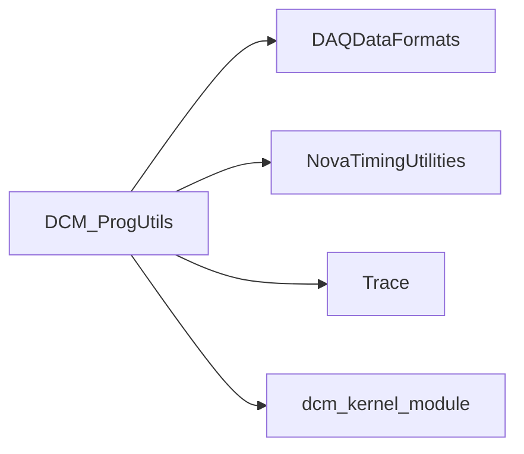

# DCM_ProgUtils

DCM/FEB register access, programming, DSO readout, timing, and temperature utilities.

## Identity and scope

Repository: [NovaDAQ/DCM_ProgUtils](https://github.com/NovaDAQ/DCM_ProgUtils) · Reviewed commit: `e294d36d974d7b60042df6e6030fc558acb26a2c` · Domain: **Hardware**.

Tracked files: **82**. Production deployment and owner are **unconfirmed**.

## Operation

Most tools require /dev/dcm_control or /dev/dcm_data. Stop conflicting readout before exclusive diagnostics, confirm output paths, and preserve firmware/settings before programming. The executable help and source are the authority for each command's units and register semantics.

For prerequisites, safe start/stop sequencing, health checks, and rollback see the [operations guide](../operations/index.md).

## Build and integration

This package uses the SRT/SoftRelTools release context. A standalone `make` in a fresh checkout is not a supported build recipe unless the required context is already configured. See [build and release](../operations/build.md).

| Build definition |
| --- |
| [GNUmakefile](https://github.com/NovaDAQ/DCM_ProgUtils/blob/e294d36d974d7b60042df6e6030fc558acb26a2c/GNUmakefile) |
| [c/GNUmakefile](https://github.com/NovaDAQ/DCM_ProgUtils/blob/e294d36d974d7b60042df6e6030fc558acb26a2c/c/GNUmakefile) |
| [c/src/GNUmakefile](https://github.com/NovaDAQ/DCM_ProgUtils/blob/e294d36d974d7b60042df6e6030fc558acb26a2c/c/src/GNUmakefile) |
| [cxx/GNUmakefile](https://github.com/NovaDAQ/DCM_ProgUtils/blob/e294d36d974d7b60042df6e6030fc558acb26a2c/cxx/GNUmakefile) |
| [cxx/src/GNUmakefile](https://github.com/NovaDAQ/DCM_ProgUtils/blob/e294d36d974d7b60042df6e6030fc558acb26a2c/cxx/src/GNUmakefile) |
| [cxx/test/GNUmakefile](https://github.com/NovaDAQ/DCM_ProgUtils/blob/e294d36d974d7b60042df6e6030fc558acb26a2c/cxx/test/GNUmakefile) |
| [cxx/unittest/GNUmakefile](https://github.com/NovaDAQ/DCM_ProgUtils/blob/e294d36d974d7b60042df6e6030fc558acb26a2c/cxx/unittest/GNUmakefile) |
| [java/GNUmakefile](https://github.com/NovaDAQ/DCM_ProgUtils/blob/e294d36d974d7b60042df6e6030fc558acb26a2c/java/GNUmakefile) |
| [java/src/GNUmakefile](https://github.com/NovaDAQ/DCM_ProgUtils/blob/e294d36d974d7b60042df6e6030fc558acb26a2c/java/src/GNUmakefile) |
| [java/test/GNUmakefile](https://github.com/NovaDAQ/DCM_ProgUtils/blob/e294d36d974d7b60042df6e6030fc558acb26a2c/java/test/GNUmakefile) |
| [java/unittest/GNUmakefile](https://github.com/NovaDAQ/DCM_ProgUtils/blob/e294d36d974d7b60042df6e6030fc558acb26a2c/java/unittest/GNUmakefile) |
| [scripts/GNUmakefile](https://github.com/NovaDAQ/DCM_ProgUtils/blob/e294d36d974d7b60042df6e6030fc558acb26a2c/scripts/GNUmakefile) |

## Entry points

These are source entry points or operational scripts found statically. Installation names and enabled targets depend on the build/configuration; listing a script does not establish that it is deployed.

| Source |
| --- |
| [c/src/cdpr.c](https://github.com/NovaDAQ/DCM_ProgUtils/blob/e294d36d974d7b60042df6e6030fc558acb26a2c/c/src/cdpr.c) |
| [c/src/conffile.c](https://github.com/NovaDAQ/DCM_ProgUtils/blob/e294d36d974d7b60042df6e6030fc558acb26a2c/c/src/conffile.c) |
| [cxx/src/dcmControl.cc](https://github.com/NovaDAQ/DCM_ProgUtils/blob/e294d36d974d7b60042df6e6030fc558acb26a2c/cxx/src/dcmControl.cc) |
| [cxx/src/dcmDSO1PPS.cc](https://github.com/NovaDAQ/DCM_ProgUtils/blob/e294d36d974d7b60042df6e6030fc558acb26a2c/cxx/src/dcmDSO1PPS.cc) |
| [cxx/src/dcmDSODCS.cc](https://github.com/NovaDAQ/DCM_ProgUtils/blob/e294d36d974d7b60042df6e6030fc558acb26a2c/cxx/src/dcmDSODCS.cc) |
| [cxx/src/dcmDSORead.cc](https://github.com/NovaDAQ/DCM_ProgUtils/blob/e294d36d974d7b60042df6e6030fc558acb26a2c/cxx/src/dcmDSORead.cc) |
| [cxx/src/dcmDSOReadout.cc](https://github.com/NovaDAQ/DCM_ProgUtils/blob/e294d36d974d7b60042df6e6030fc558acb26a2c/cxx/src/dcmDSOReadout.cc) |
| [cxx/src/dcmDataDrain.cc](https://github.com/NovaDAQ/DCM_ProgUtils/blob/e294d36d974d7b60042df6e6030fc558acb26a2c/cxx/src/dcmDataDrain.cc) |
| [cxx/src/dcmDelay.cc](https://github.com/NovaDAQ/DCM_ProgUtils/blob/e294d36d974d7b60042df6e6030fc558acb26a2c/cxx/src/dcmDelay.cc) |
| [cxx/src/dcmErrorMonitor.cc](https://github.com/NovaDAQ/DCM_ProgUtils/blob/e294d36d974d7b60042df6e6030fc558acb26a2c/cxx/src/dcmErrorMonitor.cc) |
| [cxx/src/dcmPixThresh.cc](https://github.com/NovaDAQ/DCM_ProgUtils/blob/e294d36d974d7b60042df6e6030fc558acb26a2c/cxx/src/dcmPixThresh.cc) |
| [cxx/src/dcmRegDump.cc](https://github.com/NovaDAQ/DCM_ProgUtils/blob/e294d36d974d7b60042df6e6030fc558acb26a2c/cxx/src/dcmRegDump.cc) |
| [cxx/src/dcmScope.cc](https://github.com/NovaDAQ/DCM_ProgUtils/blob/e294d36d974d7b60042df6e6030fc558acb26a2c/cxx/src/dcmScope.cc) |
| [cxx/src/dcmSerialEEPromRead.cc](https://github.com/NovaDAQ/DCM_ProgUtils/blob/e294d36d974d7b60042df6e6030fc558acb26a2c/cxx/src/dcmSerialEEPromRead.cc) |
| [cxx/src/dcmSerialEEPromWrite.cc](https://github.com/NovaDAQ/DCM_ProgUtils/blob/e294d36d974d7b60042df6e6030fc558acb26a2c/cxx/src/dcmSerialEEPromWrite.cc) |
| [cxx/src/dcmSyncVerify.cc](https://github.com/NovaDAQ/DCM_ProgUtils/blob/e294d36d974d7b60042df6e6030fc558acb26a2c/cxx/src/dcmSyncVerify.cc) |
| [cxx/src/dcmTECCProgram.cc](https://github.com/NovaDAQ/DCM_ProgUtils/blob/e294d36d974d7b60042df6e6030fc558acb26a2c/cxx/src/dcmTECCProgram.cc) |
| [cxx/src/dcmTimingHistoryDump.cc](https://github.com/NovaDAQ/DCM_ProgUtils/blob/e294d36d974d7b60042df6e6030fc558acb26a2c/cxx/src/dcmTimingHistoryDump.cc) |
| [cxx/src/dcmTimingToggle.cc](https://github.com/NovaDAQ/DCM_ProgUtils/blob/e294d36d974d7b60042df6e6030fc558acb26a2c/cxx/src/dcmTimingToggle.cc) |
| [cxx/src/dcm_dma_test.cc](https://github.com/NovaDAQ/DCM_ProgUtils/blob/e294d36d974d7b60042df6e6030fc558acb26a2c/cxx/src/dcm_dma_test.cc) |
| [cxx/src/dcm_ecc_err_detect.cc](https://github.com/NovaDAQ/DCM_ProgUtils/blob/e294d36d974d7b60042df6e6030fc558acb26a2c/cxx/src/dcm_ecc_err_detect.cc) |
| [cxx/src/dcm_get_status.cc](https://github.com/NovaDAQ/DCM_ProgUtils/blob/e294d36d974d7b60042df6e6030fc558acb26a2c/cxx/src/dcm_get_status.cc) |
| [cxx/src/dcm_modcfg.cc](https://github.com/NovaDAQ/DCM_ProgUtils/blob/e294d36d974d7b60042df6e6030fc558acb26a2c/cxx/src/dcm_modcfg.cc) |
| [cxx/src/dcmdate.cc](https://github.com/NovaDAQ/DCM_ProgUtils/blob/e294d36d974d7b60042df6e6030fc558acb26a2c/cxx/src/dcmdate.cc) |
| [cxx/src/febRegDump.cc](https://github.com/NovaDAQ/DCM_ProgUtils/blob/e294d36d974d7b60042df6e6030fc558acb26a2c/cxx/src/febRegDump.cc) |
| [cxx/src/febSetReg.cc](https://github.com/NovaDAQ/DCM_ProgUtils/blob/e294d36d974d7b60042df6e6030fc558acb26a2c/cxx/src/febSetReg.cc) |
| [cxx/src/febTempConvert.cc](https://github.com/NovaDAQ/DCM_ProgUtils/blob/e294d36d974d7b60042df6e6030fc558acb26a2c/cxx/src/febTempConvert.cc) |
| [cxx/src/febTempReadout.cc](https://github.com/NovaDAQ/DCM_ProgUtils/blob/e294d36d974d7b60042df6e6030fc558acb26a2c/cxx/src/febTempReadout.cc) |
| [cxx/src/febTempServer.cc](https://github.com/NovaDAQ/DCM_ProgUtils/blob/e294d36d974d7b60042df6e6030fc558acb26a2c/cxx/src/febTempServer.cc) |
| [cxx/src/i2c_msg.cc](https://github.com/NovaDAQ/DCM_ProgUtils/blob/e294d36d974d7b60042df6e6030fc558acb26a2c/cxx/src/i2c_msg.cc) |
| [cxx/src/i2c_read.cc](https://github.com/NovaDAQ/DCM_ProgUtils/blob/e294d36d974d7b60042df6e6030fc558acb26a2c/cxx/src/i2c_read.cc) |
| [cxx/src/need_to_port/dcmCmdScript.cc](https://github.com/NovaDAQ/DCM_ProgUtils/blob/e294d36d974d7b60042df6e6030fc558acb26a2c/cxx/src/need_to_port/dcmCmdScript.cc) |
| [cxx/src/need_to_port/dcmDataDump.cc](https://github.com/NovaDAQ/DCM_ProgUtils/blob/e294d36d974d7b60042df6e6030fc558acb26a2c/cxx/src/need_to_port/dcmDataDump.cc) |
| [cxx/src/need_to_port/dcmScript.cc](https://github.com/NovaDAQ/DCM_ProgUtils/blob/e294d36d974d7b60042df6e6030fc558acb26a2c/cxx/src/need_to_port/dcmScript.cc) |
| [cxx/src/pi.cc](https://github.com/NovaDAQ/DCM_ProgUtils/blob/e294d36d974d7b60042df6e6030fc558acb26a2c/cxx/src/pi.cc) |
| [cxx/src/sched_rt_prio.cc](https://github.com/NovaDAQ/DCM_ProgUtils/blob/e294d36d974d7b60042df6e6030fc558acb26a2c/cxx/src/sched_rt_prio.cc) |
| [scripts/IOC_suspend_resume.sh](https://github.com/NovaDAQ/DCM_ProgUtils/blob/e294d36d974d7b60042df6e6030fc558acb26a2c/scripts/IOC_suspend_resume.sh) |
| [scripts/add_location_IP.sh](https://github.com/NovaDAQ/DCM_ProgUtils/blob/e294d36d974d7b60042df6e6030fc558acb26a2c/scripts/add_location_IP.sh) |
| [scripts/dcmDSO1PPS.sh](https://github.com/NovaDAQ/DCM_ProgUtils/blob/e294d36d974d7b60042df6e6030fc558acb26a2c/scripts/dcmDSO1PPS.sh) |
| [scripts/dcmLoadDelay.sh](https://github.com/NovaDAQ/DCM_ProgUtils/blob/e294d36d974d7b60042df6e6030fc558acb26a2c/scripts/dcmLoadDelay.sh) |
| [scripts/switchPort2DcmLocation.sh](https://github.com/NovaDAQ/DCM_ProgUtils/blob/e294d36d974d7b60042df6e6030fc558acb26a2c/scripts/switchPort2DcmLocation.sh) |
| [scripts/update_serial.sh](https://github.com/NovaDAQ/DCM_ProgUtils/blob/e294d36d974d7b60042df6e6030fc558acb26a2c/scripts/update_serial.sh) |

## Interfaces

Headers and declared types form the API navigation map. Follow the source for method signatures, ownership, units, and error contracts. Generated DDS/XSD types are built from the schemas in the next section.

| Header | Declared types |
| --- | --- |
| [c/src/cdp.h](https://github.com/NovaDAQ/DCM_ProgUtils/blob/e294d36d974d7b60042df6e6030fc558acb26a2c/c/src/cdp.h) | Functions, constants, or templates |
| [c/src/cdpr.h](https://github.com/NovaDAQ/DCM_ProgUtils/blob/e294d36d974d7b60042df6e6030fc558acb26a2c/c/src/cdpr.h) | `pcap_pkthdr`, `singleton` |
| [cxx/include/CmdRegInfo.h](https://github.com/NovaDAQ/DCM_ProgUtils/blob/e294d36d974d7b60042df6e6030fc558acb26a2c/cxx/include/CmdRegInfo.h) | `CommandSet`, `FEBRegisterMap`, `RegProgValues`, `RegisterNumbers` |
| [cxx/include/DCMCodedErrors.h](https://github.com/NovaDAQ/DCM_ProgUtils/blob/e294d36d974d7b60042df6e6030fc558acb26a2c/cxx/include/DCMCodedErrors.h) | `ErrorCodes` |
| [cxx/include/DCMUtils.h](https://github.com/NovaDAQ/DCM_ProgUtils/blob/e294d36d974d7b60042df6e6030fc558acb26a2c/cxx/include/DCMUtils.h) | `ASICRegisters`, `DCMUtil`, `FEBCTRLCommands`, `FEBRegisters`, `ModeState`, `TECCcurrent`, `TECCtemp`, `TimingMode_t`, `TimingSystemRegisters`, `tm` |
| [cxx/include/Dcm.h](https://github.com/NovaDAQ/DCM_ProgUtils/blob/e294d36d974d7b60042df6e6030fc558acb26a2c/cxx/include/Dcm.h) | `Dcm`, `microSliceHeader_t`, `nanoSlice_t` |

## Configuration and data contracts

No separate XML/IDL/XSD/FHiCL/INI/YAML/JSON configuration was identified. Inspect command-line parsing and site launchers for this package; defaults may be embedded in source.

## Environment and external dependencies

Environment names below are literal lookups found in source, not a guarantee that every value is mandatory. No environment values or credentials are copied into this documentation.

No literal environment lookup was identified by this scan; shell setup scripts may still provide required values.

Unresolved/non-package include roots (some are system or generated headers; this is not a package-manager lockfile):

| Include root | Evidence |
| --- | --- |
| `Dcm` | [cxx/src/need_to_port/dcmCmdScript.cc:10](https://github.com/NovaDAQ/DCM_ProgUtils/blob/e294d36d974d7b60042df6e6030fc558acb26a2c/cxx/src/need_to_port/dcmCmdScript.cc#L10) |
| `arpa` | [c/src/cdpr.c:71](https://github.com/NovaDAQ/DCM_ProgUtils/blob/e294d36d974d7b60042df6e6030fc558acb26a2c/c/src/cdpr.c#L71) |
| `boost` | [cxx/src/dcmDataDrain.cc:26](https://github.com/NovaDAQ/DCM_ProgUtils/blob/e294d36d974d7b60042df6e6030fc558acb26a2c/cxx/src/dcmDataDrain.cc#L26) |
| `linux` | [cxx/src/dcmSerialEEPromRead.cc:10](https://github.com/NovaDAQ/DCM_ProgUtils/blob/e294d36d974d7b60042df6e6030fc558acb26a2c/cxx/src/dcmSerialEEPromRead.cc#L10) |
| `messagefacility` | [cxx/src/dcmErrorMonitor.cc:17](https://github.com/NovaDAQ/DCM_ProgUtils/blob/e294d36d974d7b60042df6e6030fc558acb26a2c/cxx/src/dcmErrorMonitor.cc#L17) |
| `net` | [c/src/cdpr.c:75](https://github.com/NovaDAQ/DCM_ProgUtils/blob/e294d36d974d7b60042df6e6030fc558acb26a2c/c/src/cdpr.c#L75) |
| `netinet` | [c/src/cdp.h:24](https://github.com/NovaDAQ/DCM_ProgUtils/blob/e294d36d974d7b60042df6e6030fc558acb26a2c/c/src/cdp.h#L24) |
| `sys` | [c/src/cdpr.c:70](https://github.com/NovaDAQ/DCM_ProgUtils/blob/e294d36d974d7b60042df6e6030fc558acb26a2c/c/src/cdpr.c#L70) |

## Package dependencies

Arrow direction is **consumer → dependency**. This diagram includes source/build/runtime relationships and excludes test-only, release-membership, and build-tool edges. Conditional branches are not evaluated.

| Dependency | Relationship | Evidence |
| --- | --- | --- |
| [DAQDataFormats](DAQDataFormats.md) | build link | [cxx/src/GNUmakefile:29](https://github.com/NovaDAQ/DCM_ProgUtils/blob/e294d36d974d7b60042df6e6030fc558acb26a2c/cxx/src/GNUmakefile#L29) |
| [DAQDataFormats](DAQDataFormats.md) | source include | [cxx/src/DCMUtils.cpp:16](https://github.com/NovaDAQ/DCM_ProgUtils/blob/e294d36d974d7b60042df6e6030fc558acb26a2c/cxx/src/DCMUtils.cpp#L16) |
| [NovaTimingUtilities](NovaTimingUtilities.md) | build link | [cxx/src/GNUmakefile:29](https://github.com/NovaDAQ/DCM_ProgUtils/blob/e294d36d974d7b60042df6e6030fc558acb26a2c/cxx/src/GNUmakefile#L29) |
| [NovaTimingUtilities](NovaTimingUtilities.md) | source include | [cxx/src/Dcm.cpp:15](https://github.com/NovaDAQ/DCM_ProgUtils/blob/e294d36d974d7b60042df6e6030fc558acb26a2c/cxx/src/Dcm.cpp#L15) |
| [SRT_ONLINE](SRT_ONLINE.md) | build tool | [GNUmakefile:10](https://github.com/NovaDAQ/DCM_ProgUtils/blob/e294d36d974d7b60042df6e6030fc558acb26a2c/GNUmakefile#L10) |
| [Trace](Trace.md) | build link | [cxx/src/GNUmakefile:29](https://github.com/NovaDAQ/DCM_ProgUtils/blob/e294d36d974d7b60042df6e6030fc558acb26a2c/cxx/src/GNUmakefile#L29) |
| [Trace](Trace.md) | source include | [cxx/src/DCMUtils.cpp:17](https://github.com/NovaDAQ/DCM_ProgUtils/blob/e294d36d974d7b60042df6e6030fc558acb26a2c/cxx/src/DCMUtils.cpp#L17) |
| [dcm_kernel_module](dcm_kernel_module.md) | source include | [cxx/include/DCMUtils.h:11](https://github.com/NovaDAQ/DCM_ProgUtils/blob/e294d36d974d7b60042df6e6030fc558acb26a2c/cxx/include/DCMUtils.h#L11) |
| [dcm_kernel_module](dcm_kernel_module.md) | test include | [cxx/test/DCMTestUtils.cpp:8](https://github.com/NovaDAQ/DCM_ProgUtils/blob/e294d36d974d7b60042df6e6030fc558acb26a2c/cxx/test/DCMTestUtils.cpp#L8) |

Direct consumers: [DCMApplication](DCMApplication.md), [DCMGuiTools](DCMGuiTools.md), [NovaDaqDcs](NovaDaqDcs.md).

Explore upstream/downstream impact in the [dependency explorer](../architecture/explorer.md).

## Validation and review

Static analysis attempted **49 C/C++ translation units**, **6 shell scripts**, and parsed **0 Python files**. Counts are tool input coverage, not proof of successful compilation or exhaustive review. Source/build/configuration inventories and the operating surface were also assessed.

| Severity | Finding | GitHub |
| --- | --- | --- |
| P2 | [NDAQ-017: Initialize output-file state before DSO readout and scope output](../review/issues/NDAQ-017.md) | [Issue](https://github.com/NovaDAQ/DCM_ProgUtils/issues/1) |

Existing test/example sources (not executed against production):

| Source |
| --- |
| [cxx/test/DCMDataTypes.cpp](https://github.com/NovaDAQ/DCM_ProgUtils/blob/e294d36d974d7b60042df6e6030fc558acb26a2c/cxx/test/DCMDataTypes.cpp) |
| [cxx/test/DCMDataTypes.h](https://github.com/NovaDAQ/DCM_ProgUtils/blob/e294d36d974d7b60042df6e6030fc558acb26a2c/cxx/test/DCMDataTypes.h) |
| [cxx/test/DCMDataValidation.cpp](https://github.com/NovaDAQ/DCM_ProgUtils/blob/e294d36d974d7b60042df6e6030fc558acb26a2c/cxx/test/DCMDataValidation.cpp) |
| [cxx/test/DCMDataValidation.h](https://github.com/NovaDAQ/DCM_ProgUtils/blob/e294d36d974d7b60042df6e6030fc558acb26a2c/cxx/test/DCMDataValidation.h) |
| [cxx/test/DCMTestCases.cpp](https://github.com/NovaDAQ/DCM_ProgUtils/blob/e294d36d974d7b60042df6e6030fc558acb26a2c/cxx/test/DCMTestCases.cpp) |
| [cxx/test/DCMTestCases.h](https://github.com/NovaDAQ/DCM_ProgUtils/blob/e294d36d974d7b60042df6e6030fc558acb26a2c/cxx/test/DCMTestCases.h) |
| [cxx/test/DCMTestContainers.cpp](https://github.com/NovaDAQ/DCM_ProgUtils/blob/e294d36d974d7b60042df6e6030fc558acb26a2c/cxx/test/DCMTestContainers.cpp) |
| [cxx/test/DCMTestContainers.h](https://github.com/NovaDAQ/DCM_ProgUtils/blob/e294d36d974d7b60042df6e6030fc558acb26a2c/cxx/test/DCMTestContainers.h) |
| [cxx/test/DCMTestExceptions.cpp](https://github.com/NovaDAQ/DCM_ProgUtils/blob/e294d36d974d7b60042df6e6030fc558acb26a2c/cxx/test/DCMTestExceptions.cpp) |
| [cxx/test/DCMTestExceptions.h](https://github.com/NovaDAQ/DCM_ProgUtils/blob/e294d36d974d7b60042df6e6030fc558acb26a2c/cxx/test/DCMTestExceptions.h) |
| [cxx/test/DCMTestUtils.cpp](https://github.com/NovaDAQ/DCM_ProgUtils/blob/e294d36d974d7b60042df6e6030fc558acb26a2c/cxx/test/DCMTestUtils.cpp) |
| [cxx/test/DCMTestUtils.h](https://github.com/NovaDAQ/DCM_ProgUtils/blob/e294d36d974d7b60042df6e6030fc558acb26a2c/cxx/test/DCMTestUtils.h) |
| [cxx/test/Defines.h](https://github.com/NovaDAQ/DCM_ProgUtils/blob/e294d36d974d7b60042df6e6030fc558acb26a2c/cxx/test/Defines.h) |
| [cxx/test/burnin_test_pi_calc.cc](https://github.com/NovaDAQ/DCM_ProgUtils/blob/e294d36d974d7b60042df6e6030fc558acb26a2c/cxx/test/burnin_test_pi_calc.cc) |
| [cxx/test/cpu_burnin_test.cc](https://github.com/NovaDAQ/DCM_ProgUtils/blob/e294d36d974d7b60042df6e6030fc558acb26a2c/cxx/test/cpu_burnin_test.cc) |
| [cxx/test/dcmTest.cc](https://github.com/NovaDAQ/DCM_ProgUtils/blob/e294d36d974d7b60042df6e6030fc558acb26a2c/cxx/test/dcmTest.cc) |

## Existing documentation

No package README/manual identified in the scoped inventory. Use this page and the source interfaces above.
