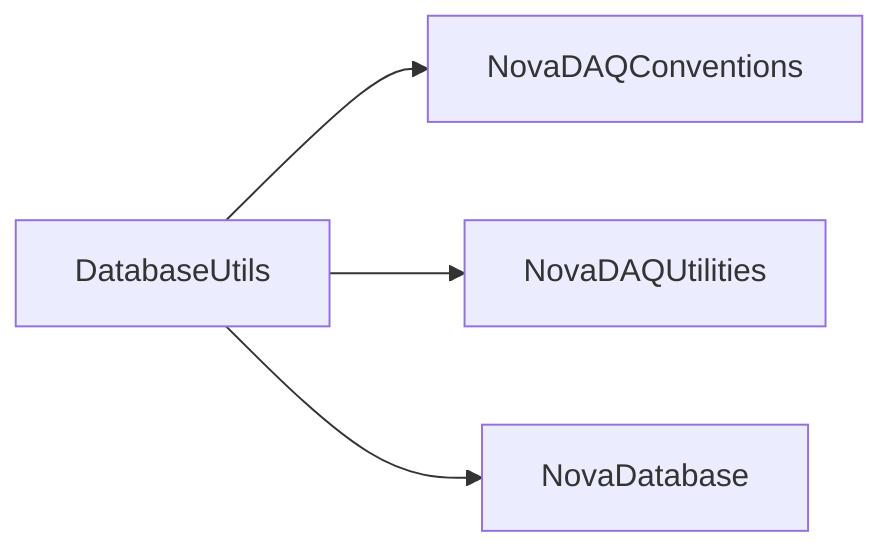

# DatabaseUtils

Typed DAQ configuration, application-manager, DCS, and run-history database access plus configuration editors.

## Identity and scope

Repository: [NovaDAQ/DatabaseUtils](https://github.com/NovaDAQ/DatabaseUtils) · Reviewed commit: `ec6eb9e964cafaf2f8a9f8a400e0140c05f3d491` · Domain: **Control**.

Tracked files: **180**. Production deployment and owner are **unconfirmed**.

## Operation

Select the intended database/schema and account before using an editor or administrative script. Preserve named/global configuration identity, inspect transaction failures, and validate generated configuration against known runs. Database changes require an explicit rollback artifact.

For prerequisites, safe start/stop sequencing, health checks, and rollback see the [operations guide](../operations/index.md).

## Build and integration

This package uses the SRT/SoftRelTools release context. A standalone `make` in a fresh checkout is not a supported build recipe unless the required context is already configured. See [build and release](../operations/build.md).

CMake definitions are present. Most NOvA fragments use parent-provided cetbuildtools macros and dependency targets; consult the files below before treating this directory as a standalone CMake project.

| Build definition |
| --- |
| [CMakeLists.txt](https://github.com/NovaDAQ/DatabaseUtils/blob/ec6eb9e964cafaf2f8a9f8a400e0140c05f3d491/CMakeLists.txt) |
| [GNUmakefile](https://github.com/NovaDAQ/DatabaseUtils/blob/ec6eb9e964cafaf2f8a9f8a400e0140c05f3d491/GNUmakefile) |
| [cxx/CMakeLists.txt](https://github.com/NovaDAQ/DatabaseUtils/blob/ec6eb9e964cafaf2f8a9f8a400e0140c05f3d491/cxx/CMakeLists.txt) |
| [cxx/GNUmakefile](https://github.com/NovaDAQ/DatabaseUtils/blob/ec6eb9e964cafaf2f8a9f8a400e0140c05f3d491/cxx/GNUmakefile) |
| [cxx/include/CMakeLists.txt](https://github.com/NovaDAQ/DatabaseUtils/blob/ec6eb9e964cafaf2f8a9f8a400e0140c05f3d491/cxx/include/CMakeLists.txt) |
| [cxx/include/DAQAppMgr/CMakeLists.txt](https://github.com/NovaDAQ/DatabaseUtils/blob/ec6eb9e964cafaf2f8a9f8a400e0140c05f3d491/cxx/include/DAQAppMgr/CMakeLists.txt) |
| [cxx/include/DAQConfig/CMakeLists.txt](https://github.com/NovaDAQ/DatabaseUtils/blob/ec6eb9e964cafaf2f8a9f8a400e0140c05f3d491/cxx/include/DAQConfig/CMakeLists.txt) |
| [cxx/include/DCS/CMakeLists.txt](https://github.com/NovaDAQ/DatabaseUtils/blob/ec6eb9e964cafaf2f8a9f8a400e0140c05f3d491/cxx/include/DCS/CMakeLists.txt) |
| [cxx/include/RunHistory/CMakeLists.txt](https://github.com/NovaDAQ/DatabaseUtils/blob/ec6eb9e964cafaf2f8a9f8a400e0140c05f3d491/cxx/include/RunHistory/CMakeLists.txt) |
| [cxx/src/CMakeLists.txt](https://github.com/NovaDAQ/DatabaseUtils/blob/ec6eb9e964cafaf2f8a9f8a400e0140c05f3d491/cxx/src/CMakeLists.txt) |
| [cxx/src/DAQAppMgr/CMakeLists.txt](https://github.com/NovaDAQ/DatabaseUtils/blob/ec6eb9e964cafaf2f8a9f8a400e0140c05f3d491/cxx/src/DAQAppMgr/CMakeLists.txt) |
| [cxx/src/DAQAppMgr/GNUmakefile](https://github.com/NovaDAQ/DatabaseUtils/blob/ec6eb9e964cafaf2f8a9f8a400e0140c05f3d491/cxx/src/DAQAppMgr/GNUmakefile) |
| [cxx/src/DAQConfig/CMakeLists.txt](https://github.com/NovaDAQ/DatabaseUtils/blob/ec6eb9e964cafaf2f8a9f8a400e0140c05f3d491/cxx/src/DAQConfig/CMakeLists.txt) |
| [cxx/src/DAQConfig/GNUmakefile](https://github.com/NovaDAQ/DatabaseUtils/blob/ec6eb9e964cafaf2f8a9f8a400e0140c05f3d491/cxx/src/DAQConfig/GNUmakefile) |
| [cxx/src/DCS/CMakeLists.txt](https://github.com/NovaDAQ/DatabaseUtils/blob/ec6eb9e964cafaf2f8a9f8a400e0140c05f3d491/cxx/src/DCS/CMakeLists.txt) |
| [cxx/src/DCS/GNUmakefile](https://github.com/NovaDAQ/DatabaseUtils/blob/ec6eb9e964cafaf2f8a9f8a400e0140c05f3d491/cxx/src/DCS/GNUmakefile) |
| [cxx/src/GNUmakefile](https://github.com/NovaDAQ/DatabaseUtils/blob/ec6eb9e964cafaf2f8a9f8a400e0140c05f3d491/cxx/src/GNUmakefile) |
| [cxx/src/GUI/GNUmakefile](https://github.com/NovaDAQ/DatabaseUtils/blob/ec6eb9e964cafaf2f8a9f8a400e0140c05f3d491/cxx/src/GUI/GNUmakefile) |
| [cxx/src/Hardware/GNUmakefile](https://github.com/NovaDAQ/DatabaseUtils/blob/ec6eb9e964cafaf2f8a9f8a400e0140c05f3d491/cxx/src/Hardware/GNUmakefile) |
| [cxx/src/RunHistory/CMakeLists.txt](https://github.com/NovaDAQ/DatabaseUtils/blob/ec6eb9e964cafaf2f8a9f8a400e0140c05f3d491/cxx/src/RunHistory/CMakeLists.txt) |
| [cxx/src/RunHistory/GNUmakefile](https://github.com/NovaDAQ/DatabaseUtils/blob/ec6eb9e964cafaf2f8a9f8a400e0140c05f3d491/cxx/src/RunHistory/GNUmakefile) |
| [cxx/test/GNUmakefile](https://github.com/NovaDAQ/DatabaseUtils/blob/ec6eb9e964cafaf2f8a9f8a400e0140c05f3d491/cxx/test/GNUmakefile) |
| [cxx/unittest/GNUmakefile](https://github.com/NovaDAQ/DatabaseUtils/blob/ec6eb9e964cafaf2f8a9f8a400e0140c05f3d491/cxx/unittest/GNUmakefile) |
| [java/GNUmakefile](https://github.com/NovaDAQ/DatabaseUtils/blob/ec6eb9e964cafaf2f8a9f8a400e0140c05f3d491/java/GNUmakefile) |
| [java/src/GNUmakefile](https://github.com/NovaDAQ/DatabaseUtils/blob/ec6eb9e964cafaf2f8a9f8a400e0140c05f3d491/java/src/GNUmakefile) |
| [java/test/GNUmakefile](https://github.com/NovaDAQ/DatabaseUtils/blob/ec6eb9e964cafaf2f8a9f8a400e0140c05f3d491/java/test/GNUmakefile) |
| [java/unittest/GNUmakefile](https://github.com/NovaDAQ/DatabaseUtils/blob/ec6eb9e964cafaf2f8a9f8a400e0140c05f3d491/java/unittest/GNUmakefile) |

## Entry points

These are source entry points or operational scripts found statically. Installation names and enabled targets depend on the build/configuration; listing a script does not establish that it is deployed.

| Source |
| --- |
| [cxx/src/DAQConfig/FlattenNamedConfiguration.cc](https://github.com/NovaDAQ/DatabaseUtils/blob/ec6eb9e964cafaf2f8a9f8a400e0140c05f3d491/cxx/src/DAQConfig/FlattenNamedConfiguration.cc) |
| [cxx/src/DAQConfig/MarkConfigChangesDone.cc](https://github.com/NovaDAQ/DatabaseUtils/blob/ec6eb9e964cafaf2f8a9f8a400e0140c05f3d491/cxx/src/DAQConfig/MarkConfigChangesDone.cc) |
| [cxx/src/GUI/DAQConfigEditor.cc](https://github.com/NovaDAQ/DatabaseUtils/blob/ec6eb9e964cafaf2f8a9f8a400e0140c05f3d491/cxx/src/GUI/DAQConfigEditor.cc) |
| [cxx/src/GUI/DCSConfigEditor.cc](https://github.com/NovaDAQ/DatabaseUtils/blob/ec6eb9e964cafaf2f8a9f8a400e0140c05f3d491/cxx/src/GUI/DCSConfigEditor.cc) |
| [cxx/src/GUI/GenerateDCSRecipeScripts.sh](https://github.com/NovaDAQ/DatabaseUtils/blob/ec6eb9e964cafaf2f8a9f8a400e0140c05f3d491/cxx/src/GUI/GenerateDCSRecipeScripts.sh) |
| [cxx/src/Hardware/getLatestInstallation.cc](https://github.com/NovaDAQ/DatabaseUtils/blob/ec6eb9e964cafaf2f8a9f8a400e0140c05f3d491/cxx/src/Hardware/getLatestInstallation.cc) |
| [cxx/src/RunHistory/getNActivePerDCM.cc](https://github.com/NovaDAQ/DatabaseUtils/blob/ec6eb9e964cafaf2f8a9f8a400e0140c05f3d491/cxx/src/RunHistory/getNActivePerDCM.cc) |
| [cxx/src/RunHistory/getRunInfo.cc](https://github.com/NovaDAQ/DatabaseUtils/blob/ec6eb9e964cafaf2f8a9f8a400e0140c05f3d491/cxx/src/RunHistory/getRunInfo.cc) |
| [cxx/src/ShowNamedConfigDetails.cc](https://github.com/NovaDAQ/DatabaseUtils/blob/ec6eb9e964cafaf2f8a9f8a400e0140c05f3d491/cxx/src/ShowNamedConfigDetails.cc) |
| [scripts/APDGainPoints.py](https://github.com/NovaDAQ/DatabaseUtils/blob/ec6eb9e964cafaf2f8a9f8a400e0140c05f3d491/scripts/APDGainPoints.py) |
| [scripts/APDHVSetting.py](https://github.com/NovaDAQ/DatabaseUtils/blob/ec6eb9e964cafaf2f8a9f8a400e0140c05f3d491/scripts/APDHVSetting.py) |
| [scripts/APDHVSetting_M150.py](https://github.com/NovaDAQ/DatabaseUtils/blob/ec6eb9e964cafaf2f8a9f8a400e0140c05f3d491/scripts/APDHVSetting_M150.py) |
| [scripts/APDHVSetting_M150_FNAL_hdb.py](https://github.com/NovaDAQ/DatabaseUtils/blob/ec6eb9e964cafaf2f8a9f8a400e0140c05f3d491/scripts/APDHVSetting_M150_FNAL_hdb.py) |
| [scripts/APDInfo.py](https://github.com/NovaDAQ/DatabaseUtils/blob/ec6eb9e964cafaf2f8a9f8a400e0140c05f3d491/scripts/APDInfo.py) |
| [scripts/APDSingleGainPoints.py](https://github.com/NovaDAQ/DatabaseUtils/blob/ec6eb9e964cafaf2f8a9f8a400e0140c05f3d491/scripts/APDSingleGainPoints.py) |
| [scripts/DoItAll.sh](https://github.com/NovaDAQ/DatabaseUtils/blob/ec6eb9e964cafaf2f8a9f8a400e0140c05f3d491/scripts/DoItAll.sh) |
| [scripts/NDAPDHVSetting.py](https://github.com/NovaDAQ/DatabaseUtils/blob/ec6eb9e964cafaf2f8a9f8a400e0140c05f3d491/scripts/NDAPDHVSetting.py) |
| [scripts/elec2geo.py](https://github.com/NovaDAQ/DatabaseUtils/blob/ec6eb9e964cafaf2f8a9f8a400e0140c05f3d491/scripts/elec2geo.py) |
| [scripts/findallswaps.py](https://github.com/NovaDAQ/DatabaseUtils/blob/ec6eb9e964cafaf2f8a9f8a400e0140c05f3d491/scripts/findallswaps.py) |
| [scripts/geo2elec.py](https://github.com/NovaDAQ/DatabaseUtils/blob/ec6eb9e964cafaf2f8a9f8a400e0140c05f3d491/scripts/geo2elec.py) |
| [scripts/getgain150.sh](https://github.com/NovaDAQ/DatabaseUtils/blob/ec6eb9e964cafaf2f8a9f8a400e0140c05f3d491/scripts/getgain150.sh) |
| [scripts/getgainND.sh](https://github.com/NovaDAQ/DatabaseUtils/blob/ec6eb9e964cafaf2f8a9f8a400e0140c05f3d491/scripts/getgainND.sh) |

## Interfaces

Headers and declared types form the API navigation map. Follow the source for method signatures, ownership, units, and error contracts. Generated DDS/XSD types are built from the schemas in the next section.

| Header | Declared types |
| --- | --- |
| [cxx/include/DAQAppMgr/ApplicationInstance.h](https://github.com/NovaDAQ/DatabaseUtils/blob/ec6eb9e964cafaf2f8a9f8a400e0140c05f3d491/cxx/include/DAQAppMgr/ApplicationInstance.h) | `ApplicationInstance` |
| [cxx/include/DAQAppMgr/ApplicationType.h](https://github.com/NovaDAQ/DatabaseUtils/blob/ec6eb9e964cafaf2f8a9f8a400e0140c05f3d491/cxx/include/DAQAppMgr/ApplicationType.h) | `ApplicationType` |
| [cxx/include/DAQAppMgr/ConfiguredApplicationTypes.h](https://github.com/NovaDAQ/DatabaseUtils/blob/ec6eb9e964cafaf2f8a9f8a400e0140c05f3d491/cxx/include/DAQAppMgr/ConfiguredApplicationTypes.h) | `ConfiguredApplicationTypes` |
| [cxx/include/DAQAppMgr/ConfiguredHosts.h](https://github.com/NovaDAQ/DatabaseUtils/blob/ec6eb9e964cafaf2f8a9f8a400e0140c05f3d491/cxx/include/DAQAppMgr/ConfiguredHosts.h) | `ConfiguredHosts` |
| [cxx/include/DAQAppMgr/ConfiguredProcessList.h](https://github.com/NovaDAQ/DatabaseUtils/blob/ec6eb9e964cafaf2f8a9f8a400e0140c05f3d491/cxx/include/DAQAppMgr/ConfiguredProcessList.h) | `ConfiguredProcessList` |
| [cxx/include/DAQAppMgr/Host.h](https://github.com/NovaDAQ/DatabaseUtils/blob/ec6eb9e964cafaf2f8a9f8a400e0140c05f3d491/cxx/include/DAQAppMgr/Host.h) | `Host` |
| [cxx/include/DAQConfig/ASICRegisterValueSet.h](https://github.com/NovaDAQ/DatabaseUtils/blob/ec6eb9e964cafaf2f8a9f8a400e0140c05f3d491/cxx/include/DAQConfig/ASICRegisterValueSet.h) | `ASICRegisterValueSet` |
| [cxx/include/DAQConfig/BNEVBRunConfig.h](https://github.com/NovaDAQ/DatabaseUtils/blob/ec6eb9e964cafaf2f8a9f8a400e0140c05f3d491/cxx/include/DAQConfig/BNEVBRunConfig.h) | `BNEVBRunConfig` |
| [cxx/include/DAQConfig/ConfigDataSelector.h](https://github.com/NovaDAQ/DatabaseUtils/blob/ec6eb9e964cafaf2f8a9f8a400e0140c05f3d491/cxx/include/DAQConfig/ConfigDataSelector.h) | `ConfigDataSelector` |
| [cxx/include/DAQConfig/ConfigDataTree.h](https://github.com/NovaDAQ/DatabaseUtils/blob/ec6eb9e964cafaf2f8a9f8a400e0140c05f3d491/cxx/include/DAQConfig/ConfigDataTree.h) | `ConfigDataTree` |
| [cxx/include/DAQConfig/DBColumnParams.h](https://github.com/NovaDAQ/DatabaseUtils/blob/ec6eb9e964cafaf2f8a9f8a400e0140c05f3d491/cxx/include/DAQConfig/DBColumnParams.h) | `DBColumnParams` |
| [cxx/include/DAQConfig/DBColumnUtils.h](https://github.com/NovaDAQ/DatabaseUtils/blob/ec6eb9e964cafaf2f8a9f8a400e0140c05f3d491/cxx/include/DAQConfig/DBColumnUtils.h) | `DBColumnUtils` |
| [cxx/include/DAQConfig/DCMConnectConfig.h](https://github.com/NovaDAQ/DatabaseUtils/blob/ec6eb9e964cafaf2f8a9f8a400e0140c05f3d491/cxx/include/DAQConfig/DCMConnectConfig.h) | `DCMConnectConfig` |
| [cxx/include/DAQConfig/DCMHardwareConfig.h](https://github.com/NovaDAQ/DatabaseUtils/blob/ec6eb9e964cafaf2f8a9f8a400e0140c05f3d491/cxx/include/DAQConfig/DCMHardwareConfig.h) | `DCMHardwareConfig` |
| [cxx/include/DAQConfig/DCMRunConfig.h](https://github.com/NovaDAQ/DatabaseUtils/blob/ec6eb9e964cafaf2f8a9f8a400e0140c05f3d491/cxx/include/DAQConfig/DCMRunConfig.h) | `DCMRunConfig` |
| [cxx/include/DAQConfig/DDTConnectConfig.h](https://github.com/NovaDAQ/DatabaseUtils/blob/ec6eb9e964cafaf2f8a9f8a400e0140c05f3d491/cxx/include/DAQConfig/DDTConnectConfig.h) | `DDTConnectConfig` |
| [cxx/include/DAQConfig/DLRunConfig.h](https://github.com/NovaDAQ/DatabaseUtils/blob/ec6eb9e964cafaf2f8a9f8a400e0140c05f3d491/cxx/include/DAQConfig/DLRunConfig.h) | `DLRunConfig` |
| [cxx/include/DAQConfig/FEBPulserParameterSet.h](https://github.com/NovaDAQ/DatabaseUtils/blob/ec6eb9e964cafaf2f8a9f8a400e0140c05f3d491/cxx/include/DAQConfig/FEBPulserParameterSet.h) | `FEBPulserParameterSet` |
| [cxx/include/DAQConfig/GTRunConfig.h](https://github.com/NovaDAQ/DatabaseUtils/blob/ec6eb9e964cafaf2f8a9f8a400e0140c05f3d491/cxx/include/DAQConfig/GTRunConfig.h) | `GTRunConfig`, `db_exception` |
| [cxx/include/DAQConfig/GeneralDataReader.h](https://github.com/NovaDAQ/DatabaseUtils/blob/ec6eb9e964cafaf2f8a9f8a400e0140c05f3d491/cxx/include/DAQConfig/GeneralDataReader.h) | `GeneralDataReader`, `SimpleDataContainer`, `SimpleDataSet` |
| [cxx/include/DAQConfig/GlobalNameSpec.h](https://github.com/NovaDAQ/DatabaseUtils/blob/ec6eb9e964cafaf2f8a9f8a400e0140c05f3d491/cxx/include/DAQConfig/GlobalNameSpec.h) | `GlobalNameSpec` |
| [cxx/include/DAQConfig/IDSpec.h](https://github.com/NovaDAQ/DatabaseUtils/blob/ec6eb9e964cafaf2f8a9f8a400e0140c05f3d491/cxx/include/DAQConfig/IDSpec.h) | `CONFIG_LEVEL`, `IDSpec`, `MAJOR_SYSTEM_TYPE` |
| [cxx/include/DAQConfig/NDMRunConfig.h](https://github.com/NovaDAQ/DatabaseUtils/blob/ec6eb9e964cafaf2f8a9f8a400e0140c05f3d491/cxx/include/DAQConfig/NDMRunConfig.h) | `NDMRunConfig` |
| [cxx/include/DAQConfig/NamedConfigUtils.h](https://github.com/NovaDAQ/DatabaseUtils/blob/ec6eb9e964cafaf2f8a9f8a400e0140c05f3d491/cxx/include/DAQConfig/NamedConfigUtils.h) | `NamedConfigUtils` |
| [cxx/include/DAQConfig/PixelEnableMasks.h](https://github.com/NovaDAQ/DatabaseUtils/blob/ec6eb9e964cafaf2f8a9f8a400e0140c05f3d491/cxx/include/DAQConfig/PixelEnableMasks.h) | `PixelEnableMasks` |
| [cxx/include/DAQConfig/PixelParameterListWrapper.h](https://github.com/NovaDAQ/DatabaseUtils/blob/ec6eb9e964cafaf2f8a9f8a400e0140c05f3d491/cxx/include/DAQConfig/PixelParameterListWrapper.h) | `PixelParameterListWrapper` |
| [cxx/include/DAQConfig/PixelThresholds.h](https://github.com/NovaDAQ/DatabaseUtils/blob/ec6eb9e964cafaf2f8a9f8a400e0140c05f3d491/cxx/include/DAQConfig/PixelThresholds.h) | `PixelThresholds` |
| [cxx/include/DAQConfig/SubsystemNameSpec.h](https://github.com/NovaDAQ/DatabaseUtils/blob/ec6eb9e964cafaf2f8a9f8a400e0140c05f3d491/cxx/include/DAQConfig/SubsystemNameSpec.h) | `SubsystemNameSpec` |
| [cxx/include/DCS/APDSettings.h](https://github.com/NovaDAQ/DatabaseUtils/blob/ec6eb9e964cafaf2f8a9f8a400e0140c05f3d491/cxx/include/DCS/APDSettings.h) | `APDSettings` |
| [cxx/include/GUI/BasicEditorDisplay.h](https://github.com/NovaDAQ/DatabaseUtils/blob/ec6eb9e964cafaf2f8a9f8a400e0140c05f3d491/cxx/include/GUI/BasicEditorDisplay.h) | `BasicEditorDisplay` |
| [cxx/include/GUI/BitmapEditor.h](https://github.com/NovaDAQ/DatabaseUtils/blob/ec6eb9e964cafaf2f8a9f8a400e0140c05f3d491/cxx/include/GUI/BitmapEditor.h) | `BitmapEditor` |
| [cxx/include/GUI/Changeable.h](https://github.com/NovaDAQ/DatabaseUtils/blob/ec6eb9e964cafaf2f8a9f8a400e0140c05f3d491/cxx/include/GUI/Changeable.h) | `Changeable` |
| [cxx/include/GUI/ConfigDataTableEditor.h](https://github.com/NovaDAQ/DatabaseUtils/blob/ec6eb9e964cafaf2f8a9f8a400e0140c05f3d491/cxx/include/GUI/ConfigDataTableEditor.h) | `ConfigDataTableEditor` |
| [cxx/include/GUI/ConfigDataTableModel.h](https://github.com/NovaDAQ/DatabaseUtils/blob/ec6eb9e964cafaf2f8a9f8a400e0140c05f3d491/cxx/include/GUI/ConfigDataTableModel.h) | `ConfigDataTableModel` |
| [cxx/include/GUI/ConfigDataTreeEditor.h](https://github.com/NovaDAQ/DatabaseUtils/blob/ec6eb9e964cafaf2f8a9f8a400e0140c05f3d491/cxx/include/GUI/ConfigDataTreeEditor.h) | `ConfigDataTreeEditor` |
| [cxx/include/GUI/ConfigDataTreeModel.h](https://github.com/NovaDAQ/DatabaseUtils/blob/ec6eb9e964cafaf2f8a9f8a400e0140c05f3d491/cxx/include/GUI/ConfigDataTreeModel.h) | `ConfigDataTreeModel` |
| [cxx/include/GUI/ConfigSelectionDialog.h](https://github.com/NovaDAQ/DatabaseUtils/blob/ec6eb9e964cafaf2f8a9f8a400e0140c05f3d491/cxx/include/GUI/ConfigSelectionDialog.h) | `ConfigSelectionDialog` |
| [cxx/include/GUI/CustomTabBehaviors.h](https://github.com/NovaDAQ/DatabaseUtils/blob/ec6eb9e964cafaf2f8a9f8a400e0140c05f3d491/cxx/include/GUI/CustomTabBehaviors.h) | Functions, constants, or templates |
| [cxx/include/GUI/CustomTabWidget.h](https://github.com/NovaDAQ/DatabaseUtils/blob/ec6eb9e964cafaf2f8a9f8a400e0140c05f3d491/cxx/include/GUI/CustomTabWidget.h) | `CustomTabWidget` |
| [cxx/include/GUI/DAQConfigEditorDisplay.h](https://github.com/NovaDAQ/DatabaseUtils/blob/ec6eb9e964cafaf2f8a9f8a400e0140c05f3d491/cxx/include/GUI/DAQConfigEditorDisplay.h) | `DAQConfigEditorDisplay` |
| [cxx/include/GUI/DBParamsGroupBox.h](https://github.com/NovaDAQ/DatabaseUtils/blob/ec6eb9e964cafaf2f8a9f8a400e0140c05f3d491/cxx/include/GUI/DBParamsGroupBox.h) | `DBParamsGroupBox` |
| [cxx/include/GUI/DCSConfigEditorDisplay.h](https://github.com/NovaDAQ/DatabaseUtils/blob/ec6eb9e964cafaf2f8a9f8a400e0140c05f3d491/cxx/include/GUI/DCSConfigEditorDisplay.h) | `DCSConfigEditorDisplay` |
| [cxx/include/GUI/DataTreeCreatorThread.h](https://github.com/NovaDAQ/DatabaseUtils/blob/ec6eb9e964cafaf2f8a9f8a400e0140c05f3d491/cxx/include/GUI/DataTreeCreatorThread.h) | `DataTreeCreatorThread` |
| [cxx/include/GUI/NameValueLabelPair.h](https://github.com/NovaDAQ/DatabaseUtils/blob/ec6eb9e964cafaf2f8a9f8a400e0140c05f3d491/cxx/include/GUI/NameValueLabelPair.h) | `NameValueLabelPair` |
| [cxx/include/GUI/NamedConfigDataModel.h](https://github.com/NovaDAQ/DatabaseUtils/blob/ec6eb9e964cafaf2f8a9f8a400e0140c05f3d491/cxx/include/GUI/NamedConfigDataModel.h) | `NamedConfigDataModel` |
| [cxx/include/GUI/NamedConfigGroupBox.h](https://github.com/NovaDAQ/DatabaseUtils/blob/ec6eb9e964cafaf2f8a9f8a400e0140c05f3d491/cxx/include/GUI/NamedConfigGroupBox.h) | `NamedConfigGroupBox` |
| [cxx/include/GUI/NamedConfigTree.h](https://github.com/NovaDAQ/DatabaseUtils/blob/ec6eb9e964cafaf2f8a9f8a400e0140c05f3d491/cxx/include/GUI/NamedConfigTree.h) | `NamedConfigTree` |
| [cxx/include/GUI/SettingsDisplay.h](https://github.com/NovaDAQ/DatabaseUtils/blob/ec6eb9e964cafaf2f8a9f8a400e0140c05f3d491/cxx/include/GUI/SettingsDisplay.h) | `SettingsDisplay` |
| [cxx/include/GUI/Storeable.h](https://github.com/NovaDAQ/DatabaseUtils/blob/ec6eb9e964cafaf2f8a9f8a400e0140c05f3d491/cxx/include/GUI/Storeable.h) | `Storeable` |
| [cxx/include/GUI/TabbedSetOfTableEditors.h](https://github.com/NovaDAQ/DatabaseUtils/blob/ec6eb9e964cafaf2f8a9f8a400e0140c05f3d491/cxx/include/GUI/TabbedSetOfTableEditors.h) | `TabbedSetOfTableEditors` |
| [cxx/include/GUI/TabbedSetOfTreeEditors.h](https://github.com/NovaDAQ/DatabaseUtils/blob/ec6eb9e964cafaf2f8a9f8a400e0140c05f3d491/cxx/include/GUI/TabbedSetOfTreeEditors.h) | `TabbedSetOfTreeEditors` |
| [cxx/include/GUI/TreeItem.h](https://github.com/NovaDAQ/DatabaseUtils/blob/ec6eb9e964cafaf2f8a9f8a400e0140c05f3d491/cxx/include/GUI/TreeItem.h) | `TreeItem` |
| [cxx/include/Hardware/Installation.h](https://github.com/NovaDAQ/DatabaseUtils/blob/ec6eb9e964cafaf2f8a9f8a400e0140c05f3d491/cxx/include/Hardware/Installation.h) | `APD`, `FEB`, `Util` |
| [cxx/include/Krb5Utils.h](https://github.com/NovaDAQ/DatabaseUtils/blob/ec6eb9e964cafaf2f8a9f8a400e0140c05f3d491/cxx/include/Krb5Utils.h) | `Krb5` |
| [cxx/include/RunHistory/RunHistory.h](https://github.com/NovaDAQ/DatabaseUtils/blob/ec6eb9e964cafaf2f8a9f8a400e0140c05f3d491/cxx/include/RunHistory/RunHistory.h) | `BNEVB`, `DCM`, `FEB`, `RunHistory` |
| [cxx/include/SimpleParameterSet.h](https://github.com/NovaDAQ/DatabaseUtils/blob/ec6eb9e964cafaf2f8a9f8a400e0140c05f3d491/cxx/include/SimpleParameterSet.h) | `SimpleParameterSet` |

## Configuration and data contracts

| Source artifact |
| --- |
| [cxx/unittest/FakeNamedSubsystemConfigs.xml](https://github.com/NovaDAQ/DatabaseUtils/blob/ec6eb9e964cafaf2f8a9f8a400e0140c05f3d491/cxx/unittest/FakeNamedSubsystemConfigs.xml) |

## Environment and external dependencies

Environment names below are literal lookups found in source, not a guarantee that every value is mandatory. No environment values or credentials are copied into this documentation.

| Variable | Evidence |
| --- | --- |
| `NOVADBPWDFILE` | [scripts/APDGainPoints.py:32](https://github.com/NovaDAQ/DatabaseUtils/blob/ec6eb9e964cafaf2f8a9f8a400e0140c05f3d491/scripts/APDGainPoints.py#L32) |

Unresolved/non-package include roots (some are system or generated headers; this is not a package-manager lockfile):

| Include root | Evidence |
| --- | --- |
| `QtCore` | [cxx/include/GUI/ConfigDataTableModel.h:6](https://github.com/NovaDAQ/DatabaseUtils/blob/ec6eb9e964cafaf2f8a9f8a400e0140c05f3d491/cxx/include/GUI/ConfigDataTableModel.h#L6) |
| `QtGui` | [cxx/include/GUI/BasicEditorDisplay.h:8](https://github.com/NovaDAQ/DatabaseUtils/blob/ec6eb9e964cafaf2f8a9f8a400e0140c05f3d491/cxx/include/GUI/BasicEditorDisplay.h#L8) |
| `boost` | [cxx/include/DAQAppMgr/ApplicationInstance.h:7](https://github.com/NovaDAQ/DatabaseUtils/blob/ec6eb9e964cafaf2f8a9f8a400e0140c05f3d491/cxx/include/DAQAppMgr/ApplicationInstance.h#L7) |
| `cppunit` | [cxx/unittest/AppMgrUtilsUnitTest.cc:1](https://github.com/NovaDAQ/DatabaseUtils/blob/ec6eb9e964cafaf2f8a9f8a400e0140c05f3d491/cxx/unittest/AppMgrUtilsUnitTest.cc#L1) |

## Package dependencies

Arrow direction is **consumer → dependency**. This diagram includes source/build/runtime relationships and excludes test-only, release-membership, and build-tool edges. Conditional branches are not evaluated.

| Dependency | Relationship | Evidence |
| --- | --- | --- |
| [NovaDAQConventions](NovaDAQConventions.md) | source include | [cxx/include/Hardware/Installation.h:11](https://github.com/NovaDAQ/DatabaseUtils/blob/ec6eb9e964cafaf2f8a9f8a400e0140c05f3d491/cxx/include/Hardware/Installation.h#L11) |
| [NovaDAQUtilities](NovaDAQUtilities.md) | build link | [cxx/src/CMakeLists.txt:14](https://github.com/NovaDAQ/DatabaseUtils/blob/ec6eb9e964cafaf2f8a9f8a400e0140c05f3d491/cxx/src/CMakeLists.txt#L14) |
| [NovaDAQUtilities](NovaDAQUtilities.md) | source include | [cxx/include/DAQConfig/NamedConfigUtils.h:9](https://github.com/NovaDAQ/DatabaseUtils/blob/ec6eb9e964cafaf2f8a9f8a400e0140c05f3d491/cxx/include/DAQConfig/NamedConfigUtils.h#L9) |
| [NovaDAQUtilities](NovaDAQUtilities.md) | test include | [cxx/test/DumpEnableMasksAndThresholds.cc:7](https://github.com/NovaDAQ/DatabaseUtils/blob/ec6eb9e964cafaf2f8a9f8a400e0140c05f3d491/cxx/test/DumpEnableMasksAndThresholds.cc#L7) |
| [NovaDatabase](NovaDatabase.md) | build link | [cxx/src/CMakeLists.txt:13](https://github.com/NovaDAQ/DatabaseUtils/blob/ec6eb9e964cafaf2f8a9f8a400e0140c05f3d491/cxx/src/CMakeLists.txt#L13) |
| [NovaDatabase](NovaDatabase.md) | source include | [cxx/include/DAQConfig/ConfigDataTree.h:6](https://github.com/NovaDAQ/DatabaseUtils/blob/ec6eb9e964cafaf2f8a9f8a400e0140c05f3d491/cxx/include/DAQConfig/ConfigDataTree.h#L6) |
| [NovaDatabase](NovaDatabase.md) | test include | [cxx/test/ShowDCMHardwareConfig.cc:6](https://github.com/NovaDAQ/DatabaseUtils/blob/ec6eb9e964cafaf2f8a9f8a400e0140c05f3d491/cxx/test/ShowDCMHardwareConfig.cc#L6) |
| [SRT_ONLINE](SRT_ONLINE.md) | build tool | [GNUmakefile:10](https://github.com/NovaDAQ/DatabaseUtils/blob/ec6eb9e964cafaf2f8a9f8a400e0140c05f3d491/GNUmakefile#L10) |

Direct consumers: [DAQApplicationManager](DAQApplicationManager.md), [DDTManager](DDTManager.md), [NovaDAQConfiguration](NovaDAQConfiguration.md), [NovaRunControl](NovaRunControl.md), [TDUControl](TDUControl.md), [TDUUtilities](TDUUtilities.md).

Explore upstream/downstream impact in the [dependency explorer](../architecture/explorer.md).

## Validation and review

Static analysis attempted **78 C/C++ translation units**, **6 shell scripts**, and parsed **10 Python files**. Counts are tool input coverage, not proof of successful compilation or exhaustive review. Source/build/configuration inventories and the operating surface were also assessed.

No actionable defect was confirmed for this package in this review. This is a bounded review result, not a clean bill of health; unvalidated analyzer diagnostics were not filed as bugs.

Existing test/example sources (not executed against production):

| Source |
| --- |
| [cxx/test/Build64BitMask.cc](https://github.com/NovaDAQ/DatabaseUtils/blob/ec6eb9e964cafaf2f8a9f8a400e0140c05f3d491/cxx/test/Build64BitMask.cc) |
| [cxx/test/DumpEnableMasksAndThresholds.cc](https://github.com/NovaDAQ/DatabaseUtils/blob/ec6eb9e964cafaf2f8a9f8a400e0140c05f3d491/cxx/test/DumpEnableMasksAndThresholds.cc) |
| [cxx/test/FetchAvailableGlobalConfigs.cc](https://github.com/NovaDAQ/DatabaseUtils/blob/ec6eb9e964cafaf2f8a9f8a400e0140c05f3d491/cxx/test/FetchAvailableGlobalConfigs.cc) |
| [cxx/test/FetchAvailableSubsystemConfigs.cc](https://github.com/NovaDAQ/DatabaseUtils/blob/ec6eb9e964cafaf2f8a9f8a400e0140c05f3d491/cxx/test/FetchAvailableSubsystemConfigs.cc) |
| [cxx/test/FetchLatestDAQGlobalConfig.cc](https://github.com/NovaDAQ/DatabaseUtils/blob/ec6eb9e964cafaf2f8a9f8a400e0140c05f3d491/cxx/test/FetchLatestDAQGlobalConfig.cc) |
| [cxx/test/FetchRecentGlobalConfigs.cc](https://github.com/NovaDAQ/DatabaseUtils/blob/ec6eb9e964cafaf2f8a9f8a400e0140c05f3d491/cxx/test/FetchRecentGlobalConfigs.cc) |
| [cxx/test/ShowDCMHardwareConfig.cc](https://github.com/NovaDAQ/DatabaseUtils/blob/ec6eb9e964cafaf2f8a9f8a400e0140c05f3d491/cxx/test/ShowDCMHardwareConfig.cc) |
| [cxx/test/ShowPixelThresholdsForRun.cc](https://github.com/NovaDAQ/DatabaseUtils/blob/ec6eb9e964cafaf2f8a9f8a400e0140c05f3d491/cxx/test/ShowPixelThresholdsForRun.cc) |
| [cxx/test/TestConcurrency.cc](https://github.com/NovaDAQ/DatabaseUtils/blob/ec6eb9e964cafaf2f8a9f8a400e0140c05f3d491/cxx/test/TestConcurrency.cc) |
| [cxx/test/TestNamedConfigUtils.cc](https://github.com/NovaDAQ/DatabaseUtils/blob/ec6eb9e964cafaf2f8a9f8a400e0140c05f3d491/cxx/test/TestNamedConfigUtils.cc) |
| [cxx/test/testRunHistory.cc](https://github.com/NovaDAQ/DatabaseUtils/blob/ec6eb9e964cafaf2f8a9f8a400e0140c05f3d491/cxx/test/testRunHistory.cc) |
| [cxx/unittest/AppMgrUtilsUnitTest.cc](https://github.com/NovaDAQ/DatabaseUtils/blob/ec6eb9e964cafaf2f8a9f8a400e0140c05f3d491/cxx/unittest/AppMgrUtilsUnitTest.cc) |
| [cxx/unittest/NamedConfigUnitTest.cc](https://github.com/NovaDAQ/DatabaseUtils/blob/ec6eb9e964cafaf2f8a9f8a400e0140c05f3d491/cxx/unittest/NamedConfigUnitTest.cc) |
| [cxx/unittest/SimpleParamSetUnitTest.cc](https://github.com/NovaDAQ/DatabaseUtils/blob/ec6eb9e964cafaf2f8a9f8a400e0140c05f3d491/cxx/unittest/SimpleParamSetUnitTest.cc) |
| [cxx/unittest/createDAQConfigTestTables.sh](https://github.com/NovaDAQ/DatabaseUtils/blob/ec6eb9e964cafaf2f8a9f8a400e0140c05f3d491/cxx/unittest/createDAQConfigTestTables.sh) |
| [cxx/unittest/dropDAQConfigTestTables.sh](https://github.com/NovaDAQ/DatabaseUtils/blob/ec6eb9e964cafaf2f8a9f8a400e0140c05f3d491/cxx/unittest/dropDAQConfigTestTables.sh) |

## Existing documentation

No package README/manual identified in the scoped inventory. Use this page and the source interfaces above.
