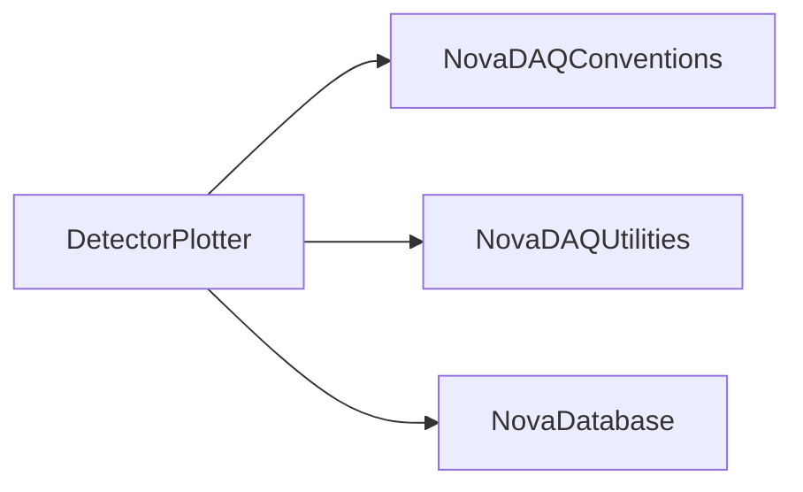

# DetectorPlotter

Readers for DCS/round-robin data and tools producing time-series/ROOT diagnostic output.

## Identity and scope

Repository: [NovaDAQ/DetectorPlotter](https://github.com/NovaDAQ/DetectorPlotter) · Reviewed commit: `e12078ae40e3f0071d5cfe3fb97e756ae7c97715` · Domain: **Analysis**.

Tracked files: **31**. Production deployment and owner are **unconfirmed**.

## Operation

Verify database/RRD roots, requested time window, sampling step, and output destination. Check missing data and timestamps before interpreting a plot. Readers need the matching database, RRD, and ROOT dependencies.

For prerequisites, safe start/stop sequencing, health checks, and rollback see the [operations guide](../operations/index.md).

## Build and integration

This package uses the SRT/SoftRelTools release context. A standalone `make` in a fresh checkout is not a supported build recipe unless the required context is already configured. See [build and release](../operations/build.md).

| Build definition |
| --- |
| [GNUmakefile](https://github.com/NovaDAQ/DetectorPlotter/blob/e12078ae40e3f0071d5cfe3fb97e756ae7c97715/GNUmakefile) |
| [cxx/GNUmakefile](https://github.com/NovaDAQ/DetectorPlotter/blob/e12078ae40e3f0071d5cfe3fb97e756ae7c97715/cxx/GNUmakefile) |
| [cxx/src/GNUmakefile](https://github.com/NovaDAQ/DetectorPlotter/blob/e12078ae40e3f0071d5cfe3fb97e756ae7c97715/cxx/src/GNUmakefile) |
| [cxx/test/GNUmakefile](https://github.com/NovaDAQ/DetectorPlotter/blob/e12078ae40e3f0071d5cfe3fb97e756ae7c97715/cxx/test/GNUmakefile) |
| [cxx/unittest/GNUmakefile](https://github.com/NovaDAQ/DetectorPlotter/blob/e12078ae40e3f0071d5cfe3fb97e756ae7c97715/cxx/unittest/GNUmakefile) |

## Entry points

These are source entry points or operational scripts found statically. Installation names and enabled targets depend on the build/configuration; listing a script does not establish that it is deployed.

| Source |
| --- |
| [cxx/src/GangliaDcsNtuple.cc](https://github.com/NovaDAQ/DetectorPlotter/blob/e12078ae40e3f0071d5cfe3fb97e756ae7c97715/cxx/src/GangliaDcsNtuple.cc) |
| [cxx/src/ntsTest.cc](https://github.com/NovaDAQ/DetectorPlotter/blob/e12078ae40e3f0071d5cfe3fb97e756ae7c97715/cxx/src/ntsTest.cc) |
| [cxx/src/plotDSOResult.cc](https://github.com/NovaDAQ/DetectorPlotter/blob/e12078ae40e3f0071d5cfe3fb97e756ae7c97715/cxx/src/plotDSOResult.cc) |
| [cxx/src/simpleDCSNtuple.cc](https://github.com/NovaDAQ/DetectorPlotter/blob/e12078ae40e3f0071d5cfe3fb97e756ae7c97715/cxx/src/simpleDCSNtuple.cc) |
| [cxx/src/simpleNtuple.cc](https://github.com/NovaDAQ/DetectorPlotter/blob/e12078ae40e3f0071d5cfe3fb97e756ae7c97715/cxx/src/simpleNtuple.cc) |
| [scripts/mineRRD.sh](https://github.com/NovaDAQ/DetectorPlotter/blob/e12078ae40e3f0071d5cfe3fb97e756ae7c97715/scripts/mineRRD.sh) |
| [scripts/setup_DB_nddaq.sh](https://github.com/NovaDAQ/DetectorPlotter/blob/e12078ae40e3f0071d5cfe3fb97e756ae7c97715/scripts/setup_DB_nddaq.sh) |
| [scripts/shifterDSOCheck.sh](https://github.com/NovaDAQ/DetectorPlotter/blob/e12078ae40e3f0071d5cfe3fb97e756ae7c97715/scripts/shifterDSOCheck.sh) |

## Interfaces

Headers and declared types form the API navigation map. Follow the source for method signatures, ownership, units, and error contracts. Generated DDS/XSD types are built from the schemas in the next section.

| Header | Declared types |
| --- | --- |
| [cxx/include/DetectorPlotterUtils.h](https://github.com/NovaDAQ/DetectorPlotter/blob/e12078ae40e3f0071d5cfe3fb97e756ae7c97715/cxx/include/DetectorPlotterUtils.h) | `NovaRRDData`, `NovaTimeSeries`, `TTree` |
| [cxx/include/Dpl.h](https://github.com/NovaDAQ/DetectorPlotter/blob/e12078ae40e3f0071d5cfe3fb97e756ae7c97715/cxx/include/Dpl.h) | Functions, constants, or templates |
| [cxx/include/NovaDCSReader.h](https://github.com/NovaDAQ/DetectorPlotter/blob/e12078ae40e3f0071d5cfe3fb97e756ae7c97715/cxx/include/NovaDCSReader.h) | `NovaDCSReader` |
| [cxx/include/NovaRRDReader.h](https://github.com/NovaDAQ/DetectorPlotter/blob/e12078ae40e3f0071d5cfe3fb97e756ae7c97715/cxx/include/NovaRRDReader.h) | `NovaRRDData`, `NovaRRDReader` |
| [cxx/include/NovaTimeSeries.h](https://github.com/NovaDAQ/DetectorPlotter/blob/e12078ae40e3f0071d5cfe3fb97e756ae7c97715/cxx/include/NovaTimeSeries.h) | `NovaTimeSeries` |
| [cxx/include/NtupleConfig.h](https://github.com/NovaDAQ/DetectorPlotter/blob/e12078ae40e3f0071d5cfe3fb97e756ae7c97715/cxx/include/NtupleConfig.h) | `NtupleConfig` |
| [cxx/include/plotDSOResult.h](https://github.com/NovaDAQ/DetectorPlotter/blob/e12078ae40e3f0071d5cfe3fb97e756ae7c97715/cxx/include/plotDSOResult.h) | Functions, constants, or templates |

## Configuration and data contracts

No separate XML/IDL/XSD/FHiCL/INI/YAML/JSON configuration was identified. Inspect command-line parsing and site launchers for this package; defaults may be embedded in source.

## Environment and external dependencies

Environment names below are literal lookups found in source, not a guarantee that every value is mandatory. No environment values or credentials are copied into this documentation.

No literal environment lookup was identified by this scan; shell setup scripts may still provide required values.

Unresolved/non-package include roots (some are system or generated headers; this is not a package-manager lockfile):

| Include root | Evidence |
| --- | --- |
| `sys` | [cxx/src/GangliaDcsNtuple.cc:2](https://github.com/NovaDAQ/DetectorPlotter/blob/e12078ae40e3f0071d5cfe3fb97e756ae7c97715/cxx/src/GangliaDcsNtuple.cc#L2) |

## Package dependencies

Arrow direction is **consumer → dependency**. This diagram includes source/build/runtime relationships and excludes test-only, release-membership, and build-tool edges. Conditional branches are not evaluated.

| Dependency | Relationship | Evidence |
| --- | --- | --- |
| [NovaDAQConventions](NovaDAQConventions.md) | source include | [cxx/include/plotDSOResult.h:4](https://github.com/NovaDAQ/DetectorPlotter/blob/e12078ae40e3f0071d5cfe3fb97e756ae7c97715/cxx/include/plotDSOResult.h#L4) |
| [NovaDAQUtilities](NovaDAQUtilities.md) | source include | [cxx/src/NovaDCSReader.cpp:11](https://github.com/NovaDAQ/DetectorPlotter/blob/e12078ae40e3f0071d5cfe3fb97e756ae7c97715/cxx/src/NovaDCSReader.cpp#L11) |
| [NovaDatabase](NovaDatabase.md) | source include | [cxx/src/NovaDCSReader.cpp:9](https://github.com/NovaDAQ/DetectorPlotter/blob/e12078ae40e3f0071d5cfe3fb97e756ae7c97715/cxx/src/NovaDCSReader.cpp#L9) |
| [SRT_ONLINE](SRT_ONLINE.md) | build tool | [GNUmakefile:10](https://github.com/NovaDAQ/DetectorPlotter/blob/e12078ae40e3f0071d5cfe3fb97e756ae7c97715/GNUmakefile#L10) |

Direct consumers: None resolved in this snapshot.

Explore upstream/downstream impact in the [dependency explorer](../architecture/explorer.md).

## Validation and review

Static analysis attempted **13 C/C++ translation units**, **3 shell scripts**, and parsed **0 Python files**. Counts are tool input coverage, not proof of successful compilation or exhaustive review. Source/build/configuration inventories and the operating surface were also assessed.

| Severity | Finding | GitHub |
| --- | --- | --- |
| P2 | [NDAQ-011: Keep rrd_xport argument strings alive across vector growth](../review/issues/NDAQ-011.md) | [Issue](https://github.com/NovaDAQ/DetectorPlotter/issues/1) |
| P2 | [NDAQ-040: Check ROOT canvas lookups before cloning them](../review/issues/NDAQ-040.md) | [Issue](https://github.com/NovaDAQ/DetectorPlotter/issues/2) |

Existing test/example sources (not executed against production):

| Source |
| --- |
| [cxx/test/stupidTest.cc](https://github.com/NovaDAQ/DetectorPlotter/blob/e12078ae40e3f0071d5cfe3fb97e756ae7c97715/cxx/test/stupidTest.cc) |
| [cxx/test/testNtupleConfig.cc](https://github.com/NovaDAQ/DetectorPlotter/blob/e12078ae40e3f0071d5cfe3fb97e756ae7c97715/cxx/test/testNtupleConfig.cc) |

## Existing documentation

| Source |
| --- |
| [scripts/README](https://github.com/NovaDAQ/DetectorPlotter/blob/e12078ae40e3f0071d5cfe3fb97e756ae7c97715/scripts/README) |
