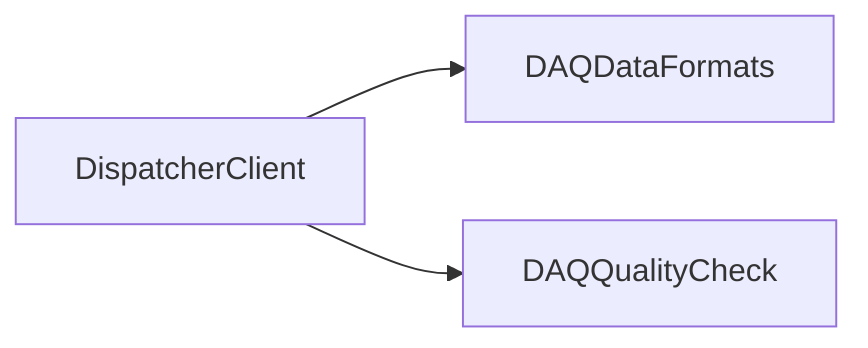

# DispatcherClient

Framework client and event handle for receiving dispatched raw events into analysis modules.

## Identity and scope

Repository: [NovaDAQ/DispatcherClient](https://github.com/NovaDAQ/DispatcherClient) · Reviewed commit: `849494a4c0924281dd0c3b0305ef4a3b60aa6419` · Domain: **Data path**.

Tracked files: **9**. Production deployment and owner are **unconfirmed**.

## Operation

Match the dispatcher protocol, event format, framework ABI, and channel-map dependencies. Verify a complete event and reconnect behavior with captured/test data before online use.

For prerequisites, safe start/stop sequencing, health checks, and rollback see the [operations guide](../operations/index.md).

## Build and integration

This package uses the SRT/SoftRelTools release context. A standalone `make` in a fresh checkout is not a supported build recipe unless the required context is already configured. See [build and release](../operations/build.md).

| Build definition |
| --- |
| [GNUmakefile](https://github.com/NovaDAQ/DispatcherClient/blob/849494a4c0924281dd0c3b0305ef4a3b60aa6419/GNUmakefile) |
| [test/GNUmakefile](https://github.com/NovaDAQ/DispatcherClient/blob/849494a4c0924281dd0c3b0305ef4a3b60aa6419/test/GNUmakefile) |

## Entry points

These are source entry points or operational scripts found statically. Installation names and enabled targets depend on the build/configuration; listing a script does not establish that it is deployed.

No standalone executable entry point was identified; this package may provide libraries, contracts, configuration, or binary artifacts.

## Interfaces

Headers and declared types form the API navigation map. Follow the source for method signatures, ownership, units, and error contracts. Generated DDS/XSD types are built from the schemas in the next section.

| Header | Declared types |
| --- | --- |
| [DspEventHandle.h](https://github.com/NovaDAQ/DispatcherClient/blob/849494a4c0924281dd0c3b0305ef4a3b60aa6419/DspEventHandle.h) | `DspEventHandle`, `TBranch`, `TTree` |
| [DspReadModule.h](https://github.com/NovaDAQ/DispatcherClient/blob/849494a4c0924281dd0c3b0305ef4a3b60aa6419/DspReadModule.h) | `DspEventHandle`, `DspReadModule`, `TFile`, `TTree` |

## Configuration and data contracts

No separate XML/IDL/XSD/FHiCL/INI/YAML/JSON configuration was identified. Inspect command-line parsing and site launchers for this package; defaults may be embedded in source.

## Environment and external dependencies

Environment names below are literal lookups found in source, not a guarantee that every value is mandatory. No environment values or credentials are copied into this documentation.

No literal environment lookup was identified by this scan; shell setup scripts may still provide required values.

Unresolved/non-package include roots (some are system or generated headers; this is not a package-manager lockfile):

| Include root | Evidence |
| --- | --- |
| `DAQ2RawDigit` | [DspReadModule.h:16](https://github.com/NovaDAQ/DispatcherClient/blob/849494a4c0924281dd0c3b0305ef4a3b60aa6419/DspReadModule.h#L16) |
| `EventDataModel` | [DspEventHandle.cpp:11](https://github.com/NovaDAQ/DispatcherClient/blob/849494a4c0924281dd0c3b0305ef4a3b60aa6419/DspEventHandle.cpp#L11) |
| `Header` | [DspReadModule.cpp:22](https://github.com/NovaDAQ/DispatcherClient/blob/849494a4c0924281dd0c3b0305ef4a3b60aa6419/DspReadModule.cpp#L22) |
| `IoModules` | [DspEventHandle.cpp:10](https://github.com/NovaDAQ/DispatcherClient/blob/849494a4c0924281dd0c3b0305ef4a3b60aa6419/DspEventHandle.cpp#L10) |
| `QtNetwork` | [DspReadModule.h:11](https://github.com/NovaDAQ/DispatcherClient/blob/849494a4c0924281dd0c3b0305ef4a3b60aa6419/DspReadModule.h#L11) |
| `RawData` | [DspReadModule.cpp:18](https://github.com/NovaDAQ/DispatcherClient/blob/849494a4c0924281dd0c3b0305ef4a3b60aa6419/DspReadModule.cpp#L18) |

## Package dependencies

Arrow direction is **consumer → dependency**. This diagram includes source/build/runtime relationships and excludes test-only, release-membership, and build-tool edges. Conditional branches are not evaluated.

| Dependency | Relationship | Evidence |
| --- | --- | --- |
| [DAQDataFormats](DAQDataFormats.md) | build link | [GNUmakefile:20](https://github.com/NovaDAQ/DispatcherClient/blob/849494a4c0924281dd0c3b0305ef4a3b60aa6419/GNUmakefile#L20) |
| [DAQDataFormats](DAQDataFormats.md) | source include | [DspReadModule.cpp:17](https://github.com/NovaDAQ/DispatcherClient/blob/849494a4c0924281dd0c3b0305ef4a3b60aa6419/DspReadModule.cpp#L17) |
| [DAQDataFormats](DAQDataFormats.md) | test link | [test/GNUmakefile:21](https://github.com/NovaDAQ/DispatcherClient/blob/849494a4c0924281dd0c3b0305ef4a3b60aa6419/test/GNUmakefile#L21) |
| [DAQQualityCheck](DAQQualityCheck.md) | build link | [GNUmakefile:20](https://github.com/NovaDAQ/DispatcherClient/blob/849494a4c0924281dd0c3b0305ef4a3b60aa6419/GNUmakefile#L20) |
| [SRT_ONLINE](SRT_ONLINE.md) | build tool | [GNUmakefile:23](https://github.com/NovaDAQ/DispatcherClient/blob/849494a4c0924281dd0c3b0305ef4a3b60aa6419/GNUmakefile#L23) |

Direct consumers: None resolved in this snapshot.

Explore upstream/downstream impact in the [dependency explorer](../architecture/explorer.md).

## Validation and review

Static analysis attempted **3 C/C++ translation units**, **0 shell scripts**, and parsed **0 Python files**. Counts are tool input coverage, not proof of successful compilation or exhaustive review. Source/build/configuration inventories and the operating surface were also assessed.

No actionable defect was confirmed for this package in this review. This is a bounded review result, not a clean bill of health; unvalidated analyzer diagnostics were not filed as bugs.

Existing test/example sources (not executed against production):

| Source |
| --- |
| [test/LinkDef.h](https://github.com/NovaDAQ/DispatcherClient/blob/849494a4c0924281dd0c3b0305ef4a3b60aa6419/test/LinkDef.h) |
| [test/dspclient.cc](https://github.com/NovaDAQ/DispatcherClient/blob/849494a4c0924281dd0c3b0305ef4a3b60aa6419/test/dspclient.cc) |

## Existing documentation

No package README/manual identified in the scoped inventory. Use this page and the source interfaces above.
