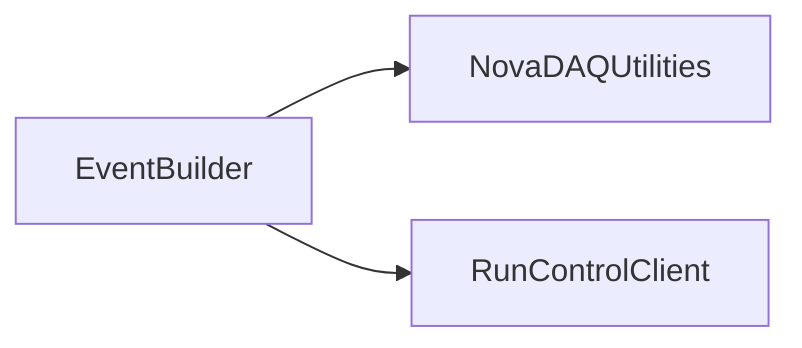

# EventBuilder

Generic TCP event builder with per-connection circular buffers, event assembly, and reporting.

## Identity and scope

Repository: [NovaDAQ/EventBuilder](https://github.com/NovaDAQ/EventBuilder) · Reviewed commit: `f937ff36bee8f44971b70ea9c44994c849fa369b` · Domain: **Data path**.

Tracked files: **51**. Production deployment and owner are **unconfirmed**.

## Operation

Match subevent format and timestamp semantics with EventBuilderClient. Size buffers for expected rate and event windows; monitor missing sources and backpressure. Establish a controlled stop/drain sequence before replacing the process.

For prerequisites, safe start/stop sequencing, health checks, and rollback see the [operations guide](../operations/index.md).

## Build and integration

This package uses the SRT/SoftRelTools release context. A standalone `make` in a fresh checkout is not a supported build recipe unless the required context is already configured. See [build and release](../operations/build.md).

| Build definition |
| --- |
| [GNUmakefile](https://github.com/NovaDAQ/EventBuilder/blob/f937ff36bee8f44971b70ea9c44994c849fa369b/GNUmakefile) |
| [cxx/GNUmakefile](https://github.com/NovaDAQ/EventBuilder/blob/f937ff36bee8f44971b70ea9c44994c849fa369b/cxx/GNUmakefile) |
| [cxx/src/GNUmakefile](https://github.com/NovaDAQ/EventBuilder/blob/f937ff36bee8f44971b70ea9c44994c849fa369b/cxx/src/GNUmakefile) |
| [cxx/test/GNUmakefile](https://github.com/NovaDAQ/EventBuilder/blob/f937ff36bee8f44971b70ea9c44994c849fa369b/cxx/test/GNUmakefile) |
| [cxx/unittest/GNUmakefile](https://github.com/NovaDAQ/EventBuilder/blob/f937ff36bee8f44971b70ea9c44994c849fa369b/cxx/unittest/GNUmakefile) |

## Entry points

These are source entry points or operational scripts found statically. Installation names and enabled targets depend on the build/configuration; listing a script does not establish that it is deployed.

| Source |
| --- |
| [cxx/src/eventbuilder.cc](https://github.com/NovaDAQ/EventBuilder/blob/f937ff36bee8f44971b70ea9c44994c849fa369b/cxx/src/eventbuilder.cc) |

## Interfaces

Headers and declared types form the API navigation map. Follow the source for method signatures, ownership, units, and error contracts. Generated DDS/XSD types are built from the schemas in the next section.

| Header | Declared types |
| --- | --- |
| [cxx/include/Acceptor.h](https://github.com/NovaDAQ/EventBuilder/blob/f937ff36bee8f44971b70ea9c44994c849fa369b/cxx/include/Acceptor.h) | `Acceptor`, `AcceptorTest`, `hostent`, `sockaddr_in` |
| [cxx/include/BufferManager.h](https://github.com/NovaDAQ/EventBuilder/blob/f937ff36bee8f44971b70ea9c44994c849fa369b/cxx/include/BufferManager.h) | `BufferManager`, `BufferManagerTest` |
| [cxx/include/Connection.h](https://github.com/NovaDAQ/EventBuilder/blob/f937ff36bee8f44971b70ea9c44994c849fa369b/cxx/include/Connection.h) | `Connection`, `ConnectionStatus`, `ConnectionTest`, `DataStatus`, `DataType`, `EventManager`, `Processor`, `timeval` |
| [cxx/include/ConnectionBuffer.h](https://github.com/NovaDAQ/EventBuilder/blob/f937ff36bee8f44971b70ea9c44994c849fa369b/cxx/include/ConnectionBuffer.h) | `BufferManagerTest`, `ConnectionBuffer`, `ConnectionBufferTest`, `ConnectionTest`, `DataSelectorTest` |
| [cxx/include/ConnectionBufferIndex.h](https://github.com/NovaDAQ/EventBuilder/blob/f937ff36bee8f44971b70ea9c44994c849fa369b/cxx/include/ConnectionBufferIndex.h) | `ConnectionBufferIndex`, `ConnectionBufferIndexTest`, `ConnectionBufferTest`, `DataSelectorTest` |
| [cxx/include/Defs.h](https://github.com/NovaDAQ/EventBuilder/blob/f937ff36bee8f44971b70ea9c44994c849fa369b/cxx/include/Defs.h) | `ReturnValue`, `TraceLevel` |
| [cxx/include/Director.h](https://github.com/NovaDAQ/EventBuilder/blob/f937ff36bee8f44971b70ea9c44994c849fa369b/cxx/include/Director.h) | `AcceptorType`, `Director`, `DirectorTest`, `hostent`, `sockaddr_in` |
| [cxx/include/Event.h](https://github.com/NovaDAQ/EventBuilder/blob/f937ff36bee8f44971b70ea9c44994c849fa369b/cxx/include/Event.h) | `Event` |
| [cxx/include/EventManager.h](https://github.com/NovaDAQ/EventBuilder/blob/f937ff36bee8f44971b70ea9c44994c849fa369b/cxx/include/EventManager.h) | `EventManager` |
| [cxx/include/Processor.h](https://github.com/NovaDAQ/EventBuilder/blob/f937ff36bee8f44971b70ea9c44994c849fa369b/cxx/include/Processor.h) | `Connection`, `Processor`, `ProcessorTest` |
| [cxx/include/ReportProvider.h](https://github.com/NovaDAQ/EventBuilder/blob/f937ff36bee8f44971b70ea9c44994c849fa369b/cxx/include/ReportProvider.h) | `ReportProvider`, `ReportProviderTest`, `ReportRequestType` |
| [cxx/include/SubEvent.h](https://github.com/NovaDAQ/EventBuilder/blob/f937ff36bee8f44971b70ea9c44994c849fa369b/cxx/include/SubEvent.h) | `SubEvent`, `SubEventType` |
| [cxx/include/Trace.h](https://github.com/NovaDAQ/EventBuilder/blob/f937ff36bee8f44971b70ea9c44994c849fa369b/cxx/include/Trace.h) | `timeval` |

## Configuration and data contracts

No separate XML/IDL/XSD/FHiCL/INI/YAML/JSON configuration was identified. Inspect command-line parsing and site launchers for this package; defaults may be embedded in source.

## Environment and external dependencies

Environment names below are literal lookups found in source, not a guarantee that every value is mandatory. No environment values or credentials are copied into this documentation.

No literal environment lookup was identified by this scan; shell setup scripts may still provide required values.

Unresolved/non-package include roots (some are system or generated headers; this is not a package-manager lockfile):

| Include root | Evidence |
| --- | --- |
| `boost` | [cxx/include/Director.h:24](https://github.com/NovaDAQ/EventBuilder/blob/f937ff36bee8f44971b70ea9c44994c849fa369b/cxx/include/Director.h#L24) |
| `cppunit` | [cxx/unittest/AcceptorTest.cpp:7](https://github.com/NovaDAQ/EventBuilder/blob/f937ff36bee8f44971b70ea9c44994c849fa369b/cxx/unittest/AcceptorTest.cpp#L7) |
| `linux` | [cxx/include/Trace.h:20](https://github.com/NovaDAQ/EventBuilder/blob/f937ff36bee8f44971b70ea9c44994c849fa369b/cxx/include/Trace.h#L20) |
| `netinet` | [cxx/src/ReportProvider.cpp:13](https://github.com/NovaDAQ/EventBuilder/blob/f937ff36bee8f44971b70ea9c44994c849fa369b/cxx/src/ReportProvider.cpp#L13) |
| `sys` | [cxx/include/Acceptor.h:11](https://github.com/NovaDAQ/EventBuilder/blob/f937ff36bee8f44971b70ea9c44994c849fa369b/cxx/include/Acceptor.h#L11) |

## Package dependencies

Arrow direction is **consumer → dependency**. This diagram includes source/build/runtime relationships and excludes test-only, release-membership, and build-tool edges. Conditional branches are not evaluated.

| Dependency | Relationship | Evidence |
| --- | --- | --- |
| [NovaDAQUtilities](NovaDAQUtilities.md) | source include | [cxx/include/Director.h:22](https://github.com/NovaDAQ/EventBuilder/blob/f937ff36bee8f44971b70ea9c44994c849fa369b/cxx/include/Director.h#L22) |
| [NovaDAQUtilities](NovaDAQUtilities.md) | test include | [cxx/unittest/ConnectionTest.cpp:19](https://github.com/NovaDAQ/EventBuilder/blob/f937ff36bee8f44971b70ea9c44994c849fa369b/cxx/unittest/ConnectionTest.cpp#L19) |
| [RunControlClient](RunControlClient.md) | source include | [cxx/include/Acceptor.h:21](https://github.com/NovaDAQ/EventBuilder/blob/f937ff36bee8f44971b70ea9c44994c849fa369b/cxx/include/Acceptor.h#L21) |
| [RunControlClient](RunControlClient.md) | test link | [cxx/test/GNUmakefile:11](https://github.com/NovaDAQ/EventBuilder/blob/f937ff36bee8f44971b70ea9c44994c849fa369b/cxx/test/GNUmakefile#L11) |
| [SRT_ONLINE](SRT_ONLINE.md) | build tool | [GNUmakefile:10](https://github.com/NovaDAQ/EventBuilder/blob/f937ff36bee8f44971b70ea9c44994c849fa369b/GNUmakefile#L10) |

Direct consumers: [EventBuilderClient_OLD](EventBuilderClient_OLD.md), [EventBuilder_OLD](EventBuilder_OLD.md), [NovaDataLogger_OLD](NovaDataLogger_OLD.md), [NovaEventBuilder](NovaEventBuilder.md), [NovaEventBuilderClient](NovaEventBuilderClient.md), [NovaEventBuilderClient_OLD](NovaEventBuilderClient_OLD.md), [NovaEventBuilder_OLD](NovaEventBuilder_OLD.md).

Explore upstream/downstream impact in the [dependency explorer](../architecture/explorer.md).

## Validation and review

Static analysis attempted **20 C/C++ translation units**, **0 shell scripts**, and parsed **0 Python files**. Counts are tool input coverage, not proof of successful compilation or exhaustive review. Source/build/configuration inventories and the operating surface were also assessed.

No actionable defect was confirmed for this package in this review. This is a bounded review result, not a clean bill of health; unvalidated analyzer diagnostics were not filed as bugs.

Existing test/example sources (not executed against production):

| Source |
| --- |
| [cxx/test/EventBuilderServer.cc](https://github.com/NovaDAQ/EventBuilder/blob/f937ff36bee8f44971b70ea9c44994c849fa369b/cxx/test/EventBuilderServer.cc) |
| [cxx/test/ReportCollector.cc](https://github.com/NovaDAQ/EventBuilder/blob/f937ff36bee8f44971b70ea9c44994c849fa369b/cxx/test/ReportCollector.cc) |
| [cxx/unittest/AcceptorTest.cpp](https://github.com/NovaDAQ/EventBuilder/blob/f937ff36bee8f44971b70ea9c44994c849fa369b/cxx/unittest/AcceptorTest.cpp) |
| [cxx/unittest/AcceptorTest.h](https://github.com/NovaDAQ/EventBuilder/blob/f937ff36bee8f44971b70ea9c44994c849fa369b/cxx/unittest/AcceptorTest.h) |
| [cxx/unittest/BufferManagerTest.cpp](https://github.com/NovaDAQ/EventBuilder/blob/f937ff36bee8f44971b70ea9c44994c849fa369b/cxx/unittest/BufferManagerTest.cpp) |
| [cxx/unittest/BufferManagerTest.h](https://github.com/NovaDAQ/EventBuilder/blob/f937ff36bee8f44971b70ea9c44994c849fa369b/cxx/unittest/BufferManagerTest.h) |
| [cxx/unittest/ConnectionBufferIndexTest.cpp](https://github.com/NovaDAQ/EventBuilder/blob/f937ff36bee8f44971b70ea9c44994c849fa369b/cxx/unittest/ConnectionBufferIndexTest.cpp) |
| [cxx/unittest/ConnectionBufferIndexTest.h](https://github.com/NovaDAQ/EventBuilder/blob/f937ff36bee8f44971b70ea9c44994c849fa369b/cxx/unittest/ConnectionBufferIndexTest.h) |
| [cxx/unittest/ConnectionBufferTest.cpp](https://github.com/NovaDAQ/EventBuilder/blob/f937ff36bee8f44971b70ea9c44994c849fa369b/cxx/unittest/ConnectionBufferTest.cpp) |
| [cxx/unittest/ConnectionBufferTest.h](https://github.com/NovaDAQ/EventBuilder/blob/f937ff36bee8f44971b70ea9c44994c849fa369b/cxx/unittest/ConnectionBufferTest.h) |
| [cxx/unittest/ConnectionTest.cpp](https://github.com/NovaDAQ/EventBuilder/blob/f937ff36bee8f44971b70ea9c44994c849fa369b/cxx/unittest/ConnectionTest.cpp) |
| [cxx/unittest/ConnectionTest.h](https://github.com/NovaDAQ/EventBuilder/blob/f937ff36bee8f44971b70ea9c44994c849fa369b/cxx/unittest/ConnectionTest.h) |
| [cxx/unittest/DirectorTest.cpp](https://github.com/NovaDAQ/EventBuilder/blob/f937ff36bee8f44971b70ea9c44994c849fa369b/cxx/unittest/DirectorTest.cpp) |
| [cxx/unittest/DirectorTest.h](https://github.com/NovaDAQ/EventBuilder/blob/f937ff36bee8f44971b70ea9c44994c849fa369b/cxx/unittest/DirectorTest.h) |
| [cxx/unittest/EVBUnitTestMain.cc](https://github.com/NovaDAQ/EventBuilder/blob/f937ff36bee8f44971b70ea9c44994c849fa369b/cxx/unittest/EVBUnitTestMain.cc) |
| [cxx/unittest/EventManagerTest.cpp](https://github.com/NovaDAQ/EventBuilder/blob/f937ff36bee8f44971b70ea9c44994c849fa369b/cxx/unittest/EventManagerTest.cpp) |
| [cxx/unittest/EventManagerTest.h](https://github.com/NovaDAQ/EventBuilder/blob/f937ff36bee8f44971b70ea9c44994c849fa369b/cxx/unittest/EventManagerTest.h) |
| [cxx/unittest/ProcessorTest.cpp](https://github.com/NovaDAQ/EventBuilder/blob/f937ff36bee8f44971b70ea9c44994c849fa369b/cxx/unittest/ProcessorTest.cpp) |
| [cxx/unittest/ProcessorTest.h](https://github.com/NovaDAQ/EventBuilder/blob/f937ff36bee8f44971b70ea9c44994c849fa369b/cxx/unittest/ProcessorTest.h) |
| [cxx/unittest/SubEventTest.cpp](https://github.com/NovaDAQ/EventBuilder/blob/f937ff36bee8f44971b70ea9c44994c849fa369b/cxx/unittest/SubEventTest.cpp) |
| [cxx/unittest/SubEventTest.h](https://github.com/NovaDAQ/EventBuilder/blob/f937ff36bee8f44971b70ea9c44994c849fa369b/cxx/unittest/SubEventTest.h) |

## Existing documentation

No package README/manual identified in the scoped inventory. Use this page and the source interfaces above.
