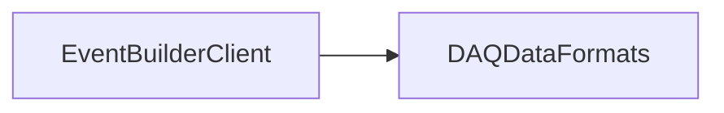

# EventBuilderClient

TCP connection and sender library for delivering subevents to EventBuilder.

## Identity and scope

Repository: [NovaDAQ/EventBuilderClient](https://github.com/NovaDAQ/EventBuilderClient) · Reviewed commit: `c09ce105f69b6c71d21b6c680d80db8b1d09b645` · Domain: **Data path**.

Tracked files: **21**. Production deployment and owner are **unconfirmed**.

## Operation

Configure server address, send timeout, retry count, and socket buffer size. Test connection loss and partial sends on a local test server. Repeated connection failures should not consume descriptors or publish partial events.

For prerequisites, safe start/stop sequencing, health checks, and rollback see the [operations guide](../operations/index.md).

## Build and integration

This package uses the SRT/SoftRelTools release context. A standalone `make` in a fresh checkout is not a supported build recipe unless the required context is already configured. See [build and release](../operations/build.md).

| Build definition |
| --- |
| [GNUmakefile](https://github.com/NovaDAQ/EventBuilderClient/blob/c09ce105f69b6c71d21b6c680d80db8b1d09b645/GNUmakefile) |
| [cxx/GNUmakefile](https://github.com/NovaDAQ/EventBuilderClient/blob/c09ce105f69b6c71d21b6c680d80db8b1d09b645/cxx/GNUmakefile) |
| [cxx/src/GNUmakefile](https://github.com/NovaDAQ/EventBuilderClient/blob/c09ce105f69b6c71d21b6c680d80db8b1d09b645/cxx/src/GNUmakefile) |
| [cxx/test/GNUmakefile](https://github.com/NovaDAQ/EventBuilderClient/blob/c09ce105f69b6c71d21b6c680d80db8b1d09b645/cxx/test/GNUmakefile) |
| [cxx/unittest/GNUmakefile](https://github.com/NovaDAQ/EventBuilderClient/blob/c09ce105f69b6c71d21b6c680d80db8b1d09b645/cxx/unittest/GNUmakefile) |

## Entry points

These are source entry points or operational scripts found statically. Installation names and enabled targets depend on the build/configuration; listing a script does not establish that it is deployed.

No standalone executable entry point was identified; this package may provide libraries, contracts, configuration, or binary artifacts.

## Interfaces

Headers and declared types form the API navigation map. Follow the source for method signatures, ownership, units, and error contracts. Generated DDS/XSD types are built from the schemas in the next section.

| Header | Declared types |
| --- | --- |
| [cxx/include/Evbc.h](https://github.com/NovaDAQ/EventBuilderClient/blob/c09ce105f69b6c71d21b6c680d80db8b1d09b645/cxx/include/Evbc.h) | Functions, constants, or templates |
| [cxx/include/EvbcConnection.h](https://github.com/NovaDAQ/EventBuilderClient/blob/c09ce105f69b6c71d21b6c680d80db8b1d09b645/cxx/include/EvbcConnection.h) | `ConnectionStatusBits`, `EvbcConnection`, `EvbcConnectionTest`, `hostent` |

## Configuration and data contracts

No separate XML/IDL/XSD/FHiCL/INI/YAML/JSON configuration was identified. Inspect command-line parsing and site launchers for this package; defaults may be embedded in source.

## Environment and external dependencies

Environment names below are literal lookups found in source, not a guarantee that every value is mandatory. No environment values or credentials are copied into this documentation.

| Variable | Evidence |
| --- | --- |
| `SRT_PRIVATE_CONTEXT` | [cxx/src/Evbc.cpp:34](https://github.com/NovaDAQ/EventBuilderClient/blob/c09ce105f69b6c71d21b6c680d80db8b1d09b645/cxx/src/Evbc.cpp#L34) |
| `SRT_PUBLIC_CONTEXT` | [cxx/src/Evbc.cpp:38](https://github.com/NovaDAQ/EventBuilderClient/blob/c09ce105f69b6c71d21b6c680d80db8b1d09b645/cxx/src/Evbc.cpp#L38) |

Unresolved/non-package include roots (some are system or generated headers; this is not a package-manager lockfile):

| Include root | Evidence |
| --- | --- |
| `arpa` | [cxx/src/EvbcConnection.cpp:6](https://github.com/NovaDAQ/EventBuilderClient/blob/c09ce105f69b6c71d21b6c680d80db8b1d09b645/cxx/src/EvbcConnection.cpp#L6) |
| `boost` | [cxx/src/Evbc.cpp:8](https://github.com/NovaDAQ/EventBuilderClient/blob/c09ce105f69b6c71d21b6c680d80db8b1d09b645/cxx/src/Evbc.cpp#L8) |
| `cppunit` | [cxx/unittest/EvbcConnectionTest.cpp:7](https://github.com/NovaDAQ/EventBuilderClient/blob/c09ce105f69b6c71d21b6c680d80db8b1d09b645/cxx/unittest/EvbcConnectionTest.cpp#L7) |
| `messagefacility` | [cxx/src/Evbc.cpp:9](https://github.com/NovaDAQ/EventBuilderClient/blob/c09ce105f69b6c71d21b6c680d80db8b1d09b645/cxx/src/Evbc.cpp#L9) |
| `sys` | [cxx/src/Evbc.cpp:5](https://github.com/NovaDAQ/EventBuilderClient/blob/c09ce105f69b6c71d21b6c680d80db8b1d09b645/cxx/src/Evbc.cpp#L5) |

## Package dependencies

Arrow direction is **consumer → dependency**. This diagram includes source/build/runtime relationships and excludes test-only, release-membership, and build-tool edges. Conditional branches are not evaluated.

| Dependency | Relationship | Evidence |
| --- | --- | --- |
| [DAQDataFormats](DAQDataFormats.md) | source include | [cxx/include/EvbcConnection.h:10](https://github.com/NovaDAQ/EventBuilderClient/blob/c09ce105f69b6c71d21b6c680d80db8b1d09b645/cxx/include/EvbcConnection.h#L10) |
| [DAQDataFormats](DAQDataFormats.md) | test include | [cxx/test/evbcclient.cc:23](https://github.com/NovaDAQ/EventBuilderClient/blob/c09ce105f69b6c71d21b6c680d80db8b1d09b645/cxx/test/evbcclient.cc#L23) |
| [DAQDataFormats](DAQDataFormats.md) | test link | [cxx/test/GNUmakefile:11](https://github.com/NovaDAQ/EventBuilderClient/blob/c09ce105f69b6c71d21b6c680d80db8b1d09b645/cxx/test/GNUmakefile#L11) |
| [NovaDAQUtilities](NovaDAQUtilities.md) | test include | [cxx/test/evbcserver.cc:21](https://github.com/NovaDAQ/EventBuilderClient/blob/c09ce105f69b6c71d21b6c680d80db8b1d09b645/cxx/test/evbcserver.cc#L21) |
| [SRT_ONLINE](SRT_ONLINE.md) | build tool | [GNUmakefile:10](https://github.com/NovaDAQ/EventBuilderClient/blob/c09ce105f69b6c71d21b6c680d80db8b1d09b645/GNUmakefile#L10) |
| [Trace](Trace.md) | test include | [cxx/test/evbcclient.cc:25](https://github.com/NovaDAQ/EventBuilderClient/blob/c09ce105f69b6c71d21b6c680d80db8b1d09b645/cxx/test/evbcclient.cc#L25) |

Direct consumers: [DCMApplication](DCMApplication.md), [EventBuilderClient_OLD](EventBuilderClient_OLD.md), [NovaEventBuilder](NovaEventBuilder.md), [NovaEventBuilderClient](NovaEventBuilderClient.md), [NovaEventBuilderClient_OLD](NovaEventBuilderClient_OLD.md), [NovaEventBuilder_OLD](NovaEventBuilder_OLD.md).

Explore upstream/downstream impact in the [dependency explorer](../architecture/explorer.md).

## Validation and review

Static analysis attempted **6 C/C++ translation units**, **0 shell scripts**, and parsed **0 Python files**. Counts are tool input coverage, not proof of successful compilation or exhaustive review. Source/build/configuration inventories and the operating surface were also assessed.

| Severity | Finding | GitHub |
| --- | --- | --- |
| P2 | [NDAQ-034: Close failed connection sockets before retry or destruction](../review/issues/NDAQ-034.md) | [Issue](https://github.com/NovaDAQ/EventBuilderClient/issues/1) |

Existing test/example sources (not executed against production):

| Source |
| --- |
| [cxx/test/evbcclient.cc](https://github.com/NovaDAQ/EventBuilderClient/blob/c09ce105f69b6c71d21b6c680d80db8b1d09b645/cxx/test/evbcclient.cc) |
| [cxx/test/evbcserver.cc](https://github.com/NovaDAQ/EventBuilderClient/blob/c09ce105f69b6c71d21b6c680d80db8b1d09b645/cxx/test/evbcserver.cc) |
| [cxx/unittest/EvbcConnectionTest.cpp](https://github.com/NovaDAQ/EventBuilderClient/blob/c09ce105f69b6c71d21b6c680d80db8b1d09b645/cxx/unittest/EvbcConnectionTest.cpp) |
| [cxx/unittest/EvbcConnectionTest.h](https://github.com/NovaDAQ/EventBuilderClient/blob/c09ce105f69b6c71d21b6c680d80db8b1d09b645/cxx/unittest/EvbcConnectionTest.h) |
| [cxx/unittest/evbcunittest.cc](https://github.com/NovaDAQ/EventBuilderClient/blob/c09ce105f69b6c71d21b6c680d80db8b1d09b645/cxx/unittest/evbcunittest.cc) |

## Existing documentation

No package README/manual identified in the scoped inventory. Use this page and the source interfaces above.
