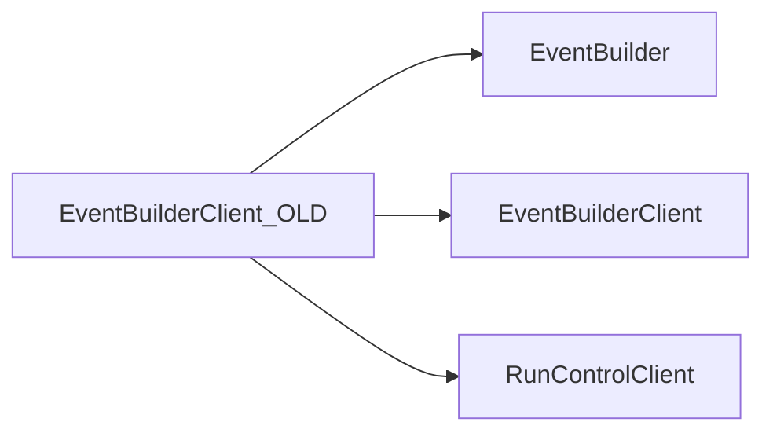

# EventBuilderClient_OLD

Earlier event-builder client implementation and tests retained for historical compatibility.

## Identity and scope

Repository: [NovaDAQ/EventBuilderClient_OLD](https://github.com/NovaDAQ/EventBuilderClient_OLD) · Reviewed commit: `48db26a2d720b257472cf538d3a4e859dbbf32f6` · Domain: **Data path**.

Tracked files: **15**. Production deployment and owner are **unconfirmed**. The directory name marks a legacy variant; retirement has not been independently verified.

## Operation

Confirm whether any deployed binary links this variant before scheduling work. Use the corresponding old server and message/data contracts for reproduction; do not substitute the newer client solely because names are similar.

For prerequisites, safe start/stop sequencing, health checks, and rollback see the [operations guide](../operations/index.md).

## Build and integration

This package uses the SRT/SoftRelTools release context. A standalone `make` in a fresh checkout is not a supported build recipe unless the required context is already configured. See [build and release](../operations/build.md).

| Build definition |
| --- |
| [GNUmakefile](https://github.com/NovaDAQ/EventBuilderClient_OLD/blob/48db26a2d720b257472cf538d3a4e859dbbf32f6/GNUmakefile) |

## Entry points

These are source entry points or operational scripts found statically. Installation names and enabled targets depend on the build/configuration; listing a script does not establish that it is deployed.

No standalone executable entry point was identified; this package may provide libraries, contracts, configuration, or binary artifacts.

## Interfaces

Headers and declared types form the API navigation map. Follow the source for method signatures, ownership, units, and error contracts. Generated DDS/XSD types are built from the schemas in the next section.

| Header | Declared types |
| --- | --- |
| [cxx/inc/EventBuilderClient/Client.hpp](https://github.com/NovaDAQ/EventBuilderClient_OLD/blob/48db26a2d720b257472cf538d3a4e859dbbf32f6/cxx/inc/EventBuilderClient/Client.hpp) | `Client`, `ClientTest` |
| [cxx/inc/EventBuilderClient/ClientConnection.hpp](https://github.com/NovaDAQ/EventBuilderClient_OLD/blob/48db26a2d720b257472cf538d3a4e859dbbf32f6/cxx/inc/EventBuilderClient/ClientConnection.hpp) | `ClientConnection`, `ClientConnectionTest`, `hostent`, `sockaddr_in` |
| [cxx/inc/EventBuilderClient/Defs.hpp](https://github.com/NovaDAQ/EventBuilderClient_OLD/blob/48db26a2d720b257472cf538d3a4e859dbbf32f6/cxx/inc/EventBuilderClient/Defs.hpp) | `ReturnValue`, `TraceLevel` |
| [cxx/inc/EventBuilderClient/Trace.hpp](https://github.com/NovaDAQ/EventBuilderClient_OLD/blob/48db26a2d720b257472cf538d3a4e859dbbf32f6/cxx/inc/EventBuilderClient/Trace.hpp) | `timeval` |

## Configuration and data contracts

| Source artifact |
| --- |
| [config/jcsc.xml](https://github.com/NovaDAQ/EventBuilderClient_OLD/blob/48db26a2d720b257472cf538d3a4e859dbbf32f6/config/jcsc.xml) |

## Environment and external dependencies

Environment names below are literal lookups found in source, not a guarantee that every value is mandatory. No environment values or credentials are copied into this documentation.

No literal environment lookup was identified by this scan; shell setup scripts may still provide required values.

Unresolved/non-package include roots (some are system or generated headers; this is not a package-manager lockfile):

| Include root | Evidence |
| --- | --- |
| `arpa` | [cxx/inc/EventBuilderClient/ClientConnection.hpp:13](https://github.com/NovaDAQ/EventBuilderClient_OLD/blob/48db26a2d720b257472cf538d3a4e859dbbf32f6/cxx/inc/EventBuilderClient/ClientConnection.hpp#L13) |
| `boost` | [test/cxx/src/ClientConnectionTest.cpp:25](https://github.com/NovaDAQ/EventBuilderClient_OLD/blob/48db26a2d720b257472cf538d3a4e859dbbf32f6/test/cxx/src/ClientConnectionTest.cpp#L25) |
| `cppunit` | [test/cxx/src/ClientConnectionTest.cpp:7](https://github.com/NovaDAQ/EventBuilderClient_OLD/blob/48db26a2d720b257472cf538d3a4e859dbbf32f6/test/cxx/src/ClientConnectionTest.cpp#L7) |
| `linux` | [cxx/inc/EventBuilderClient/Trace.hpp:35](https://github.com/NovaDAQ/EventBuilderClient_OLD/blob/48db26a2d720b257472cf538d3a4e859dbbf32f6/cxx/inc/EventBuilderClient/Trace.hpp#L35) |
| `sys` | [cxx/inc/EventBuilderClient/ClientConnection.hpp:12](https://github.com/NovaDAQ/EventBuilderClient_OLD/blob/48db26a2d720b257472cf538d3a4e859dbbf32f6/cxx/inc/EventBuilderClient/ClientConnection.hpp#L12) |

## Package dependencies

Arrow direction is **consumer → dependency**. This diagram includes source/build/runtime relationships and excludes test-only, release-membership, and build-tool edges. Conditional branches are not evaluated.

| Dependency | Relationship | Evidence |
| --- | --- | --- |
| [EventBuilder](EventBuilder.md) | build link | [GNUmakefile:136](https://github.com/NovaDAQ/EventBuilderClient_OLD/blob/48db26a2d720b257472cf538d3a4e859dbbf32f6/GNUmakefile#L136) |
| [EventBuilder](EventBuilder.md) | source include | [cxx/inc/EventBuilderClient/Client.hpp:11](https://github.com/NovaDAQ/EventBuilderClient_OLD/blob/48db26a2d720b257472cf538d3a4e859dbbf32f6/cxx/inc/EventBuilderClient/Client.hpp#L11) |
| [EventBuilder](EventBuilder.md) | test include | [test/cxx/src/ClientConnectionTest.cpp:17](https://github.com/NovaDAQ/EventBuilderClient_OLD/blob/48db26a2d720b257472cf538d3a4e859dbbf32f6/test/cxx/src/ClientConnectionTest.cpp#L17) |
| [EventBuilderClient](EventBuilderClient.md) | source include | [cxx/inc/EventBuilderClient/ClientConnection.hpp:16](https://github.com/NovaDAQ/EventBuilderClient_OLD/blob/48db26a2d720b257472cf538d3a4e859dbbf32f6/cxx/inc/EventBuilderClient/ClientConnection.hpp#L16) |
| [EventBuilderClient](EventBuilderClient.md) | test include | [test/cxx/src/ClientConnectionTest.cpp:16](https://github.com/NovaDAQ/EventBuilderClient_OLD/blob/48db26a2d720b257472cf538d3a4e859dbbf32f6/test/cxx/src/ClientConnectionTest.cpp#L16) |
| [ResponsiveMessagingSystem](ResponsiveMessagingSystem.md) | test include | [test/cxx/src/ClientConnectionTest.cpp:22](https://github.com/NovaDAQ/EventBuilderClient_OLD/blob/48db26a2d720b257472cf538d3a4e859dbbf32f6/test/cxx/src/ClientConnectionTest.cpp#L22) |
| [RunControlClient](RunControlClient.md) | build link | [GNUmakefile:137](https://github.com/NovaDAQ/EventBuilderClient_OLD/blob/48db26a2d720b257472cf538d3a4e859dbbf32f6/GNUmakefile#L137) |
| [RunControlClient](RunControlClient.md) | source include | [cxx/inc/EventBuilderClient/Client.hpp:13](https://github.com/NovaDAQ/EventBuilderClient_OLD/blob/48db26a2d720b257472cf538d3a4e859dbbf32f6/cxx/inc/EventBuilderClient/Client.hpp#L13) |

Direct consumers: None resolved in this snapshot.

Explore upstream/downstream impact in the [dependency explorer](../architecture/explorer.md).

## Validation and review

Static analysis attempted **3 C/C++ translation units**, **0 shell scripts**, and parsed **0 Python files**. Counts are tool input coverage, not proof of successful compilation or exhaustive review. Source/build/configuration inventories and the operating surface were also assessed.

No actionable defect was confirmed for this package in this review. This is a bounded review result, not a clean bill of health; unvalidated analyzer diagnostics were not filed as bugs.

Existing test/example sources (not executed against production):

| Source |
| --- |
| [test/cxx/src/ClientConnectionTest.cpp](https://github.com/NovaDAQ/EventBuilderClient_OLD/blob/48db26a2d720b257472cf538d3a4e859dbbf32f6/test/cxx/src/ClientConnectionTest.cpp) |
| [test/cxx/src/ClientTest.cpp](https://github.com/NovaDAQ/EventBuilderClient_OLD/blob/48db26a2d720b257472cf538d3a4e859dbbf32f6/test/cxx/src/ClientTest.cpp) |
| [test/cxx/src/EventBuilderClient.cpp](https://github.com/NovaDAQ/EventBuilderClient_OLD/blob/48db26a2d720b257472cf538d3a4e859dbbf32f6/test/cxx/src/EventBuilderClient.cpp) |

## Existing documentation

| Source |
| --- |
| [README](https://github.com/NovaDAQ/EventBuilderClient_OLD/blob/48db26a2d720b257472cf538d3a4e859dbbf32f6/README) |
