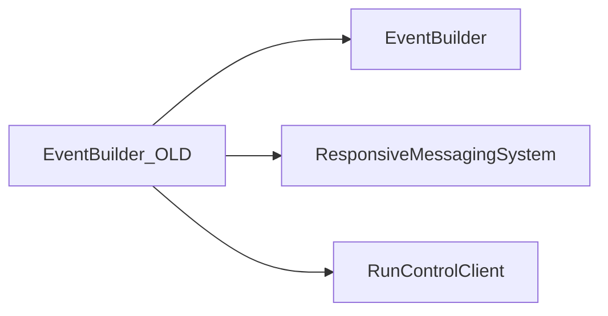

# EventBuilder_OLD

Earlier generic event-builder implementation with connection-buffer and event-manager tests.

## Identity and scope

Repository: [NovaDAQ/EventBuilder_OLD](https://github.com/NovaDAQ/EventBuilder_OLD) · Reviewed commit: `43cec6ed4597a360bb982a38d69b827a6ed9d130` · Domain: **Data path**.

Tracked files: **43**. Production deployment and owner are **unconfirmed**. The directory name marks a legacy variant; retirement has not been independently verified.

## Operation

Validate any reuse against the historical client protocol and buffer assumptions. Preserve old/new distinction in release manifests; a similarly named executable is not proof of binary compatibility.

For prerequisites, safe start/stop sequencing, health checks, and rollback see the [operations guide](../operations/index.md).

## Build and integration

This package uses the SRT/SoftRelTools release context. A standalone `make` in a fresh checkout is not a supported build recipe unless the required context is already configured. See [build and release](../operations/build.md).

| Build definition |
| --- |
| [GNUmakefile](https://github.com/NovaDAQ/EventBuilder_OLD/blob/43cec6ed4597a360bb982a38d69b827a6ed9d130/GNUmakefile) |

## Entry points

These are source entry points or operational scripts found statically. Installation names and enabled targets depend on the build/configuration; listing a script does not establish that it is deployed.

| Source |
| --- |
| [cxx/src/eventbuilder.cc](https://github.com/NovaDAQ/EventBuilder_OLD/blob/43cec6ed4597a360bb982a38d69b827a6ed9d130/cxx/src/eventbuilder.cc) |

## Interfaces

Headers and declared types form the API navigation map. Follow the source for method signatures, ownership, units, and error contracts. Generated DDS/XSD types are built from the schemas in the next section.

| Header | Declared types |
| --- | --- |
| [cxx/inc/EventBuilder/Acceptor.hpp](https://github.com/NovaDAQ/EventBuilder_OLD/blob/43cec6ed4597a360bb982a38d69b827a6ed9d130/cxx/inc/EventBuilder/Acceptor.hpp) | `Acceptor`, `AcceptorTest`, `hostent`, `sockaddr_in` |
| [cxx/inc/EventBuilder/BufferManager.hpp](https://github.com/NovaDAQ/EventBuilder_OLD/blob/43cec6ed4597a360bb982a38d69b827a6ed9d130/cxx/inc/EventBuilder/BufferManager.hpp) | `BufferManager`, `BufferManagerTest` |
| [cxx/inc/EventBuilder/Connection.hpp](https://github.com/NovaDAQ/EventBuilder_OLD/blob/43cec6ed4597a360bb982a38d69b827a6ed9d130/cxx/inc/EventBuilder/Connection.hpp) | `Connection`, `ConnectionStatus`, `ConnectionTest`, `DataStatus`, `DataType`, `EventManager`, `Processor` |
| [cxx/inc/EventBuilder/ConnectionBuffer.hpp](https://github.com/NovaDAQ/EventBuilder_OLD/blob/43cec6ed4597a360bb982a38d69b827a6ed9d130/cxx/inc/EventBuilder/ConnectionBuffer.hpp) | `BufferManagerTest`, `ConnectionBuffer`, `ConnectionBufferTest`, `ConnectionTest`, `DataSelectorTest` |
| [cxx/inc/EventBuilder/ConnectionBufferIndex.hpp](https://github.com/NovaDAQ/EventBuilder_OLD/blob/43cec6ed4597a360bb982a38d69b827a6ed9d130/cxx/inc/EventBuilder/ConnectionBufferIndex.hpp) | `ConnectionBufferIndex`, `ConnectionBufferIndexTest`, `ConnectionBufferTest`, `DataSelectorTest` |
| [cxx/inc/EventBuilder/Defs.hpp](https://github.com/NovaDAQ/EventBuilder_OLD/blob/43cec6ed4597a360bb982a38d69b827a6ed9d130/cxx/inc/EventBuilder/Defs.hpp) | `ReturnValue`, `TraceLevel` |
| [cxx/inc/EventBuilder/Director.hpp](https://github.com/NovaDAQ/EventBuilder_OLD/blob/43cec6ed4597a360bb982a38d69b827a6ed9d130/cxx/inc/EventBuilder/Director.hpp) | `AcceptorType`, `Director`, `DirectorTest`, `hostent`, `sockaddr_in` |
| [cxx/inc/EventBuilder/Event.hpp](https://github.com/NovaDAQ/EventBuilder_OLD/blob/43cec6ed4597a360bb982a38d69b827a6ed9d130/cxx/inc/EventBuilder/Event.hpp) | `Event` |
| [cxx/inc/EventBuilder/EventManager.hpp](https://github.com/NovaDAQ/EventBuilder_OLD/blob/43cec6ed4597a360bb982a38d69b827a6ed9d130/cxx/inc/EventBuilder/EventManager.hpp) | `EventManager` |
| [cxx/inc/EventBuilder/Processor.hpp](https://github.com/NovaDAQ/EventBuilder_OLD/blob/43cec6ed4597a360bb982a38d69b827a6ed9d130/cxx/inc/EventBuilder/Processor.hpp) | `Connection`, `Processor`, `ProcessorTest` |
| [cxx/inc/EventBuilder/ReportProvider.hpp](https://github.com/NovaDAQ/EventBuilder_OLD/blob/43cec6ed4597a360bb982a38d69b827a6ed9d130/cxx/inc/EventBuilder/ReportProvider.hpp) | `ReportProvider`, `ReportRequestType` |
| [cxx/inc/EventBuilder/SubEvent.hpp](https://github.com/NovaDAQ/EventBuilder_OLD/blob/43cec6ed4597a360bb982a38d69b827a6ed9d130/cxx/inc/EventBuilder/SubEvent.hpp) | `SubEvent`, `SubEventType` |
| [cxx/inc/EventBuilder/Trace.hpp](https://github.com/NovaDAQ/EventBuilder_OLD/blob/43cec6ed4597a360bb982a38d69b827a6ed9d130/cxx/inc/EventBuilder/Trace.hpp) | `timeval` |

## Configuration and data contracts

| Source artifact |
| --- |
| [config/jcsc.xml](https://github.com/NovaDAQ/EventBuilder_OLD/blob/43cec6ed4597a360bb982a38d69b827a6ed9d130/config/jcsc.xml) |

## Environment and external dependencies

Environment names below are literal lookups found in source, not a guarantee that every value is mandatory. No environment values or credentials are copied into this documentation.

No literal environment lookup was identified by this scan; shell setup scripts may still provide required values.

Unresolved/non-package include roots (some are system or generated headers; this is not a package-manager lockfile):

| Include root | Evidence |
| --- | --- |
| `boost` | [cxx/inc/EventBuilder/Director.hpp:25](https://github.com/NovaDAQ/EventBuilder_OLD/blob/43cec6ed4597a360bb982a38d69b827a6ed9d130/cxx/inc/EventBuilder/Director.hpp#L25) |
| `cppunit` | [test/cxx/src/AcceptorTest.cpp:5](https://github.com/NovaDAQ/EventBuilder_OLD/blob/43cec6ed4597a360bb982a38d69b827a6ed9d130/test/cxx/src/AcceptorTest.cpp#L5) |
| `linux` | [cxx/inc/EventBuilder/Trace.hpp:19](https://github.com/NovaDAQ/EventBuilder_OLD/blob/43cec6ed4597a360bb982a38d69b827a6ed9d130/cxx/inc/EventBuilder/Trace.hpp#L19) |
| `netinet` | [cxx/src/ReportProvider.cpp:13](https://github.com/NovaDAQ/EventBuilder_OLD/blob/43cec6ed4597a360bb982a38d69b827a6ed9d130/cxx/src/ReportProvider.cpp#L13) |
| `sys` | [cxx/inc/EventBuilder/Acceptor.hpp:11](https://github.com/NovaDAQ/EventBuilder_OLD/blob/43cec6ed4597a360bb982a38d69b827a6ed9d130/cxx/inc/EventBuilder/Acceptor.hpp#L11) |

## Package dependencies

Arrow direction is **consumer → dependency**. This diagram includes source/build/runtime relationships and excludes test-only, release-membership, and build-tool edges. Conditional branches are not evaluated.

| Dependency | Relationship | Evidence |
| --- | --- | --- |
| [EventBuilder](EventBuilder.md) | source include | [cxx/inc/EventBuilder/Acceptor.hpp:14](https://github.com/NovaDAQ/EventBuilder_OLD/blob/43cec6ed4597a360bb982a38d69b827a6ed9d130/cxx/inc/EventBuilder/Acceptor.hpp#L14) |
| [EventBuilder](EventBuilder.md) | test include | [test/cxx/src/AcceptorTest.cpp:20](https://github.com/NovaDAQ/EventBuilder_OLD/blob/43cec6ed4597a360bb982a38d69b827a6ed9d130/test/cxx/src/AcceptorTest.cpp#L20) |
| [ResponsiveMessagingSystem](ResponsiveMessagingSystem.md) | source include | [cxx/inc/EventBuilder/Director.hpp:22](https://github.com/NovaDAQ/EventBuilder_OLD/blob/43cec6ed4597a360bb982a38d69b827a6ed9d130/cxx/inc/EventBuilder/Director.hpp#L22) |
| [ResponsiveMessagingSystem](ResponsiveMessagingSystem.md) | test include | [test/cxx/src/ConnectionTest.cpp:21](https://github.com/NovaDAQ/EventBuilder_OLD/blob/43cec6ed4597a360bb982a38d69b827a6ed9d130/test/cxx/src/ConnectionTest.cpp#L21) |
| [RunControlClient](RunControlClient.md) | build link | [GNUmakefile:141](https://github.com/NovaDAQ/EventBuilder_OLD/blob/43cec6ed4597a360bb982a38d69b827a6ed9d130/GNUmakefile#L141) |
| [RunControlClient](RunControlClient.md) | source include | [cxx/inc/EventBuilder/Acceptor.hpp:19](https://github.com/NovaDAQ/EventBuilder_OLD/blob/43cec6ed4597a360bb982a38d69b827a6ed9d130/cxx/inc/EventBuilder/Acceptor.hpp#L19) |

Direct consumers: None resolved in this snapshot.

Explore upstream/downstream impact in the [dependency explorer](../architecture/explorer.md).

## Validation and review

Static analysis attempted **19 C/C++ translation units**, **0 shell scripts**, and parsed **0 Python files**. Counts are tool input coverage, not proof of successful compilation or exhaustive review. Source/build/configuration inventories and the operating surface were also assessed.

No actionable defect was confirmed for this package in this review. This is a bounded review result, not a clean bill of health; unvalidated analyzer diagnostics were not filed as bugs.

Existing test/example sources (not executed against production):

| Source |
| --- |
| [test/cxx/src/AcceptorTest.cpp](https://github.com/NovaDAQ/EventBuilder_OLD/blob/43cec6ed4597a360bb982a38d69b827a6ed9d130/test/cxx/src/AcceptorTest.cpp) |
| [test/cxx/src/BufferManagerTest.cpp](https://github.com/NovaDAQ/EventBuilder_OLD/blob/43cec6ed4597a360bb982a38d69b827a6ed9d130/test/cxx/src/BufferManagerTest.cpp) |
| [test/cxx/src/ConnectionBufferIndexTest.cpp](https://github.com/NovaDAQ/EventBuilder_OLD/blob/43cec6ed4597a360bb982a38d69b827a6ed9d130/test/cxx/src/ConnectionBufferIndexTest.cpp) |
| [test/cxx/src/ConnectionBufferTest.cpp](https://github.com/NovaDAQ/EventBuilder_OLD/blob/43cec6ed4597a360bb982a38d69b827a6ed9d130/test/cxx/src/ConnectionBufferTest.cpp) |
| [test/cxx/src/ConnectionTest.cpp](https://github.com/NovaDAQ/EventBuilder_OLD/blob/43cec6ed4597a360bb982a38d69b827a6ed9d130/test/cxx/src/ConnectionTest.cpp) |
| [test/cxx/src/DirectorTest.cpp](https://github.com/NovaDAQ/EventBuilder_OLD/blob/43cec6ed4597a360bb982a38d69b827a6ed9d130/test/cxx/src/DirectorTest.cpp) |
| [test/cxx/src/EventBuilderServer.cpp](https://github.com/NovaDAQ/EventBuilder_OLD/blob/43cec6ed4597a360bb982a38d69b827a6ed9d130/test/cxx/src/EventBuilderServer.cpp) |
| [test/cxx/src/EventManagerTest.cpp](https://github.com/NovaDAQ/EventBuilder_OLD/blob/43cec6ed4597a360bb982a38d69b827a6ed9d130/test/cxx/src/EventManagerTest.cpp) |
| [test/cxx/src/ProcessorTest.cpp](https://github.com/NovaDAQ/EventBuilder_OLD/blob/43cec6ed4597a360bb982a38d69b827a6ed9d130/test/cxx/src/ProcessorTest.cpp) |
| [test/cxx/src/ReportCollector.cpp](https://github.com/NovaDAQ/EventBuilder_OLD/blob/43cec6ed4597a360bb982a38d69b827a6ed9d130/test/cxx/src/ReportCollector.cpp) |
| [test/cxx/src/SubEventTest.cpp](https://github.com/NovaDAQ/EventBuilder_OLD/blob/43cec6ed4597a360bb982a38d69b827a6ed9d130/test/cxx/src/SubEventTest.cpp) |

## Existing documentation

| Source |
| --- |
| [README](https://github.com/NovaDAQ/EventBuilder_OLD/blob/43cec6ed4597a360bb982a38d69b827a6ed9d130/README) |
