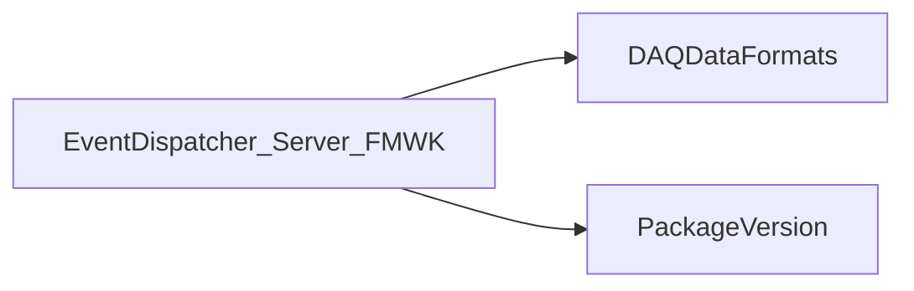

# EventDispatcher_Server_FMWK

Framework-integrated event-dispatch server variant.

## Identity and scope

Repository: [NovaDAQ/EventDispatcher_Server_FMWK](https://github.com/NovaDAQ/EventDispatcher_Server_FMWK) · Reviewed commit: `e4509ab9ca56cbe17eb6d1e14f9e4634574be626` · Domain: **Data path**.

Tracked files: **42**. Production deployment and owner are **unconfirmed**.

## Operation

Requires the corresponding analysis framework in addition to dispatcher and Qt dependencies. Distinguish this variant from the standalone server in launch configuration; validate event ownership and framework callbacks under load.

For prerequisites, safe start/stop sequencing, health checks, and rollback see the [operations guide](../operations/index.md).

## Build and integration

This package uses the SRT/SoftRelTools release context. A standalone `make` in a fresh checkout is not a supported build recipe unless the required context is already configured. See [build and release](../operations/build.md).

| Build definition |
| --- |
| [GNUmakefile](https://github.com/NovaDAQ/EventDispatcher_Server_FMWK/blob/e4509ab9ca56cbe17eb6d1e14f9e4634574be626/GNUmakefile) |
| [cxx/GNUmakefile](https://github.com/NovaDAQ/EventDispatcher_Server_FMWK/blob/e4509ab9ca56cbe17eb6d1e14f9e4634574be626/cxx/GNUmakefile) |
| [cxx/src/EventDispatcher.pro](https://github.com/NovaDAQ/EventDispatcher_Server_FMWK/blob/e4509ab9ca56cbe17eb6d1e14f9e4634574be626/cxx/src/EventDispatcher.pro) |
| [cxx/src/GNUmakefile](https://github.com/NovaDAQ/EventDispatcher_Server_FMWK/blob/e4509ab9ca56cbe17eb6d1e14f9e4634574be626/cxx/src/GNUmakefile) |
| [cxx/test/GNUmakefile](https://github.com/NovaDAQ/EventDispatcher_Server_FMWK/blob/e4509ab9ca56cbe17eb6d1e14f9e4634574be626/cxx/test/GNUmakefile) |
| [cxx/unittest/GNUmakefile](https://github.com/NovaDAQ/EventDispatcher_Server_FMWK/blob/e4509ab9ca56cbe17eb6d1e14f9e4634574be626/cxx/unittest/GNUmakefile) |
| [java/GNUmakefile](https://github.com/NovaDAQ/EventDispatcher_Server_FMWK/blob/e4509ab9ca56cbe17eb6d1e14f9e4634574be626/java/GNUmakefile) |
| [java/src/GNUmakefile](https://github.com/NovaDAQ/EventDispatcher_Server_FMWK/blob/e4509ab9ca56cbe17eb6d1e14f9e4634574be626/java/src/GNUmakefile) |
| [java/test/GNUmakefile](https://github.com/NovaDAQ/EventDispatcher_Server_FMWK/blob/e4509ab9ca56cbe17eb6d1e14f9e4634574be626/java/test/GNUmakefile) |
| [java/unittest/GNUmakefile](https://github.com/NovaDAQ/EventDispatcher_Server_FMWK/blob/e4509ab9ca56cbe17eb6d1e14f9e4634574be626/java/unittest/GNUmakefile) |

## Entry points

These are source entry points or operational scripts found statically. Installation names and enabled targets depend on the build/configuration; listing a script does not establish that it is deployed.

| Source |
| --- |
| [cxx/src/EventDispatcherFMWK.cc](https://github.com/NovaDAQ/EventDispatcher_Server_FMWK/blob/e4509ab9ca56cbe17eb6d1e14f9e4634574be626/cxx/src/EventDispatcherFMWK.cc) |

## Interfaces

Headers and declared types form the API navigation map. Follow the source for method signatures, ownership, units, and error contracts. Generated DDS/XSD types are built from the schemas in the next section.

| Header | Declared types |
| --- | --- |
| [cxx/src/AboutDialog.h](https://github.com/NovaDAQ/EventDispatcher_Server_FMWK/blob/e4509ab9ca56cbe17eb6d1e14f9e4634574be626/cxx/src/AboutDialog.h) | `AboutDialog` |
| [cxx/src/DataExamineThread.h](https://github.com/NovaDAQ/EventDispatcher_Server_FMWK/blob/e4509ab9ca56cbe17eb6d1e14f9e4634574be626/cxx/src/DataExamineThread.h) | `DataBufferList`, `DataExamineThread` |
| [cxx/src/DispatchServer.h](https://github.com/NovaDAQ/EventDispatcher_Server_FMWK/blob/e4509ab9ca56cbe17eb6d1e14f9e4634574be626/cxx/src/DispatchServer.h) | `DispatchServer` |
| [cxx/src/DispatchThread.h](https://github.com/NovaDAQ/EventDispatcher_Server_FMWK/blob/e4509ab9ca56cbe17eb6d1e14f9e4634574be626/cxx/src/DispatchThread.h) | `DispatchThread` |
| [cxx/src/GraphicalDispatcher.h](https://github.com/NovaDAQ/EventDispatcher_Server_FMWK/blob/e4509ab9ca56cbe17eb6d1e14f9e4634574be626/cxx/src/GraphicalDispatcher.h) | `GraphicalDispatcher`, `SHMSegment` |
| [cxx/src/MemorySettingsDialog.h](https://github.com/NovaDAQ/EventDispatcher_Server_FMWK/blob/e4509ab9ca56cbe17eb6d1e14f9e4634574be626/cxx/src/MemorySettingsDialog.h) | `MemorySettingsDialog` |
| [cxx/src/NetworkSettingsDialog.h](https://github.com/NovaDAQ/EventDispatcher_Server_FMWK/blob/e4509ab9ca56cbe17eb6d1e14f9e4634574be626/cxx/src/NetworkSettingsDialog.h) | `NetworkSettingsDialog` |
| [cxx/src/SHMSegment_Struct.h](https://github.com/NovaDAQ/EventDispatcher_Server_FMWK/blob/e4509ab9ca56cbe17eb6d1e14f9e4634574be626/cxx/src/SHMSegment_Struct.h) | `SHMSegment` |
| [cxx/src/SettingsDialog.h](https://github.com/NovaDAQ/EventDispatcher_Server_FMWK/blob/e4509ab9ca56cbe17eb6d1e14f9e4634574be626/cxx/src/SettingsDialog.h) | `SettingsDialog` |
| [cxx/src/cvstags.h](https://github.com/NovaDAQ/EventDispatcher_Server_FMWK/blob/e4509ab9ca56cbe17eb6d1e14f9e4634574be626/cxx/src/cvstags.h) | Functions, constants, or templates |
| [cxx/src/daemon_init.h](https://github.com/NovaDAQ/EventDispatcher_Server_FMWK/blob/e4509ab9ca56cbe17eb6d1e14f9e4634574be626/cxx/src/daemon_init.h) | Functions, constants, or templates |
| [cxx/src/version.h](https://github.com/NovaDAQ/EventDispatcher_Server_FMWK/blob/e4509ab9ca56cbe17eb6d1e14f9e4634574be626/cxx/src/version.h) | Functions, constants, or templates |

## Configuration and data contracts

No separate XML/IDL/XSD/FHiCL/INI/YAML/JSON configuration was identified. Inspect command-line parsing and site launchers for this package; defaults may be embedded in source.

## Environment and external dependencies

Environment names below are literal lookups found in source, not a guarantee that every value is mandatory. No environment values or credentials are copied into this documentation.

No literal environment lookup was identified by this scan; shell setup scripts may still provide required values.

Unresolved/non-package include roots (some are system or generated headers; this is not a package-manager lockfile):

| Include root | Evidence |
| --- | --- |
| `QtCore` | [cxx/src/DataExamineThread.h:4](https://github.com/NovaDAQ/EventDispatcher_Server_FMWK/blob/e4509ab9ca56cbe17eb6d1e14f9e4634574be626/cxx/src/DataExamineThread.h#L4) |
| `QtGui` | [cxx/src/AboutDialog.cpp:1](https://github.com/NovaDAQ/EventDispatcher_Server_FMWK/blob/e4509ab9ca56cbe17eb6d1e14f9e4634574be626/cxx/src/AboutDialog.cpp#L1) |
| `QtNetwork` | [cxx/src/DispatchServer.h:4](https://github.com/NovaDAQ/EventDispatcher_Server_FMWK/blob/e4509ab9ca56cbe17eb6d1e14f9e4634574be626/cxx/src/DispatchServer.h#L4) |
| `sys` | [cxx/src/DispatchServer.cpp:10](https://github.com/NovaDAQ/EventDispatcher_Server_FMWK/blob/e4509ab9ca56cbe17eb6d1e14f9e4634574be626/cxx/src/DispatchServer.cpp#L10) |

## Package dependencies

Arrow direction is **consumer → dependency**. This diagram includes source/build/runtime relationships and excludes test-only, release-membership, and build-tool edges. Conditional branches are not evaluated.

| Dependency | Relationship | Evidence |
| --- | --- | --- |
| [DAQDataFormats](DAQDataFormats.md) | build link | [cxx/src/EventDispatcher.pro:19](https://github.com/NovaDAQ/EventDispatcher_Server_FMWK/blob/e4509ab9ca56cbe17eb6d1e14f9e4634574be626/cxx/src/EventDispatcher.pro#L19) |
| [DAQDataFormats](DAQDataFormats.md) | source include | [cxx/src/DispatchThread.cpp:5](https://github.com/NovaDAQ/EventDispatcher_Server_FMWK/blob/e4509ab9ca56cbe17eb6d1e14f9e4634574be626/cxx/src/DispatchThread.cpp#L5) |
| [PackageVersion](PackageVersion.md) | build link | [cxx/src/GNUmakefile:39](https://github.com/NovaDAQ/EventDispatcher_Server_FMWK/blob/e4509ab9ca56cbe17eb6d1e14f9e4634574be626/cxx/src/GNUmakefile#L39) |
| [PackageVersion](PackageVersion.md) | source include | [cxx/src/version.h:28](https://github.com/NovaDAQ/EventDispatcher_Server_FMWK/blob/e4509ab9ca56cbe17eb6d1e14f9e4634574be626/cxx/src/version.h#L28) |
| [SRT_ONLINE](SRT_ONLINE.md) | build tool | [GNUmakefile:10](https://github.com/NovaDAQ/EventDispatcher_Server_FMWK/blob/e4509ab9ca56cbe17eb6d1e14f9e4634574be626/GNUmakefile#L10) |

Direct consumers: None resolved in this snapshot.

Explore upstream/downstream impact in the [dependency explorer](../architecture/explorer.md).

## Validation and review

Static analysis attempted **8 C/C++ translation units**, **0 shell scripts**, and parsed **0 Python files**. Counts are tool input coverage, not proof of successful compilation or exhaustive review. Source/build/configuration inventories and the operating surface were also assessed.

No actionable defect was confirmed for this package in this review. This is a bounded review result, not a clean bill of health; unvalidated analyzer diagnostics were not filed as bugs.

Existing test/example sources (not executed against production):

No test/example source identified in the scoped inventory.

## Existing documentation

| Source |
| --- |
| [cxx/src/README](https://github.com/NovaDAQ/EventDispatcher_Server_FMWK/blob/e4509ab9ca56cbe17eb6d1e14f9e4634574be626/cxx/src/README) |
