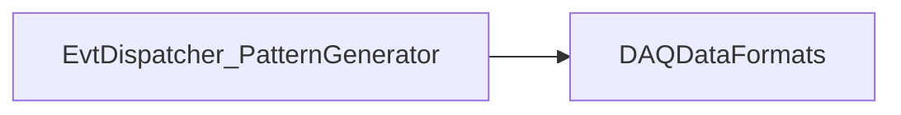

# EvtDispatcher_PatternGenerator

Qt/shared-memory pattern producer used to exercise dispatching.

## Identity and scope

Repository: [NovaDAQ/EvtDispatcher_PatternGenerator](https://github.com/NovaDAQ/EvtDispatcher_PatternGenerator) · Reviewed commit: `38c2c8853051b40138f0f1af99849324bae4d505` · Domain: **Simulation and examples**.

Tracked files: **21**. Production deployment and owner are **unconfirmed**.

## Operation

Write only to a dedicated test segment. Record pattern dimensions and rate and verify the expected sequence in the receiving viewer or dispatcher client.

For prerequisites, safe start/stop sequencing, health checks, and rollback see the [operations guide](../operations/index.md).

## Build and integration

| Build definition |
| --- |
| [Makefile](https://github.com/NovaDAQ/EvtDispatcher_PatternGenerator/blob/38c2c8853051b40138f0f1af99849324bae4d505/Makefile) |
| [PatternGenerator.pro](https://github.com/NovaDAQ/EvtDispatcher_PatternGenerator/blob/38c2c8853051b40138f0f1af99849324bae4d505/PatternGenerator.pro) |

## Entry points

These are source entry points or operational scripts found statically. Installation names and enabled targets depend on the build/configuration; listing a script does not establish that it is deployed.

| Source |
| --- |
| [main.cc](https://github.com/NovaDAQ/EvtDispatcher_PatternGenerator/blob/38c2c8853051b40138f0f1af99849324bae4d505/main.cc) |

## Interfaces

Headers and declared types form the API navigation map. Follow the source for method signatures, ownership, units, and error contracts. Generated DDS/XSD types are built from the schemas in the next section.

| Header | Declared types |
| --- | --- |
| [AboutDialog.h](https://github.com/NovaDAQ/EvtDispatcher_PatternGenerator/blob/38c2c8853051b40138f0f1af99849324bae4d505/AboutDialog.h) | `AboutDialog` |
| [DataSegment.h](https://github.com/NovaDAQ/EvtDispatcher_PatternGenerator/blob/38c2c8853051b40138f0f1af99849324bae4d505/DataSegment.h) | `nova_data`, `nova_data_header`, `nova_segment_header`, `segmentIdent` |
| [MemoryModel.h](https://github.com/NovaDAQ/EvtDispatcher_PatternGenerator/blob/38c2c8853051b40138f0f1af99849324bae4d505/MemoryModel.h) | `MemoryModel` |
| [PatternGenerator.h](https://github.com/NovaDAQ/EvtDispatcher_PatternGenerator/blob/38c2c8853051b40138f0f1af99849324bae4d505/PatternGenerator.h) | `PatternGenerator` |
| [daemon_init.h](https://github.com/NovaDAQ/EvtDispatcher_PatternGenerator/blob/38c2c8853051b40138f0f1af99849324bae4d505/daemon_init.h) | Functions, constants, or templates |
| [nova_datasegment.h](https://github.com/NovaDAQ/EvtDispatcher_PatternGenerator/blob/38c2c8853051b40138f0f1af99849324bae4d505/nova_datasegment.h) | `nova_data_header`, `nova_data_tail`, `nova_segment_header`, `segmentIdent` |
| [testpattern.h](https://github.com/NovaDAQ/EvtDispatcher_PatternGenerator/blob/38c2c8853051b40138f0f1af99849324bae4d505/testpattern.h) | Functions, constants, or templates |

## Configuration and data contracts

No separate XML/IDL/XSD/FHiCL/INI/YAML/JSON configuration was identified. Inspect command-line parsing and site launchers for this package; defaults may be embedded in source.

## Environment and external dependencies

Environment names below are literal lookups found in source, not a guarantee that every value is mandatory. No environment values or credentials are copied into this documentation.

No literal environment lookup was identified by this scan; shell setup scripts may still provide required values.

Unresolved/non-package include roots (some are system or generated headers; this is not a package-manager lockfile):

| Include root | Evidence |
| --- | --- |
| `sys` | [PatternGenerator.cpp:20](https://github.com/NovaDAQ/EvtDispatcher_PatternGenerator/blob/38c2c8853051b40138f0f1af99849324bae4d505/PatternGenerator.cpp#L20) |

## Package dependencies

Arrow direction is **consumer → dependency**. This diagram includes source/build/runtime relationships and excludes test-only, release-membership, and build-tool edges. Conditional branches are not evaluated.

| Dependency | Relationship | Evidence |
| --- | --- | --- |
| [DAQDataFormats](DAQDataFormats.md) | build link | [Makefile:19](https://github.com/NovaDAQ/EvtDispatcher_PatternGenerator/blob/38c2c8853051b40138f0f1af99849324bae4d505/Makefile#L19) |
| [DAQDataFormats](DAQDataFormats.md) | source include | [PatternGenerator.cpp:33](https://github.com/NovaDAQ/EvtDispatcher_PatternGenerator/blob/38c2c8853051b40138f0f1af99849324bae4d505/PatternGenerator.cpp#L33) |

Direct consumers: None resolved in this snapshot.

Explore upstream/downstream impact in the [dependency explorer](../architecture/explorer.md).

## Validation and review

Static analysis attempted **5 C/C++ translation units**, **0 shell scripts**, and parsed **0 Python files**. Counts are tool input coverage, not proof of successful compilation or exhaustive review. Source/build/configuration inventories and the operating surface were also assessed.

No actionable defect was confirmed for this package in this review. This is a bounded review result, not a clean bill of health; unvalidated analyzer diagnostics were not filed as bugs.

Existing test/example sources (not executed against production):

No test/example source identified in the scoped inventory.

## Existing documentation

No package README/manual identified in the scoped inventory. Use this page and the source interfaces above.
