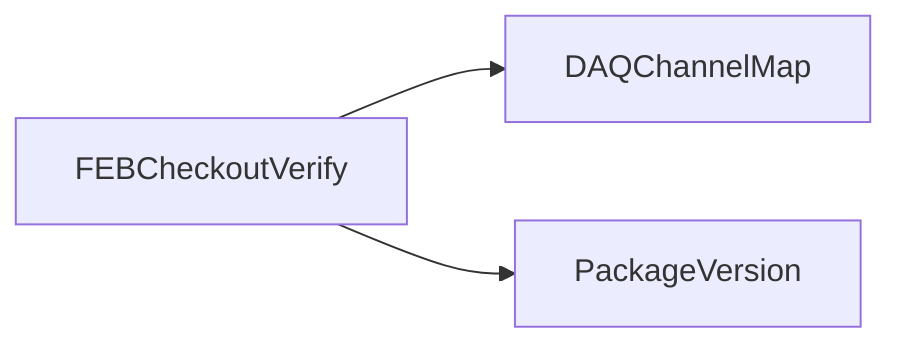

# FEBCheckoutVerify

FEB checkout verification and report tooling, including bundled Python imaging, XML, spreadsheet, and document libraries.

## Identity and scope

Repository: [NovaDAQ/FEBCheckoutVerify](https://github.com/NovaDAQ/FEBCheckoutVerify) · Reviewed commit: `b6b756e7d36f571faa5becb7941d949327ed40e5` · Domain: **Hardware**.

Tracked files: **1317**. Production deployment and owner are **unconfirmed**.

## Operation

Use known device measurements and reference limits, preserve input results, and verify report device identity. The bundled third-party trees are legacy dependencies; this review focused on NOvA entry points rather than a complete upstream-library audit.

For prerequisites, safe start/stop sequencing, health checks, and rollback see the [operations guide](../operations/index.md).

## Build and integration

This package uses the SRT/SoftRelTools release context. A standalone `make` in a fresh checkout is not a supported build recipe unless the required context is already configured. See [build and release](../operations/build.md).

| Build definition |
| --- |
| [GNUmakefile](https://github.com/NovaDAQ/FEBCheckoutVerify/blob/b6b756e7d36f571faa5becb7941d949327ed40e5/GNUmakefile) |
| [cxx/GNUmakefile](https://github.com/NovaDAQ/FEBCheckoutVerify/blob/b6b756e7d36f571faa5becb7941d949327ed40e5/cxx/GNUmakefile) |
| [cxx/src/GNUmakefile](https://github.com/NovaDAQ/FEBCheckoutVerify/blob/b6b756e7d36f571faa5becb7941d949327ed40e5/cxx/src/GNUmakefile) |
| [cxx/test/GNUmakefile](https://github.com/NovaDAQ/FEBCheckoutVerify/blob/b6b756e7d36f571faa5becb7941d949327ed40e5/cxx/test/GNUmakefile) |
| [cxx/unittest/GNUmakefile](https://github.com/NovaDAQ/FEBCheckoutVerify/blob/b6b756e7d36f571faa5becb7941d949327ed40e5/cxx/unittest/GNUmakefile) |
| [script/GNUmakefile](https://github.com/NovaDAQ/FEBCheckoutVerify/blob/b6b756e7d36f571faa5becb7941d949327ed40e5/script/GNUmakefile) |

## Entry points

These are source entry points or operational scripts found statically. Installation names and enabled targets depend on the build/configuration; listing a script does not establish that it is deployed.

| Source |
| --- |
| [cxx/src/convertdaqchannel.cc](https://github.com/NovaDAQ/FEBCheckoutVerify/blob/b6b756e7d36f571faa5becb7941d949327ed40e5/cxx/src/convertdaqchannel.cc) |

## Interfaces

Headers and declared types form the API navigation map. Follow the source for method signatures, ownership, units, and error contracts. Generated DDS/XSD types are built from the schemas in the next section.

| Header | Declared types |
| --- | --- |
| [cxx/include/DChannelConvert.h](https://github.com/NovaDAQ/FEBCheckoutVerify/blob/b6b756e7d36f571faa5becb7941d949327ed40e5/cxx/include/DChannelConvert.h) | `DChannelConvert` |
| [cxx/src/version.h](https://github.com/NovaDAQ/FEBCheckoutVerify/blob/b6b756e7d36f571faa5becb7941d949327ed40e5/cxx/src/version.h) | Functions, constants, or templates |

## Configuration and data contracts

No separate XML/IDL/XSD/FHiCL/INI/YAML/JSON configuration was identified. Inspect command-line parsing and site launchers for this package; defaults may be embedded in source.

## Environment and external dependencies

Environment names below are literal lookups found in source, not a guarantee that every value is mandatory. No environment values or credentials are copied into this documentation.

No literal environment lookup was identified by this scan; shell setup scripts may still provide required values.

## Package dependencies

Arrow direction is **consumer → dependency**. This diagram includes source/build/runtime relationships and excludes test-only, release-membership, and build-tool edges. Conditional branches are not evaluated.

| Dependency | Relationship | Evidence |
| --- | --- | --- |
| [DAQChannelMap](DAQChannelMap.md) | build link | [cxx/src/GNUmakefile:25](https://github.com/NovaDAQ/FEBCheckoutVerify/blob/b6b756e7d36f571faa5becb7941d949327ed40e5/cxx/src/GNUmakefile#L25) |
| [DAQChannelMap](DAQChannelMap.md) | source include | [cxx/include/DChannelConvert.h:4](https://github.com/NovaDAQ/FEBCheckoutVerify/blob/b6b756e7d36f571faa5becb7941d949327ed40e5/cxx/include/DChannelConvert.h#L4) |
| [PackageVersion](PackageVersion.md) | build link | [cxx/src/GNUmakefile:25](https://github.com/NovaDAQ/FEBCheckoutVerify/blob/b6b756e7d36f571faa5becb7941d949327ed40e5/cxx/src/GNUmakefile#L25) |
| [PackageVersion](PackageVersion.md) | source include | [cxx/src/version.h:28](https://github.com/NovaDAQ/FEBCheckoutVerify/blob/b6b756e7d36f571faa5becb7941d949327ed40e5/cxx/src/version.h#L28) |
| [SRT_ONLINE](SRT_ONLINE.md) | build tool | [GNUmakefile:10](https://github.com/NovaDAQ/FEBCheckoutVerify/blob/b6b756e7d36f571faa5becb7941d949327ed40e5/GNUmakefile#L10) |

Direct consumers: None resolved in this snapshot.

Explore upstream/downstream impact in the [dependency explorer](../architecture/explorer.md).

## Validation and review

Static analysis attempted **4 C/C++ translation units**, **0 shell scripts**, and parsed **36 Python files**. Counts are tool input coverage, not proof of successful compilation or exhaustive review. Source/build/configuration inventories and the operating surface were also assessed.

Large vendor/generated/firmware trees received a bounded integration review. The [methodology](../review/methodology.md) records exclusions. No complete third-party audit or hardware validation is claimed.

No actionable defect was confirmed for this package in this review. This is a bounded review result, not a clean bill of health; unvalidated analyzer diagnostics were not filed as bugs.

Existing test/example sources (not executed against production):

No test/example source identified in the scoped inventory.

## Existing documentation

No package README/manual identified in the scoped inventory. Use this page and the source interfaces above.
