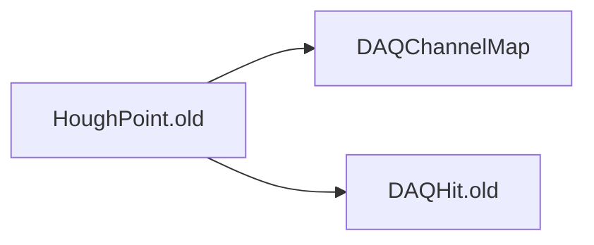

# HoughPoint.old

Legacy two-hit Hough-transform geometry representation.

## Identity and scope

Repository: [NovaDAQ/HoughPoint.old](https://github.com/NovaDAQ/HoughPoint.old) · Reviewed commit: `2b9784d0d5502fe53fe8c83218db613789272cdb` · Domain: **Analysis**.

Tracked files: **12**. Production deployment and owner are **unconfirmed**. The directory name marks a legacy variant; retirement has not been independently verified.

## Operation

Input hits must outlive the non-owning pointers in HoughPoint. Validate orientation, sign, and degenerate cases with analytic points before using the transform output. Confirm historical deployment before prioritizing this package.

For prerequisites, safe start/stop sequencing, health checks, and rollback see the [operations guide](../operations/index.md).

## Build and integration

This package uses the SRT/SoftRelTools release context. A standalone `make` in a fresh checkout is not a supported build recipe unless the required context is already configured. See [build and release](../operations/build.md).

| Build definition |
| --- |
| [GNUmakefile](https://github.com/NovaDAQ/HoughPoint.old/blob/2b9784d0d5502fe53fe8c83218db613789272cdb/GNUmakefile) |
| [cxx/GNUmakefile](https://github.com/NovaDAQ/HoughPoint.old/blob/2b9784d0d5502fe53fe8c83218db613789272cdb/cxx/GNUmakefile) |
| [cxx/src/GNUmakefile](https://github.com/NovaDAQ/HoughPoint.old/blob/2b9784d0d5502fe53fe8c83218db613789272cdb/cxx/src/GNUmakefile) |
| [cxx/test/GNUmakefile](https://github.com/NovaDAQ/HoughPoint.old/blob/2b9784d0d5502fe53fe8c83218db613789272cdb/cxx/test/GNUmakefile) |
| [cxx/unittest/GNUmakefile](https://github.com/NovaDAQ/HoughPoint.old/blob/2b9784d0d5502fe53fe8c83218db613789272cdb/cxx/unittest/GNUmakefile) |
| [java/GNUmakefile](https://github.com/NovaDAQ/HoughPoint.old/blob/2b9784d0d5502fe53fe8c83218db613789272cdb/java/GNUmakefile) |
| [java/src/GNUmakefile](https://github.com/NovaDAQ/HoughPoint.old/blob/2b9784d0d5502fe53fe8c83218db613789272cdb/java/src/GNUmakefile) |
| [java/test/GNUmakefile](https://github.com/NovaDAQ/HoughPoint.old/blob/2b9784d0d5502fe53fe8c83218db613789272cdb/java/test/GNUmakefile) |
| [java/unittest/GNUmakefile](https://github.com/NovaDAQ/HoughPoint.old/blob/2b9784d0d5502fe53fe8c83218db613789272cdb/java/unittest/GNUmakefile) |

## Entry points

These are source entry points or operational scripts found statically. Installation names and enabled targets depend on the build/configuration; listing a script does not establish that it is deployed.

No standalone executable entry point was identified; this package may provide libraries, contracts, configuration, or binary artifacts.

## Interfaces

Headers and declared types form the API navigation map. Follow the source for method signatures, ownership, units, and error contracts. Generated DDS/XSD types are built from the schemas in the next section.

| Header | Declared types |
| --- | --- |
| [cxx/include/HoughPoint.h](https://github.com/NovaDAQ/HoughPoint.old/blob/2b9784d0d5502fe53fe8c83218db613789272cdb/cxx/include/HoughPoint.h) | `DAQHit`, `HoughPoint`, `OnlineAna` |

## Configuration and data contracts

No separate XML/IDL/XSD/FHiCL/INI/YAML/JSON configuration was identified. Inspect command-line parsing and site launchers for this package; defaults may be embedded in source.

## Environment and external dependencies

Environment names below are literal lookups found in source, not a guarantee that every value is mandatory. No environment values or credentials are copied into this documentation.

No literal environment lookup was identified by this scan; shell setup scripts may still provide required values.

## Package dependencies

Arrow direction is **consumer → dependency**. This diagram includes source/build/runtime relationships and excludes test-only, release-membership, and build-tool edges. Conditional branches are not evaluated.

| Dependency | Relationship | Evidence |
| --- | --- | --- |
| [DAQChannelMap](DAQChannelMap.md) | build link | [cxx/src/GNUmakefile:31](https://github.com/NovaDAQ/HoughPoint.old/blob/2b9784d0d5502fe53fe8c83218db613789272cdb/cxx/src/GNUmakefile#L31) |
| [DAQHit.old](DAQHit.old.md) | build link | [cxx/src/GNUmakefile:31](https://github.com/NovaDAQ/HoughPoint.old/blob/2b9784d0d5502fe53fe8c83218db613789272cdb/cxx/src/GNUmakefile#L31) |
| [DAQHit.old](DAQHit.old.md) | source include | [cxx/src/HoughPoint.cpp:2](https://github.com/NovaDAQ/HoughPoint.old/blob/2b9784d0d5502fe53fe8c83218db613789272cdb/cxx/src/HoughPoint.cpp#L2) |
| [SRT_ONLINE](SRT_ONLINE.md) | build tool | [GNUmakefile:10](https://github.com/NovaDAQ/HoughPoint.old/blob/2b9784d0d5502fe53fe8c83218db613789272cdb/GNUmakefile#L10) |

Direct consumers: None resolved in this snapshot.

Explore upstream/downstream impact in the [dependency explorer](../architecture/explorer.md).

## Validation and review

Static analysis attempted **1 C/C++ translation units**, **0 shell scripts**, and parsed **0 Python files**. Counts are tool input coverage, not proof of successful compilation or exhaustive review. Source/build/configuration inventories and the operating surface were also assessed.

| Severity | Finding | GitHub |
| --- | --- | --- |
| P2 | [NDAQ-031: Use signed arithmetic for Hough coordinate differences](../review/issues/NDAQ-031.md) | [Issue](https://github.com/NovaDAQ/HoughPoint.old/issues/1) |

Existing test/example sources (not executed against production):

No test/example source identified in the scoped inventory.

## Existing documentation

No package README/manual identified in the scoped inventory. Use this page and the source interfaces above.
