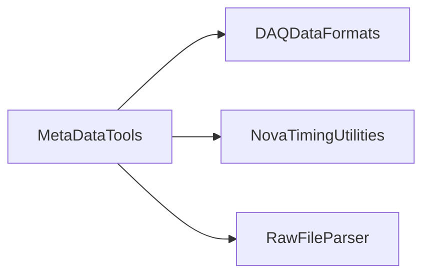

# MetaDataTools

Extracts run-level metadata and validates header information from raw DAQ files.

## Identity and scope

Repository: [NovaDAQ/MetaDataTools](https://github.com/NovaDAQ/MetaDataTools) · Reviewed commit: `3693eca92edd78c9c7fd55975fbdbddd9766b30e` · Domain: **Storage and metadata**.

Tracked files: **27**. Production deployment and owner are **unconfirmed**.

## Operation

Compare generated detector/DCM/buffer-node lists and event counts to known inputs before catalog registration. Invalid raw input or metadata must not be silently promoted into the transfer catalog.

For prerequisites, safe start/stop sequencing, health checks, and rollback see the [operations guide](../operations/index.md).

## Build and integration

This package uses the SRT/SoftRelTools release context. A standalone `make` in a fresh checkout is not a supported build recipe unless the required context is already configured. See [build and release](../operations/build.md).

| Build definition |
| --- |
| [GNUmakefile](https://github.com/NovaDAQ/MetaDataTools/blob/3693eca92edd78c9c7fd55975fbdbddd9766b30e/GNUmakefile) |
| [cxx/GNUmakefile](https://github.com/NovaDAQ/MetaDataTools/blob/3693eca92edd78c9c7fd55975fbdbddd9766b30e/cxx/GNUmakefile) |
| [cxx/src/GNUmakefile](https://github.com/NovaDAQ/MetaDataTools/blob/3693eca92edd78c9c7fd55975fbdbddd9766b30e/cxx/src/GNUmakefile) |
| [cxx/test/GNUmakefile](https://github.com/NovaDAQ/MetaDataTools/blob/3693eca92edd78c9c7fd55975fbdbddd9766b30e/cxx/test/GNUmakefile) |
| [cxx/unittest/GNUmakefile](https://github.com/NovaDAQ/MetaDataTools/blob/3693eca92edd78c9c7fd55975fbdbddd9766b30e/cxx/unittest/GNUmakefile) |
| [java/GNUmakefile](https://github.com/NovaDAQ/MetaDataTools/blob/3693eca92edd78c9c7fd55975fbdbddd9766b30e/java/GNUmakefile) |
| [java/src/GNUmakefile](https://github.com/NovaDAQ/MetaDataTools/blob/3693eca92edd78c9c7fd55975fbdbddd9766b30e/java/src/GNUmakefile) |
| [java/test/GNUmakefile](https://github.com/NovaDAQ/MetaDataTools/blob/3693eca92edd78c9c7fd55975fbdbddd9766b30e/java/test/GNUmakefile) |
| [java/unittest/GNUmakefile](https://github.com/NovaDAQ/MetaDataTools/blob/3693eca92edd78c9c7fd55975fbdbddd9766b30e/java/unittest/GNUmakefile) |

## Entry points

These are source entry points or operational scripts found statically. Installation names and enabled targets depend on the build/configuration; listing a script does not establish that it is deployed.

| Source |
| --- |
| [cxx/src/MetaDataRunTool.cc](https://github.com/NovaDAQ/MetaDataTools/blob/3693eca92edd78c9c7fd55975fbdbddd9766b30e/cxx/src/MetaDataRunTool.cc) |

## Interfaces

Headers and declared types form the API navigation map. Follow the source for method signatures, ownership, units, and error contracts. Generated DDS/XSD types are built from the schemas in the next section.

| Header | Declared types |
| --- | --- |
| [cxx/include/MetaDataRecord.h](https://github.com/NovaDAQ/MetaDataTools/blob/3693eca92edd78c9c7fd55975fbdbddd9766b30e/cxx/include/MetaDataRecord.h) | `MetaDataRecord` |
| [cxx/src/CheckRunHeader.h](https://github.com/NovaDAQ/MetaDataTools/blob/3693eca92edd78c9c7fd55975fbdbddd9766b30e/cxx/src/CheckRunHeader.h) | `CheckRunHeader` |
| [cxx/src/MetaDataRecord.h](https://github.com/NovaDAQ/MetaDataTools/blob/3693eca92edd78c9c7fd55975fbdbddd9766b30e/cxx/src/MetaDataRecord.h) | `MetaDataRecord` |

## Configuration and data contracts

No separate XML/IDL/XSD/FHiCL/INI/YAML/JSON configuration was identified. Inspect command-line parsing and site launchers for this package; defaults may be embedded in source.

## Environment and external dependencies

Environment names below are literal lookups found in source, not a guarantee that every value is mandatory. No environment values or credentials are copied into this documentation.

No literal environment lookup was identified by this scan; shell setup scripts may still provide required values.

Unresolved/non-package include roots (some are system or generated headers; this is not a package-manager lockfile):

| Include root | Evidence |
| --- | --- |
| `sys` | [cxx/include/MetaDataRecord.h:4](https://github.com/NovaDAQ/MetaDataTools/blob/3693eca92edd78c9c7fd55975fbdbddd9766b30e/cxx/include/MetaDataRecord.h#L4) |

## Package dependencies

Arrow direction is **consumer → dependency**. This diagram includes source/build/runtime relationships and excludes test-only, release-membership, and build-tool edges. Conditional branches are not evaluated.

| Dependency | Relationship | Evidence |
| --- | --- | --- |
| [DAQDataFormats](DAQDataFormats.md) | build link | [cxx/src/GNUmakefile:17](https://github.com/NovaDAQ/MetaDataTools/blob/3693eca92edd78c9c7fd55975fbdbddd9766b30e/cxx/src/GNUmakefile#L17) |
| [DAQDataFormats](DAQDataFormats.md) | source include | [cxx/src/MetaDataRunTool.cc:19](https://github.com/NovaDAQ/MetaDataTools/blob/3693eca92edd78c9c7fd55975fbdbddd9766b30e/cxx/src/MetaDataRunTool.cc#L19) |
| [NovaTimingUtilities](NovaTimingUtilities.md) | build link | [cxx/src/GNUmakefile:17](https://github.com/NovaDAQ/MetaDataTools/blob/3693eca92edd78c9c7fd55975fbdbddd9766b30e/cxx/src/GNUmakefile#L17) |
| [NovaTimingUtilities](NovaTimingUtilities.md) | source include | [cxx/src/MetaDataRunTool.cc:39](https://github.com/NovaDAQ/MetaDataTools/blob/3693eca92edd78c9c7fd55975fbdbddd9766b30e/cxx/src/MetaDataRunTool.cc#L39) |
| [RawFileParser](RawFileParser.md) | build link | [cxx/src/GNUmakefile:17](https://github.com/NovaDAQ/MetaDataTools/blob/3693eca92edd78c9c7fd55975fbdbddd9766b30e/cxx/src/GNUmakefile#L17) |
| [RawFileParser](RawFileParser.md) | source include | [cxx/src/MetaDataRunTool.cc:32](https://github.com/NovaDAQ/MetaDataTools/blob/3693eca92edd78c9c7fd55975fbdbddd9766b30e/cxx/src/MetaDataRunTool.cc#L32) |
| [SRT_ONLINE](SRT_ONLINE.md) | build tool | [GNUmakefile:10](https://github.com/NovaDAQ/MetaDataTools/blob/3693eca92edd78c9c7fd55975fbdbddd9766b30e/GNUmakefile#L10) |

Direct consumers: None resolved in this snapshot.

Explore upstream/downstream impact in the [dependency explorer](../architecture/explorer.md).

## Validation and review

Static analysis attempted **13 C/C++ translation units**, **0 shell scripts**, and parsed **0 Python files**. Counts are tool input coverage, not proof of successful compilation or exhaustive review. Source/build/configuration inventories and the operating surface were also assessed.

| Severity | Finding | GitHub |
| --- | --- | --- |
| P1 | [NDAQ-008: Bound buffer-node metadata traversal to the allocated counter array](../review/issues/NDAQ-008.md) | [Issue](https://github.com/NovaDAQ/MetaDataTools/issues/1) |
| P2 | [NDAQ-009: Retain every active DCM in generated metadata](../review/issues/NDAQ-009.md) | [Issue](https://github.com/NovaDAQ/MetaDataTools/issues/2) |

Existing test/example sources (not executed against production):

No test/example source identified in the scoped inventory.

## Existing documentation

No package README/manual identified in the scoped inventory. Use this page and the source interfaces above.
