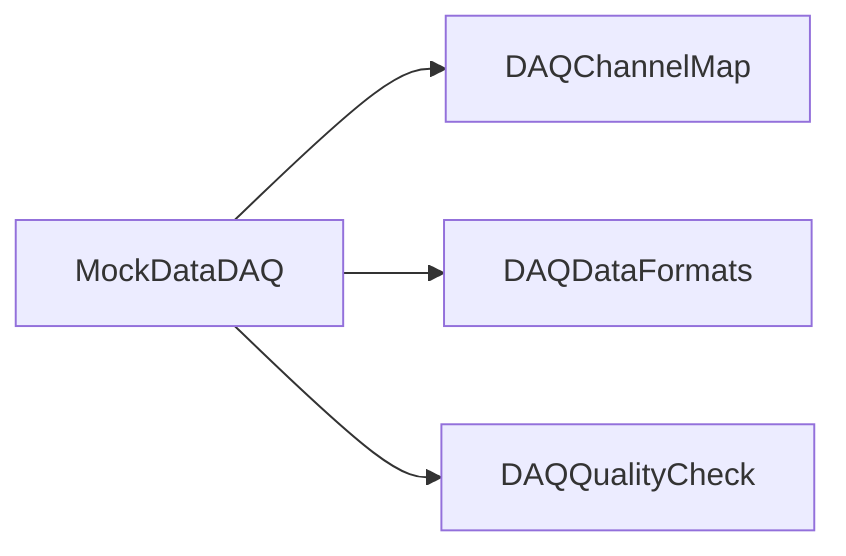

# MockDataDAQ

Framework modules for simulated detector data, channel-map additions, and synthetic event timing.

## Identity and scope

Repository: [NovaDAQ/MockDataDAQ](https://github.com/NovaDAQ/MockDataDAQ) · Reviewed commit: `d39ffca2fbc2b00b5ce1e7aacb9e9e7f1f37e9c7` · Domain: **Simulation and examples**.

Tracked files: **27**. Production deployment and owner are **unconfirmed**.

## Operation

Build with the matching framework and data formats. Fix seed/timing settings for repeatable tests and keep generated files labeled as simulation.

For prerequisites, safe start/stop sequencing, health checks, and rollback see the [operations guide](../operations/index.md).

## Build and integration

This package uses the SRT/SoftRelTools release context. A standalone `make` in a fresh checkout is not a supported build recipe unless the required context is already configured. See [build and release](../operations/build.md).

| Build definition |
| --- |
| [GNUmakefile](https://github.com/NovaDAQ/MockDataDAQ/blob/d39ffca2fbc2b00b5ce1e7aacb9e9e7f1f37e9c7/GNUmakefile) |
| [cxx/GNUmakefile](https://github.com/NovaDAQ/MockDataDAQ/blob/d39ffca2fbc2b00b5ce1e7aacb9e9e7f1f37e9c7/cxx/GNUmakefile) |
| [cxx/src/GNUmakefile](https://github.com/NovaDAQ/MockDataDAQ/blob/d39ffca2fbc2b00b5ce1e7aacb9e9e7f1f37e9c7/cxx/src/GNUmakefile) |
| [cxx/test/GNUmakefile](https://github.com/NovaDAQ/MockDataDAQ/blob/d39ffca2fbc2b00b5ce1e7aacb9e9e7f1f37e9c7/cxx/test/GNUmakefile) |
| [cxx/unittest/GNUmakefile](https://github.com/NovaDAQ/MockDataDAQ/blob/d39ffca2fbc2b00b5ce1e7aacb9e9e7f1f37e9c7/cxx/unittest/GNUmakefile) |
| [cxx/xml/GNUmakefile](https://github.com/NovaDAQ/MockDataDAQ/blob/d39ffca2fbc2b00b5ce1e7aacb9e9e7f1f37e9c7/cxx/xml/GNUmakefile) |
| [java/GNUmakefile](https://github.com/NovaDAQ/MockDataDAQ/blob/d39ffca2fbc2b00b5ce1e7aacb9e9e7f1f37e9c7/java/GNUmakefile) |
| [java/src/GNUmakefile](https://github.com/NovaDAQ/MockDataDAQ/blob/d39ffca2fbc2b00b5ce1e7aacb9e9e7f1f37e9c7/java/src/GNUmakefile) |
| [java/test/GNUmakefile](https://github.com/NovaDAQ/MockDataDAQ/blob/d39ffca2fbc2b00b5ce1e7aacb9e9e7f1f37e9c7/java/test/GNUmakefile) |
| [java/unittest/GNUmakefile](https://github.com/NovaDAQ/MockDataDAQ/blob/d39ffca2fbc2b00b5ce1e7aacb9e9e7f1f37e9c7/java/unittest/GNUmakefile) |

## Entry points

These are source entry points or operational scripts found statically. Installation names and enabled targets depend on the build/configuration; listing a script does not establish that it is deployed.

No standalone executable entry point was identified; this package may provide libraries, contracts, configuration, or binary artifacts.

## Interfaces

Headers and declared types form the API navigation map. Follow the source for method signatures, ownership, units, and error contracts. Generated DDS/XSD types are built from the schemas in the next section.

| Header | Declared types |
| --- | --- |
| [cxx/include/CMapAdd.h](https://github.com/NovaDAQ/MockDataDAQ/blob/d39ffca2fbc2b00b5ce1e7aacb9e9e7f1f37e9c7/cxx/include/CMapAdd.h) | `CMapAdd` |
| [cxx/include/DCMSimulatorAna.h](https://github.com/NovaDAQ/MockDataDAQ/blob/d39ffca2fbc2b00b5ce1e7aacb9e9e7f1f37e9c7/cxx/include/DCMSimulatorAna.h) | `DCMSimulatorAna`, `TH1F`, `TH2F` |
| [cxx/include/GlobalEventTime.h](https://github.com/NovaDAQ/MockDataDAQ/blob/d39ffca2fbc2b00b5ce1e7aacb9e9e7f1f37e9c7/cxx/include/GlobalEventTime.h) | `GlobalEventTime` |

## Configuration and data contracts

| Source artifact |
| --- |
| [cxx/xml/bufsimulator.xml](https://github.com/NovaDAQ/MockDataDAQ/blob/d39ffca2fbc2b00b5ce1e7aacb9e9e7f1f37e9c7/cxx/xml/bufsimulator.xml) |
| [cxx/xml/dcmsimulator.xml](https://github.com/NovaDAQ/MockDataDAQ/blob/d39ffca2fbc2b00b5ce1e7aacb9e9e7f1f37e9c7/cxx/xml/dcmsimulator.xml) |
| [cxx/xml/dcmsimulator_cosmics.xml](https://github.com/NovaDAQ/MockDataDAQ/blob/d39ffca2fbc2b00b5ce1e7aacb9e9e7f1f37e9c7/cxx/xml/dcmsimulator_cosmics.xml) |
| [cxx/xml/simoutputfile.xml](https://github.com/NovaDAQ/MockDataDAQ/blob/d39ffca2fbc2b00b5ce1e7aacb9e9e7f1f37e9c7/cxx/xml/simoutputfile.xml) |
| [cxx/xml/simulator.xml](https://github.com/NovaDAQ/MockDataDAQ/blob/d39ffca2fbc2b00b5ce1e7aacb9e9e7f1f37e9c7/cxx/xml/simulator.xml) |

## Environment and external dependencies

Environment names below are literal lookups found in source, not a guarantee that every value is mandatory. No environment values or credentials are copied into this documentation.

No literal environment lookup was identified by this scan; shell setup scripts may still provide required values.

Unresolved/non-package include roots (some are system or generated headers; this is not a package-manager lockfile):

| Include root | Evidence |
| --- | --- |
| `Config` | [cxx/src/DCMSimulatorAna.cxx:11](https://github.com/NovaDAQ/MockDataDAQ/blob/d39ffca2fbc2b00b5ce1e7aacb9e9e7f1f37e9c7/cxx/src/DCMSimulatorAna.cxx#L11) |
| `Database` | [cxx/include/CMapAdd.h:16](https://github.com/NovaDAQ/MockDataDAQ/blob/d39ffca2fbc2b00b5ce1e7aacb9e9e7f1f37e9c7/cxx/include/CMapAdd.h#L16) |
| `EventDataModel` | [cxx/src/DCMSimulatorAna.cxx:13](https://github.com/NovaDAQ/MockDataDAQ/blob/d39ffca2fbc2b00b5ce1e7aacb9e9e7f1f37e9c7/cxx/src/DCMSimulatorAna.cxx#L13) |
| `JobControl` | [cxx/include/DCMSimulatorAna.h:19](https://github.com/NovaDAQ/MockDataDAQ/blob/d39ffca2fbc2b00b5ce1e7aacb9e9e7f1f37e9c7/cxx/include/DCMSimulatorAna.h#L19) |
| `RawData` | [cxx/include/CMapAdd.h:17](https://github.com/NovaDAQ/MockDataDAQ/blob/d39ffca2fbc2b00b5ce1e7aacb9e9e7f1f37e9c7/cxx/include/CMapAdd.h#L17) |
| `Utilities` | [cxx/src/DCMSimulatorAna.cxx:19](https://github.com/NovaDAQ/MockDataDAQ/blob/d39ffca2fbc2b00b5ce1e7aacb9e9e7f1f37e9c7/cxx/src/DCMSimulatorAna.cxx#L19) |

## Package dependencies

Arrow direction is **consumer → dependency**. This diagram includes source/build/runtime relationships and excludes test-only, release-membership, and build-tool edges. Conditional branches are not evaluated.

| Dependency | Relationship | Evidence |
| --- | --- | --- |
| [DAQChannelMap](DAQChannelMap.md) | source include | [cxx/include/DCMSimulatorAna.h:31](https://github.com/NovaDAQ/MockDataDAQ/blob/d39ffca2fbc2b00b5ce1e7aacb9e9e7f1f37e9c7/cxx/include/DCMSimulatorAna.h#L31) |
| [DAQDataFormats](DAQDataFormats.md) | source include | [cxx/include/DCMSimulatorAna.h:20](https://github.com/NovaDAQ/MockDataDAQ/blob/d39ffca2fbc2b00b5ce1e7aacb9e9e7f1f37e9c7/cxx/include/DCMSimulatorAna.h#L20) |
| [DAQDataFormats](DAQDataFormats.md) | test link | [cxx/test/GNUmakefile:24](https://github.com/NovaDAQ/MockDataDAQ/blob/d39ffca2fbc2b00b5ce1e7aacb9e9e7f1f37e9c7/cxx/test/GNUmakefile#L24) |
| [DAQQualityCheck](DAQQualityCheck.md) | source include | [cxx/include/DCMSimulatorAna.h:27](https://github.com/NovaDAQ/MockDataDAQ/blob/d39ffca2fbc2b00b5ce1e7aacb9e9e7f1f37e9c7/cxx/include/DCMSimulatorAna.h#L27) |
| [SRT_ONLINE](SRT_ONLINE.md) | build tool | [GNUmakefile:21](https://github.com/NovaDAQ/MockDataDAQ/blob/d39ffca2fbc2b00b5ce1e7aacb9e9e7f1f37e9c7/GNUmakefile#L21) |

Direct consumers: None resolved in this snapshot.

Explore upstream/downstream impact in the [dependency explorer](../architecture/explorer.md).

## Validation and review

Static analysis attempted **3 C/C++ translation units**, **0 shell scripts**, and parsed **0 Python files**. Counts are tool input coverage, not proof of successful compilation or exhaustive review. Source/build/configuration inventories and the operating surface were also assessed.

No actionable defect was confirmed for this package in this review. This is a bounded review result, not a clean bill of health; unvalidated analyzer diagnostics were not filed as bugs.

Existing test/example sources (not executed against production):

No test/example source identified in the scoped inventory.

## Existing documentation

| Source |
| --- |
| [README.TXT](https://github.com/NovaDAQ/MockDataDAQ/blob/d39ffca2fbc2b00b5ce1e7aacb9e9e7f1f37e9c7/README.TXT) |
| [cxx/README.TXT](https://github.com/NovaDAQ/MockDataDAQ/blob/d39ffca2fbc2b00b5ce1e7aacb9e9e7f1f37e9c7/cxx/README.TXT) |
| [cxx/include/README.TXT](https://github.com/NovaDAQ/MockDataDAQ/blob/d39ffca2fbc2b00b5ce1e7aacb9e9e7f1f37e9c7/cxx/include/README.TXT) |
| [cxx/src/README.TXT](https://github.com/NovaDAQ/MockDataDAQ/blob/d39ffca2fbc2b00b5ce1e7aacb9e9e7f1f37e9c7/cxx/src/README.TXT) |
