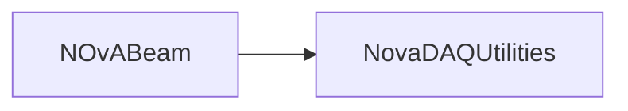

# NOvABeam

Beam bundle parsing and retrieval helpers, including XML and curl examples.

## Identity and scope

Repository: [NovaDAQ/NOvABeam](https://github.com/NovaDAQ/NOvABeam) · Reviewed commit: `e6c5917a3265e2d85b0b08945daa0a309ccca334` · Domain: **Timing and triggers**.

Tracked files: **18**. Production deployment and owner are **unconfirmed**.

## Operation

Check source availability, timestamps, and units before consuming beam data. Retain raw responses when diagnosing parsing failures; a successful HTTP exchange does not establish a valid beam record.

For prerequisites, safe start/stop sequencing, health checks, and rollback see the [operations guide](../operations/index.md).

## Build and integration

This package uses the SRT/SoftRelTools release context. A standalone `make` in a fresh checkout is not a supported build recipe unless the required context is already configured. See [build and release](../operations/build.md).

| Build definition |
| --- |
| [GNUmakefile](https://github.com/NovaDAQ/NOvABeam/blob/e6c5917a3265e2d85b0b08945daa0a309ccca334/GNUmakefile) |
| [cxx/GNUmakefile](https://github.com/NovaDAQ/NOvABeam/blob/e6c5917a3265e2d85b0b08945daa0a309ccca334/cxx/GNUmakefile) |
| [cxx/src/GNUmakefile](https://github.com/NovaDAQ/NOvABeam/blob/e6c5917a3265e2d85b0b08945daa0a309ccca334/cxx/src/GNUmakefile) |
| [cxx/test/GNUmakefile](https://github.com/NovaDAQ/NOvABeam/blob/e6c5917a3265e2d85b0b08945daa0a309ccca334/cxx/test/GNUmakefile) |
| [cxx/unittest/GNUmakefile](https://github.com/NovaDAQ/NOvABeam/blob/e6c5917a3265e2d85b0b08945daa0a309ccca334/cxx/unittest/GNUmakefile) |

## Entry points

These are source entry points or operational scripts found statically. Installation names and enabled targets depend on the build/configuration; listing a script does not establish that it is deployed.

| Source |
| --- |
| [cxx/src/curlexample.cc](https://github.com/NovaDAQ/NOvABeam/blob/e6c5917a3265e2d85b0b08945daa0a309ccca334/cxx/src/curlexample.cc) |

## Interfaces

Headers and declared types form the API navigation map. Follow the source for method signatures, ownership, units, and error contracts. Generated DDS/XSD types are built from the schemas in the next section.

| Header | Declared types |
| --- | --- |
| [cxx/include/Bundle.h](https://github.com/NovaDAQ/NOvABeam/blob/e6c5917a3265e2d85b0b08945daa0a309ccca334/cxx/include/Bundle.h) | `Bundle` |
| [cxx/include/BundleParser.h](https://github.com/NovaDAQ/NOvABeam/blob/e6c5917a3265e2d85b0b08945daa0a309ccca334/cxx/include/BundleParser.h) | `BundleParser` |
| [cxx/include/BundleVariable.h](https://github.com/NovaDAQ/NOvABeam/blob/e6c5917a3265e2d85b0b08945daa0a309ccca334/cxx/include/BundleVariable.h) | `BundleVariable` |
| [cxx/include/beamxmlparser.h](https://github.com/NovaDAQ/NOvABeam/blob/e6c5917a3265e2d85b0b08945daa0a309ccca334/cxx/include/beamxmlparser.h) | `BeamXMLParser`, `DeviceEntry`, `DeviceEntryArray` |

## Configuration and data contracts

| Source artifact |
| --- |
| [config/Bundle.xml](https://github.com/NovaDAQ/NOvABeam/blob/e6c5917a3265e2d85b0b08945daa0a309ccca334/config/Bundle.xml) |
| [config/BundleConfig.xsd](https://github.com/NovaDAQ/NOvABeam/blob/e6c5917a3265e2d85b0b08945daa0a309ccca334/config/BundleConfig.xsd) |

## Environment and external dependencies

Environment names below are literal lookups found in source, not a guarantee that every value is mandatory. No environment values or credentials are copied into this documentation.

No literal environment lookup was identified by this scan; shell setup scripts may still provide required values.

Unresolved/non-package include roots (some are system or generated headers; this is not a package-manager lockfile):

| Include root | Evidence |
| --- | --- |
| `QtXml` | [cxx/include/beamxmlparser.h:14](https://github.com/NovaDAQ/NOvABeam/blob/e6c5917a3265e2d85b0b08945daa0a309ccca334/cxx/include/beamxmlparser.h#L14) |
| `boost` | [cxx/src/BundleParser.cpp:13](https://github.com/NovaDAQ/NOvABeam/blob/e6c5917a3265e2d85b0b08945daa0a309ccca334/cxx/src/BundleParser.cpp#L13) |
| `curl` | [cxx/src/curlexample.cc:12](https://github.com/NovaDAQ/NOvABeam/blob/e6c5917a3265e2d85b0b08945daa0a309ccca334/cxx/src/curlexample.cc#L12) |
| `sys` | [cxx/src/curlexample.cc:1](https://github.com/NovaDAQ/NOvABeam/blob/e6c5917a3265e2d85b0b08945daa0a309ccca334/cxx/src/curlexample.cc#L1) |

## Package dependencies

Arrow direction is **consumer → dependency**. This diagram includes source/build/runtime relationships and excludes test-only, release-membership, and build-tool edges. Conditional branches are not evaluated.

| Dependency | Relationship | Evidence |
| --- | --- | --- |
| [NovaDAQUtilities](NovaDAQUtilities.md) | build link | [cxx/src/GNUmakefile:30](https://github.com/NovaDAQ/NOvABeam/blob/e6c5917a3265e2d85b0b08945daa0a309ccca334/cxx/src/GNUmakefile#L30) |
| [NovaDAQUtilities](NovaDAQUtilities.md) | source include | [cxx/src/BundleParser.cpp:15](https://github.com/NovaDAQ/NOvABeam/blob/e6c5917a3265e2d85b0b08945daa0a309ccca334/cxx/src/BundleParser.cpp#L15) |
| [SRT_ONLINE](SRT_ONLINE.md) | build tool | [GNUmakefile:10](https://github.com/NovaDAQ/NOvABeam/blob/e6c5917a3265e2d85b0b08945daa0a309ccca334/GNUmakefile#L10) |

Direct consumers: None resolved in this snapshot.

Explore upstream/downstream impact in the [dependency explorer](../architecture/explorer.md).

## Validation and review

Static analysis attempted **6 C/C++ translation units**, **0 shell scripts**, and parsed **0 Python files**. Counts are tool input coverage, not proof of successful compilation or exhaustive review. Source/build/configuration inventories and the operating surface were also assessed.

No actionable defect was confirmed for this package in this review. This is a bounded review result, not a clean bill of health; unvalidated analyzer diagnostics were not filed as bugs.

Existing test/example sources (not executed against production):

| Source |
| --- |
| [cxx/test/BundleConfig_test.cc](https://github.com/NovaDAQ/NOvABeam/blob/e6c5917a3265e2d85b0b08945daa0a309ccca334/cxx/test/BundleConfig_test.cc) |

## Existing documentation

No package README/manual identified in the scoped inventory. Use this page and the source interfaces above.
