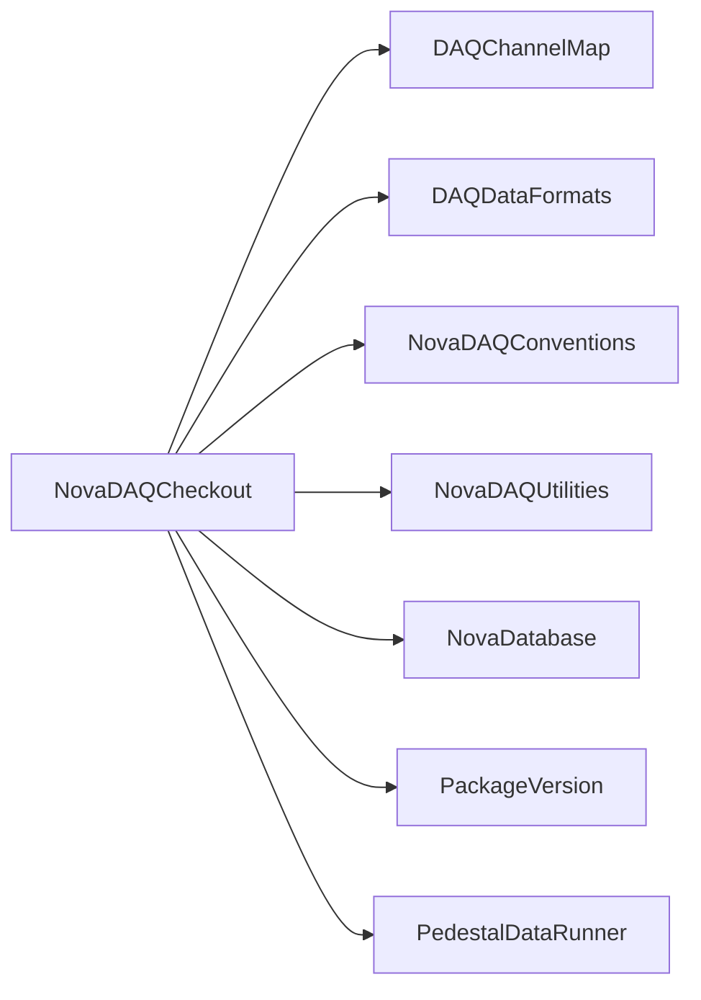

# NovaDAQCheckout

DAQ hardware checkout orchestration and GUI for DCM, FEB, APD, and process checks.

## Identity and scope

Repository: [NovaDAQ/NovaDAQCheckout](https://github.com/NovaDAQ/NovaDAQCheckout) · Reviewed commit: `f2e1d2f2705ae8447d53e8dc118698570c342b37` · Domain: **Hardware**.

Tracked files: **60**. Production deployment and owner are **unconfirmed**.

## Operation

Select a controlled hardware target and preserve the generated report/configuration. Verify which subprocess actually failed; do not continue commissioning based only on GUI startup.

For prerequisites, safe start/stop sequencing, health checks, and rollback see the [operations guide](../operations/index.md).

## Build and integration

This package uses the SRT/SoftRelTools release context. A standalone `make` in a fresh checkout is not a supported build recipe unless the required context is already configured. See [build and release](../operations/build.md).

| Build definition |
| --- |
| [GNUmakefile](https://github.com/NovaDAQ/NovaDAQCheckout/blob/f2e1d2f2705ae8447d53e8dc118698570c342b37/GNUmakefile) |
| [cxx/GNUmakefile](https://github.com/NovaDAQ/NovaDAQCheckout/blob/f2e1d2f2705ae8447d53e8dc118698570c342b37/cxx/GNUmakefile) |
| [cxx/GUI/GNUmakefile](https://github.com/NovaDAQ/NovaDAQCheckout/blob/f2e1d2f2705ae8447d53e8dc118698570c342b37/cxx/GUI/GNUmakefile) |
| [cxx/src/GNUmakefile](https://github.com/NovaDAQ/NovaDAQCheckout/blob/f2e1d2f2705ae8447d53e8dc118698570c342b37/cxx/src/GNUmakefile) |
| [cxx/test/GNUmakefile](https://github.com/NovaDAQ/NovaDAQCheckout/blob/f2e1d2f2705ae8447d53e8dc118698570c342b37/cxx/test/GNUmakefile) |
| [cxx/unittest/GNUmakefile](https://github.com/NovaDAQ/NovaDAQCheckout/blob/f2e1d2f2705ae8447d53e8dc118698570c342b37/cxx/unittest/GNUmakefile) |
| [java/GNUmakefile](https://github.com/NovaDAQ/NovaDAQCheckout/blob/f2e1d2f2705ae8447d53e8dc118698570c342b37/java/GNUmakefile) |
| [java/src/GNUmakefile](https://github.com/NovaDAQ/NovaDAQCheckout/blob/f2e1d2f2705ae8447d53e8dc118698570c342b37/java/src/GNUmakefile) |
| [java/test/GNUmakefile](https://github.com/NovaDAQ/NovaDAQCheckout/blob/f2e1d2f2705ae8447d53e8dc118698570c342b37/java/test/GNUmakefile) |
| [java/unittest/GNUmakefile](https://github.com/NovaDAQ/NovaDAQCheckout/blob/f2e1d2f2705ae8447d53e8dc118698570c342b37/java/unittest/GNUmakefile) |

## Entry points

These are source entry points or operational scripts found statically. Installation names and enabled targets depend on the build/configuration; listing a script does not establish that it is deployed.

| Source |
| --- |
| [cxx/GUI/novadaqcheckout-gui.cc](https://github.com/NovaDAQ/NovaDAQCheckout/blob/f2e1d2f2705ae8447d53e8dc118698570c342b37/cxx/GUI/novadaqcheckout-gui.cc) |
| [cxx/src/novadaqcheckout.cc](https://github.com/NovaDAQ/NovaDAQCheckout/blob/f2e1d2f2705ae8447d53e8dc118698570c342b37/cxx/src/novadaqcheckout.cc) |

## Interfaces

Headers and declared types form the API navigation map. Follow the source for method signatures, ownership, units, and error contracts. Generated DDS/XSD types are built from the schemas in the next section.

| Header | Declared types |
| --- | --- |
| [cxx/include/APDCheckout.h](https://github.com/NovaDAQ/NovaDAQCheckout/blob/f2e1d2f2705ae8447d53e8dc118698570c342b37/cxx/include/APDCheckout.h) | `APDCheckout`, `APDCheckoutProcess` |
| [cxx/include/APDCheckoutProcess.h](https://github.com/NovaDAQ/NovaDAQCheckout/blob/f2e1d2f2705ae8447d53e8dc118698570c342b37/cxx/include/APDCheckoutProcess.h) | `APDCheckout`, `APDCheckoutProcess` |
| [cxx/include/AboutDialog.h](https://github.com/NovaDAQ/NovaDAQCheckout/blob/f2e1d2f2705ae8447d53e8dc118698570c342b37/cxx/include/AboutDialog.h) | `AboutDialog` |
| [cxx/include/CheckIfProcessRunningOnDCMProcess.h](https://github.com/NovaDAQ/NovaDAQCheckout/blob/f2e1d2f2705ae8447d53e8dc118698570c342b37/cxx/include/CheckIfProcessRunningOnDCMProcess.h) | `CheckIfProcessRunningOnDCMProcess` |
| [cxx/include/CheckoutProcess.h](https://github.com/NovaDAQ/NovaDAQCheckout/blob/f2e1d2f2705ae8447d53e8dc118698570c342b37/cxx/include/CheckoutProcess.h) | `CheckoutProcess`, `TestResult` |
| [cxx/include/CommandLineParser.h](https://github.com/NovaDAQ/NovaDAQCheckout/blob/f2e1d2f2705ae8447d53e8dc118698570c342b37/cxx/include/CommandLineParser.h) | `CommandLineParser`, `Configuration` |
| [cxx/include/Configuration.h](https://github.com/NovaDAQ/NovaDAQCheckout/blob/f2e1d2f2705ae8447d53e8dc118698570c342b37/cxx/include/Configuration.h) | `Configuration`, `WhereDoWeRun`, `WhoAMI` |
| [cxx/include/DCMCheckout.h](https://github.com/NovaDAQ/NovaDAQCheckout/blob/f2e1d2f2705ae8447d53e8dc118698570c342b37/cxx/include/DCMCheckout.h) | `DCMCheckout`, `DCMCheckoutProcess`, `DCMTestMinMax` |
| [cxx/include/DCMCheckoutProcess.h](https://github.com/NovaDAQ/NovaDAQCheckout/blob/f2e1d2f2705ae8447d53e8dc118698570c342b37/cxx/include/DCMCheckoutProcess.h) | `DCMCheckout`, `DCMCheckoutProcess` |
| [cxx/include/FEBCheckout.h](https://github.com/NovaDAQ/NovaDAQCheckout/blob/f2e1d2f2705ae8447d53e8dc118698570c342b37/cxx/include/FEBCheckout.h) | `FEBCheckout`, `FEBCheckoutProcess` |
| [cxx/include/FEBCheckoutProcess.h](https://github.com/NovaDAQ/NovaDAQCheckout/blob/f2e1d2f2705ae8447d53e8dc118698570c342b37/cxx/include/FEBCheckoutProcess.h) | `FEBCheckout`, `FEBCheckoutProcess` |
| [cxx/include/GlobalProgress.h](https://github.com/NovaDAQ/NovaDAQCheckout/blob/f2e1d2f2705ae8447d53e8dc118698570c342b37/cxx/include/GlobalProgress.h) | `GlobalProgress` |
| [cxx/include/GlobalProgressDivideIncrement.h](https://github.com/NovaDAQ/NovaDAQCheckout/blob/f2e1d2f2705ae8447d53e8dc118698570c342b37/cxx/include/GlobalProgressDivideIncrement.h) | `GlobalProgressDivideIncrement` |
| [cxx/include/NovaDAQCheckout.h](https://github.com/NovaDAQ/NovaDAQCheckout/blob/f2e1d2f2705ae8447d53e8dc118698570c342b37/cxx/include/NovaDAQCheckout.h) | `NovaDAQCheckout` |
| [cxx/include/NovaDAQCheckoutGUI.h](https://github.com/NovaDAQ/NovaDAQCheckout/blob/f2e1d2f2705ae8447d53e8dc118698570c342b37/cxx/include/NovaDAQCheckoutGUI.h) | `NovaDAQCheckoutGUI` |
| [cxx/include/TECCCheckout.h](https://github.com/NovaDAQ/NovaDAQCheckout/blob/f2e1d2f2705ae8447d53e8dc118698570c342b37/cxx/include/TECCCheckout.h) | `TECCCheckout`, `TECCCheckoutProcess` |
| [cxx/include/TECCCheckoutProcess.h](https://github.com/NovaDAQ/NovaDAQCheckout/blob/f2e1d2f2705ae8447d53e8dc118698570c342b37/cxx/include/TECCCheckoutProcess.h) | `TECCCheckout`, `TECCCheckoutProcess` |
| [cxx/include/XMLFileStream.h](https://github.com/NovaDAQ/NovaDAQCheckout/blob/f2e1d2f2705ae8447d53e8dc118698570c342b37/cxx/include/XMLFileStream.h) | `XMLFileStream` |
| [cxx/include/version.h](https://github.com/NovaDAQ/NovaDAQCheckout/blob/f2e1d2f2705ae8447d53e8dc118698570c342b37/cxx/include/version.h) | Functions, constants, or templates |

## Configuration and data contracts

| Source artifact |
| --- |
| [config/Checkout_APD.xml](https://github.com/NovaDAQ/NovaDAQCheckout/blob/f2e1d2f2705ae8447d53e8dc118698570c342b37/config/Checkout_APD.xml) |
| [config/Checkout_DCM.xml](https://github.com/NovaDAQ/NovaDAQCheckout/blob/f2e1d2f2705ae8447d53e8dc118698570c342b37/config/Checkout_DCM.xml) |
| [config/Checkout_FEB.xml](https://github.com/NovaDAQ/NovaDAQCheckout/blob/f2e1d2f2705ae8447d53e8dc118698570c342b37/config/Checkout_FEB.xml) |
| [config/Checkout_TECC.xml](https://github.com/NovaDAQ/NovaDAQCheckout/blob/f2e1d2f2705ae8447d53e8dc118698570c342b37/config/Checkout_TECC.xml) |
| [config/NovaDAQCheckout.xml](https://github.com/NovaDAQ/NovaDAQCheckout/blob/f2e1d2f2705ae8447d53e8dc118698570c342b37/config/NovaDAQCheckout.xml) |
| [config/NovaDAQCheckoutConfig.xsd](https://github.com/NovaDAQ/NovaDAQCheckout/blob/f2e1d2f2705ae8447d53e8dc118698570c342b37/config/NovaDAQCheckoutConfig.xsd) |
| [config/NovaDAQCheckoutResultsConfig.xsd](https://github.com/NovaDAQ/NovaDAQCheckout/blob/f2e1d2f2705ae8447d53e8dc118698570c342b37/config/NovaDAQCheckoutResultsConfig.xsd) |

## Environment and external dependencies

Environment names below are literal lookups found in source, not a guarantee that every value is mandatory. No environment values or credentials are copied into this documentation.

| Variable | Evidence |
| --- | --- |
| `NOVADBPWDFILE` | [cxx/GUI/NovaDAQCheckoutGUI.cpp:351](https://github.com/NovaDAQ/NovaDAQCheckout/blob/f2e1d2f2705ae8447d53e8dc118698570c342b37/cxx/GUI/NovaDAQCheckoutGUI.cpp#L351) |
| `SRT_BASE_RELEASE` | [cxx/GUI/NovaDAQCheckoutGUI.cpp:289](https://github.com/NovaDAQ/NovaDAQCheckout/blob/f2e1d2f2705ae8447d53e8dc118698570c342b37/cxx/GUI/NovaDAQCheckoutGUI.cpp#L289) |
| `SRT_PRIVATE_CONTEXT` | [cxx/src/APDCheckout.cpp:308](https://github.com/NovaDAQ/NovaDAQCheckout/blob/f2e1d2f2705ae8447d53e8dc118698570c342b37/cxx/src/APDCheckout.cpp#L308) |
| `USER` | [cxx/GUI/NovaDAQCheckoutGUI.cpp:290](https://github.com/NovaDAQ/NovaDAQCheckout/blob/f2e1d2f2705ae8447d53e8dc118698570c342b37/cxx/GUI/NovaDAQCheckoutGUI.cpp#L290) |

Unresolved/non-package include roots (some are system or generated headers; this is not a package-manager lockfile):

| Include root | Evidence |
| --- | --- |
| `QtCore` | [cxx/include/CheckoutProcess.h:13](https://github.com/NovaDAQ/NovaDAQCheckout/blob/f2e1d2f2705ae8447d53e8dc118698570c342b37/cxx/include/CheckoutProcess.h#L13) |
| `QtGui` | [cxx/GUI/AboutDialog.cpp:1](https://github.com/NovaDAQ/NovaDAQCheckout/blob/f2e1d2f2705ae8447d53e8dc118698570c342b37/cxx/GUI/AboutDialog.cpp#L1) |
| `QtNetwork` | [cxx/GUI/NovaDAQCheckoutGUI.cpp:4](https://github.com/NovaDAQ/NovaDAQCheckout/blob/f2e1d2f2705ae8447d53e8dc118698570c342b37/cxx/GUI/NovaDAQCheckoutGUI.cpp#L4) |
| `boost` | [cxx/GUI/AboutDialog.cpp:5](https://github.com/NovaDAQ/NovaDAQCheckout/blob/f2e1d2f2705ae8447d53e8dc118698570c342b37/cxx/GUI/AboutDialog.cpp#L5) |
| `sys` | [cxx/GUI/NovaDAQCheckoutGUI.cpp:8](https://github.com/NovaDAQ/NovaDAQCheckout/blob/f2e1d2f2705ae8447d53e8dc118698570c342b37/cxx/GUI/NovaDAQCheckoutGUI.cpp#L8) |

## Package dependencies

Arrow direction is **consumer → dependency**. This diagram includes source/build/runtime relationships and excludes test-only, release-membership, and build-tool edges. Conditional branches are not evaluated.

| Dependency | Relationship | Evidence |
| --- | --- | --- |
| [DAQChannelMap](DAQChannelMap.md) | build link | [cxx/GUI/GNUmakefile:25](https://github.com/NovaDAQ/NovaDAQCheckout/blob/f2e1d2f2705ae8447d53e8dc118698570c342b37/cxx/GUI/GNUmakefile#L25) |
| [DAQChannelMap](DAQChannelMap.md) | source include | [cxx/GUI/NovaDAQCheckoutGUI.cpp:26](https://github.com/NovaDAQ/NovaDAQCheckout/blob/f2e1d2f2705ae8447d53e8dc118698570c342b37/cxx/GUI/NovaDAQCheckoutGUI.cpp#L26) |
| [DAQDataFormats](DAQDataFormats.md) | source include | [cxx/src/APDCheckout.cpp:17](https://github.com/NovaDAQ/NovaDAQCheckout/blob/f2e1d2f2705ae8447d53e8dc118698570c342b37/cxx/src/APDCheckout.cpp#L17) |
| [NovaDAQConventions](NovaDAQConventions.md) | source include | [cxx/GUI/NovaDAQCheckoutGUI.cpp:29](https://github.com/NovaDAQ/NovaDAQCheckout/blob/f2e1d2f2705ae8447d53e8dc118698570c342b37/cxx/GUI/NovaDAQCheckoutGUI.cpp#L29) |
| [NovaDAQUtilities](NovaDAQUtilities.md) | build link | [cxx/GUI/GNUmakefile:25](https://github.com/NovaDAQ/NovaDAQCheckout/blob/f2e1d2f2705ae8447d53e8dc118698570c342b37/cxx/GUI/GNUmakefile#L25) |
| [NovaDatabase](NovaDatabase.md) | build link | [cxx/GUI/GNUmakefile:29](https://github.com/NovaDAQ/NovaDAQCheckout/blob/f2e1d2f2705ae8447d53e8dc118698570c342b37/cxx/GUI/GNUmakefile#L29) |
| [NovaDatabase](NovaDatabase.md) | source include | [cxx/GUI/NovaDAQCheckoutGUI.cpp:34](https://github.com/NovaDAQ/NovaDAQCheckout/blob/f2e1d2f2705ae8447d53e8dc118698570c342b37/cxx/GUI/NovaDAQCheckoutGUI.cpp#L34) |
| [PackageVersion](PackageVersion.md) | source include | [cxx/include/version.h:28](https://github.com/NovaDAQ/NovaDAQCheckout/blob/f2e1d2f2705ae8447d53e8dc118698570c342b37/cxx/include/version.h#L28) |
| [PedestalDataRunner](PedestalDataRunner.md) | build link | [cxx/GUI/GNUmakefile:25](https://github.com/NovaDAQ/NovaDAQCheckout/blob/f2e1d2f2705ae8447d53e8dc118698570c342b37/cxx/GUI/GNUmakefile#L25) |
| [PedestalDataRunner](PedestalDataRunner.md) | source include | [cxx/GUI/NovaDAQCheckoutGUI.cpp:13](https://github.com/NovaDAQ/NovaDAQCheckout/blob/f2e1d2f2705ae8447d53e8dc118698570c342b37/cxx/GUI/NovaDAQCheckoutGUI.cpp#L13) |
| [SRT_ONLINE](SRT_ONLINE.md) | build tool | [GNUmakefile:10](https://github.com/NovaDAQ/NovaDAQCheckout/blob/f2e1d2f2705ae8447d53e8dc118698570c342b37/GNUmakefile#L10) |

Direct consumers: None resolved in this snapshot.

Explore upstream/downstream impact in the [dependency explorer](../architecture/explorer.md).

## Validation and review

Static analysis attempted **20 C/C++ translation units**, **0 shell scripts**, and parsed **0 Python files**. Counts are tool input coverage, not proof of successful compilation or exhaustive review. Source/build/configuration inventories and the operating surface were also assessed.

No actionable defect was confirmed for this package in this review. This is a bounded review result, not a clean bill of health; unvalidated analyzer diagnostics were not filed as bugs.

Existing test/example sources (not executed against production):

No test/example source identified in the scoped inventory.

## Existing documentation

No package README/manual identified in the scoped inventory. Use this page and the source interfaces above.
