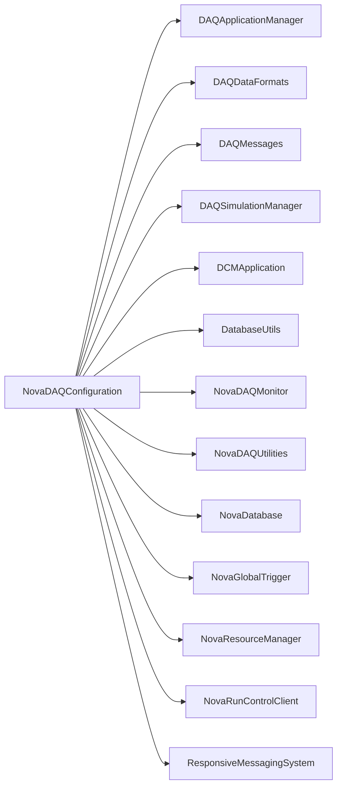

# NovaDAQConfiguration

Configuration manager translating named/database settings and partition resources into per-application connection, hardware, and run XML.

## Identity and scope

Repository: [NovaDAQ/NovaDAQConfiguration](https://github.com/NovaDAQ/NovaDAQConfiguration) · Reviewed commit: `f627b7a84096fb9c5cc4f2c0090bc8363b81ea51` · Domain: **Control**.

Tracked files: **798**. Production deployment and owner are **unconfirmed**.

## Operation

Verify detector, partition, global configuration ID, generated-file location, and distribution status. Keep a coherent set of generated files and their database identifiers for rollback; mixing files from different generations can misconfigure a run.

For prerequisites, safe start/stop sequencing, health checks, and rollback see the [operations guide](../operations/index.md).

## Build and integration

This package uses the SRT/SoftRelTools release context. A standalone `make` in a fresh checkout is not a supported build recipe unless the required context is already configured. See [build and release](../operations/build.md).

| Build definition |
| --- |
| [GNUmakefile](https://github.com/NovaDAQ/NovaDAQConfiguration/blob/f627b7a84096fb9c5cc4f2c0090bc8363b81ea51/GNUmakefile) |
| [cxx/GNUmakefile](https://github.com/NovaDAQ/NovaDAQConfiguration/blob/f627b7a84096fb9c5cc4f2c0090bc8363b81ea51/cxx/GNUmakefile) |
| [cxx/src/GNUmakefile](https://github.com/NovaDAQ/NovaDAQConfiguration/blob/f627b7a84096fb9c5cc4f2c0090bc8363b81ea51/cxx/src/GNUmakefile) |
| [cxx/test/GNUmakefile](https://github.com/NovaDAQ/NovaDAQConfiguration/blob/f627b7a84096fb9c5cc4f2c0090bc8363b81ea51/cxx/test/GNUmakefile) |
| [cxx/unittest/GNUmakefile](https://github.com/NovaDAQ/NovaDAQConfiguration/blob/f627b7a84096fb9c5cc4f2c0090bc8363b81ea51/cxx/unittest/GNUmakefile) |
| [java/GNUmakefile](https://github.com/NovaDAQ/NovaDAQConfiguration/blob/f627b7a84096fb9c5cc4f2c0090bc8363b81ea51/java/GNUmakefile) |
| [java/src/GNUmakefile](https://github.com/NovaDAQ/NovaDAQConfiguration/blob/f627b7a84096fb9c5cc4f2c0090bc8363b81ea51/java/src/GNUmakefile) |
| [java/test/GNUmakefile](https://github.com/NovaDAQ/NovaDAQConfiguration/blob/f627b7a84096fb9c5cc4f2c0090bc8363b81ea51/java/test/GNUmakefile) |
| [java/unittest/GNUmakefile](https://github.com/NovaDAQ/NovaDAQConfiguration/blob/f627b7a84096fb9c5cc4f2c0090bc8363b81ea51/java/unittest/GNUmakefile) |

## Entry points

These are source entry points or operational scripts found statically. Installation names and enabled targets depend on the build/configuration; listing a script does not establish that it is deployed.

| Source |
| --- |
| [config/FCCDAQ/createInitialSymLinks.sh](https://github.com/NovaDAQ/NovaDAQConfiguration/blob/f627b7a84096fb9c5cc4f2c0090bc8363b81ea51/config/FCCDAQ/createInitialSymLinks.sh) |
| [config/FarDet/createInitialSymLinks.sh](https://github.com/NovaDAQ/NovaDAQConfiguration/blob/f627b7a84096fb9c5cc4f2c0090bc8363b81ea51/config/FarDet/createInitialSymLinks.sh) |
| [config/NDOS/DCS/genGroup.sh](https://github.com/NovaDAQ/NovaDAQConfiguration/blob/f627b7a84096fb9c5cc4f2c0090bc8363b81ea51/config/NDOS/DCS/genGroup.sh) |
| [config/NDOS/createInitialSymLinks.sh](https://github.com/NovaDAQ/NovaDAQConfiguration/blob/f627b7a84096fb9c5cc4f2c0090bc8363b81ea51/config/NDOS/createInitialSymLinks.sh) |
| [config/NDSBTest/createInitialSymLinks.sh](https://github.com/NovaDAQ/NovaDAQConfiguration/blob/f627b7a84096fb9c5cc4f2c0090bc8363b81ea51/config/NDSBTest/createInitialSymLinks.sh) |
| [config/TestStandFCC/createInitialSymLinks.sh](https://github.com/NovaDAQ/NovaDAQConfiguration/blob/f627b7a84096fb9c5cc4f2c0090bc8363b81ea51/config/TestStandFCC/createInitialSymLinks.sh) |
| [cxx/src/ConfigurationManagerApp.cc](https://github.com/NovaDAQ/NovaDAQConfiguration/blob/f627b7a84096fb9c5cc4f2c0090bc8363b81ea51/cxx/src/ConfigurationManagerApp.cc) |
| [cxx/src/UpdateCoolingSettings.cc](https://github.com/NovaDAQ/NovaDAQConfiguration/blob/f627b7a84096fb9c5cc4f2c0090bc8363b81ea51/cxx/src/UpdateCoolingSettings.cc) |
| [script/ScaleThresholds.sh](https://github.com/NovaDAQ/NovaDAQConfiguration/blob/f627b7a84096fb9c5cc4f2c0090bc8363b81ea51/script/ScaleThresholds.sh) |
| [script/build_multicast_ospl.sh](https://github.com/NovaDAQ/NovaDAQConfiguration/blob/f627b7a84096fb9c5cc4f2c0090bc8363b81ea51/script/build_multicast_ospl.sh) |

## Interfaces

Headers and declared types form the API navigation map. Follow the source for method signatures, ownership, units, and error contracts. Generated DDS/XSD types are built from the schemas in the next section.

| Header | Declared types |
| --- | --- |
| [cxx/include/APDSettingsWrapper.h](https://github.com/NovaDAQ/NovaDAQConfiguration/blob/f627b7a84096fb9c5cc4f2c0090bc8363b81ea51/cxx/include/APDSettingsWrapper.h) | `APDSettingsWrapper`, `GlobalConfigIDWrapper` |
| [cxx/include/BNEVBConnectConfigWrapper.h](https://github.com/NovaDAQ/NovaDAQConfiguration/blob/f627b7a84096fb9c5cc4f2c0090bc8363b81ea51/cxx/include/BNEVBConnectConfigWrapper.h) | `BNEVBConnectConfigWrapper` |
| [cxx/include/BNEVBRunConfigWrapper.h](https://github.com/NovaDAQ/NovaDAQConfiguration/blob/f627b7a84096fb9c5cc4f2c0090bc8363b81ea51/cxx/include/BNEVBRunConfigWrapper.h) | `BNEVBRunConfigWrapper` |
| [cxx/include/BufferNodeEVBMapCache.h](https://github.com/NovaDAQ/NovaDAQConfiguration/blob/f627b7a84096fb9c5cc4f2c0090bc8363b81ea51/cxx/include/BufferNodeEVBMapCache.h) | `BufferNodeEVBMapCache` |
| [cxx/include/CfgMgrDBHandler.h](https://github.com/NovaDAQ/NovaDAQConfiguration/blob/f627b7a84096fb9c5cc4f2c0090bc8363b81ea51/cxx/include/CfgMgrDBHandler.h) | `CfgMgrDBHandler` |
| [cxx/include/CfgMgrFileHandler.h](https://github.com/NovaDAQ/NovaDAQConfiguration/blob/f627b7a84096fb9c5cc4f2c0090bc8363b81ea51/cxx/include/CfgMgrFileHandler.h) | `CfgMgrFileHandler` |
| [cxx/include/CfgMgrUtils.h](https://github.com/NovaDAQ/NovaDAQConfiguration/blob/f627b7a84096fb9c5cc4f2c0090bc8363b81ea51/cxx/include/CfgMgrUtils.h) | `CfgMgrUtils` |
| [cxx/include/ConfigurationManager.h](https://github.com/NovaDAQ/NovaDAQConfiguration/blob/f627b7a84096fb9c5cc4f2c0090bc8363b81ea51/cxx/include/ConfigurationManager.h) | `ConfigurationManager` |
| [cxx/include/DCMConnectConfigWrapper.h](https://github.com/NovaDAQ/NovaDAQConfiguration/blob/f627b7a84096fb9c5cc4f2c0090bc8363b81ea51/cxx/include/DCMConnectConfigWrapper.h) | `DCMConnectConfigWrapper` |
| [cxx/include/DCMHardwareConfigWrapper.h](https://github.com/NovaDAQ/NovaDAQConfiguration/blob/f627b7a84096fb9c5cc4f2c0090bc8363b81ea51/cxx/include/DCMHardwareConfigWrapper.h) | `DCMHardwareConfigWrapper` |
| [cxx/include/DCMRunConfigWrapper.h](https://github.com/NovaDAQ/NovaDAQConfiguration/blob/f627b7a84096fb9c5cc4f2c0090bc8363b81ea51/cxx/include/DCMRunConfigWrapper.h) | `DCMRunConfigWrapper` |
| [cxx/include/DDTConnectConfigWrapper.h](https://github.com/NovaDAQ/NovaDAQConfiguration/blob/f627b7a84096fb9c5cc4f2c0090bc8363b81ea51/cxx/include/DDTConnectConfigWrapper.h) | `DDTConnectConfigWrapper` |
| [cxx/include/DLConnectConfigWrapper.h](https://github.com/NovaDAQ/NovaDAQConfiguration/blob/f627b7a84096fb9c5cc4f2c0090bc8363b81ea51/cxx/include/DLConnectConfigWrapper.h) | `DLConnectConfigWrapper` |
| [cxx/include/DLRunConfigWrapper.h](https://github.com/NovaDAQ/NovaDAQConfiguration/blob/f627b7a84096fb9c5cc4f2c0090bc8363b81ea51/cxx/include/DLRunConfigWrapper.h) | `DLRunConfigWrapper` |
| [cxx/include/DataLoggerLocationMapCache.h](https://github.com/NovaDAQ/NovaDAQConfiguration/blob/f627b7a84096fb9c5cc4f2c0090bc8363b81ea51/cxx/include/DataLoggerLocationMapCache.h) | `DataLoggerLocationMapCache` |
| [cxx/include/DcmChannelMapCache.h](https://github.com/NovaDAQ/NovaDAQConfiguration/blob/f627b7a84096fb9c5cc4f2c0090bc8363b81ea51/cxx/include/DcmChannelMapCache.h) | `DcmChannelMapCache` |
| [cxx/include/GTRunConfigWrapper.h](https://github.com/NovaDAQ/NovaDAQConfiguration/blob/f627b7a84096fb9c5cc4f2c0090bc8363b81ea51/cxx/include/GTRunConfigWrapper.h) | `GTRunConfigWrapper` |
| [cxx/include/NDMRunConfigWrapper.h](https://github.com/NovaDAQ/NovaDAQConfiguration/blob/f627b7a84096fb9c5cc4f2c0090bc8363b81ea51/cxx/include/NDMRunConfigWrapper.h) | `NDMRunConfigWrapper` |

## Configuration and data contracts

| Source artifact |
| --- |
| [config/ApdDcsConfiguration.xsd](https://github.com/NovaDAQ/NovaDAQConfiguration/blob/f627b7a84096fb9c5cc4f2c0090bc8363b81ea51/config/ApdDcsConfiguration.xsd) |
| [config/BufferNodeEVBConfiguration.xsd](https://github.com/NovaDAQ/NovaDAQConfiguration/blob/f627b7a84096fb9c5cc4f2c0090bc8363b81ea51/config/BufferNodeEVBConfiguration.xsd) |
| [config/BufferNodeEVBMap.xsd](https://github.com/NovaDAQ/NovaDAQConfiguration/blob/f627b7a84096fb9c5cc4f2c0090bc8363b81ea51/config/BufferNodeEVBMap.xsd) |
| [config/CfgMgrAppParams.xsd](https://github.com/NovaDAQ/NovaDAQConfiguration/blob/f627b7a84096fb9c5cc4f2c0090bc8363b81ea51/config/CfgMgrAppParams.xsd) |
| [config/DataLoggerConfiguration.xsd](https://github.com/NovaDAQ/NovaDAQConfiguration/blob/f627b7a84096fb9c5cc4f2c0090bc8363b81ea51/config/DataLoggerConfiguration.xsd) |
| [config/DataLoggerLocationMap.xsd](https://github.com/NovaDAQ/NovaDAQConfiguration/blob/f627b7a84096fb9c5cc4f2c0090bc8363b81ea51/config/DataLoggerLocationMap.xsd) |
| [config/DcmChannelMap.xsd](https://github.com/NovaDAQ/NovaDAQConfiguration/blob/f627b7a84096fb9c5cc4f2c0090bc8363b81ea51/config/DcmChannelMap.xsd) |
| [config/FCCDAQ/appmgr/Partition0/ApplicationTypeList_DAQ_Standard_Check.xml](https://github.com/NovaDAQ/NovaDAQConfiguration/blob/f627b7a84096fb9c5cc4f2c0090bc8363b81ea51/config/FCCDAQ/appmgr/Partition0/ApplicationTypeList_DAQ_Standard_Check.xml) |
| [config/FCCDAQ/appmgr/Partition0/ApplicationTypeList_DAQ_Standard_Start.xml](https://github.com/NovaDAQ/NovaDAQConfiguration/blob/f627b7a84096fb9c5cc4f2c0090bc8363b81ea51/config/FCCDAQ/appmgr/Partition0/ApplicationTypeList_DAQ_Standard_Start.xml) |
| [config/FCCDAQ/appmgr/Partition0/ApplicationTypeList_DAQ_Standard_Stop.xml](https://github.com/NovaDAQ/NovaDAQConfiguration/blob/f627b7a84096fb9c5cc4f2c0090bc8363b81ea51/config/FCCDAQ/appmgr/Partition0/ApplicationTypeList_DAQ_Standard_Stop.xml) |
| [config/FCCDAQ/appmgr/Partition0/HostList.xml](https://github.com/NovaDAQ/NovaDAQConfiguration/blob/f627b7a84096fb9c5cc4f2c0090bc8363b81ea51/config/FCCDAQ/appmgr/Partition0/HostList.xml) |
| [config/FCCDAQ/appmgr/Partition0/ProcessList.xml](https://github.com/NovaDAQ/NovaDAQConfiguration/blob/f627b7a84096fb9c5cc4f2c0090bc8363b81ea51/config/FCCDAQ/appmgr/Partition0/ProcessList.xml) |
| [config/FCCDAQ/appmgr/Partition0/System_DAQ_Standard_Check.xml](https://github.com/NovaDAQ/NovaDAQConfiguration/blob/f627b7a84096fb9c5cc4f2c0090bc8363b81ea51/config/FCCDAQ/appmgr/Partition0/System_DAQ_Standard_Check.xml) |
| [config/FCCDAQ/appmgr/Partition0/System_DAQ_Standard_Start.xml](https://github.com/NovaDAQ/NovaDAQConfiguration/blob/f627b7a84096fb9c5cc4f2c0090bc8363b81ea51/config/FCCDAQ/appmgr/Partition0/System_DAQ_Standard_Start.xml) |
| [config/FCCDAQ/appmgr/Partition0/System_DAQ_Standard_Stop.xml](https://github.com/NovaDAQ/NovaDAQConfiguration/blob/f627b7a84096fb9c5cc4f2c0090bc8363b81ea51/config/FCCDAQ/appmgr/Partition0/System_DAQ_Standard_Stop.xml) |
| [config/FCCDAQ/cfgmgr/BufferNodeEVBMap.xml](https://github.com/NovaDAQ/NovaDAQConfiguration/blob/f627b7a84096fb9c5cc4f2c0090bc8363b81ea51/config/FCCDAQ/cfgmgr/BufferNodeEVBMap.xml) |
| [config/FCCDAQ/cfgmgr/CfgMgrAppParams.xml](https://github.com/NovaDAQ/NovaDAQConfiguration/blob/f627b7a84096fb9c5cc4f2c0090bc8363b81ea51/config/FCCDAQ/cfgmgr/CfgMgrAppParams.xml) |
| [config/FCCDAQ/cfgmgr/DCMApplication/hardware/DcmFEBDCSModeConfiguration.xml](https://github.com/NovaDAQ/NovaDAQConfiguration/blob/f627b7a84096fb9c5cc4f2c0090bc8363b81ea51/config/FCCDAQ/cfgmgr/DCMApplication/hardware/DcmFEBDCSModeConfiguration.xml) |
| [config/FCCDAQ/cfgmgr/DCMApplication/hardware/DcmFEBDCSModePulserEnabledConfiguration.xml](https://github.com/NovaDAQ/NovaDAQConfiguration/blob/f627b7a84096fb9c5cc4f2c0090bc8363b81ea51/config/FCCDAQ/cfgmgr/DCMApplication/hardware/DcmFEBDCSModePulserEnabledConfiguration.xml) |
| [config/FCCDAQ/cfgmgr/DCMApplication/hardware/DcmFEBDSOModePulserEnabledConfiguration.xml](https://github.com/NovaDAQ/NovaDAQConfiguration/blob/f627b7a84096fb9c5cc4f2c0090bc8363b81ea51/config/FCCDAQ/cfgmgr/DCMApplication/hardware/DcmFEBDSOModePulserEnabledConfiguration.xml) |
| [config/FCCDAQ/cfgmgr/DCMApplication/hardware/DcmFEBSDPModePulserEnabledConfiguration.xml](https://github.com/NovaDAQ/NovaDAQConfiguration/blob/f627b7a84096fb9c5cc4f2c0090bc8363b81ea51/config/FCCDAQ/cfgmgr/DCMApplication/hardware/DcmFEBSDPModePulserEnabledConfiguration.xml) |
| [config/FCCDAQ/cfgmgr/DCMApplication/hardware/DcmFPGAPatternDataModeConfiguration.xml](https://github.com/NovaDAQ/NovaDAQConfiguration/blob/f627b7a84096fb9c5cc4f2c0090bc8363b81ea51/config/FCCDAQ/cfgmgr/DCMApplication/hardware/DcmFPGAPatternDataModeConfiguration.xml) |
| [config/FCCDAQ/cfgmgr/DCMApplication/hardware/DcmSimConfiguration.xml](https://github.com/NovaDAQ/NovaDAQConfiguration/blob/f627b7a84096fb9c5cc4f2c0090bc8363b81ea51/config/FCCDAQ/cfgmgr/DCMApplication/hardware/DcmSimConfiguration.xml) |
| [config/FCCDAQ/cfgmgr/DCMApplication/hardware/SampleNamedConfigSet.xml](https://github.com/NovaDAQ/NovaDAQConfiguration/blob/f627b7a84096fb9c5cc4f2c0090bc8363b81ea51/config/FCCDAQ/cfgmgr/DCMApplication/hardware/SampleNamedConfigSet.xml) |
| [config/FCCDAQ/cfgmgr/DCMApplication/run/DcmFEBDCSModeConfiguration.xml](https://github.com/NovaDAQ/NovaDAQConfiguration/blob/f627b7a84096fb9c5cc4f2c0090bc8363b81ea51/config/FCCDAQ/cfgmgr/DCMApplication/run/DcmFEBDCSModeConfiguration.xml) |
| [config/FCCDAQ/cfgmgr/DCMApplication/run/DcmFEBDCSModePulserEnabledConfiguration.xml](https://github.com/NovaDAQ/NovaDAQConfiguration/blob/f627b7a84096fb9c5cc4f2c0090bc8363b81ea51/config/FCCDAQ/cfgmgr/DCMApplication/run/DcmFEBDCSModePulserEnabledConfiguration.xml) |
| [config/FCCDAQ/cfgmgr/DCMApplication/run/DcmFEBDSOModePulserEnabledConfiguration.xml](https://github.com/NovaDAQ/NovaDAQConfiguration/blob/f627b7a84096fb9c5cc4f2c0090bc8363b81ea51/config/FCCDAQ/cfgmgr/DCMApplication/run/DcmFEBDSOModePulserEnabledConfiguration.xml) |
| [config/FCCDAQ/cfgmgr/DCMApplication/run/DcmFEBSDPModePulserEnabledConfiguration.xml](https://github.com/NovaDAQ/NovaDAQConfiguration/blob/f627b7a84096fb9c5cc4f2c0090bc8363b81ea51/config/FCCDAQ/cfgmgr/DCMApplication/run/DcmFEBSDPModePulserEnabledConfiguration.xml) |
| [config/FCCDAQ/cfgmgr/DCMApplication/run/DcmFPGAPatternDataModeConfiguration.xml](https://github.com/NovaDAQ/NovaDAQConfiguration/blob/f627b7a84096fb9c5cc4f2c0090bc8363b81ea51/config/FCCDAQ/cfgmgr/DCMApplication/run/DcmFPGAPatternDataModeConfiguration.xml) |
| [config/FCCDAQ/cfgmgr/DCMApplication/run/DcmSimConfiguration.xml](https://github.com/NovaDAQ/NovaDAQConfiguration/blob/f627b7a84096fb9c5cc4f2c0090bc8363b81ea51/config/FCCDAQ/cfgmgr/DCMApplication/run/DcmSimConfiguration.xml) |
| [config/FCCDAQ/cfgmgr/DCMApplication/run/DcmSimmanMode1Configuration.xml](https://github.com/NovaDAQ/NovaDAQConfiguration/blob/f627b7a84096fb9c5cc4f2c0090bc8363b81ea51/config/FCCDAQ/cfgmgr/DCMApplication/run/DcmSimmanMode1Configuration.xml) |
| [config/FCCDAQ/cfgmgr/DCMApplication/run/SampleNamedConfigSet.xml](https://github.com/NovaDAQ/NovaDAQConfiguration/blob/f627b7a84096fb9c5cc4f2c0090bc8363b81ea51/config/FCCDAQ/cfgmgr/DCMApplication/run/SampleNamedConfigSet.xml) |
| [config/FCCDAQ/cfgmgr/DataLogger/run/Sample1.xml](https://github.com/NovaDAQ/NovaDAQConfiguration/blob/f627b7a84096fb9c5cc4f2c0090bc8363b81ea51/config/FCCDAQ/cfgmgr/DataLogger/run/Sample1.xml) |
| [config/FCCDAQ/cfgmgr/DataLogger/run/Sample2.xml](https://github.com/NovaDAQ/NovaDAQConfiguration/blob/f627b7a84096fb9c5cc4f2c0090bc8363b81ea51/config/FCCDAQ/cfgmgr/DataLogger/run/Sample2.xml) |
| [config/FCCDAQ/cfgmgr/DataLoggerLocationMap.xml](https://github.com/NovaDAQ/NovaDAQConfiguration/blob/f627b7a84096fb9c5cc4f2c0090bc8363b81ea51/config/FCCDAQ/cfgmgr/DataLoggerLocationMap.xml) |
| [config/FCCDAQ/cfgmgr/DcmChannelMap.xml](https://github.com/NovaDAQ/NovaDAQConfiguration/blob/f627b7a84096fb9c5cc4f2c0090bc8363b81ea51/config/FCCDAQ/cfgmgr/DcmChannelMap.xml) |
| [config/FCCDAQ/cfgmgr/GlobalConfigurations/PatternDataGlobalConfig.xml](https://github.com/NovaDAQ/NovaDAQConfiguration/blob/f627b7a84096fb9c5cc4f2c0090bc8363b81ea51/config/FCCDAQ/cfgmgr/GlobalConfigurations/PatternDataGlobalConfig.xml) |
| [config/FCCDAQ/cfgmgr/GlobalConfigurations/SimMode0GlobalConfig.xml](https://github.com/NovaDAQ/NovaDAQConfiguration/blob/f627b7a84096fb9c5cc4f2c0090bc8363b81ea51/config/FCCDAQ/cfgmgr/GlobalConfigurations/SimMode0GlobalConfig.xml) |
| [config/FCCDAQ/cfgmgr/GlobalConfigurations/SimMode1GlobalConfig.xml](https://github.com/NovaDAQ/NovaDAQConfiguration/blob/f627b7a84096fb9c5cc4f2c0090bc8363b81ea51/config/FCCDAQ/cfgmgr/GlobalConfigurations/SimMode1GlobalConfig.xml) |
| [config/FCCDAQ/cfgmgr/GlobalTrigger/run/Calib_1HzRate_50usecWindow_NoOffset.xml](https://github.com/NovaDAQ/NovaDAQConfiguration/blob/f627b7a84096fb9c5cc4f2c0090bc8363b81ea51/config/FCCDAQ/cfgmgr/GlobalTrigger/run/Calib_1HzRate_50usecWindow_NoOffset.xml) |
| [config/FCCDAQ/cfgmgr/GlobalTrigger/run/SimGTConfig.xml](https://github.com/NovaDAQ/NovaDAQConfiguration/blob/f627b7a84096fb9c5cc4f2c0090bc8363b81ea51/config/FCCDAQ/cfgmgr/GlobalTrigger/run/SimGTConfig.xml) |
| [config/FCCDAQ/cfgmgr/Partition3/CfgMgrAppParams.xml](https://github.com/NovaDAQ/NovaDAQConfiguration/blob/f627b7a84096fb9c5cc4f2c0090bc8363b81ea51/config/FCCDAQ/cfgmgr/Partition3/CfgMgrAppParams.xml) |
| [config/FCCDAQ/cfgmgr/SimulationManager/run/SimmanCustomEvents.xml](https://github.com/NovaDAQ/NovaDAQConfiguration/blob/f627b7a84096fb9c5cc4f2c0090bc8363b81ea51/config/FCCDAQ/cfgmgr/SimulationManager/run/SimmanCustomEvents.xml) |
| [config/FCCDAQ/cfgmgr/SimulationManager/run/SimmanSingleMuon.xml](https://github.com/NovaDAQ/NovaDAQConfiguration/blob/f627b7a84096fb9c5cc4f2c0090bc8363b81ea51/config/FCCDAQ/cfgmgr/SimulationManager/run/SimmanSingleMuon.xml) |
| [config/FCCDAQ/dds/dcm-standard/NullPartition/ospl.xml](https://github.com/NovaDAQ/NovaDAQConfiguration/blob/f627b7a84096fb9c5cc4f2c0090bc8363b81ea51/config/FCCDAQ/dds/dcm-standard/NullPartition/ospl.xml) |
| [config/FCCDAQ/dds/dcm-standard/Partition0/ospl.xml](https://github.com/NovaDAQ/NovaDAQConfiguration/blob/f627b7a84096fb9c5cc4f2c0090bc8363b81ea51/config/FCCDAQ/dds/dcm-standard/Partition0/ospl.xml) |
| [config/FCCDAQ/dds/dcm-standard/Partition1/ospl.xml](https://github.com/NovaDAQ/NovaDAQConfiguration/blob/f627b7a84096fb9c5cc4f2c0090bc8363b81ea51/config/FCCDAQ/dds/dcm-standard/Partition1/ospl.xml) |
| [config/FCCDAQ/dds/dcm-standard/Partition2/ospl.xml](https://github.com/NovaDAQ/NovaDAQConfiguration/blob/f627b7a84096fb9c5cc4f2c0090bc8363b81ea51/config/FCCDAQ/dds/dcm-standard/Partition2/ospl.xml) |
| [config/FCCDAQ/dds/dcm-standard/Partition3/ospl.xml](https://github.com/NovaDAQ/NovaDAQConfiguration/blob/f627b7a84096fb9c5cc4f2c0090bc8363b81ea51/config/FCCDAQ/dds/dcm-standard/Partition3/ospl.xml) |
| [config/FCCDAQ/dds/farm-standard/NullPartition/ospl.xml](https://github.com/NovaDAQ/NovaDAQConfiguration/blob/f627b7a84096fb9c5cc4f2c0090bc8363b81ea51/config/FCCDAQ/dds/farm-standard/NullPartition/ospl.xml) |
| [config/FCCDAQ/dds/farm-standard/Partition0/ospl.xml](https://github.com/NovaDAQ/NovaDAQConfiguration/blob/f627b7a84096fb9c5cc4f2c0090bc8363b81ea51/config/FCCDAQ/dds/farm-standard/Partition0/ospl.xml) |
| [config/FCCDAQ/dds/farm-standard/Partition1/ospl.xml](https://github.com/NovaDAQ/NovaDAQConfiguration/blob/f627b7a84096fb9c5cc4f2c0090bc8363b81ea51/config/FCCDAQ/dds/farm-standard/Partition1/ospl.xml) |
| [config/FCCDAQ/dds/farm-standard/Partition2/ospl.xml](https://github.com/NovaDAQ/NovaDAQConfiguration/blob/f627b7a84096fb9c5cc4f2c0090bc8363b81ea51/config/FCCDAQ/dds/farm-standard/Partition2/ospl.xml) |
| [config/FCCDAQ/dds/farm-standard/Partition3/ospl.xml](https://github.com/NovaDAQ/NovaDAQConfiguration/blob/f627b7a84096fb9c5cc4f2c0090bc8363b81ea51/config/FCCDAQ/dds/farm-standard/Partition3/ospl.xml) |
| [config/FCCDAQ/dds/novafarm-01/NullPartition/ospl.xml](https://github.com/NovaDAQ/NovaDAQConfiguration/blob/f627b7a84096fb9c5cc4f2c0090bc8363b81ea51/config/FCCDAQ/dds/novafarm-01/NullPartition/ospl.xml) |
| [config/FCCDAQ/dds/novafarm-01/Partition0/ospl.xml](https://github.com/NovaDAQ/NovaDAQConfiguration/blob/f627b7a84096fb9c5cc4f2c0090bc8363b81ea51/config/FCCDAQ/dds/novafarm-01/Partition0/ospl.xml) |
| [config/FCCDAQ/dds/novafarm-01/Partition1/ospl.xml](https://github.com/NovaDAQ/NovaDAQConfiguration/blob/f627b7a84096fb9c5cc4f2c0090bc8363b81ea51/config/FCCDAQ/dds/novafarm-01/Partition1/ospl.xml) |
| [config/FCCDAQ/dds/novafarm-01/Partition2/ospl.xml](https://github.com/NovaDAQ/NovaDAQConfiguration/blob/f627b7a84096fb9c5cc4f2c0090bc8363b81ea51/config/FCCDAQ/dds/novafarm-01/Partition2/ospl.xml) |
| [config/FCCDAQ/dds/novafarm-01/Partition3/ospl.xml](https://github.com/NovaDAQ/NovaDAQConfiguration/blob/f627b7a84096fb9c5cc4f2c0090bc8363b81ea51/config/FCCDAQ/dds/novafarm-01/Partition3/ospl.xml) |
| [config/FCCDAQ/dds/novafarm-02/NullPartition/ospl.xml](https://github.com/NovaDAQ/NovaDAQConfiguration/blob/f627b7a84096fb9c5cc4f2c0090bc8363b81ea51/config/FCCDAQ/dds/novafarm-02/NullPartition/ospl.xml) |
| [config/FCCDAQ/dds/novafarm-02/Partition0/ospl.xml](https://github.com/NovaDAQ/NovaDAQConfiguration/blob/f627b7a84096fb9c5cc4f2c0090bc8363b81ea51/config/FCCDAQ/dds/novafarm-02/Partition0/ospl.xml) |
| [config/FCCDAQ/dds/novafarm-02/Partition1/ospl.xml](https://github.com/NovaDAQ/NovaDAQConfiguration/blob/f627b7a84096fb9c5cc4f2c0090bc8363b81ea51/config/FCCDAQ/dds/novafarm-02/Partition1/ospl.xml) |
| [config/FCCDAQ/dds/novafarm-02/Partition2/ospl.xml](https://github.com/NovaDAQ/NovaDAQConfiguration/blob/f627b7a84096fb9c5cc4f2c0090bc8363b81ea51/config/FCCDAQ/dds/novafarm-02/Partition2/ospl.xml) |
| [config/FCCDAQ/dds/novafarm-02/Partition3/ospl.xml](https://github.com/NovaDAQ/NovaDAQConfiguration/blob/f627b7a84096fb9c5cc4f2c0090bc8363b81ea51/config/FCCDAQ/dds/novafarm-02/Partition3/ospl.xml) |
| [config/FCCDAQ/dds/novafarm-03/NullPartition/ospl.xml](https://github.com/NovaDAQ/NovaDAQConfiguration/blob/f627b7a84096fb9c5cc4f2c0090bc8363b81ea51/config/FCCDAQ/dds/novafarm-03/NullPartition/ospl.xml) |
| [config/FCCDAQ/dds/novafarm-03/Partition0/ospl.xml](https://github.com/NovaDAQ/NovaDAQConfiguration/blob/f627b7a84096fb9c5cc4f2c0090bc8363b81ea51/config/FCCDAQ/dds/novafarm-03/Partition0/ospl.xml) |
| [config/FCCDAQ/dds/novafarm-03/Partition1/ospl.xml](https://github.com/NovaDAQ/NovaDAQConfiguration/blob/f627b7a84096fb9c5cc4f2c0090bc8363b81ea51/config/FCCDAQ/dds/novafarm-03/Partition1/ospl.xml) |
| [config/FCCDAQ/dds/novafarm-03/Partition2/ospl.xml](https://github.com/NovaDAQ/NovaDAQConfiguration/blob/f627b7a84096fb9c5cc4f2c0090bc8363b81ea51/config/FCCDAQ/dds/novafarm-03/Partition2/ospl.xml) |
| [config/FCCDAQ/dds/novafarm-03/Partition3/ospl.xml](https://github.com/NovaDAQ/NovaDAQConfiguration/blob/f627b7a84096fb9c5cc4f2c0090bc8363b81ea51/config/FCCDAQ/dds/novafarm-03/Partition3/ospl.xml) |
| [config/FCCDAQ/dds/novafarm-04/NullPartition/ospl.xml](https://github.com/NovaDAQ/NovaDAQConfiguration/blob/f627b7a84096fb9c5cc4f2c0090bc8363b81ea51/config/FCCDAQ/dds/novafarm-04/NullPartition/ospl.xml) |
| [config/FCCDAQ/dds/novafarm-04/Partition0/ospl.xml](https://github.com/NovaDAQ/NovaDAQConfiguration/blob/f627b7a84096fb9c5cc4f2c0090bc8363b81ea51/config/FCCDAQ/dds/novafarm-04/Partition0/ospl.xml) |
| [config/FCCDAQ/dds/novafarm-04/Partition1/ospl.xml](https://github.com/NovaDAQ/NovaDAQConfiguration/blob/f627b7a84096fb9c5cc4f2c0090bc8363b81ea51/config/FCCDAQ/dds/novafarm-04/Partition1/ospl.xml) |
| [config/FCCDAQ/dds/novafarm-04/Partition2/ospl.xml](https://github.com/NovaDAQ/NovaDAQConfiguration/blob/f627b7a84096fb9c5cc4f2c0090bc8363b81ea51/config/FCCDAQ/dds/novafarm-04/Partition2/ospl.xml) |
| [config/FCCDAQ/dds/novafarm-04/Partition3/ospl.xml](https://github.com/NovaDAQ/NovaDAQConfiguration/blob/f627b7a84096fb9c5cc4f2c0090bc8363b81ea51/config/FCCDAQ/dds/novafarm-04/Partition3/ospl.xml) |
| [config/FCCDAQ/dds/standard/NullPartition/ospl.xml](https://github.com/NovaDAQ/NovaDAQConfiguration/blob/f627b7a84096fb9c5cc4f2c0090bc8363b81ea51/config/FCCDAQ/dds/standard/NullPartition/ospl.xml) |
| [config/FCCDAQ/dds/standard/Partition0/ospl.xml](https://github.com/NovaDAQ/NovaDAQConfiguration/blob/f627b7a84096fb9c5cc4f2c0090bc8363b81ea51/config/FCCDAQ/dds/standard/Partition0/ospl.xml) |
| [config/FCCDAQ/dds/standard/Partition1/ospl.xml](https://github.com/NovaDAQ/NovaDAQConfiguration/blob/f627b7a84096fb9c5cc4f2c0090bc8363b81ea51/config/FCCDAQ/dds/standard/Partition1/ospl.xml) |
| [config/FCCDAQ/dds/standard/Partition2/ospl.xml](https://github.com/NovaDAQ/NovaDAQConfiguration/blob/f627b7a84096fb9c5cc4f2c0090bc8363b81ea51/config/FCCDAQ/dds/standard/Partition2/ospl.xml) |
| [config/FCCDAQ/dds/standard/Partition3/ospl.xml](https://github.com/NovaDAQ/NovaDAQConfiguration/blob/f627b7a84096fb9c5cc4f2c0090bc8363b81ea51/config/FCCDAQ/dds/standard/Partition3/ospl.xml) |
| [config/FCCDAQ/msgfac/CfgMgrMsgFac.fcl](https://github.com/NovaDAQ/NovaDAQConfiguration/blob/f627b7a84096fb9c5cc4f2c0090bc8363b81ea51/config/FCCDAQ/msgfac/CfgMgrMsgFac.fcl) |
| [config/FCCDAQ/msgfac/GlobalTriggerMsgFac.fcl](https://github.com/NovaDAQ/NovaDAQConfiguration/blob/f627b7a84096fb9c5cc4f2c0090bc8363b81ea51/config/FCCDAQ/msgfac/GlobalTriggerMsgFac.fcl) |
| [config/FarDet/appmgr/Partition0/ApplicationTypeList_DAQ_Standard_Check.xml](https://github.com/NovaDAQ/NovaDAQConfiguration/blob/f627b7a84096fb9c5cc4f2c0090bc8363b81ea51/config/FarDet/appmgr/Partition0/ApplicationTypeList_DAQ_Standard_Check.xml) |
| [config/FarDet/appmgr/Partition0/ApplicationTypeList_DAQ_Standard_Start.xml](https://github.com/NovaDAQ/NovaDAQConfiguration/blob/f627b7a84096fb9c5cc4f2c0090bc8363b81ea51/config/FarDet/appmgr/Partition0/ApplicationTypeList_DAQ_Standard_Start.xml) |
| [config/FarDet/appmgr/Partition0/ApplicationTypeList_DAQ_Standard_Stop.xml](https://github.com/NovaDAQ/NovaDAQConfiguration/blob/f627b7a84096fb9c5cc4f2c0090bc8363b81ea51/config/FarDet/appmgr/Partition0/ApplicationTypeList_DAQ_Standard_Stop.xml) |
| [config/FarDet/appmgr/Partition0/HostList.xml](https://github.com/NovaDAQ/NovaDAQConfiguration/blob/f627b7a84096fb9c5cc4f2c0090bc8363b81ea51/config/FarDet/appmgr/Partition0/HostList.xml) |
| [config/FarDet/appmgr/Partition0/ProcessList.xml](https://github.com/NovaDAQ/NovaDAQConfiguration/blob/f627b7a84096fb9c5cc4f2c0090bc8363b81ea51/config/FarDet/appmgr/Partition0/ProcessList.xml) |
| [config/FarDet/appmgr/Partition0/System_DAQ_Standard_Check.xml](https://github.com/NovaDAQ/NovaDAQConfiguration/blob/f627b7a84096fb9c5cc4f2c0090bc8363b81ea51/config/FarDet/appmgr/Partition0/System_DAQ_Standard_Check.xml) |
| [config/FarDet/appmgr/Partition0/System_DAQ_Standard_Start.xml](https://github.com/NovaDAQ/NovaDAQConfiguration/blob/f627b7a84096fb9c5cc4f2c0090bc8363b81ea51/config/FarDet/appmgr/Partition0/System_DAQ_Standard_Start.xml) |
| [config/FarDet/appmgr/Partition0/System_DAQ_Standard_Stop.xml](https://github.com/NovaDAQ/NovaDAQConfiguration/blob/f627b7a84096fb9c5cc4f2c0090bc8363b81ea51/config/FarDet/appmgr/Partition0/System_DAQ_Standard_Stop.xml) |
| [config/FarDet/appmgr/Partition91/ApplicationTypeList_DAQ_Standard_Check.xml](https://github.com/NovaDAQ/NovaDAQConfiguration/blob/f627b7a84096fb9c5cc4f2c0090bc8363b81ea51/config/FarDet/appmgr/Partition91/ApplicationTypeList_DAQ_Standard_Check.xml) |
| [config/FarDet/appmgr/Partition91/ApplicationTypeList_DAQ_Standard_Start.xml](https://github.com/NovaDAQ/NovaDAQConfiguration/blob/f627b7a84096fb9c5cc4f2c0090bc8363b81ea51/config/FarDet/appmgr/Partition91/ApplicationTypeList_DAQ_Standard_Start.xml) |
| [config/FarDet/appmgr/Partition91/ApplicationTypeList_DAQ_Standard_Stop.xml](https://github.com/NovaDAQ/NovaDAQConfiguration/blob/f627b7a84096fb9c5cc4f2c0090bc8363b81ea51/config/FarDet/appmgr/Partition91/ApplicationTypeList_DAQ_Standard_Stop.xml) |
| [config/FarDet/appmgr/Partition91/HostList.xml](https://github.com/NovaDAQ/NovaDAQConfiguration/blob/f627b7a84096fb9c5cc4f2c0090bc8363b81ea51/config/FarDet/appmgr/Partition91/HostList.xml) |
| [config/FarDet/appmgr/Partition91/ProcessList.xml](https://github.com/NovaDAQ/NovaDAQConfiguration/blob/f627b7a84096fb9c5cc4f2c0090bc8363b81ea51/config/FarDet/appmgr/Partition91/ProcessList.xml) |
| [config/FarDet/appmgr/Partition91/System_DAQ_Standard_Check.xml](https://github.com/NovaDAQ/NovaDAQConfiguration/blob/f627b7a84096fb9c5cc4f2c0090bc8363b81ea51/config/FarDet/appmgr/Partition91/System_DAQ_Standard_Check.xml) |
| [config/FarDet/appmgr/Partition91/System_DAQ_Standard_Start.xml](https://github.com/NovaDAQ/NovaDAQConfiguration/blob/f627b7a84096fb9c5cc4f2c0090bc8363b81ea51/config/FarDet/appmgr/Partition91/System_DAQ_Standard_Start.xml) |
| [config/FarDet/appmgr/Partition91/System_DAQ_Standard_Stop.xml](https://github.com/NovaDAQ/NovaDAQConfiguration/blob/f627b7a84096fb9c5cc4f2c0090bc8363b81ea51/config/FarDet/appmgr/Partition91/System_DAQ_Standard_Stop.xml) |
| [config/FarDet/appmgr/Partition92/ApplicationTypeList_Standard_Check.xml](https://github.com/NovaDAQ/NovaDAQConfiguration/blob/f627b7a84096fb9c5cc4f2c0090bc8363b81ea51/config/FarDet/appmgr/Partition92/ApplicationTypeList_Standard_Check.xml) |
| [config/FarDet/appmgr/Partition92/ApplicationTypeList_Standard_Start.xml](https://github.com/NovaDAQ/NovaDAQConfiguration/blob/f627b7a84096fb9c5cc4f2c0090bc8363b81ea51/config/FarDet/appmgr/Partition92/ApplicationTypeList_Standard_Start.xml) |
| [config/FarDet/appmgr/Partition92/ApplicationTypeList_Standard_Stop.xml](https://github.com/NovaDAQ/NovaDAQConfiguration/blob/f627b7a84096fb9c5cc4f2c0090bc8363b81ea51/config/FarDet/appmgr/Partition92/ApplicationTypeList_Standard_Stop.xml) |
| [config/FarDet/appmgr/Partition92/HostList.xml](https://github.com/NovaDAQ/NovaDAQConfiguration/blob/f627b7a84096fb9c5cc4f2c0090bc8363b81ea51/config/FarDet/appmgr/Partition92/HostList.xml) |
| [config/FarDet/appmgr/Partition92/ProcessList.xml](https://github.com/NovaDAQ/NovaDAQConfiguration/blob/f627b7a84096fb9c5cc4f2c0090bc8363b81ea51/config/FarDet/appmgr/Partition92/ProcessList.xml) |
| [config/FarDet/cfgmgr/standard/BufferNodeEVBMap.xml](https://github.com/NovaDAQ/NovaDAQConfiguration/blob/f627b7a84096fb9c5cc4f2c0090bc8363b81ea51/config/FarDet/cfgmgr/standard/BufferNodeEVBMap.xml) |
| [config/FarDet/cfgmgr/standard/CfgMgrAppParams.xml](https://github.com/NovaDAQ/NovaDAQConfiguration/blob/f627b7a84096fb9c5cc4f2c0090bc8363b81ea51/config/FarDet/cfgmgr/standard/CfgMgrAppParams.xml) |
| [config/FarDet/cfgmgr/standard/DCMApplication/hardware/DCSModePulserEnabledConfigurationJuly2012.xml](https://github.com/NovaDAQ/NovaDAQConfiguration/blob/f627b7a84096fb9c5cc4f2c0090bc8363b81ea51/config/FarDet/cfgmgr/standard/DCMApplication/hardware/DCSModePulserEnabledConfigurationJuly2012.xml) |
| [config/FarDet/cfgmgr/standard/DCMApplication/hardware/DCSMode_DCMHwCfgNamedSet.xml](https://github.com/NovaDAQ/NovaDAQConfiguration/blob/f627b7a84096fb9c5cc4f2c0090bc8363b81ea51/config/FarDet/cfgmgr/standard/DCMApplication/hardware/DCSMode_DCMHwCfgNamedSet.xml) |
| [config/FarDet/cfgmgr/standard/DCMApplication/hardware/DcmFEBDCSModeConfiguration.xml](https://github.com/NovaDAQ/NovaDAQConfiguration/blob/f627b7a84096fb9c5cc4f2c0090bc8363b81ea51/config/FarDet/cfgmgr/standard/DCMApplication/hardware/DcmFEBDCSModeConfiguration.xml) |
| [config/FarDet/cfgmgr/standard/DCMApplication/hardware/DcmFEBDCSModePulserEnabledConfiguration.xml](https://github.com/NovaDAQ/NovaDAQConfiguration/blob/f627b7a84096fb9c5cc4f2c0090bc8363b81ea51/config/FarDet/cfgmgr/standard/DCMApplication/hardware/DcmFEBDCSModePulserEnabledConfiguration.xml) |
| [config/FarDet/cfgmgr/standard/DCMApplication/hardware/DcmFEBDSOModePulserEnabledConfiguration.xml](https://github.com/NovaDAQ/NovaDAQConfiguration/blob/f627b7a84096fb9c5cc4f2c0090bc8363b81ea51/config/FarDet/cfgmgr/standard/DCMApplication/hardware/DcmFEBDSOModePulserEnabledConfiguration.xml) |
| [config/FarDet/cfgmgr/standard/DCMApplication/hardware/DcmFEBSDPModePulserEnabledConfiguration.xml](https://github.com/NovaDAQ/NovaDAQConfiguration/blob/f627b7a84096fb9c5cc4f2c0090bc8363b81ea51/config/FarDet/cfgmgr/standard/DCMApplication/hardware/DcmFEBSDPModePulserEnabledConfiguration.xml) |
| [config/FarDet/cfgmgr/standard/DCMApplication/hardware/DcmFPGAPatternDataModeConfiguration.xml](https://github.com/NovaDAQ/NovaDAQConfiguration/blob/f627b7a84096fb9c5cc4f2c0090bc8363b81ea51/config/FarDet/cfgmgr/standard/DCMApplication/hardware/DcmFPGAPatternDataModeConfiguration.xml) |
| [config/FarDet/cfgmgr/standard/DCMApplication/hardware/DcmSimConfiguration.xml](https://github.com/NovaDAQ/NovaDAQConfiguration/blob/f627b7a84096fb9c5cc4f2c0090bc8363b81ea51/config/FarDet/cfgmgr/standard/DCMApplication/hardware/DcmSimConfiguration.xml) |
| [config/FarDet/cfgmgr/standard/DCMApplication/hardware/SampleNamedConfigSet.xml](https://github.com/NovaDAQ/NovaDAQConfiguration/blob/f627b7a84096fb9c5cc4f2c0090bc8363b81ea51/config/FarDet/cfgmgr/standard/DCMApplication/hardware/SampleNamedConfigSet.xml) |
| [config/FarDet/cfgmgr/standard/DCMApplication/run/DCSModePulserEnabledConfigurationJuly2012.xml](https://github.com/NovaDAQ/NovaDAQConfiguration/blob/f627b7a84096fb9c5cc4f2c0090bc8363b81ea51/config/FarDet/cfgmgr/standard/DCMApplication/run/DCSModePulserEnabledConfigurationJuly2012.xml) |
| [config/FarDet/cfgmgr/standard/DCMApplication/run/DcmFEBDCSModeConfiguration.xml](https://github.com/NovaDAQ/NovaDAQConfiguration/blob/f627b7a84096fb9c5cc4f2c0090bc8363b81ea51/config/FarDet/cfgmgr/standard/DCMApplication/run/DcmFEBDCSModeConfiguration.xml) |
| [config/FarDet/cfgmgr/standard/DCMApplication/run/DcmFEBDCSModePulserEnabledConfiguration.xml](https://github.com/NovaDAQ/NovaDAQConfiguration/blob/f627b7a84096fb9c5cc4f2c0090bc8363b81ea51/config/FarDet/cfgmgr/standard/DCMApplication/run/DcmFEBDCSModePulserEnabledConfiguration.xml) |
| [config/FarDet/cfgmgr/standard/DCMApplication/run/DcmFEBDSOModePulserEnabledConfiguration.xml](https://github.com/NovaDAQ/NovaDAQConfiguration/blob/f627b7a84096fb9c5cc4f2c0090bc8363b81ea51/config/FarDet/cfgmgr/standard/DCMApplication/run/DcmFEBDSOModePulserEnabledConfiguration.xml) |
| [config/FarDet/cfgmgr/standard/DCMApplication/run/DcmFEBSDPModePulserEnabledConfiguration.xml](https://github.com/NovaDAQ/NovaDAQConfiguration/blob/f627b7a84096fb9c5cc4f2c0090bc8363b81ea51/config/FarDet/cfgmgr/standard/DCMApplication/run/DcmFEBSDPModePulserEnabledConfiguration.xml) |
| [config/FarDet/cfgmgr/standard/DCMApplication/run/DcmFPGAPatternDataModeConfiguration.xml](https://github.com/NovaDAQ/NovaDAQConfiguration/blob/f627b7a84096fb9c5cc4f2c0090bc8363b81ea51/config/FarDet/cfgmgr/standard/DCMApplication/run/DcmFPGAPatternDataModeConfiguration.xml) |
| [config/FarDet/cfgmgr/standard/DCMApplication/run/DcmSimConfiguration.xml](https://github.com/NovaDAQ/NovaDAQConfiguration/blob/f627b7a84096fb9c5cc4f2c0090bc8363b81ea51/config/FarDet/cfgmgr/standard/DCMApplication/run/DcmSimConfiguration.xml) |
| [config/FarDet/cfgmgr/standard/DCMApplication/run/DcmSimmanMode1Configuration.xml](https://github.com/NovaDAQ/NovaDAQConfiguration/blob/f627b7a84096fb9c5cc4f2c0090bc8363b81ea51/config/FarDet/cfgmgr/standard/DCMApplication/run/DcmSimmanMode1Configuration.xml) |
| [config/FarDet/cfgmgr/standard/DCMApplication/run/SampleNamedConfigSet.xml](https://github.com/NovaDAQ/NovaDAQConfiguration/blob/f627b7a84096fb9c5cc4f2c0090bc8363b81ea51/config/FarDet/cfgmgr/standard/DCMApplication/run/SampleNamedConfigSet.xml) |
| [config/FarDet/cfgmgr/standard/DataLogger/run/Sample1.xml](https://github.com/NovaDAQ/NovaDAQConfiguration/blob/f627b7a84096fb9c5cc4f2c0090bc8363b81ea51/config/FarDet/cfgmgr/standard/DataLogger/run/Sample1.xml) |
| [config/FarDet/cfgmgr/standard/DataLogger/run/Sample2.xml](https://github.com/NovaDAQ/NovaDAQConfiguration/blob/f627b7a84096fb9c5cc4f2c0090bc8363b81ea51/config/FarDet/cfgmgr/standard/DataLogger/run/Sample2.xml) |
| [config/FarDet/cfgmgr/standard/DataLoggerLocationMap.xml](https://github.com/NovaDAQ/NovaDAQConfiguration/blob/f627b7a84096fb9c5cc4f2c0090bc8363b81ea51/config/FarDet/cfgmgr/standard/DataLoggerLocationMap.xml) |
| [config/FarDet/cfgmgr/standard/DcmChannelMap.xml](https://github.com/NovaDAQ/NovaDAQConfiguration/blob/f627b7a84096fb9c5cc4f2c0090bc8363b81ea51/config/FarDet/cfgmgr/standard/DcmChannelMap.xml) |
| [config/FarDet/cfgmgr/standard/GlobalConfigurations/PatternDataGlobalConfig.xml](https://github.com/NovaDAQ/NovaDAQConfiguration/blob/f627b7a84096fb9c5cc4f2c0090bc8363b81ea51/config/FarDet/cfgmgr/standard/GlobalConfigurations/PatternDataGlobalConfig.xml) |
| [config/FarDet/cfgmgr/standard/GlobalConfigurations/PulserEnabledGlobalConfig.xml](https://github.com/NovaDAQ/NovaDAQConfiguration/blob/f627b7a84096fb9c5cc4f2c0090bc8363b81ea51/config/FarDet/cfgmgr/standard/GlobalConfigurations/PulserEnabledGlobalConfig.xml) |
| [config/FarDet/cfgmgr/standard/GlobalConfigurations/SimMode0GlobalConfig.xml](https://github.com/NovaDAQ/NovaDAQConfiguration/blob/f627b7a84096fb9c5cc4f2c0090bc8363b81ea51/config/FarDet/cfgmgr/standard/GlobalConfigurations/SimMode0GlobalConfig.xml) |
| [config/FarDet/cfgmgr/standard/GlobalConfigurations/SimMode1GlobalConfig.xml](https://github.com/NovaDAQ/NovaDAQConfiguration/blob/f627b7a84096fb9c5cc4f2c0090bc8363b81ea51/config/FarDet/cfgmgr/standard/GlobalConfigurations/SimMode1GlobalConfig.xml) |
| [config/FarDet/cfgmgr/standard/GlobalTrigger/run/Calib_1HzRate_50usecWindow_NoOffset.xml](https://github.com/NovaDAQ/NovaDAQConfiguration/blob/f627b7a84096fb9c5cc4f2c0090bc8363b81ea51/config/FarDet/cfgmgr/standard/GlobalTrigger/run/Calib_1HzRate_50usecWindow_NoOffset.xml) |
| [config/FarDet/cfgmgr/standard/GlobalTrigger/run/SimGTConfig.xml](https://github.com/NovaDAQ/NovaDAQConfiguration/blob/f627b7a84096fb9c5cc4f2c0090bc8363b81ea51/config/FarDet/cfgmgr/standard/GlobalTrigger/run/SimGTConfig.xml) |
| [config/FarDet/cfgmgr/standard/SimulationManager/run/SimmanCustomEvents.xml](https://github.com/NovaDAQ/NovaDAQConfiguration/blob/f627b7a84096fb9c5cc4f2c0090bc8363b81ea51/config/FarDet/cfgmgr/standard/SimulationManager/run/SimmanCustomEvents.xml) |
| [config/FarDet/cfgmgr/standard/SimulationManager/run/SimmanSingleMuon.xml](https://github.com/NovaDAQ/NovaDAQConfiguration/blob/f627b7a84096fb9c5cc4f2c0090bc8363b81ea51/config/FarDet/cfgmgr/standard/SimulationManager/run/SimmanSingleMuon.xml) |
| [config/FarDet/dds/bnevbGroup01/Partition0/ospl.xml](https://github.com/NovaDAQ/NovaDAQConfiguration/blob/f627b7a84096fb9c5cc4f2c0090bc8363b81ea51/config/FarDet/dds/bnevbGroup01/Partition0/ospl.xml) |
| [config/FarDet/dds/bnevbGroup01/Partition1/ospl.xml](https://github.com/NovaDAQ/NovaDAQConfiguration/blob/f627b7a84096fb9c5cc4f2c0090bc8363b81ea51/config/FarDet/dds/bnevbGroup01/Partition1/ospl.xml) |
| [config/FarDet/dds/bnevbGroup01/Partition2/ospl.xml](https://github.com/NovaDAQ/NovaDAQConfiguration/blob/f627b7a84096fb9c5cc4f2c0090bc8363b81ea51/config/FarDet/dds/bnevbGroup01/Partition2/ospl.xml) |
| [config/FarDet/dds/bnevbGroup01/Partition3/ospl.xml](https://github.com/NovaDAQ/NovaDAQConfiguration/blob/f627b7a84096fb9c5cc4f2c0090bc8363b81ea51/config/FarDet/dds/bnevbGroup01/Partition3/ospl.xml) |
| [config/FarDet/dds/bnevbGroup02/Partition0/ospl.xml](https://github.com/NovaDAQ/NovaDAQConfiguration/blob/f627b7a84096fb9c5cc4f2c0090bc8363b81ea51/config/FarDet/dds/bnevbGroup02/Partition0/ospl.xml) |
| [config/FarDet/dds/bnevbGroup02/Partition1/ospl.xml](https://github.com/NovaDAQ/NovaDAQConfiguration/blob/f627b7a84096fb9c5cc4f2c0090bc8363b81ea51/config/FarDet/dds/bnevbGroup02/Partition1/ospl.xml) |
| [config/FarDet/dds/bnevbGroup02/Partition2/ospl.xml](https://github.com/NovaDAQ/NovaDAQConfiguration/blob/f627b7a84096fb9c5cc4f2c0090bc8363b81ea51/config/FarDet/dds/bnevbGroup02/Partition2/ospl.xml) |
| [config/FarDet/dds/bnevbGroup02/Partition3/ospl.xml](https://github.com/NovaDAQ/NovaDAQConfiguration/blob/f627b7a84096fb9c5cc4f2c0090bc8363b81ea51/config/FarDet/dds/bnevbGroup02/Partition3/ospl.xml) |
| [config/FarDet/dds/bnevbGroup03/Partition0/ospl.xml](https://github.com/NovaDAQ/NovaDAQConfiguration/blob/f627b7a84096fb9c5cc4f2c0090bc8363b81ea51/config/FarDet/dds/bnevbGroup03/Partition0/ospl.xml) |
| [config/FarDet/dds/bnevbGroup03/Partition1/ospl.xml](https://github.com/NovaDAQ/NovaDAQConfiguration/blob/f627b7a84096fb9c5cc4f2c0090bc8363b81ea51/config/FarDet/dds/bnevbGroup03/Partition1/ospl.xml) |
| [config/FarDet/dds/bnevbGroup03/Partition2/ospl.xml](https://github.com/NovaDAQ/NovaDAQConfiguration/blob/f627b7a84096fb9c5cc4f2c0090bc8363b81ea51/config/FarDet/dds/bnevbGroup03/Partition2/ospl.xml) |
| [config/FarDet/dds/bnevbGroup03/Partition3/ospl.xml](https://github.com/NovaDAQ/NovaDAQConfiguration/blob/f627b7a84096fb9c5cc4f2c0090bc8363b81ea51/config/FarDet/dds/bnevbGroup03/Partition3/ospl.xml) |
| [config/FarDet/dds/bnevbGroup04/Partition0/ospl.xml](https://github.com/NovaDAQ/NovaDAQConfiguration/blob/f627b7a84096fb9c5cc4f2c0090bc8363b81ea51/config/FarDet/dds/bnevbGroup04/Partition0/ospl.xml) |
| [config/FarDet/dds/bnevbGroup04/Partition1/ospl.xml](https://github.com/NovaDAQ/NovaDAQConfiguration/blob/f627b7a84096fb9c5cc4f2c0090bc8363b81ea51/config/FarDet/dds/bnevbGroup04/Partition1/ospl.xml) |
| [config/FarDet/dds/bnevbGroup04/Partition2/ospl.xml](https://github.com/NovaDAQ/NovaDAQConfiguration/blob/f627b7a84096fb9c5cc4f2c0090bc8363b81ea51/config/FarDet/dds/bnevbGroup04/Partition2/ospl.xml) |
| [config/FarDet/dds/bnevbGroup04/Partition3/ospl.xml](https://github.com/NovaDAQ/NovaDAQConfiguration/blob/f627b7a84096fb9c5cc4f2c0090bc8363b81ea51/config/FarDet/dds/bnevbGroup04/Partition3/ospl.xml) |
| [config/FarDet/dds/bnevbGroup05/Partition0/ospl.xml](https://github.com/NovaDAQ/NovaDAQConfiguration/blob/f627b7a84096fb9c5cc4f2c0090bc8363b81ea51/config/FarDet/dds/bnevbGroup05/Partition0/ospl.xml) |
| [config/FarDet/dds/bnevbGroup05/Partition1/ospl.xml](https://github.com/NovaDAQ/NovaDAQConfiguration/blob/f627b7a84096fb9c5cc4f2c0090bc8363b81ea51/config/FarDet/dds/bnevbGroup05/Partition1/ospl.xml) |
| [config/FarDet/dds/bnevbGroup05/Partition2/ospl.xml](https://github.com/NovaDAQ/NovaDAQConfiguration/blob/f627b7a84096fb9c5cc4f2c0090bc8363b81ea51/config/FarDet/dds/bnevbGroup05/Partition2/ospl.xml) |
| [config/FarDet/dds/bnevbGroup05/Partition3/ospl.xml](https://github.com/NovaDAQ/NovaDAQConfiguration/blob/f627b7a84096fb9c5cc4f2c0090bc8363b81ea51/config/FarDet/dds/bnevbGroup05/Partition3/ospl.xml) |
| [config/FarDet/dds/bnevbGroup06/Partition0/ospl.xml](https://github.com/NovaDAQ/NovaDAQConfiguration/blob/f627b7a84096fb9c5cc4f2c0090bc8363b81ea51/config/FarDet/dds/bnevbGroup06/Partition0/ospl.xml) |
| [config/FarDet/dds/bnevbGroup06/Partition1/ospl.xml](https://github.com/NovaDAQ/NovaDAQConfiguration/blob/f627b7a84096fb9c5cc4f2c0090bc8363b81ea51/config/FarDet/dds/bnevbGroup06/Partition1/ospl.xml) |
| [config/FarDet/dds/bnevbGroup06/Partition2/ospl.xml](https://github.com/NovaDAQ/NovaDAQConfiguration/blob/f627b7a84096fb9c5cc4f2c0090bc8363b81ea51/config/FarDet/dds/bnevbGroup06/Partition2/ospl.xml) |
| [config/FarDet/dds/bnevbGroup06/Partition3/ospl.xml](https://github.com/NovaDAQ/NovaDAQConfiguration/blob/f627b7a84096fb9c5cc4f2c0090bc8363b81ea51/config/FarDet/dds/bnevbGroup06/Partition3/ospl.xml) |
| [config/FarDet/dds/bnevbGroup07/Partition0/ospl.xml](https://github.com/NovaDAQ/NovaDAQConfiguration/blob/f627b7a84096fb9c5cc4f2c0090bc8363b81ea51/config/FarDet/dds/bnevbGroup07/Partition0/ospl.xml) |
| [config/FarDet/dds/bnevbGroup07/Partition1/ospl.xml](https://github.com/NovaDAQ/NovaDAQConfiguration/blob/f627b7a84096fb9c5cc4f2c0090bc8363b81ea51/config/FarDet/dds/bnevbGroup07/Partition1/ospl.xml) |
| [config/FarDet/dds/bnevbGroup07/Partition2/ospl.xml](https://github.com/NovaDAQ/NovaDAQConfiguration/blob/f627b7a84096fb9c5cc4f2c0090bc8363b81ea51/config/FarDet/dds/bnevbGroup07/Partition2/ospl.xml) |
| [config/FarDet/dds/bnevbGroup07/Partition3/ospl.xml](https://github.com/NovaDAQ/NovaDAQConfiguration/blob/f627b7a84096fb9c5cc4f2c0090bc8363b81ea51/config/FarDet/dds/bnevbGroup07/Partition3/ospl.xml) |
| [config/FarDet/dds/bnevbGroup08/Partition0/ospl.xml](https://github.com/NovaDAQ/NovaDAQConfiguration/blob/f627b7a84096fb9c5cc4f2c0090bc8363b81ea51/config/FarDet/dds/bnevbGroup08/Partition0/ospl.xml) |
| [config/FarDet/dds/bnevbGroup08/Partition1/ospl.xml](https://github.com/NovaDAQ/NovaDAQConfiguration/blob/f627b7a84096fb9c5cc4f2c0090bc8363b81ea51/config/FarDet/dds/bnevbGroup08/Partition1/ospl.xml) |
| [config/FarDet/dds/bnevbGroup08/Partition2/ospl.xml](https://github.com/NovaDAQ/NovaDAQConfiguration/blob/f627b7a84096fb9c5cc4f2c0090bc8363b81ea51/config/FarDet/dds/bnevbGroup08/Partition2/ospl.xml) |
| [config/FarDet/dds/bnevbGroup08/Partition3/ospl.xml](https://github.com/NovaDAQ/NovaDAQConfiguration/blob/f627b7a84096fb9c5cc4f2c0090bc8363b81ea51/config/FarDet/dds/bnevbGroup08/Partition3/ospl.xml) |
| [config/FarDet/dds/bnevbGroup09/Partition0/ospl.xml](https://github.com/NovaDAQ/NovaDAQConfiguration/blob/f627b7a84096fb9c5cc4f2c0090bc8363b81ea51/config/FarDet/dds/bnevbGroup09/Partition0/ospl.xml) |
| [config/FarDet/dds/bnevbGroup09/Partition1/ospl.xml](https://github.com/NovaDAQ/NovaDAQConfiguration/blob/f627b7a84096fb9c5cc4f2c0090bc8363b81ea51/config/FarDet/dds/bnevbGroup09/Partition1/ospl.xml) |
| [config/FarDet/dds/bnevbGroup09/Partition2/ospl.xml](https://github.com/NovaDAQ/NovaDAQConfiguration/blob/f627b7a84096fb9c5cc4f2c0090bc8363b81ea51/config/FarDet/dds/bnevbGroup09/Partition2/ospl.xml) |
| [config/FarDet/dds/bnevbGroup09/Partition3/ospl.xml](https://github.com/NovaDAQ/NovaDAQConfiguration/blob/f627b7a84096fb9c5cc4f2c0090bc8363b81ea51/config/FarDet/dds/bnevbGroup09/Partition3/ospl.xml) |
| [config/FarDet/dds/bnevbGroup10/Partition0/ospl.xml](https://github.com/NovaDAQ/NovaDAQConfiguration/blob/f627b7a84096fb9c5cc4f2c0090bc8363b81ea51/config/FarDet/dds/bnevbGroup10/Partition0/ospl.xml) |
| [config/FarDet/dds/bnevbGroup10/Partition1/ospl.xml](https://github.com/NovaDAQ/NovaDAQConfiguration/blob/f627b7a84096fb9c5cc4f2c0090bc8363b81ea51/config/FarDet/dds/bnevbGroup10/Partition1/ospl.xml) |
| [config/FarDet/dds/bnevbGroup10/Partition2/ospl.xml](https://github.com/NovaDAQ/NovaDAQConfiguration/blob/f627b7a84096fb9c5cc4f2c0090bc8363b81ea51/config/FarDet/dds/bnevbGroup10/Partition2/ospl.xml) |
| [config/FarDet/dds/bnevbGroup10/Partition3/ospl.xml](https://github.com/NovaDAQ/NovaDAQConfiguration/blob/f627b7a84096fb9c5cc4f2c0090bc8363b81ea51/config/FarDet/dds/bnevbGroup10/Partition3/ospl.xml) |
| [config/FarDet/dds/bnevbGroup11/Partition0/ospl.xml](https://github.com/NovaDAQ/NovaDAQConfiguration/blob/f627b7a84096fb9c5cc4f2c0090bc8363b81ea51/config/FarDet/dds/bnevbGroup11/Partition0/ospl.xml) |
| [config/FarDet/dds/bnevbGroup11/Partition1/ospl.xml](https://github.com/NovaDAQ/NovaDAQConfiguration/blob/f627b7a84096fb9c5cc4f2c0090bc8363b81ea51/config/FarDet/dds/bnevbGroup11/Partition1/ospl.xml) |
| [config/FarDet/dds/bnevbGroup11/Partition2/ospl.xml](https://github.com/NovaDAQ/NovaDAQConfiguration/blob/f627b7a84096fb9c5cc4f2c0090bc8363b81ea51/config/FarDet/dds/bnevbGroup11/Partition2/ospl.xml) |
| [config/FarDet/dds/bnevbGroup11/Partition3/ospl.xml](https://github.com/NovaDAQ/NovaDAQConfiguration/blob/f627b7a84096fb9c5cc4f2c0090bc8363b81ea51/config/FarDet/dds/bnevbGroup11/Partition3/ospl.xml) |
| [config/FarDet/dds/bnevbGroup12/Partition0/ospl.xml](https://github.com/NovaDAQ/NovaDAQConfiguration/blob/f627b7a84096fb9c5cc4f2c0090bc8363b81ea51/config/FarDet/dds/bnevbGroup12/Partition0/ospl.xml) |
| [config/FarDet/dds/bnevbGroup12/Partition1/ospl.xml](https://github.com/NovaDAQ/NovaDAQConfiguration/blob/f627b7a84096fb9c5cc4f2c0090bc8363b81ea51/config/FarDet/dds/bnevbGroup12/Partition1/ospl.xml) |
| [config/FarDet/dds/bnevbGroup12/Partition2/ospl.xml](https://github.com/NovaDAQ/NovaDAQConfiguration/blob/f627b7a84096fb9c5cc4f2c0090bc8363b81ea51/config/FarDet/dds/bnevbGroup12/Partition2/ospl.xml) |
| [config/FarDet/dds/bnevbGroup12/Partition3/ospl.xml](https://github.com/NovaDAQ/NovaDAQConfiguration/blob/f627b7a84096fb9c5cc4f2c0090bc8363b81ea51/config/FarDet/dds/bnevbGroup12/Partition3/ospl.xml) |
| [config/FarDet/dds/bnevbGroup13/Partition0/ospl.xml](https://github.com/NovaDAQ/NovaDAQConfiguration/blob/f627b7a84096fb9c5cc4f2c0090bc8363b81ea51/config/FarDet/dds/bnevbGroup13/Partition0/ospl.xml) |
| [config/FarDet/dds/bnevbGroup13/Partition1/ospl.xml](https://github.com/NovaDAQ/NovaDAQConfiguration/blob/f627b7a84096fb9c5cc4f2c0090bc8363b81ea51/config/FarDet/dds/bnevbGroup13/Partition1/ospl.xml) |
| [config/FarDet/dds/bnevbGroup13/Partition2/ospl.xml](https://github.com/NovaDAQ/NovaDAQConfiguration/blob/f627b7a84096fb9c5cc4f2c0090bc8363b81ea51/config/FarDet/dds/bnevbGroup13/Partition2/ospl.xml) |
| [config/FarDet/dds/bnevbGroup13/Partition3/ospl.xml](https://github.com/NovaDAQ/NovaDAQConfiguration/blob/f627b7a84096fb9c5cc4f2c0090bc8363b81ea51/config/FarDet/dds/bnevbGroup13/Partition3/ospl.xml) |
| [config/FarDet/dds/bnevbGroup14/Partition0/ospl.xml](https://github.com/NovaDAQ/NovaDAQConfiguration/blob/f627b7a84096fb9c5cc4f2c0090bc8363b81ea51/config/FarDet/dds/bnevbGroup14/Partition0/ospl.xml) |
| [config/FarDet/dds/bnevbGroup14/Partition1/ospl.xml](https://github.com/NovaDAQ/NovaDAQConfiguration/blob/f627b7a84096fb9c5cc4f2c0090bc8363b81ea51/config/FarDet/dds/bnevbGroup14/Partition1/ospl.xml) |
| [config/FarDet/dds/bnevbGroup14/Partition2/ospl.xml](https://github.com/NovaDAQ/NovaDAQConfiguration/blob/f627b7a84096fb9c5cc4f2c0090bc8363b81ea51/config/FarDet/dds/bnevbGroup14/Partition2/ospl.xml) |
| [config/FarDet/dds/bnevbGroup14/Partition3/ospl.xml](https://github.com/NovaDAQ/NovaDAQConfiguration/blob/f627b7a84096fb9c5cc4f2c0090bc8363b81ea51/config/FarDet/dds/bnevbGroup14/Partition3/ospl.xml) |
| [config/FarDet/dds/bnevbGroup15/Partition0/ospl.xml](https://github.com/NovaDAQ/NovaDAQConfiguration/blob/f627b7a84096fb9c5cc4f2c0090bc8363b81ea51/config/FarDet/dds/bnevbGroup15/Partition0/ospl.xml) |
| [config/FarDet/dds/bnevbGroup15/Partition1/ospl.xml](https://github.com/NovaDAQ/NovaDAQConfiguration/blob/f627b7a84096fb9c5cc4f2c0090bc8363b81ea51/config/FarDet/dds/bnevbGroup15/Partition1/ospl.xml) |
| [config/FarDet/dds/bnevbGroup15/Partition2/ospl.xml](https://github.com/NovaDAQ/NovaDAQConfiguration/blob/f627b7a84096fb9c5cc4f2c0090bc8363b81ea51/config/FarDet/dds/bnevbGroup15/Partition2/ospl.xml) |
| [config/FarDet/dds/bnevbGroup15/Partition3/ospl.xml](https://github.com/NovaDAQ/NovaDAQConfiguration/blob/f627b7a84096fb9c5cc4f2c0090bc8363b81ea51/config/FarDet/dds/bnevbGroup15/Partition3/ospl.xml) |
| [config/FarDet/dds/bnevbGroup16/Partition0/ospl.xml](https://github.com/NovaDAQ/NovaDAQConfiguration/blob/f627b7a84096fb9c5cc4f2c0090bc8363b81ea51/config/FarDet/dds/bnevbGroup16/Partition0/ospl.xml) |
| [config/FarDet/dds/bnevbGroup16/Partition1/ospl.xml](https://github.com/NovaDAQ/NovaDAQConfiguration/blob/f627b7a84096fb9c5cc4f2c0090bc8363b81ea51/config/FarDet/dds/bnevbGroup16/Partition1/ospl.xml) |
| [config/FarDet/dds/bnevbGroup16/Partition2/ospl.xml](https://github.com/NovaDAQ/NovaDAQConfiguration/blob/f627b7a84096fb9c5cc4f2c0090bc8363b81ea51/config/FarDet/dds/bnevbGroup16/Partition2/ospl.xml) |
| [config/FarDet/dds/bnevbGroup16/Partition3/ospl.xml](https://github.com/NovaDAQ/NovaDAQConfiguration/blob/f627b7a84096fb9c5cc4f2c0090bc8363b81ea51/config/FarDet/dds/bnevbGroup16/Partition3/ospl.xml) |
| [config/FarDet/dds/bnevbGroup17/Partition0/ospl.xml](https://github.com/NovaDAQ/NovaDAQConfiguration/blob/f627b7a84096fb9c5cc4f2c0090bc8363b81ea51/config/FarDet/dds/bnevbGroup17/Partition0/ospl.xml) |
| [config/FarDet/dds/bnevbGroup17/Partition1/ospl.xml](https://github.com/NovaDAQ/NovaDAQConfiguration/blob/f627b7a84096fb9c5cc4f2c0090bc8363b81ea51/config/FarDet/dds/bnevbGroup17/Partition1/ospl.xml) |
| [config/FarDet/dds/bnevbGroup17/Partition2/ospl.xml](https://github.com/NovaDAQ/NovaDAQConfiguration/blob/f627b7a84096fb9c5cc4f2c0090bc8363b81ea51/config/FarDet/dds/bnevbGroup17/Partition2/ospl.xml) |
| [config/FarDet/dds/bnevbGroup17/Partition3/ospl.xml](https://github.com/NovaDAQ/NovaDAQConfiguration/blob/f627b7a84096fb9c5cc4f2c0090bc8363b81ea51/config/FarDet/dds/bnevbGroup17/Partition3/ospl.xml) |
| [config/FarDet/dds/bnevbGroup18/Partition0/ospl.xml](https://github.com/NovaDAQ/NovaDAQConfiguration/blob/f627b7a84096fb9c5cc4f2c0090bc8363b81ea51/config/FarDet/dds/bnevbGroup18/Partition0/ospl.xml) |
| [config/FarDet/dds/bnevbGroup18/Partition1/ospl.xml](https://github.com/NovaDAQ/NovaDAQConfiguration/blob/f627b7a84096fb9c5cc4f2c0090bc8363b81ea51/config/FarDet/dds/bnevbGroup18/Partition1/ospl.xml) |
| [config/FarDet/dds/bnevbGroup18/Partition2/ospl.xml](https://github.com/NovaDAQ/NovaDAQConfiguration/blob/f627b7a84096fb9c5cc4f2c0090bc8363b81ea51/config/FarDet/dds/bnevbGroup18/Partition2/ospl.xml) |
| [config/FarDet/dds/bnevbGroup18/Partition3/ospl.xml](https://github.com/NovaDAQ/NovaDAQConfiguration/blob/f627b7a84096fb9c5cc4f2c0090bc8363b81ea51/config/FarDet/dds/bnevbGroup18/Partition3/ospl.xml) |
| [config/FarDet/dds/bnevbGroup19/Partition0/ospl.xml](https://github.com/NovaDAQ/NovaDAQConfiguration/blob/f627b7a84096fb9c5cc4f2c0090bc8363b81ea51/config/FarDet/dds/bnevbGroup19/Partition0/ospl.xml) |
| [config/FarDet/dds/bnevbGroup19/Partition1/ospl.xml](https://github.com/NovaDAQ/NovaDAQConfiguration/blob/f627b7a84096fb9c5cc4f2c0090bc8363b81ea51/config/FarDet/dds/bnevbGroup19/Partition1/ospl.xml) |
| [config/FarDet/dds/bnevbGroup19/Partition2/ospl.xml](https://github.com/NovaDAQ/NovaDAQConfiguration/blob/f627b7a84096fb9c5cc4f2c0090bc8363b81ea51/config/FarDet/dds/bnevbGroup19/Partition2/ospl.xml) |
| [config/FarDet/dds/bnevbGroup19/Partition3/ospl.xml](https://github.com/NovaDAQ/NovaDAQConfiguration/blob/f627b7a84096fb9c5cc4f2c0090bc8363b81ea51/config/FarDet/dds/bnevbGroup19/Partition3/ospl.xml) |
| [config/FarDet/dds/bnevbGroup20/Partition0/ospl.xml](https://github.com/NovaDAQ/NovaDAQConfiguration/blob/f627b7a84096fb9c5cc4f2c0090bc8363b81ea51/config/FarDet/dds/bnevbGroup20/Partition0/ospl.xml) |
| [config/FarDet/dds/bnevbGroup20/Partition1/ospl.xml](https://github.com/NovaDAQ/NovaDAQConfiguration/blob/f627b7a84096fb9c5cc4f2c0090bc8363b81ea51/config/FarDet/dds/bnevbGroup20/Partition1/ospl.xml) |
| [config/FarDet/dds/bnevbGroup20/Partition2/ospl.xml](https://github.com/NovaDAQ/NovaDAQConfiguration/blob/f627b7a84096fb9c5cc4f2c0090bc8363b81ea51/config/FarDet/dds/bnevbGroup20/Partition2/ospl.xml) |
| [config/FarDet/dds/bnevbGroup20/Partition3/ospl.xml](https://github.com/NovaDAQ/NovaDAQConfiguration/blob/f627b7a84096fb9c5cc4f2c0090bc8363b81ea51/config/FarDet/dds/bnevbGroup20/Partition3/ospl.xml) |
| [config/FarDet/dds/datadiskGroup/Partition0/ospl.xml](https://github.com/NovaDAQ/NovaDAQConfiguration/blob/f627b7a84096fb9c5cc4f2c0090bc8363b81ea51/config/FarDet/dds/datadiskGroup/Partition0/ospl.xml) |
| [config/FarDet/dds/datadiskGroup/Partition1/ospl.xml](https://github.com/NovaDAQ/NovaDAQConfiguration/blob/f627b7a84096fb9c5cc4f2c0090bc8363b81ea51/config/FarDet/dds/datadiskGroup/Partition1/ospl.xml) |
| [config/FarDet/dds/datadiskGroup/Partition2/ospl.xml](https://github.com/NovaDAQ/NovaDAQConfiguration/blob/f627b7a84096fb9c5cc4f2c0090bc8363b81ea51/config/FarDet/dds/datadiskGroup/Partition2/ospl.xml) |
| [config/FarDet/dds/datadiskGroup/Partition3/ospl.xml](https://github.com/NovaDAQ/NovaDAQConfiguration/blob/f627b7a84096fb9c5cc4f2c0090bc8363b81ea51/config/FarDet/dds/datadiskGroup/Partition3/ospl.xml) |
| [config/FarDet/dds/dcm-standard/NullPartition/ospl.xml](https://github.com/NovaDAQ/NovaDAQConfiguration/blob/f627b7a84096fb9c5cc4f2c0090bc8363b81ea51/config/FarDet/dds/dcm-standard/NullPartition/ospl.xml) |
| [config/FarDet/dds/dcm-standard/Partition0/ospl.xml](https://github.com/NovaDAQ/NovaDAQConfiguration/blob/f627b7a84096fb9c5cc4f2c0090bc8363b81ea51/config/FarDet/dds/dcm-standard/Partition0/ospl.xml) |
| [config/FarDet/dds/dcm-standard/Partition1/ospl.xml](https://github.com/NovaDAQ/NovaDAQConfiguration/blob/f627b7a84096fb9c5cc4f2c0090bc8363b81ea51/config/FarDet/dds/dcm-standard/Partition1/ospl.xml) |
| [config/FarDet/dds/dcm-standard/Partition2/ospl.xml](https://github.com/NovaDAQ/NovaDAQConfiguration/blob/f627b7a84096fb9c5cc4f2c0090bc8363b81ea51/config/FarDet/dds/dcm-standard/Partition2/ospl.xml) |
| [config/FarDet/dds/dcm-standard/Partition3/ospl.xml](https://github.com/NovaDAQ/NovaDAQConfiguration/blob/f627b7a84096fb9c5cc4f2c0090bc8363b81ea51/config/FarDet/dds/dcm-standard/Partition3/ospl.xml) |
| [config/FarDet/dds/diblock01Group/Partition0/ospl.xml](https://github.com/NovaDAQ/NovaDAQConfiguration/blob/f627b7a84096fb9c5cc4f2c0090bc8363b81ea51/config/FarDet/dds/diblock01Group/Partition0/ospl.xml) |
| [config/FarDet/dds/diblock01Group/Partition1/ospl.xml](https://github.com/NovaDAQ/NovaDAQConfiguration/blob/f627b7a84096fb9c5cc4f2c0090bc8363b81ea51/config/FarDet/dds/diblock01Group/Partition1/ospl.xml) |
| [config/FarDet/dds/diblock01Group/Partition2/ospl.xml](https://github.com/NovaDAQ/NovaDAQConfiguration/blob/f627b7a84096fb9c5cc4f2c0090bc8363b81ea51/config/FarDet/dds/diblock01Group/Partition2/ospl.xml) |
| [config/FarDet/dds/diblock01Group/Partition3/ospl.xml](https://github.com/NovaDAQ/NovaDAQConfiguration/blob/f627b7a84096fb9c5cc4f2c0090bc8363b81ea51/config/FarDet/dds/diblock01Group/Partition3/ospl.xml) |
| [config/FarDet/dds/diblock02Group/Partition0/ospl.xml](https://github.com/NovaDAQ/NovaDAQConfiguration/blob/f627b7a84096fb9c5cc4f2c0090bc8363b81ea51/config/FarDet/dds/diblock02Group/Partition0/ospl.xml) |
| [config/FarDet/dds/diblock02Group/Partition1/ospl.xml](https://github.com/NovaDAQ/NovaDAQConfiguration/blob/f627b7a84096fb9c5cc4f2c0090bc8363b81ea51/config/FarDet/dds/diblock02Group/Partition1/ospl.xml) |
| [config/FarDet/dds/diblock02Group/Partition2/ospl.xml](https://github.com/NovaDAQ/NovaDAQConfiguration/blob/f627b7a84096fb9c5cc4f2c0090bc8363b81ea51/config/FarDet/dds/diblock02Group/Partition2/ospl.xml) |
| [config/FarDet/dds/diblock02Group/Partition3/ospl.xml](https://github.com/NovaDAQ/NovaDAQConfiguration/blob/f627b7a84096fb9c5cc4f2c0090bc8363b81ea51/config/FarDet/dds/diblock02Group/Partition3/ospl.xml) |
| [config/FarDet/dds/diblock03Group/Partition0/ospl.xml](https://github.com/NovaDAQ/NovaDAQConfiguration/blob/f627b7a84096fb9c5cc4f2c0090bc8363b81ea51/config/FarDet/dds/diblock03Group/Partition0/ospl.xml) |
| [config/FarDet/dds/diblock03Group/Partition1/ospl.xml](https://github.com/NovaDAQ/NovaDAQConfiguration/blob/f627b7a84096fb9c5cc4f2c0090bc8363b81ea51/config/FarDet/dds/diblock03Group/Partition1/ospl.xml) |
| [config/FarDet/dds/diblock03Group/Partition2/ospl.xml](https://github.com/NovaDAQ/NovaDAQConfiguration/blob/f627b7a84096fb9c5cc4f2c0090bc8363b81ea51/config/FarDet/dds/diblock03Group/Partition2/ospl.xml) |
| [config/FarDet/dds/diblock03Group/Partition3/ospl.xml](https://github.com/NovaDAQ/NovaDAQConfiguration/blob/f627b7a84096fb9c5cc4f2c0090bc8363b81ea51/config/FarDet/dds/diblock03Group/Partition3/ospl.xml) |
| [config/FarDet/dds/diblock04Group/Partition0/ospl.xml](https://github.com/NovaDAQ/NovaDAQConfiguration/blob/f627b7a84096fb9c5cc4f2c0090bc8363b81ea51/config/FarDet/dds/diblock04Group/Partition0/ospl.xml) |
| [config/FarDet/dds/diblock04Group/Partition1/ospl.xml](https://github.com/NovaDAQ/NovaDAQConfiguration/blob/f627b7a84096fb9c5cc4f2c0090bc8363b81ea51/config/FarDet/dds/diblock04Group/Partition1/ospl.xml) |
| [config/FarDet/dds/diblock04Group/Partition2/ospl.xml](https://github.com/NovaDAQ/NovaDAQConfiguration/blob/f627b7a84096fb9c5cc4f2c0090bc8363b81ea51/config/FarDet/dds/diblock04Group/Partition2/ospl.xml) |
| [config/FarDet/dds/diblock04Group/Partition3/ospl.xml](https://github.com/NovaDAQ/NovaDAQConfiguration/blob/f627b7a84096fb9c5cc4f2c0090bc8363b81ea51/config/FarDet/dds/diblock04Group/Partition3/ospl.xml) |
| [config/FarDet/dds/diblock05Group/Partition0/ospl.xml](https://github.com/NovaDAQ/NovaDAQConfiguration/blob/f627b7a84096fb9c5cc4f2c0090bc8363b81ea51/config/FarDet/dds/diblock05Group/Partition0/ospl.xml) |
| [config/FarDet/dds/diblock05Group/Partition1/ospl.xml](https://github.com/NovaDAQ/NovaDAQConfiguration/blob/f627b7a84096fb9c5cc4f2c0090bc8363b81ea51/config/FarDet/dds/diblock05Group/Partition1/ospl.xml) |
| [config/FarDet/dds/diblock05Group/Partition2/ospl.xml](https://github.com/NovaDAQ/NovaDAQConfiguration/blob/f627b7a84096fb9c5cc4f2c0090bc8363b81ea51/config/FarDet/dds/diblock05Group/Partition2/ospl.xml) |
| [config/FarDet/dds/diblock05Group/Partition3/ospl.xml](https://github.com/NovaDAQ/NovaDAQConfiguration/blob/f627b7a84096fb9c5cc4f2c0090bc8363b81ea51/config/FarDet/dds/diblock05Group/Partition3/ospl.xml) |
| [config/FarDet/dds/diblock06Group/Partition0/ospl.xml](https://github.com/NovaDAQ/NovaDAQConfiguration/blob/f627b7a84096fb9c5cc4f2c0090bc8363b81ea51/config/FarDet/dds/diblock06Group/Partition0/ospl.xml) |
| [config/FarDet/dds/diblock06Group/Partition1/ospl.xml](https://github.com/NovaDAQ/NovaDAQConfiguration/blob/f627b7a84096fb9c5cc4f2c0090bc8363b81ea51/config/FarDet/dds/diblock06Group/Partition1/ospl.xml) |
| [config/FarDet/dds/diblock06Group/Partition2/ospl.xml](https://github.com/NovaDAQ/NovaDAQConfiguration/blob/f627b7a84096fb9c5cc4f2c0090bc8363b81ea51/config/FarDet/dds/diblock06Group/Partition2/ospl.xml) |
| [config/FarDet/dds/diblock06Group/Partition3/ospl.xml](https://github.com/NovaDAQ/NovaDAQConfiguration/blob/f627b7a84096fb9c5cc4f2c0090bc8363b81ea51/config/FarDet/dds/diblock06Group/Partition3/ospl.xml) |
| [config/FarDet/dds/diblock07Group/Partition0/ospl.xml](https://github.com/NovaDAQ/NovaDAQConfiguration/blob/f627b7a84096fb9c5cc4f2c0090bc8363b81ea51/config/FarDet/dds/diblock07Group/Partition0/ospl.xml) |
| [config/FarDet/dds/diblock07Group/Partition1/ospl.xml](https://github.com/NovaDAQ/NovaDAQConfiguration/blob/f627b7a84096fb9c5cc4f2c0090bc8363b81ea51/config/FarDet/dds/diblock07Group/Partition1/ospl.xml) |
| [config/FarDet/dds/diblock07Group/Partition2/ospl.xml](https://github.com/NovaDAQ/NovaDAQConfiguration/blob/f627b7a84096fb9c5cc4f2c0090bc8363b81ea51/config/FarDet/dds/diblock07Group/Partition2/ospl.xml) |
| [config/FarDet/dds/diblock07Group/Partition3/ospl.xml](https://github.com/NovaDAQ/NovaDAQConfiguration/blob/f627b7a84096fb9c5cc4f2c0090bc8363b81ea51/config/FarDet/dds/diblock07Group/Partition3/ospl.xml) |
| [config/FarDet/dds/diblock08Group/Partition0/ospl.xml](https://github.com/NovaDAQ/NovaDAQConfiguration/blob/f627b7a84096fb9c5cc4f2c0090bc8363b81ea51/config/FarDet/dds/diblock08Group/Partition0/ospl.xml) |
| [config/FarDet/dds/diblock08Group/Partition1/ospl.xml](https://github.com/NovaDAQ/NovaDAQConfiguration/blob/f627b7a84096fb9c5cc4f2c0090bc8363b81ea51/config/FarDet/dds/diblock08Group/Partition1/ospl.xml) |
| [config/FarDet/dds/diblock08Group/Partition2/ospl.xml](https://github.com/NovaDAQ/NovaDAQConfiguration/blob/f627b7a84096fb9c5cc4f2c0090bc8363b81ea51/config/FarDet/dds/diblock08Group/Partition2/ospl.xml) |
| [config/FarDet/dds/diblock08Group/Partition3/ospl.xml](https://github.com/NovaDAQ/NovaDAQConfiguration/blob/f627b7a84096fb9c5cc4f2c0090bc8363b81ea51/config/FarDet/dds/diblock08Group/Partition3/ospl.xml) |
| [config/FarDet/dds/diblock09Group/Partition0/ospl.xml](https://github.com/NovaDAQ/NovaDAQConfiguration/blob/f627b7a84096fb9c5cc4f2c0090bc8363b81ea51/config/FarDet/dds/diblock09Group/Partition0/ospl.xml) |
| [config/FarDet/dds/diblock09Group/Partition1/ospl.xml](https://github.com/NovaDAQ/NovaDAQConfiguration/blob/f627b7a84096fb9c5cc4f2c0090bc8363b81ea51/config/FarDet/dds/diblock09Group/Partition1/ospl.xml) |
| [config/FarDet/dds/diblock09Group/Partition2/ospl.xml](https://github.com/NovaDAQ/NovaDAQConfiguration/blob/f627b7a84096fb9c5cc4f2c0090bc8363b81ea51/config/FarDet/dds/diblock09Group/Partition2/ospl.xml) |
| [config/FarDet/dds/diblock09Group/Partition3/ospl.xml](https://github.com/NovaDAQ/NovaDAQConfiguration/blob/f627b7a84096fb9c5cc4f2c0090bc8363b81ea51/config/FarDet/dds/diblock09Group/Partition3/ospl.xml) |
| [config/FarDet/dds/diblock10Group/Partition0/ospl.xml](https://github.com/NovaDAQ/NovaDAQConfiguration/blob/f627b7a84096fb9c5cc4f2c0090bc8363b81ea51/config/FarDet/dds/diblock10Group/Partition0/ospl.xml) |
| [config/FarDet/dds/diblock10Group/Partition1/ospl.xml](https://github.com/NovaDAQ/NovaDAQConfiguration/blob/f627b7a84096fb9c5cc4f2c0090bc8363b81ea51/config/FarDet/dds/diblock10Group/Partition1/ospl.xml) |
| [config/FarDet/dds/diblock10Group/Partition2/ospl.xml](https://github.com/NovaDAQ/NovaDAQConfiguration/blob/f627b7a84096fb9c5cc4f2c0090bc8363b81ea51/config/FarDet/dds/diblock10Group/Partition2/ospl.xml) |
| [config/FarDet/dds/diblock10Group/Partition3/ospl.xml](https://github.com/NovaDAQ/NovaDAQConfiguration/blob/f627b7a84096fb9c5cc4f2c0090bc8363b81ea51/config/FarDet/dds/diblock10Group/Partition3/ospl.xml) |
| [config/FarDet/dds/diblock11Group/Partition0/ospl.xml](https://github.com/NovaDAQ/NovaDAQConfiguration/blob/f627b7a84096fb9c5cc4f2c0090bc8363b81ea51/config/FarDet/dds/diblock11Group/Partition0/ospl.xml) |
| [config/FarDet/dds/diblock11Group/Partition1/ospl.xml](https://github.com/NovaDAQ/NovaDAQConfiguration/blob/f627b7a84096fb9c5cc4f2c0090bc8363b81ea51/config/FarDet/dds/diblock11Group/Partition1/ospl.xml) |
| [config/FarDet/dds/diblock11Group/Partition2/ospl.xml](https://github.com/NovaDAQ/NovaDAQConfiguration/blob/f627b7a84096fb9c5cc4f2c0090bc8363b81ea51/config/FarDet/dds/diblock11Group/Partition2/ospl.xml) |
| [config/FarDet/dds/diblock11Group/Partition3/ospl.xml](https://github.com/NovaDAQ/NovaDAQConfiguration/blob/f627b7a84096fb9c5cc4f2c0090bc8363b81ea51/config/FarDet/dds/diblock11Group/Partition3/ospl.xml) |
| [config/FarDet/dds/diblock12Group/Partition0/ospl.xml](https://github.com/NovaDAQ/NovaDAQConfiguration/blob/f627b7a84096fb9c5cc4f2c0090bc8363b81ea51/config/FarDet/dds/diblock12Group/Partition0/ospl.xml) |
| [config/FarDet/dds/diblock12Group/Partition1/ospl.xml](https://github.com/NovaDAQ/NovaDAQConfiguration/blob/f627b7a84096fb9c5cc4f2c0090bc8363b81ea51/config/FarDet/dds/diblock12Group/Partition1/ospl.xml) |
| [config/FarDet/dds/diblock12Group/Partition2/ospl.xml](https://github.com/NovaDAQ/NovaDAQConfiguration/blob/f627b7a84096fb9c5cc4f2c0090bc8363b81ea51/config/FarDet/dds/diblock12Group/Partition2/ospl.xml) |
| [config/FarDet/dds/diblock12Group/Partition3/ospl.xml](https://github.com/NovaDAQ/NovaDAQConfiguration/blob/f627b7a84096fb9c5cc4f2c0090bc8363b81ea51/config/FarDet/dds/diblock12Group/Partition3/ospl.xml) |
| [config/FarDet/dds/diblock13Group/Partition0/ospl.xml](https://github.com/NovaDAQ/NovaDAQConfiguration/blob/f627b7a84096fb9c5cc4f2c0090bc8363b81ea51/config/FarDet/dds/diblock13Group/Partition0/ospl.xml) |
| [config/FarDet/dds/diblock13Group/Partition1/ospl.xml](https://github.com/NovaDAQ/NovaDAQConfiguration/blob/f627b7a84096fb9c5cc4f2c0090bc8363b81ea51/config/FarDet/dds/diblock13Group/Partition1/ospl.xml) |
| [config/FarDet/dds/diblock13Group/Partition2/ospl.xml](https://github.com/NovaDAQ/NovaDAQConfiguration/blob/f627b7a84096fb9c5cc4f2c0090bc8363b81ea51/config/FarDet/dds/diblock13Group/Partition2/ospl.xml) |
| [config/FarDet/dds/diblock13Group/Partition3/ospl.xml](https://github.com/NovaDAQ/NovaDAQConfiguration/blob/f627b7a84096fb9c5cc4f2c0090bc8363b81ea51/config/FarDet/dds/diblock13Group/Partition3/ospl.xml) |
| [config/FarDet/dds/diblock14Group/Partition0/ospl.xml](https://github.com/NovaDAQ/NovaDAQConfiguration/blob/f627b7a84096fb9c5cc4f2c0090bc8363b81ea51/config/FarDet/dds/diblock14Group/Partition0/ospl.xml) |
| [config/FarDet/dds/diblock14Group/Partition1/ospl.xml](https://github.com/NovaDAQ/NovaDAQConfiguration/blob/f627b7a84096fb9c5cc4f2c0090bc8363b81ea51/config/FarDet/dds/diblock14Group/Partition1/ospl.xml) |
| [config/FarDet/dds/diblock14Group/Partition2/ospl.xml](https://github.com/NovaDAQ/NovaDAQConfiguration/blob/f627b7a84096fb9c5cc4f2c0090bc8363b81ea51/config/FarDet/dds/diblock14Group/Partition2/ospl.xml) |
| [config/FarDet/dds/diblock14Group/Partition3/ospl.xml](https://github.com/NovaDAQ/NovaDAQConfiguration/blob/f627b7a84096fb9c5cc4f2c0090bc8363b81ea51/config/FarDet/dds/diblock14Group/Partition3/ospl.xml) |
| [config/FarDet/dds/diblock15Group/Partition0/ospl.xml](https://github.com/NovaDAQ/NovaDAQConfiguration/blob/f627b7a84096fb9c5cc4f2c0090bc8363b81ea51/config/FarDet/dds/diblock15Group/Partition0/ospl.xml) |
| [config/FarDet/dds/diblock15Group/Partition1/ospl.xml](https://github.com/NovaDAQ/NovaDAQConfiguration/blob/f627b7a84096fb9c5cc4f2c0090bc8363b81ea51/config/FarDet/dds/diblock15Group/Partition1/ospl.xml) |
| [config/FarDet/dds/diblock15Group/Partition2/ospl.xml](https://github.com/NovaDAQ/NovaDAQConfiguration/blob/f627b7a84096fb9c5cc4f2c0090bc8363b81ea51/config/FarDet/dds/diblock15Group/Partition2/ospl.xml) |
| [config/FarDet/dds/diblock15Group/Partition3/ospl.xml](https://github.com/NovaDAQ/NovaDAQConfiguration/blob/f627b7a84096fb9c5cc4f2c0090bc8363b81ea51/config/FarDet/dds/diblock15Group/Partition3/ospl.xml) |
| [config/FarDet/dds/diblock16Group/Partition0/ospl.xml](https://github.com/NovaDAQ/NovaDAQConfiguration/blob/f627b7a84096fb9c5cc4f2c0090bc8363b81ea51/config/FarDet/dds/diblock16Group/Partition0/ospl.xml) |
| [config/FarDet/dds/diblock16Group/Partition1/ospl.xml](https://github.com/NovaDAQ/NovaDAQConfiguration/blob/f627b7a84096fb9c5cc4f2c0090bc8363b81ea51/config/FarDet/dds/diblock16Group/Partition1/ospl.xml) |
| [config/FarDet/dds/diblock16Group/Partition2/ospl.xml](https://github.com/NovaDAQ/NovaDAQConfiguration/blob/f627b7a84096fb9c5cc4f2c0090bc8363b81ea51/config/FarDet/dds/diblock16Group/Partition2/ospl.xml) |
| [config/FarDet/dds/diblock16Group/Partition3/ospl.xml](https://github.com/NovaDAQ/NovaDAQConfiguration/blob/f627b7a84096fb9c5cc4f2c0090bc8363b81ea51/config/FarDet/dds/diblock16Group/Partition3/ospl.xml) |
| [config/FarDet/dds/diblock17Group/Partition0/ospl.xml](https://github.com/NovaDAQ/NovaDAQConfiguration/blob/f627b7a84096fb9c5cc4f2c0090bc8363b81ea51/config/FarDet/dds/diblock17Group/Partition0/ospl.xml) |
| [config/FarDet/dds/diblock17Group/Partition1/ospl.xml](https://github.com/NovaDAQ/NovaDAQConfiguration/blob/f627b7a84096fb9c5cc4f2c0090bc8363b81ea51/config/FarDet/dds/diblock17Group/Partition1/ospl.xml) |
| [config/FarDet/dds/diblock17Group/Partition2/ospl.xml](https://github.com/NovaDAQ/NovaDAQConfiguration/blob/f627b7a84096fb9c5cc4f2c0090bc8363b81ea51/config/FarDet/dds/diblock17Group/Partition2/ospl.xml) |
| [config/FarDet/dds/diblock17Group/Partition3/ospl.xml](https://github.com/NovaDAQ/NovaDAQConfiguration/blob/f627b7a84096fb9c5cc4f2c0090bc8363b81ea51/config/FarDet/dds/diblock17Group/Partition3/ospl.xml) |
| [config/FarDet/dds/diblock18Group/Partition0/ospl.xml](https://github.com/NovaDAQ/NovaDAQConfiguration/blob/f627b7a84096fb9c5cc4f2c0090bc8363b81ea51/config/FarDet/dds/diblock18Group/Partition0/ospl.xml) |
| [config/FarDet/dds/diblock18Group/Partition1/ospl.xml](https://github.com/NovaDAQ/NovaDAQConfiguration/blob/f627b7a84096fb9c5cc4f2c0090bc8363b81ea51/config/FarDet/dds/diblock18Group/Partition1/ospl.xml) |
| [config/FarDet/dds/diblock18Group/Partition2/ospl.xml](https://github.com/NovaDAQ/NovaDAQConfiguration/blob/f627b7a84096fb9c5cc4f2c0090bc8363b81ea51/config/FarDet/dds/diblock18Group/Partition2/ospl.xml) |
| [config/FarDet/dds/diblock18Group/Partition3/ospl.xml](https://github.com/NovaDAQ/NovaDAQConfiguration/blob/f627b7a84096fb9c5cc4f2c0090bc8363b81ea51/config/FarDet/dds/diblock18Group/Partition3/ospl.xml) |
| [config/FarDet/dds/masterGroup/Partition0/ospl.xml](https://github.com/NovaDAQ/NovaDAQConfiguration/blob/f627b7a84096fb9c5cc4f2c0090bc8363b81ea51/config/FarDet/dds/masterGroup/Partition0/ospl.xml) |
| [config/FarDet/dds/masterGroup/Partition1/ospl.xml](https://github.com/NovaDAQ/NovaDAQConfiguration/blob/f627b7a84096fb9c5cc4f2c0090bc8363b81ea51/config/FarDet/dds/masterGroup/Partition1/ospl.xml) |
| [config/FarDet/dds/masterGroup/Partition2/ospl.xml](https://github.com/NovaDAQ/NovaDAQConfiguration/blob/f627b7a84096fb9c5cc4f2c0090bc8363b81ea51/config/FarDet/dds/masterGroup/Partition2/ospl.xml) |
| [config/FarDet/dds/masterGroup/Partition3/ospl.xml](https://github.com/NovaDAQ/NovaDAQConfiguration/blob/f627b7a84096fb9c5cc4f2c0090bc8363b81ea51/config/FarDet/dds/masterGroup/Partition3/ospl.xml) |
| [config/FarDet/dds/msgloggerGroup/Partition0/ospl.xml](https://github.com/NovaDAQ/NovaDAQConfiguration/blob/f627b7a84096fb9c5cc4f2c0090bc8363b81ea51/config/FarDet/dds/msgloggerGroup/Partition0/ospl.xml) |
| [config/FarDet/dds/msgloggerGroup/Partition1/ospl.xml](https://github.com/NovaDAQ/NovaDAQConfiguration/blob/f627b7a84096fb9c5cc4f2c0090bc8363b81ea51/config/FarDet/dds/msgloggerGroup/Partition1/ospl.xml) |
| [config/FarDet/dds/msgloggerGroup/Partition2/ospl.xml](https://github.com/NovaDAQ/NovaDAQConfiguration/blob/f627b7a84096fb9c5cc4f2c0090bc8363b81ea51/config/FarDet/dds/msgloggerGroup/Partition2/ospl.xml) |
| [config/FarDet/dds/msgloggerGroup/Partition3/ospl.xml](https://github.com/NovaDAQ/NovaDAQConfiguration/blob/f627b7a84096fb9c5cc4f2c0090bc8363b81ea51/config/FarDet/dds/msgloggerGroup/Partition3/ospl.xml) |
| [config/FarDet/dds/runcontrolGroup/Partition0/ospl.xml](https://github.com/NovaDAQ/NovaDAQConfiguration/blob/f627b7a84096fb9c5cc4f2c0090bc8363b81ea51/config/FarDet/dds/runcontrolGroup/Partition0/ospl.xml) |
| [config/FarDet/dds/runcontrolGroup/Partition1/ospl.xml](https://github.com/NovaDAQ/NovaDAQConfiguration/blob/f627b7a84096fb9c5cc4f2c0090bc8363b81ea51/config/FarDet/dds/runcontrolGroup/Partition1/ospl.xml) |
| [config/FarDet/dds/runcontrolGroup/Partition2/ospl.xml](https://github.com/NovaDAQ/NovaDAQConfiguration/blob/f627b7a84096fb9c5cc4f2c0090bc8363b81ea51/config/FarDet/dds/runcontrolGroup/Partition2/ospl.xml) |
| [config/FarDet/dds/runcontrolGroup/Partition3/ospl.xml](https://github.com/NovaDAQ/NovaDAQConfiguration/blob/f627b7a84096fb9c5cc4f2c0090bc8363b81ea51/config/FarDet/dds/runcontrolGroup/Partition3/ospl.xml) |
| [config/FarDet/dds/standard/NullPartition/ospl.xml](https://github.com/NovaDAQ/NovaDAQConfiguration/blob/f627b7a84096fb9c5cc4f2c0090bc8363b81ea51/config/FarDet/dds/standard/NullPartition/ospl.xml) |
| [config/FarDet/dds/standard/Partition0/ospl.xml](https://github.com/NovaDAQ/NovaDAQConfiguration/blob/f627b7a84096fb9c5cc4f2c0090bc8363b81ea51/config/FarDet/dds/standard/Partition0/ospl.xml) |
| [config/FarDet/dds/standard/Partition1/ospl.xml](https://github.com/NovaDAQ/NovaDAQConfiguration/blob/f627b7a84096fb9c5cc4f2c0090bc8363b81ea51/config/FarDet/dds/standard/Partition1/ospl.xml) |
| [config/FarDet/dds/standard/Partition2/ospl.xml](https://github.com/NovaDAQ/NovaDAQConfiguration/blob/f627b7a84096fb9c5cc4f2c0090bc8363b81ea51/config/FarDet/dds/standard/Partition2/ospl.xml) |
| [config/FarDet/dds/standard/Partition3/ospl.xml](https://github.com/NovaDAQ/NovaDAQConfiguration/blob/f627b7a84096fb9c5cc4f2c0090bc8363b81ea51/config/FarDet/dds/standard/Partition3/ospl.xml) |
| [config/FarDet/msgfac/CfgMgrMsgFac.fcl](https://github.com/NovaDAQ/NovaDAQConfiguration/blob/f627b7a84096fb9c5cc4f2c0090bc8363b81ea51/config/FarDet/msgfac/CfgMgrMsgFac.fcl) |
| [config/FarDet/msgfac/GlobalTriggerMsgFac.fcl](https://github.com/NovaDAQ/NovaDAQConfiguration/blob/f627b7a84096fb9c5cc4f2c0090bc8363b81ea51/config/FarDet/msgfac/GlobalTriggerMsgFac.fcl) |
| [config/FarDet/msgfac/Partition0/msganalyzer.fcl](https://github.com/NovaDAQ/NovaDAQConfiguration/blob/f627b7a84096fb9c5cc4f2c0090bc8363b81ea51/config/FarDet/msgfac/Partition0/msganalyzer.fcl) |
| [config/FarDet/msgfac/Partition1/msganalyzer.fcl](https://github.com/NovaDAQ/NovaDAQConfiguration/blob/f627b7a84096fb9c5cc4f2c0090bc8363b81ea51/config/FarDet/msgfac/Partition1/msganalyzer.fcl) |
| [config/FarDet/msgfac/msganalyzer.fcl](https://github.com/NovaDAQ/NovaDAQConfiguration/blob/f627b7a84096fb9c5cc4f2c0090bc8363b81ea51/config/FarDet/msgfac/msganalyzer.fcl) |
| [config/FarDet/msgfac/msganalyzer_mf.fcl](https://github.com/NovaDAQ/NovaDAQConfiguration/blob/f627b7a84096fb9c5cc4f2c0090bc8363b81ea51/config/FarDet/msgfac/msganalyzer_mf.fcl) |
| [config/FarDet/pedestals/PedestalConfiguration.xml](https://github.com/NovaDAQ/NovaDAQConfiguration/blob/f627b7a84096fb9c5cc4f2c0090bc8363b81ea51/config/FarDet/pedestals/PedestalConfiguration.xml) |
| [config/FarDet/pedestals/PedestalConfiguration_CooledAPDs.xml](https://github.com/NovaDAQ/NovaDAQConfiguration/blob/f627b7a84096fb9c5cc4f2c0090bc8363b81ea51/config/FarDet/pedestals/PedestalConfiguration_CooledAPDs.xml) |
| [config/FarDet/pedestals/PedestalConfiguration_NoAPD_FarDet.xml](https://github.com/NovaDAQ/NovaDAQConfiguration/blob/f627b7a84096fb9c5cc4f2c0090bc8363b81ea51/config/FarDet/pedestals/PedestalConfiguration_NoAPD_FarDet.xml) |
| [config/FarDet/pedestals/PedestalConfiguration_Standard.xml](https://github.com/NovaDAQ/NovaDAQConfiguration/blob/f627b7a84096fb9c5cc4f2c0090bc8363b81ea51/config/FarDet/pedestals/PedestalConfiguration_Standard.xml) |
| [config/FarDet/pedestals/PedestalConfiguration_Standard_FarDet.xml](https://github.com/NovaDAQ/NovaDAQConfiguration/blob/f627b7a84096fb9c5cc4f2c0090bc8363b81ea51/config/FarDet/pedestals/PedestalConfiguration_Standard_FarDet.xml) |
| [config/FarDet/pedestals/PedestalConfiguration_Standard_FarDet_Commissioning.xml](https://github.com/NovaDAQ/NovaDAQConfiguration/blob/f627b7a84096fb9c5cc4f2c0090bc8363b81ea51/config/FarDet/pedestals/PedestalConfiguration_Standard_FarDet_Commissioning.xml) |
| [config/FarDet/pedestals/PedestalConfiguration_TemperatureReadback.xml](https://github.com/NovaDAQ/NovaDAQConfiguration/blob/f627b7a84096fb9c5cc4f2c0090bc8363b81ea51/config/FarDet/pedestals/PedestalConfiguration_TemperatureReadback.xml) |
| [config/GlobalConfigDiskSet.xsd](https://github.com/NovaDAQ/NovaDAQConfiguration/blob/f627b7a84096fb9c5cc4f2c0090bc8363b81ea51/config/GlobalConfigDiskSet.xsd) |
| [config/NDOS/appmgr/Partition0/ApplicationTypeList_DAQ_Standard_Check.xml](https://github.com/NovaDAQ/NovaDAQConfiguration/blob/f627b7a84096fb9c5cc4f2c0090bc8363b81ea51/config/NDOS/appmgr/Partition0/ApplicationTypeList_DAQ_Standard_Check.xml) |
| [config/NDOS/appmgr/Partition0/ApplicationTypeList_DAQ_Standard_Start.xml](https://github.com/NovaDAQ/NovaDAQConfiguration/blob/f627b7a84096fb9c5cc4f2c0090bc8363b81ea51/config/NDOS/appmgr/Partition0/ApplicationTypeList_DAQ_Standard_Start.xml) |
| [config/NDOS/appmgr/Partition0/ApplicationTypeList_DAQ_Standard_Stop.xml](https://github.com/NovaDAQ/NovaDAQConfiguration/blob/f627b7a84096fb9c5cc4f2c0090bc8363b81ea51/config/NDOS/appmgr/Partition0/ApplicationTypeList_DAQ_Standard_Stop.xml) |
| [config/NDOS/appmgr/Partition0/HostList.xml](https://github.com/NovaDAQ/NovaDAQConfiguration/blob/f627b7a84096fb9c5cc4f2c0090bc8363b81ea51/config/NDOS/appmgr/Partition0/HostList.xml) |
| [config/NDOS/appmgr/Partition0/ProcessList.xml](https://github.com/NovaDAQ/NovaDAQConfiguration/blob/f627b7a84096fb9c5cc4f2c0090bc8363b81ea51/config/NDOS/appmgr/Partition0/ProcessList.xml) |
| [config/NDOS/appmgr/Partition0/System_DAQ_Standard_Check.xml](https://github.com/NovaDAQ/NovaDAQConfiguration/blob/f627b7a84096fb9c5cc4f2c0090bc8363b81ea51/config/NDOS/appmgr/Partition0/System_DAQ_Standard_Check.xml) |
| [config/NDOS/appmgr/Partition0/System_DAQ_Standard_Start.xml](https://github.com/NovaDAQ/NovaDAQConfiguration/blob/f627b7a84096fb9c5cc4f2c0090bc8363b81ea51/config/NDOS/appmgr/Partition0/System_DAQ_Standard_Start.xml) |
| [config/NDOS/appmgr/Partition0/System_DAQ_Standard_Stop.xml](https://github.com/NovaDAQ/NovaDAQConfiguration/blob/f627b7a84096fb9c5cc4f2c0090bc8363b81ea51/config/NDOS/appmgr/Partition0/System_DAQ_Standard_Stop.xml) |
| [config/NDOS/appmgr/Partition1/ApplicationTypeList_DAQ_Standard_Check.xml](https://github.com/NovaDAQ/NovaDAQConfiguration/blob/f627b7a84096fb9c5cc4f2c0090bc8363b81ea51/config/NDOS/appmgr/Partition1/ApplicationTypeList_DAQ_Standard_Check.xml) |
| [config/NDOS/appmgr/Partition1/ApplicationTypeList_DAQ_Standard_Start.xml](https://github.com/NovaDAQ/NovaDAQConfiguration/blob/f627b7a84096fb9c5cc4f2c0090bc8363b81ea51/config/NDOS/appmgr/Partition1/ApplicationTypeList_DAQ_Standard_Start.xml) |
| [config/NDOS/appmgr/Partition1/ApplicationTypeList_DAQ_Standard_Stop.xml](https://github.com/NovaDAQ/NovaDAQConfiguration/blob/f627b7a84096fb9c5cc4f2c0090bc8363b81ea51/config/NDOS/appmgr/Partition1/ApplicationTypeList_DAQ_Standard_Stop.xml) |
| [config/NDOS/appmgr/Partition1/HostList.xml](https://github.com/NovaDAQ/NovaDAQConfiguration/blob/f627b7a84096fb9c5cc4f2c0090bc8363b81ea51/config/NDOS/appmgr/Partition1/HostList.xml) |
| [config/NDOS/appmgr/Partition1/ProcessList.xml](https://github.com/NovaDAQ/NovaDAQConfiguration/blob/f627b7a84096fb9c5cc4f2c0090bc8363b81ea51/config/NDOS/appmgr/Partition1/ProcessList.xml) |
| [config/NDOS/appmgr/Partition1/System_DAQ_Standard_Check.xml](https://github.com/NovaDAQ/NovaDAQConfiguration/blob/f627b7a84096fb9c5cc4f2c0090bc8363b81ea51/config/NDOS/appmgr/Partition1/System_DAQ_Standard_Check.xml) |
| [config/NDOS/appmgr/Partition1/System_DAQ_Standard_Start.xml](https://github.com/NovaDAQ/NovaDAQConfiguration/blob/f627b7a84096fb9c5cc4f2c0090bc8363b81ea51/config/NDOS/appmgr/Partition1/System_DAQ_Standard_Start.xml) |
| [config/NDOS/appmgr/Partition1/System_DAQ_Standard_Stop.xml](https://github.com/NovaDAQ/NovaDAQConfiguration/blob/f627b7a84096fb9c5cc4f2c0090bc8363b81ea51/config/NDOS/appmgr/Partition1/System_DAQ_Standard_Stop.xml) |
| [config/NDOS/appmgr/Partition10/ApplicationTypeList_DAQ_Standard_Check.xml](https://github.com/NovaDAQ/NovaDAQConfiguration/blob/f627b7a84096fb9c5cc4f2c0090bc8363b81ea51/config/NDOS/appmgr/Partition10/ApplicationTypeList_DAQ_Standard_Check.xml) |
| [config/NDOS/appmgr/Partition10/ApplicationTypeList_DAQ_Standard_Start.xml](https://github.com/NovaDAQ/NovaDAQConfiguration/blob/f627b7a84096fb9c5cc4f2c0090bc8363b81ea51/config/NDOS/appmgr/Partition10/ApplicationTypeList_DAQ_Standard_Start.xml) |
| [config/NDOS/appmgr/Partition10/ApplicationTypeList_DAQ_Standard_Stop.xml](https://github.com/NovaDAQ/NovaDAQConfiguration/blob/f627b7a84096fb9c5cc4f2c0090bc8363b81ea51/config/NDOS/appmgr/Partition10/ApplicationTypeList_DAQ_Standard_Stop.xml) |
| [config/NDOS/appmgr/Partition10/HostList.xml](https://github.com/NovaDAQ/NovaDAQConfiguration/blob/f627b7a84096fb9c5cc4f2c0090bc8363b81ea51/config/NDOS/appmgr/Partition10/HostList.xml) |
| [config/NDOS/appmgr/Partition10/ProcessList.xml](https://github.com/NovaDAQ/NovaDAQConfiguration/blob/f627b7a84096fb9c5cc4f2c0090bc8363b81ea51/config/NDOS/appmgr/Partition10/ProcessList.xml) |
| [config/NDOS/appmgr/Partition10/System_DAQ_Standard_Check.xml](https://github.com/NovaDAQ/NovaDAQConfiguration/blob/f627b7a84096fb9c5cc4f2c0090bc8363b81ea51/config/NDOS/appmgr/Partition10/System_DAQ_Standard_Check.xml) |
| [config/NDOS/appmgr/Partition10/System_DAQ_Standard_Start.xml](https://github.com/NovaDAQ/NovaDAQConfiguration/blob/f627b7a84096fb9c5cc4f2c0090bc8363b81ea51/config/NDOS/appmgr/Partition10/System_DAQ_Standard_Start.xml) |
| [config/NDOS/appmgr/Partition10/System_DAQ_Standard_Stop.xml](https://github.com/NovaDAQ/NovaDAQConfiguration/blob/f627b7a84096fb9c5cc4f2c0090bc8363b81ea51/config/NDOS/appmgr/Partition10/System_DAQ_Standard_Stop.xml) |
| [config/NDOS/appmgr/Partition2/ApplicationTypeList_DAQ_Standard_Check.xml](https://github.com/NovaDAQ/NovaDAQConfiguration/blob/f627b7a84096fb9c5cc4f2c0090bc8363b81ea51/config/NDOS/appmgr/Partition2/ApplicationTypeList_DAQ_Standard_Check.xml) |
| [config/NDOS/appmgr/Partition2/ApplicationTypeList_DAQ_Standard_Start.xml](https://github.com/NovaDAQ/NovaDAQConfiguration/blob/f627b7a84096fb9c5cc4f2c0090bc8363b81ea51/config/NDOS/appmgr/Partition2/ApplicationTypeList_DAQ_Standard_Start.xml) |
| [config/NDOS/appmgr/Partition2/ApplicationTypeList_DAQ_Standard_Stop.xml](https://github.com/NovaDAQ/NovaDAQConfiguration/blob/f627b7a84096fb9c5cc4f2c0090bc8363b81ea51/config/NDOS/appmgr/Partition2/ApplicationTypeList_DAQ_Standard_Stop.xml) |
| [config/NDOS/appmgr/Partition2/HostList.xml](https://github.com/NovaDAQ/NovaDAQConfiguration/blob/f627b7a84096fb9c5cc4f2c0090bc8363b81ea51/config/NDOS/appmgr/Partition2/HostList.xml) |
| [config/NDOS/appmgr/Partition2/ProcessList.xml](https://github.com/NovaDAQ/NovaDAQConfiguration/blob/f627b7a84096fb9c5cc4f2c0090bc8363b81ea51/config/NDOS/appmgr/Partition2/ProcessList.xml) |
| [config/NDOS/appmgr/Partition2/System_DAQ_Standard_Check.xml](https://github.com/NovaDAQ/NovaDAQConfiguration/blob/f627b7a84096fb9c5cc4f2c0090bc8363b81ea51/config/NDOS/appmgr/Partition2/System_DAQ_Standard_Check.xml) |
| [config/NDOS/appmgr/Partition2/System_DAQ_Standard_Start.xml](https://github.com/NovaDAQ/NovaDAQConfiguration/blob/f627b7a84096fb9c5cc4f2c0090bc8363b81ea51/config/NDOS/appmgr/Partition2/System_DAQ_Standard_Start.xml) |
| [config/NDOS/appmgr/Partition2/System_DAQ_Standard_Stop.xml](https://github.com/NovaDAQ/NovaDAQConfiguration/blob/f627b7a84096fb9c5cc4f2c0090bc8363b81ea51/config/NDOS/appmgr/Partition2/System_DAQ_Standard_Stop.xml) |
| [config/NDOS/appmgr/Partition3/ApplicationTypeList_DAQ_Standard_Check.xml](https://github.com/NovaDAQ/NovaDAQConfiguration/blob/f627b7a84096fb9c5cc4f2c0090bc8363b81ea51/config/NDOS/appmgr/Partition3/ApplicationTypeList_DAQ_Standard_Check.xml) |
| [config/NDOS/appmgr/Partition3/ApplicationTypeList_DAQ_Standard_Start.xml](https://github.com/NovaDAQ/NovaDAQConfiguration/blob/f627b7a84096fb9c5cc4f2c0090bc8363b81ea51/config/NDOS/appmgr/Partition3/ApplicationTypeList_DAQ_Standard_Start.xml) |
| [config/NDOS/appmgr/Partition3/ApplicationTypeList_DAQ_Standard_Stop.xml](https://github.com/NovaDAQ/NovaDAQConfiguration/blob/f627b7a84096fb9c5cc4f2c0090bc8363b81ea51/config/NDOS/appmgr/Partition3/ApplicationTypeList_DAQ_Standard_Stop.xml) |
| [config/NDOS/appmgr/Partition3/HostList.xml](https://github.com/NovaDAQ/NovaDAQConfiguration/blob/f627b7a84096fb9c5cc4f2c0090bc8363b81ea51/config/NDOS/appmgr/Partition3/HostList.xml) |
| [config/NDOS/appmgr/Partition3/ProcessList.xml](https://github.com/NovaDAQ/NovaDAQConfiguration/blob/f627b7a84096fb9c5cc4f2c0090bc8363b81ea51/config/NDOS/appmgr/Partition3/ProcessList.xml) |
| [config/NDOS/appmgr/Partition3/System_DAQ_Standard_Check.xml](https://github.com/NovaDAQ/NovaDAQConfiguration/blob/f627b7a84096fb9c5cc4f2c0090bc8363b81ea51/config/NDOS/appmgr/Partition3/System_DAQ_Standard_Check.xml) |
| [config/NDOS/appmgr/Partition3/System_DAQ_Standard_Start.xml](https://github.com/NovaDAQ/NovaDAQConfiguration/blob/f627b7a84096fb9c5cc4f2c0090bc8363b81ea51/config/NDOS/appmgr/Partition3/System_DAQ_Standard_Start.xml) |
| [config/NDOS/appmgr/Partition3/System_DAQ_Standard_Stop.xml](https://github.com/NovaDAQ/NovaDAQConfiguration/blob/f627b7a84096fb9c5cc4f2c0090bc8363b81ea51/config/NDOS/appmgr/Partition3/System_DAQ_Standard_Stop.xml) |
| [config/NDOS/cfgmgr/standard/BufferNodeEVBMap.xml](https://github.com/NovaDAQ/NovaDAQConfiguration/blob/f627b7a84096fb9c5cc4f2c0090bc8363b81ea51/config/NDOS/cfgmgr/standard/BufferNodeEVBMap.xml) |
| [config/NDOS/cfgmgr/standard/CfgMgrAppParams.xml](https://github.com/NovaDAQ/NovaDAQConfiguration/blob/f627b7a84096fb9c5cc4f2c0090bc8363b81ea51/config/NDOS/cfgmgr/standard/CfgMgrAppParams.xml) |
| [config/NDOS/cfgmgr/standard/DCMApplication/hardware/DCSMode_DCMHwCfgNamedSet.xml](https://github.com/NovaDAQ/NovaDAQConfiguration/blob/f627b7a84096fb9c5cc4f2c0090bc8363b81ea51/config/NDOS/cfgmgr/standard/DCMApplication/hardware/DCSMode_DCMHwCfgNamedSet.xml) |
| [config/NDOS/cfgmgr/standard/DCMApplication/hardware/DcmFEBDCSModeConfiguration.xml](https://github.com/NovaDAQ/NovaDAQConfiguration/blob/f627b7a84096fb9c5cc4f2c0090bc8363b81ea51/config/NDOS/cfgmgr/standard/DCMApplication/hardware/DcmFEBDCSModeConfiguration.xml) |
| [config/NDOS/cfgmgr/standard/DCMApplication/hardware/DcmFEBDCSModeConfiguration_1_1.xml](https://github.com/NovaDAQ/NovaDAQConfiguration/blob/f627b7a84096fb9c5cc4f2c0090bc8363b81ea51/config/NDOS/cfgmgr/standard/DCMApplication/hardware/DcmFEBDCSModeConfiguration_1_1.xml) |
| [config/NDOS/cfgmgr/standard/DCMApplication/hardware/DcmFEBDCSModeConfiguration_1_2.xml](https://github.com/NovaDAQ/NovaDAQConfiguration/blob/f627b7a84096fb9c5cc4f2c0090bc8363b81ea51/config/NDOS/cfgmgr/standard/DCMApplication/hardware/DcmFEBDCSModeConfiguration_1_2.xml) |
| [config/NDOS/cfgmgr/standard/DCMApplication/hardware/DcmFEBDCSModeConfiguration_1_3.xml](https://github.com/NovaDAQ/NovaDAQConfiguration/blob/f627b7a84096fb9c5cc4f2c0090bc8363b81ea51/config/NDOS/cfgmgr/standard/DCMApplication/hardware/DcmFEBDCSModeConfiguration_1_3.xml) |
| [config/NDOS/cfgmgr/standard/DCMApplication/hardware/DcmFEBDCSModeConfiguration_2_1.xml](https://github.com/NovaDAQ/NovaDAQConfiguration/blob/f627b7a84096fb9c5cc4f2c0090bc8363b81ea51/config/NDOS/cfgmgr/standard/DCMApplication/hardware/DcmFEBDCSModeConfiguration_2_1.xml) |
| [config/NDOS/cfgmgr/standard/DCMApplication/hardware/DcmFEBDCSModeConfiguration_2_2.xml](https://github.com/NovaDAQ/NovaDAQConfiguration/blob/f627b7a84096fb9c5cc4f2c0090bc8363b81ea51/config/NDOS/cfgmgr/standard/DCMApplication/hardware/DcmFEBDCSModeConfiguration_2_2.xml) |
| [config/NDOS/cfgmgr/standard/DCMApplication/hardware/DcmFEBDCSModeConfiguration_2_3.xml](https://github.com/NovaDAQ/NovaDAQConfiguration/blob/f627b7a84096fb9c5cc4f2c0090bc8363b81ea51/config/NDOS/cfgmgr/standard/DCMApplication/hardware/DcmFEBDCSModeConfiguration_2_3.xml) |
| [config/NDOS/cfgmgr/standard/DCMApplication/hardware/DcmFEBDCSModePulserEnabledConfiguration.xml](https://github.com/NovaDAQ/NovaDAQConfiguration/blob/f627b7a84096fb9c5cc4f2c0090bc8363b81ea51/config/NDOS/cfgmgr/standard/DCMApplication/hardware/DcmFEBDCSModePulserEnabledConfiguration.xml) |
| [config/NDOS/cfgmgr/standard/DCMApplication/hardware/DcmFEBDCSModePulserEnabledConfiguration_FebV40008_DCMFPGAFullChannel092710.xml](https://github.com/NovaDAQ/NovaDAQConfiguration/blob/f627b7a84096fb9c5cc4f2c0090bc8363b81ea51/config/NDOS/cfgmgr/standard/DCMApplication/hardware/DcmFEBDCSModePulserEnabledConfiguration_FebV40008_DCMFPGAFullChannel092710.xml) |
| [config/NDOS/cfgmgr/standard/DCMApplication/hardware/DcmFEBDCSModePulserEnabledConfiguration_FebV4000c_DCMFPGAFullChannel092710.xml](https://github.com/NovaDAQ/NovaDAQConfiguration/blob/f627b7a84096fb9c5cc4f2c0090bc8363b81ea51/config/NDOS/cfgmgr/standard/DCMApplication/hardware/DcmFEBDCSModePulserEnabledConfiguration_FebV4000c_DCMFPGAFullChannel092710.xml) |
| [config/NDOS/cfgmgr/standard/DCMApplication/hardware/DcmFEBDSOModePulserEnabledConfiguration.xml](https://github.com/NovaDAQ/NovaDAQConfiguration/blob/f627b7a84096fb9c5cc4f2c0090bc8363b81ea51/config/NDOS/cfgmgr/standard/DCMApplication/hardware/DcmFEBDSOModePulserEnabledConfiguration.xml) |
| [config/NDOS/cfgmgr/standard/DCMApplication/hardware/DcmFEBSDPModePulserEnabledConfiguration.xml](https://github.com/NovaDAQ/NovaDAQConfiguration/blob/f627b7a84096fb9c5cc4f2c0090bc8363b81ea51/config/NDOS/cfgmgr/standard/DCMApplication/hardware/DcmFEBSDPModePulserEnabledConfiguration.xml) |
| [config/NDOS/cfgmgr/standard/DCMApplication/hardware/DcmFEBSingleDataPulserEnabledConfiguration_FebV40008_DCMFPGAFullChannel092710.xml](https://github.com/NovaDAQ/NovaDAQConfiguration/blob/f627b7a84096fb9c5cc4f2c0090bc8363b81ea51/config/NDOS/cfgmgr/standard/DCMApplication/hardware/DcmFEBSingleDataPulserEnabledConfiguration_FebV40008_DCMFPGAFullChannel092710.xml) |
| [config/NDOS/cfgmgr/standard/DCMApplication/hardware/DcmFEBSingleDataPulserEnabledConfiguration_FebV4000c_DCMFPGAFullChannel092710.xml](https://github.com/NovaDAQ/NovaDAQConfiguration/blob/f627b7a84096fb9c5cc4f2c0090bc8363b81ea51/config/NDOS/cfgmgr/standard/DCMApplication/hardware/DcmFEBSingleDataPulserEnabledConfiguration_FebV4000c_DCMFPGAFullChannel092710.xml) |
| [config/NDOS/cfgmgr/standard/DCMApplication/hardware/DcmFPGAPatternDataModeConfiguration.xml](https://github.com/NovaDAQ/NovaDAQConfiguration/blob/f627b7a84096fb9c5cc4f2c0090bc8363b81ea51/config/NDOS/cfgmgr/standard/DCMApplication/hardware/DcmFPGAPatternDataModeConfiguration.xml) |
| [config/NDOS/cfgmgr/standard/DCMApplication/hardware/DcmSimConfiguration.xml](https://github.com/NovaDAQ/NovaDAQConfiguration/blob/f627b7a84096fb9c5cc4f2c0090bc8363b81ea51/config/NDOS/cfgmgr/standard/DCMApplication/hardware/DcmSimConfiguration.xml) |
| [config/NDOS/cfgmgr/standard/DCMApplication/hardware/DcmSimFPGAConfiguration_DCMFPGAFullChannel081010.xml](https://github.com/NovaDAQ/NovaDAQConfiguration/blob/f627b7a84096fb9c5cc4f2c0090bc8363b81ea51/config/NDOS/cfgmgr/standard/DCMApplication/hardware/DcmSimFPGAConfiguration_DCMFPGAFullChannel081010.xml) |
| [config/NDOS/cfgmgr/standard/DCMApplication/hardware/SampleNamedConfigSet.xml](https://github.com/NovaDAQ/NovaDAQConfiguration/blob/f627b7a84096fb9c5cc4f2c0090bc8363b81ea51/config/NDOS/cfgmgr/standard/DCMApplication/hardware/SampleNamedConfigSet.xml) |
| [config/NDOS/cfgmgr/standard/DCMApplication/run/DcmFEBDCSModeConfiguration.xml](https://github.com/NovaDAQ/NovaDAQConfiguration/blob/f627b7a84096fb9c5cc4f2c0090bc8363b81ea51/config/NDOS/cfgmgr/standard/DCMApplication/run/DcmFEBDCSModeConfiguration.xml) |
| [config/NDOS/cfgmgr/standard/DCMApplication/run/DcmFEBDCSModePulserEnabledConfiguration.xml](https://github.com/NovaDAQ/NovaDAQConfiguration/blob/f627b7a84096fb9c5cc4f2c0090bc8363b81ea51/config/NDOS/cfgmgr/standard/DCMApplication/run/DcmFEBDCSModePulserEnabledConfiguration.xml) |
| [config/NDOS/cfgmgr/standard/DCMApplication/run/DcmFEBDCSModePulserEnabledConfiguration_FebV40008_DCMFPGAFullChannel092710.xml](https://github.com/NovaDAQ/NovaDAQConfiguration/blob/f627b7a84096fb9c5cc4f2c0090bc8363b81ea51/config/NDOS/cfgmgr/standard/DCMApplication/run/DcmFEBDCSModePulserEnabledConfiguration_FebV40008_DCMFPGAFullChannel092710.xml) |
| [config/NDOS/cfgmgr/standard/DCMApplication/run/DcmFEBDCSModePulserEnabledConfiguration_FebV4000c_DCMFPGAFullChannel092710.xml](https://github.com/NovaDAQ/NovaDAQConfiguration/blob/f627b7a84096fb9c5cc4f2c0090bc8363b81ea51/config/NDOS/cfgmgr/standard/DCMApplication/run/DcmFEBDCSModePulserEnabledConfiguration_FebV4000c_DCMFPGAFullChannel092710.xml) |
| [config/NDOS/cfgmgr/standard/DCMApplication/run/DcmFEBDSOModePulserEnabledConfiguration.xml](https://github.com/NovaDAQ/NovaDAQConfiguration/blob/f627b7a84096fb9c5cc4f2c0090bc8363b81ea51/config/NDOS/cfgmgr/standard/DCMApplication/run/DcmFEBDSOModePulserEnabledConfiguration.xml) |
| [config/NDOS/cfgmgr/standard/DCMApplication/run/DcmFEBSDPModePulserEnabledConfiguration.xml](https://github.com/NovaDAQ/NovaDAQConfiguration/blob/f627b7a84096fb9c5cc4f2c0090bc8363b81ea51/config/NDOS/cfgmgr/standard/DCMApplication/run/DcmFEBSDPModePulserEnabledConfiguration.xml) |
| [config/NDOS/cfgmgr/standard/DCMApplication/run/DcmFEBSingleDataPulserEnabledConfiguration_FebV40008_DCMFPGAFullChannel092710.xml](https://github.com/NovaDAQ/NovaDAQConfiguration/blob/f627b7a84096fb9c5cc4f2c0090bc8363b81ea51/config/NDOS/cfgmgr/standard/DCMApplication/run/DcmFEBSingleDataPulserEnabledConfiguration_FebV40008_DCMFPGAFullChannel092710.xml) |
| [config/NDOS/cfgmgr/standard/DCMApplication/run/DcmFEBSingleDataPulserEnabledConfiguration_FebV4000c_DCMFPGAFullChannel092710.xml](https://github.com/NovaDAQ/NovaDAQConfiguration/blob/f627b7a84096fb9c5cc4f2c0090bc8363b81ea51/config/NDOS/cfgmgr/standard/DCMApplication/run/DcmFEBSingleDataPulserEnabledConfiguration_FebV4000c_DCMFPGAFullChannel092710.xml) |
| [config/NDOS/cfgmgr/standard/DCMApplication/run/DcmFPGAPatternDataModeConfiguration.xml](https://github.com/NovaDAQ/NovaDAQConfiguration/blob/f627b7a84096fb9c5cc4f2c0090bc8363b81ea51/config/NDOS/cfgmgr/standard/DCMApplication/run/DcmFPGAPatternDataModeConfiguration.xml) |
| [config/NDOS/cfgmgr/standard/DCMApplication/run/DcmSimConfiguration.xml](https://github.com/NovaDAQ/NovaDAQConfiguration/blob/f627b7a84096fb9c5cc4f2c0090bc8363b81ea51/config/NDOS/cfgmgr/standard/DCMApplication/run/DcmSimConfiguration.xml) |
| [config/NDOS/cfgmgr/standard/DCMApplication/run/DcmSimFPGAConfiguration_DCMFPGAFullChannel081010.xml](https://github.com/NovaDAQ/NovaDAQConfiguration/blob/f627b7a84096fb9c5cc4f2c0090bc8363b81ea51/config/NDOS/cfgmgr/standard/DCMApplication/run/DcmSimFPGAConfiguration_DCMFPGAFullChannel081010.xml) |
| [config/NDOS/cfgmgr/standard/DCMApplication/run/DcmSimmanMode1Configuration.xml](https://github.com/NovaDAQ/NovaDAQConfiguration/blob/f627b7a84096fb9c5cc4f2c0090bc8363b81ea51/config/NDOS/cfgmgr/standard/DCMApplication/run/DcmSimmanMode1Configuration.xml) |
| [config/NDOS/cfgmgr/standard/DCMApplication/run/SampleNamedConfigSet.xml](https://github.com/NovaDAQ/NovaDAQConfiguration/blob/f627b7a84096fb9c5cc4f2c0090bc8363b81ea51/config/NDOS/cfgmgr/standard/DCMApplication/run/SampleNamedConfigSet.xml) |
| [config/NDOS/cfgmgr/standard/DataLogger/run/Sample1.xml](https://github.com/NovaDAQ/NovaDAQConfiguration/blob/f627b7a84096fb9c5cc4f2c0090bc8363b81ea51/config/NDOS/cfgmgr/standard/DataLogger/run/Sample1.xml) |
| [config/NDOS/cfgmgr/standard/DataLogger/run/Sample2.xml](https://github.com/NovaDAQ/NovaDAQConfiguration/blob/f627b7a84096fb9c5cc4f2c0090bc8363b81ea51/config/NDOS/cfgmgr/standard/DataLogger/run/Sample2.xml) |
| [config/NDOS/cfgmgr/standard/DataLoggerLocationMap.xml](https://github.com/NovaDAQ/NovaDAQConfiguration/blob/f627b7a84096fb9c5cc4f2c0090bc8363b81ea51/config/NDOS/cfgmgr/standard/DataLoggerLocationMap.xml) |
| [config/NDOS/cfgmgr/standard/DcmChannelMap.xml](https://github.com/NovaDAQ/NovaDAQConfiguration/blob/f627b7a84096fb9c5cc4f2c0090bc8363b81ea51/config/NDOS/cfgmgr/standard/DcmChannelMap.xml) |
| [config/NDOS/cfgmgr/standard/GlobalConfigurations/PatternDataGlobalConfig.xml](https://github.com/NovaDAQ/NovaDAQConfiguration/blob/f627b7a84096fb9c5cc4f2c0090bc8363b81ea51/config/NDOS/cfgmgr/standard/GlobalConfigurations/PatternDataGlobalConfig.xml) |
| [config/NDOS/cfgmgr/standard/GlobalConfigurations/SimMode0GlobalConfig.xml](https://github.com/NovaDAQ/NovaDAQConfiguration/blob/f627b7a84096fb9c5cc4f2c0090bc8363b81ea51/config/NDOS/cfgmgr/standard/GlobalConfigurations/SimMode0GlobalConfig.xml) |
| [config/NDOS/cfgmgr/standard/GlobalConfigurations/SimMode1GlobalConfig.xml](https://github.com/NovaDAQ/NovaDAQConfiguration/blob/f627b7a84096fb9c5cc4f2c0090bc8363b81ea51/config/NDOS/cfgmgr/standard/GlobalConfigurations/SimMode1GlobalConfig.xml) |
| [config/NDOS/cfgmgr/standard/GlobalTrigger/run/Calib_1HzRate_50usecWindow_NoOffset.xml](https://github.com/NovaDAQ/NovaDAQConfiguration/blob/f627b7a84096fb9c5cc4f2c0090bc8363b81ea51/config/NDOS/cfgmgr/standard/GlobalTrigger/run/Calib_1HzRate_50usecWindow_NoOffset.xml) |
| [config/NDOS/cfgmgr/standard/GlobalTrigger/run/SimGTConfig.xml](https://github.com/NovaDAQ/NovaDAQConfiguration/blob/f627b7a84096fb9c5cc4f2c0090bc8363b81ea51/config/NDOS/cfgmgr/standard/GlobalTrigger/run/SimGTConfig.xml) |
| [config/NDOS/cfgmgr/standard/SimulationManager/run/SimmanCustomEvents.xml](https://github.com/NovaDAQ/NovaDAQConfiguration/blob/f627b7a84096fb9c5cc4f2c0090bc8363b81ea51/config/NDOS/cfgmgr/standard/SimulationManager/run/SimmanCustomEvents.xml) |
| [config/NDOS/cfgmgr/standard/SimulationManager/run/SimmanSingleMuon.xml](https://github.com/NovaDAQ/NovaDAQConfiguration/blob/f627b7a84096fb9c5cc4f2c0090bc8363b81ea51/config/NDOS/cfgmgr/standard/SimulationManager/run/SimmanSingleMuon.xml) |
| [config/NDOS/dds/bnevbGroup01/Partition0/ospl.xml](https://github.com/NovaDAQ/NovaDAQConfiguration/blob/f627b7a84096fb9c5cc4f2c0090bc8363b81ea51/config/NDOS/dds/bnevbGroup01/Partition0/ospl.xml) |
| [config/NDOS/dds/bnevbGroup01/Partition1/ospl.xml](https://github.com/NovaDAQ/NovaDAQConfiguration/blob/f627b7a84096fb9c5cc4f2c0090bc8363b81ea51/config/NDOS/dds/bnevbGroup01/Partition1/ospl.xml) |
| [config/NDOS/dds/bnevbGroup01/Partition2/ospl.xml](https://github.com/NovaDAQ/NovaDAQConfiguration/blob/f627b7a84096fb9c5cc4f2c0090bc8363b81ea51/config/NDOS/dds/bnevbGroup01/Partition2/ospl.xml) |
| [config/NDOS/dds/bnevbGroup01/Partition3/ospl.xml](https://github.com/NovaDAQ/NovaDAQConfiguration/blob/f627b7a84096fb9c5cc4f2c0090bc8363b81ea51/config/NDOS/dds/bnevbGroup01/Partition3/ospl.xml) |
| [config/NDOS/dds/bnevbGroup02/Partition0/ospl.xml](https://github.com/NovaDAQ/NovaDAQConfiguration/blob/f627b7a84096fb9c5cc4f2c0090bc8363b81ea51/config/NDOS/dds/bnevbGroup02/Partition0/ospl.xml) |
| [config/NDOS/dds/bnevbGroup02/Partition1/ospl.xml](https://github.com/NovaDAQ/NovaDAQConfiguration/blob/f627b7a84096fb9c5cc4f2c0090bc8363b81ea51/config/NDOS/dds/bnevbGroup02/Partition1/ospl.xml) |
| [config/NDOS/dds/bnevbGroup02/Partition2/ospl.xml](https://github.com/NovaDAQ/NovaDAQConfiguration/blob/f627b7a84096fb9c5cc4f2c0090bc8363b81ea51/config/NDOS/dds/bnevbGroup02/Partition2/ospl.xml) |
| [config/NDOS/dds/bnevbGroup02/Partition3/ospl.xml](https://github.com/NovaDAQ/NovaDAQConfiguration/blob/f627b7a84096fb9c5cc4f2c0090bc8363b81ea51/config/NDOS/dds/bnevbGroup02/Partition3/ospl.xml) |
| [config/NDOS/dds/bnevbGroup03/Partition0/ospl.xml](https://github.com/NovaDAQ/NovaDAQConfiguration/blob/f627b7a84096fb9c5cc4f2c0090bc8363b81ea51/config/NDOS/dds/bnevbGroup03/Partition0/ospl.xml) |
| [config/NDOS/dds/bnevbGroup03/Partition1/ospl.xml](https://github.com/NovaDAQ/NovaDAQConfiguration/blob/f627b7a84096fb9c5cc4f2c0090bc8363b81ea51/config/NDOS/dds/bnevbGroup03/Partition1/ospl.xml) |
| [config/NDOS/dds/bnevbGroup03/Partition2/ospl.xml](https://github.com/NovaDAQ/NovaDAQConfiguration/blob/f627b7a84096fb9c5cc4f2c0090bc8363b81ea51/config/NDOS/dds/bnevbGroup03/Partition2/ospl.xml) |
| [config/NDOS/dds/bnevbGroup03/Partition3/ospl.xml](https://github.com/NovaDAQ/NovaDAQConfiguration/blob/f627b7a84096fb9c5cc4f2c0090bc8363b81ea51/config/NDOS/dds/bnevbGroup03/Partition3/ospl.xml) |
| [config/NDOS/dds/bnevbGroup04/Partition0/ospl.xml](https://github.com/NovaDAQ/NovaDAQConfiguration/blob/f627b7a84096fb9c5cc4f2c0090bc8363b81ea51/config/NDOS/dds/bnevbGroup04/Partition0/ospl.xml) |
| [config/NDOS/dds/bnevbGroup04/Partition1/ospl.xml](https://github.com/NovaDAQ/NovaDAQConfiguration/blob/f627b7a84096fb9c5cc4f2c0090bc8363b81ea51/config/NDOS/dds/bnevbGroup04/Partition1/ospl.xml) |
| [config/NDOS/dds/bnevbGroup04/Partition2/ospl.xml](https://github.com/NovaDAQ/NovaDAQConfiguration/blob/f627b7a84096fb9c5cc4f2c0090bc8363b81ea51/config/NDOS/dds/bnevbGroup04/Partition2/ospl.xml) |
| [config/NDOS/dds/bnevbGroup04/Partition3/ospl.xml](https://github.com/NovaDAQ/NovaDAQConfiguration/blob/f627b7a84096fb9c5cc4f2c0090bc8363b81ea51/config/NDOS/dds/bnevbGroup04/Partition3/ospl.xml) |
| [config/NDOS/dds/dcm-standard/NullPartition/ospl.xml](https://github.com/NovaDAQ/NovaDAQConfiguration/blob/f627b7a84096fb9c5cc4f2c0090bc8363b81ea51/config/NDOS/dds/dcm-standard/NullPartition/ospl.xml) |
| [config/NDOS/dds/dcm-standard/Partition0/ospl.xml](https://github.com/NovaDAQ/NovaDAQConfiguration/blob/f627b7a84096fb9c5cc4f2c0090bc8363b81ea51/config/NDOS/dds/dcm-standard/Partition0/ospl.xml) |
| [config/NDOS/dds/dcm-standard/Partition1/ospl.xml](https://github.com/NovaDAQ/NovaDAQConfiguration/blob/f627b7a84096fb9c5cc4f2c0090bc8363b81ea51/config/NDOS/dds/dcm-standard/Partition1/ospl.xml) |
| [config/NDOS/dds/dcm-standard/Partition2/ospl.xml](https://github.com/NovaDAQ/NovaDAQConfiguration/blob/f627b7a84096fb9c5cc4f2c0090bc8363b81ea51/config/NDOS/dds/dcm-standard/Partition2/ospl.xml) |
| [config/NDOS/dds/dcm-standard/Partition3/ospl.xml](https://github.com/NovaDAQ/NovaDAQConfiguration/blob/f627b7a84096fb9c5cc4f2c0090bc8363b81ea51/config/NDOS/dds/dcm-standard/Partition3/ospl.xml) |
| [config/NDOS/dds/dcm-standard/ospl.xml](https://github.com/NovaDAQ/NovaDAQConfiguration/blob/f627b7a84096fb9c5cc4f2c0090bc8363b81ea51/config/NDOS/dds/dcm-standard/ospl.xml) |
| [config/NDOS/dds/diblock01Group/Partition0/ospl.xml](https://github.com/NovaDAQ/NovaDAQConfiguration/blob/f627b7a84096fb9c5cc4f2c0090bc8363b81ea51/config/NDOS/dds/diblock01Group/Partition0/ospl.xml) |
| [config/NDOS/dds/diblock01Group/Partition1/ospl.xml](https://github.com/NovaDAQ/NovaDAQConfiguration/blob/f627b7a84096fb9c5cc4f2c0090bc8363b81ea51/config/NDOS/dds/diblock01Group/Partition1/ospl.xml) |
| [config/NDOS/dds/diblock01Group/Partition2/ospl.xml](https://github.com/NovaDAQ/NovaDAQConfiguration/blob/f627b7a84096fb9c5cc4f2c0090bc8363b81ea51/config/NDOS/dds/diblock01Group/Partition2/ospl.xml) |
| [config/NDOS/dds/diblock01Group/Partition3/ospl.xml](https://github.com/NovaDAQ/NovaDAQConfiguration/blob/f627b7a84096fb9c5cc4f2c0090bc8363b81ea51/config/NDOS/dds/diblock01Group/Partition3/ospl.xml) |
| [config/NDOS/dds/diblock02Group/Partition0/ospl.xml](https://github.com/NovaDAQ/NovaDAQConfiguration/blob/f627b7a84096fb9c5cc4f2c0090bc8363b81ea51/config/NDOS/dds/diblock02Group/Partition0/ospl.xml) |
| [config/NDOS/dds/diblock02Group/Partition1/ospl.xml](https://github.com/NovaDAQ/NovaDAQConfiguration/blob/f627b7a84096fb9c5cc4f2c0090bc8363b81ea51/config/NDOS/dds/diblock02Group/Partition1/ospl.xml) |
| [config/NDOS/dds/diblock02Group/Partition2/ospl.xml](https://github.com/NovaDAQ/NovaDAQConfiguration/blob/f627b7a84096fb9c5cc4f2c0090bc8363b81ea51/config/NDOS/dds/diblock02Group/Partition2/ospl.xml) |
| [config/NDOS/dds/diblock02Group/Partition3/ospl.xml](https://github.com/NovaDAQ/NovaDAQConfiguration/blob/f627b7a84096fb9c5cc4f2c0090bc8363b81ea51/config/NDOS/dds/diblock02Group/Partition3/ospl.xml) |
| [config/NDOS/dds/diblock03Group/Partition0/ospl.xml](https://github.com/NovaDAQ/NovaDAQConfiguration/blob/f627b7a84096fb9c5cc4f2c0090bc8363b81ea51/config/NDOS/dds/diblock03Group/Partition0/ospl.xml) |
| [config/NDOS/dds/diblock03Group/Partition1/ospl.xml](https://github.com/NovaDAQ/NovaDAQConfiguration/blob/f627b7a84096fb9c5cc4f2c0090bc8363b81ea51/config/NDOS/dds/diblock03Group/Partition1/ospl.xml) |
| [config/NDOS/dds/diblock03Group/Partition2/ospl.xml](https://github.com/NovaDAQ/NovaDAQConfiguration/blob/f627b7a84096fb9c5cc4f2c0090bc8363b81ea51/config/NDOS/dds/diblock03Group/Partition2/ospl.xml) |
| [config/NDOS/dds/diblock03Group/Partition3/ospl.xml](https://github.com/NovaDAQ/NovaDAQConfiguration/blob/f627b7a84096fb9c5cc4f2c0090bc8363b81ea51/config/NDOS/dds/diblock03Group/Partition3/ospl.xml) |
| [config/NDOS/dds/diblock04Group/Partition0/ospl.xml](https://github.com/NovaDAQ/NovaDAQConfiguration/blob/f627b7a84096fb9c5cc4f2c0090bc8363b81ea51/config/NDOS/dds/diblock04Group/Partition0/ospl.xml) |
| [config/NDOS/dds/diblock04Group/Partition1/ospl.xml](https://github.com/NovaDAQ/NovaDAQConfiguration/blob/f627b7a84096fb9c5cc4f2c0090bc8363b81ea51/config/NDOS/dds/diblock04Group/Partition1/ospl.xml) |
| [config/NDOS/dds/diblock04Group/Partition2/ospl.xml](https://github.com/NovaDAQ/NovaDAQConfiguration/blob/f627b7a84096fb9c5cc4f2c0090bc8363b81ea51/config/NDOS/dds/diblock04Group/Partition2/ospl.xml) |
| [config/NDOS/dds/diblock04Group/Partition3/ospl.xml](https://github.com/NovaDAQ/NovaDAQConfiguration/blob/f627b7a84096fb9c5cc4f2c0090bc8363b81ea51/config/NDOS/dds/diblock04Group/Partition3/ospl.xml) |
| [config/NDOS/dds/masterGroup/Partition0/ospl.xml](https://github.com/NovaDAQ/NovaDAQConfiguration/blob/f627b7a84096fb9c5cc4f2c0090bc8363b81ea51/config/NDOS/dds/masterGroup/Partition0/ospl.xml) |
| [config/NDOS/dds/masterGroup/Partition1/ospl.xml](https://github.com/NovaDAQ/NovaDAQConfiguration/blob/f627b7a84096fb9c5cc4f2c0090bc8363b81ea51/config/NDOS/dds/masterGroup/Partition1/ospl.xml) |
| [config/NDOS/dds/masterGroup/Partition2/ospl.xml](https://github.com/NovaDAQ/NovaDAQConfiguration/blob/f627b7a84096fb9c5cc4f2c0090bc8363b81ea51/config/NDOS/dds/masterGroup/Partition2/ospl.xml) |
| [config/NDOS/dds/masterGroup/Partition3/ospl.xml](https://github.com/NovaDAQ/NovaDAQConfiguration/blob/f627b7a84096fb9c5cc4f2c0090bc8363b81ea51/config/NDOS/dds/masterGroup/Partition3/ospl.xml) |
| [config/NDOS/dds/msgloggerGroup/Partition0/ospl.xml](https://github.com/NovaDAQ/NovaDAQConfiguration/blob/f627b7a84096fb9c5cc4f2c0090bc8363b81ea51/config/NDOS/dds/msgloggerGroup/Partition0/ospl.xml) |
| [config/NDOS/dds/msgloggerGroup/Partition1/ospl.xml](https://github.com/NovaDAQ/NovaDAQConfiguration/blob/f627b7a84096fb9c5cc4f2c0090bc8363b81ea51/config/NDOS/dds/msgloggerGroup/Partition1/ospl.xml) |
| [config/NDOS/dds/msgloggerGroup/Partition2/ospl.xml](https://github.com/NovaDAQ/NovaDAQConfiguration/blob/f627b7a84096fb9c5cc4f2c0090bc8363b81ea51/config/NDOS/dds/msgloggerGroup/Partition2/ospl.xml) |
| [config/NDOS/dds/msgloggerGroup/Partition3/ospl.xml](https://github.com/NovaDAQ/NovaDAQConfiguration/blob/f627b7a84096fb9c5cc4f2c0090bc8363b81ea51/config/NDOS/dds/msgloggerGroup/Partition3/ospl.xml) |
| [config/NDOS/dds/standard/NullPartition/ospl.xml](https://github.com/NovaDAQ/NovaDAQConfiguration/blob/f627b7a84096fb9c5cc4f2c0090bc8363b81ea51/config/NDOS/dds/standard/NullPartition/ospl.xml) |
| [config/NDOS/dds/standard/Partition0/ospl.xml](https://github.com/NovaDAQ/NovaDAQConfiguration/blob/f627b7a84096fb9c5cc4f2c0090bc8363b81ea51/config/NDOS/dds/standard/Partition0/ospl.xml) |
| [config/NDOS/dds/standard/Partition1/ospl.xml](https://github.com/NovaDAQ/NovaDAQConfiguration/blob/f627b7a84096fb9c5cc4f2c0090bc8363b81ea51/config/NDOS/dds/standard/Partition1/ospl.xml) |
| [config/NDOS/dds/standard/Partition2/ospl.xml](https://github.com/NovaDAQ/NovaDAQConfiguration/blob/f627b7a84096fb9c5cc4f2c0090bc8363b81ea51/config/NDOS/dds/standard/Partition2/ospl.xml) |
| [config/NDOS/dds/standard/Partition3/ospl.xml](https://github.com/NovaDAQ/NovaDAQConfiguration/blob/f627b7a84096fb9c5cc4f2c0090bc8363b81ea51/config/NDOS/dds/standard/Partition3/ospl.xml) |
| [config/NDOS/dds/standard/ospl.xml](https://github.com/NovaDAQ/NovaDAQConfiguration/blob/f627b7a84096fb9c5cc4f2c0090bc8363b81ea51/config/NDOS/dds/standard/ospl.xml) |
| [config/NDOS/msgfac/CfgMgrMsgFac.fcl](https://github.com/NovaDAQ/NovaDAQConfiguration/blob/f627b7a84096fb9c5cc4f2c0090bc8363b81ea51/config/NDOS/msgfac/CfgMgrMsgFac.fcl) |
| [config/NDOS/msgfac/GlobalTriggerMsgFac.fcl](https://github.com/NovaDAQ/NovaDAQConfiguration/blob/f627b7a84096fb9c5cc4f2c0090bc8363b81ea51/config/NDOS/msgfac/GlobalTriggerMsgFac.fcl) |
| [config/NDOS/msgfac/Partition0/msganalyzer.fcl](https://github.com/NovaDAQ/NovaDAQConfiguration/blob/f627b7a84096fb9c5cc4f2c0090bc8363b81ea51/config/NDOS/msgfac/Partition0/msganalyzer.fcl) |
| [config/NDOS/msgfac/msganalyzer.fcl](https://github.com/NovaDAQ/NovaDAQConfiguration/blob/f627b7a84096fb9c5cc4f2c0090bc8363b81ea51/config/NDOS/msgfac/msganalyzer.fcl) |
| [config/NDOS/pedestals/PedestalConfiguration.xml](https://github.com/NovaDAQ/NovaDAQConfiguration/blob/f627b7a84096fb9c5cc4f2c0090bc8363b81ea51/config/NDOS/pedestals/PedestalConfiguration.xml) |
| [config/NDOS/pedestals/PedestalConfiguration_CooledAPDs.xml](https://github.com/NovaDAQ/NovaDAQConfiguration/blob/f627b7a84096fb9c5cc4f2c0090bc8363b81ea51/config/NDOS/pedestals/PedestalConfiguration_CooledAPDs.xml) |
| [config/NDOS/pedestals/PedestalConfiguration_Standard.xml](https://github.com/NovaDAQ/NovaDAQConfiguration/blob/f627b7a84096fb9c5cc4f2c0090bc8363b81ea51/config/NDOS/pedestals/PedestalConfiguration_Standard.xml) |
| [config/NDOS/pedestals/PedestalConfiguration_TemperatureReadback.xml](https://github.com/NovaDAQ/NovaDAQConfiguration/blob/f627b7a84096fb9c5cc4f2c0090bc8363b81ea51/config/NDOS/pedestals/PedestalConfiguration_TemperatureReadback.xml) |
| [config/NDSBTest/appmgr/Partition0/ApplicationTypeList_DAQ_Standard_Check.xml](https://github.com/NovaDAQ/NovaDAQConfiguration/blob/f627b7a84096fb9c5cc4f2c0090bc8363b81ea51/config/NDSBTest/appmgr/Partition0/ApplicationTypeList_DAQ_Standard_Check.xml) |
| [config/NDSBTest/appmgr/Partition0/ApplicationTypeList_DAQ_Standard_Start.xml](https://github.com/NovaDAQ/NovaDAQConfiguration/blob/f627b7a84096fb9c5cc4f2c0090bc8363b81ea51/config/NDSBTest/appmgr/Partition0/ApplicationTypeList_DAQ_Standard_Start.xml) |
| [config/NDSBTest/appmgr/Partition0/ApplicationTypeList_DAQ_Standard_Stop.xml](https://github.com/NovaDAQ/NovaDAQConfiguration/blob/f627b7a84096fb9c5cc4f2c0090bc8363b81ea51/config/NDSBTest/appmgr/Partition0/ApplicationTypeList_DAQ_Standard_Stop.xml) |
| [config/NDSBTest/appmgr/Partition0/HostList.xml](https://github.com/NovaDAQ/NovaDAQConfiguration/blob/f627b7a84096fb9c5cc4f2c0090bc8363b81ea51/config/NDSBTest/appmgr/Partition0/HostList.xml) |
| [config/NDSBTest/appmgr/Partition0/ProcessList.xml](https://github.com/NovaDAQ/NovaDAQConfiguration/blob/f627b7a84096fb9c5cc4f2c0090bc8363b81ea51/config/NDSBTest/appmgr/Partition0/ProcessList.xml) |
| [config/NDSBTest/appmgr/Partition0/System_DAQ_Standard_Check.xml](https://github.com/NovaDAQ/NovaDAQConfiguration/blob/f627b7a84096fb9c5cc4f2c0090bc8363b81ea51/config/NDSBTest/appmgr/Partition0/System_DAQ_Standard_Check.xml) |
| [config/NDSBTest/appmgr/Partition0/System_DAQ_Standard_Start.xml](https://github.com/NovaDAQ/NovaDAQConfiguration/blob/f627b7a84096fb9c5cc4f2c0090bc8363b81ea51/config/NDSBTest/appmgr/Partition0/System_DAQ_Standard_Start.xml) |
| [config/NDSBTest/appmgr/Partition0/System_DAQ_Standard_Stop.xml](https://github.com/NovaDAQ/NovaDAQConfiguration/blob/f627b7a84096fb9c5cc4f2c0090bc8363b81ea51/config/NDSBTest/appmgr/Partition0/System_DAQ_Standard_Stop.xml) |
| [config/NDSBTest/cfgmgr/BufferNodeEVBMap.xml](https://github.com/NovaDAQ/NovaDAQConfiguration/blob/f627b7a84096fb9c5cc4f2c0090bc8363b81ea51/config/NDSBTest/cfgmgr/BufferNodeEVBMap.xml) |
| [config/NDSBTest/cfgmgr/CfgMgrAppParams.xml](https://github.com/NovaDAQ/NovaDAQConfiguration/blob/f627b7a84096fb9c5cc4f2c0090bc8363b81ea51/config/NDSBTest/cfgmgr/CfgMgrAppParams.xml) |
| [config/NDSBTest/cfgmgr/DCMApplication/hardware/DcmFEBDCSModeConfiguration.xml](https://github.com/NovaDAQ/NovaDAQConfiguration/blob/f627b7a84096fb9c5cc4f2c0090bc8363b81ea51/config/NDSBTest/cfgmgr/DCMApplication/hardware/DcmFEBDCSModeConfiguration.xml) |
| [config/NDSBTest/cfgmgr/DCMApplication/hardware/DcmFEBDCSModePulserEnabledConfiguration.xml](https://github.com/NovaDAQ/NovaDAQConfiguration/blob/f627b7a84096fb9c5cc4f2c0090bc8363b81ea51/config/NDSBTest/cfgmgr/DCMApplication/hardware/DcmFEBDCSModePulserEnabledConfiguration.xml) |
| [config/NDSBTest/cfgmgr/DCMApplication/hardware/DcmFEBDSOModePulserEnabledConfiguration.xml](https://github.com/NovaDAQ/NovaDAQConfiguration/blob/f627b7a84096fb9c5cc4f2c0090bc8363b81ea51/config/NDSBTest/cfgmgr/DCMApplication/hardware/DcmFEBDSOModePulserEnabledConfiguration.xml) |
| [config/NDSBTest/cfgmgr/DCMApplication/hardware/DcmFEBSDPModePulserEnabledConfiguration.xml](https://github.com/NovaDAQ/NovaDAQConfiguration/blob/f627b7a84096fb9c5cc4f2c0090bc8363b81ea51/config/NDSBTest/cfgmgr/DCMApplication/hardware/DcmFEBSDPModePulserEnabledConfiguration.xml) |
| [config/NDSBTest/cfgmgr/DCMApplication/hardware/DcmFPGAPatternDataModeConfiguration.xml](https://github.com/NovaDAQ/NovaDAQConfiguration/blob/f627b7a84096fb9c5cc4f2c0090bc8363b81ea51/config/NDSBTest/cfgmgr/DCMApplication/hardware/DcmFPGAPatternDataModeConfiguration.xml) |
| [config/NDSBTest/cfgmgr/DCMApplication/hardware/DcmSimConfiguration.xml](https://github.com/NovaDAQ/NovaDAQConfiguration/blob/f627b7a84096fb9c5cc4f2c0090bc8363b81ea51/config/NDSBTest/cfgmgr/DCMApplication/hardware/DcmSimConfiguration.xml) |
| [config/NDSBTest/cfgmgr/DCMApplication/hardware/SampleNamedConfigSet.xml](https://github.com/NovaDAQ/NovaDAQConfiguration/blob/f627b7a84096fb9c5cc4f2c0090bc8363b81ea51/config/NDSBTest/cfgmgr/DCMApplication/hardware/SampleNamedConfigSet.xml) |
| [config/NDSBTest/cfgmgr/DCMApplication/run/DcmFEBDCSModeConfiguration.xml](https://github.com/NovaDAQ/NovaDAQConfiguration/blob/f627b7a84096fb9c5cc4f2c0090bc8363b81ea51/config/NDSBTest/cfgmgr/DCMApplication/run/DcmFEBDCSModeConfiguration.xml) |
| [config/NDSBTest/cfgmgr/DCMApplication/run/DcmFEBDCSModePulserEnabledConfiguration.xml](https://github.com/NovaDAQ/NovaDAQConfiguration/blob/f627b7a84096fb9c5cc4f2c0090bc8363b81ea51/config/NDSBTest/cfgmgr/DCMApplication/run/DcmFEBDCSModePulserEnabledConfiguration.xml) |
| [config/NDSBTest/cfgmgr/DCMApplication/run/DcmFEBDSOModePulserEnabledConfiguration.xml](https://github.com/NovaDAQ/NovaDAQConfiguration/blob/f627b7a84096fb9c5cc4f2c0090bc8363b81ea51/config/NDSBTest/cfgmgr/DCMApplication/run/DcmFEBDSOModePulserEnabledConfiguration.xml) |
| [config/NDSBTest/cfgmgr/DCMApplication/run/DcmFEBSDPModePulserEnabledConfiguration.xml](https://github.com/NovaDAQ/NovaDAQConfiguration/blob/f627b7a84096fb9c5cc4f2c0090bc8363b81ea51/config/NDSBTest/cfgmgr/DCMApplication/run/DcmFEBSDPModePulserEnabledConfiguration.xml) |
| [config/NDSBTest/cfgmgr/DCMApplication/run/DcmFPGAPatternDataModeConfiguration.xml](https://github.com/NovaDAQ/NovaDAQConfiguration/blob/f627b7a84096fb9c5cc4f2c0090bc8363b81ea51/config/NDSBTest/cfgmgr/DCMApplication/run/DcmFPGAPatternDataModeConfiguration.xml) |
| [config/NDSBTest/cfgmgr/DCMApplication/run/DcmSimConfiguration.xml](https://github.com/NovaDAQ/NovaDAQConfiguration/blob/f627b7a84096fb9c5cc4f2c0090bc8363b81ea51/config/NDSBTest/cfgmgr/DCMApplication/run/DcmSimConfiguration.xml) |
| [config/NDSBTest/cfgmgr/DCMApplication/run/DcmSimmanMode1Configuration.xml](https://github.com/NovaDAQ/NovaDAQConfiguration/blob/f627b7a84096fb9c5cc4f2c0090bc8363b81ea51/config/NDSBTest/cfgmgr/DCMApplication/run/DcmSimmanMode1Configuration.xml) |
| [config/NDSBTest/cfgmgr/DCMApplication/run/SampleNamedConfigSet.xml](https://github.com/NovaDAQ/NovaDAQConfiguration/blob/f627b7a84096fb9c5cc4f2c0090bc8363b81ea51/config/NDSBTest/cfgmgr/DCMApplication/run/SampleNamedConfigSet.xml) |
| [config/NDSBTest/cfgmgr/DataLogger/run/Sample1.xml](https://github.com/NovaDAQ/NovaDAQConfiguration/blob/f627b7a84096fb9c5cc4f2c0090bc8363b81ea51/config/NDSBTest/cfgmgr/DataLogger/run/Sample1.xml) |
| [config/NDSBTest/cfgmgr/DataLogger/run/Sample2.xml](https://github.com/NovaDAQ/NovaDAQConfiguration/blob/f627b7a84096fb9c5cc4f2c0090bc8363b81ea51/config/NDSBTest/cfgmgr/DataLogger/run/Sample2.xml) |
| [config/NDSBTest/cfgmgr/DataLoggerLocationMap.xml](https://github.com/NovaDAQ/NovaDAQConfiguration/blob/f627b7a84096fb9c5cc4f2c0090bc8363b81ea51/config/NDSBTest/cfgmgr/DataLoggerLocationMap.xml) |
| [config/NDSBTest/cfgmgr/DcmChannelMap.xml](https://github.com/NovaDAQ/NovaDAQConfiguration/blob/f627b7a84096fb9c5cc4f2c0090bc8363b81ea51/config/NDSBTest/cfgmgr/DcmChannelMap.xml) |
| [config/NDSBTest/cfgmgr/GlobalConfigurations/SimMode0GlobalConfig.xml](https://github.com/NovaDAQ/NovaDAQConfiguration/blob/f627b7a84096fb9c5cc4f2c0090bc8363b81ea51/config/NDSBTest/cfgmgr/GlobalConfigurations/SimMode0GlobalConfig.xml) |
| [config/NDSBTest/cfgmgr/GlobalConfigurations/SimMode1GlobalConfig.xml](https://github.com/NovaDAQ/NovaDAQConfiguration/blob/f627b7a84096fb9c5cc4f2c0090bc8363b81ea51/config/NDSBTest/cfgmgr/GlobalConfigurations/SimMode1GlobalConfig.xml) |
| [config/NDSBTest/cfgmgr/GlobalTrigger/run/Calib_1HzRate_50usecWindow_NoOffset.xml](https://github.com/NovaDAQ/NovaDAQConfiguration/blob/f627b7a84096fb9c5cc4f2c0090bc8363b81ea51/config/NDSBTest/cfgmgr/GlobalTrigger/run/Calib_1HzRate_50usecWindow_NoOffset.xml) |
| [config/NDSBTest/cfgmgr/GlobalTrigger/run/SimGTConfig.xml](https://github.com/NovaDAQ/NovaDAQConfiguration/blob/f627b7a84096fb9c5cc4f2c0090bc8363b81ea51/config/NDSBTest/cfgmgr/GlobalTrigger/run/SimGTConfig.xml) |
| [config/NDSBTest/cfgmgr/Partition3/CfgMgrAppParams.xml](https://github.com/NovaDAQ/NovaDAQConfiguration/blob/f627b7a84096fb9c5cc4f2c0090bc8363b81ea51/config/NDSBTest/cfgmgr/Partition3/CfgMgrAppParams.xml) |
| [config/NDSBTest/cfgmgr/SimulationManager/run/SimmanCustomEvents.xml](https://github.com/NovaDAQ/NovaDAQConfiguration/blob/f627b7a84096fb9c5cc4f2c0090bc8363b81ea51/config/NDSBTest/cfgmgr/SimulationManager/run/SimmanCustomEvents.xml) |
| [config/NDSBTest/cfgmgr/SimulationManager/run/SimmanSingleMuon.xml](https://github.com/NovaDAQ/NovaDAQConfiguration/blob/f627b7a84096fb9c5cc4f2c0090bc8363b81ea51/config/NDSBTest/cfgmgr/SimulationManager/run/SimmanSingleMuon.xml) |
| [config/NDSBTest/dds/dcm-standard/NullPartition/ospl.xml](https://github.com/NovaDAQ/NovaDAQConfiguration/blob/f627b7a84096fb9c5cc4f2c0090bc8363b81ea51/config/NDSBTest/dds/dcm-standard/NullPartition/ospl.xml) |
| [config/NDSBTest/dds/dcm-standard/Partition0/ospl.xml](https://github.com/NovaDAQ/NovaDAQConfiguration/blob/f627b7a84096fb9c5cc4f2c0090bc8363b81ea51/config/NDSBTest/dds/dcm-standard/Partition0/ospl.xml) |
| [config/NDSBTest/dds/dcm-standard/Partition1/ospl.xml](https://github.com/NovaDAQ/NovaDAQConfiguration/blob/f627b7a84096fb9c5cc4f2c0090bc8363b81ea51/config/NDSBTest/dds/dcm-standard/Partition1/ospl.xml) |
| [config/NDSBTest/dds/dcm-standard/Partition2/ospl.xml](https://github.com/NovaDAQ/NovaDAQConfiguration/blob/f627b7a84096fb9c5cc4f2c0090bc8363b81ea51/config/NDSBTest/dds/dcm-standard/Partition2/ospl.xml) |
| [config/NDSBTest/dds/dcm-standard/Partition3/ospl.xml](https://github.com/NovaDAQ/NovaDAQConfiguration/blob/f627b7a84096fb9c5cc4f2c0090bc8363b81ea51/config/NDSBTest/dds/dcm-standard/Partition3/ospl.xml) |
| [config/NDSBTest/dds/farm-standard/NullPartition/ospl.xml](https://github.com/NovaDAQ/NovaDAQConfiguration/blob/f627b7a84096fb9c5cc4f2c0090bc8363b81ea51/config/NDSBTest/dds/farm-standard/NullPartition/ospl.xml) |
| [config/NDSBTest/dds/farm-standard/Partition0/ospl.xml](https://github.com/NovaDAQ/NovaDAQConfiguration/blob/f627b7a84096fb9c5cc4f2c0090bc8363b81ea51/config/NDSBTest/dds/farm-standard/Partition0/ospl.xml) |
| [config/NDSBTest/dds/farm-standard/Partition1/ospl.xml](https://github.com/NovaDAQ/NovaDAQConfiguration/blob/f627b7a84096fb9c5cc4f2c0090bc8363b81ea51/config/NDSBTest/dds/farm-standard/Partition1/ospl.xml) |
| [config/NDSBTest/dds/farm-standard/Partition2/ospl.xml](https://github.com/NovaDAQ/NovaDAQConfiguration/blob/f627b7a84096fb9c5cc4f2c0090bc8363b81ea51/config/NDSBTest/dds/farm-standard/Partition2/ospl.xml) |
| [config/NDSBTest/dds/farm-standard/Partition3/ospl.xml](https://github.com/NovaDAQ/NovaDAQConfiguration/blob/f627b7a84096fb9c5cc4f2c0090bc8363b81ea51/config/NDSBTest/dds/farm-standard/Partition3/ospl.xml) |
| [config/NDSBTest/dds/novafarm-01/NullPartition/ospl.xml](https://github.com/NovaDAQ/NovaDAQConfiguration/blob/f627b7a84096fb9c5cc4f2c0090bc8363b81ea51/config/NDSBTest/dds/novafarm-01/NullPartition/ospl.xml) |
| [config/NDSBTest/dds/novafarm-01/Partition0/ospl.xml](https://github.com/NovaDAQ/NovaDAQConfiguration/blob/f627b7a84096fb9c5cc4f2c0090bc8363b81ea51/config/NDSBTest/dds/novafarm-01/Partition0/ospl.xml) |
| [config/NDSBTest/dds/novafarm-01/Partition1/ospl.xml](https://github.com/NovaDAQ/NovaDAQConfiguration/blob/f627b7a84096fb9c5cc4f2c0090bc8363b81ea51/config/NDSBTest/dds/novafarm-01/Partition1/ospl.xml) |
| [config/NDSBTest/dds/novafarm-01/Partition2/ospl.xml](https://github.com/NovaDAQ/NovaDAQConfiguration/blob/f627b7a84096fb9c5cc4f2c0090bc8363b81ea51/config/NDSBTest/dds/novafarm-01/Partition2/ospl.xml) |
| [config/NDSBTest/dds/novafarm-01/Partition3/ospl.xml](https://github.com/NovaDAQ/NovaDAQConfiguration/blob/f627b7a84096fb9c5cc4f2c0090bc8363b81ea51/config/NDSBTest/dds/novafarm-01/Partition3/ospl.xml) |
| [config/NDSBTest/dds/novafarm-02/NullPartition/ospl.xml](https://github.com/NovaDAQ/NovaDAQConfiguration/blob/f627b7a84096fb9c5cc4f2c0090bc8363b81ea51/config/NDSBTest/dds/novafarm-02/NullPartition/ospl.xml) |
| [config/NDSBTest/dds/novafarm-02/Partition0/ospl.xml](https://github.com/NovaDAQ/NovaDAQConfiguration/blob/f627b7a84096fb9c5cc4f2c0090bc8363b81ea51/config/NDSBTest/dds/novafarm-02/Partition0/ospl.xml) |
| [config/NDSBTest/dds/novafarm-02/Partition1/ospl.xml](https://github.com/NovaDAQ/NovaDAQConfiguration/blob/f627b7a84096fb9c5cc4f2c0090bc8363b81ea51/config/NDSBTest/dds/novafarm-02/Partition1/ospl.xml) |
| [config/NDSBTest/dds/novafarm-02/Partition2/ospl.xml](https://github.com/NovaDAQ/NovaDAQConfiguration/blob/f627b7a84096fb9c5cc4f2c0090bc8363b81ea51/config/NDSBTest/dds/novafarm-02/Partition2/ospl.xml) |
| [config/NDSBTest/dds/novafarm-02/Partition3/ospl.xml](https://github.com/NovaDAQ/NovaDAQConfiguration/blob/f627b7a84096fb9c5cc4f2c0090bc8363b81ea51/config/NDSBTest/dds/novafarm-02/Partition3/ospl.xml) |
| [config/NDSBTest/dds/novafarm-03/NullPartition/ospl.xml](https://github.com/NovaDAQ/NovaDAQConfiguration/blob/f627b7a84096fb9c5cc4f2c0090bc8363b81ea51/config/NDSBTest/dds/novafarm-03/NullPartition/ospl.xml) |
| [config/NDSBTest/dds/novafarm-03/Partition0/ospl.xml](https://github.com/NovaDAQ/NovaDAQConfiguration/blob/f627b7a84096fb9c5cc4f2c0090bc8363b81ea51/config/NDSBTest/dds/novafarm-03/Partition0/ospl.xml) |
| [config/NDSBTest/dds/novafarm-03/Partition1/ospl.xml](https://github.com/NovaDAQ/NovaDAQConfiguration/blob/f627b7a84096fb9c5cc4f2c0090bc8363b81ea51/config/NDSBTest/dds/novafarm-03/Partition1/ospl.xml) |
| [config/NDSBTest/dds/novafarm-03/Partition2/ospl.xml](https://github.com/NovaDAQ/NovaDAQConfiguration/blob/f627b7a84096fb9c5cc4f2c0090bc8363b81ea51/config/NDSBTest/dds/novafarm-03/Partition2/ospl.xml) |
| [config/NDSBTest/dds/novafarm-03/Partition3/ospl.xml](https://github.com/NovaDAQ/NovaDAQConfiguration/blob/f627b7a84096fb9c5cc4f2c0090bc8363b81ea51/config/NDSBTest/dds/novafarm-03/Partition3/ospl.xml) |
| [config/NDSBTest/dds/novafarm-04/NullPartition/ospl.xml](https://github.com/NovaDAQ/NovaDAQConfiguration/blob/f627b7a84096fb9c5cc4f2c0090bc8363b81ea51/config/NDSBTest/dds/novafarm-04/NullPartition/ospl.xml) |
| [config/NDSBTest/dds/novafarm-04/Partition0/ospl.xml](https://github.com/NovaDAQ/NovaDAQConfiguration/blob/f627b7a84096fb9c5cc4f2c0090bc8363b81ea51/config/NDSBTest/dds/novafarm-04/Partition0/ospl.xml) |
| [config/NDSBTest/dds/novafarm-04/Partition1/ospl.xml](https://github.com/NovaDAQ/NovaDAQConfiguration/blob/f627b7a84096fb9c5cc4f2c0090bc8363b81ea51/config/NDSBTest/dds/novafarm-04/Partition1/ospl.xml) |
| [config/NDSBTest/dds/novafarm-04/Partition2/ospl.xml](https://github.com/NovaDAQ/NovaDAQConfiguration/blob/f627b7a84096fb9c5cc4f2c0090bc8363b81ea51/config/NDSBTest/dds/novafarm-04/Partition2/ospl.xml) |
| [config/NDSBTest/dds/novafarm-04/Partition3/ospl.xml](https://github.com/NovaDAQ/NovaDAQConfiguration/blob/f627b7a84096fb9c5cc4f2c0090bc8363b81ea51/config/NDSBTest/dds/novafarm-04/Partition3/ospl.xml) |
| [config/NDSBTest/dds/standard/NullPartition/ospl.xml](https://github.com/NovaDAQ/NovaDAQConfiguration/blob/f627b7a84096fb9c5cc4f2c0090bc8363b81ea51/config/NDSBTest/dds/standard/NullPartition/ospl.xml) |
| [config/NDSBTest/dds/standard/Partition0/ospl.xml](https://github.com/NovaDAQ/NovaDAQConfiguration/blob/f627b7a84096fb9c5cc4f2c0090bc8363b81ea51/config/NDSBTest/dds/standard/Partition0/ospl.xml) |
| [config/NDSBTest/dds/standard/Partition1/ospl.xml](https://github.com/NovaDAQ/NovaDAQConfiguration/blob/f627b7a84096fb9c5cc4f2c0090bc8363b81ea51/config/NDSBTest/dds/standard/Partition1/ospl.xml) |
| [config/NDSBTest/dds/standard/Partition2/ospl.xml](https://github.com/NovaDAQ/NovaDAQConfiguration/blob/f627b7a84096fb9c5cc4f2c0090bc8363b81ea51/config/NDSBTest/dds/standard/Partition2/ospl.xml) |
| [config/NDSBTest/dds/standard/Partition3/ospl.xml](https://github.com/NovaDAQ/NovaDAQConfiguration/blob/f627b7a84096fb9c5cc4f2c0090bc8363b81ea51/config/NDSBTest/dds/standard/Partition3/ospl.xml) |
| [config/NDSBTest/msgfac/CfgMgrMsgFac.fcl](https://github.com/NovaDAQ/NovaDAQConfiguration/blob/f627b7a84096fb9c5cc4f2c0090bc8363b81ea51/config/NDSBTest/msgfac/CfgMgrMsgFac.fcl) |
| [config/NDSBTest/msgfac/GlobalTriggerMsgFac.fcl](https://github.com/NovaDAQ/NovaDAQConfiguration/blob/f627b7a84096fb9c5cc4f2c0090bc8363b81ea51/config/NDSBTest/msgfac/GlobalTriggerMsgFac.fcl) |
| [config/NamedConfigurationSet.xsd](https://github.com/NovaDAQ/NovaDAQConfiguration/blob/f627b7a84096fb9c5cc4f2c0090bc8363b81ea51/config/NamedConfigurationSet.xsd) |
| [config/NearDet/appmgr/Partition91/ApplicationTypeList_DAQ_Standard_Check.xml](https://github.com/NovaDAQ/NovaDAQConfiguration/blob/f627b7a84096fb9c5cc4f2c0090bc8363b81ea51/config/NearDet/appmgr/Partition91/ApplicationTypeList_DAQ_Standard_Check.xml) |
| [config/NearDet/appmgr/Partition91/ApplicationTypeList_DAQ_Standard_Start.xml](https://github.com/NovaDAQ/NovaDAQConfiguration/blob/f627b7a84096fb9c5cc4f2c0090bc8363b81ea51/config/NearDet/appmgr/Partition91/ApplicationTypeList_DAQ_Standard_Start.xml) |
| [config/NearDet/appmgr/Partition91/ApplicationTypeList_DAQ_Standard_Stop.xml](https://github.com/NovaDAQ/NovaDAQConfiguration/blob/f627b7a84096fb9c5cc4f2c0090bc8363b81ea51/config/NearDet/appmgr/Partition91/ApplicationTypeList_DAQ_Standard_Stop.xml) |
| [config/NearDet/appmgr/Partition91/HostList.xml](https://github.com/NovaDAQ/NovaDAQConfiguration/blob/f627b7a84096fb9c5cc4f2c0090bc8363b81ea51/config/NearDet/appmgr/Partition91/HostList.xml) |
| [config/NearDet/appmgr/Partition91/ProcessList.xml](https://github.com/NovaDAQ/NovaDAQConfiguration/blob/f627b7a84096fb9c5cc4f2c0090bc8363b81ea51/config/NearDet/appmgr/Partition91/ProcessList.xml) |
| [config/NearDet/appmgr/Partition91/System_DAQ_Standard_Check.xml](https://github.com/NovaDAQ/NovaDAQConfiguration/blob/f627b7a84096fb9c5cc4f2c0090bc8363b81ea51/config/NearDet/appmgr/Partition91/System_DAQ_Standard_Check.xml) |
| [config/NearDet/appmgr/Partition91/System_DAQ_Standard_Start.xml](https://github.com/NovaDAQ/NovaDAQConfiguration/blob/f627b7a84096fb9c5cc4f2c0090bc8363b81ea51/config/NearDet/appmgr/Partition91/System_DAQ_Standard_Start.xml) |
| [config/NearDet/appmgr/Partition91/System_DAQ_Standard_Stop.xml](https://github.com/NovaDAQ/NovaDAQConfiguration/blob/f627b7a84096fb9c5cc4f2c0090bc8363b81ea51/config/NearDet/appmgr/Partition91/System_DAQ_Standard_Stop.xml) |
| [config/NearDet/dds/bnevbGroup01/Partition0/ospl.xml](https://github.com/NovaDAQ/NovaDAQConfiguration/blob/f627b7a84096fb9c5cc4f2c0090bc8363b81ea51/config/NearDet/dds/bnevbGroup01/Partition0/ospl.xml) |
| [config/NearDet/dds/bnevbGroup01/Partition1/ospl.xml](https://github.com/NovaDAQ/NovaDAQConfiguration/blob/f627b7a84096fb9c5cc4f2c0090bc8363b81ea51/config/NearDet/dds/bnevbGroup01/Partition1/ospl.xml) |
| [config/NearDet/dds/bnevbGroup01/Partition2/ospl.xml](https://github.com/NovaDAQ/NovaDAQConfiguration/blob/f627b7a84096fb9c5cc4f2c0090bc8363b81ea51/config/NearDet/dds/bnevbGroup01/Partition2/ospl.xml) |
| [config/NearDet/dds/bnevbGroup01/Partition3/ospl.xml](https://github.com/NovaDAQ/NovaDAQConfiguration/blob/f627b7a84096fb9c5cc4f2c0090bc8363b81ea51/config/NearDet/dds/bnevbGroup01/Partition3/ospl.xml) |
| [config/NearDet/dds/bnevbGroup02/Partition0/ospl.xml](https://github.com/NovaDAQ/NovaDAQConfiguration/blob/f627b7a84096fb9c5cc4f2c0090bc8363b81ea51/config/NearDet/dds/bnevbGroup02/Partition0/ospl.xml) |
| [config/NearDet/dds/bnevbGroup02/Partition1/ospl.xml](https://github.com/NovaDAQ/NovaDAQConfiguration/blob/f627b7a84096fb9c5cc4f2c0090bc8363b81ea51/config/NearDet/dds/bnevbGroup02/Partition1/ospl.xml) |
| [config/NearDet/dds/bnevbGroup02/Partition2/ospl.xml](https://github.com/NovaDAQ/NovaDAQConfiguration/blob/f627b7a84096fb9c5cc4f2c0090bc8363b81ea51/config/NearDet/dds/bnevbGroup02/Partition2/ospl.xml) |
| [config/NearDet/dds/bnevbGroup02/Partition3/ospl.xml](https://github.com/NovaDAQ/NovaDAQConfiguration/blob/f627b7a84096fb9c5cc4f2c0090bc8363b81ea51/config/NearDet/dds/bnevbGroup02/Partition3/ospl.xml) |
| [config/NearDet/dds/bnevbGroup03/Partition0/ospl.xml](https://github.com/NovaDAQ/NovaDAQConfiguration/blob/f627b7a84096fb9c5cc4f2c0090bc8363b81ea51/config/NearDet/dds/bnevbGroup03/Partition0/ospl.xml) |
| [config/NearDet/dds/bnevbGroup03/Partition1/ospl.xml](https://github.com/NovaDAQ/NovaDAQConfiguration/blob/f627b7a84096fb9c5cc4f2c0090bc8363b81ea51/config/NearDet/dds/bnevbGroup03/Partition1/ospl.xml) |
| [config/NearDet/dds/bnevbGroup03/Partition2/ospl.xml](https://github.com/NovaDAQ/NovaDAQConfiguration/blob/f627b7a84096fb9c5cc4f2c0090bc8363b81ea51/config/NearDet/dds/bnevbGroup03/Partition2/ospl.xml) |
| [config/NearDet/dds/bnevbGroup03/Partition3/ospl.xml](https://github.com/NovaDAQ/NovaDAQConfiguration/blob/f627b7a84096fb9c5cc4f2c0090bc8363b81ea51/config/NearDet/dds/bnevbGroup03/Partition3/ospl.xml) |
| [config/NearDet/dds/bnevbGroup04/Partition0/ospl.xml](https://github.com/NovaDAQ/NovaDAQConfiguration/blob/f627b7a84096fb9c5cc4f2c0090bc8363b81ea51/config/NearDet/dds/bnevbGroup04/Partition0/ospl.xml) |
| [config/NearDet/dds/bnevbGroup04/Partition1/ospl.xml](https://github.com/NovaDAQ/NovaDAQConfiguration/blob/f627b7a84096fb9c5cc4f2c0090bc8363b81ea51/config/NearDet/dds/bnevbGroup04/Partition1/ospl.xml) |
| [config/NearDet/dds/bnevbGroup04/Partition2/ospl.xml](https://github.com/NovaDAQ/NovaDAQConfiguration/blob/f627b7a84096fb9c5cc4f2c0090bc8363b81ea51/config/NearDet/dds/bnevbGroup04/Partition2/ospl.xml) |
| [config/NearDet/dds/bnevbGroup04/Partition3/ospl.xml](https://github.com/NovaDAQ/NovaDAQConfiguration/blob/f627b7a84096fb9c5cc4f2c0090bc8363b81ea51/config/NearDet/dds/bnevbGroup04/Partition3/ospl.xml) |
| [config/NearDet/dds/diblock01Group/Partition0/ospl.xml](https://github.com/NovaDAQ/NovaDAQConfiguration/blob/f627b7a84096fb9c5cc4f2c0090bc8363b81ea51/config/NearDet/dds/diblock01Group/Partition0/ospl.xml) |
| [config/NearDet/dds/diblock01Group/Partition1/ospl.xml](https://github.com/NovaDAQ/NovaDAQConfiguration/blob/f627b7a84096fb9c5cc4f2c0090bc8363b81ea51/config/NearDet/dds/diblock01Group/Partition1/ospl.xml) |
| [config/NearDet/dds/diblock01Group/Partition2/ospl.xml](https://github.com/NovaDAQ/NovaDAQConfiguration/blob/f627b7a84096fb9c5cc4f2c0090bc8363b81ea51/config/NearDet/dds/diblock01Group/Partition2/ospl.xml) |
| [config/NearDet/dds/diblock01Group/Partition3/ospl.xml](https://github.com/NovaDAQ/NovaDAQConfiguration/blob/f627b7a84096fb9c5cc4f2c0090bc8363b81ea51/config/NearDet/dds/diblock01Group/Partition3/ospl.xml) |
| [config/NearDet/dds/diblock02Group/Partition0/ospl.xml](https://github.com/NovaDAQ/NovaDAQConfiguration/blob/f627b7a84096fb9c5cc4f2c0090bc8363b81ea51/config/NearDet/dds/diblock02Group/Partition0/ospl.xml) |
| [config/NearDet/dds/diblock02Group/Partition1/ospl.xml](https://github.com/NovaDAQ/NovaDAQConfiguration/blob/f627b7a84096fb9c5cc4f2c0090bc8363b81ea51/config/NearDet/dds/diblock02Group/Partition1/ospl.xml) |
| [config/NearDet/dds/diblock02Group/Partition2/ospl.xml](https://github.com/NovaDAQ/NovaDAQConfiguration/blob/f627b7a84096fb9c5cc4f2c0090bc8363b81ea51/config/NearDet/dds/diblock02Group/Partition2/ospl.xml) |
| [config/NearDet/dds/diblock02Group/Partition3/ospl.xml](https://github.com/NovaDAQ/NovaDAQConfiguration/blob/f627b7a84096fb9c5cc4f2c0090bc8363b81ea51/config/NearDet/dds/diblock02Group/Partition3/ospl.xml) |
| [config/NearDet/dds/diblock03Group/Partition0/ospl.xml](https://github.com/NovaDAQ/NovaDAQConfiguration/blob/f627b7a84096fb9c5cc4f2c0090bc8363b81ea51/config/NearDet/dds/diblock03Group/Partition0/ospl.xml) |
| [config/NearDet/dds/diblock03Group/Partition1/ospl.xml](https://github.com/NovaDAQ/NovaDAQConfiguration/blob/f627b7a84096fb9c5cc4f2c0090bc8363b81ea51/config/NearDet/dds/diblock03Group/Partition1/ospl.xml) |
| [config/NearDet/dds/diblock03Group/Partition2/ospl.xml](https://github.com/NovaDAQ/NovaDAQConfiguration/blob/f627b7a84096fb9c5cc4f2c0090bc8363b81ea51/config/NearDet/dds/diblock03Group/Partition2/ospl.xml) |
| [config/NearDet/dds/diblock03Group/Partition3/ospl.xml](https://github.com/NovaDAQ/NovaDAQConfiguration/blob/f627b7a84096fb9c5cc4f2c0090bc8363b81ea51/config/NearDet/dds/diblock03Group/Partition3/ospl.xml) |
| [config/NearDet/dds/diblock04Group/Partition0/ospl.xml](https://github.com/NovaDAQ/NovaDAQConfiguration/blob/f627b7a84096fb9c5cc4f2c0090bc8363b81ea51/config/NearDet/dds/diblock04Group/Partition0/ospl.xml) |
| [config/NearDet/dds/diblock04Group/Partition1/ospl.xml](https://github.com/NovaDAQ/NovaDAQConfiguration/blob/f627b7a84096fb9c5cc4f2c0090bc8363b81ea51/config/NearDet/dds/diblock04Group/Partition1/ospl.xml) |
| [config/NearDet/dds/diblock04Group/Partition2/ospl.xml](https://github.com/NovaDAQ/NovaDAQConfiguration/blob/f627b7a84096fb9c5cc4f2c0090bc8363b81ea51/config/NearDet/dds/diblock04Group/Partition2/ospl.xml) |
| [config/NearDet/dds/diblock04Group/Partition3/ospl.xml](https://github.com/NovaDAQ/NovaDAQConfiguration/blob/f627b7a84096fb9c5cc4f2c0090bc8363b81ea51/config/NearDet/dds/diblock04Group/Partition3/ospl.xml) |
| [config/NearDet/dds/masterGroup/Partition0/ospl.xml](https://github.com/NovaDAQ/NovaDAQConfiguration/blob/f627b7a84096fb9c5cc4f2c0090bc8363b81ea51/config/NearDet/dds/masterGroup/Partition0/ospl.xml) |
| [config/NearDet/dds/masterGroup/Partition1/ospl.xml](https://github.com/NovaDAQ/NovaDAQConfiguration/blob/f627b7a84096fb9c5cc4f2c0090bc8363b81ea51/config/NearDet/dds/masterGroup/Partition1/ospl.xml) |
| [config/NearDet/dds/masterGroup/Partition2/ospl.xml](https://github.com/NovaDAQ/NovaDAQConfiguration/blob/f627b7a84096fb9c5cc4f2c0090bc8363b81ea51/config/NearDet/dds/masterGroup/Partition2/ospl.xml) |
| [config/NearDet/dds/masterGroup/Partition3/ospl.xml](https://github.com/NovaDAQ/NovaDAQConfiguration/blob/f627b7a84096fb9c5cc4f2c0090bc8363b81ea51/config/NearDet/dds/masterGroup/Partition3/ospl.xml) |
| [config/NearDet/dds/msgloggerGroup/Partition0/ospl.xml](https://github.com/NovaDAQ/NovaDAQConfiguration/blob/f627b7a84096fb9c5cc4f2c0090bc8363b81ea51/config/NearDet/dds/msgloggerGroup/Partition0/ospl.xml) |
| [config/NearDet/dds/msgloggerGroup/Partition1/ospl.xml](https://github.com/NovaDAQ/NovaDAQConfiguration/blob/f627b7a84096fb9c5cc4f2c0090bc8363b81ea51/config/NearDet/dds/msgloggerGroup/Partition1/ospl.xml) |
| [config/NearDet/dds/msgloggerGroup/Partition2/ospl.xml](https://github.com/NovaDAQ/NovaDAQConfiguration/blob/f627b7a84096fb9c5cc4f2c0090bc8363b81ea51/config/NearDet/dds/msgloggerGroup/Partition2/ospl.xml) |
| [config/NearDet/dds/msgloggerGroup/Partition3/ospl.xml](https://github.com/NovaDAQ/NovaDAQConfiguration/blob/f627b7a84096fb9c5cc4f2c0090bc8363b81ea51/config/NearDet/dds/msgloggerGroup/Partition3/ospl.xml) |
| [config/NearDet/msgfac/msganalyzer.fcl](https://github.com/NovaDAQ/NovaDAQConfiguration/blob/f627b7a84096fb9c5cc4f2c0090bc8363b81ea51/config/NearDet/msgfac/msganalyzer.fcl) |
| [config/SampleDCMConfiguration.xml](https://github.com/NovaDAQ/NovaDAQConfiguration/blob/f627b7a84096fb9c5cc4f2c0090bc8363b81ea51/config/SampleDCMConfiguration.xml) |
| [config/SampleDCMConfiguration.xsd](https://github.com/NovaDAQ/NovaDAQConfiguration/blob/f627b7a84096fb9c5cc4f2c0090bc8363b81ea51/config/SampleDCMConfiguration.xsd) |
| [config/TestBeam/TriggerScalars/TestBeam/scalar_config_default.xml](https://github.com/NovaDAQ/NovaDAQConfiguration/blob/f627b7a84096fb9c5cc4f2c0090bc8363b81ea51/config/TestBeam/TriggerScalars/TestBeam/scalar_config_default.xml) |
| [config/TestBeam/cfgmgr/BufferNodeEVBMap.xml](https://github.com/NovaDAQ/NovaDAQConfiguration/blob/f627b7a84096fb9c5cc4f2c0090bc8363b81ea51/config/TestBeam/cfgmgr/BufferNodeEVBMap.xml) |
| [config/TestBeam/cfgmgr/CfgMgrAppParams.xml](https://github.com/NovaDAQ/NovaDAQConfiguration/blob/f627b7a84096fb9c5cc4f2c0090bc8363b81ea51/config/TestBeam/cfgmgr/CfgMgrAppParams.xml) |
| [config/TestBeam/cfgmgr/DataLoggerLocationMap.xml](https://github.com/NovaDAQ/NovaDAQConfiguration/blob/f627b7a84096fb9c5cc4f2c0090bc8363b81ea51/config/TestBeam/cfgmgr/DataLoggerLocationMap.xml) |
| [config/TestBeam/cfgmgr/DcmChannelMap.xml](https://github.com/NovaDAQ/NovaDAQConfiguration/blob/f627b7a84096fb9c5cc4f2c0090bc8363b81ea51/config/TestBeam/cfgmgr/DcmChannelMap.xml) |
| [config/TestBeam/cfgmgr/tducontrol_config.xml](https://github.com/NovaDAQ/NovaDAQConfiguration/blob/f627b7a84096fb9c5cc4f2c0090bc8363b81ea51/config/TestBeam/cfgmgr/tducontrol_config.xml) |
| [config/TestBeam/dds/bnevGroup01/Partition0/ospl.xml](https://github.com/NovaDAQ/NovaDAQConfiguration/blob/f627b7a84096fb9c5cc4f2c0090bc8363b81ea51/config/TestBeam/dds/bnevGroup01/Partition0/ospl.xml) |
| [config/TestBeam/dds/bnevGroup01/Partition1/ospl.xml](https://github.com/NovaDAQ/NovaDAQConfiguration/blob/f627b7a84096fb9c5cc4f2c0090bc8363b81ea51/config/TestBeam/dds/bnevGroup01/Partition1/ospl.xml) |
| [config/TestBeam/dds/bnevGroup01/Partition2/ospl.xml](https://github.com/NovaDAQ/NovaDAQConfiguration/blob/f627b7a84096fb9c5cc4f2c0090bc8363b81ea51/config/TestBeam/dds/bnevGroup01/Partition2/ospl.xml) |
| [config/TestBeam/dds/bnevGroup01/Partition3/ospl.xml](https://github.com/NovaDAQ/NovaDAQConfiguration/blob/f627b7a84096fb9c5cc4f2c0090bc8363b81ea51/config/TestBeam/dds/bnevGroup01/Partition3/ospl.xml) |
| [config/TestBeam/dds/diblock01Group/Partition0/ospl.xml](https://github.com/NovaDAQ/NovaDAQConfiguration/blob/f627b7a84096fb9c5cc4f2c0090bc8363b81ea51/config/TestBeam/dds/diblock01Group/Partition0/ospl.xml) |
| [config/TestBeam/dds/diblock01Group/Partition1/ospl.xml](https://github.com/NovaDAQ/NovaDAQConfiguration/blob/f627b7a84096fb9c5cc4f2c0090bc8363b81ea51/config/TestBeam/dds/diblock01Group/Partition1/ospl.xml) |
| [config/TestBeam/dds/diblock01Group/Partition2/ospl.xml](https://github.com/NovaDAQ/NovaDAQConfiguration/blob/f627b7a84096fb9c5cc4f2c0090bc8363b81ea51/config/TestBeam/dds/diblock01Group/Partition2/ospl.xml) |
| [config/TestBeam/dds/diblock01Group/Partition3/ospl.xml](https://github.com/NovaDAQ/NovaDAQConfiguration/blob/f627b7a84096fb9c5cc4f2c0090bc8363b81ea51/config/TestBeam/dds/diblock01Group/Partition3/ospl.xml) |
| [config/TestBeam/dds/masterGroup/Partition0/ospl.xml](https://github.com/NovaDAQ/NovaDAQConfiguration/blob/f627b7a84096fb9c5cc4f2c0090bc8363b81ea51/config/TestBeam/dds/masterGroup/Partition0/ospl.xml) |
| [config/TestBeam/dds/masterGroup/Partition1/ospl.xml](https://github.com/NovaDAQ/NovaDAQConfiguration/blob/f627b7a84096fb9c5cc4f2c0090bc8363b81ea51/config/TestBeam/dds/masterGroup/Partition1/ospl.xml) |
| [config/TestBeam/dds/masterGroup/Partition2/ospl.xml](https://github.com/NovaDAQ/NovaDAQConfiguration/blob/f627b7a84096fb9c5cc4f2c0090bc8363b81ea51/config/TestBeam/dds/masterGroup/Partition2/ospl.xml) |
| [config/TestBeam/dds/masterGroup/Partition3/ospl.xml](https://github.com/NovaDAQ/NovaDAQConfiguration/blob/f627b7a84096fb9c5cc4f2c0090bc8363b81ea51/config/TestBeam/dds/masterGroup/Partition3/ospl.xml) |
| [config/TestBeam/dds/msgloggerGroup/Partition0/ospl.xml](https://github.com/NovaDAQ/NovaDAQConfiguration/blob/f627b7a84096fb9c5cc4f2c0090bc8363b81ea51/config/TestBeam/dds/msgloggerGroup/Partition0/ospl.xml) |
| [config/TestBeam/dds/msgloggerGroup/Partition1/ospl.xml](https://github.com/NovaDAQ/NovaDAQConfiguration/blob/f627b7a84096fb9c5cc4f2c0090bc8363b81ea51/config/TestBeam/dds/msgloggerGroup/Partition1/ospl.xml) |
| [config/TestBeam/dds/msgloggerGroup/Partition2/ospl.xml](https://github.com/NovaDAQ/NovaDAQConfiguration/blob/f627b7a84096fb9c5cc4f2c0090bc8363b81ea51/config/TestBeam/dds/msgloggerGroup/Partition2/ospl.xml) |
| [config/TestBeam/dds/msgloggerGroup/Partition3/ospl.xml](https://github.com/NovaDAQ/NovaDAQConfiguration/blob/f627b7a84096fb9c5cc4f2c0090bc8363b81ea51/config/TestBeam/dds/msgloggerGroup/Partition3/ospl.xml) |
| [config/TestBeam/dds/tdu-test-master-ppc-01/Partition0/ospl.xml](https://github.com/NovaDAQ/NovaDAQConfiguration/blob/f627b7a84096fb9c5cc4f2c0090bc8363b81ea51/config/TestBeam/dds/tdu-test-master-ppc-01/Partition0/ospl.xml) |
| [config/TestBeam/msgfac/CfgMgrMsgFac.fcl](https://github.com/NovaDAQ/NovaDAQConfiguration/blob/f627b7a84096fb9c5cc4f2c0090bc8363b81ea51/config/TestBeam/msgfac/CfgMgrMsgFac.fcl) |
| [config/TestBeam/msgfac/GlobalTriggerMsgFac.fcl](https://github.com/NovaDAQ/NovaDAQConfiguration/blob/f627b7a84096fb9c5cc4f2c0090bc8363b81ea51/config/TestBeam/msgfac/GlobalTriggerMsgFac.fcl) |
| [config/TestBeam/msgfac/msganalyzer.fcl](https://github.com/NovaDAQ/NovaDAQConfiguration/blob/f627b7a84096fb9c5cc4f2c0090bc8363b81ea51/config/TestBeam/msgfac/msganalyzer.fcl) |
| [config/TestStandFCC/cfgmgr/BufferNodeEVBMap.xml](https://github.com/NovaDAQ/NovaDAQConfiguration/blob/f627b7a84096fb9c5cc4f2c0090bc8363b81ea51/config/TestStandFCC/cfgmgr/BufferNodeEVBMap.xml) |
| [config/TestStandFCC/cfgmgr/CfgMgrAppParams.xml](https://github.com/NovaDAQ/NovaDAQConfiguration/blob/f627b7a84096fb9c5cc4f2c0090bc8363b81ea51/config/TestStandFCC/cfgmgr/CfgMgrAppParams.xml) |
| [config/TestStandFCC/cfgmgr/DCMApplication/hardware/DcmFEBDCSModeConfiguration.xml](https://github.com/NovaDAQ/NovaDAQConfiguration/blob/f627b7a84096fb9c5cc4f2c0090bc8363b81ea51/config/TestStandFCC/cfgmgr/DCMApplication/hardware/DcmFEBDCSModeConfiguration.xml) |
| [config/TestStandFCC/cfgmgr/DCMApplication/hardware/DcmFEBDCSModePulserEnabledConfiguration.xml](https://github.com/NovaDAQ/NovaDAQConfiguration/blob/f627b7a84096fb9c5cc4f2c0090bc8363b81ea51/config/TestStandFCC/cfgmgr/DCMApplication/hardware/DcmFEBDCSModePulserEnabledConfiguration.xml) |
| [config/TestStandFCC/cfgmgr/DCMApplication/hardware/DcmFEBDCSModePulserEnabledConfiguration_FebV40008_DCMFPGAFullChannel092710.xml](https://github.com/NovaDAQ/NovaDAQConfiguration/blob/f627b7a84096fb9c5cc4f2c0090bc8363b81ea51/config/TestStandFCC/cfgmgr/DCMApplication/hardware/DcmFEBDCSModePulserEnabledConfiguration_FebV40008_DCMFPGAFullChannel092710.xml) |
| [config/TestStandFCC/cfgmgr/DCMApplication/hardware/DcmFEBDCSModePulserEnabledConfiguration_FebV4000c_DCMFPGAFullChannel092710.xml](https://github.com/NovaDAQ/NovaDAQConfiguration/blob/f627b7a84096fb9c5cc4f2c0090bc8363b81ea51/config/TestStandFCC/cfgmgr/DCMApplication/hardware/DcmFEBDCSModePulserEnabledConfiguration_FebV4000c_DCMFPGAFullChannel092710.xml) |
| [config/TestStandFCC/cfgmgr/DCMApplication/hardware/DcmFEBDSOModePulserEnabledConfiguration.xml](https://github.com/NovaDAQ/NovaDAQConfiguration/blob/f627b7a84096fb9c5cc4f2c0090bc8363b81ea51/config/TestStandFCC/cfgmgr/DCMApplication/hardware/DcmFEBDSOModePulserEnabledConfiguration.xml) |
| [config/TestStandFCC/cfgmgr/DCMApplication/hardware/DcmFEBSDPModePulserEnabledConfiguration.xml](https://github.com/NovaDAQ/NovaDAQConfiguration/blob/f627b7a84096fb9c5cc4f2c0090bc8363b81ea51/config/TestStandFCC/cfgmgr/DCMApplication/hardware/DcmFEBSDPModePulserEnabledConfiguration.xml) |
| [config/TestStandFCC/cfgmgr/DCMApplication/hardware/DcmFEBSingleDataPulserEnabledConfiguration_FebV40008_DCMFPGAFullChannel092710.xml](https://github.com/NovaDAQ/NovaDAQConfiguration/blob/f627b7a84096fb9c5cc4f2c0090bc8363b81ea51/config/TestStandFCC/cfgmgr/DCMApplication/hardware/DcmFEBSingleDataPulserEnabledConfiguration_FebV40008_DCMFPGAFullChannel092710.xml) |
| [config/TestStandFCC/cfgmgr/DCMApplication/hardware/DcmFEBSingleDataPulserEnabledConfiguration_FebV4000c_DCMFPGAFullChannel092710.xml](https://github.com/NovaDAQ/NovaDAQConfiguration/blob/f627b7a84096fb9c5cc4f2c0090bc8363b81ea51/config/TestStandFCC/cfgmgr/DCMApplication/hardware/DcmFEBSingleDataPulserEnabledConfiguration_FebV4000c_DCMFPGAFullChannel092710.xml) |
| [config/TestStandFCC/cfgmgr/DCMApplication/hardware/DcmFPGAPatternDataModeConfiguration.xml](https://github.com/NovaDAQ/NovaDAQConfiguration/blob/f627b7a84096fb9c5cc4f2c0090bc8363b81ea51/config/TestStandFCC/cfgmgr/DCMApplication/hardware/DcmFPGAPatternDataModeConfiguration.xml) |
| [config/TestStandFCC/cfgmgr/DCMApplication/hardware/DcmSimConfiguration.xml](https://github.com/NovaDAQ/NovaDAQConfiguration/blob/f627b7a84096fb9c5cc4f2c0090bc8363b81ea51/config/TestStandFCC/cfgmgr/DCMApplication/hardware/DcmSimConfiguration.xml) |
| [config/TestStandFCC/cfgmgr/DCMApplication/hardware/DcmSimFPGAConfiguration_DCMFPGAFullChannel081010.xml](https://github.com/NovaDAQ/NovaDAQConfiguration/blob/f627b7a84096fb9c5cc4f2c0090bc8363b81ea51/config/TestStandFCC/cfgmgr/DCMApplication/hardware/DcmSimFPGAConfiguration_DCMFPGAFullChannel081010.xml) |
| [config/TestStandFCC/cfgmgr/DCMApplication/hardware/SampleNamedConfigSet.xml](https://github.com/NovaDAQ/NovaDAQConfiguration/blob/f627b7a84096fb9c5cc4f2c0090bc8363b81ea51/config/TestStandFCC/cfgmgr/DCMApplication/hardware/SampleNamedConfigSet.xml) |
| [config/TestStandFCC/cfgmgr/DCMApplication/run/DcmFEBDCSModeConfiguration.xml](https://github.com/NovaDAQ/NovaDAQConfiguration/blob/f627b7a84096fb9c5cc4f2c0090bc8363b81ea51/config/TestStandFCC/cfgmgr/DCMApplication/run/DcmFEBDCSModeConfiguration.xml) |
| [config/TestStandFCC/cfgmgr/DCMApplication/run/DcmFEBDCSModePulserEnabledConfiguration.xml](https://github.com/NovaDAQ/NovaDAQConfiguration/blob/f627b7a84096fb9c5cc4f2c0090bc8363b81ea51/config/TestStandFCC/cfgmgr/DCMApplication/run/DcmFEBDCSModePulserEnabledConfiguration.xml) |
| [config/TestStandFCC/cfgmgr/DCMApplication/run/DcmFEBDCSModePulserEnabledConfiguration_FebV40008_DCMFPGAFullChannel092710.xml](https://github.com/NovaDAQ/NovaDAQConfiguration/blob/f627b7a84096fb9c5cc4f2c0090bc8363b81ea51/config/TestStandFCC/cfgmgr/DCMApplication/run/DcmFEBDCSModePulserEnabledConfiguration_FebV40008_DCMFPGAFullChannel092710.xml) |
| [config/TestStandFCC/cfgmgr/DCMApplication/run/DcmFEBDCSModePulserEnabledConfiguration_FebV4000c_DCMFPGAFullChannel092710.xml](https://github.com/NovaDAQ/NovaDAQConfiguration/blob/f627b7a84096fb9c5cc4f2c0090bc8363b81ea51/config/TestStandFCC/cfgmgr/DCMApplication/run/DcmFEBDCSModePulserEnabledConfiguration_FebV4000c_DCMFPGAFullChannel092710.xml) |
| [config/TestStandFCC/cfgmgr/DCMApplication/run/DcmFEBDSOModePulserEnabledConfiguration.xml](https://github.com/NovaDAQ/NovaDAQConfiguration/blob/f627b7a84096fb9c5cc4f2c0090bc8363b81ea51/config/TestStandFCC/cfgmgr/DCMApplication/run/DcmFEBDSOModePulserEnabledConfiguration.xml) |
| [config/TestStandFCC/cfgmgr/DCMApplication/run/DcmFEBSDPModePulserEnabledConfiguration.xml](https://github.com/NovaDAQ/NovaDAQConfiguration/blob/f627b7a84096fb9c5cc4f2c0090bc8363b81ea51/config/TestStandFCC/cfgmgr/DCMApplication/run/DcmFEBSDPModePulserEnabledConfiguration.xml) |
| [config/TestStandFCC/cfgmgr/DCMApplication/run/DcmFEBSingleDataPulserEnabledConfiguration_FebV40008_DCMFPGAFullChannel092710.xml](https://github.com/NovaDAQ/NovaDAQConfiguration/blob/f627b7a84096fb9c5cc4f2c0090bc8363b81ea51/config/TestStandFCC/cfgmgr/DCMApplication/run/DcmFEBSingleDataPulserEnabledConfiguration_FebV40008_DCMFPGAFullChannel092710.xml) |
| [config/TestStandFCC/cfgmgr/DCMApplication/run/DcmFEBSingleDataPulserEnabledConfiguration_FebV4000c_DCMFPGAFullChannel092710.xml](https://github.com/NovaDAQ/NovaDAQConfiguration/blob/f627b7a84096fb9c5cc4f2c0090bc8363b81ea51/config/TestStandFCC/cfgmgr/DCMApplication/run/DcmFEBSingleDataPulserEnabledConfiguration_FebV4000c_DCMFPGAFullChannel092710.xml) |
| [config/TestStandFCC/cfgmgr/DCMApplication/run/DcmFPGAPatternDataModeConfiguration.xml](https://github.com/NovaDAQ/NovaDAQConfiguration/blob/f627b7a84096fb9c5cc4f2c0090bc8363b81ea51/config/TestStandFCC/cfgmgr/DCMApplication/run/DcmFPGAPatternDataModeConfiguration.xml) |
| [config/TestStandFCC/cfgmgr/DCMApplication/run/DcmSimConfiguration.xml](https://github.com/NovaDAQ/NovaDAQConfiguration/blob/f627b7a84096fb9c5cc4f2c0090bc8363b81ea51/config/TestStandFCC/cfgmgr/DCMApplication/run/DcmSimConfiguration.xml) |
| [config/TestStandFCC/cfgmgr/DCMApplication/run/DcmSimFPGAConfiguration_DCMFPGAFullChannel081010.xml](https://github.com/NovaDAQ/NovaDAQConfiguration/blob/f627b7a84096fb9c5cc4f2c0090bc8363b81ea51/config/TestStandFCC/cfgmgr/DCMApplication/run/DcmSimFPGAConfiguration_DCMFPGAFullChannel081010.xml) |
| [config/TestStandFCC/cfgmgr/DCMApplication/run/DcmSimmanMode1Configuration.xml](https://github.com/NovaDAQ/NovaDAQConfiguration/blob/f627b7a84096fb9c5cc4f2c0090bc8363b81ea51/config/TestStandFCC/cfgmgr/DCMApplication/run/DcmSimmanMode1Configuration.xml) |
| [config/TestStandFCC/cfgmgr/DCMApplication/run/SampleNamedConfigSet.xml](https://github.com/NovaDAQ/NovaDAQConfiguration/blob/f627b7a84096fb9c5cc4f2c0090bc8363b81ea51/config/TestStandFCC/cfgmgr/DCMApplication/run/SampleNamedConfigSet.xml) |
| [config/TestStandFCC/cfgmgr/DataLogger/run/Sample1.xml](https://github.com/NovaDAQ/NovaDAQConfiguration/blob/f627b7a84096fb9c5cc4f2c0090bc8363b81ea51/config/TestStandFCC/cfgmgr/DataLogger/run/Sample1.xml) |
| [config/TestStandFCC/cfgmgr/DataLogger/run/Sample2.xml](https://github.com/NovaDAQ/NovaDAQConfiguration/blob/f627b7a84096fb9c5cc4f2c0090bc8363b81ea51/config/TestStandFCC/cfgmgr/DataLogger/run/Sample2.xml) |
| [config/TestStandFCC/cfgmgr/DataLoggerLocationMap.xml](https://github.com/NovaDAQ/NovaDAQConfiguration/blob/f627b7a84096fb9c5cc4f2c0090bc8363b81ea51/config/TestStandFCC/cfgmgr/DataLoggerLocationMap.xml) |
| [config/TestStandFCC/cfgmgr/DcmChannelMap.xml](https://github.com/NovaDAQ/NovaDAQConfiguration/blob/f627b7a84096fb9c5cc4f2c0090bc8363b81ea51/config/TestStandFCC/cfgmgr/DcmChannelMap.xml) |
| [config/TestStandFCC/cfgmgr/GlobalConfigurations/SimMode0GlobalConfig.xml](https://github.com/NovaDAQ/NovaDAQConfiguration/blob/f627b7a84096fb9c5cc4f2c0090bc8363b81ea51/config/TestStandFCC/cfgmgr/GlobalConfigurations/SimMode0GlobalConfig.xml) |
| [config/TestStandFCC/cfgmgr/GlobalConfigurations/SimMode1GlobalConfig.xml](https://github.com/NovaDAQ/NovaDAQConfiguration/blob/f627b7a84096fb9c5cc4f2c0090bc8363b81ea51/config/TestStandFCC/cfgmgr/GlobalConfigurations/SimMode1GlobalConfig.xml) |
| [config/TestStandFCC/cfgmgr/GlobalTrigger/run/Calib_1HzRate_50usecWindow_NoOffset.xml](https://github.com/NovaDAQ/NovaDAQConfiguration/blob/f627b7a84096fb9c5cc4f2c0090bc8363b81ea51/config/TestStandFCC/cfgmgr/GlobalTrigger/run/Calib_1HzRate_50usecWindow_NoOffset.xml) |
| [config/TestStandFCC/cfgmgr/GlobalTrigger/run/SimGTConfig.xml](https://github.com/NovaDAQ/NovaDAQConfiguration/blob/f627b7a84096fb9c5cc4f2c0090bc8363b81ea51/config/TestStandFCC/cfgmgr/GlobalTrigger/run/SimGTConfig.xml) |
| [config/TestStandFCC/cfgmgr/SimulationManager/run/SimmanCustomEvents.xml](https://github.com/NovaDAQ/NovaDAQConfiguration/blob/f627b7a84096fb9c5cc4f2c0090bc8363b81ea51/config/TestStandFCC/cfgmgr/SimulationManager/run/SimmanCustomEvents.xml) |
| [config/TestStandFCC/cfgmgr/SimulationManager/run/SimmanSingleMuon.xml](https://github.com/NovaDAQ/NovaDAQConfiguration/blob/f627b7a84096fb9c5cc4f2c0090bc8363b81ea51/config/TestStandFCC/cfgmgr/SimulationManager/run/SimmanSingleMuon.xml) |
| [config/TestStandFCC/dds/dcm-standard/ospl.xml](https://github.com/NovaDAQ/NovaDAQConfiguration/blob/f627b7a84096fb9c5cc4f2c0090bc8363b81ea51/config/TestStandFCC/dds/dcm-standard/ospl.xml) |
| [config/TestStandFCC/dds/farm-standard/ospl.xml](https://github.com/NovaDAQ/NovaDAQConfiguration/blob/f627b7a84096fb9c5cc4f2c0090bc8363b81ea51/config/TestStandFCC/dds/farm-standard/ospl.xml) |
| [config/TestStandFCC/dds/standard/ospl.xml](https://github.com/NovaDAQ/NovaDAQConfiguration/blob/f627b7a84096fb9c5cc4f2c0090bc8363b81ea51/config/TestStandFCC/dds/standard/ospl.xml) |
| [config/TestStandFCC/msgfac/CfgMgrMsgFac.fcl](https://github.com/NovaDAQ/NovaDAQConfiguration/blob/f627b7a84096fb9c5cc4f2c0090bc8363b81ea51/config/TestStandFCC/msgfac/CfgMgrMsgFac.fcl) |
| [config/TestStandFCC/msgfac/GlobalTriggerMsgFac.fcl](https://github.com/NovaDAQ/NovaDAQConfiguration/blob/f627b7a84096fb9c5cc4f2c0090bc8363b81ea51/config/TestStandFCC/msgfac/GlobalTriggerMsgFac.fcl) |
| [config/YahooWebSearchResponse.xsd](https://github.com/NovaDAQ/NovaDAQConfiguration/blob/f627b7a84096fb9c5cc4f2c0090bc8363b81ea51/config/YahooWebSearchResponse.xsd) |
| [config/templates/dds/PPC.header.xml](https://github.com/NovaDAQ/NovaDAQConfiguration/blob/f627b7a84096fb9c5cc4f2c0090bc8363b81ea51/config/templates/dds/PPC.header.xml) |
| [config/templates/dds/channels.xml](https://github.com/NovaDAQ/NovaDAQConfiguration/blob/f627b7a84096fb9c5cc4f2c0090bc8363b81ea51/config/templates/dds/channels.xml) |
| [config/templates/dds/header.xml](https://github.com/NovaDAQ/NovaDAQConfiguration/blob/f627b7a84096fb9c5cc4f2c0090bc8363b81ea51/config/templates/dds/header.xml) |
| [config/templates/dds/ns_alls.xml](https://github.com/NovaDAQ/NovaDAQConfiguration/blob/f627b7a84096fb9c5cc4f2c0090bc8363b81ea51/config/templates/dds/ns_alls.xml) |
| [config/templates/dds/ns_group.xml](https://github.com/NovaDAQ/NovaDAQConfiguration/blob/f627b7a84096fb9c5cc4f2c0090bc8363b81ea51/config/templates/dds/ns_group.xml) |
| [config/templates/dds/ns_header.xml](https://github.com/NovaDAQ/NovaDAQConfiguration/blob/f627b7a84096fb9c5cc4f2c0090bc8363b81ea51/config/templates/dds/ns_header.xml) |
| [config/templates/dds/ns_mgr.xml](https://github.com/NovaDAQ/NovaDAQConfiguration/blob/f627b7a84096fb9c5cc4f2c0090bc8363b81ea51/config/templates/dds/ns_mgr.xml) |
| [config/templates/dds/pm_all_tail.xml](https://github.com/NovaDAQ/NovaDAQConfiguration/blob/f627b7a84096fb9c5cc4f2c0090bc8363b81ea51/config/templates/dds/pm_all_tail.xml) |
| [config/templates/dds/pm_generic.xml](https://github.com/NovaDAQ/NovaDAQConfiguration/blob/f627b7a84096fb9c5cc4f2c0090bc8363b81ea51/config/templates/dds/pm_generic.xml) |
| [config/templates/dds/pm_group.xml](https://github.com/NovaDAQ/NovaDAQConfiguration/blob/f627b7a84096fb9c5cc4f2c0090bc8363b81ea51/config/templates/dds/pm_group.xml) |
| [config/templates/dds/pm_group_tail.xml](https://github.com/NovaDAQ/NovaDAQConfiguration/blob/f627b7a84096fb9c5cc4f2c0090bc8363b81ea51/config/templates/dds/pm_group_tail.xml) |
| [config/templates/dds/pm_group_tail_ctrl.xml](https://github.com/NovaDAQ/NovaDAQConfiguration/blob/f627b7a84096fb9c5cc4f2c0090bc8363b81ea51/config/templates/dds/pm_group_tail_ctrl.xml) |
| [config/templates/dds/pm_group_tail_mf.xml](https://github.com/NovaDAQ/NovaDAQConfiguration/blob/f627b7a84096fb9c5cc4f2c0090bc8363b81ea51/config/templates/dds/pm_group_tail_mf.xml) |
| [config/templates/dds/pm_header.xml](https://github.com/NovaDAQ/NovaDAQConfiguration/blob/f627b7a84096fb9c5cc4f2c0090bc8363b81ea51/config/templates/dds/pm_header.xml) |
| [config/templates/dds/tail.xml](https://github.com/NovaDAQ/NovaDAQConfiguration/blob/f627b7a84096fb9c5cc4f2c0090bc8363b81ea51/config/templates/dds/tail.xml) |

## Environment and external dependencies

Environment names below are literal lookups found in source, not a guarantee that every value is mandatory. No environment values or credentials are copied into this documentation.

No literal environment lookup was identified by this scan; shell setup scripts may still provide required values.

Unresolved/non-package include roots (some are system or generated headers; this is not a package-manager lockfile):

| Include root | Evidence |
| --- | --- |
| `boost` | [cxx/include/ConfigurationManager.h:8](https://github.com/NovaDAQ/NovaDAQConfiguration/blob/f627b7a84096fb9c5cc4f2c0090bc8363b81ea51/cxx/include/ConfigurationManager.h#L8) |
| `cppunit` | [cxx/unittest/SampleDCMCfgUnitTest.cc:1](https://github.com/NovaDAQ/NovaDAQConfiguration/blob/f627b7a84096fb9c5cc4f2c0090bc8363b81ea51/cxx/unittest/SampleDCMCfgUnitTest.cc#L1) |
| `messagefacility` | [cxx/include/BufferNodeEVBMapCache.h:9](https://github.com/NovaDAQ/NovaDAQConfiguration/blob/f627b7a84096fb9c5cc4f2c0090bc8363b81ea51/cxx/include/BufferNodeEVBMapCache.h#L9) |

## Package dependencies

Arrow direction is **consumer → dependency**. This diagram includes source/build/runtime relationships and excludes test-only, release-membership, and build-tool edges. Conditional branches are not evaluated.

| Dependency | Relationship | Evidence |
| --- | --- | --- |
| [DAQApplicationManager](DAQApplicationManager.md) | build link | [cxx/src/GNUmakefile:39](https://github.com/NovaDAQ/NovaDAQConfiguration/blob/f627b7a84096fb9c5cc4f2c0090bc8363b81ea51/cxx/src/GNUmakefile#L39) |
| [DAQApplicationManager](DAQApplicationManager.md) | source include | [cxx/src/DDTConnectConfigWrapper.cpp:2](https://github.com/NovaDAQ/NovaDAQConfiguration/blob/f627b7a84096fb9c5cc4f2c0090bc8363b81ea51/cxx/src/DDTConnectConfigWrapper.cpp#L2) |
| [DAQApplicationManager](DAQApplicationManager.md) | test link | [cxx/test/GNUmakefile:18](https://github.com/NovaDAQ/NovaDAQConfiguration/blob/f627b7a84096fb9c5cc4f2c0090bc8363b81ea51/cxx/test/GNUmakefile#L18) |
| [DAQDataFormats](DAQDataFormats.md) | build link | [cxx/src/GNUmakefile:37](https://github.com/NovaDAQ/NovaDAQConfiguration/blob/f627b7a84096fb9c5cc4f2c0090bc8363b81ea51/cxx/src/GNUmakefile#L37) |
| [DAQDataFormats](DAQDataFormats.md) | source include | [cxx/src/BNEVBConnectConfigWrapper.cpp:3](https://github.com/NovaDAQ/NovaDAQConfiguration/blob/f627b7a84096fb9c5cc4f2c0090bc8363b81ea51/cxx/src/BNEVBConnectConfigWrapper.cpp#L3) |
| [DAQDataFormats](DAQDataFormats.md) | test include | [cxx/test/LoadGTRunConfig.cc:2](https://github.com/NovaDAQ/NovaDAQConfiguration/blob/f627b7a84096fb9c5cc4f2c0090bc8363b81ea51/cxx/test/LoadGTRunConfig.cc#L2) |
| [DAQDataFormats](DAQDataFormats.md) | test link | [cxx/test/GNUmakefile:17](https://github.com/NovaDAQ/NovaDAQConfiguration/blob/f627b7a84096fb9c5cc4f2c0090bc8363b81ea51/cxx/test/GNUmakefile#L17) |
| [DAQMessages](DAQMessages.md) | source include | [cxx/include/CfgMgrDBHandler.h:7](https://github.com/NovaDAQ/NovaDAQConfiguration/blob/f627b7a84096fb9c5cc4f2c0090bc8363b81ea51/cxx/include/CfgMgrDBHandler.h#L7) |
| [DAQMessages](DAQMessages.md) | test include | [cxx/test/CreateRunBasedHistoricalConfigs.cc:9](https://github.com/NovaDAQ/NovaDAQConfiguration/blob/f627b7a84096fb9c5cc4f2c0090bc8363b81ea51/cxx/test/CreateRunBasedHistoricalConfigs.cc#L9) |
| [DAQSimulationManager](DAQSimulationManager.md) | build link | [cxx/src/GNUmakefile:36](https://github.com/NovaDAQ/NovaDAQConfiguration/blob/f627b7a84096fb9c5cc4f2c0090bc8363b81ea51/cxx/src/GNUmakefile#L36) |
| [DAQSimulationManager](DAQSimulationManager.md) | source include | [cxx/src/CfgMgrFileHandler.cpp:11](https://github.com/NovaDAQ/NovaDAQConfiguration/blob/f627b7a84096fb9c5cc4f2c0090bc8363b81ea51/cxx/src/CfgMgrFileHandler.cpp#L11) |
| [DCMApplication](DCMApplication.md) | build link | [cxx/src/GNUmakefile:36](https://github.com/NovaDAQ/NovaDAQConfiguration/blob/f627b7a84096fb9c5cc4f2c0090bc8363b81ea51/cxx/src/GNUmakefile#L36) |
| [DCMApplication](DCMApplication.md) | source include | [cxx/src/CfgMgrFileHandler.cpp:9](https://github.com/NovaDAQ/NovaDAQConfiguration/blob/f627b7a84096fb9c5cc4f2c0090bc8363b81ea51/cxx/src/CfgMgrFileHandler.cpp#L9) |
| [DCMApplication](DCMApplication.md) | test link | [cxx/test/GNUmakefile:15](https://github.com/NovaDAQ/NovaDAQConfiguration/blob/f627b7a84096fb9c5cc4f2c0090bc8363b81ea51/cxx/test/GNUmakefile#L15) |
| [DatabaseUtils](DatabaseUtils.md) | build link | [cxx/src/GNUmakefile:37](https://github.com/NovaDAQ/NovaDAQConfiguration/blob/f627b7a84096fb9c5cc4f2c0090bc8363b81ea51/cxx/src/GNUmakefile#L37) |
| [DatabaseUtils](DatabaseUtils.md) | source include | [cxx/include/APDSettingsWrapper.h:4](https://github.com/NovaDAQ/NovaDAQConfiguration/blob/f627b7a84096fb9c5cc4f2c0090bc8363b81ea51/cxx/include/APDSettingsWrapper.h#L4) |
| [DatabaseUtils](DatabaseUtils.md) | test include | [cxx/test/CreateRunBasedHistoricalConfigs.cc:1](https://github.com/NovaDAQ/NovaDAQConfiguration/blob/f627b7a84096fb9c5cc4f2c0090bc8363b81ea51/cxx/test/CreateRunBasedHistoricalConfigs.cc#L1) |
| [DatabaseUtils](DatabaseUtils.md) | test link | [cxx/test/GNUmakefile:15](https://github.com/NovaDAQ/NovaDAQConfiguration/blob/f627b7a84096fb9c5cc4f2c0090bc8363b81ea51/cxx/test/GNUmakefile#L15) |
| [NovaDAQMonitor](NovaDAQMonitor.md) | build link | [cxx/src/GNUmakefile:39](https://github.com/NovaDAQ/NovaDAQConfiguration/blob/f627b7a84096fb9c5cc4f2c0090bc8363b81ea51/cxx/src/GNUmakefile#L39) |
| [NovaDAQMonitor](NovaDAQMonitor.md) | source include | [cxx/src/NDMRunConfigWrapper.cpp:2](https://github.com/NovaDAQ/NovaDAQConfiguration/blob/f627b7a84096fb9c5cc4f2c0090bc8363b81ea51/cxx/src/NDMRunConfigWrapper.cpp#L2) |
| [NovaDAQMonitor](NovaDAQMonitor.md) | test link | [cxx/test/GNUmakefile:18](https://github.com/NovaDAQ/NovaDAQConfiguration/blob/f627b7a84096fb9c5cc4f2c0090bc8363b81ea51/cxx/test/GNUmakefile#L18) |
| [NovaDAQUtilities](NovaDAQUtilities.md) | source include | [cxx/include/BufferNodeEVBMapCache.h:5](https://github.com/NovaDAQ/NovaDAQConfiguration/blob/f627b7a84096fb9c5cc4f2c0090bc8363b81ea51/cxx/include/BufferNodeEVBMapCache.h#L5) |
| [NovaDAQUtilities](NovaDAQUtilities.md) | test include | [cxx/test/CreateRunBasedHistoricalConfigs.cc:7](https://github.com/NovaDAQ/NovaDAQConfiguration/blob/f627b7a84096fb9c5cc4f2c0090bc8363b81ea51/cxx/test/CreateRunBasedHistoricalConfigs.cc#L7) |
| [NovaDAQUtilities](NovaDAQUtilities.md) | test link | [cxx/unittest/GNUmakefile:17](https://github.com/NovaDAQ/NovaDAQConfiguration/blob/f627b7a84096fb9c5cc4f2c0090bc8363b81ea51/cxx/unittest/GNUmakefile#L17) |
| [NovaDatabase](NovaDatabase.md) | source include | [cxx/src/UpdateCoolingSettings.cc:4](https://github.com/NovaDAQ/NovaDAQConfiguration/blob/f627b7a84096fb9c5cc4f2c0090bc8363b81ea51/cxx/src/UpdateCoolingSettings.cc#L4) |
| [NovaDatabase](NovaDatabase.md) | test include | [cxx/test/CreateRunBasedHistoricalConfigs.cc:6](https://github.com/NovaDAQ/NovaDAQConfiguration/blob/f627b7a84096fb9c5cc4f2c0090bc8363b81ea51/cxx/test/CreateRunBasedHistoricalConfigs.cc#L6) |
| [NovaGlobalTrigger](NovaGlobalTrigger.md) | build link | [cxx/src/GNUmakefile:37](https://github.com/NovaDAQ/NovaDAQConfiguration/blob/f627b7a84096fb9c5cc4f2c0090bc8363b81ea51/cxx/src/GNUmakefile#L37) |
| [NovaGlobalTrigger](NovaGlobalTrigger.md) | source include | [cxx/src/GTRunConfigWrapper.cpp:2](https://github.com/NovaDAQ/NovaDAQConfiguration/blob/f627b7a84096fb9c5cc4f2c0090bc8363b81ea51/cxx/src/GTRunConfigWrapper.cpp#L2) |
| [NovaGlobalTrigger](NovaGlobalTrigger.md) | test include | [cxx/test/LoadGTRunConfig.cc:10](https://github.com/NovaDAQ/NovaDAQConfiguration/blob/f627b7a84096fb9c5cc4f2c0090bc8363b81ea51/cxx/test/LoadGTRunConfig.cc#L10) |
| [NovaGlobalTrigger](NovaGlobalTrigger.md) | test link | [cxx/test/GNUmakefile:17](https://github.com/NovaDAQ/NovaDAQConfiguration/blob/f627b7a84096fb9c5cc4f2c0090bc8363b81ea51/cxx/test/GNUmakefile#L17) |
| [NovaResourceManager](NovaResourceManager.md) | build link | [cxx/src/GNUmakefile:38](https://github.com/NovaDAQ/NovaDAQConfiguration/blob/f627b7a84096fb9c5cc4f2c0090bc8363b81ea51/cxx/src/GNUmakefile#L38) |
| [NovaResourceManager](NovaResourceManager.md) | source include | [cxx/include/BNEVBConnectConfigWrapper.h:4](https://github.com/NovaDAQ/NovaDAQConfiguration/blob/f627b7a84096fb9c5cc4f2c0090bc8363b81ea51/cxx/include/BNEVBConnectConfigWrapper.h#L4) |
| [NovaResourceManager](NovaResourceManager.md) | test link | [cxx/test/GNUmakefile:18](https://github.com/NovaDAQ/NovaDAQConfiguration/blob/f627b7a84096fb9c5cc4f2c0090bc8363b81ea51/cxx/test/GNUmakefile#L18) |
| [NovaRunControlClient](NovaRunControlClient.md) | source include | [cxx/include/ConfigurationManager.h:5](https://github.com/NovaDAQ/NovaDAQConfiguration/blob/f627b7a84096fb9c5cc4f2c0090bc8363b81ea51/cxx/include/ConfigurationManager.h#L5) |
| [ResponsiveMessagingSystem](ResponsiveMessagingSystem.md) | source include | [cxx/include/BufferNodeEVBMapCache.h:8](https://github.com/NovaDAQ/NovaDAQConfiguration/blob/f627b7a84096fb9c5cc4f2c0090bc8363b81ea51/cxx/include/BufferNodeEVBMapCache.h#L8) |
| [ResponsiveMessagingSystem](ResponsiveMessagingSystem.md) | test include | [cxx/test/CreateRunBasedHistoricalConfigs.cc:8](https://github.com/NovaDAQ/NovaDAQConfiguration/blob/f627b7a84096fb9c5cc4f2c0090bc8363b81ea51/cxx/test/CreateRunBasedHistoricalConfigs.cc#L8) |
| [SRT_ONLINE](SRT_ONLINE.md) | build tool | [GNUmakefile:10](https://github.com/NovaDAQ/NovaDAQConfiguration/blob/f627b7a84096fb9c5cc4f2c0090bc8363b81ea51/GNUmakefile#L10) |

Direct consumers: [BufferNodeEVB](BufferNodeEVB.md), [NDLTest](NDLTest.md), [NovaDaqDcs](NovaDaqDcs.md), [NovaDataLogger](NovaDataLogger.md).

Explore upstream/downstream impact in the [dependency explorer](../architecture/explorer.md).

## Validation and review

Static analysis attempted **46 C/C++ translation units**, **19 shell scripts**, and parsed **0 Python files**. Counts are tool input coverage, not proof of successful compilation or exhaustive review. Source/build/configuration inventories and the operating surface were also assessed.

No actionable defect was confirmed for this package in this review. This is a bounded review result, not a clean bill of health; unvalidated analyzer diagnostics were not filed as bugs.

Existing test/example sources (not executed against production):

| Source |
| --- |
| [cxx/test/CreateRunBasedHistoricalConfigs.cc](https://github.com/NovaDAQ/NovaDAQConfiguration/blob/f627b7a84096fb9c5cc4f2c0090bc8363b81ea51/cxx/test/CreateRunBasedHistoricalConfigs.cc) |
| [cxx/test/GenerateSampleApdDcsXML.cc](https://github.com/NovaDAQ/NovaDAQConfiguration/blob/f627b7a84096fb9c5cc4f2c0090bc8363b81ea51/cxx/test/GenerateSampleApdDcsXML.cc) |
| [cxx/test/GenerateSampleBNEVBConnectCfgXML.cc](https://github.com/NovaDAQ/NovaDAQConfiguration/blob/f627b7a84096fb9c5cc4f2c0090bc8363b81ea51/cxx/test/GenerateSampleBNEVBConnectCfgXML.cc) |
| [cxx/test/GenerateSampleBNEVBRunCfgXML.cc](https://github.com/NovaDAQ/NovaDAQConfiguration/blob/f627b7a84096fb9c5cc4f2c0090bc8363b81ea51/cxx/test/GenerateSampleBNEVBRunCfgXML.cc) |
| [cxx/test/GenerateSampleDCMConnectCfgXML.cc](https://github.com/NovaDAQ/NovaDAQConfiguration/blob/f627b7a84096fb9c5cc4f2c0090bc8363b81ea51/cxx/test/GenerateSampleDCMConnectCfgXML.cc) |
| [cxx/test/GenerateSampleDCMHwCfgXML.cc](https://github.com/NovaDAQ/NovaDAQConfiguration/blob/f627b7a84096fb9c5cc4f2c0090bc8363b81ea51/cxx/test/GenerateSampleDCMHwCfgXML.cc) |
| [cxx/test/GenerateSampleDCMRunCfgXML.cc](https://github.com/NovaDAQ/NovaDAQConfiguration/blob/f627b7a84096fb9c5cc4f2c0090bc8363b81ea51/cxx/test/GenerateSampleDCMRunCfgXML.cc) |
| [cxx/test/GenerateSampleDDTConnectCfgXML.cc](https://github.com/NovaDAQ/NovaDAQConfiguration/blob/f627b7a84096fb9c5cc4f2c0090bc8363b81ea51/cxx/test/GenerateSampleDDTConnectCfgXML.cc) |
| [cxx/test/GenerateSampleDLConnectCfgXML.cc](https://github.com/NovaDAQ/NovaDAQConfiguration/blob/f627b7a84096fb9c5cc4f2c0090bc8363b81ea51/cxx/test/GenerateSampleDLConnectCfgXML.cc) |
| [cxx/test/GenerateSampleDLRunCfgXML.cc](https://github.com/NovaDAQ/NovaDAQConfiguration/blob/f627b7a84096fb9c5cc4f2c0090bc8363b81ea51/cxx/test/GenerateSampleDLRunCfgXML.cc) |
| [cxx/test/GenerateSampleGTRunCfgXML.cc](https://github.com/NovaDAQ/NovaDAQConfiguration/blob/f627b7a84096fb9c5cc4f2c0090bc8363b81ea51/cxx/test/GenerateSampleGTRunCfgXML.cc) |
| [cxx/test/InitializeConfigDBTables.cc](https://github.com/NovaDAQ/NovaDAQConfiguration/blob/f627b7a84096fb9c5cc4f2c0090bc8363b81ea51/cxx/test/InitializeConfigDBTables.cc) |
| [cxx/test/InitializeDCMConnectTables.cc](https://github.com/NovaDAQ/NovaDAQConfiguration/blob/f627b7a84096fb9c5cc4f2c0090bc8363b81ea51/cxx/test/InitializeDCMConnectTables.cc) |
| [cxx/test/InitializeDCMRunTables.cc](https://github.com/NovaDAQ/NovaDAQConfiguration/blob/f627b7a84096fb9c5cc4f2c0090bc8363b81ea51/cxx/test/InitializeDCMRunTables.cc) |
| [cxx/test/LoadAPDHighVoltagesAndTemps.cc](https://github.com/NovaDAQ/NovaDAQConfiguration/blob/f627b7a84096fb9c5cc4f2c0090bc8363b81ea51/cxx/test/LoadAPDHighVoltagesAndTemps.cc) |
| [cxx/test/LoadDCMHwCfgCSVFile.cc](https://github.com/NovaDAQ/NovaDAQConfiguration/blob/f627b7a84096fb9c5cc4f2c0090bc8363b81ea51/cxx/test/LoadDCMHwCfgCSVFile.cc) |
| [cxx/test/LoadDLRunConfig.cc](https://github.com/NovaDAQ/NovaDAQConfiguration/blob/f627b7a84096fb9c5cc4f2c0090bc8363b81ea51/cxx/test/LoadDLRunConfig.cc) |
| [cxx/test/LoadEnableMasksAndThresholds.cc](https://github.com/NovaDAQ/NovaDAQConfiguration/blob/f627b7a84096fb9c5cc4f2c0090bc8363b81ea51/cxx/test/LoadEnableMasksAndThresholds.cc) |
| [cxx/test/LoadGTRunConfig.cc](https://github.com/NovaDAQ/NovaDAQConfiguration/blob/f627b7a84096fb9c5cc4f2c0090bc8363b81ea51/cxx/test/LoadGTRunConfig.cc) |
| [cxx/test/LoadHistoricalDCMApplicationParams.cc](https://github.com/NovaDAQ/NovaDAQConfiguration/blob/f627b7a84096fb9c5cc4f2c0090bc8363b81ea51/cxx/test/LoadHistoricalDCMApplicationParams.cc) |
| [cxx/test/LoadHistoricalDCMHwCfgData.cc](https://github.com/NovaDAQ/NovaDAQConfiguration/blob/f627b7a84096fb9c5cc4f2c0090bc8363b81ea51/cxx/test/LoadHistoricalDCMHwCfgData.cc) |
| [cxx/test/LoadHistoricalDCMRunConfigs.cc](https://github.com/NovaDAQ/NovaDAQConfiguration/blob/f627b7a84096fb9c5cc4f2c0090bc8363b81ea51/cxx/test/LoadHistoricalDCMRunConfigs.cc) |
| [cxx/test/LoadHistoricalDLRunConfigs.cc](https://github.com/NovaDAQ/NovaDAQConfiguration/blob/f627b7a84096fb9c5cc4f2c0090bc8363b81ea51/cxx/test/LoadHistoricalDLRunConfigs.cc) |
| [cxx/test/LoadHistoricalGTRunConfigs.cc](https://github.com/NovaDAQ/NovaDAQConfiguration/blob/f627b7a84096fb9c5cc4f2c0090bc8363b81ea51/cxx/test/LoadHistoricalGTRunConfigs.cc) |
| [cxx/test/SampleDCMCfgCache.cc](https://github.com/NovaDAQ/NovaDAQConfiguration/blob/f627b7a84096fb9c5cc4f2c0090bc8363b81ea51/cxx/test/SampleDCMCfgCache.cc) |
| [cxx/test/SampleDCMCfgClass.cc](https://github.com/NovaDAQ/NovaDAQConfiguration/blob/f627b7a84096fb9c5cc4f2c0090bc8363b81ea51/cxx/test/SampleDCMCfgClass.cc) |
| [cxx/test/SampleDCMCfgTest.cc](https://github.com/NovaDAQ/NovaDAQConfiguration/blob/f627b7a84096fb9c5cc4f2c0090bc8363b81ea51/cxx/test/SampleDCMCfgTest.cc) |
| [cxx/test/YahooSearchTest.cc](https://github.com/NovaDAQ/NovaDAQConfiguration/blob/f627b7a84096fb9c5cc4f2c0090bc8363b81ea51/cxx/test/YahooSearchTest.cc) |
| [cxx/test/checkHistoricalDCMHwXML.sh](https://github.com/NovaDAQ/NovaDAQConfiguration/blob/f627b7a84096fb9c5cc4f2c0090bc8363b81ea51/cxx/test/checkHistoricalDCMHwXML.sh) |
| [cxx/test/compareTwoFarDetConfigurations.sh](https://github.com/NovaDAQ/NovaDAQConfiguration/blob/f627b7a84096fb9c5cc4f2c0090bc8363b81ea51/cxx/test/compareTwoFarDetConfigurations.sh) |
| [cxx/test/compareTwoNDOSConfigurations.sh](https://github.com/NovaDAQ/NovaDAQConfiguration/blob/f627b7a84096fb9c5cc4f2c0090bc8363b81ea51/cxx/test/compareTwoNDOSConfigurations.sh) |
| [cxx/test/copyCfgDBTables.sh](https://github.com/NovaDAQ/NovaDAQConfiguration/blob/f627b7a84096fb9c5cc4f2c0090bc8363b81ea51/cxx/test/copyCfgDBTables.sh) |
| [cxx/test/copyProdCfgDBTablesToDev.sh](https://github.com/NovaDAQ/NovaDAQConfiguration/blob/f627b7a84096fb9c5cc4f2c0090bc8363b81ea51/cxx/test/copyProdCfgDBTablesToDev.sh) |
| [cxx/test/createDCMHWCfgTables.sh](https://github.com/NovaDAQ/NovaDAQConfiguration/blob/f627b7a84096fb9c5cc4f2c0090bc8363b81ea51/cxx/test/createDCMHWCfgTables.sh) |
| [cxx/test/createSubsysRunCfgTables.sh](https://github.com/NovaDAQ/NovaDAQConfiguration/blob/f627b7a84096fb9c5cc4f2c0090bc8363b81ea51/cxx/test/createSubsysRunCfgTables.sh) |
| [cxx/test/dropApdDcsTables.sh](https://github.com/NovaDAQ/NovaDAQConfiguration/blob/f627b7a84096fb9c5cc4f2c0090bc8363b81ea51/cxx/test/dropApdDcsTables.sh) |
| [cxx/test/dropDCMHWCfgTables.sh](https://github.com/NovaDAQ/NovaDAQConfiguration/blob/f627b7a84096fb9c5cc4f2c0090bc8363b81ea51/cxx/test/dropDCMHWCfgTables.sh) |
| [cxx/test/dropSubsysRunCfgTables.sh](https://github.com/NovaDAQ/NovaDAQConfiguration/blob/f627b7a84096fb9c5cc4f2c0090bc8363b81ea51/cxx/test/dropSubsysRunCfgTables.sh) |
| [cxx/test/loadCSV.sh](https://github.com/NovaDAQ/NovaDAQConfiguration/blob/f627b7a84096fb9c5cc4f2c0090bc8363b81ea51/cxx/test/loadCSV.sh) |
| [cxx/test/makeCSVForPixelEnables.pl](https://github.com/NovaDAQ/NovaDAQConfiguration/blob/f627b7a84096fb9c5cc4f2c0090bc8363b81ea51/cxx/test/makeCSVForPixelEnables.pl) |
| [cxx/unittest/SampleDCMCfgUnitTest.cc](https://github.com/NovaDAQ/NovaDAQConfiguration/blob/f627b7a84096fb9c5cc4f2c0090bc8363b81ea51/cxx/unittest/SampleDCMCfgUnitTest.cc) |

## Existing documentation

| Source |
| --- |
| [config/FCCDAQ/README.txt](https://github.com/NovaDAQ/NovaDAQConfiguration/blob/f627b7a84096fb9c5cc4f2c0090bc8363b81ea51/config/FCCDAQ/README.txt) |
| [config/NDOS/README.txt](https://github.com/NovaDAQ/NovaDAQConfiguration/blob/f627b7a84096fb9c5cc4f2c0090bc8363b81ea51/config/NDOS/README.txt) |
| [config/NDSBTest/README.txt](https://github.com/NovaDAQ/NovaDAQConfiguration/blob/f627b7a84096fb9c5cc4f2c0090bc8363b81ea51/config/NDSBTest/README.txt) |
| [config/TestStandFCC/README.txt](https://github.com/NovaDAQ/NovaDAQConfiguration/blob/f627b7a84096fb9c5cc4f2c0090bc8363b81ea51/config/TestStandFCC/README.txt) |
