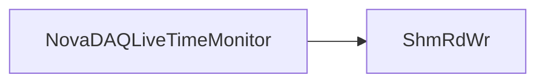

# NovaDAQLiveTimeMonitor

Scrapes ShmRdWrShow statistics and Run Control resource state into livetime logs.

## Identity and scope

Repository: [NovaDAQ/NovaDAQLiveTimeMonitor](https://github.com/NovaDAQ/NovaDAQLiveTimeMonitor) · Reviewed commit: `2fd245adf29cc8fc736221d30625048d50b0a434` · Domain: **Monitoring**.

Tracked files: **4**. Production deployment and owner are **unconfirmed**.

## Operation

Requires the correct SHMRW_KEY, DAQ environment, and .prevRCResources.xml path. Verify active-node count and dropped-buffer units before interpreting livetime. Inspect source loop duration and process/PID handling before treating it as a persistent monitor.

For prerequisites, safe start/stop sequencing, health checks, and rollback see the [operations guide](../operations/index.md).

## Build and integration

This package uses the SRT/SoftRelTools release context. A standalone `make` in a fresh checkout is not a supported build recipe unless the required context is already configured. See [build and release](../operations/build.md).

| Build definition |
| --- |
| [GNUmakefile](https://github.com/NovaDAQ/NovaDAQLiveTimeMonitor/blob/2fd245adf29cc8fc736221d30625048d50b0a434/GNUmakefile) |
| [py/GNUmakefile](https://github.com/NovaDAQ/NovaDAQLiveTimeMonitor/blob/2fd245adf29cc8fc736221d30625048d50b0a434/py/GNUmakefile) |

## Entry points

These are source entry points or operational scripts found statically. Installation names and enabled targets depend on the build/configuration; listing a script does not establish that it is deployed.

| Source |
| --- |
| [py/DAQLiveTimeMonitor.py](https://github.com/NovaDAQ/NovaDAQLiveTimeMonitor/blob/2fd245adf29cc8fc736221d30625048d50b0a434/py/DAQLiveTimeMonitor.py) |

## Interfaces

Headers and declared types form the API navigation map. Follow the source for method signatures, ownership, units, and error contracts. Generated DDS/XSD types are built from the schemas in the next section.

No public C/C++ header was identified in the scoped inventory. Script and schema interfaces are linked elsewhere on this page.

## Configuration and data contracts

No separate XML/IDL/XSD/FHiCL/INI/YAML/JSON configuration was identified. Inspect command-line parsing and site launchers for this package; defaults may be embedded in source.

## Environment and external dependencies

Environment names below are literal lookups found in source, not a guarantee that every value is mandatory. No environment values or credentials are copied into this documentation.

| Variable | Evidence |
| --- | --- |
| `SHMRW_KEY` | [py/DAQLiveTimeMonitor.py:253](https://github.com/NovaDAQ/NovaDAQLiveTimeMonitor/blob/2fd245adf29cc8fc736221d30625048d50b0a434/py/DAQLiveTimeMonitor.py#L253) |

## Package dependencies

Arrow direction is **consumer → dependency**. This diagram includes source/build/runtime relationships and excludes test-only, release-membership, and build-tool edges. Conditional branches are not evaluated.

| Dependency | Relationship | Evidence |
| --- | --- | --- |
| [SRT_ONLINE](SRT_ONLINE.md) | build tool | [GNUmakefile:10](https://github.com/NovaDAQ/NovaDAQLiveTimeMonitor/blob/2fd245adf29cc8fc736221d30625048d50b0a434/GNUmakefile#L10) |
| [ShmRdWr](ShmRdWr.md) | runtime command | [py/DAQLiveTimeMonitor.py:247](https://github.com/NovaDAQ/NovaDAQLiveTimeMonitor/blob/2fd245adf29cc8fc736221d30625048d50b0a434/py/DAQLiveTimeMonitor.py#L247) |

Direct consumers: None resolved in this snapshot.

Explore upstream/downstream impact in the [dependency explorer](../architecture/explorer.md).

## Validation and review

Static analysis attempted **0 C/C++ translation units**, **0 shell scripts**, and parsed **1 Python files**. Counts are tool input coverage, not proof of successful compilation or exhaustive review. Source/build/configuration inventories and the operating surface were also assessed.

No actionable defect was confirmed for this package in this review. This is a bounded review result, not a clean bill of health; unvalidated analyzer diagnostics were not filed as bugs.

Existing test/example sources (not executed against production):

No test/example source identified in the scoped inventory.

## Existing documentation

No package README/manual identified in the scoped inventory. Use this page and the source interfaces above.
