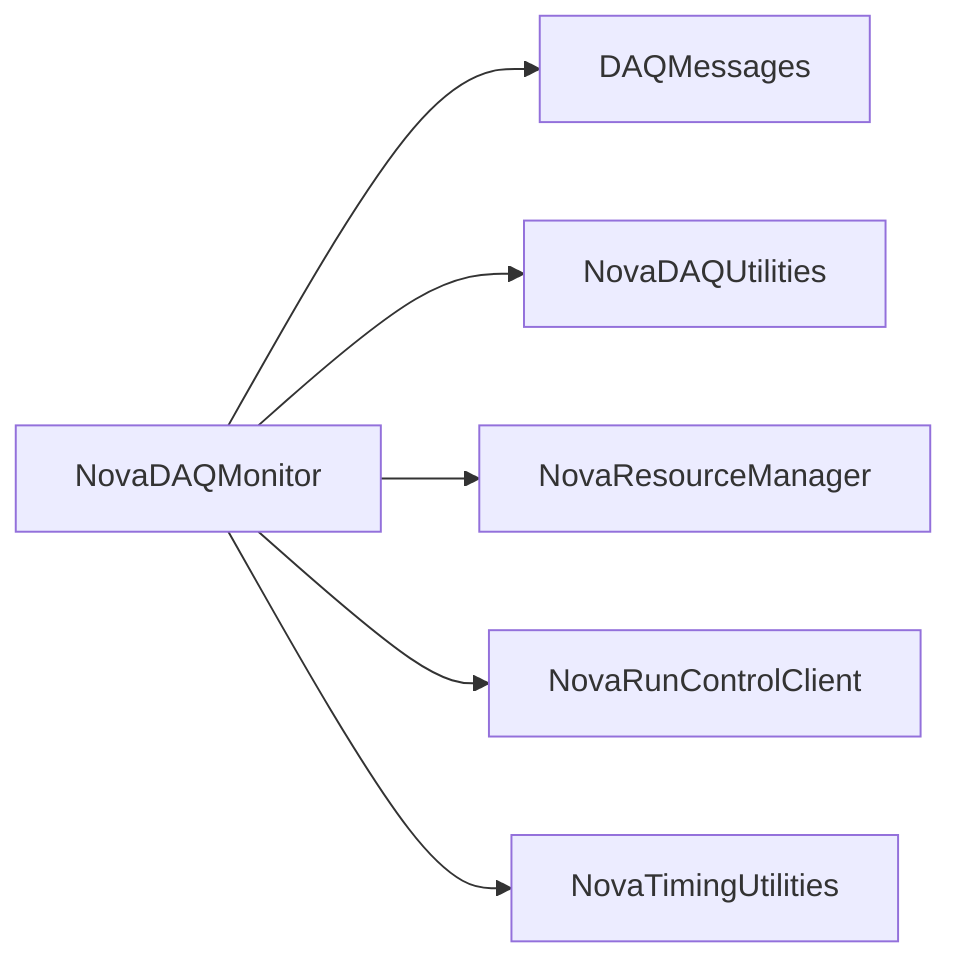

# NovaDAQMonitor

DAQ/cluster monitoring state machine, RRD thresholds, Ganglia integration, and monitoring scripts.

## Identity and scope

Repository: [NovaDAQ/NovaDAQMonitor](https://github.com/NovaDAQ/NovaDAQMonitor) · Reviewed commit: `e0cafc6539ea4dbf3c4cfb26d1149dc57e2d9fd3` · Domain: **Monitoring**.

Tracked files: **2728**. Production deployment and owner are **unconfirmed**.

## Operation

Match partition and expected participants, and check freshness of each upstream monitor. Distinguish unavailable input from an actual threshold violation. Preserve RRD/history files through restart and verify post-restart updates.

For prerequisites, safe start/stop sequencing, health checks, and rollback see the [operations guide](../operations/index.md).

## Build and integration

This package uses the SRT/SoftRelTools release context. A standalone `make` in a fresh checkout is not a supported build recipe unless the required context is already configured. See [build and release](../operations/build.md).

| Build definition |
| --- |
| [GNUmakefile](https://github.com/NovaDAQ/NovaDAQMonitor/blob/e0cafc6539ea4dbf3c4cfb26d1149dc57e2d9fd3/GNUmakefile) |
| [cxx/GNUmakefile](https://github.com/NovaDAQ/NovaDAQMonitor/blob/e0cafc6539ea4dbf3c4cfb26d1149dc57e2d9fd3/cxx/GNUmakefile) |
| [cxx/src/GNUmakefile](https://github.com/NovaDAQ/NovaDAQMonitor/blob/e0cafc6539ea4dbf3c4cfb26d1149dc57e2d9fd3/cxx/src/GNUmakefile) |
| [cxx/unittest/GNUmakefile](https://github.com/NovaDAQ/NovaDAQMonitor/blob/e0cafc6539ea4dbf3c4cfb26d1149dc57e2d9fd3/cxx/unittest/GNUmakefile) |
| [scripts/GNUmakefile](https://github.com/NovaDAQ/NovaDAQMonitor/blob/e0cafc6539ea4dbf3c4cfb26d1149dc57e2d9fd3/scripts/GNUmakefile) |
| [web/Far/DCM/Makefile](https://github.com/NovaDAQ/NovaDAQMonitor/blob/e0cafc6539ea4dbf3c4cfb26d1149dc57e2d9fd3/web/Far/DCM/Makefile) |
| [web/Far/Makefile](https://github.com/NovaDAQ/NovaDAQMonitor/blob/e0cafc6539ea4dbf3c4cfb26d1149dc57e2d9fd3/web/Far/Makefile) |
| [web/NDOS/DCM/Makefile](https://github.com/NovaDAQ/NovaDAQMonitor/blob/e0cafc6539ea4dbf3c4cfb26d1149dc57e2d9fd3/web/NDOS/DCM/Makefile) |
| [web/NDOS/Makefile](https://github.com/NovaDAQ/NovaDAQMonitor/blob/e0cafc6539ea4dbf3c4cfb26d1149dc57e2d9fd3/web/NDOS/Makefile) |
| [web/Near/DCM/Makefile](https://github.com/NovaDAQ/NovaDAQMonitor/blob/e0cafc6539ea4dbf3c4cfb26d1149dc57e2d9fd3/web/Near/DCM/Makefile) |
| [web/Near/Makefile](https://github.com/NovaDAQ/NovaDAQMonitor/blob/e0cafc6539ea4dbf3c4cfb26d1149dc57e2d9fd3/web/Near/Makefile) |
| [web/TestStandFCC/DCM/Makefile](https://github.com/NovaDAQ/NovaDAQMonitor/blob/e0cafc6539ea4dbf3c4cfb26d1149dc57e2d9fd3/web/TestStandFCC/DCM/Makefile) |
| [web/TestStandFCC/Makefile](https://github.com/NovaDAQ/NovaDAQMonitor/blob/e0cafc6539ea4dbf3c4cfb26d1149dc57e2d9fd3/web/TestStandFCC/Makefile) |

## Entry points

These are source entry points or operational scripts found statically. Installation names and enabled targets depend on the build/configuration; listing a script does not establish that it is deployed.

| Source |
| --- |
| [cxx/src/ndmdaqmonitor.cc](https://github.com/NovaDAQ/NovaDAQMonitor/blob/e0cafc6539ea4dbf3c4cfb26d1149dc57e2d9fd3/cxx/src/ndmdaqmonitor.cc) |
| [scripts/dist_gmond_ndos_mgr.sh](https://github.com/NovaDAQ/NovaDAQMonitor/blob/e0cafc6539ea4dbf3c4cfb26d1149dc57e2d9fd3/scripts/dist_gmond_ndos_mgr.sh) |
| [scripts/dist_gmondnova_far_farm.sh](https://github.com/NovaDAQ/NovaDAQMonitor/blob/e0cafc6539ea4dbf3c4cfb26d1149dc57e2d9fd3/scripts/dist_gmondnova_far_farm.sh) |
| [scripts/dist_gmondnova_far_mgr.sh](https://github.com/NovaDAQ/NovaDAQMonitor/blob/e0cafc6539ea4dbf3c4cfb26d1149dc57e2d9fd3/scripts/dist_gmondnova_far_mgr.sh) |
| [scripts/retrans.py](https://github.com/NovaDAQ/NovaDAQMonitor/blob/e0cafc6539ea4dbf3c4cfb26d1149dc57e2d9fd3/scripts/retrans.py) |
| [scripts/start_gmond_dcm.sh](https://github.com/NovaDAQ/NovaDAQMonitor/blob/e0cafc6539ea4dbf3c4cfb26d1149dc57e2d9fd3/scripts/start_gmond_dcm.sh) |
| [scripts/start_gmond_dcm_far.sh](https://github.com/NovaDAQ/NovaDAQMonitor/blob/e0cafc6539ea4dbf3c4cfb26d1149dc57e2d9fd3/scripts/start_gmond_dcm_far.sh) |
| [scripts/start_gmond_dcm_ndos.sh](https://github.com/NovaDAQ/NovaDAQMonitor/blob/e0cafc6539ea4dbf3c4cfb26d1149dc57e2d9fd3/scripts/start_gmond_dcm_ndos.sh) |
| [scripts/start_gmond_dcm_near.sh](https://github.com/NovaDAQ/NovaDAQMonitor/blob/e0cafc6539ea4dbf3c4cfb26d1149dc57e2d9fd3/scripts/start_gmond_dcm_near.sh) |
| [scripts/start_gmond_dcm_ts.sh](https://github.com/NovaDAQ/NovaDAQMonitor/blob/e0cafc6539ea4dbf3c4cfb26d1149dc57e2d9fd3/scripts/start_gmond_dcm_ts.sh) |
| [scripts/start_gmond_tdu.sh](https://github.com/NovaDAQ/NovaDAQMonitor/blob/e0cafc6539ea4dbf3c4cfb26d1149dc57e2d9fd3/scripts/start_gmond_tdu.sh) |

## Interfaces

Headers and declared types form the API navigation map. Follow the source for method signatures, ownership, units, and error contracts. Generated DDS/XSD types are built from the schemas in the next section.

| Header | Declared types |
| --- | --- |
| [cxx/include/Ndm.h](https://github.com/NovaDAQ/NovaDAQMonitor/blob/e0cafc6539ea4dbf3c4cfb26d1149dc57e2d9fd3/cxx/include/Ndm.h) | Functions, constants, or templates |
| [cxx/include/NdmClusterMonitor.h](https://github.com/NovaDAQ/NovaDAQMonitor/blob/e0cafc6539ea4dbf3c4cfb26d1149dc57e2d9fd3/cxx/include/NdmClusterMonitor.h) | `NdmClusterMonitor`, `NdmClusterMonitorTest`, `NdmGroupMonitor` |
| [cxx/include/NdmConfigurationState.h](https://github.com/NovaDAQ/NovaDAQMonitor/blob/e0cafc6539ea4dbf3c4cfb26d1149dc57e2d9fd3/cxx/include/NdmConfigurationState.h) | `NdmConfigurationState`, `NdmConfigurationStateTest` |
| [cxx/include/NdmDaqMonitor.h](https://github.com/NovaDAQ/NovaDAQMonitor/blob/e0cafc6539ea4dbf3c4cfb26d1149dc57e2d9fd3/cxx/include/NdmDaqMonitor.h) | `NdmClusterMonitor`, `NdmDaqMonitor`, `NdmDaqMonitorTest` |
| [cxx/include/NdmDirector.h](https://github.com/NovaDAQ/NovaDAQMonitor/blob/e0cafc6539ea4dbf3c4cfb26d1149dc57e2d9fd3/cxx/include/NdmDirector.h) | `NdmDirector`, `NdmDirectorTest` |
| [cxx/include/NdmGroupMonitor.h](https://github.com/NovaDAQ/NovaDAQMonitor/blob/e0cafc6539ea4dbf3c4cfb26d1149dc57e2d9fd3/cxx/include/NdmGroupMonitor.h) | `NdmGroupMonitor`, `NdmGroupMonitorTest`, `NdmNodeMonitor` |
| [cxx/include/NdmMonitorRRDThresh.h](https://github.com/NovaDAQ/NovaDAQMonitor/blob/e0cafc6539ea4dbf3c4cfb26d1149dc57e2d9fd3/cxx/include/NdmMonitorRRDThresh.h) | `NdmMonitorRRDThresh`, `tm` |
| [cxx/include/NdmNodeMonitor.h](https://github.com/NovaDAQ/NovaDAQMonitor/blob/e0cafc6539ea4dbf3c4cfb26d1149dc57e2d9fd3/cxx/include/NdmNodeMonitor.h) | `NdmMonitorRRDThresh`, `NdmNodeMonitor`, `NdmNodeMonitorTest` |
| [cxx/include/NdmParticipantsSetState.h](https://github.com/NovaDAQ/NovaDAQMonitor/blob/e0cafc6539ea4dbf3c4cfb26d1149dc57e2d9fd3/cxx/include/NdmParticipantsSetState.h) | `NdmParticipantsSetState`, `NdmParticipantsSetStateTest` |
| [cxx/include/NdmPartitionEstablishedState.h](https://github.com/NovaDAQ/NovaDAQMonitor/blob/e0cafc6539ea4dbf3c4cfb26d1149dc57e2d9fd3/cxx/include/NdmPartitionEstablishedState.h) | `NdmPartitionEstablishedState`, `NdmPartitionEstablishedStateTest` |
| [cxx/include/NdmRunPausedState.h](https://github.com/NovaDAQ/NovaDAQMonitor/blob/e0cafc6539ea4dbf3c4cfb26d1149dc57e2d9fd3/cxx/include/NdmRunPausedState.h) | `NdmRunPausedState`, `NdmRunPausedStateTest` |
| [cxx/include/NdmRunningState.h](https://github.com/NovaDAQ/NovaDAQMonitor/blob/e0cafc6539ea4dbf3c4cfb26d1149dc57e2d9fd3/cxx/include/NdmRunningState.h) | `NdmRunningState`, `NdmRunningStateTest` |
| [cxx/include/NdmStateBase.h](https://github.com/NovaDAQ/NovaDAQMonitor/blob/e0cafc6539ea4dbf3c4cfb26d1149dc57e2d9fd3/cxx/include/NdmStateBase.h) | `NdmConfigurationState`, `NdmParticipantsSetState`, `NdmPartitionEstablishedState`, `NdmRunPausedState`, `NdmRunningState`, `NdmStateBase`, `NdmStateMachine` |
| [cxx/include/NdmStateMachine.h](https://github.com/NovaDAQ/NovaDAQMonitor/blob/e0cafc6539ea4dbf3c4cfb26d1149dc57e2d9fd3/cxx/include/NdmStateMachine.h) | `NdmStateMachine` |

## Configuration and data contracts

| Source artifact |
| --- |
| [config/NDOS/Partition0/ConfigurationManager.xml](https://github.com/NovaDAQ/NovaDAQMonitor/blob/e0cafc6539ea4dbf3c4cfb26d1149dc57e2d9fd3/config/NDOS/Partition0/ConfigurationManager.xml) |
| [config/NDOS/Partition0/DDTManager.xml](https://github.com/NovaDAQ/NovaDAQMonitor/blob/e0cafc6539ea4dbf3c4cfb26d1149dc57e2d9fd3/config/NDOS/Partition0/DDTManager.xml) |
| [config/NDOS/Partition0/DaqMonitor.xml](https://github.com/NovaDAQ/NovaDAQMonitor/blob/e0cafc6539ea4dbf3c4cfb26d1149dc57e2d9fd3/config/NDOS/Partition0/DaqMonitor.xml) |
| [config/NDOS/Partition0/DataLogger.xml](https://github.com/NovaDAQ/NovaDAQMonitor/blob/e0cafc6539ea4dbf3c4cfb26d1149dc57e2d9fd3/config/NDOS/Partition0/DataLogger.xml) |
| [config/NDOS/Partition0/EventDispatcher.xml](https://github.com/NovaDAQ/NovaDAQMonitor/blob/e0cafc6539ea4dbf3c4cfb26d1149dc57e2d9fd3/config/NDOS/Partition0/EventDispatcher.xml) |
| [config/NDOS/Partition0/GlobalTrigger.xml](https://github.com/NovaDAQ/NovaDAQMonitor/blob/e0cafc6539ea4dbf3c4cfb26d1149dc57e2d9fd3/config/NDOS/Partition0/GlobalTrigger.xml) |
| [config/NDOS/Partition0/MessageAnalyzer.xml](https://github.com/NovaDAQ/NovaDAQMonitor/blob/e0cafc6539ea4dbf3c4cfb26d1149dc57e2d9fd3/config/NDOS/Partition0/MessageAnalyzer.xml) |
| [config/NDOS/Partition0/MessageFacilityServer.xml](https://github.com/NovaDAQ/NovaDAQMonitor/blob/e0cafc6539ea4dbf3c4cfb26d1149dc57e2d9fd3/config/NDOS/Partition0/MessageFacilityServer.xml) |
| [config/NDOS/Partition0/MessageViewer.xml](https://github.com/NovaDAQ/NovaDAQMonitor/blob/e0cafc6539ea4dbf3c4cfb26d1149dc57e2d9fd3/config/NDOS/Partition0/MessageViewer.xml) |
| [config/NDOS/Partition0/RunControlServer.xml](https://github.com/NovaDAQ/NovaDAQMonitor/blob/e0cafc6539ea4dbf3c4cfb26d1149dc57e2d9fd3/config/NDOS/Partition0/RunControlServer.xml) |
| [config/NDOS/Partition0/SpillServer.xml](https://github.com/NovaDAQ/NovaDAQMonitor/blob/e0cafc6539ea4dbf3c4cfb26d1149dc57e2d9fd3/config/NDOS/Partition0/SpillServer.xml) |
| [config/NDOS/Partition0/TDUManager.xml](https://github.com/NovaDAQ/NovaDAQMonitor/blob/e0cafc6539ea4dbf3c4cfb26d1149dc57e2d9fd3/config/NDOS/Partition0/TDUManager.xml) |
| [config/NDOS/Partition0/TriggerScalars.xml](https://github.com/NovaDAQ/NovaDAQMonitor/blob/e0cafc6539ea4dbf3c4cfb26d1149dc57e2d9fd3/config/NDOS/Partition0/TriggerScalars.xml) |
| [config/NDOS/Partition0/bnevb001.xml](https://github.com/NovaDAQ/NovaDAQMonitor/blob/e0cafc6539ea4dbf3c4cfb26d1149dc57e2d9fd3/config/NDOS/Partition0/bnevb001.xml) |
| [config/NDOS/Partition0/bnevb002.xml](https://github.com/NovaDAQ/NovaDAQMonitor/blob/e0cafc6539ea4dbf3c4cfb26d1149dc57e2d9fd3/config/NDOS/Partition0/bnevb002.xml) |
| [config/NDOS/Partition0/bnevb003.xml](https://github.com/NovaDAQ/NovaDAQMonitor/blob/e0cafc6539ea4dbf3c4cfb26d1149dc57e2d9fd3/config/NDOS/Partition0/bnevb003.xml) |
| [config/NDOS/Partition0/bnevb004.xml](https://github.com/NovaDAQ/NovaDAQMonitor/blob/e0cafc6539ea4dbf3c4cfb26d1149dc57e2d9fd3/config/NDOS/Partition0/bnevb004.xml) |
| [config/NDOS/Partition0/bnevb005.xml](https://github.com/NovaDAQ/NovaDAQMonitor/blob/e0cafc6539ea4dbf3c4cfb26d1149dc57e2d9fd3/config/NDOS/Partition0/bnevb005.xml) |
| [config/NDOS/Partition0/bnevb006.xml](https://github.com/NovaDAQ/NovaDAQMonitor/blob/e0cafc6539ea4dbf3c4cfb26d1149dc57e2d9fd3/config/NDOS/Partition0/bnevb006.xml) |
| [config/NDOS/Partition0/bnevb007.xml](https://github.com/NovaDAQ/NovaDAQMonitor/blob/e0cafc6539ea4dbf3c4cfb26d1149dc57e2d9fd3/config/NDOS/Partition0/bnevb007.xml) |
| [config/NDOS/Partition0/bnevb008.xml](https://github.com/NovaDAQ/NovaDAQMonitor/blob/e0cafc6539ea4dbf3c4cfb26d1149dc57e2d9fd3/config/NDOS/Partition0/bnevb008.xml) |
| [config/NDOS/Partition0/bnevb009.xml](https://github.com/NovaDAQ/NovaDAQMonitor/blob/e0cafc6539ea4dbf3c4cfb26d1149dc57e2d9fd3/config/NDOS/Partition0/bnevb009.xml) |
| [config/NDOS/Partition0/bnevb010.xml](https://github.com/NovaDAQ/NovaDAQMonitor/blob/e0cafc6539ea4dbf3c4cfb26d1149dc57e2d9fd3/config/NDOS/Partition0/bnevb010.xml) |
| [config/NDOS/Partition0/bnevb011.xml](https://github.com/NovaDAQ/NovaDAQMonitor/blob/e0cafc6539ea4dbf3c4cfb26d1149dc57e2d9fd3/config/NDOS/Partition0/bnevb011.xml) |
| [config/NDOS/Partition0/bnevb012.xml](https://github.com/NovaDAQ/NovaDAQMonitor/blob/e0cafc6539ea4dbf3c4cfb26d1149dc57e2d9fd3/config/NDOS/Partition0/bnevb012.xml) |
| [config/NDOS/Partition0/cluster_DCM.xml](https://github.com/NovaDAQ/NovaDAQMonitor/blob/e0cafc6539ea4dbf3c4cfb26d1149dc57e2d9fd3/config/NDOS/Partition0/cluster_DCM.xml) |
| [config/NDOS/Partition0/cluster_Farm.xml](https://github.com/NovaDAQ/NovaDAQMonitor/blob/e0cafc6539ea4dbf3c4cfb26d1149dc57e2d9fd3/config/NDOS/Partition0/cluster_Farm.xml) |
| [config/NDOS/Partition0/cluster_Manager.xml](https://github.com/NovaDAQ/NovaDAQMonitor/blob/e0cafc6539ea4dbf3c4cfb26d1149dc57e2d9fd3/config/NDOS/Partition0/cluster_Manager.xml) |
| [config/NDOS/Partition0/dcm-3-01-01.xml](https://github.com/NovaDAQ/NovaDAQMonitor/blob/e0cafc6539ea4dbf3c4cfb26d1149dc57e2d9fd3/config/NDOS/Partition0/dcm-3-01-01.xml) |
| [config/NDOS/Partition0/dcm-3-01-02.xml](https://github.com/NovaDAQ/NovaDAQMonitor/blob/e0cafc6539ea4dbf3c4cfb26d1149dc57e2d9fd3/config/NDOS/Partition0/dcm-3-01-02.xml) |
| [config/NDOS/Partition0/dcm-3-01-03.xml](https://github.com/NovaDAQ/NovaDAQMonitor/blob/e0cafc6539ea4dbf3c4cfb26d1149dc57e2d9fd3/config/NDOS/Partition0/dcm-3-01-03.xml) |
| [config/NDOS/Partition0/dcm-3-02-01.xml](https://github.com/NovaDAQ/NovaDAQMonitor/blob/e0cafc6539ea4dbf3c4cfb26d1149dc57e2d9fd3/config/NDOS/Partition0/dcm-3-02-01.xml) |
| [config/NDOS/Partition0/dcm-3-02-02.xml](https://github.com/NovaDAQ/NovaDAQMonitor/blob/e0cafc6539ea4dbf3c4cfb26d1149dc57e2d9fd3/config/NDOS/Partition0/dcm-3-02-02.xml) |
| [config/NDOS/Partition0/dcm-3-02-03.xml](https://github.com/NovaDAQ/NovaDAQMonitor/blob/e0cafc6539ea4dbf3c4cfb26d1149dc57e2d9fd3/config/NDOS/Partition0/dcm-3-02-03.xml) |
| [config/NDOS/Partition0/dcm-3-03-01.xml](https://github.com/NovaDAQ/NovaDAQMonitor/blob/e0cafc6539ea4dbf3c4cfb26d1149dc57e2d9fd3/config/NDOS/Partition0/dcm-3-03-01.xml) |
| [config/NDOS/Partition0/dcm-3-03-02.xml](https://github.com/NovaDAQ/NovaDAQMonitor/blob/e0cafc6539ea4dbf3c4cfb26d1149dc57e2d9fd3/config/NDOS/Partition0/dcm-3-03-02.xml) |
| [config/NDOS/Partition0/default.xml](https://github.com/NovaDAQ/NovaDAQMonitor/blob/e0cafc6539ea4dbf3c4cfb26d1149dc57e2d9fd3/config/NDOS/Partition0/default.xml) |
| [config/NDOS/Partition0/group_bnevb_001_008.xml](https://github.com/NovaDAQ/NovaDAQMonitor/blob/e0cafc6539ea4dbf3c4cfb26d1149dc57e2d9fd3/config/NDOS/Partition0/group_bnevb_001_008.xml) |
| [config/NDOS/Partition0/group_bnevb_009_016.xml](https://github.com/NovaDAQ/NovaDAQMonitor/blob/e0cafc6539ea4dbf3c4cfb26d1149dc57e2d9fd3/config/NDOS/Partition0/group_bnevb_009_016.xml) |
| [config/NDOS/Partition0/group_dcm_db01.xml](https://github.com/NovaDAQ/NovaDAQMonitor/blob/e0cafc6539ea4dbf3c4cfb26d1149dc57e2d9fd3/config/NDOS/Partition0/group_dcm_db01.xml) |
| [config/NDOS/Partition0/group_dcm_db02.xml](https://github.com/NovaDAQ/NovaDAQMonitor/blob/e0cafc6539ea4dbf3c4cfb26d1149dc57e2d9fd3/config/NDOS/Partition0/group_dcm_db02.xml) |
| [config/NDOS/Partition0/group_dcm_db03.xml](https://github.com/NovaDAQ/NovaDAQMonitor/blob/e0cafc6539ea4dbf3c4cfb26d1149dc57e2d9fd3/config/NDOS/Partition0/group_dcm_db03.xml) |
| [config/NDOSDAQResources.xml](https://github.com/NovaDAQ/NovaDAQMonitor/blob/e0cafc6539ea4dbf3c4cfb26d1149dc57e2d9fd3/config/NDOSDAQResources.xml) |
| [config/NdmConfiguration.xml](https://github.com/NovaDAQ/NovaDAQMonitor/blob/e0cafc6539ea4dbf3c4cfb26d1149dc57e2d9fd3/config/NdmConfiguration.xml) |
| [config/NdmConfiguration.xsd](https://github.com/NovaDAQ/NovaDAQMonitor/blob/e0cafc6539ea4dbf3c4cfb26d1149dc57e2d9fd3/config/NdmConfiguration.xsd) |
| [config/NdmThresholdList.xsd](https://github.com/NovaDAQ/NovaDAQMonitor/blob/e0cafc6539ea4dbf3c4cfb26d1149dc57e2d9fd3/config/NdmThresholdList.xsd) |
| [config/unittest/NdmTestConfig.xml](https://github.com/NovaDAQ/NovaDAQMonitor/blob/e0cafc6539ea4dbf3c4cfb26d1149dc57e2d9fd3/config/unittest/NdmTestConfig.xml) |
| [scripts/gmond_ndos_mgr.conf](https://github.com/NovaDAQ/NovaDAQMonitor/blob/e0cafc6539ea4dbf3c4cfb26d1149dc57e2d9fd3/scripts/gmond_ndos_mgr.conf) |
| [scripts/gmond_nova_farm.conf](https://github.com/NovaDAQ/NovaDAQMonitor/blob/e0cafc6539ea4dbf3c4cfb26d1149dc57e2d9fd3/scripts/gmond_nova_farm.conf) |
| [scripts/gmond_nova_mgr.conf](https://github.com/NovaDAQ/NovaDAQMonitor/blob/e0cafc6539ea4dbf3c4cfb26d1149dc57e2d9fd3/scripts/gmond_nova_mgr.conf) |
| [web/Far/DCM/conf/cluster_DCM.json](https://github.com/NovaDAQ/NovaDAQMonitor/blob/e0cafc6539ea4dbf3c4cfb26d1149dc57e2d9fd3/web/Far/DCM/conf/cluster_DCM.json) |
| [web/Far/DCM/conf/default.json](https://github.com/NovaDAQ/NovaDAQMonitor/blob/e0cafc6539ea4dbf3c4cfb26d1149dc57e2d9fd3/web/Far/DCM/conf/default.json) |
| [web/Far/DCM/conf/view_default.json](https://github.com/NovaDAQ/NovaDAQMonitor/blob/e0cafc6539ea4dbf3c4cfb26d1149dc57e2d9fd3/web/Far/DCM/conf/view_default.json) |
| [web/Far/DCM/graph.d/corruptmicroslice_report.json](https://github.com/NovaDAQ/NovaDAQMonitor/blob/e0cafc6539ea4dbf3c4cfb26d1149dc57e2d9fd3/web/Far/DCM/graph.d/corruptmicroslice_report.json) |
| [web/Far/DCM/graph.d/cpu_report.json](https://github.com/NovaDAQ/NovaDAQMonitor/blob/e0cafc6539ea4dbf3c4cfb26d1149dc57e2d9fd3/web/Far/DCM/graph.d/cpu_report.json) |
| [web/Far/DCM/graph.d/load_all_report.json](https://github.com/NovaDAQ/NovaDAQMonitor/blob/e0cafc6539ea4dbf3c4cfb26d1149dc57e2d9fd3/web/Far/DCM/graph.d/load_all_report.json) |
| [web/Far/DCM/graph.d/load_report.json](https://github.com/NovaDAQ/NovaDAQMonitor/blob/e0cafc6539ea4dbf3c4cfb26d1149dc57e2d9fd3/web/Far/DCM/graph.d/load_report.json) |
| [web/Far/DCM/graph.d/mem_report.json](https://github.com/NovaDAQ/NovaDAQMonitor/blob/e0cafc6539ea4dbf3c4cfb26d1149dc57e2d9fd3/web/Far/DCM/graph.d/mem_report.json) |
| [web/Far/DCM/graph.d/microslicerate_report.json](https://github.com/NovaDAQ/NovaDAQMonitor/blob/e0cafc6539ea4dbf3c4cfb26d1149dc57e2d9fd3/web/Far/DCM/graph.d/microslicerate_report.json) |
| [web/Far/DCM/graph.d/network_report.json](https://github.com/NovaDAQ/NovaDAQMonitor/blob/e0cafc6539ea4dbf3c4cfb26d1149dc57e2d9fd3/web/Far/DCM/graph.d/network_report.json) |
| [web/Far/DCM/graph.d/packet_report.json](https://github.com/NovaDAQ/NovaDAQMonitor/blob/e0cafc6539ea4dbf3c4cfb26d1149dc57e2d9fd3/web/Far/DCM/graph.d/packet_report.json) |
| [web/Far/DCM/graph.d/partitionactivity_report.json](https://github.com/NovaDAQ/NovaDAQMonitor/blob/e0cafc6539ea4dbf3c4cfb26d1149dc57e2d9fd3/web/Far/DCM/graph.d/partitionactivity_report.json) |
| [web/Far/conf/cluster_DCM.json](https://github.com/NovaDAQ/NovaDAQMonitor/blob/e0cafc6539ea4dbf3c4cfb26d1149dc57e2d9fd3/web/Far/conf/cluster_DCM.json) |
| [web/Far/conf/default.json](https://github.com/NovaDAQ/NovaDAQMonitor/blob/e0cafc6539ea4dbf3c4cfb26d1149dc57e2d9fd3/web/Far/conf/default.json) |
| [web/Far/conf/view_default.json](https://github.com/NovaDAQ/NovaDAQMonitor/blob/e0cafc6539ea4dbf3c4cfb26d1149dc57e2d9fd3/web/Far/conf/view_default.json) |
| [web/Far/graph.d/corruptmicroslice_report.json](https://github.com/NovaDAQ/NovaDAQMonitor/blob/e0cafc6539ea4dbf3c4cfb26d1149dc57e2d9fd3/web/Far/graph.d/corruptmicroslice_report.json) |
| [web/Far/graph.d/cpu_report.json](https://github.com/NovaDAQ/NovaDAQMonitor/blob/e0cafc6539ea4dbf3c4cfb26d1149dc57e2d9fd3/web/Far/graph.d/cpu_report.json) |
| [web/Far/graph.d/load_all_report.json](https://github.com/NovaDAQ/NovaDAQMonitor/blob/e0cafc6539ea4dbf3c4cfb26d1149dc57e2d9fd3/web/Far/graph.d/load_all_report.json) |
| [web/Far/graph.d/load_report.json](https://github.com/NovaDAQ/NovaDAQMonitor/blob/e0cafc6539ea4dbf3c4cfb26d1149dc57e2d9fd3/web/Far/graph.d/load_report.json) |
| [web/Far/graph.d/mem_report.json](https://github.com/NovaDAQ/NovaDAQMonitor/blob/e0cafc6539ea4dbf3c4cfb26d1149dc57e2d9fd3/web/Far/graph.d/mem_report.json) |
| [web/Far/graph.d/network_report.json](https://github.com/NovaDAQ/NovaDAQMonitor/blob/e0cafc6539ea4dbf3c4cfb26d1149dc57e2d9fd3/web/Far/graph.d/network_report.json) |
| [web/Far/graph.d/packet_report.json](https://github.com/NovaDAQ/NovaDAQMonitor/blob/e0cafc6539ea4dbf3c4cfb26d1149dc57e2d9fd3/web/Far/graph.d/packet_report.json) |
| [web/Far/graph.d/partitionactivity_report.json](https://github.com/NovaDAQ/NovaDAQMonitor/blob/e0cafc6539ea4dbf3c4cfb26d1149dc57e2d9fd3/web/Far/graph.d/partitionactivity_report.json) |
| [web/NDOS/DCM/conf/cluster_DCM.json](https://github.com/NovaDAQ/NovaDAQMonitor/blob/e0cafc6539ea4dbf3c4cfb26d1149dc57e2d9fd3/web/NDOS/DCM/conf/cluster_DCM.json) |
| [web/NDOS/DCM/conf/default.json](https://github.com/NovaDAQ/NovaDAQMonitor/blob/e0cafc6539ea4dbf3c4cfb26d1149dc57e2d9fd3/web/NDOS/DCM/conf/default.json) |
| [web/NDOS/DCM/conf/view_default.json](https://github.com/NovaDAQ/NovaDAQMonitor/blob/e0cafc6539ea4dbf3c4cfb26d1149dc57e2d9fd3/web/NDOS/DCM/conf/view_default.json) |
| [web/NDOS/DCM/graph.d/corruptmicroslice_report.json](https://github.com/NovaDAQ/NovaDAQMonitor/blob/e0cafc6539ea4dbf3c4cfb26d1149dc57e2d9fd3/web/NDOS/DCM/graph.d/corruptmicroslice_report.json) |
| [web/NDOS/DCM/graph.d/cpu_report.json](https://github.com/NovaDAQ/NovaDAQMonitor/blob/e0cafc6539ea4dbf3c4cfb26d1149dc57e2d9fd3/web/NDOS/DCM/graph.d/cpu_report.json) |
| [web/NDOS/DCM/graph.d/load_all_report.json](https://github.com/NovaDAQ/NovaDAQMonitor/blob/e0cafc6539ea4dbf3c4cfb26d1149dc57e2d9fd3/web/NDOS/DCM/graph.d/load_all_report.json) |
| [web/NDOS/DCM/graph.d/load_report.json](https://github.com/NovaDAQ/NovaDAQMonitor/blob/e0cafc6539ea4dbf3c4cfb26d1149dc57e2d9fd3/web/NDOS/DCM/graph.d/load_report.json) |
| [web/NDOS/DCM/graph.d/mem_report.json](https://github.com/NovaDAQ/NovaDAQMonitor/blob/e0cafc6539ea4dbf3c4cfb26d1149dc57e2d9fd3/web/NDOS/DCM/graph.d/mem_report.json) |
| [web/NDOS/DCM/graph.d/microslicerate_report.json](https://github.com/NovaDAQ/NovaDAQMonitor/blob/e0cafc6539ea4dbf3c4cfb26d1149dc57e2d9fd3/web/NDOS/DCM/graph.d/microslicerate_report.json) |
| [web/NDOS/DCM/graph.d/network_report.json](https://github.com/NovaDAQ/NovaDAQMonitor/blob/e0cafc6539ea4dbf3c4cfb26d1149dc57e2d9fd3/web/NDOS/DCM/graph.d/network_report.json) |
| [web/NDOS/DCM/graph.d/packet_report.json](https://github.com/NovaDAQ/NovaDAQMonitor/blob/e0cafc6539ea4dbf3c4cfb26d1149dc57e2d9fd3/web/NDOS/DCM/graph.d/packet_report.json) |
| [web/NDOS/DCM/graph.d/partitionactivity_report.json](https://github.com/NovaDAQ/NovaDAQMonitor/blob/e0cafc6539ea4dbf3c4cfb26d1149dc57e2d9fd3/web/NDOS/DCM/graph.d/partitionactivity_report.json) |
| [web/NDOS/conf/cluster_DCM.json](https://github.com/NovaDAQ/NovaDAQMonitor/blob/e0cafc6539ea4dbf3c4cfb26d1149dc57e2d9fd3/web/NDOS/conf/cluster_DCM.json) |
| [web/NDOS/conf/default.json](https://github.com/NovaDAQ/NovaDAQMonitor/blob/e0cafc6539ea4dbf3c4cfb26d1149dc57e2d9fd3/web/NDOS/conf/default.json) |
| [web/NDOS/conf/view_default.json](https://github.com/NovaDAQ/NovaDAQMonitor/blob/e0cafc6539ea4dbf3c4cfb26d1149dc57e2d9fd3/web/NDOS/conf/view_default.json) |
| [web/NDOS/graph.d/corruptmicroslice_report.json](https://github.com/NovaDAQ/NovaDAQMonitor/blob/e0cafc6539ea4dbf3c4cfb26d1149dc57e2d9fd3/web/NDOS/graph.d/corruptmicroslice_report.json) |
| [web/NDOS/graph.d/cpu_report.json](https://github.com/NovaDAQ/NovaDAQMonitor/blob/e0cafc6539ea4dbf3c4cfb26d1149dc57e2d9fd3/web/NDOS/graph.d/cpu_report.json) |
| [web/NDOS/graph.d/load_all_report.json](https://github.com/NovaDAQ/NovaDAQMonitor/blob/e0cafc6539ea4dbf3c4cfb26d1149dc57e2d9fd3/web/NDOS/graph.d/load_all_report.json) |
| [web/NDOS/graph.d/load_report.json](https://github.com/NovaDAQ/NovaDAQMonitor/blob/e0cafc6539ea4dbf3c4cfb26d1149dc57e2d9fd3/web/NDOS/graph.d/load_report.json) |
| [web/NDOS/graph.d/mem_report.json](https://github.com/NovaDAQ/NovaDAQMonitor/blob/e0cafc6539ea4dbf3c4cfb26d1149dc57e2d9fd3/web/NDOS/graph.d/mem_report.json) |
| [web/NDOS/graph.d/network_report.json](https://github.com/NovaDAQ/NovaDAQMonitor/blob/e0cafc6539ea4dbf3c4cfb26d1149dc57e2d9fd3/web/NDOS/graph.d/network_report.json) |
| [web/NDOS/graph.d/packet_report.json](https://github.com/NovaDAQ/NovaDAQMonitor/blob/e0cafc6539ea4dbf3c4cfb26d1149dc57e2d9fd3/web/NDOS/graph.d/packet_report.json) |
| [web/NDOS/graph.d/partitionactivity_report.json](https://github.com/NovaDAQ/NovaDAQMonitor/blob/e0cafc6539ea4dbf3c4cfb26d1149dc57e2d9fd3/web/NDOS/graph.d/partitionactivity_report.json) |
| [web/Near/DCM/conf/cluster_DCM.json](https://github.com/NovaDAQ/NovaDAQMonitor/blob/e0cafc6539ea4dbf3c4cfb26d1149dc57e2d9fd3/web/Near/DCM/conf/cluster_DCM.json) |
| [web/Near/DCM/conf/default.json](https://github.com/NovaDAQ/NovaDAQMonitor/blob/e0cafc6539ea4dbf3c4cfb26d1149dc57e2d9fd3/web/Near/DCM/conf/default.json) |
| [web/Near/DCM/conf/view_default.json](https://github.com/NovaDAQ/NovaDAQMonitor/blob/e0cafc6539ea4dbf3c4cfb26d1149dc57e2d9fd3/web/Near/DCM/conf/view_default.json) |
| [web/Near/DCM/graph.d/corruptmicroslice_report.json](https://github.com/NovaDAQ/NovaDAQMonitor/blob/e0cafc6539ea4dbf3c4cfb26d1149dc57e2d9fd3/web/Near/DCM/graph.d/corruptmicroslice_report.json) |
| [web/Near/DCM/graph.d/cpu_report.json](https://github.com/NovaDAQ/NovaDAQMonitor/blob/e0cafc6539ea4dbf3c4cfb26d1149dc57e2d9fd3/web/Near/DCM/graph.d/cpu_report.json) |
| [web/Near/DCM/graph.d/load_all_report.json](https://github.com/NovaDAQ/NovaDAQMonitor/blob/e0cafc6539ea4dbf3c4cfb26d1149dc57e2d9fd3/web/Near/DCM/graph.d/load_all_report.json) |
| [web/Near/DCM/graph.d/load_report.json](https://github.com/NovaDAQ/NovaDAQMonitor/blob/e0cafc6539ea4dbf3c4cfb26d1149dc57e2d9fd3/web/Near/DCM/graph.d/load_report.json) |
| [web/Near/DCM/graph.d/mem_report.json](https://github.com/NovaDAQ/NovaDAQMonitor/blob/e0cafc6539ea4dbf3c4cfb26d1149dc57e2d9fd3/web/Near/DCM/graph.d/mem_report.json) |
| [web/Near/DCM/graph.d/microslicerate_report.json](https://github.com/NovaDAQ/NovaDAQMonitor/blob/e0cafc6539ea4dbf3c4cfb26d1149dc57e2d9fd3/web/Near/DCM/graph.d/microslicerate_report.json) |
| [web/Near/DCM/graph.d/network_report.json](https://github.com/NovaDAQ/NovaDAQMonitor/blob/e0cafc6539ea4dbf3c4cfb26d1149dc57e2d9fd3/web/Near/DCM/graph.d/network_report.json) |
| [web/Near/DCM/graph.d/packet_report.json](https://github.com/NovaDAQ/NovaDAQMonitor/blob/e0cafc6539ea4dbf3c4cfb26d1149dc57e2d9fd3/web/Near/DCM/graph.d/packet_report.json) |
| [web/Near/DCM/graph.d/partitionactivity_report.json](https://github.com/NovaDAQ/NovaDAQMonitor/blob/e0cafc6539ea4dbf3c4cfb26d1149dc57e2d9fd3/web/Near/DCM/graph.d/partitionactivity_report.json) |
| [web/Near/conf/cluster_DCM.json](https://github.com/NovaDAQ/NovaDAQMonitor/blob/e0cafc6539ea4dbf3c4cfb26d1149dc57e2d9fd3/web/Near/conf/cluster_DCM.json) |
| [web/Near/conf/default.json](https://github.com/NovaDAQ/NovaDAQMonitor/blob/e0cafc6539ea4dbf3c4cfb26d1149dc57e2d9fd3/web/Near/conf/default.json) |
| [web/Near/conf/view_default.json](https://github.com/NovaDAQ/NovaDAQMonitor/blob/e0cafc6539ea4dbf3c4cfb26d1149dc57e2d9fd3/web/Near/conf/view_default.json) |
| [web/Near/graph.d/corruptmicroslice_report.json](https://github.com/NovaDAQ/NovaDAQMonitor/blob/e0cafc6539ea4dbf3c4cfb26d1149dc57e2d9fd3/web/Near/graph.d/corruptmicroslice_report.json) |
| [web/Near/graph.d/cpu_report.json](https://github.com/NovaDAQ/NovaDAQMonitor/blob/e0cafc6539ea4dbf3c4cfb26d1149dc57e2d9fd3/web/Near/graph.d/cpu_report.json) |
| [web/Near/graph.d/load_all_report.json](https://github.com/NovaDAQ/NovaDAQMonitor/blob/e0cafc6539ea4dbf3c4cfb26d1149dc57e2d9fd3/web/Near/graph.d/load_all_report.json) |
| [web/Near/graph.d/load_report.json](https://github.com/NovaDAQ/NovaDAQMonitor/blob/e0cafc6539ea4dbf3c4cfb26d1149dc57e2d9fd3/web/Near/graph.d/load_report.json) |
| [web/Near/graph.d/mem_report.json](https://github.com/NovaDAQ/NovaDAQMonitor/blob/e0cafc6539ea4dbf3c4cfb26d1149dc57e2d9fd3/web/Near/graph.d/mem_report.json) |
| [web/Near/graph.d/network_report.json](https://github.com/NovaDAQ/NovaDAQMonitor/blob/e0cafc6539ea4dbf3c4cfb26d1149dc57e2d9fd3/web/Near/graph.d/network_report.json) |
| [web/Near/graph.d/packet_report.json](https://github.com/NovaDAQ/NovaDAQMonitor/blob/e0cafc6539ea4dbf3c4cfb26d1149dc57e2d9fd3/web/Near/graph.d/packet_report.json) |
| [web/Near/graph.d/partitionactivity_report.json](https://github.com/NovaDAQ/NovaDAQMonitor/blob/e0cafc6539ea4dbf3c4cfb26d1149dc57e2d9fd3/web/Near/graph.d/partitionactivity_report.json) |
| [web/TestStandFCC/DCM/conf/cluster_DCM.json](https://github.com/NovaDAQ/NovaDAQMonitor/blob/e0cafc6539ea4dbf3c4cfb26d1149dc57e2d9fd3/web/TestStandFCC/DCM/conf/cluster_DCM.json) |
| [web/TestStandFCC/DCM/conf/default.json](https://github.com/NovaDAQ/NovaDAQMonitor/blob/e0cafc6539ea4dbf3c4cfb26d1149dc57e2d9fd3/web/TestStandFCC/DCM/conf/default.json) |
| [web/TestStandFCC/DCM/conf/view_default.json](https://github.com/NovaDAQ/NovaDAQMonitor/blob/e0cafc6539ea4dbf3c4cfb26d1149dc57e2d9fd3/web/TestStandFCC/DCM/conf/view_default.json) |
| [web/TestStandFCC/DCM/graph.d/corruptmicroslice_report.json](https://github.com/NovaDAQ/NovaDAQMonitor/blob/e0cafc6539ea4dbf3c4cfb26d1149dc57e2d9fd3/web/TestStandFCC/DCM/graph.d/corruptmicroslice_report.json) |
| [web/TestStandFCC/DCM/graph.d/cpu_report.json](https://github.com/NovaDAQ/NovaDAQMonitor/blob/e0cafc6539ea4dbf3c4cfb26d1149dc57e2d9fd3/web/TestStandFCC/DCM/graph.d/cpu_report.json) |
| [web/TestStandFCC/DCM/graph.d/load_all_report.json](https://github.com/NovaDAQ/NovaDAQMonitor/blob/e0cafc6539ea4dbf3c4cfb26d1149dc57e2d9fd3/web/TestStandFCC/DCM/graph.d/load_all_report.json) |
| [web/TestStandFCC/DCM/graph.d/load_report.json](https://github.com/NovaDAQ/NovaDAQMonitor/blob/e0cafc6539ea4dbf3c4cfb26d1149dc57e2d9fd3/web/TestStandFCC/DCM/graph.d/load_report.json) |
| [web/TestStandFCC/DCM/graph.d/mem_report.json](https://github.com/NovaDAQ/NovaDAQMonitor/blob/e0cafc6539ea4dbf3c4cfb26d1149dc57e2d9fd3/web/TestStandFCC/DCM/graph.d/mem_report.json) |
| [web/TestStandFCC/DCM/graph.d/microslicerate_report.json](https://github.com/NovaDAQ/NovaDAQMonitor/blob/e0cafc6539ea4dbf3c4cfb26d1149dc57e2d9fd3/web/TestStandFCC/DCM/graph.d/microslicerate_report.json) |
| [web/TestStandFCC/DCM/graph.d/network_report.json](https://github.com/NovaDAQ/NovaDAQMonitor/blob/e0cafc6539ea4dbf3c4cfb26d1149dc57e2d9fd3/web/TestStandFCC/DCM/graph.d/network_report.json) |
| [web/TestStandFCC/DCM/graph.d/packet_report.json](https://github.com/NovaDAQ/NovaDAQMonitor/blob/e0cafc6539ea4dbf3c4cfb26d1149dc57e2d9fd3/web/TestStandFCC/DCM/graph.d/packet_report.json) |
| [web/TestStandFCC/DCM/graph.d/partitionactivity_report.json](https://github.com/NovaDAQ/NovaDAQMonitor/blob/e0cafc6539ea4dbf3c4cfb26d1149dc57e2d9fd3/web/TestStandFCC/DCM/graph.d/partitionactivity_report.json) |
| [web/TestStandFCC/conf/cluster_DCM.json](https://github.com/NovaDAQ/NovaDAQMonitor/blob/e0cafc6539ea4dbf3c4cfb26d1149dc57e2d9fd3/web/TestStandFCC/conf/cluster_DCM.json) |
| [web/TestStandFCC/conf/default.json](https://github.com/NovaDAQ/NovaDAQMonitor/blob/e0cafc6539ea4dbf3c4cfb26d1149dc57e2d9fd3/web/TestStandFCC/conf/default.json) |
| [web/TestStandFCC/conf/view_default.json](https://github.com/NovaDAQ/NovaDAQMonitor/blob/e0cafc6539ea4dbf3c4cfb26d1149dc57e2d9fd3/web/TestStandFCC/conf/view_default.json) |
| [web/TestStandFCC/graph.d/corruptmicroslice_report.json](https://github.com/NovaDAQ/NovaDAQMonitor/blob/e0cafc6539ea4dbf3c4cfb26d1149dc57e2d9fd3/web/TestStandFCC/graph.d/corruptmicroslice_report.json) |
| [web/TestStandFCC/graph.d/cpu_report.json](https://github.com/NovaDAQ/NovaDAQMonitor/blob/e0cafc6539ea4dbf3c4cfb26d1149dc57e2d9fd3/web/TestStandFCC/graph.d/cpu_report.json) |
| [web/TestStandFCC/graph.d/load_all_report.json](https://github.com/NovaDAQ/NovaDAQMonitor/blob/e0cafc6539ea4dbf3c4cfb26d1149dc57e2d9fd3/web/TestStandFCC/graph.d/load_all_report.json) |
| [web/TestStandFCC/graph.d/load_report.json](https://github.com/NovaDAQ/NovaDAQMonitor/blob/e0cafc6539ea4dbf3c4cfb26d1149dc57e2d9fd3/web/TestStandFCC/graph.d/load_report.json) |
| [web/TestStandFCC/graph.d/mem_report.json](https://github.com/NovaDAQ/NovaDAQMonitor/blob/e0cafc6539ea4dbf3c4cfb26d1149dc57e2d9fd3/web/TestStandFCC/graph.d/mem_report.json) |
| [web/TestStandFCC/graph.d/network_report.json](https://github.com/NovaDAQ/NovaDAQMonitor/blob/e0cafc6539ea4dbf3c4cfb26d1149dc57e2d9fd3/web/TestStandFCC/graph.d/network_report.json) |
| [web/TestStandFCC/graph.d/packet_report.json](https://github.com/NovaDAQ/NovaDAQMonitor/blob/e0cafc6539ea4dbf3c4cfb26d1149dc57e2d9fd3/web/TestStandFCC/graph.d/packet_report.json) |
| [web/TestStandFCC/graph.d/partitionactivity_report.json](https://github.com/NovaDAQ/NovaDAQMonitor/blob/e0cafc6539ea4dbf3c4cfb26d1149dc57e2d9fd3/web/TestStandFCC/graph.d/partitionactivity_report.json) |

## Environment and external dependencies

Environment names below are literal lookups found in source, not a guarantee that every value is mandatory. No environment values or credentials are copied into this documentation.

| Variable | Evidence |
| --- | --- |
| `SRT_PRIVATE_CONTEXT` | [cxx/src/Ndm.cpp:37](https://github.com/NovaDAQ/NovaDAQMonitor/blob/e0cafc6539ea4dbf3c4cfb26d1149dc57e2d9fd3/cxx/src/Ndm.cpp#L37) |
| `SRT_PUBLIC_CONTEXT` | [cxx/src/Ndm.cpp:41](https://github.com/NovaDAQ/NovaDAQMonitor/blob/e0cafc6539ea4dbf3c4cfb26d1149dc57e2d9fd3/cxx/src/Ndm.cpp#L41) |

Unresolved/non-package include roots (some are system or generated headers; this is not a package-manager lockfile):

| Include root | Evidence |
| --- | --- |
| `boost` | [cxx/include/NdmDaqMonitor.h:8](https://github.com/NovaDAQ/NovaDAQMonitor/blob/e0cafc6539ea4dbf3c4cfb26d1149dc57e2d9fd3/cxx/include/NdmDaqMonitor.h#L8) |
| `cppunit` | [cxx/unittest/NdmConfigurationStateTest.h:4](https://github.com/NovaDAQ/NovaDAQMonitor/blob/e0cafc6539ea4dbf3c4cfb26d1149dc57e2d9fd3/cxx/unittest/NdmConfigurationStateTest.h#L4) |
| `messagefacility` | [cxx/src/Ndm.cpp:9](https://github.com/NovaDAQ/NovaDAQMonitor/blob/e0cafc6539ea4dbf3c4cfb26d1149dc57e2d9fd3/cxx/src/Ndm.cpp#L9) |
| `sys` | [cxx/src/Ndm.cpp:5](https://github.com/NovaDAQ/NovaDAQMonitor/blob/e0cafc6539ea4dbf3c4cfb26d1149dc57e2d9fd3/cxx/src/Ndm.cpp#L5) |

## Package dependencies

Arrow direction is **consumer → dependency**. This diagram includes source/build/runtime relationships and excludes test-only, release-membership, and build-tool edges. Conditional branches are not evaluated.

| Dependency | Relationship | Evidence |
| --- | --- | --- |
| [DAQMessages](DAQMessages.md) | source include | [cxx/include/NdmDaqMonitor.h:13](https://github.com/NovaDAQ/NovaDAQMonitor/blob/e0cafc6539ea4dbf3c4cfb26d1149dc57e2d9fd3/cxx/include/NdmDaqMonitor.h#L13) |
| [DAQMessages](DAQMessages.md) | test include | [cxx/unittest/NdmConfigurationStateTest.cpp:5](https://github.com/NovaDAQ/NovaDAQMonitor/blob/e0cafc6539ea4dbf3c4cfb26d1149dc57e2d9fd3/cxx/unittest/NdmConfigurationStateTest.cpp#L5) |
| [NovaDAQUtilities](NovaDAQUtilities.md) | build link | [cxx/src/GNUmakefile:39](https://github.com/NovaDAQ/NovaDAQMonitor/blob/e0cafc6539ea4dbf3c4cfb26d1149dc57e2d9fd3/cxx/src/GNUmakefile#L39) |
| [NovaDAQUtilities](NovaDAQUtilities.md) | source include | [cxx/include/NdmDaqMonitor.h:11](https://github.com/NovaDAQ/NovaDAQMonitor/blob/e0cafc6539ea4dbf3c4cfb26d1149dc57e2d9fd3/cxx/include/NdmDaqMonitor.h#L11) |
| [NovaDAQUtilities](NovaDAQUtilities.md) | test link | [cxx/unittest/GNUmakefile:19](https://github.com/NovaDAQ/NovaDAQMonitor/blob/e0cafc6539ea4dbf3c4cfb26d1149dc57e2d9fd3/cxx/unittest/GNUmakefile#L19) |
| [NovaResourceManager](NovaResourceManager.md) | build link | [cxx/src/GNUmakefile:39](https://github.com/NovaDAQ/NovaDAQMonitor/blob/e0cafc6539ea4dbf3c4cfb26d1149dc57e2d9fd3/cxx/src/GNUmakefile#L39) |
| [NovaResourceManager](NovaResourceManager.md) | source include | [cxx/src/NdmDaqMonitor.cpp:14](https://github.com/NovaDAQ/NovaDAQMonitor/blob/e0cafc6539ea4dbf3c4cfb26d1149dc57e2d9fd3/cxx/src/NdmDaqMonitor.cpp#L14) |
| [NovaResourceManager](NovaResourceManager.md) | test link | [cxx/unittest/GNUmakefile:19](https://github.com/NovaDAQ/NovaDAQMonitor/blob/e0cafc6539ea4dbf3c4cfb26d1149dc57e2d9fd3/cxx/unittest/GNUmakefile#L19) |
| [NovaRunControlClient](NovaRunControlClient.md) | source include | [cxx/include/NdmDaqMonitor.h:12](https://github.com/NovaDAQ/NovaDAQMonitor/blob/e0cafc6539ea4dbf3c4cfb26d1149dc57e2d9fd3/cxx/include/NdmDaqMonitor.h#L12) |
| [NovaTimingUtilities](NovaTimingUtilities.md) | build link | [cxx/src/GNUmakefile:39](https://github.com/NovaDAQ/NovaDAQMonitor/blob/e0cafc6539ea4dbf3c4cfb26d1149dc57e2d9fd3/cxx/src/GNUmakefile#L39) |
| [NovaTimingUtilities](NovaTimingUtilities.md) | source include | [cxx/src/NdmDirector.cpp:7](https://github.com/NovaDAQ/NovaDAQMonitor/blob/e0cafc6539ea4dbf3c4cfb26d1149dc57e2d9fd3/cxx/src/NdmDirector.cpp#L7) |
| [NovaTimingUtilities](NovaTimingUtilities.md) | test link | [cxx/unittest/GNUmakefile:19](https://github.com/NovaDAQ/NovaDAQMonitor/blob/e0cafc6539ea4dbf3c4cfb26d1149dc57e2d9fd3/cxx/unittest/GNUmakefile#L19) |
| [SRT_ONLINE](SRT_ONLINE.md) | build tool | [GNUmakefile:10](https://github.com/NovaDAQ/NovaDAQMonitor/blob/e0cafc6539ea4dbf3c4cfb26d1149dc57e2d9fd3/GNUmakefile#L10) |

Direct consumers: [NovaDAQConfiguration](NovaDAQConfiguration.md), [NovaDAQMonitor_OLD](NovaDAQMonitor_OLD.md).

Explore upstream/downstream impact in the [dependency explorer](../architecture/explorer.md).

## Validation and review

Static analysis attempted **27 C/C++ translation units**, **19 shell scripts**, and parsed **1 Python files**. Counts are tool input coverage, not proof of successful compilation or exhaustive review. Source/build/configuration inventories and the operating surface were also assessed.

No actionable defect was confirmed for this package in this review. This is a bounded review result, not a clean bill of health; unvalidated analyzer diagnostics were not filed as bugs.

Existing test/example sources (not executed against production):

| Source |
| --- |
| [cxx/test/info_db.sh](https://github.com/NovaDAQ/NovaDAQMonitor/blob/e0cafc6539ea4dbf3c4cfb26d1149dc57e2d9fd3/cxx/test/info_db.sh) |
| [cxx/test/mirror_db_NDOS.sh](https://github.com/NovaDAQ/NovaDAQMonitor/blob/e0cafc6539ea4dbf3c4cfb26d1149dc57e2d9fd3/cxx/test/mirror_db_NDOS.sh) |
| [cxx/test/move_ganglia_db.sh](https://github.com/NovaDAQ/NovaDAQMonitor/blob/e0cafc6539ea4dbf3c4cfb26d1149dc57e2d9fd3/cxx/test/move_ganglia_db.sh) |
| [cxx/test/partition_dcm_NDOS.sh](https://github.com/NovaDAQ/NovaDAQMonitor/blob/e0cafc6539ea4dbf3c4cfb26d1149dc57e2d9fd3/cxx/test/partition_dcm_NDOS.sh) |
| [cxx/test/rename_dcm_NDOS.sh](https://github.com/NovaDAQ/NovaDAQMonitor/blob/e0cafc6539ea4dbf3c4cfb26d1149dc57e2d9fd3/cxx/test/rename_dcm_NDOS.sh) |
| [cxx/test/rename_dcm_NDOS_part2.sh](https://github.com/NovaDAQ/NovaDAQMonitor/blob/e0cafc6539ea4dbf3c4cfb26d1149dc57e2d9fd3/cxx/test/rename_dcm_NDOS_part2.sh) |
| [cxx/test/resize_db.sh](https://github.com/NovaDAQ/NovaDAQMonitor/blob/e0cafc6539ea4dbf3c4cfb26d1149dc57e2d9fd3/cxx/test/resize_db.sh) |
| [cxx/test/resize_db_NDOS.sh](https://github.com/NovaDAQ/NovaDAQMonitor/blob/e0cafc6539ea4dbf3c4cfb26d1149dc57e2d9fd3/cxx/test/resize_db_NDOS.sh) |
| [cxx/test/restart_gmond_daemons_NDOS.sh](https://github.com/NovaDAQ/NovaDAQMonitor/blob/e0cafc6539ea4dbf3c4cfb26d1149dc57e2d9fd3/cxx/test/restart_gmond_daemons_NDOS.sh) |
| [cxx/test/restore_db_NDOS.sh](https://github.com/NovaDAQ/NovaDAQMonitor/blob/e0cafc6539ea4dbf3c4cfb26d1149dc57e2d9fd3/cxx/test/restore_db_NDOS.sh) |
| [cxx/unittest/NdmConfigurationStateTest.cpp](https://github.com/NovaDAQ/NovaDAQMonitor/blob/e0cafc6539ea4dbf3c4cfb26d1149dc57e2d9fd3/cxx/unittest/NdmConfigurationStateTest.cpp) |
| [cxx/unittest/NdmConfigurationStateTest.h](https://github.com/NovaDAQ/NovaDAQMonitor/blob/e0cafc6539ea4dbf3c4cfb26d1149dc57e2d9fd3/cxx/unittest/NdmConfigurationStateTest.h) |
| [cxx/unittest/NdmDaqMonitorTest.cpp](https://github.com/NovaDAQ/NovaDAQMonitor/blob/e0cafc6539ea4dbf3c4cfb26d1149dc57e2d9fd3/cxx/unittest/NdmDaqMonitorTest.cpp) |
| [cxx/unittest/NdmDaqMonitorTest.h](https://github.com/NovaDAQ/NovaDAQMonitor/blob/e0cafc6539ea4dbf3c4cfb26d1149dc57e2d9fd3/cxx/unittest/NdmDaqMonitorTest.h) |
| [cxx/unittest/NdmMonitorRRDThreshTest.cpp](https://github.com/NovaDAQ/NovaDAQMonitor/blob/e0cafc6539ea4dbf3c4cfb26d1149dc57e2d9fd3/cxx/unittest/NdmMonitorRRDThreshTest.cpp) |
| [cxx/unittest/NdmMonitorRRDThreshTest.h](https://github.com/NovaDAQ/NovaDAQMonitor/blob/e0cafc6539ea4dbf3c4cfb26d1149dc57e2d9fd3/cxx/unittest/NdmMonitorRRDThreshTest.h) |
| [cxx/unittest/NdmNodeMonitorTest.cpp](https://github.com/NovaDAQ/NovaDAQMonitor/blob/e0cafc6539ea4dbf3c4cfb26d1149dc57e2d9fd3/cxx/unittest/NdmNodeMonitorTest.cpp) |
| [cxx/unittest/NdmNodeMonitorTest.h](https://github.com/NovaDAQ/NovaDAQMonitor/blob/e0cafc6539ea4dbf3c4cfb26d1149dc57e2d9fd3/cxx/unittest/NdmNodeMonitorTest.h) |
| [cxx/unittest/NdmParticipantsSetStateTest.cpp](https://github.com/NovaDAQ/NovaDAQMonitor/blob/e0cafc6539ea4dbf3c4cfb26d1149dc57e2d9fd3/cxx/unittest/NdmParticipantsSetStateTest.cpp) |
| [cxx/unittest/NdmParticipantsSetStateTest.h](https://github.com/NovaDAQ/NovaDAQMonitor/blob/e0cafc6539ea4dbf3c4cfb26d1149dc57e2d9fd3/cxx/unittest/NdmParticipantsSetStateTest.h) |
| [cxx/unittest/NdmPartitionEstablishedStateTest.cpp](https://github.com/NovaDAQ/NovaDAQMonitor/blob/e0cafc6539ea4dbf3c4cfb26d1149dc57e2d9fd3/cxx/unittest/NdmPartitionEstablishedStateTest.cpp) |
| [cxx/unittest/NdmPartitionEstablishedStateTest.h](https://github.com/NovaDAQ/NovaDAQMonitor/blob/e0cafc6539ea4dbf3c4cfb26d1149dc57e2d9fd3/cxx/unittest/NdmPartitionEstablishedStateTest.h) |
| [cxx/unittest/NdmRunPausedStateTest.cpp](https://github.com/NovaDAQ/NovaDAQMonitor/blob/e0cafc6539ea4dbf3c4cfb26d1149dc57e2d9fd3/cxx/unittest/NdmRunPausedStateTest.cpp) |
| [cxx/unittest/NdmRunPausedStateTest.h](https://github.com/NovaDAQ/NovaDAQMonitor/blob/e0cafc6539ea4dbf3c4cfb26d1149dc57e2d9fd3/cxx/unittest/NdmRunPausedStateTest.h) |
| [cxx/unittest/NdmRunningStateTest.cpp](https://github.com/NovaDAQ/NovaDAQMonitor/blob/e0cafc6539ea4dbf3c4cfb26d1149dc57e2d9fd3/cxx/unittest/NdmRunningStateTest.cpp) |
| [cxx/unittest/NdmRunningStateTest.h](https://github.com/NovaDAQ/NovaDAQMonitor/blob/e0cafc6539ea4dbf3c4cfb26d1149dc57e2d9fd3/cxx/unittest/NdmRunningStateTest.h) |
| [cxx/unittest/NdmStateBaseTest.cpp](https://github.com/NovaDAQ/NovaDAQMonitor/blob/e0cafc6539ea4dbf3c4cfb26d1149dc57e2d9fd3/cxx/unittest/NdmStateBaseTest.cpp) |
| [cxx/unittest/NdmStateBaseTest.h](https://github.com/NovaDAQ/NovaDAQMonitor/blob/e0cafc6539ea4dbf3c4cfb26d1149dc57e2d9fd3/cxx/unittest/NdmStateBaseTest.h) |
| [cxx/unittest/NdmStateMachineTest.cpp](https://github.com/NovaDAQ/NovaDAQMonitor/blob/e0cafc6539ea4dbf3c4cfb26d1149dc57e2d9fd3/cxx/unittest/NdmStateMachineTest.cpp) |
| [cxx/unittest/NdmStateMachineTest.h](https://github.com/NovaDAQ/NovaDAQMonitor/blob/e0cafc6539ea4dbf3c4cfb26d1149dc57e2d9fd3/cxx/unittest/NdmStateMachineTest.h) |
| [cxx/unittest/NdmTest.cpp](https://github.com/NovaDAQ/NovaDAQMonitor/blob/e0cafc6539ea4dbf3c4cfb26d1149dc57e2d9fd3/cxx/unittest/NdmTest.cpp) |
| [cxx/unittest/NdmTest.h](https://github.com/NovaDAQ/NovaDAQMonitor/blob/e0cafc6539ea4dbf3c4cfb26d1149dc57e2d9fd3/cxx/unittest/NdmTest.h) |
| [cxx/unittest/ndmunittest.cc](https://github.com/NovaDAQ/NovaDAQMonitor/blob/e0cafc6539ea4dbf3c4cfb26d1149dc57e2d9fd3/cxx/unittest/ndmunittest.cc) |

## Existing documentation

| Source |
| --- |
| [cxx/src/README](https://github.com/NovaDAQ/NovaDAQMonitor/blob/e0cafc6539ea4dbf3c4cfb26d1149dc57e2d9fd3/cxx/src/README) |
| [doc/db_notes.txt](https://github.com/NovaDAQ/NovaDAQMonitor/blob/e0cafc6539ea4dbf3c4cfb26d1149dc57e2d9fd3/doc/db_notes.txt) |
| [web/Far/DCM/README](https://github.com/NovaDAQ/NovaDAQMonitor/blob/e0cafc6539ea4dbf3c4cfb26d1149dc57e2d9fd3/web/Far/DCM/README) |
| [web/Far/DCM/dwoo/Dwoo/Adapters/Agavi/README](https://github.com/NovaDAQ/NovaDAQMonitor/blob/e0cafc6539ea4dbf3c4cfb26d1149dc57e2d9fd3/web/Far/DCM/dwoo/Dwoo/Adapters/Agavi/README) |
| [web/Far/DCM/dwoo/Dwoo/Adapters/CakePHP/README](https://github.com/NovaDAQ/NovaDAQMonitor/blob/e0cafc6539ea4dbf3c4cfb26d1149dc57e2d9fd3/web/Far/DCM/dwoo/Dwoo/Adapters/CakePHP/README) |
| [web/Far/DCM/dwoo/Dwoo/Adapters/CodeIgniter/README](https://github.com/NovaDAQ/NovaDAQMonitor/blob/e0cafc6539ea4dbf3c4cfb26d1149dc57e2d9fd3/web/Far/DCM/dwoo/Dwoo/Adapters/CodeIgniter/README) |
| [web/Far/DCM/dwoo/Dwoo/Adapters/ZendFramework/README](https://github.com/NovaDAQ/NovaDAQMonitor/blob/e0cafc6539ea4dbf3c4cfb26d1149dc57e2d9fd3/web/Far/DCM/dwoo/Dwoo/Adapters/ZendFramework/README) |
| [web/Far/README](https://github.com/NovaDAQ/NovaDAQMonitor/blob/e0cafc6539ea4dbf3c4cfb26d1149dc57e2d9fd3/web/Far/README) |
| [web/Far/dwoo/Dwoo/Adapters/Agavi/README](https://github.com/NovaDAQ/NovaDAQMonitor/blob/e0cafc6539ea4dbf3c4cfb26d1149dc57e2d9fd3/web/Far/dwoo/Dwoo/Adapters/Agavi/README) |
| [web/Far/dwoo/Dwoo/Adapters/CakePHP/README](https://github.com/NovaDAQ/NovaDAQMonitor/blob/e0cafc6539ea4dbf3c4cfb26d1149dc57e2d9fd3/web/Far/dwoo/Dwoo/Adapters/CakePHP/README) |
| [web/Far/dwoo/Dwoo/Adapters/CodeIgniter/README](https://github.com/NovaDAQ/NovaDAQMonitor/blob/e0cafc6539ea4dbf3c4cfb26d1149dc57e2d9fd3/web/Far/dwoo/Dwoo/Adapters/CodeIgniter/README) |
| [web/Far/dwoo/Dwoo/Adapters/ZendFramework/README](https://github.com/NovaDAQ/NovaDAQMonitor/blob/e0cafc6539ea4dbf3c4cfb26d1149dc57e2d9fd3/web/Far/dwoo/Dwoo/Adapters/ZendFramework/README) |
| [web/NDOS/DCM/README](https://github.com/NovaDAQ/NovaDAQMonitor/blob/e0cafc6539ea4dbf3c4cfb26d1149dc57e2d9fd3/web/NDOS/DCM/README) |
| [web/NDOS/DCM/dwoo/Dwoo/Adapters/Agavi/README](https://github.com/NovaDAQ/NovaDAQMonitor/blob/e0cafc6539ea4dbf3c4cfb26d1149dc57e2d9fd3/web/NDOS/DCM/dwoo/Dwoo/Adapters/Agavi/README) |
| [web/NDOS/DCM/dwoo/Dwoo/Adapters/CakePHP/README](https://github.com/NovaDAQ/NovaDAQMonitor/blob/e0cafc6539ea4dbf3c4cfb26d1149dc57e2d9fd3/web/NDOS/DCM/dwoo/Dwoo/Adapters/CakePHP/README) |
| [web/NDOS/DCM/dwoo/Dwoo/Adapters/CodeIgniter/README](https://github.com/NovaDAQ/NovaDAQMonitor/blob/e0cafc6539ea4dbf3c4cfb26d1149dc57e2d9fd3/web/NDOS/DCM/dwoo/Dwoo/Adapters/CodeIgniter/README) |
| [web/NDOS/DCM/dwoo/Dwoo/Adapters/ZendFramework/README](https://github.com/NovaDAQ/NovaDAQMonitor/blob/e0cafc6539ea4dbf3c4cfb26d1149dc57e2d9fd3/web/NDOS/DCM/dwoo/Dwoo/Adapters/ZendFramework/README) |
| [web/NDOS/README](https://github.com/NovaDAQ/NovaDAQMonitor/blob/e0cafc6539ea4dbf3c4cfb26d1149dc57e2d9fd3/web/NDOS/README) |
| [web/NDOS/dwoo/Dwoo/Adapters/Agavi/README](https://github.com/NovaDAQ/NovaDAQMonitor/blob/e0cafc6539ea4dbf3c4cfb26d1149dc57e2d9fd3/web/NDOS/dwoo/Dwoo/Adapters/Agavi/README) |
| [web/NDOS/dwoo/Dwoo/Adapters/CakePHP/README](https://github.com/NovaDAQ/NovaDAQMonitor/blob/e0cafc6539ea4dbf3c4cfb26d1149dc57e2d9fd3/web/NDOS/dwoo/Dwoo/Adapters/CakePHP/README) |
| [web/NDOS/dwoo/Dwoo/Adapters/CodeIgniter/README](https://github.com/NovaDAQ/NovaDAQMonitor/blob/e0cafc6539ea4dbf3c4cfb26d1149dc57e2d9fd3/web/NDOS/dwoo/Dwoo/Adapters/CodeIgniter/README) |
| [web/NDOS/dwoo/Dwoo/Adapters/ZendFramework/README](https://github.com/NovaDAQ/NovaDAQMonitor/blob/e0cafc6539ea4dbf3c4cfb26d1149dc57e2d9fd3/web/NDOS/dwoo/Dwoo/Adapters/ZendFramework/README) |
| [web/Near/DCM/README](https://github.com/NovaDAQ/NovaDAQMonitor/blob/e0cafc6539ea4dbf3c4cfb26d1149dc57e2d9fd3/web/Near/DCM/README) |
| [web/Near/DCM/dwoo/Dwoo/Adapters/Agavi/README](https://github.com/NovaDAQ/NovaDAQMonitor/blob/e0cafc6539ea4dbf3c4cfb26d1149dc57e2d9fd3/web/Near/DCM/dwoo/Dwoo/Adapters/Agavi/README) |
| [web/Near/DCM/dwoo/Dwoo/Adapters/CakePHP/README](https://github.com/NovaDAQ/NovaDAQMonitor/blob/e0cafc6539ea4dbf3c4cfb26d1149dc57e2d9fd3/web/Near/DCM/dwoo/Dwoo/Adapters/CakePHP/README) |
| [web/Near/DCM/dwoo/Dwoo/Adapters/CodeIgniter/README](https://github.com/NovaDAQ/NovaDAQMonitor/blob/e0cafc6539ea4dbf3c4cfb26d1149dc57e2d9fd3/web/Near/DCM/dwoo/Dwoo/Adapters/CodeIgniter/README) |
| [web/Near/DCM/dwoo/Dwoo/Adapters/ZendFramework/README](https://github.com/NovaDAQ/NovaDAQMonitor/blob/e0cafc6539ea4dbf3c4cfb26d1149dc57e2d9fd3/web/Near/DCM/dwoo/Dwoo/Adapters/ZendFramework/README) |
| [web/Near/README](https://github.com/NovaDAQ/NovaDAQMonitor/blob/e0cafc6539ea4dbf3c4cfb26d1149dc57e2d9fd3/web/Near/README) |
| [web/Near/dwoo/Dwoo/Adapters/Agavi/README](https://github.com/NovaDAQ/NovaDAQMonitor/blob/e0cafc6539ea4dbf3c4cfb26d1149dc57e2d9fd3/web/Near/dwoo/Dwoo/Adapters/Agavi/README) |
| [web/Near/dwoo/Dwoo/Adapters/CakePHP/README](https://github.com/NovaDAQ/NovaDAQMonitor/blob/e0cafc6539ea4dbf3c4cfb26d1149dc57e2d9fd3/web/Near/dwoo/Dwoo/Adapters/CakePHP/README) |
| [web/Near/dwoo/Dwoo/Adapters/CodeIgniter/README](https://github.com/NovaDAQ/NovaDAQMonitor/blob/e0cafc6539ea4dbf3c4cfb26d1149dc57e2d9fd3/web/Near/dwoo/Dwoo/Adapters/CodeIgniter/README) |
| [web/Near/dwoo/Dwoo/Adapters/ZendFramework/README](https://github.com/NovaDAQ/NovaDAQMonitor/blob/e0cafc6539ea4dbf3c4cfb26d1149dc57e2d9fd3/web/Near/dwoo/Dwoo/Adapters/ZendFramework/README) |
| [web/TestStandFCC/DCM/README](https://github.com/NovaDAQ/NovaDAQMonitor/blob/e0cafc6539ea4dbf3c4cfb26d1149dc57e2d9fd3/web/TestStandFCC/DCM/README) |
| [web/TestStandFCC/DCM/dwoo/Dwoo/Adapters/Agavi/README](https://github.com/NovaDAQ/NovaDAQMonitor/blob/e0cafc6539ea4dbf3c4cfb26d1149dc57e2d9fd3/web/TestStandFCC/DCM/dwoo/Dwoo/Adapters/Agavi/README) |
| [web/TestStandFCC/DCM/dwoo/Dwoo/Adapters/CakePHP/README](https://github.com/NovaDAQ/NovaDAQMonitor/blob/e0cafc6539ea4dbf3c4cfb26d1149dc57e2d9fd3/web/TestStandFCC/DCM/dwoo/Dwoo/Adapters/CakePHP/README) |
| [web/TestStandFCC/DCM/dwoo/Dwoo/Adapters/CodeIgniter/README](https://github.com/NovaDAQ/NovaDAQMonitor/blob/e0cafc6539ea4dbf3c4cfb26d1149dc57e2d9fd3/web/TestStandFCC/DCM/dwoo/Dwoo/Adapters/CodeIgniter/README) |
| [web/TestStandFCC/DCM/dwoo/Dwoo/Adapters/ZendFramework/README](https://github.com/NovaDAQ/NovaDAQMonitor/blob/e0cafc6539ea4dbf3c4cfb26d1149dc57e2d9fd3/web/TestStandFCC/DCM/dwoo/Dwoo/Adapters/ZendFramework/README) |
| [web/TestStandFCC/README](https://github.com/NovaDAQ/NovaDAQMonitor/blob/e0cafc6539ea4dbf3c4cfb26d1149dc57e2d9fd3/web/TestStandFCC/README) |
| [web/TestStandFCC/dwoo/Dwoo/Adapters/Agavi/README](https://github.com/NovaDAQ/NovaDAQMonitor/blob/e0cafc6539ea4dbf3c4cfb26d1149dc57e2d9fd3/web/TestStandFCC/dwoo/Dwoo/Adapters/Agavi/README) |
| [web/TestStandFCC/dwoo/Dwoo/Adapters/CakePHP/README](https://github.com/NovaDAQ/NovaDAQMonitor/blob/e0cafc6539ea4dbf3c4cfb26d1149dc57e2d9fd3/web/TestStandFCC/dwoo/Dwoo/Adapters/CakePHP/README) |
| [web/TestStandFCC/dwoo/Dwoo/Adapters/CodeIgniter/README](https://github.com/NovaDAQ/NovaDAQMonitor/blob/e0cafc6539ea4dbf3c4cfb26d1149dc57e2d9fd3/web/TestStandFCC/dwoo/Dwoo/Adapters/CodeIgniter/README) |
| [web/TestStandFCC/dwoo/Dwoo/Adapters/ZendFramework/README](https://github.com/NovaDAQ/NovaDAQMonitor/blob/e0cafc6539ea4dbf3c4cfb26d1149dc57e2d9fd3/web/TestStandFCC/dwoo/Dwoo/Adapters/ZendFramework/README) |
