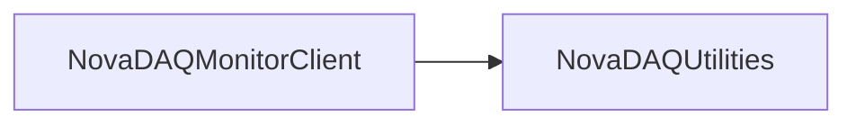

# NovaDAQMonitorClient

Client library/service for publishing participant monitoring data to NovaDAQMonitor.

## Identity and scope

Repository: [NovaDAQ/NovaDAQMonitorClient](https://github.com/NovaDAQ/NovaDAQMonitorClient) · Reviewed commit: `fa7c719a201a02f29716ad1493d3a8dfe9a7d71e` · Domain: **Monitoring**.

Tracked files: **34**. Production deployment and owner are **unconfirmed**.

## Operation

Keep participant identity and DDS destination consistent with the monitor configuration. Test periodic reporting, disconnect, and recovery after monitor restart; a connected client can still have stale metrics.

For prerequisites, safe start/stop sequencing, health checks, and rollback see the [operations guide](../operations/index.md).

## Build and integration

This package uses the SRT/SoftRelTools release context. A standalone `make` in a fresh checkout is not a supported build recipe unless the required context is already configured. See [build and release](../operations/build.md).

CMake definitions are present. Most NOvA fragments use parent-provided cetbuildtools macros and dependency targets; consult the files below before treating this directory as a standalone CMake project.

| Build definition |
| --- |
| [CMakeLists.txt](https://github.com/NovaDAQ/NovaDAQMonitorClient/blob/fa7c719a201a02f29716ad1493d3a8dfe9a7d71e/CMakeLists.txt) |
| [GNUmakefile](https://github.com/NovaDAQ/NovaDAQMonitorClient/blob/fa7c719a201a02f29716ad1493d3a8dfe9a7d71e/GNUmakefile) |
| [cxx/CMakeLists.txt](https://github.com/NovaDAQ/NovaDAQMonitorClient/blob/fa7c719a201a02f29716ad1493d3a8dfe9a7d71e/cxx/CMakeLists.txt) |
| [cxx/GNUmakefile](https://github.com/NovaDAQ/NovaDAQMonitorClient/blob/fa7c719a201a02f29716ad1493d3a8dfe9a7d71e/cxx/GNUmakefile) |
| [cxx/src/CMakeLists.txt](https://github.com/NovaDAQ/NovaDAQMonitorClient/blob/fa7c719a201a02f29716ad1493d3a8dfe9a7d71e/cxx/src/CMakeLists.txt) |
| [cxx/src/GNUmakefile](https://github.com/NovaDAQ/NovaDAQMonitorClient/blob/fa7c719a201a02f29716ad1493d3a8dfe9a7d71e/cxx/src/GNUmakefile) |
| [cxx/test/GNUmakefile](https://github.com/NovaDAQ/NovaDAQMonitorClient/blob/fa7c719a201a02f29716ad1493d3a8dfe9a7d71e/cxx/test/GNUmakefile) |
| [cxx/unittest/GNUmakefile](https://github.com/NovaDAQ/NovaDAQMonitorClient/blob/fa7c719a201a02f29716ad1493d3a8dfe9a7d71e/cxx/unittest/GNUmakefile) |

## Entry points

These are source entry points or operational scripts found statically. Installation names and enabled targets depend on the build/configuration; listing a script does not establish that it is deployed.

No standalone executable entry point was identified; this package may provide libraries, contracts, configuration, or binary artifacts.

## Interfaces

Headers and declared types form the API navigation map. Follow the source for method signatures, ownership, units, and error contracts. Generated DDS/XSD types are built from the schemas in the next section.

| Header | Declared types |
| --- | --- |
| [cxx/include/Ndmc.h](https://github.com/NovaDAQ/NovaDAQMonitorClient/blob/fa7c719a201a02f29716ad1493d3a8dfe9a7d71e/cxx/include/Ndmc.h) | Functions, constants, or templates |
| [cxx/include/NdmcClient.h](https://github.com/NovaDAQ/NovaDAQMonitorClient/blob/fa7c719a201a02f29716ad1493d3a8dfe9a7d71e/cxx/include/NdmcClient.h) | `NdmcClient`, `NdmcClientTest` |
| [cxx/include/NdmcClientService.h](https://github.com/NovaDAQ/NovaDAQMonitorClient/blob/fa7c719a201a02f29716ad1493d3a8dfe9a7d71e/cxx/include/NdmcClientService.h) | `NdmcClientService` |
| [cxx/include/NdmcMetric.h](https://github.com/NovaDAQ/NovaDAQMonitorClient/blob/fa7c719a201a02f29716ad1493d3a8dfe9a7d71e/cxx/include/NdmcMetric.h) | `NdmcClientTest`, `NdmcMetric`, `NdmcMetricTest`, `tms` |
| [cxx/include/NdmcMetricABC.h](https://github.com/NovaDAQ/NovaDAQMonitorClient/blob/fa7c719a201a02f29716ad1493d3a8dfe9a7d71e/cxx/include/NdmcMetricABC.h) | `NdmcMetricABC` |
| [cxx/include/NdmcTrace.h](https://github.com/NovaDAQ/NovaDAQMonitorClient/blob/fa7c719a201a02f29716ad1493d3a8dfe9a7d71e/cxx/include/NdmcTrace.h) | Functions, constants, or templates |

## Configuration and data contracts

| Source artifact |
| --- |
| [config/unittest/gmond.conf](https://github.com/NovaDAQ/NovaDAQMonitorClient/blob/fa7c719a201a02f29716ad1493d3a8dfe9a7d71e/config/unittest/gmond.conf) |

## Environment and external dependencies

Environment names below are literal lookups found in source, not a guarantee that every value is mandatory. No environment values or credentials are copied into this documentation.

| Variable | Evidence |
| --- | --- |
| `SRT_PRIVATE_CONTEXT` | [cxx/src/Ndmc.cpp:36](https://github.com/NovaDAQ/NovaDAQMonitorClient/blob/fa7c719a201a02f29716ad1493d3a8dfe9a7d71e/cxx/src/Ndmc.cpp#L36) |
| `SRT_PUBLIC_CONTEXT` | [cxx/src/Ndmc.cpp:40](https://github.com/NovaDAQ/NovaDAQMonitorClient/blob/fa7c719a201a02f29716ad1493d3a8dfe9a7d71e/cxx/src/Ndmc.cpp#L40) |

Unresolved/non-package include roots (some are system or generated headers; this is not a package-manager lockfile):

| Include root | Evidence |
| --- | --- |
| `boost` | [cxx/include/NdmcClient.h:11](https://github.com/NovaDAQ/NovaDAQMonitorClient/blob/fa7c719a201a02f29716ad1493d3a8dfe9a7d71e/cxx/include/NdmcClient.h#L11) |
| `cppunit` | [cxx/unittest/NdmcClientServiceTest.h:4](https://github.com/NovaDAQ/NovaDAQMonitorClient/blob/fa7c719a201a02f29716ad1493d3a8dfe9a7d71e/cxx/unittest/NdmcClientServiceTest.h#L4) |
| `linux` | [cxx/include/NdmcTrace.h:45](https://github.com/NovaDAQ/NovaDAQMonitorClient/blob/fa7c719a201a02f29716ad1493d3a8dfe9a7d71e/cxx/include/NdmcTrace.h#L45) |
| `messagefacility` | [cxx/include/NdmcMetric.h:12](https://github.com/NovaDAQ/NovaDAQMonitorClient/blob/fa7c719a201a02f29716ad1493d3a8dfe9a7d71e/cxx/include/NdmcMetric.h#L12) |
| `sys` | [cxx/include/NdmcClient.h:10](https://github.com/NovaDAQ/NovaDAQMonitorClient/blob/fa7c719a201a02f29716ad1493d3a8dfe9a7d71e/cxx/include/NdmcClient.h#L10) |

## Package dependencies

Arrow direction is **consumer → dependency**. This diagram includes source/build/runtime relationships and excludes test-only, release-membership, and build-tool edges. Conditional branches are not evaluated.

| Dependency | Relationship | Evidence |
| --- | --- | --- |
| [NovaDAQUtilities](NovaDAQUtilities.md) | source include | [cxx/include/NdmcClient.h:15](https://github.com/NovaDAQ/NovaDAQMonitorClient/blob/fa7c719a201a02f29716ad1493d3a8dfe9a7d71e/cxx/include/NdmcClient.h#L15) |
| [SRT_ONLINE](SRT_ONLINE.md) | build tool | [GNUmakefile:10](https://github.com/NovaDAQ/NovaDAQMonitorClient/blob/fa7c719a201a02f29716ad1493d3a8dfe9a7d71e/GNUmakefile#L10) |

Direct consumers: [BufferNodeEVB](BufferNodeEVB.md), [DCMApplication](DCMApplication.md), [NDLTest](NDLTest.md), [NovaDataLogger](NovaDataLogger.md), [NovaGlobalTrigger](NovaGlobalTrigger.md), [NovaRunControl](NovaRunControl.md), [SRT_ONLINE](SRT_ONLINE.md).

Explore upstream/downstream impact in the [dependency explorer](../architecture/explorer.md).

## Validation and review

Static analysis attempted **11 C/C++ translation units**, **0 shell scripts**, and parsed **0 Python files**. Counts are tool input coverage, not proof of successful compilation or exhaustive review. Source/build/configuration inventories and the operating surface were also assessed.

No actionable defect was confirmed for this package in this review. This is a bounded review result, not a clean bill of health; unvalidated analyzer diagnostics were not filed as bugs.

Existing test/example sources (not executed against production):

| Source |
| --- |
| [cxx/test/NdmcClient_test.cc](https://github.com/NovaDAQ/NovaDAQMonitorClient/blob/fa7c719a201a02f29716ad1493d3a8dfe9a7d71e/cxx/test/NdmcClient_test.cc) |
| [cxx/test/buffermetric.cc](https://github.com/NovaDAQ/NovaDAQMonitorClient/blob/fa7c719a201a02f29716ad1493d3a8dfe9a7d71e/cxx/test/buffermetric.cc) |
| [cxx/test/clienttest.cc](https://github.com/NovaDAQ/NovaDAQMonitorClient/blob/fa7c719a201a02f29716ad1493d3a8dfe9a7d71e/cxx/test/clienttest.cc) |
| [cxx/unittest/NdmcClientServiceTest.cpp](https://github.com/NovaDAQ/NovaDAQMonitorClient/blob/fa7c719a201a02f29716ad1493d3a8dfe9a7d71e/cxx/unittest/NdmcClientServiceTest.cpp) |
| [cxx/unittest/NdmcClientServiceTest.h](https://github.com/NovaDAQ/NovaDAQMonitorClient/blob/fa7c719a201a02f29716ad1493d3a8dfe9a7d71e/cxx/unittest/NdmcClientServiceTest.h) |
| [cxx/unittest/NdmcClientTest.cpp](https://github.com/NovaDAQ/NovaDAQMonitorClient/blob/fa7c719a201a02f29716ad1493d3a8dfe9a7d71e/cxx/unittest/NdmcClientTest.cpp) |
| [cxx/unittest/NdmcClientTest.h](https://github.com/NovaDAQ/NovaDAQMonitorClient/blob/fa7c719a201a02f29716ad1493d3a8dfe9a7d71e/cxx/unittest/NdmcClientTest.h) |
| [cxx/unittest/NdmcMetricTest.cpp](https://github.com/NovaDAQ/NovaDAQMonitorClient/blob/fa7c719a201a02f29716ad1493d3a8dfe9a7d71e/cxx/unittest/NdmcMetricTest.cpp) |
| [cxx/unittest/NdmcMetricTest.h](https://github.com/NovaDAQ/NovaDAQMonitorClient/blob/fa7c719a201a02f29716ad1493d3a8dfe9a7d71e/cxx/unittest/NdmcMetricTest.h) |
| [cxx/unittest/NdmcTest.cpp](https://github.com/NovaDAQ/NovaDAQMonitorClient/blob/fa7c719a201a02f29716ad1493d3a8dfe9a7d71e/cxx/unittest/NdmcTest.cpp) |
| [cxx/unittest/NdmcTest.h](https://github.com/NovaDAQ/NovaDAQMonitorClient/blob/fa7c719a201a02f29716ad1493d3a8dfe9a7d71e/cxx/unittest/NdmcTest.h) |
| [cxx/unittest/ndmcunittest.cc](https://github.com/NovaDAQ/NovaDAQMonitorClient/blob/fa7c719a201a02f29716ad1493d3a8dfe9a7d71e/cxx/unittest/ndmcunittest.cc) |

## Existing documentation

| Source |
| --- |
| [cxx/test/README](https://github.com/NovaDAQ/NovaDAQMonitorClient/blob/fa7c719a201a02f29716ad1493d3a8dfe9a7d71e/cxx/test/README) |
