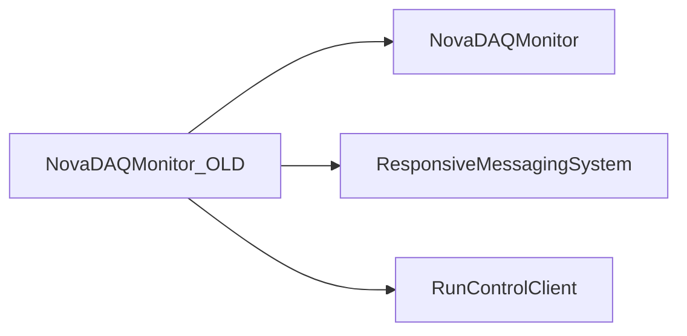

# NovaDAQMonitor_OLD

Earlier DAQ monitor, RRD storage, thresholds, and state-manager tests.

## Identity and scope

Repository: [NovaDAQ/NovaDAQMonitor_OLD](https://github.com/NovaDAQ/NovaDAQMonitor_OLD) · Reviewed commit: `45f2249bb32984da1ccba9015ebbf314f53e4a2b` · Domain: **Monitoring**.

Tracked files: **30**. Production deployment and owner are **unconfirmed**. The directory name marks a legacy variant; retirement has not been independently verified.

## Operation

Use the matching historical clients and RRD schema if reproducing behavior. Deployment is unconfirmed; compare the newer monitor before migrating retained history.

For prerequisites, safe start/stop sequencing, health checks, and rollback see the [operations guide](../operations/index.md).

## Build and integration

This package uses the SRT/SoftRelTools release context. A standalone `make` in a fresh checkout is not a supported build recipe unless the required context is already configured. See [build and release](../operations/build.md).

| Build definition |
| --- |
| [GNUmakefile](https://github.com/NovaDAQ/NovaDAQMonitor_OLD/blob/45f2249bb32984da1ccba9015ebbf314f53e4a2b/GNUmakefile) |

## Entry points

These are source entry points or operational scripts found statically. Installation names and enabled targets depend on the build/configuration; listing a script does not establish that it is deployed.

| Source |
| --- |
| [cxx/src/ndmdaqmonitor.cc](https://github.com/NovaDAQ/NovaDAQMonitor_OLD/blob/45f2249bb32984da1ccba9015ebbf314f53e4a2b/cxx/src/ndmdaqmonitor.cc) |

## Interfaces

Headers and declared types form the API navigation map. Follow the source for method signatures, ownership, units, and error contracts. Generated DDS/XSD types are built from the schemas in the next section.

| Header | Declared types |
| --- | --- |
| [cxx/inc/NovaDAQMonitor/Ndm.hpp](https://github.com/NovaDAQ/NovaDAQMonitor_OLD/blob/45f2249bb32984da1ccba9015ebbf314f53e4a2b/cxx/inc/NovaDAQMonitor/Ndm.hpp) | Functions, constants, or templates |
| [cxx/inc/NovaDAQMonitor/NdmDaqMonitor.hpp](https://github.com/NovaDAQ/NovaDAQMonitor_OLD/blob/45f2249bb32984da1ccba9015ebbf314f53e4a2b/cxx/inc/NovaDAQMonitor/NdmDaqMonitor.hpp) | `NdmDaqMonitor` |
| [cxx/inc/NovaDAQMonitor/NdmMonitorData.hpp](https://github.com/NovaDAQ/NovaDAQMonitor_OLD/blob/45f2249bb32984da1ccba9015ebbf314f53e4a2b/cxx/inc/NovaDAQMonitor/NdmMonitorData.hpp) | `NdmMonitorData` |
| [cxx/inc/NovaDAQMonitor/NdmMonitorRRD.hpp](https://github.com/NovaDAQ/NovaDAQMonitor_OLD/blob/45f2249bb32984da1ccba9015ebbf314f53e4a2b/cxx/inc/NovaDAQMonitor/NdmMonitorRRD.hpp) | `NdmMonitorRRD` |
| [cxx/inc/NovaDAQMonitor/NdmMonitorRRDFile.hpp](https://github.com/NovaDAQ/NovaDAQMonitor_OLD/blob/45f2249bb32984da1ccba9015ebbf314f53e4a2b/cxx/inc/NovaDAQMonitor/NdmMonitorRRDFile.hpp) | `NdmMonitorRRDFile`, `tm` |
| [cxx/inc/NovaDAQMonitor/NdmStateManager.hpp](https://github.com/NovaDAQ/NovaDAQMonitor_OLD/blob/45f2249bb32984da1ccba9015ebbf314f53e4a2b/cxx/inc/NovaDAQMonitor/NdmStateManager.hpp) | `NdmStateManager` |

## Configuration and data contracts

| Source artifact |
| --- |
| [config/NdmThreshold.xml](https://github.com/NovaDAQ/NovaDAQMonitor_OLD/blob/45f2249bb32984da1ccba9015ebbf314f53e4a2b/config/NdmThreshold.xml) |
| [config/NdmThreshold.xsd](https://github.com/NovaDAQ/NovaDAQMonitor_OLD/blob/45f2249bb32984da1ccba9015ebbf314f53e4a2b/config/NdmThreshold.xsd) |

## Environment and external dependencies

Environment names below are literal lookups found in source, not a guarantee that every value is mandatory. No environment values or credentials are copied into this documentation.

No literal environment lookup was identified by this scan; shell setup scripts may still provide required values.

Unresolved/non-package include roots (some are system or generated headers; this is not a package-manager lockfile):

| Include root | Evidence |
| --- | --- |
| `boost` | [cxx/inc/NovaDAQMonitor/NdmMonitorRRD.hpp:10](https://github.com/NovaDAQ/NovaDAQMonitor_OLD/blob/45f2249bb32984da1ccba9015ebbf314f53e4a2b/cxx/inc/NovaDAQMonitor/NdmMonitorRRD.hpp#L10) |
| `cppunit` | [test/cxx/src/NdmDaqMonitorTest.hpp:4](https://github.com/NovaDAQ/NovaDAQMonitor_OLD/blob/45f2249bb32984da1ccba9015ebbf314f53e4a2b/test/cxx/src/NdmDaqMonitorTest.hpp#L4) |
| `novaMsg` | [cxx/src/NdmStateManager.cpp:6](https://github.com/NovaDAQ/NovaDAQMonitor_OLD/blob/45f2249bb32984da1ccba9015ebbf314f53e4a2b/cxx/src/NdmStateManager.cpp#L6) |

## Package dependencies

Arrow direction is **consumer → dependency**. This diagram includes source/build/runtime relationships and excludes test-only, release-membership, and build-tool edges. Conditional branches are not evaluated.

| Dependency | Relationship | Evidence |
| --- | --- | --- |
| [NovaDAQMonitor](NovaDAQMonitor.md) | source include | [cxx/inc/NovaDAQMonitor/NdmDaqMonitor.hpp:9](https://github.com/NovaDAQ/NovaDAQMonitor_OLD/blob/45f2249bb32984da1ccba9015ebbf314f53e4a2b/cxx/inc/NovaDAQMonitor/NdmDaqMonitor.hpp#L9) |
| [NovaDAQMonitor](NovaDAQMonitor.md) | test include | [test/cxx/src/NdmDaqMonitorTest.hpp:7](https://github.com/NovaDAQ/NovaDAQMonitor_OLD/blob/45f2249bb32984da1ccba9015ebbf314f53e4a2b/test/cxx/src/NdmDaqMonitorTest.hpp#L7) |
| [ResponsiveMessagingSystem](ResponsiveMessagingSystem.md) | build link | [GNUmakefile:113](https://github.com/NovaDAQ/NovaDAQMonitor_OLD/blob/45f2249bb32984da1ccba9015ebbf314f53e4a2b/GNUmakefile#L113) |
| [ResponsiveMessagingSystem](ResponsiveMessagingSystem.md) | source include | [cxx/inc/NovaDAQMonitor/NdmMonitorData.hpp:11](https://github.com/NovaDAQ/NovaDAQMonitor_OLD/blob/45f2249bb32984da1ccba9015ebbf314f53e4a2b/cxx/inc/NovaDAQMonitor/NdmMonitorData.hpp#L11) |
| [ResponsiveMessagingSystem](ResponsiveMessagingSystem.md) | test include | [test/cxx/src/NdmStateManagerTest.cpp:2](https://github.com/NovaDAQ/NovaDAQMonitor_OLD/blob/45f2249bb32984da1ccba9015ebbf314f53e4a2b/test/cxx/src/NdmStateManagerTest.cpp#L2) |
| [RunControlClient](RunControlClient.md) | build link | [GNUmakefile:120](https://github.com/NovaDAQ/NovaDAQMonitor_OLD/blob/45f2249bb32984da1ccba9015ebbf314f53e4a2b/GNUmakefile#L120) |
| [RunControlClient](RunControlClient.md) | source include | [cxx/inc/NovaDAQMonitor/NdmDaqMonitor.hpp:8](https://github.com/NovaDAQ/NovaDAQMonitor_OLD/blob/45f2249bb32984da1ccba9015ebbf314f53e4a2b/cxx/inc/NovaDAQMonitor/NdmDaqMonitor.hpp#L8) |

Direct consumers: None resolved in this snapshot.

Explore upstream/downstream impact in the [dependency explorer](../architecture/explorer.md).

## Validation and review

Static analysis attempted **13 C/C++ translation units**, **0 shell scripts**, and parsed **0 Python files**. Counts are tool input coverage, not proof of successful compilation or exhaustive review. Source/build/configuration inventories and the operating surface were also assessed.

No actionable defect was confirmed for this package in this review. This is a bounded review result, not a clean bill of health; unvalidated analyzer diagnostics were not filed as bugs.

Existing test/example sources (not executed against production):

| Source |
| --- |
| [test/cxx/src/NdmDaqMonitorTest.cpp](https://github.com/NovaDAQ/NovaDAQMonitor_OLD/blob/45f2249bb32984da1ccba9015ebbf314f53e4a2b/test/cxx/src/NdmDaqMonitorTest.cpp) |
| [test/cxx/src/NdmDaqMonitorTest.hpp](https://github.com/NovaDAQ/NovaDAQMonitor_OLD/blob/45f2249bb32984da1ccba9015ebbf314f53e4a2b/test/cxx/src/NdmDaqMonitorTest.hpp) |
| [test/cxx/src/NdmMonitorDataTest.cpp](https://github.com/NovaDAQ/NovaDAQMonitor_OLD/blob/45f2249bb32984da1ccba9015ebbf314f53e4a2b/test/cxx/src/NdmMonitorDataTest.cpp) |
| [test/cxx/src/NdmMonitorDataTest.hpp](https://github.com/NovaDAQ/NovaDAQMonitor_OLD/blob/45f2249bb32984da1ccba9015ebbf314f53e4a2b/test/cxx/src/NdmMonitorDataTest.hpp) |
| [test/cxx/src/NdmMonitorRRDFileTest.cpp](https://github.com/NovaDAQ/NovaDAQMonitor_OLD/blob/45f2249bb32984da1ccba9015ebbf314f53e4a2b/test/cxx/src/NdmMonitorRRDFileTest.cpp) |
| [test/cxx/src/NdmMonitorRRDFileTest.hpp](https://github.com/NovaDAQ/NovaDAQMonitor_OLD/blob/45f2249bb32984da1ccba9015ebbf314f53e4a2b/test/cxx/src/NdmMonitorRRDFileTest.hpp) |
| [test/cxx/src/NdmMonitorRRDTest.cpp](https://github.com/NovaDAQ/NovaDAQMonitor_OLD/blob/45f2249bb32984da1ccba9015ebbf314f53e4a2b/test/cxx/src/NdmMonitorRRDTest.cpp) |
| [test/cxx/src/NdmMonitorRRDTest.hpp](https://github.com/NovaDAQ/NovaDAQMonitor_OLD/blob/45f2249bb32984da1ccba9015ebbf314f53e4a2b/test/cxx/src/NdmMonitorRRDTest.hpp) |
| [test/cxx/src/NdmStateManagerTest.cpp](https://github.com/NovaDAQ/NovaDAQMonitor_OLD/blob/45f2249bb32984da1ccba9015ebbf314f53e4a2b/test/cxx/src/NdmStateManagerTest.cpp) |
| [test/cxx/src/NdmStateManagerTest.hpp](https://github.com/NovaDAQ/NovaDAQMonitor_OLD/blob/45f2249bb32984da1ccba9015ebbf314f53e4a2b/test/cxx/src/NdmStateManagerTest.hpp) |
| [test/cxx/src/NdmThresholdTest.cpp](https://github.com/NovaDAQ/NovaDAQMonitor_OLD/blob/45f2249bb32984da1ccba9015ebbf314f53e4a2b/test/cxx/src/NdmThresholdTest.cpp) |
| [test/cxx/src/NdmThresholdTest.hpp](https://github.com/NovaDAQ/NovaDAQMonitor_OLD/blob/45f2249bb32984da1ccba9015ebbf314f53e4a2b/test/cxx/src/NdmThresholdTest.hpp) |
| [test/cxx/src/ndmunittest.cc](https://github.com/NovaDAQ/NovaDAQMonitor_OLD/blob/45f2249bb32984da1ccba9015ebbf314f53e4a2b/test/cxx/src/ndmunittest.cc) |

## Existing documentation

| Source |
| --- |
| [test/README](https://github.com/NovaDAQ/NovaDAQMonitor_OLD/blob/45f2249bb32984da1ccba9015ebbf314f53e4a2b/test/README) |
