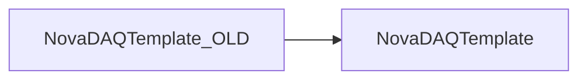

# NovaDAQTemplate_OLD

Historical C++/Python package template and CppUnit examples.

## Identity and scope

Repository: [NovaDAQ/NovaDAQTemplate_OLD](https://github.com/NovaDAQ/NovaDAQTemplate_OLD) · Reviewed commit: `e1239768ce95a98f92a7625d325bfb36c4f6169b` · Domain: **Simulation and examples**.

Tracked files: **18**. Production deployment and owner are **unconfirmed**. The directory name marks a legacy variant; retirement has not been independently verified.

## Operation

Retain as a historical reference; verify modern compiler/runtime assumptions before copying it into a new package. Prefer current release build conventions.

For prerequisites, safe start/stop sequencing, health checks, and rollback see the [operations guide](../operations/index.md).

## Build and integration

This package uses the SRT/SoftRelTools release context. A standalone `make` in a fresh checkout is not a supported build recipe unless the required context is already configured. See [build and release](../operations/build.md).

| Build definition |
| --- |
| [GNUmakefile](https://github.com/NovaDAQ/NovaDAQTemplate_OLD/blob/e1239768ce95a98f92a7625d325bfb36c4f6169b/GNUmakefile) |

## Entry points

These are source entry points or operational scripts found statically. Installation names and enabled targets depend on the build/configuration; listing a script does not establish that it is deployed.

| Source |
| --- |
| [cxx/src/CPPStandardsExampleMain.cpp](https://github.com/NovaDAQ/NovaDAQTemplate_OLD/blob/e1239768ce95a98f92a7625d325bfb36c4f6169b/cxx/src/CPPStandardsExampleMain.cpp) |
| [python/src/NovaDAQTemplate/BuildInitFile.py](https://github.com/NovaDAQ/NovaDAQTemplate_OLD/blob/e1239768ce95a98f92a7625d325bfb36c4f6169b/python/src/NovaDAQTemplate/BuildInitFile.py) |
| [python/src/NovaDAQTemplate/PythonStandardsExample.py](https://github.com/NovaDAQ/NovaDAQTemplate_OLD/blob/e1239768ce95a98f92a7625d325bfb36c4f6169b/python/src/NovaDAQTemplate/PythonStandardsExample.py) |

## Interfaces

Headers and declared types form the API navigation map. Follow the source for method signatures, ownership, units, and error contracts. Generated DDS/XSD types are built from the schemas in the next section.

| Header | Declared types |
| --- | --- |
| [cxx/inc/NovaDAQTemplate/CPPStandardsExample.hpp](https://github.com/NovaDAQ/NovaDAQTemplate_OLD/blob/e1239768ce95a98f92a7625d325bfb36c4f6169b/cxx/inc/NovaDAQTemplate/CPPStandardsExample.hpp) | `CPPStandardsExample` |

## Configuration and data contracts

| Source artifact |
| --- |
| [config/jcsc.xml](https://github.com/NovaDAQ/NovaDAQTemplate_OLD/blob/e1239768ce95a98f92a7625d325bfb36c4f6169b/config/jcsc.xml) |

## Environment and external dependencies

Environment names below are literal lookups found in source, not a guarantee that every value is mandatory. No environment values or credentials are copied into this documentation.

No literal environment lookup was identified by this scan; shell setup scripts may still provide required values.

Unresolved/non-package include roots (some are system or generated headers; this is not a package-manager lockfile):

| Include root | Evidence |
| --- | --- |
| `cppunit` | [test/cxx/src/CPPStandardsExampleTest.hpp:4](https://github.com/NovaDAQ/NovaDAQTemplate_OLD/blob/e1239768ce95a98f92a7625d325bfb36c4f6169b/test/cxx/src/CPPStandardsExampleTest.hpp#L4) |

## Package dependencies

Arrow direction is **consumer → dependency**. This diagram includes source/build/runtime relationships and excludes test-only, release-membership, and build-tool edges. Conditional branches are not evaluated.

| Dependency | Relationship | Evidence |
| --- | --- | --- |
| [NovaDAQTemplate](NovaDAQTemplate.md) | source include | [cxx/src/CPPStandardsExample.cpp:2](https://github.com/NovaDAQ/NovaDAQTemplate_OLD/blob/e1239768ce95a98f92a7625d325bfb36c4f6169b/cxx/src/CPPStandardsExample.cpp#L2) |
| [NovaDAQTemplate](NovaDAQTemplate.md) | test include | [test/cxx/src/CPPStandardsExampleTest.hpp:7](https://github.com/NovaDAQ/NovaDAQTemplate_OLD/blob/e1239768ce95a98f92a7625d325bfb36c4f6169b/test/cxx/src/CPPStandardsExampleTest.hpp#L7) |

Direct consumers: None resolved in this snapshot.

Explore upstream/downstream impact in the [dependency explorer](../architecture/explorer.md).

## Validation and review

Static analysis attempted **4 C/C++ translation units**, **0 shell scripts**, and parsed **2 Python files**. Counts are tool input coverage, not proof of successful compilation or exhaustive review. Source/build/configuration inventories and the operating surface were also assessed.

No actionable defect was confirmed for this package in this review. This is a bounded review result, not a clean bill of health; unvalidated analyzer diagnostics were not filed as bugs.

Existing test/example sources (not executed against production):

| Source |
| --- |
| [test/cxx/src/CPPStandardsExampleTest.cpp](https://github.com/NovaDAQ/NovaDAQTemplate_OLD/blob/e1239768ce95a98f92a7625d325bfb36c4f6169b/test/cxx/src/CPPStandardsExampleTest.cpp) |
| [test/cxx/src/CPPStandardsExampleTest.hpp](https://github.com/NovaDAQ/NovaDAQTemplate_OLD/blob/e1239768ce95a98f92a7625d325bfb36c4f6169b/test/cxx/src/CPPStandardsExampleTest.hpp) |
| [test/cxx/src/CPPUnitTestMain.cpp](https://github.com/NovaDAQ/NovaDAQTemplate_OLD/blob/e1239768ce95a98f92a7625d325bfb36c4f6169b/test/cxx/src/CPPUnitTestMain.cpp) |

## Existing documentation

| Source |
| --- |
| [README_BUILD](https://github.com/NovaDAQ/NovaDAQTemplate_OLD/blob/e1239768ce95a98f92a7625d325bfb36c4f6169b/README_BUILD) |
