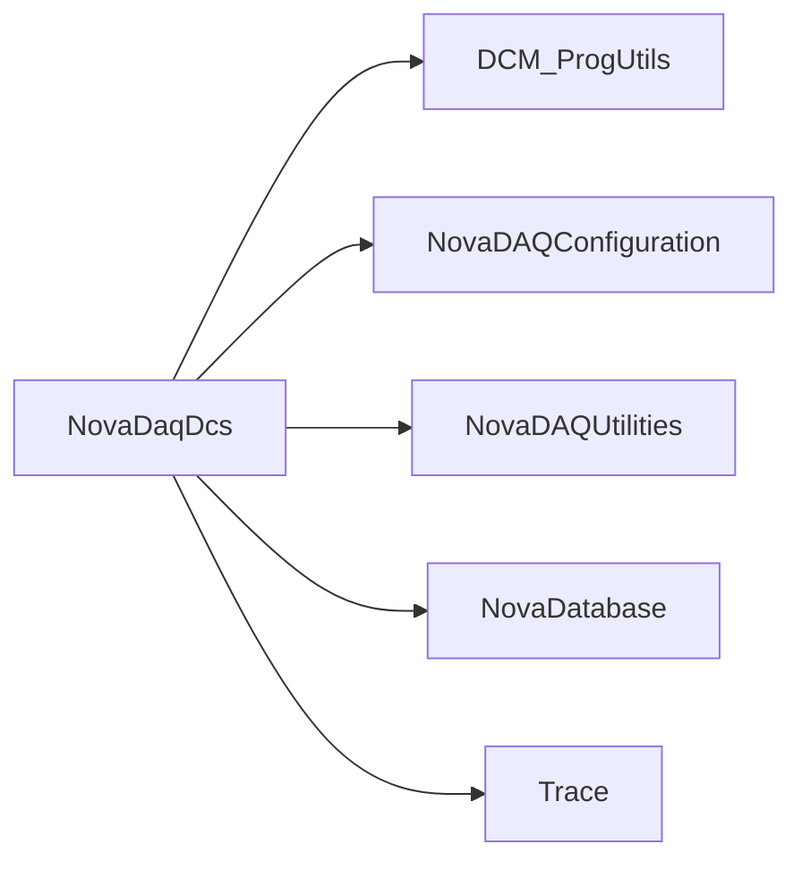

# NovaDaqDcs

EPICS IOCs, detector-control records/widgets, PV archivers, and control-room launch utilities.

## Identity and scope

Repository: [NovaDAQ/NovaDaqDcs](https://github.com/NovaDAQ/NovaDaqDcs) · Reviewed commit: `6608428106f589b61afb8942a2a67630cdcf98ff` · Domain: **Monitoring**.

Tracked files: **213**. Production deployment and owner are **unconfirmed**.

## Operation

Verify IOC identity, PV namespaces, recipe selection, and database destination. Separate read-only monitoring from setpoint/recipe changes; preserve known settings and confirm readback after authorized hardware changes.

For prerequisites, safe start/stop sequencing, health checks, and rollback see the [operations guide](../operations/index.md).

## Build and integration

This package uses the SRT/SoftRelTools release context. A standalone `make` in a fresh checkout is not a supported build recipe unless the required context is already configured. See [build and release](../operations/build.md).

| Build definition |
| --- |
| [GNUmakefile](https://github.com/NovaDAQ/NovaDaqDcs/blob/6608428106f589b61afb8942a2a67630cdcf98ff/GNUmakefile) |
| [cxx/GNUmakefile](https://github.com/NovaDAQ/NovaDaqDcs/blob/6608428106f589b61afb8942a2a67630cdcf98ff/cxx/GNUmakefile) |
| [cxx/src/GNUmakefile](https://github.com/NovaDAQ/NovaDaqDcs/blob/6608428106f589b61afb8942a2a67630cdcf98ff/cxx/src/GNUmakefile) |
| [cxx/test/GNUmakefile](https://github.com/NovaDAQ/NovaDaqDcs/blob/6608428106f589b61afb8942a2a67630cdcf98ff/cxx/test/GNUmakefile) |
| [cxx/unittest/GNUmakefile](https://github.com/NovaDAQ/NovaDaqDcs/blob/6608428106f589b61afb8942a2a67630cdcf98ff/cxx/unittest/GNUmakefile) |
| [epics/GNUmakefile](https://github.com/NovaDAQ/NovaDaqDcs/blob/6608428106f589b61afb8942a2a67630cdcf98ff/epics/GNUmakefile) |
| [epics/Makefile](https://github.com/NovaDAQ/NovaDaqDcs/blob/6608428106f589b61afb8942a2a67630cdcf98ff/epics/Makefile) |
| [epics/configure/Makefile](https://github.com/NovaDAQ/NovaDaqDcs/blob/6608428106f589b61afb8942a2a67630cdcf98ff/epics/configure/Makefile) |
| [epics/dcmIOCApp/Db/Makefile](https://github.com/NovaDAQ/NovaDaqDcs/blob/6608428106f589b61afb8942a2a67630cdcf98ff/epics/dcmIOCApp/Db/Makefile) |
| [epics/dcmIOCApp/Makefile](https://github.com/NovaDAQ/NovaDaqDcs/blob/6608428106f589b61afb8942a2a67630cdcf98ff/epics/dcmIOCApp/Makefile) |
| [epics/dcmIOCApp/src/Makefile](https://github.com/NovaDAQ/NovaDaqDcs/blob/6608428106f589b61afb8942a2a67630cdcf98ff/epics/dcmIOCApp/src/Makefile) |
| [epics/iocBoot/Makefile](https://github.com/NovaDAQ/NovaDaqDcs/blob/6608428106f589b61afb8942a2a67630cdcf98ff/epics/iocBoot/Makefile) |
| [epics/iocBoot/iocdcmIOC/Makefile](https://github.com/NovaDAQ/NovaDaqDcs/blob/6608428106f589b61afb8942a2a67630cdcf98ff/epics/iocBoot/iocdcmIOC/Makefile) |
| [epics/iocBoot/iocregIOC_linux-x86_64/Makefile](https://github.com/NovaDAQ/NovaDaqDcs/blob/6608428106f589b61afb8942a2a67630cdcf98ff/epics/iocBoot/iocregIOC_linux-x86_64/Makefile) |
| [epics/regIOCApp/Db/Makefile](https://github.com/NovaDAQ/NovaDaqDcs/blob/6608428106f589b61afb8942a2a67630cdcf98ff/epics/regIOCApp/Db/Makefile) |
| [epics/regIOCApp/Makefile](https://github.com/NovaDAQ/NovaDaqDcs/blob/6608428106f589b61afb8942a2a67630cdcf98ff/epics/regIOCApp/Makefile) |
| [epics/regIOCApp/src/Makefile](https://github.com/NovaDAQ/NovaDaqDcs/blob/6608428106f589b61afb8942a2a67630cdcf98ff/epics/regIOCApp/src/Makefile) |
| [java/GNUmakefile](https://github.com/NovaDAQ/NovaDaqDcs/blob/6608428106f589b61afb8942a2a67630cdcf98ff/java/GNUmakefile) |
| [java/src/GNUmakefile](https://github.com/NovaDAQ/NovaDaqDcs/blob/6608428106f589b61afb8942a2a67630cdcf98ff/java/src/GNUmakefile) |
| [java/test/GNUmakefile](https://github.com/NovaDAQ/NovaDaqDcs/blob/6608428106f589b61afb8942a2a67630cdcf98ff/java/test/GNUmakefile) |
| [java/unittest/GNUmakefile](https://github.com/NovaDAQ/NovaDaqDcs/blob/6608428106f589b61afb8942a2a67630cdcf98ff/java/unittest/GNUmakefile) |
| [scripts/GNUmakefile](https://github.com/NovaDAQ/NovaDaqDcs/blob/6608428106f589b61afb8942a2a67630cdcf98ff/scripts/GNUmakefile) |

## Entry points

These are source entry points or operational scripts found statically. Installation names and enabled targets depend on the build/configuration; listing a script does not establish that it is deployed.

| Source |
| --- |
| [DCS_CR_icons/DCS-Desktop-Utilities/LaunchDCSConfigEditor.sh](https://github.com/NovaDAQ/NovaDaqDcs/blob/6608428106f589b61afb8942a2a67630cdcf98ff/DCS_CR_icons/DCS-Desktop-Utilities/LaunchDCSConfigEditor.sh) |
| [DCS_CR_icons/DCS-Desktop-Utilities/RunSynopticViewers.sh](https://github.com/NovaDAQ/NovaDaqDcs/blob/6608428106f589b61afb8942a2a67630cdcf98ff/DCS_CR_icons/DCS-Desktop-Utilities/RunSynopticViewers.sh) |
| [DCS_CR_icons/DCS-Desktop-Utilities/start-CSS.sh](https://github.com/NovaDAQ/NovaDaqDcs/blob/6608428106f589b61afb8942a2a67630cdcf98ff/DCS_CR_icons/DCS-Desktop-Utilities/start-CSS.sh) |
| [DCS_CR_icons/DCS-Desktop-Utilities/stop-CSS.sh](https://github.com/NovaDAQ/NovaDaqDcs/blob/6608428106f589b61afb8942a2a67630cdcf98ff/DCS_CR_icons/DCS-Desktop-Utilities/stop-CSS.sh) |
| [cxx/src/pvArchiver.cc](https://github.com/NovaDAQ/NovaDaqDcs/blob/6608428106f589b61afb8942a2a67630cdcf98ff/cxx/src/pvArchiver.cc) |
| [cxx/src/pvArchiver2.cc](https://github.com/NovaDAQ/NovaDaqDcs/blob/6608428106f589b61afb8942a2a67630cdcf98ff/cxx/src/pvArchiver2.cc) |
| [cxx/src/pvBlaster.cc](https://github.com/NovaDAQ/NovaDaqDcs/blob/6608428106f589b61afb8942a2a67630cdcf98ff/cxx/src/pvBlaster.cc) |
| [cxx/src/thrashCooling.cc](https://github.com/NovaDAQ/NovaDaqDcs/blob/6608428106f589b61afb8942a2a67630cdcf98ff/cxx/src/thrashCooling.cc) |
| [epics/cliUtils/NDapdCheck.sh](https://github.com/NovaDAQ/NovaDaqDcs/blob/6608428106f589b61afb8942a2a67630cdcf98ff/epics/cliUtils/NDapdCheck.sh) |
| [epics/cliUtils/awkscript.sh](https://github.com/NovaDAQ/NovaDaqDcs/blob/6608428106f589b61afb8942a2a67630cdcf98ff/epics/cliUtils/awkscript.sh) |
| [epics/cliUtils/checkDCMIOC.sh](https://github.com/NovaDAQ/NovaDaqDcs/blob/6608428106f589b61afb8942a2a67630cdcf98ff/epics/cliUtils/checkDCMIOC.sh) |
| [epics/cliUtils/generatepv.sh](https://github.com/NovaDAQ/NovaDaqDcs/blob/6608428106f589b61afb8942a2a67630cdcf98ff/epics/cliUtils/generatepv.sh) |
| [epics/cliUtils/restartRegIOC.sh](https://github.com/NovaDAQ/NovaDaqDcs/blob/6608428106f589b61afb8942a2a67630cdcf98ff/epics/cliUtils/restartRegIOC.sh) |
| [epics/dcmIOCApp/src/dcmIOCMain.cpp](https://github.com/NovaDAQ/NovaDaqDcs/blob/6608428106f589b61afb8942a2a67630cdcf98ff/epics/dcmIOCApp/src/dcmIOCMain.cpp) |
| [epics/degCtoRaw.py](https://github.com/NovaDAQ/NovaDaqDcs/blob/6608428106f589b61afb8942a2a67630cdcf98ff/epics/degCtoRaw.py) |
| [epics/febtemp_raw2degC.c](https://github.com/NovaDAQ/NovaDaqDcs/blob/6608428106f589b61afb8942a2a67630cdcf98ff/epics/febtemp_raw2degC.c) |
| [epics/febtemp_raw2degC.py](https://github.com/NovaDAQ/NovaDaqDcs/blob/6608428106f589b61afb8942a2a67630cdcf98ff/epics/febtemp_raw2degC.py) |
| [epics/makeBpt.py](https://github.com/NovaDAQ/NovaDaqDcs/blob/6608428106f589b61afb8942a2a67630cdcf98ff/epics/makeBpt.py) |
| [epics/opi/sbin/clear-cooling-inhibit-dcm-all.sh](https://github.com/NovaDAQ/NovaDaqDcs/blob/6608428106f589b61afb8942a2a67630cdcf98ff/epics/opi/sbin/clear-cooling-inhibit-dcm-all.sh) |
| [epics/opi/sbin/configure-cold-dcm-all.sh](https://github.com/NovaDAQ/NovaDaqDcs/blob/6608428106f589b61afb8942a2a67630cdcf98ff/epics/opi/sbin/configure-cold-dcm-all.sh) |
| [epics/opi/sbin/configure-warm-dcm-all.sh](https://github.com/NovaDAQ/NovaDaqDcs/blob/6608428106f589b61afb8942a2a67630cdcf98ff/epics/opi/sbin/configure-warm-dcm-all.sh) |
| [epics/opi/sbin/disable_feb_cooling_recipe.sh](https://github.com/NovaDAQ/NovaDaqDcs/blob/6608428106f589b61afb8942a2a67630cdcf98ff/epics/opi/sbin/disable_feb_cooling_recipe.sh) |
| [epics/opi/sbin/reset_feb_overdrive.sh](https://github.com/NovaDAQ/NovaDaqDcs/blob/6608428106f589b61afb8942a2a67630cdcf98ff/epics/opi/sbin/reset_feb_overdrive.sh) |
| [epics/opi/sbin/set-cooling-inhibit-dcm-all.sh](https://github.com/NovaDAQ/NovaDaqDcs/blob/6608428106f589b61afb8942a2a67630cdcf98ff/epics/opi/sbin/set-cooling-inhibit-dcm-all.sh) |
| [epics/opi_css_run.sh](https://github.com/NovaDAQ/NovaDaqDcs/blob/6608428106f589b61afb8942a2a67630cdcf98ff/epics/opi_css_run.sh) |
| [epics/regIOCApp/src/regIOCMain.cpp](https://github.com/NovaDAQ/NovaDaqDcs/blob/6608428106f589b61afb8942a2a67630cdcf98ff/epics/regIOCApp/src/regIOCMain.cpp) |
| [epics/startIOC.sh](https://github.com/NovaDAQ/NovaDaqDcs/blob/6608428106f589b61afb8942a2a67630cdcf98ff/epics/startIOC.sh) |
| [epics/startIOC_DCMboot.sh](https://github.com/NovaDAQ/NovaDaqDcs/blob/6608428106f589b61afb8942a2a67630cdcf98ff/epics/startIOC_DCMboot.sh) |
| [scripts/checkDCMIOC.sh](https://github.com/NovaDAQ/NovaDaqDcs/blob/6608428106f589b61afb8942a2a67630cdcf98ff/scripts/checkDCMIOC.sh) |
| [scripts/monitors.crond/activemq.monitor.sh](https://github.com/NovaDAQ/NovaDaqDcs/blob/6608428106f589b61afb8942a2a67630cdcf98ff/scripts/monitors.crond/activemq.monitor.sh) |
| [scripts/monitors.crond/alarmbeast.monitor.sh](https://github.com/NovaDAQ/NovaDaqDcs/blob/6608428106f589b61afb8942a2a67630cdcf98ff/scripts/monitors.crond/alarmbeast.monitor.sh) |
| [scripts/monitors.crond/alarmnotifier.monitor.sh](https://github.com/NovaDAQ/NovaDaqDcs/blob/6608428106f589b61afb8942a2a67630cdcf98ff/scripts/monitors.crond/alarmnotifier.monitor.sh) |
| [scripts/monitors.crond/archiver.monitor.sh](https://github.com/NovaDAQ/NovaDaqDcs/blob/6608428106f589b61afb8942a2a67630cdcf98ff/scripts/monitors.crond/archiver.monitor.sh) |
| [scripts/monitors.crond/postgres.monitor.sh](https://github.com/NovaDAQ/NovaDaqDcs/blob/6608428106f589b61afb8942a2a67630cdcf98ff/scripts/monitors.crond/postgres.monitor.sh) |

## Interfaces

Headers and declared types form the API navigation map. Follow the source for method signatures, ownership, units, and error contracts. Generated DDS/XSD types are built from the schemas in the next section.

| Header | Declared types |
| --- | --- |
| [epics/dcmIOCApp/src/TempControl.hpp](https://github.com/NovaDAQ/NovaDaqDcs/blob/6608428106f589b61afb8942a2a67630cdcf98ff/epics/dcmIOCApp/src/TempControl.hpp) | `DCMTemp`, `FEBReadingType`, `FEBTemp`, `TempReader` |

## Configuration and data contracts

| Source artifact |
| --- |
| [config/DAQDCSMessages.idl](https://github.com/NovaDAQ/NovaDaqDcs/blob/6608428106f589b61afb8942a2a67630cdcf98ff/config/DAQDCSMessages.idl) |
| [epics/opi/widgets/dcmmap-dibpage-config.xml](https://github.com/NovaDAQ/NovaDaqDcs/blob/6608428106f589b61afb8942a2a67630cdcf98ff/epics/opi/widgets/dcmmap-dibpage-config.xml) |
| [epics/opi/widgets/febmap-dcmpage-config.xml](https://github.com/NovaDAQ/NovaDaqDcs/blob/6608428106f589b61afb8942a2a67630cdcf98ff/epics/opi/widgets/febmap-dcmpage-config.xml) |

## Environment and external dependencies

Environment names below are literal lookups found in source, not a guarantee that every value is mandatory. No environment values or credentials are copied into this documentation.

| Variable | Evidence |
| --- | --- |
| `SRT_PRIVATE_CONTEXT` | [epics/opi/widgets/shell_script_utils.py:8](https://github.com/NovaDAQ/NovaDaqDcs/blob/6608428106f589b61afb8942a2a67630cdcf98ff/epics/opi/widgets/shell_script_utils.py#L8) |
| `SRT_PUBLIC_CONTEXT` | [epics/opi/widgets/shell_script_utils.py:9](https://github.com/NovaDAQ/NovaDaqDcs/blob/6608428106f589b61afb8942a2a67630cdcf98ff/epics/opi/widgets/shell_script_utils.py#L9) |

Unresolved/non-package include roots (some are system or generated headers; this is not a package-manager lockfile):

| Include root | Evidence |
| --- | --- |
| `boost` | [cxx/src/pvArchiver.cc:25](https://github.com/NovaDAQ/NovaDaqDcs/blob/6608428106f589b61afb8942a2a67630cdcf98ff/cxx/src/pvArchiver.cc#L25) |
| `messagefacility` | [cxx/src/pvArchiver.cc:8](https://github.com/NovaDAQ/NovaDaqDcs/blob/6608428106f589b61afb8942a2a67630cdcf98ff/cxx/src/pvArchiver.cc#L8) |
| `sys` | [cxx/test/daqdcsReceiverTStand.cc:43](https://github.com/NovaDAQ/NovaDaqDcs/blob/6608428106f589b61afb8942a2a67630cdcf98ff/cxx/test/daqdcsReceiverTStand.cc#L43) |

## Package dependencies

Arrow direction is **consumer → dependency**. This diagram includes source/build/runtime relationships and excludes test-only, release-membership, and build-tool edges. Conditional branches are not evaluated.

| Dependency | Relationship | Evidence |
| --- | --- | --- |
| [DAQMessages](DAQMessages.md) | test include | [cxx/test/daqdcsReceiver.cc:35](https://github.com/NovaDAQ/NovaDaqDcs/blob/6608428106f589b61afb8942a2a67630cdcf98ff/cxx/test/daqdcsReceiver.cc#L35) |
| [DAQMessages](DAQMessages.md) | test link | [cxx/test/GNUmakefile:18](https://github.com/NovaDAQ/NovaDaqDcs/blob/6608428106f589b61afb8942a2a67630cdcf98ff/cxx/test/GNUmakefile#L18) |
| [DCM_ProgUtils](DCM_ProgUtils.md) | build link | [cxx/src/GNUmakefile:25](https://github.com/NovaDAQ/NovaDaqDcs/blob/6608428106f589b61afb8942a2a67630cdcf98ff/cxx/src/GNUmakefile#L25) |
| [DCM_ProgUtils](DCM_ProgUtils.md) | source include | [cxx/src/thrashCooling.cc:1](https://github.com/NovaDAQ/NovaDaqDcs/blob/6608428106f589b61afb8942a2a67630cdcf98ff/cxx/src/thrashCooling.cc#L1) |
| [DCM_ProgUtils](DCM_ProgUtils.md) | test include | [cxx/test/daqdcsReceiver.cc:48](https://github.com/NovaDAQ/NovaDaqDcs/blob/6608428106f589b61afb8942a2a67630cdcf98ff/cxx/test/daqdcsReceiver.cc#L48) |
| [DCM_ProgUtils](DCM_ProgUtils.md) | test link | [cxx/test/GNUmakefile:18](https://github.com/NovaDAQ/NovaDaqDcs/blob/6608428106f589b61afb8942a2a67630cdcf98ff/cxx/test/GNUmakefile#L18) |
| [NovaDAQConfiguration](NovaDAQConfiguration.md) | build link | [cxx/src/GNUmakefile:26](https://github.com/NovaDAQ/NovaDaqDcs/blob/6608428106f589b61afb8942a2a67630cdcf98ff/cxx/src/GNUmakefile#L26) |
| [NovaDAQConfiguration](NovaDAQConfiguration.md) | source include | [cxx/src/pvBlaster.cc:1](https://github.com/NovaDAQ/NovaDaqDcs/blob/6608428106f589b61afb8942a2a67630cdcf98ff/cxx/src/pvBlaster.cc#L1) |
| [NovaDAQConfiguration](NovaDAQConfiguration.md) | test include | [cxx/test/ReadAndDumpDCSSettingsFile.cc:1](https://github.com/NovaDAQ/NovaDaqDcs/blob/6608428106f589b61afb8942a2a67630cdcf98ff/cxx/test/ReadAndDumpDCSSettingsFile.cc#L1) |
| [NovaDAQConfiguration](NovaDAQConfiguration.md) | test link | [cxx/test/GNUmakefile:17](https://github.com/NovaDAQ/NovaDaqDcs/blob/6608428106f589b61afb8942a2a67630cdcf98ff/cxx/test/GNUmakefile#L17) |
| [NovaDAQUtilities](NovaDAQUtilities.md) | source include | [cxx/src/pvArchiver.cc:28](https://github.com/NovaDAQ/NovaDaqDcs/blob/6608428106f589b61afb8942a2a67630cdcf98ff/cxx/src/pvArchiver.cc#L28) |
| [NovaDAQUtilities](NovaDAQUtilities.md) | test link | [cxx/test/GNUmakefile:18](https://github.com/NovaDAQ/NovaDaqDcs/blob/6608428106f589b61afb8942a2a67630cdcf98ff/cxx/test/GNUmakefile#L18) |
| [NovaDatabase](NovaDatabase.md) | source include | [cxx/src/pvArchiver.cc:26](https://github.com/NovaDAQ/NovaDaqDcs/blob/6608428106f589b61afb8942a2a67630cdcf98ff/cxx/src/pvArchiver.cc#L26) |
| [ResponsiveMessagingSystem](ResponsiveMessagingSystem.md) | test include | [cxx/test/daqdcsReceiver.cc:29](https://github.com/NovaDAQ/NovaDaqDcs/blob/6608428106f589b61afb8942a2a67630cdcf98ff/cxx/test/daqdcsReceiver.cc#L29) |
| [SRT_ONLINE](SRT_ONLINE.md) | build tool | [GNUmakefile:15](https://github.com/NovaDAQ/NovaDaqDcs/blob/6608428106f589b61afb8942a2a67630cdcf98ff/GNUmakefile#L15) |
| [Trace](Trace.md) | build link | [cxx/src/GNUmakefile:25](https://github.com/NovaDAQ/NovaDaqDcs/blob/6608428106f589b61afb8942a2a67630cdcf98ff/cxx/src/GNUmakefile#L25) |
| [Trace](Trace.md) | test link | [cxx/test/GNUmakefile:18](https://github.com/NovaDAQ/NovaDaqDcs/blob/6608428106f589b61afb8942a2a67630cdcf98ff/cxx/test/GNUmakefile#L18) |

Direct consumers: None resolved in this snapshot.

Explore upstream/downstream impact in the [dependency explorer](../architecture/explorer.md).

## Validation and review

Static analysis attempted **38 C/C++ translation units**, **35 shell scripts**, and parsed **18 Python files**. Counts are tool input coverage, not proof of successful compilation or exhaustive review. Source/build/configuration inventories and the operating surface were also assessed.

No actionable defect was confirmed for this package in this review. This is a bounded review result, not a clean bill of health; unvalidated analyzer diagnostics were not filed as bugs.

Existing test/example sources (not executed against production):

| Source |
| --- |
| [cxx/test/ReadAndDumpDCSSettingsFile.cc](https://github.com/NovaDAQ/NovaDaqDcs/blob/6608428106f589b61afb8942a2a67630cdcf98ff/cxx/test/ReadAndDumpDCSSettingsFile.cc) |
| [cxx/test/daqdcsReceiver.cc](https://github.com/NovaDAQ/NovaDaqDcs/blob/6608428106f589b61afb8942a2a67630cdcf98ff/cxx/test/daqdcsReceiver.cc) |
| [cxx/test/daqdcsReceiverExample.cc](https://github.com/NovaDAQ/NovaDaqDcs/blob/6608428106f589b61afb8942a2a67630cdcf98ff/cxx/test/daqdcsReceiverExample.cc) |
| [cxx/test/daqdcsReceiverTStand.cc](https://github.com/NovaDAQ/NovaDaqDcs/blob/6608428106f589b61afb8942a2a67630cdcf98ff/cxx/test/daqdcsReceiverTStand.cc) |
| [cxx/test/daqdcsSender.cc](https://github.com/NovaDAQ/NovaDaqDcs/blob/6608428106f589b61afb8942a2a67630cdcf98ff/cxx/test/daqdcsSender.cc) |
| [cxx/test/daqdcsSenderExample.cc](https://github.com/NovaDAQ/NovaDaqDcs/blob/6608428106f589b61afb8942a2a67630cdcf98ff/cxx/test/daqdcsSenderExample.cc) |
| [cxx/test/daqdcsSenderTStand.cc](https://github.com/NovaDAQ/NovaDaqDcs/blob/6608428106f589b61afb8942a2a67630cdcf98ff/cxx/test/daqdcsSenderTStand.cc) |
| [cxx/test/demo_Sender_Receiver_Example.sh](https://github.com/NovaDAQ/NovaDaqDcs/blob/6608428106f589b61afb8942a2a67630cdcf98ff/cxx/test/demo_Sender_Receiver_Example.sh) |

## Existing documentation

| Source |
| --- |
| [DCS_CR_icons/DCS-Desktop-Utilities/README](https://github.com/NovaDAQ/NovaDaqDcs/blob/6608428106f589b61afb8942a2a67630cdcf98ff/DCS_CR_icons/DCS-Desktop-Utilities/README) |
| [DCS_CR_icons/DCS-Desktop-Utilities/README~](https://github.com/NovaDAQ/NovaDaqDcs/blob/6608428106f589b61afb8942a2a67630cdcf98ff/DCS_CR_icons/DCS-Desktop-Utilities/README~) |
| [DCS_CR_icons/Desktop/README](https://github.com/NovaDAQ/NovaDaqDcs/blob/6608428106f589b61afb8942a2a67630cdcf98ff/DCS_CR_icons/Desktop/README) |
| [doc/archiver_notes.txt](https://github.com/NovaDAQ/NovaDaqDcs/blob/6608428106f589b61afb8942a2a67630cdcf98ff/doc/archiver_notes.txt) |
| [epics/iocBoot/iocdcmIOC/README](https://github.com/NovaDAQ/NovaDaqDcs/blob/6608428106f589b61afb8942a2a67630cdcf98ff/epics/iocBoot/iocdcmIOC/README) |
| [epics/iocBoot/iocregIOC_linux-x86_64/README](https://github.com/NovaDAQ/NovaDaqDcs/blob/6608428106f589b61afb8942a2a67630cdcf98ff/epics/iocBoot/iocregIOC_linux-x86_64/README) |
