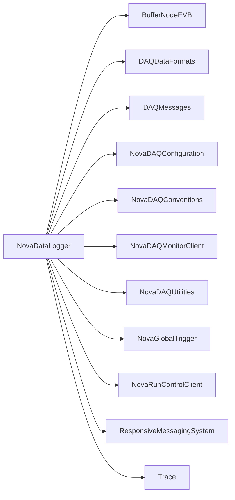

# NovaDataLogger

Receives selected event data, pools fragments, and writes versioned run/subrun streams to disk.

## Identity and scope

Repository: [NovaDAQ/NovaDataLogger](https://github.com/NovaDAQ/NovaDataLogger) · Reviewed commit: `e048941cdef398dce47cba02cb8adad3d93945a2` · Domain: **Data path**.

Tracked files: **58**. Production deployment and owner are **unconfirmed**.

## Operation

Before a run check output filesystem capacity, run identity, stream masks, and upstream connectivity. Monitor write errors and event completeness. Stop through Run Control and verify final headers/tails/file sizes before transfer.

For prerequisites, safe start/stop sequencing, health checks, and rollback see the [operations guide](../operations/index.md).

## Build and integration

This package uses the SRT/SoftRelTools release context. A standalone `make` in a fresh checkout is not a supported build recipe unless the required context is already configured. See [build and release](../operations/build.md).

| Build definition |
| --- |
| [GNUmakefile](https://github.com/NovaDAQ/NovaDataLogger/blob/e048941cdef398dce47cba02cb8adad3d93945a2/GNUmakefile) |
| [cxx/GNUmakefile](https://github.com/NovaDAQ/NovaDataLogger/blob/e048941cdef398dce47cba02cb8adad3d93945a2/cxx/GNUmakefile) |
| [cxx/src/GNUmakefile](https://github.com/NovaDAQ/NovaDataLogger/blob/e048941cdef398dce47cba02cb8adad3d93945a2/cxx/src/GNUmakefile) |
| [cxx/test/GNUmakefile](https://github.com/NovaDAQ/NovaDataLogger/blob/e048941cdef398dce47cba02cb8adad3d93945a2/cxx/test/GNUmakefile) |
| [cxx/unittest/GNUmakefile](https://github.com/NovaDAQ/NovaDataLogger/blob/e048941cdef398dce47cba02cb8adad3d93945a2/cxx/unittest/GNUmakefile) |
| [java/GNUmakefile](https://github.com/NovaDAQ/NovaDataLogger/blob/e048941cdef398dce47cba02cb8adad3d93945a2/java/GNUmakefile) |
| [java/src/GNUmakefile](https://github.com/NovaDAQ/NovaDataLogger/blob/e048941cdef398dce47cba02cb8adad3d93945a2/java/src/GNUmakefile) |
| [java/test/GNUmakefile](https://github.com/NovaDAQ/NovaDataLogger/blob/e048941cdef398dce47cba02cb8adad3d93945a2/java/test/GNUmakefile) |
| [java/unittest/GNUmakefile](https://github.com/NovaDAQ/NovaDataLogger/blob/e048941cdef398dce47cba02cb8adad3d93945a2/java/unittest/GNUmakefile) |

## Entry points

These are source entry points or operational scripts found statically. Installation names and enabled targets depend on the build/configuration; listing a script does not establish that it is deployed.

| Source |
| --- |
| [cxx/src/NovaDataLoggerapp.cc](https://github.com/NovaDAQ/NovaDataLogger/blob/e048941cdef398dce47cba02cb8adad3d93945a2/cxx/src/NovaDataLoggerapp.cc) |

## Interfaces

Headers and declared types form the API navigation map. Follow the source for method signatures, ownership, units, and error contracts. Generated DDS/XSD types are built from the schemas in the next section.

| Header | Declared types |
| --- | --- |
| [cxx/src/DLConf.h](https://github.com/NovaDAQ/NovaDataLogger/blob/e048941cdef398dce47cba02cb8adad3d93945a2/cxx/src/DLConf.h) | `DLConf`, `DLLogs` |
| [cxx/src/DLRCC.h](https://github.com/NovaDAQ/NovaDataLogger/blob/e048941cdef398dce47cba02cb8adad3d93945a2/cxx/src/DLRCC.h) | `DLConf`, `DLRCC`, `EventPool`, `RunControlReceiver` |
| [cxx/src/DLStats.h](https://github.com/NovaDAQ/NovaDataLogger/blob/e048941cdef398dce47cba02cb8adad3d93945a2/cxx/src/DLStats.h) | `DLStats` |
| [cxx/src/DataAtom.h](https://github.com/NovaDAQ/NovaDataLogger/blob/e048941cdef398dce47cba02cb8adad3d93945a2/cxx/src/DataAtom.h) | `DLConf`, `DataAtom`, `RawDataBlock`, `RawTrigger`, `dataatom_sts` |
| [cxx/src/DataBlockReader.h](https://github.com/NovaDAQ/NovaDataLogger/blob/e048941cdef398dce47cba02cb8adad3d93945a2/cxx/src/DataBlockReader.h) | `DLConf`, `DLStats`, `DataBlockReader`, `EventPool`, `RawDataBlock`, `Timeout` |
| [cxx/src/DataLogger.h](https://github.com/NovaDAQ/NovaDataLogger/blob/e048941cdef398dce47cba02cb8adad3d93945a2/cxx/src/DataLogger.h) | `DLConf`, `DLStats`, `DataLogger`, `Timeout` |
| [cxx/src/DataLoggerGTC.h](https://github.com/NovaDAQ/NovaDataLogger/blob/e048941cdef398dce47cba02cb8adad3d93945a2/cxx/src/DataLoggerGTC.h) | `DataLoggerGTC`, `GlobalTriggerReceiver`, `RunConfigurationContainer`, `TriggerMessage`, `TriggerReply` |
| [cxx/src/DataLoggeroptions.h](https://github.com/NovaDAQ/NovaDataLogger/blob/e048941cdef398dce47cba02cb8adad3d93945a2/cxx/src/DataLoggeroptions.h) | `DataLoggeroptions` |
| [cxx/src/EventPool.h](https://github.com/NovaDAQ/NovaDataLogger/blob/e048941cdef398dce47cba02cb8adad3d93945a2/cxx/src/EventPool.h) | `DLConf`, `DLStats`, `DataAtom`, `EventPool`, `InternalTrigger`, `RawDataBlock`, `RawTrigger`, `Timeout` |
| [cxx/src/RcvDataBlockThread2EventPoolThread.h](https://github.com/NovaDAQ/NovaDataLogger/blob/e048941cdef398dce47cba02cb8adad3d93945a2/cxx/src/RcvDataBlockThread2EventPoolThread.h) | `RcvDataBlockThread2EventPoolThread` |
| [cxx/src/RunConfiguration.h](https://github.com/NovaDAQ/NovaDataLogger/blob/e048941cdef398dce47cba02cb8adad3d93945a2/cxx/src/RunConfiguration.h) | `RunConfiguration` |
| [cxx/src/RunConfigurationContainer.h](https://github.com/NovaDAQ/NovaDataLogger/blob/e048941cdef398dce47cba02cb8adad3d93945a2/cxx/src/RunConfigurationContainer.h) | `EventPool`, `RunConfigurationContainer` |
| [cxx/src/RunStream.h](https://github.com/NovaDAQ/NovaDataLogger/blob/e048941cdef398dce47cba02cb8adad3d93945a2/cxx/src/RunStream.h) | `RawEvent`, `RunStream` |
| [cxx/src/RunStreamContainer.h](https://github.com/NovaDAQ/NovaDataLogger/blob/e048941cdef398dce47cba02cb8adad3d93945a2/cxx/src/RunStreamContainer.h) | `DLRCC`, `RawEvent`, `RunConfigurationContainer`, `RunStreamContainer` |
| [cxx/src/RunSubrun.h](https://github.com/NovaDAQ/NovaDataLogger/blob/e048941cdef398dce47cba02cb8adad3d93945a2/cxx/src/RunSubrun.h) | `RawEvent`, `RunConfiguration` |
| [cxx/src/TraceLock.h](https://github.com/NovaDAQ/NovaDataLogger/blob/e048941cdef398dce47cba02cb8adad3d93945a2/cxx/src/TraceLock.h) | `TraceLock` |
| [cxx/src/TriggerMask.h](https://github.com/NovaDAQ/NovaDataLogger/blob/e048941cdef398dce47cba02cb8adad3d93945a2/cxx/src/TriggerMask.h) | `TriggerMask` |

## Configuration and data contracts

No separate XML/IDL/XSD/FHiCL/INI/YAML/JSON configuration was identified. Inspect command-line parsing and site launchers for this package; defaults may be embedded in source.

## Environment and external dependencies

Environment names below are literal lookups found in source, not a guarantee that every value is mandatory. No environment values or credentials are copied into this documentation.

No literal environment lookup was identified by this scan; shell setup scripts may still provide required values.

Unresolved/non-package include roots (some are system or generated headers; this is not a package-manager lockfile):

| Include root | Evidence |
| --- | --- |
| `..` | [cxx/test/RunStreamTest.cc:10](https://github.com/NovaDAQ/NovaDataLogger/blob/e048941cdef398dce47cba02cb8adad3d93945a2/cxx/test/RunStreamTest.cc#L10) |
| `boost` | [cxx/src/DLRCC.h:7](https://github.com/NovaDAQ/NovaDataLogger/blob/e048941cdef398dce47cba02cb8adad3d93945a2/cxx/src/DLRCC.h#L7) |
| `netinet` | [cxx/src/DataLogger.cpp:20](https://github.com/NovaDAQ/NovaDataLogger/blob/e048941cdef398dce47cba02cb8adad3d93945a2/cxx/src/DataLogger.cpp#L20) |
| `sys` | [cxx/src/DLRCC.cpp:20](https://github.com/NovaDAQ/NovaDataLogger/blob/e048941cdef398dce47cba02cb8adad3d93945a2/cxx/src/DLRCC.cpp#L20) |

## Package dependencies

Arrow direction is **consumer → dependency**. This diagram includes source/build/runtime relationships and excludes test-only, release-membership, and build-tool edges. Conditional branches are not evaluated.

| Dependency | Relationship | Evidence |
| --- | --- | --- |
| [BufferNodeEVB](BufferNodeEVB.md) | build link | [cxx/src/GNUmakefile:20](https://github.com/NovaDAQ/NovaDataLogger/blob/e048941cdef398dce47cba02cb8adad3d93945a2/cxx/src/GNUmakefile#L20) |
| [BufferNodeEVB](BufferNodeEVB.md) | source include | [cxx/src/DLRCC.cpp:17](https://github.com/NovaDAQ/NovaDataLogger/blob/e048941cdef398dce47cba02cb8adad3d93945a2/cxx/src/DLRCC.cpp#L17) |
| [BufferNodeEVB](BufferNodeEVB.md) | test include | [cxx/test/SimulatedDataBlockSender.cc:16](https://github.com/NovaDAQ/NovaDataLogger/blob/e048941cdef398dce47cba02cb8adad3d93945a2/cxx/test/SimulatedDataBlockSender.cc#L16) |
| [BufferNodeEVB](BufferNodeEVB.md) | test link | [cxx/test/GNUmakefile:12](https://github.com/NovaDAQ/NovaDataLogger/blob/e048941cdef398dce47cba02cb8adad3d93945a2/cxx/test/GNUmakefile#L12) |
| [DAQDataFormats](DAQDataFormats.md) | build link | [cxx/src/GNUmakefile:24](https://github.com/NovaDAQ/NovaDataLogger/blob/e048941cdef398dce47cba02cb8adad3d93945a2/cxx/src/GNUmakefile#L24) |
| [DAQDataFormats](DAQDataFormats.md) | source include | [cxx/src/DataAtom.cpp:11](https://github.com/NovaDAQ/NovaDataLogger/blob/e048941cdef398dce47cba02cb8adad3d93945a2/cxx/src/DataAtom.cpp#L11) |
| [DAQDataFormats](DAQDataFormats.md) | test include | [cxx/test/NDLProcTest.cc:8](https://github.com/NovaDAQ/NovaDataLogger/blob/e048941cdef398dce47cba02cb8adad3d93945a2/cxx/test/NDLProcTest.cc#L8) |
| [DAQDataFormats](DAQDataFormats.md) | test link | [cxx/test/GNUmakefile:16](https://github.com/NovaDAQ/NovaDataLogger/blob/e048941cdef398dce47cba02cb8adad3d93945a2/cxx/test/GNUmakefile#L16) |
| [DAQMessages](DAQMessages.md) | build link | [cxx/src/GNUmakefile:22](https://github.com/NovaDAQ/NovaDataLogger/blob/e048941cdef398dce47cba02cb8adad3d93945a2/cxx/src/GNUmakefile#L22) |
| [DAQMessages](DAQMessages.md) | source include | [cxx/src/DLRCC.cpp:14](https://github.com/NovaDAQ/NovaDataLogger/blob/e048941cdef398dce47cba02cb8adad3d93945a2/cxx/src/DLRCC.cpp#L14) |
| [DAQMessages](DAQMessages.md) | test link | [cxx/test/GNUmakefile:14](https://github.com/NovaDAQ/NovaDataLogger/blob/e048941cdef398dce47cba02cb8adad3d93945a2/cxx/test/GNUmakefile#L14) |
| [NovaDAQConfiguration](NovaDAQConfiguration.md) | build link | [cxx/src/GNUmakefile:25](https://github.com/NovaDAQ/NovaDataLogger/blob/e048941cdef398dce47cba02cb8adad3d93945a2/cxx/src/GNUmakefile#L25) |
| [NovaDAQConfiguration](NovaDAQConfiguration.md) | source include | [cxx/src/DLRCC.cpp:11](https://github.com/NovaDAQ/NovaDataLogger/blob/e048941cdef398dce47cba02cb8adad3d93945a2/cxx/src/DLRCC.cpp#L11) |
| [NovaDAQConventions](NovaDAQConventions.md) | source include | [cxx/src/DLRCC.cpp:12](https://github.com/NovaDAQ/NovaDataLogger/blob/e048941cdef398dce47cba02cb8adad3d93945a2/cxx/src/DLRCC.cpp#L12) |
| [NovaDAQMonitorClient](NovaDAQMonitorClient.md) | source include | [cxx/src/EventPool.cpp:20](https://github.com/NovaDAQ/NovaDataLogger/blob/e048941cdef398dce47cba02cb8adad3d93945a2/cxx/src/EventPool.cpp#L20) |
| [NovaDAQUtilities](NovaDAQUtilities.md) | build link | [cxx/src/GNUmakefile:25](https://github.com/NovaDAQ/NovaDataLogger/blob/e048941cdef398dce47cba02cb8adad3d93945a2/cxx/src/GNUmakefile#L25) |
| [NovaDAQUtilities](NovaDAQUtilities.md) | source include | [cxx/src/RunConfigurationContainer.cpp:7](https://github.com/NovaDAQ/NovaDataLogger/blob/e048941cdef398dce47cba02cb8adad3d93945a2/cxx/src/RunConfigurationContainer.cpp#L7) |
| [NovaGlobalTrigger](NovaGlobalTrigger.md) | source include | [cxx/src/RunStreamContainer.cpp:8](https://github.com/NovaDAQ/NovaDataLogger/blob/e048941cdef398dce47cba02cb8adad3d93945a2/cxx/src/RunStreamContainer.cpp#L8) |
| [NovaRunControlClient](NovaRunControlClient.md) | build link | [cxx/src/GNUmakefile:21](https://github.com/NovaDAQ/NovaDataLogger/blob/e048941cdef398dce47cba02cb8adad3d93945a2/cxx/src/GNUmakefile#L21) |
| [NovaRunControlClient](NovaRunControlClient.md) | source include | [cxx/src/DLRCC.cpp:13](https://github.com/NovaDAQ/NovaDataLogger/blob/e048941cdef398dce47cba02cb8adad3d93945a2/cxx/src/DLRCC.cpp#L13) |
| [NovaRunControlClient](NovaRunControlClient.md) | test link | [cxx/test/GNUmakefile:13](https://github.com/NovaDAQ/NovaDataLogger/blob/e048941cdef398dce47cba02cb8adad3d93945a2/cxx/test/GNUmakefile#L13) |
| [ResponsiveMessagingSystem](ResponsiveMessagingSystem.md) | source include | [cxx/src/DLRCC.cpp:15](https://github.com/NovaDAQ/NovaDataLogger/blob/e048941cdef398dce47cba02cb8adad3d93945a2/cxx/src/DLRCC.cpp#L15) |
| [SRT_ONLINE](SRT_ONLINE.md) | build tool | [GNUmakefile:10](https://github.com/NovaDAQ/NovaDataLogger/blob/e048941cdef398dce47cba02cb8adad3d93945a2/GNUmakefile#L10) |
| [Trace](Trace.md) | build link | [cxx/src/GNUmakefile:20](https://github.com/NovaDAQ/NovaDataLogger/blob/e048941cdef398dce47cba02cb8adad3d93945a2/cxx/src/GNUmakefile#L20) |
| [Trace](Trace.md) | test link | [cxx/test/GNUmakefile:12](https://github.com/NovaDAQ/NovaDataLogger/blob/e048941cdef398dce47cba02cb8adad3d93945a2/cxx/test/GNUmakefile#L12) |

Direct consumers: [NovaDataLogger_OLD](NovaDataLogger_OLD.md).

Explore upstream/downstream impact in the [dependency explorer](../architecture/explorer.md).

## Validation and review

Static analysis attempted **29 C/C++ translation units**, **0 shell scripts**, and parsed **0 Python files**. Counts are tool input coverage, not proof of successful compilation or exhaustive review. Source/build/configuration inventories and the operating surface were also assessed.

| Severity | Finding | GitHub |
| --- | --- | --- |
| P1 | [NDAQ-003: Write one CRC word when finalizing a run file](../review/issues/NDAQ-003.md) | [Issue](https://github.com/NovaDAQ/NovaDataLogger/issues/1) |

Existing test/example sources (not executed against production):

| Source |
| --- |
| [cxx/test/NDLProcTest.cc](https://github.com/NovaDAQ/NovaDataLogger/blob/e048941cdef398dce47cba02cb8adad3d93945a2/cxx/test/NDLProcTest.cc) |
| [cxx/test/NDLRunOutTest.cc](https://github.com/NovaDAQ/NovaDataLogger/blob/e048941cdef398dce47cba02cb8adad3d93945a2/cxx/test/NDLRunOutTest.cc) |
| [cxx/test/NDLfdTest.cc](https://github.com/NovaDAQ/NovaDataLogger/blob/e048941cdef398dce47cba02cb8adad3d93945a2/cxx/test/NDLfdTest.cc) |
| [cxx/test/RawDataBlockTest.cc](https://github.com/NovaDAQ/NovaDataLogger/blob/e048941cdef398dce47cba02cb8adad3d93945a2/cxx/test/RawDataBlockTest.cc) |
| [cxx/test/RawEventHeadetTest.cc](https://github.com/NovaDAQ/NovaDataLogger/blob/e048941cdef398dce47cba02cb8adad3d93945a2/cxx/test/RawEventHeadetTest.cc) |
| [cxx/test/RawEventTailTest.cc](https://github.com/NovaDAQ/NovaDataLogger/blob/e048941cdef398dce47cba02cb8adad3d93945a2/cxx/test/RawEventTailTest.cc) |
| [cxx/test/RawEventTest.cc](https://github.com/NovaDAQ/NovaDataLogger/blob/e048941cdef398dce47cba02cb8adad3d93945a2/cxx/test/RawEventTest.cc) |
| [cxx/test/ReadDLEvent.cc](https://github.com/NovaDAQ/NovaDataLogger/blob/e048941cdef398dce47cba02cb8adad3d93945a2/cxx/test/ReadDLEvent.cc) |
| [cxx/test/ReadDLRun.cc](https://github.com/NovaDAQ/NovaDataLogger/blob/e048941cdef398dce47cba02cb8adad3d93945a2/cxx/test/ReadDLRun.cc) |
| [cxx/test/RunStreamTest.cc](https://github.com/NovaDAQ/NovaDataLogger/blob/e048941cdef398dce47cba02cb8adad3d93945a2/cxx/test/RunStreamTest.cc) |
| [cxx/test/ShMemTestR.cc](https://github.com/NovaDAQ/NovaDataLogger/blob/e048941cdef398dce47cba02cb8adad3d93945a2/cxx/test/ShMemTestR.cc) |
| [cxx/test/ShMemTestW.cc](https://github.com/NovaDAQ/NovaDataLogger/blob/e048941cdef398dce47cba02cb8adad3d93945a2/cxx/test/ShMemTestW.cc) |
| [cxx/test/SimulatedDataBlockSender.cc](https://github.com/NovaDAQ/NovaDataLogger/blob/e048941cdef398dce47cba02cb8adad3d93945a2/cxx/test/SimulatedDataBlockSender.cc) |
| [cxx/test/oldSimDBSender.cc](https://github.com/NovaDAQ/NovaDataLogger/blob/e048941cdef398dce47cba02cb8adad3d93945a2/cxx/test/oldSimDBSender.cc) |

## Existing documentation

| Source |
| --- |
| [doc/DataLoggerCodeStructure.txt](https://github.com/NovaDAQ/NovaDataLogger/blob/e048941cdef398dce47cba02cb8adad3d93945a2/doc/DataLoggerCodeStructure.txt) |
| [doc/DataLoggerTesting.txt](https://github.com/NovaDAQ/NovaDataLogger/blob/e048941cdef398dce47cba02cb8adad3d93945a2/doc/DataLoggerTesting.txt) |
