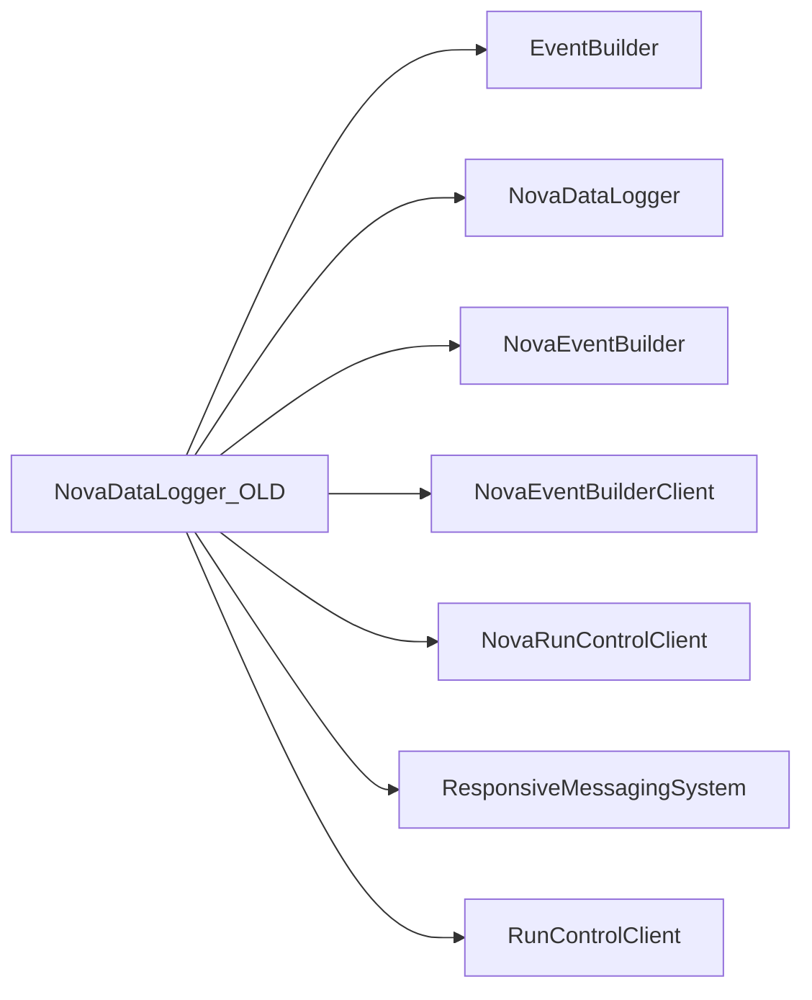

# NovaDataLogger_OLD

Earlier listener/event-manager data logger implementation.

## Identity and scope

Repository: [NovaDAQ/NovaDataLogger_OLD](https://github.com/NovaDAQ/NovaDataLogger_OLD) · Reviewed commit: `3e005881299b37e10cadfc05e6b99825b9d087a4` · Domain: **Data path**.

Tracked files: **26**. Production deployment and owner are **unconfirmed**. The directory name marks a legacy variant; retirement has not been independently verified.

## Operation

Confirm deployed lineage before applying a fix. Validate old stream framing and file output against the corresponding event builder; preserve a compatible reader for historical data.

For prerequisites, safe start/stop sequencing, health checks, and rollback see the [operations guide](../operations/index.md).

## Build and integration

This package uses the SRT/SoftRelTools release context. A standalone `make` in a fresh checkout is not a supported build recipe unless the required context is already configured. See [build and release](../operations/build.md).

| Build definition |
| --- |
| [GNUmakefile](https://github.com/NovaDAQ/NovaDataLogger_OLD/blob/3e005881299b37e10cadfc05e6b99825b9d087a4/GNUmakefile) |

## Entry points

These are source entry points or operational scripts found statically. Installation names and enabled targets depend on the build/configuration; listing a script does not establish that it is deployed.

| Source |
| --- |
| [cxx/src/novadatalogger.cc](https://github.com/NovaDAQ/NovaDataLogger_OLD/blob/3e005881299b37e10cadfc05e6b99825b9d087a4/cxx/src/novadatalogger.cc) |

## Interfaces

Headers and declared types form the API navigation map. Follow the source for method signatures, ownership, units, and error contracts. Generated DDS/XSD types are built from the schemas in the next section.

| Header | Declared types |
| --- | --- |
| [cxx/inc/NovaDataLogger/Acceptor.hpp](https://github.com/NovaDAQ/NovaDataLogger_OLD/blob/3e005881299b37e10cadfc05e6b99825b9d087a4/cxx/inc/NovaDataLogger/Acceptor.hpp) | `Acceptor` |
| [cxx/inc/NovaDataLogger/DataLogger.hpp](https://github.com/NovaDAQ/NovaDataLogger_OLD/blob/3e005881299b37e10cadfc05e6b99825b9d087a4/cxx/inc/NovaDataLogger/DataLogger.hpp) | `DataLogger`, `DataLoggerTest` |
| [cxx/inc/NovaDataLogger/Defs.hpp](https://github.com/NovaDAQ/NovaDataLogger_OLD/blob/3e005881299b37e10cadfc05e6b99825b9d087a4/cxx/inc/NovaDataLogger/Defs.hpp) | `ReturnValue`, `TraceLevel` |
| [cxx/inc/NovaDataLogger/Director.hpp](https://github.com/NovaDAQ/NovaDataLogger_OLD/blob/3e005881299b37e10cadfc05e6b99825b9d087a4/cxx/inc/NovaDataLogger/Director.hpp) | `Director`, `DirectorTest` |
| [cxx/inc/NovaDataLogger/EventManager.hpp](https://github.com/NovaDAQ/NovaDataLogger_OLD/blob/3e005881299b37e10cadfc05e6b99825b9d087a4/cxx/inc/NovaDataLogger/EventManager.hpp) | `EventEntryStatus`, `EventManager`, `EventManagerTest` |
| [cxx/inc/NovaDataLogger/NovaConnection.hpp](https://github.com/NovaDAQ/NovaDataLogger_OLD/blob/3e005881299b37e10cadfc05e6b99825b9d087a4/cxx/inc/NovaDataLogger/NovaConnection.hpp) | `NovaConnection` |
| [cxx/inc/NovaDataLogger/Processor.hpp](https://github.com/NovaDAQ/NovaDataLogger_OLD/blob/3e005881299b37e10cadfc05e6b99825b9d087a4/cxx/inc/NovaDataLogger/Processor.hpp) | `Processor` |
| [cxx/inc/NovaDataLogger/Trace.hpp](https://github.com/NovaDAQ/NovaDataLogger_OLD/blob/3e005881299b37e10cadfc05e6b99825b9d087a4/cxx/inc/NovaDataLogger/Trace.hpp) | `timeval` |

## Configuration and data contracts

| Source artifact |
| --- |
| [config/jcsc.xml](https://github.com/NovaDAQ/NovaDataLogger_OLD/blob/3e005881299b37e10cadfc05e6b99825b9d087a4/config/jcsc.xml) |

## Environment and external dependencies

Environment names below are literal lookups found in source, not a guarantee that every value is mandatory. No environment values or credentials are copied into this documentation.

No literal environment lookup was identified by this scan; shell setup scripts may still provide required values.

Unresolved/non-package include roots (some are system or generated headers; this is not a package-manager lockfile):

| Include root | Evidence |
| --- | --- |
| `boost` | [cxx/inc/NovaDataLogger/DataLogger.hpp:13](https://github.com/NovaDAQ/NovaDataLogger_OLD/blob/3e005881299b37e10cadfc05e6b99825b9d087a4/cxx/inc/NovaDataLogger/DataLogger.hpp#L13) |
| `cppunit` | [test/cxx/src/DataLoggerTest.cpp:5](https://github.com/NovaDAQ/NovaDataLogger_OLD/blob/3e005881299b37e10cadfc05e6b99825b9d087a4/test/cxx/src/DataLoggerTest.cpp#L5) |
| `linux` | [cxx/inc/NovaDataLogger/Trace.hpp:18](https://github.com/NovaDAQ/NovaDataLogger_OLD/blob/3e005881299b37e10cadfc05e6b99825b9d087a4/cxx/inc/NovaDataLogger/Trace.hpp#L18) |
| `netinet` | [test/cxx/src/DirectorTest.cpp:17](https://github.com/NovaDAQ/NovaDataLogger_OLD/blob/3e005881299b37e10cadfc05e6b99825b9d087a4/test/cxx/src/DirectorTest.cpp#L17) |
| `sys` | [cxx/inc/NovaDataLogger/Trace.hpp:20](https://github.com/NovaDAQ/NovaDataLogger_OLD/blob/3e005881299b37e10cadfc05e6b99825b9d087a4/cxx/inc/NovaDataLogger/Trace.hpp#L20) |

## Package dependencies

Arrow direction is **consumer → dependency**. This diagram includes source/build/runtime relationships and excludes test-only, release-membership, and build-tool edges. Conditional branches are not evaluated.

| Dependency | Relationship | Evidence |
| --- | --- | --- |
| [EventBuilder](EventBuilder.md) | build link | [GNUmakefile:153](https://github.com/NovaDAQ/NovaDataLogger_OLD/blob/3e005881299b37e10cadfc05e6b99825b9d087a4/GNUmakefile#L153) |
| [EventBuilder](EventBuilder.md) | source include | [cxx/inc/NovaDataLogger/Acceptor.hpp:14](https://github.com/NovaDAQ/NovaDataLogger_OLD/blob/3e005881299b37e10cadfc05e6b99825b9d087a4/cxx/inc/NovaDataLogger/Acceptor.hpp#L14) |
| [EventBuilder](EventBuilder.md) | test include | [test/cxx/src/EventManagerTest.cpp:12](https://github.com/NovaDAQ/NovaDataLogger_OLD/blob/3e005881299b37e10cadfc05e6b99825b9d087a4/test/cxx/src/EventManagerTest.cpp#L12) |
| [NovaDataLogger](NovaDataLogger.md) | source include | [cxx/inc/NovaDataLogger/Acceptor.hpp:9](https://github.com/NovaDAQ/NovaDataLogger_OLD/blob/3e005881299b37e10cadfc05e6b99825b9d087a4/cxx/inc/NovaDataLogger/Acceptor.hpp#L9) |
| [NovaDataLogger](NovaDataLogger.md) | test include | [test/cxx/src/DataLoggerTest.cpp:10](https://github.com/NovaDAQ/NovaDataLogger_OLD/blob/3e005881299b37e10cadfc05e6b99825b9d087a4/test/cxx/src/DataLoggerTest.cpp#L10) |
| [NovaEventBuilder](NovaEventBuilder.md) | build link | [GNUmakefile:152](https://github.com/NovaDAQ/NovaDataLogger_OLD/blob/3e005881299b37e10cadfc05e6b99825b9d087a4/GNUmakefile#L152) |
| [NovaEventBuilder](NovaEventBuilder.md) | source include | [cxx/inc/NovaDataLogger/DataLogger.hpp:11](https://github.com/NovaDAQ/NovaDataLogger_OLD/blob/3e005881299b37e10cadfc05e6b99825b9d087a4/cxx/inc/NovaDataLogger/DataLogger.hpp#L11) |
| [NovaEventBuilder](NovaEventBuilder.md) | test include | [test/cxx/src/DataLoggerTest.cpp:11](https://github.com/NovaDAQ/NovaDataLogger_OLD/blob/3e005881299b37e10cadfc05e6b99825b9d087a4/test/cxx/src/DataLoggerTest.cpp#L11) |
| [NovaEventBuilderClient](NovaEventBuilderClient.md) | build link | [GNUmakefile:156](https://github.com/NovaDAQ/NovaDataLogger_OLD/blob/3e005881299b37e10cadfc05e6b99825b9d087a4/GNUmakefile#L156) |
| [NovaRunControlClient](NovaRunControlClient.md) | build link | [GNUmakefile:150](https://github.com/NovaDAQ/NovaDataLogger_OLD/blob/3e005881299b37e10cadfc05e6b99825b9d087a4/GNUmakefile#L150) |
| [NovaRunControlClient](NovaRunControlClient.md) | source include | [cxx/inc/NovaDataLogger/Director.hpp:20](https://github.com/NovaDAQ/NovaDataLogger_OLD/blob/3e005881299b37e10cadfc05e6b99825b9d087a4/cxx/inc/NovaDataLogger/Director.hpp#L20) |
| [ResponsiveMessagingSystem](ResponsiveMessagingSystem.md) | build link | [GNUmakefile:144](https://github.com/NovaDAQ/NovaDataLogger_OLD/blob/3e005881299b37e10cadfc05e6b99825b9d087a4/GNUmakefile#L144) |
| [ResponsiveMessagingSystem](ResponsiveMessagingSystem.md) | test include | [test/cxx/src/DataLoggerTest.cpp:14](https://github.com/NovaDAQ/NovaDataLogger_OLD/blob/3e005881299b37e10cadfc05e6b99825b9d087a4/test/cxx/src/DataLoggerTest.cpp#L14) |
| [RunControlClient](RunControlClient.md) | build link | [GNUmakefile:151](https://github.com/NovaDAQ/NovaDataLogger_OLD/blob/3e005881299b37e10cadfc05e6b99825b9d087a4/GNUmakefile#L151) |

Direct consumers: None resolved in this snapshot.

Explore upstream/downstream impact in the [dependency explorer](../architecture/explorer.md).

## Validation and review

Static analysis attempted **10 C/C++ translation units**, **0 shell scripts**, and parsed **0 Python files**. Counts are tool input coverage, not proof of successful compilation or exhaustive review. Source/build/configuration inventories and the operating surface were also assessed.

No actionable defect was confirmed for this package in this review. This is a bounded review result, not a clean bill of health; unvalidated analyzer diagnostics were not filed as bugs.

Existing test/example sources (not executed against production):

| Source |
| --- |
| [test/cxx/src/DataLoggerTest.cpp](https://github.com/NovaDAQ/NovaDataLogger_OLD/blob/3e005881299b37e10cadfc05e6b99825b9d087a4/test/cxx/src/DataLoggerTest.cpp) |
| [test/cxx/src/DirectorTest.cpp](https://github.com/NovaDAQ/NovaDataLogger_OLD/blob/3e005881299b37e10cadfc05e6b99825b9d087a4/test/cxx/src/DirectorTest.cpp) |
| [test/cxx/src/EventManagerTest.cpp](https://github.com/NovaDAQ/NovaDataLogger_OLD/blob/3e005881299b37e10cadfc05e6b99825b9d087a4/test/cxx/src/EventManagerTest.cpp) |

## Existing documentation

| Source |
| --- |
| [README](https://github.com/NovaDAQ/NovaDataLogger_OLD/blob/3e005881299b37e10cadfc05e6b99825b9d087a4/README) |
