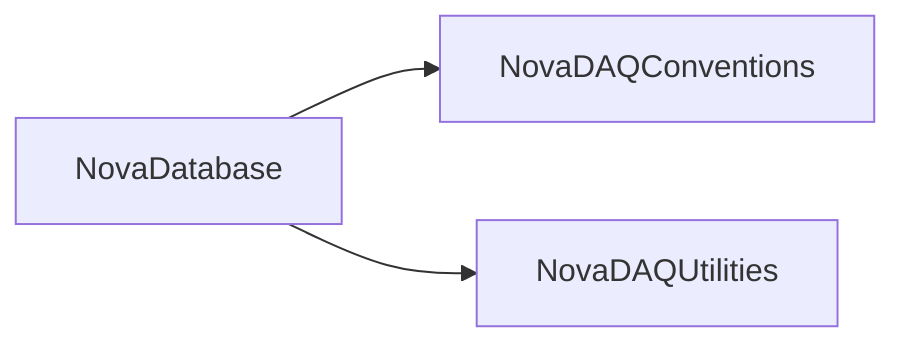

# NovaDatabase

Database table/row/column abstraction, CSV/SSV import-export tools, and schema scripts.

## Identity and scope

Repository: [NovaDAQ/NovaDatabase](https://github.com/NovaDAQ/NovaDatabase) · Reviewed commit: `ea6b6a4118fb76a8f0c8cd81542ed24a0ea89db6` · Domain: **Control**.

Tracked files: **135**. Production deployment and owner are **unconfirmed**.

## Operation

Choose development versus production connection explicitly and preserve schema/data backups before imports or alterations. Validate row counts, field types, and transaction outcomes with small staging samples.

For prerequisites, safe start/stop sequencing, health checks, and rollback see the [operations guide](../operations/index.md).

## Build and integration

This package uses the SRT/SoftRelTools release context. A standalone `make` in a fresh checkout is not a supported build recipe unless the required context is already configured. See [build and release](../operations/build.md).

CMake definitions are present. Most NOvA fragments use parent-provided cetbuildtools macros and dependency targets; consult the files below before treating this directory as a standalone CMake project.

| Build definition |
| --- |
| [CMakeLists.txt](https://github.com/NovaDAQ/NovaDatabase/blob/ea6b6a4118fb76a8f0c8cd81542ed24a0ea89db6/CMakeLists.txt) |
| [GNUmakefile](https://github.com/NovaDAQ/NovaDatabase/blob/ea6b6a4118fb76a8f0c8cd81542ed24a0ea89db6/GNUmakefile) |
| [cxx/CMakeLists.txt](https://github.com/NovaDAQ/NovaDatabase/blob/ea6b6a4118fb76a8f0c8cd81542ed24a0ea89db6/cxx/CMakeLists.txt) |
| [cxx/GNUmakefile](https://github.com/NovaDAQ/NovaDatabase/blob/ea6b6a4118fb76a8f0c8cd81542ed24a0ea89db6/cxx/GNUmakefile) |
| [cxx/include/CMakeLists.txt](https://github.com/NovaDAQ/NovaDatabase/blob/ea6b6a4118fb76a8f0c8cd81542ed24a0ea89db6/cxx/include/CMakeLists.txt) |
| [cxx/src/CMakeLists.txt](https://github.com/NovaDAQ/NovaDatabase/blob/ea6b6a4118fb76a8f0c8cd81542ed24a0ea89db6/cxx/src/CMakeLists.txt) |
| [cxx/src/GNUmakefile](https://github.com/NovaDAQ/NovaDatabase/blob/ea6b6a4118fb76a8f0c8cd81542ed24a0ea89db6/cxx/src/GNUmakefile) |
| [cxx/test/GNUmakefile](https://github.com/NovaDAQ/NovaDatabase/blob/ea6b6a4118fb76a8f0c8cd81542ed24a0ea89db6/cxx/test/GNUmakefile) |
| [cxx/unittest/GNUmakefile](https://github.com/NovaDAQ/NovaDatabase/blob/ea6b6a4118fb76a8f0c8cd81542ed24a0ea89db6/cxx/unittest/GNUmakefile) |
| [java/GNUmakefile](https://github.com/NovaDAQ/NovaDatabase/blob/ea6b6a4118fb76a8f0c8cd81542ed24a0ea89db6/java/GNUmakefile) |
| [java/src/GNUmakefile](https://github.com/NovaDAQ/NovaDatabase/blob/ea6b6a4118fb76a8f0c8cd81542ed24a0ea89db6/java/src/GNUmakefile) |
| [java/test/GNUmakefile](https://github.com/NovaDAQ/NovaDatabase/blob/ea6b6a4118fb76a8f0c8cd81542ed24a0ea89db6/java/test/GNUmakefile) |
| [java/unittest/GNUmakefile](https://github.com/NovaDAQ/NovaDatabase/blob/ea6b6a4118fb76a8f0c8cd81542ed24a0ea89db6/java/unittest/GNUmakefile) |
| [tables/CMakeLists.txt](https://github.com/NovaDAQ/NovaDatabase/blob/ea6b6a4118fb76a8f0c8cd81542ed24a0ea89db6/tables/CMakeLists.txt) |
| [tables/DAQAppMgr/CMakeLists.txt](https://github.com/NovaDAQ/NovaDatabase/blob/ea6b6a4118fb76a8f0c8cd81542ed24a0ea89db6/tables/DAQAppMgr/CMakeLists.txt) |
| [tables/DAQConfig/CMakeLists.txt](https://github.com/NovaDAQ/NovaDatabase/blob/ea6b6a4118fb76a8f0c8cd81542ed24a0ea89db6/tables/DAQConfig/CMakeLists.txt) |
| [tables/DCS/CMakeLists.txt](https://github.com/NovaDAQ/NovaDatabase/blob/ea6b6a4118fb76a8f0c8cd81542ed24a0ea89db6/tables/DCS/CMakeLists.txt) |
| [tables/Hardware/CMakeLists.txt](https://github.com/NovaDAQ/NovaDatabase/blob/ea6b6a4118fb76a8f0c8cd81542ed24a0ea89db6/tables/Hardware/CMakeLists.txt) |
| [tables/RunHistory/CMakeLists.txt](https://github.com/NovaDAQ/NovaDatabase/blob/ea6b6a4118fb76a8f0c8cd81542ed24a0ea89db6/tables/RunHistory/CMakeLists.txt) |

## Entry points

These are source entry points or operational scripts found statically. Installation names and enabled targets depend on the build/configuration; listing a script does not establish that it is deployed.

| Source |
| --- |
| [cxx/src/NovaCSVtoDB.cc](https://github.com/NovaDAQ/NovaDatabase/blob/ea6b6a4118fb76a8f0c8cd81542ed24a0ea89db6/cxx/src/NovaCSVtoDB.cc) |
| [cxx/src/NovaDBtoCSV.cc](https://github.com/NovaDAQ/NovaDatabase/blob/ea6b6a4118fb76a8f0c8cd81542ed24a0ea89db6/cxx/src/NovaDBtoCSV.cc) |
| [cxx/src/NovaSSVtoDB.cc](https://github.com/NovaDAQ/NovaDatabase/blob/ea6b6a4118fb76a8f0c8cd81542ed24a0ea89db6/cxx/src/NovaSSVtoDB.cc) |
| [cxx/src/createTableInDB.cc](https://github.com/NovaDAQ/NovaDatabase/blob/ea6b6a4118fb76a8f0c8cd81542ed24a0ea89db6/cxx/src/createTableInDB.cc) |
| [cxx/src/modifyTableInDB.cc](https://github.com/NovaDAQ/NovaDatabase/blob/ea6b6a4118fb76a8f0c8cd81542ed24a0ea89db6/cxx/src/modifyTableInDB.cc) |
| [tables/DAQConfig/addDDTConnectParams.sh](https://github.com/NovaDAQ/NovaDatabase/blob/ea6b6a4118fb76a8f0c8cd81542ed24a0ea89db6/tables/DAQConfig/addDDTConnectParams.sh) |
| [tables/DAQConfig/addNDMRunParams.sh](https://github.com/NovaDAQ/NovaDatabase/blob/ea6b6a4118fb76a8f0c8cd81542ed24a0ea89db6/tables/DAQConfig/addNDMRunParams.sh) |
| [tables/DAQConfig/alterDAQConfigSchema.sh](https://github.com/NovaDAQ/NovaDatabase/blob/ea6b6a4118fb76a8f0c8cd81542ed24a0ea89db6/tables/DAQConfig/alterDAQConfigSchema.sh) |
| [tables/DCS/alterDCSSchema.sh](https://github.com/NovaDAQ/NovaDatabase/blob/ea6b6a4118fb76a8f0c8cd81542ed24a0ea89db6/tables/DCS/alterDCSSchema.sh) |

## Interfaces

Headers and declared types form the API navigation map. Follow the source for method signatures, ownership, units, and error contracts. Generated DDS/XSD types are built from the schemas in the next section.

| Header | Declared types |
| --- | --- |
| [cxx/include/Column.h](https://github.com/NovaDAQ/NovaDatabase/blob/ea6b6a4118fb76a8f0c8cd81542ed24a0ea89db6/cxx/include/Column.h) | `Column`, `ToleranceType` |
| [cxx/include/Row.h](https://github.com/NovaDAQ/NovaDatabase/blob/ea6b6a4118fb76a8f0c8cd81542ed24a0ea89db6/cxx/include/Row.h) | `Row` |
| [cxx/include/Table.h](https://github.com/NovaDAQ/NovaDatabase/blob/ea6b6a4118fb76a8f0c8cd81542ed24a0ea89db6/cxx/include/Table.h) | `DBTableType`, `Table` |
| [cxx/include/Util.h](https://github.com/NovaDAQ/NovaDatabase/blob/ea6b6a4118fb76a8f0c8cd81542ed24a0ea89db6/cxx/include/Util.h) | `Util` |

## Configuration and data contracts

| Source artifact |
| --- |
| [config/NovaDatabase.xml](https://github.com/NovaDAQ/NovaDatabase/blob/ea6b6a4118fb76a8f0c8cd81542ed24a0ea89db6/config/NovaDatabase.xml) |
| [config/NovaDatabase.xsd](https://github.com/NovaDAQ/NovaDatabase/blob/ea6b6a4118fb76a8f0c8cd81542ed24a0ea89db6/config/NovaDatabase.xsd) |
| [cxx/unittest/basicTestTable1.xml](https://github.com/NovaDAQ/NovaDatabase/blob/ea6b6a4118fb76a8f0c8cd81542ed24a0ea89db6/cxx/unittest/basicTestTable1.xml) |
| [cxx/unittest/basicTestTable2.xml](https://github.com/NovaDAQ/NovaDatabase/blob/ea6b6a4118fb76a8f0c8cd81542ed24a0ea89db6/cxx/unittest/basicTestTable2.xml) |
| [cxx/unittest/basicTestTable3.xml](https://github.com/NovaDAQ/NovaDatabase/blob/ea6b6a4118fb76a8f0c8cd81542ed24a0ea89db6/cxx/unittest/basicTestTable3.xml) |
| [cxx/unittest/rsrVldTestTable.xml](https://github.com/NovaDAQ/NovaDatabase/blob/ea6b6a4118fb76a8f0c8cd81542ed24a0ea89db6/cxx/unittest/rsrVldTestTable.xml) |
| [cxx/unittest/tsVldTestTable.xml](https://github.com/NovaDAQ/NovaDatabase/blob/ea6b6a4118fb76a8f0c8cd81542ed24a0ea89db6/cxx/unittest/tsVldTestTable.xml) |
| [cxx/unittest/unitTest.xml](https://github.com/NovaDAQ/NovaDatabase/blob/ea6b6a4118fb76a8f0c8cd81542ed24a0ea89db6/cxx/unittest/unitTest.xml) |
| [cxx/unittest/unitTest2.xml](https://github.com/NovaDAQ/NovaDatabase/blob/ea6b6a4118fb76a8f0c8cd81542ed24a0ea89db6/cxx/unittest/unitTest2.xml) |
| [tables/DAQAppMgr/BNEVBApplicationMap.xml](https://github.com/NovaDAQ/NovaDatabase/blob/ea6b6a4118fb76a8f0c8cd81542ed24a0ea89db6/tables/DAQAppMgr/BNEVBApplicationMap.xml) |
| [tables/DAQAppMgr/ControlApplicationMap.xml](https://github.com/NovaDAQ/NovaDatabase/blob/ea6b6a4118fb76a8f0c8cd81542ed24a0ea89db6/tables/DAQAppMgr/ControlApplicationMap.xml) |
| [tables/DAQAppMgr/DCMApplicationMap.xml](https://github.com/NovaDAQ/NovaDatabase/blob/ea6b6a4118fb76a8f0c8cd81542ed24a0ea89db6/tables/DAQAppMgr/DCMApplicationMap.xml) |
| [tables/DAQAppMgr/DataLoggerApplicationMap.xml](https://github.com/NovaDAQ/NovaDatabase/blob/ea6b6a4118fb76a8f0c8cd81542ed24a0ea89db6/tables/DAQAppMgr/DataLoggerApplicationMap.xml) |
| [tables/DAQConfig/ASICRegisterSettings.xml](https://github.com/NovaDAQ/NovaDatabase/blob/ea6b6a4118fb76a8f0c8cd81542ed24a0ea89db6/tables/DAQConfig/ASICRegisterSettings.xml) |
| [tables/DAQConfig/BNEVBRunParameters.xml](https://github.com/NovaDAQ/NovaDatabase/blob/ea6b6a4118fb76a8f0c8cd81542ed24a0ea89db6/tables/DAQConfig/BNEVBRunParameters.xml) |
| [tables/DAQConfig/CalibrationTriggers.xml](https://github.com/NovaDAQ/NovaDatabase/blob/ea6b6a4118fb76a8f0c8cd81542ed24a0ea89db6/tables/DAQConfig/CalibrationTriggers.xml) |
| [tables/DAQConfig/DAQStatusTriggers.xml](https://github.com/NovaDAQ/NovaDatabase/blob/ea6b6a4118fb76a8f0c8cd81542ed24a0ea89db6/tables/DAQConfig/DAQStatusTriggers.xml) |
| [tables/DAQConfig/DCMApplicationConnectParameters.xml](https://github.com/NovaDAQ/NovaDatabase/blob/ea6b6a4118fb76a8f0c8cd81542ed24a0ea89db6/tables/DAQConfig/DCMApplicationConnectParameters.xml) |
| [tables/DAQConfig/DCMApplicationParameters.xml](https://github.com/NovaDAQ/NovaDatabase/blob/ea6b6a4118fb76a8f0c8cd81542ed24a0ea89db6/tables/DAQConfig/DCMApplicationParameters.xml) |
| [tables/DAQConfig/DCMApplicationRunParameters.xml](https://github.com/NovaDAQ/NovaDatabase/blob/ea6b6a4118fb76a8f0c8cd81542ed24a0ea89db6/tables/DAQConfig/DCMApplicationRunParameters.xml) |
| [tables/DAQConfig/DCMDataDevParameters.xml](https://github.com/NovaDAQ/NovaDatabase/blob/ea6b6a4118fb76a8f0c8cd81542ed24a0ea89db6/tables/DAQConfig/DCMDataDevParameters.xml) |
| [tables/DAQConfig/DCMDataDevRunParameters.xml](https://github.com/NovaDAQ/NovaDatabase/blob/ea6b6a4118fb76a8f0c8cd81542ed24a0ea89db6/tables/DAQConfig/DCMDataDevRunParameters.xml) |
| [tables/DAQConfig/DCMFPGAFirmwareLocations.xml](https://github.com/NovaDAQ/NovaDatabase/blob/ea6b6a4118fb76a8f0c8cd81542ed24a0ea89db6/tables/DAQConfig/DCMFPGAFirmwareLocations.xml) |
| [tables/DAQConfig/DCMFPGAParameters.xml](https://github.com/NovaDAQ/NovaDatabase/blob/ea6b6a4118fb76a8f0c8cd81542ed24a0ea89db6/tables/DAQConfig/DCMFPGAParameters.xml) |
| [tables/DAQConfig/DCMSystemParameters.xml](https://github.com/NovaDAQ/NovaDatabase/blob/ea6b6a4118fb76a8f0c8cd81542ed24a0ea89db6/tables/DAQConfig/DCMSystemParameters.xml) |
| [tables/DAQConfig/DCMSystemRunParameters.xml](https://github.com/NovaDAQ/NovaDatabase/blob/ea6b6a4118fb76a8f0c8cd81542ed24a0ea89db6/tables/DAQConfig/DCMSystemRunParameters.xml) |
| [tables/DAQConfig/DCMTimingDelaySettings.xml](https://github.com/NovaDAQ/NovaDatabase/blob/ea6b6a4118fb76a8f0c8cd81542ed24a0ea89db6/tables/DAQConfig/DCMTimingDelaySettings.xml) |
| [tables/DAQConfig/DDTManagerConnectParameters.xml](https://github.com/NovaDAQ/NovaDatabase/blob/ea6b6a4118fb76a8f0c8cd81542ed24a0ea89db6/tables/DAQConfig/DDTManagerConnectParameters.xml) |
| [tables/DAQConfig/DDTThrottle.xml](https://github.com/NovaDAQ/NovaDatabase/blob/ea6b6a4118fb76a8f0c8cd81542ed24a0ea89db6/tables/DAQConfig/DDTThrottle.xml) |
| [tables/DAQConfig/DSODataRegulatorSettings.xml](https://github.com/NovaDAQ/NovaDatabase/blob/ea6b6a4118fb76a8f0c8cd81542ed24a0ea89db6/tables/DAQConfig/DSODataRegulatorSettings.xml) |
| [tables/DAQConfig/DaqMonitorRunParameters.xml](https://github.com/NovaDAQ/NovaDatabase/blob/ea6b6a4118fb76a8f0c8cd81542ed24a0ea89db6/tables/DAQConfig/DaqMonitorRunParameters.xml) |
| [tables/DAQConfig/DataDrivenTriggers.xml](https://github.com/NovaDAQ/NovaDatabase/blob/ea6b6a4118fb76a8f0c8cd81542ed24a0ea89db6/tables/DAQConfig/DataDrivenTriggers.xml) |
| [tables/DAQConfig/DataLoggerStreams.xml](https://github.com/NovaDAQ/NovaDatabase/blob/ea6b6a4118fb76a8f0c8cd81542ed24a0ea89db6/tables/DAQConfig/DataLoggerStreams.xml) |
| [tables/DAQConfig/DataLoggerSystemParameters.xml](https://github.com/NovaDAQ/NovaDatabase/blob/ea6b6a4118fb76a8f0c8cd81542ed24a0ea89db6/tables/DAQConfig/DataLoggerSystemParameters.xml) |
| [tables/DAQConfig/ExternalTriggers.xml](https://github.com/NovaDAQ/NovaDatabase/blob/ea6b6a4118fb76a8f0c8cd81542ed24a0ea89db6/tables/DAQConfig/ExternalTriggers.xml) |
| [tables/DAQConfig/FEBEnableMasks.xml](https://github.com/NovaDAQ/NovaDatabase/blob/ea6b6a4118fb76a8f0c8cd81542ed24a0ea89db6/tables/DAQConfig/FEBEnableMasks.xml) |
| [tables/DAQConfig/FEBFPGAFirmwareLocations.xml](https://github.com/NovaDAQ/NovaDatabase/blob/ea6b6a4118fb76a8f0c8cd81542ed24a0ea89db6/tables/DAQConfig/FEBFPGAFirmwareLocations.xml) |
| [tables/DAQConfig/FEBPulserParameters.xml](https://github.com/NovaDAQ/NovaDatabase/blob/ea6b6a4118fb76a8f0c8cd81542ed24a0ea89db6/tables/DAQConfig/FEBPulserParameters.xml) |
| [tables/DAQConfig/GTGeneral.xml](https://github.com/NovaDAQ/NovaDatabase/blob/ea6b6a4118fb76a8f0c8cd81542ed24a0ea89db6/tables/DAQConfig/GTGeneral.xml) |
| [tables/DAQConfig/GTQueue.xml](https://github.com/NovaDAQ/NovaDatabase/blob/ea6b6a4118fb76a8f0c8cd81542ed24a0ea89db6/tables/DAQConfig/GTQueue.xml) |
| [tables/DAQConfig/GlobalThrottle.xml](https://github.com/NovaDAQ/NovaDatabase/blob/ea6b6a4118fb76a8f0c8cd81542ed24a0ea89db6/tables/DAQConfig/GlobalThrottle.xml) |
| [tables/DAQConfig/ManualTriggers.xml](https://github.com/NovaDAQ/NovaDatabase/blob/ea6b6a4118fb76a8f0c8cd81542ed24a0ea89db6/tables/DAQConfig/ManualTriggers.xml) |
| [tables/DAQConfig/NamedGlobalConfigurations.xml](https://github.com/NovaDAQ/NovaDatabase/blob/ea6b6a4118fb76a8f0c8cd81542ed24a0ea89db6/tables/DAQConfig/NamedGlobalConfigurations.xml) |
| [tables/DAQConfig/NamedSubsystemConfigurations.xml](https://github.com/NovaDAQ/NovaDatabase/blob/ea6b6a4118fb76a8f0c8cd81542ed24a0ea89db6/tables/DAQConfig/NamedSubsystemConfigurations.xml) |
| [tables/DAQConfig/PixelEnableMasks.xml](https://github.com/NovaDAQ/NovaDatabase/blob/ea6b6a4118fb76a8f0c8cd81542ed24a0ea89db6/tables/DAQConfig/PixelEnableMasks.xml) |
| [tables/DAQConfig/PixelOffsets.xml](https://github.com/NovaDAQ/NovaDatabase/blob/ea6b6a4118fb76a8f0c8cd81542ed24a0ea89db6/tables/DAQConfig/PixelOffsets.xml) |
| [tables/DAQConfig/PixelThresholds.xml](https://github.com/NovaDAQ/NovaDatabase/blob/ea6b6a4118fb76a8f0c8cd81542ed24a0ea89db6/tables/DAQConfig/PixelThresholds.xml) |
| [tables/DAQConfig/SNEWSPipe.xml](https://github.com/NovaDAQ/NovaDatabase/blob/ea6b6a4118fb76a8f0c8cd81542ed24a0ea89db6/tables/DAQConfig/SNEWSPipe.xml) |
| [tables/DAQConfig/SNEWSTriggers.xml](https://github.com/NovaDAQ/NovaDatabase/blob/ea6b6a4118fb76a8f0c8cd81542ed24a0ea89db6/tables/DAQConfig/SNEWSTriggers.xml) |
| [tables/DAQConfig/SpillTriggers.xml](https://github.com/NovaDAQ/NovaDatabase/blob/ea6b6a4118fb76a8f0c8cd81542ed24a0ea89db6/tables/DAQConfig/SpillTriggers.xml) |
| [tables/DAQConfig/SuperNovaFilter.xml](https://github.com/NovaDAQ/NovaDatabase/blob/ea6b6a4118fb76a8f0c8cd81542ed24a0ea89db6/tables/DAQConfig/SuperNovaFilter.xml) |
| [tables/DAQConfig/SuperNovaTrigger.xml](https://github.com/NovaDAQ/NovaDatabase/blob/ea6b6a4118fb76a8f0c8cd81542ed24a0ea89db6/tables/DAQConfig/SuperNovaTrigger.xml) |
| [tables/DAQConfig/TDUTimingDelaySettings.xml](https://github.com/NovaDAQ/NovaDatabase/blob/ea6b6a4118fb76a8f0c8cd81542ed24a0ea89db6/tables/DAQConfig/TDUTimingDelaySettings.xml) |
| [tables/DAQConfig/TimingSystemSettings.xml](https://github.com/NovaDAQ/NovaDatabase/blob/ea6b6a4118fb76a8f0c8cd81542ed24a0ea89db6/tables/DAQConfig/TimingSystemSettings.xml) |
| [tables/DAQConfig/TriggerOffsets.xml](https://github.com/NovaDAQ/NovaDatabase/blob/ea6b6a4118fb76a8f0c8cd81542ed24a0ea89db6/tables/DAQConfig/TriggerOffsets.xml) |
| [tables/DCS/APDHighVoltages.xml](https://github.com/NovaDAQ/NovaDatabase/blob/ea6b6a4118fb76a8f0c8cd81542ed24a0ea89db6/tables/DCS/APDHighVoltages.xml) |
| [tables/DCS/APDTemperatureSettings.xml](https://github.com/NovaDAQ/NovaDatabase/blob/ea6b6a4118fb76a8f0c8cd81542ed24a0ea89db6/tables/DCS/APDTemperatureSettings.xml) |
| [tables/DCS/DCSAlarm.xml](https://github.com/NovaDAQ/NovaDatabase/blob/ea6b6a4118fb76a8f0c8cd81542ed24a0ea89db6/tables/DCS/DCSAlarm.xml) |
| [tables/DCS/DCSAlarmThresholds.xml](https://github.com/NovaDAQ/NovaDatabase/blob/ea6b6a4118fb76a8f0c8cd81542ed24a0ea89db6/tables/DCS/DCSAlarmThresholds.xml) |
| [tables/DCS/DCSAnalogReport.xml](https://github.com/NovaDAQ/NovaDatabase/blob/ea6b6a4118fb76a8f0c8cd81542ed24a0ea89db6/tables/DCS/DCSAnalogReport.xml) |
| [tables/DCS/DCSAnalogSettings.xml](https://github.com/NovaDAQ/NovaDatabase/blob/ea6b6a4118fb76a8f0c8cd81542ed24a0ea89db6/tables/DCS/DCSAnalogSettings.xml) |
| [tables/DCS/DCSChannel.xml](https://github.com/NovaDAQ/NovaDatabase/blob/ea6b6a4118fb76a8f0c8cd81542ed24a0ea89db6/tables/DCS/DCSChannel.xml) |
| [tables/DCS/DCSConfigHistory.xml](https://github.com/NovaDAQ/NovaDatabase/blob/ea6b6a4118fb76a8f0c8cd81542ed24a0ea89db6/tables/DCS/DCSConfigHistory.xml) |
| [tables/DCS/DCSDigitalReport.xml](https://github.com/NovaDAQ/NovaDatabase/blob/ea6b6a4118fb76a8f0c8cd81542ed24a0ea89db6/tables/DCS/DCSDigitalReport.xml) |
| [tables/DCS/DCSDigitalSettings.xml](https://github.com/NovaDAQ/NovaDatabase/blob/ea6b6a4118fb76a8f0c8cd81542ed24a0ea89db6/tables/DCS/DCSDigitalSettings.xml) |
| [tables/DCS/DCSFEBEnableMasks.xml](https://github.com/NovaDAQ/NovaDatabase/blob/ea6b6a4118fb76a8f0c8cd81542ed24a0ea89db6/tables/DCS/DCSFEBEnableMasks.xml) |
| [tables/DCS/DCSFault.xml](https://github.com/NovaDAQ/NovaDatabase/blob/ea6b6a4118fb76a8f0c8cd81542ed24a0ea89db6/tables/DCS/DCSFault.xml) |
| [tables/DCS/DCSHardLimit.xml](https://github.com/NovaDAQ/NovaDatabase/blob/ea6b6a4118fb76a8f0c8cd81542ed24a0ea89db6/tables/DCS/DCSHardLimit.xml) |
| [tables/DCS/DCSNamedGlobalConfigurations.xml](https://github.com/NovaDAQ/NovaDatabase/blob/ea6b6a4118fb76a8f0c8cd81542ed24a0ea89db6/tables/DCS/DCSNamedGlobalConfigurations.xml) |
| [tables/DCS/DCSNamedSubsystemConfigurations.xml](https://github.com/NovaDAQ/NovaDatabase/blob/ea6b6a4118fb76a8f0c8cd81542ed24a0ea89db6/tables/DCS/DCSNamedSubsystemConfigurations.xml) |
| [tables/DCS/DCSReport.xml](https://github.com/NovaDAQ/NovaDatabase/blob/ea6b6a4118fb76a8f0c8cd81542ed24a0ea89db6/tables/DCS/DCSReport.xml) |
| [tables/DCS/DCSUnits.xml](https://github.com/NovaDAQ/NovaDatabase/blob/ea6b6a4118fb76a8f0c8cd81542ed24a0ea89db6/tables/DCS/DCSUnits.xml) |
| [tables/DCS/EPICSAlarmThresholds.xml](https://github.com/NovaDAQ/NovaDatabase/blob/ea6b6a4118fb76a8f0c8cd81542ed24a0ea89db6/tables/DCS/EPICSAlarmThresholds.xml) |
| [tables/DCS/FEBDryAirChannels.xml](https://github.com/NovaDAQ/NovaDatabase/blob/ea6b6a4118fb76a8f0c8cd81542ed24a0ea89db6/tables/DCS/FEBDryAirChannels.xml) |
| [tables/Hardware/HardwarePosition.xml](https://github.com/NovaDAQ/NovaDatabase/blob/ea6b6a4118fb76a8f0c8cd81542ed24a0ea89db6/tables/Hardware/HardwarePosition.xml) |
| [tables/Hardware/PPCBoardIdentifiers.xml](https://github.com/NovaDAQ/NovaDatabase/blob/ea6b6a4118fb76a8f0c8cd81542ed24a0ea89db6/tables/Hardware/PPCBoardIdentifiers.xml) |
| [tables/RunHistory/DAQResourcesByRun.xml](https://github.com/NovaDAQ/NovaDatabase/blob/ea6b6a4118fb76a8f0c8cd81542ed24a0ea89db6/tables/RunHistory/DAQResourcesByRun.xml) |
| [tables/RunHistory/POTByRun.xml](https://github.com/NovaDAQ/NovaDatabase/blob/ea6b6a4118fb76a8f0c8cd81542ed24a0ea89db6/tables/RunHistory/POTByRun.xml) |
| [tables/RunHistory/Runs.xml](https://github.com/NovaDAQ/NovaDatabase/blob/ea6b6a4118fb76a8f0c8cd81542ed24a0ea89db6/tables/RunHistory/Runs.xml) |
| [tables/RunHistory/Subruns.xml](https://github.com/NovaDAQ/NovaDatabase/blob/ea6b6a4118fb76a8f0c8cd81542ed24a0ea89db6/tables/RunHistory/Subruns.xml) |
| [tables/RunHistory/TriggerByRun.xml](https://github.com/NovaDAQ/NovaDatabase/blob/ea6b6a4118fb76a8f0c8cd81542ed24a0ea89db6/tables/RunHistory/TriggerByRun.xml) |
| [tables/RunHistory/TriggerBySubrun.xml](https://github.com/NovaDAQ/NovaDatabase/blob/ea6b6a4118fb76a8f0c8cd81542ed24a0ea89db6/tables/RunHistory/TriggerBySubrun.xml) |

## Environment and external dependencies

Environment names below are literal lookups found in source, not a guarantee that every value is mandatory. No environment values or credentials are copied into this documentation.

| Variable | Evidence |
| --- | --- |
| `NOVADBCACHEDIR` | [cxx/src/Table.cpp:256](https://github.com/NovaDAQ/NovaDatabase/blob/ea6b6a4118fb76a8f0c8cd81542ed24a0ea89db6/cxx/src/Table.cpp#L256) |
| `NOVADBHOST` | [cxx/src/Table.cpp:1467](https://github.com/NovaDAQ/NovaDatabase/blob/ea6b6a4118fb76a8f0c8cd81542ed24a0ea89db6/cxx/src/Table.cpp#L1467) |
| `NOVADBNAME` | [cxx/src/Table.cpp:1470](https://github.com/NovaDAQ/NovaDatabase/blob/ea6b6a4118fb76a8f0c8cd81542ed24a0ea89db6/cxx/src/Table.cpp#L1470) |
| `NOVADBNCNXTRIES` | [cxx/src/Table.cpp:47](https://github.com/NovaDAQ/NovaDatabase/blob/ea6b6a4118fb76a8f0c8cd81542ed24a0ea89db6/cxx/src/Table.cpp#L47) |
| `NOVADBPORT` | [cxx/src/Table.cpp:1473](https://github.com/NovaDAQ/NovaDatabase/blob/ea6b6a4118fb76a8f0c8cd81542ed24a0ea89db6/cxx/src/Table.cpp#L1473) |
| `NOVADBPWDFILE` | [cxx/src/Table.cpp:1566](https://github.com/NovaDAQ/NovaDatabase/blob/ea6b6a4118fb76a8f0c8cd81542ed24a0ea89db6/cxx/src/Table.cpp#L1566) |
| `NOVADBUSER` | [cxx/src/Table.cpp:1476](https://github.com/NovaDAQ/NovaDatabase/blob/ea6b6a4118fb76a8f0c8cd81542ed24a0ea89db6/cxx/src/Table.cpp#L1476) |
| `NOVADBVERB` | [cxx/src/Table.cpp:496](https://github.com/NovaDAQ/NovaDatabase/blob/ea6b6a4118fb76a8f0c8cd81542ed24a0ea89db6/cxx/src/Table.cpp#L496) |
| `NOVAHWDBHOST` | [cxx/src/Table.cpp:1453](https://github.com/NovaDAQ/NovaDatabase/blob/ea6b6a4118fb76a8f0c8cd81542ed24a0ea89db6/cxx/src/Table.cpp#L1453) |
| `NOVAHWDBNAME` | [cxx/src/Table.cpp:1456](https://github.com/NovaDAQ/NovaDatabase/blob/ea6b6a4118fb76a8f0c8cd81542ed24a0ea89db6/cxx/src/Table.cpp#L1456) |
| `NOVAHWDBPORT` | [cxx/src/Table.cpp:1459](https://github.com/NovaDAQ/NovaDatabase/blob/ea6b6a4118fb76a8f0c8cd81542ed24a0ea89db6/cxx/src/Table.cpp#L1459) |
| `NOVAHWDBUSER` | [cxx/src/Table.cpp:1462](https://github.com/NovaDAQ/NovaDatabase/blob/ea6b6a4118fb76a8f0c8cd81542ed24a0ea89db6/cxx/src/Table.cpp#L1462) |
| `PWD` | [cxx/src/Table.cpp:260](https://github.com/NovaDAQ/NovaDatabase/blob/ea6b6a4118fb76a8f0c8cd81542ed24a0ea89db6/cxx/src/Table.cpp#L260) |
| `USER` | [cxx/src/Table.cpp:1523](https://github.com/NovaDAQ/NovaDatabase/blob/ea6b6a4118fb76a8f0c8cd81542ed24a0ea89db6/cxx/src/Table.cpp#L1523) |

Unresolved/non-package include roots (some are system or generated headers; this is not a package-manager lockfile):

| Include root | Evidence |
| --- | --- |
| `boost` | [cxx/include/Column.h:7](https://github.com/NovaDAQ/NovaDatabase/blob/ea6b6a4118fb76a8f0c8cd81542ed24a0ea89db6/cxx/include/Column.h#L7) |
| `cppunit` | [cxx/unittest/BasicTests.cpp:1](https://github.com/NovaDAQ/NovaDatabase/blob/ea6b6a4118fb76a8f0c8cd81542ed24a0ea89db6/cxx/unittest/BasicTests.cpp#L1) |
| `curl` | [cxx/src/Table.cpp:10](https://github.com/NovaDAQ/NovaDatabase/blob/ea6b6a4118fb76a8f0c8cd81542ed24a0ea89db6/cxx/src/Table.cpp#L10) |
| `sys` | [cxx/src/Column.cpp:3](https://github.com/NovaDAQ/NovaDatabase/blob/ea6b6a4118fb76a8f0c8cd81542ed24a0ea89db6/cxx/src/Column.cpp#L3) |

## Package dependencies

Arrow direction is **consumer → dependency**. This diagram includes source/build/runtime relationships and excludes test-only, release-membership, and build-tool edges. Conditional branches are not evaluated.

| Dependency | Relationship | Evidence |
| --- | --- | --- |
| [NovaDAQConventions](NovaDAQConventions.md) | source include | [cxx/src/Table.cpp:16](https://github.com/NovaDAQ/NovaDatabase/blob/ea6b6a4118fb76a8f0c8cd81542ed24a0ea89db6/cxx/src/Table.cpp#L16) |
| [NovaDAQConventions](NovaDAQConventions.md) | test include | [cxx/unittest/DevelopmentTests.cpp:5](https://github.com/NovaDAQ/NovaDatabase/blob/ea6b6a4118fb76a8f0c8cd81542ed24a0ea89db6/cxx/unittest/DevelopmentTests.cpp#L5) |
| [NovaDAQUtilities](NovaDAQUtilities.md) | build link | [cxx/src/CMakeLists.txt:29](https://github.com/NovaDAQ/NovaDatabase/blob/ea6b6a4118fb76a8f0c8cd81542ed24a0ea89db6/cxx/src/CMakeLists.txt#L29) |
| [NovaDAQUtilities](NovaDAQUtilities.md) | source include | [cxx/src/NovaCSVtoDB.cc:4](https://github.com/NovaDAQ/NovaDatabase/blob/ea6b6a4118fb76a8f0c8cd81542ed24a0ea89db6/cxx/src/NovaCSVtoDB.cc#L4) |
| [NovaDAQUtilities](NovaDAQUtilities.md) | test include | [cxx/test/dbReadTest.cc:4](https://github.com/NovaDAQ/NovaDatabase/blob/ea6b6a4118fb76a8f0c8cd81542ed24a0ea89db6/cxx/test/dbReadTest.cc#L4) |
| [NovaDAQUtilities](NovaDAQUtilities.md) | test link | [cxx/test/GNUmakefile:11](https://github.com/NovaDAQ/NovaDatabase/blob/ea6b6a4118fb76a8f0c8cd81542ed24a0ea89db6/cxx/test/GNUmakefile#L11) |
| [SRT_ONLINE](SRT_ONLINE.md) | build tool | [GNUmakefile:10](https://github.com/NovaDAQ/NovaDatabase/blob/ea6b6a4118fb76a8f0c8cd81542ed24a0ea89db6/GNUmakefile#L10) |

Direct consumers: [DatabaseUtils](DatabaseUtils.md), [DetectorPlotter](DetectorPlotter.md), [NovaDAQCheckout](NovaDAQCheckout.md), [NovaDAQConfiguration](NovaDAQConfiguration.md), [NovaDaqDcs](NovaDaqDcs.md), [NovaRunControl](NovaRunControl.md), [SRT_ONLINE](SRT_ONLINE.md), [TDUControl](TDUControl.md), [TDUUtilities](TDUUtilities.md).

Explore upstream/downstream impact in the [dependency explorer](../architecture/explorer.md).

## Validation and review

Static analysis attempted **16 C/C++ translation units**, **11 shell scripts**, and parsed **0 Python files**. Counts are tool input coverage, not proof of successful compilation or exhaustive review. Source/build/configuration inventories and the operating surface were also assessed.

No actionable defect was confirmed for this package in this review. This is a bounded review result, not a clean bill of health; unvalidated analyzer diagnostics were not filed as bugs.

Existing test/example sources (not executed against production):

| Source |
| --- |
| [cxx/test/createFEBDryAirChannelTable.sh](https://github.com/NovaDAQ/NovaDatabase/blob/ea6b6a4118fb76a8f0c8cd81542ed24a0ea89db6/cxx/test/createFEBDryAirChannelTable.sh) |
| [cxx/test/dbReadTest.cc](https://github.com/NovaDAQ/NovaDatabase/blob/ea6b6a4118fb76a8f0c8cd81542ed24a0ea89db6/cxx/test/dbReadTest.cc) |
| [cxx/test/dbTestTableCreate.cc](https://github.com/NovaDAQ/NovaDatabase/blob/ea6b6a4118fb76a8f0c8cd81542ed24a0ea89db6/cxx/test/dbTestTableCreate.cc) |
| [cxx/test/dbWriteTest.cc](https://github.com/NovaDAQ/NovaDatabase/blob/ea6b6a4118fb76a8f0c8cd81542ed24a0ea89db6/cxx/test/dbWriteTest.cc) |
| [cxx/test/dropFEBDryAirChannelTable.sh](https://github.com/NovaDAQ/NovaDatabase/blob/ea6b6a4118fb76a8f0c8cd81542ed24a0ea89db6/cxx/test/dropFEBDryAirChannelTable.sh) |
| [cxx/test/initializePPCBoardIdTable.sh](https://github.com/NovaDAQ/NovaDatabase/blob/ea6b6a4118fb76a8f0c8cd81542ed24a0ea89db6/cxx/test/initializePPCBoardIdTable.sh) |
| [cxx/unittest/BasicTests.cpp](https://github.com/NovaDAQ/NovaDatabase/blob/ea6b6a4118fb76a8f0c8cd81542ed24a0ea89db6/cxx/unittest/BasicTests.cpp) |
| [cxx/unittest/DevelopmentTests.cpp](https://github.com/NovaDAQ/NovaDatabase/blob/ea6b6a4118fb76a8f0c8cd81542ed24a0ea89db6/cxx/unittest/DevelopmentTests.cpp) |
| [cxx/unittest/createUnitTestTables.sh](https://github.com/NovaDAQ/NovaDatabase/blob/ea6b6a4118fb76a8f0c8cd81542ed24a0ea89db6/cxx/unittest/createUnitTestTables.sh) |
| [cxx/unittest/createUnitTestVldTables.sh](https://github.com/NovaDAQ/NovaDatabase/blob/ea6b6a4118fb76a8f0c8cd81542ed24a0ea89db6/cxx/unittest/createUnitTestVldTables.sh) |
| [cxx/unittest/daqdbunittest.cc](https://github.com/NovaDAQ/NovaDatabase/blob/ea6b6a4118fb76a8f0c8cd81542ed24a0ea89db6/cxx/unittest/daqdbunittest.cc) |
| [cxx/unittest/dbUnitTest.cc](https://github.com/NovaDAQ/NovaDatabase/blob/ea6b6a4118fb76a8f0c8cd81542ed24a0ea89db6/cxx/unittest/dbUnitTest.cc) |
| [cxx/unittest/dropUnitTestTables.sh](https://github.com/NovaDAQ/NovaDatabase/blob/ea6b6a4118fb76a8f0c8cd81542ed24a0ea89db6/cxx/unittest/dropUnitTestTables.sh) |
| [cxx/unittest/dropUnitTestVldTables.sh](https://github.com/NovaDAQ/NovaDatabase/blob/ea6b6a4118fb76a8f0c8cd81542ed24a0ea89db6/cxx/unittest/dropUnitTestVldTables.sh) |

## Existing documentation

No package README/manual identified in the scoped inventory. Use this page and the source interfaces above.
