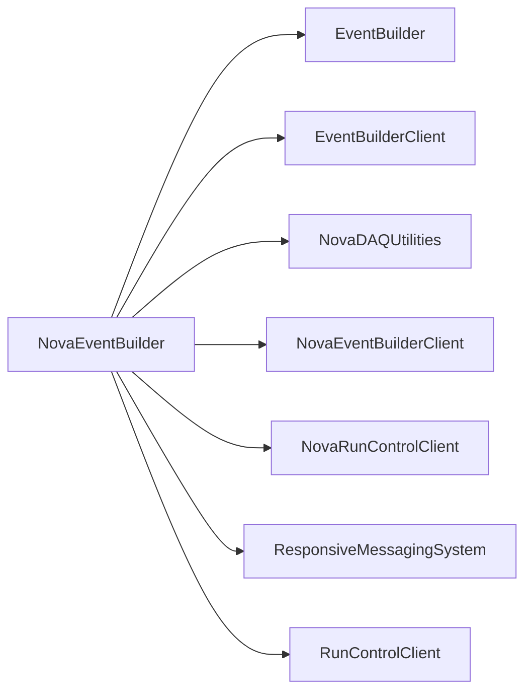

# NovaEventBuilder

NOvA-specific event assembly, selection, connection handling, and logger components layered on generic event building.

## Identity and scope

Repository: [NovaDAQ/NovaEventBuilder](https://github.com/NovaDAQ/NovaEventBuilder) · Reviewed commit: `28b0c3a3778e767202ddcf8512cdd4afaf9e0d3e` · Domain: **Data path**.

Tracked files: **35**. Production deployment and owner are **unconfirmed**.

## Operation

Match JumboHeader/SubFrame definitions to the sending client and run-control generation. Monitor incomplete events and downstream output; stop senders and drain buffers before shutdown.

For prerequisites, safe start/stop sequencing, health checks, and rollback see the [operations guide](../operations/index.md).

## Build and integration

This package uses the SRT/SoftRelTools release context. A standalone `make` in a fresh checkout is not a supported build recipe unless the required context is already configured. See [build and release](../operations/build.md).

| Build definition |
| --- |
| [GNUmakefile](https://github.com/NovaDAQ/NovaEventBuilder/blob/28b0c3a3778e767202ddcf8512cdd4afaf9e0d3e/GNUmakefile) |
| [cxx/GNUmakefile](https://github.com/NovaDAQ/NovaEventBuilder/blob/28b0c3a3778e767202ddcf8512cdd4afaf9e0d3e/cxx/GNUmakefile) |
| [cxx/src/GNUmakefile](https://github.com/NovaDAQ/NovaEventBuilder/blob/28b0c3a3778e767202ddcf8512cdd4afaf9e0d3e/cxx/src/GNUmakefile) |
| [cxx/test/GNUmakefile](https://github.com/NovaDAQ/NovaEventBuilder/blob/28b0c3a3778e767202ddcf8512cdd4afaf9e0d3e/cxx/test/GNUmakefile) |
| [cxx/unittest/GNUmakefile](https://github.com/NovaDAQ/NovaEventBuilder/blob/28b0c3a3778e767202ddcf8512cdd4afaf9e0d3e/cxx/unittest/GNUmakefile) |

## Entry points

These are source entry points or operational scripts found statically. Installation names and enabled targets depend on the build/configuration; listing a script does not establish that it is deployed.

| Source |
| --- |
| [cxx/src/novaeventbuilder.cc](https://github.com/NovaDAQ/NovaEventBuilder/blob/28b0c3a3778e767202ddcf8512cdd4afaf9e0d3e/cxx/src/novaeventbuilder.cc) |

## Interfaces

Headers and declared types form the API navigation map. Follow the source for method signatures, ownership, units, and error contracts. Generated DDS/XSD types are built from the schemas in the next section.

| Header | Declared types |
| --- | --- |
| [cxx/include/Acceptor.h](https://github.com/NovaDAQ/NovaEventBuilder/blob/28b0c3a3778e767202ddcf8512cdd4afaf9e0d3e/cxx/include/Acceptor.h) | `Acceptor` |
| [cxx/include/DCMData.h](https://github.com/NovaDAQ/NovaEventBuilder/blob/28b0c3a3778e767202ddcf8512cdd4afaf9e0d3e/cxx/include/DCMData.h) | `HitBlock`, `JumboHeader`, `PointerFrame`, `SubFrame`, `SubFramePointer` |
| [cxx/include/DataLogger.h](https://github.com/NovaDAQ/NovaEventBuilder/blob/28b0c3a3778e767202ddcf8512cdd4afaf9e0d3e/cxx/include/DataLogger.h) | `DataLogger`, `DataLoggerTest` |
| [cxx/include/DataLoggerHeader.h](https://github.com/NovaDAQ/NovaEventBuilder/blob/28b0c3a3778e767202ddcf8512cdd4afaf9e0d3e/cxx/include/DataLoggerHeader.h) | `DCMData`, `DCMPointer`, `DataLoggerEvent` |
| [cxx/include/DataSelector.h](https://github.com/NovaDAQ/NovaEventBuilder/blob/28b0c3a3778e767202ddcf8512cdd4afaf9e0d3e/cxx/include/DataSelector.h) | `DataSelector`, `DataSelectorTest` |
| [cxx/include/Defs.h](https://github.com/NovaDAQ/NovaEventBuilder/blob/28b0c3a3778e767202ddcf8512cdd4afaf9e0d3e/cxx/include/Defs.h) | `ReturnValue`, `TraceLevel` |
| [cxx/include/Director.h](https://github.com/NovaDAQ/NovaEventBuilder/blob/28b0c3a3778e767202ddcf8512cdd4afaf9e0d3e/cxx/include/Director.h) | `AcceptorType`, `Director`, `DirectorTest`, `StateManagerType` |
| [cxx/include/EventManager.h](https://github.com/NovaDAQ/NovaEventBuilder/blob/28b0c3a3778e767202ddcf8512cdd4afaf9e0d3e/cxx/include/EventManager.h) | `EventManager` |
| [cxx/include/NovaConnection.h](https://github.com/NovaDAQ/NovaEventBuilder/blob/28b0c3a3778e767202ddcf8512cdd4afaf9e0d3e/cxx/include/NovaConnection.h) | `NovaConnection` |
| [cxx/include/Processor.h](https://github.com/NovaDAQ/NovaEventBuilder/blob/28b0c3a3778e767202ddcf8512cdd4afaf9e0d3e/cxx/include/Processor.h) | `Processor` |
| [cxx/include/Trace.h](https://github.com/NovaDAQ/NovaEventBuilder/blob/28b0c3a3778e767202ddcf8512cdd4afaf9e0d3e/cxx/include/Trace.h) | `timeval` |

## Configuration and data contracts

No separate XML/IDL/XSD/FHiCL/INI/YAML/JSON configuration was identified. Inspect command-line parsing and site launchers for this package; defaults may be embedded in source.

## Environment and external dependencies

Environment names below are literal lookups found in source, not a guarantee that every value is mandatory. No environment values or credentials are copied into this documentation.

No literal environment lookup was identified by this scan; shell setup scripts may still provide required values.

Unresolved/non-package include roots (some are system or generated headers; this is not a package-manager lockfile):

| Include root | Evidence |
| --- | --- |
| `arpa` | [cxx/include/DCMData.h:11](https://github.com/NovaDAQ/NovaEventBuilder/blob/28b0c3a3778e767202ddcf8512cdd4afaf9e0d3e/cxx/include/DCMData.h#L11) |
| `boost` | [cxx/unittest/DataLoggerTest.cpp:21](https://github.com/NovaDAQ/NovaEventBuilder/blob/28b0c3a3778e767202ddcf8512cdd4afaf9e0d3e/cxx/unittest/DataLoggerTest.cpp#L21) |
| `cppunit` | [cxx/unittest/DataLoggerTest.cpp:3](https://github.com/NovaDAQ/NovaEventBuilder/blob/28b0c3a3778e767202ddcf8512cdd4afaf9e0d3e/cxx/unittest/DataLoggerTest.cpp#L3) |
| `linux` | [cxx/include/Trace.h:19](https://github.com/NovaDAQ/NovaEventBuilder/blob/28b0c3a3778e767202ddcf8512cdd4afaf9e0d3e/cxx/include/Trace.h#L19) |
| `netinet` | [cxx/test/TestTrigger.cc:11](https://github.com/NovaDAQ/NovaEventBuilder/blob/28b0c3a3778e767202ddcf8512cdd4afaf9e0d3e/cxx/test/TestTrigger.cc#L11) |
| `sys` | [cxx/include/Trace.h:21](https://github.com/NovaDAQ/NovaEventBuilder/blob/28b0c3a3778e767202ddcf8512cdd4afaf9e0d3e/cxx/include/Trace.h#L21) |

## Package dependencies

Arrow direction is **consumer → dependency**. This diagram includes source/build/runtime relationships and excludes test-only, release-membership, and build-tool edges. Conditional branches are not evaluated.

| Dependency | Relationship | Evidence |
| --- | --- | --- |
| [EventBuilder](EventBuilder.md) | build link | [cxx/src/GNUmakefile:17](https://github.com/NovaDAQ/NovaEventBuilder/blob/28b0c3a3778e767202ddcf8512cdd4afaf9e0d3e/cxx/src/GNUmakefile#L17) |
| [EventBuilder](EventBuilder.md) | source include | [cxx/include/Acceptor.h:14](https://github.com/NovaDAQ/NovaEventBuilder/blob/28b0c3a3778e767202ddcf8512cdd4afaf9e0d3e/cxx/include/Acceptor.h#L14) |
| [EventBuilder](EventBuilder.md) | test include | [cxx/unittest/DataSelectorTest.cpp:11](https://github.com/NovaDAQ/NovaEventBuilder/blob/28b0c3a3778e767202ddcf8512cdd4afaf9e0d3e/cxx/unittest/DataSelectorTest.cpp#L11) |
| [EventBuilder](EventBuilder.md) | test link | [cxx/test/GNUmakefile:11](https://github.com/NovaDAQ/NovaEventBuilder/blob/28b0c3a3778e767202ddcf8512cdd4afaf9e0d3e/cxx/test/GNUmakefile#L11) |
| [EventBuilderClient](EventBuilderClient.md) | source include | [cxx/include/DataLogger.h:9](https://github.com/NovaDAQ/NovaEventBuilder/blob/28b0c3a3778e767202ddcf8512cdd4afaf9e0d3e/cxx/include/DataLogger.h#L9) |
| [NovaDAQUtilities](NovaDAQUtilities.md) | build link | [cxx/src/GNUmakefile:17](https://github.com/NovaDAQ/NovaEventBuilder/blob/28b0c3a3778e767202ddcf8512cdd4afaf9e0d3e/cxx/src/GNUmakefile#L17) |
| [NovaDAQUtilities](NovaDAQUtilities.md) | source include | [cxx/include/DataLogger.h:19](https://github.com/NovaDAQ/NovaEventBuilder/blob/28b0c3a3778e767202ddcf8512cdd4afaf9e0d3e/cxx/include/DataLogger.h#L19) |
| [NovaDAQUtilities](NovaDAQUtilities.md) | test include | [cxx/unittest/DataLoggerTest.cpp:19](https://github.com/NovaDAQ/NovaEventBuilder/blob/28b0c3a3778e767202ddcf8512cdd4afaf9e0d3e/cxx/unittest/DataLoggerTest.cpp#L19) |
| [NovaEventBuilderClient](NovaEventBuilderClient.md) | build link | [cxx/src/GNUmakefile:17](https://github.com/NovaDAQ/NovaEventBuilder/blob/28b0c3a3778e767202ddcf8512cdd4afaf9e0d3e/cxx/src/GNUmakefile#L17) |
| [NovaEventBuilderClient](NovaEventBuilderClient.md) | source include | [cxx/include/DataSelector.h:17](https://github.com/NovaDAQ/NovaEventBuilder/blob/28b0c3a3778e767202ddcf8512cdd4afaf9e0d3e/cxx/include/DataSelector.h#L17) |
| [NovaEventBuilderClient](NovaEventBuilderClient.md) | test include | [cxx/unittest/DataSelectorTest.cpp:10](https://github.com/NovaDAQ/NovaEventBuilder/blob/28b0c3a3778e767202ddcf8512cdd4afaf9e0d3e/cxx/unittest/DataSelectorTest.cpp#L10) |
| [NovaEventBuilderClient](NovaEventBuilderClient.md) | test link | [cxx/unittest/GNUmakefile:17](https://github.com/NovaDAQ/NovaEventBuilder/blob/28b0c3a3778e767202ddcf8512cdd4afaf9e0d3e/cxx/unittest/GNUmakefile#L17) |
| [NovaRunControlClient](NovaRunControlClient.md) | build link | [cxx/src/GNUmakefile:17](https://github.com/NovaDAQ/NovaEventBuilder/blob/28b0c3a3778e767202ddcf8512cdd4afaf9e0d3e/cxx/src/GNUmakefile#L17) |
| [NovaRunControlClient](NovaRunControlClient.md) | source include | [cxx/include/Director.h:21](https://github.com/NovaDAQ/NovaEventBuilder/blob/28b0c3a3778e767202ddcf8512cdd4afaf9e0d3e/cxx/include/Director.h#L21) |
| [NovaRunControlClient](NovaRunControlClient.md) | test link | [cxx/test/GNUmakefile:11](https://github.com/NovaDAQ/NovaEventBuilder/blob/28b0c3a3778e767202ddcf8512cdd4afaf9e0d3e/cxx/test/GNUmakefile#L11) |
| [ResponsiveMessagingSystem](ResponsiveMessagingSystem.md) | build link | [cxx/src/GNUmakefile:17](https://github.com/NovaDAQ/NovaEventBuilder/blob/28b0c3a3778e767202ddcf8512cdd4afaf9e0d3e/cxx/src/GNUmakefile#L17) |
| [ResponsiveMessagingSystem](ResponsiveMessagingSystem.md) | test link | [cxx/test/GNUmakefile:11](https://github.com/NovaDAQ/NovaEventBuilder/blob/28b0c3a3778e767202ddcf8512cdd4afaf9e0d3e/cxx/test/GNUmakefile#L11) |
| [RunControlClient](RunControlClient.md) | build link | [cxx/src/GNUmakefile:17](https://github.com/NovaDAQ/NovaEventBuilder/blob/28b0c3a3778e767202ddcf8512cdd4afaf9e0d3e/cxx/src/GNUmakefile#L17) |
| [RunControlClient](RunControlClient.md) | source include | [cxx/include/DataLogger.h:18](https://github.com/NovaDAQ/NovaEventBuilder/blob/28b0c3a3778e767202ddcf8512cdd4afaf9e0d3e/cxx/include/DataLogger.h#L18) |
| [RunControlClient](RunControlClient.md) | test link | [cxx/test/GNUmakefile:11](https://github.com/NovaDAQ/NovaEventBuilder/blob/28b0c3a3778e767202ddcf8512cdd4afaf9e0d3e/cxx/test/GNUmakefile#L11) |
| [SRT_ONLINE](SRT_ONLINE.md) | build tool | [GNUmakefile:10](https://github.com/NovaDAQ/NovaEventBuilder/blob/28b0c3a3778e767202ddcf8512cdd4afaf9e0d3e/GNUmakefile#L10) |

Direct consumers: [NovaDataLogger_OLD](NovaDataLogger_OLD.md), [NovaEventBuilderClient](NovaEventBuilderClient.md), [NovaEventBuilderClient_OLD](NovaEventBuilderClient_OLD.md), [NovaEventBuilder_OLD](NovaEventBuilder_OLD.md).

Explore upstream/downstream impact in the [dependency explorer](../architecture/explorer.md).

## Validation and review

Static analysis attempted **12 C/C++ translation units**, **0 shell scripts**, and parsed **0 Python files**. Counts are tool input coverage, not proof of successful compilation or exhaustive review. Source/build/configuration inventories and the operating surface were also assessed.

No actionable defect was confirmed for this package in this review. This is a bounded review result, not a clean bill of health; unvalidated analyzer diagnostics were not filed as bugs.

Existing test/example sources (not executed against production):

| Source |
| --- |
| [cxx/test/TestTrigger.cc](https://github.com/NovaDAQ/NovaEventBuilder/blob/28b0c3a3778e767202ddcf8512cdd4afaf9e0d3e/cxx/test/TestTrigger.cc) |
| [cxx/unittest/DataLoggerTest.cpp](https://github.com/NovaDAQ/NovaEventBuilder/blob/28b0c3a3778e767202ddcf8512cdd4afaf9e0d3e/cxx/unittest/DataLoggerTest.cpp) |
| [cxx/unittest/DataLoggerTest.h](https://github.com/NovaDAQ/NovaEventBuilder/blob/28b0c3a3778e767202ddcf8512cdd4afaf9e0d3e/cxx/unittest/DataLoggerTest.h) |
| [cxx/unittest/DataSelectorTest.cpp](https://github.com/NovaDAQ/NovaEventBuilder/blob/28b0c3a3778e767202ddcf8512cdd4afaf9e0d3e/cxx/unittest/DataSelectorTest.cpp) |
| [cxx/unittest/DataSelectorTest.h](https://github.com/NovaDAQ/NovaEventBuilder/blob/28b0c3a3778e767202ddcf8512cdd4afaf9e0d3e/cxx/unittest/DataSelectorTest.h) |
| [cxx/unittest/DirectorTest.cpp](https://github.com/NovaDAQ/NovaEventBuilder/blob/28b0c3a3778e767202ddcf8512cdd4afaf9e0d3e/cxx/unittest/DirectorTest.cpp) |
| [cxx/unittest/DirectorTest.h](https://github.com/NovaDAQ/NovaEventBuilder/blob/28b0c3a3778e767202ddcf8512cdd4afaf9e0d3e/cxx/unittest/DirectorTest.h) |
| [cxx/unittest/NEVBUnitTestMain.cc](https://github.com/NovaDAQ/NovaEventBuilder/blob/28b0c3a3778e767202ddcf8512cdd4afaf9e0d3e/cxx/unittest/NEVBUnitTestMain.cc) |

## Existing documentation

No package README/manual identified in the scoped inventory. Use this page and the source interfaces above.
