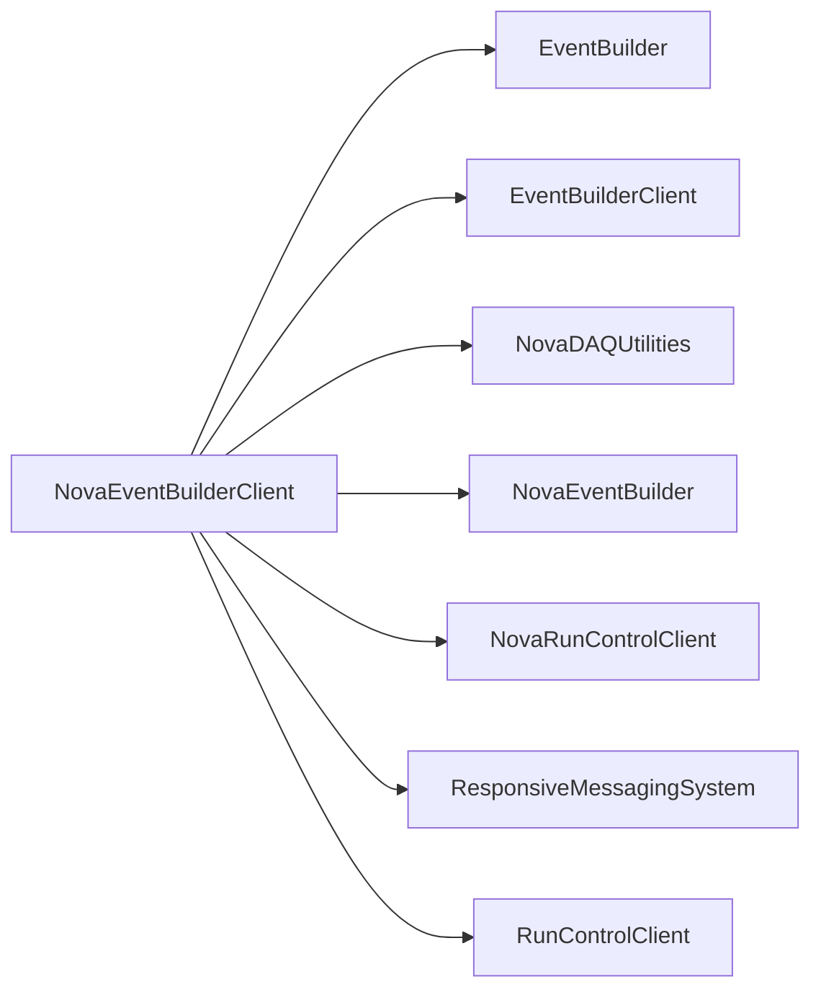

# NovaEventBuilderClient

DCM client, reader, generator, and dispatcher for the NOvA event-builder path.

## Identity and scope

Repository: [NovaDAQ/NovaEventBuilderClient](https://github.com/NovaDAQ/NovaEventBuilderClient) · Reviewed commit: `e43f9a9047dc4e0d153159bd364441ca2f837f78` · Domain: **Data path**.

Tracked files: **26**. Production deployment and owner are **unconfirmed**.

## Operation

Choose hardware versus generated data explicitly. Check /dev/dcm_data availability only in hardware mode, and verify framing/timestamps at the server in either mode. Preserve sender/server version alignment.

For prerequisites, safe start/stop sequencing, health checks, and rollback see the [operations guide](../operations/index.md).

## Build and integration

This package uses the SRT/SoftRelTools release context. A standalone `make` in a fresh checkout is not a supported build recipe unless the required context is already configured. See [build and release](../operations/build.md).

| Build definition |
| --- |
| [GNUmakefile](https://github.com/NovaDAQ/NovaEventBuilderClient/blob/e43f9a9047dc4e0d153159bd364441ca2f837f78/GNUmakefile) |
| [cxx/GNUmakefile](https://github.com/NovaDAQ/NovaEventBuilderClient/blob/e43f9a9047dc4e0d153159bd364441ca2f837f78/cxx/GNUmakefile) |
| [cxx/src/GNUmakefile](https://github.com/NovaDAQ/NovaEventBuilderClient/blob/e43f9a9047dc4e0d153159bd364441ca2f837f78/cxx/src/GNUmakefile) |
| [cxx/test/GNUmakefile](https://github.com/NovaDAQ/NovaEventBuilderClient/blob/e43f9a9047dc4e0d153159bd364441ca2f837f78/cxx/test/GNUmakefile) |
| [cxx/unittest/GNUmakefile](https://github.com/NovaDAQ/NovaEventBuilderClient/blob/e43f9a9047dc4e0d153159bd364441ca2f837f78/cxx/unittest/GNUmakefile) |

## Entry points

These are source entry points or operational scripts found statically. Installation names and enabled targets depend on the build/configuration; listing a script does not establish that it is deployed.

| Source |
| --- |
| [cxx/src/dcmclient.cc](https://github.com/NovaDAQ/NovaEventBuilderClient/blob/e43f9a9047dc4e0d153159bd364441ca2f837f78/cxx/src/dcmclient.cc) |

## Interfaces

Headers and declared types form the API navigation map. Follow the source for method signatures, ownership, units, and error contracts. Generated DDS/XSD types are built from the schemas in the next section.

| Header | Declared types |
| --- | --- |
| [cxx/include/DCMClient.h](https://github.com/NovaDAQ/NovaEventBuilderClient/blob/e43f9a9047dc4e0d153159bd364441ca2f837f78/cxx/include/DCMClient.h) | `DCMClient`, `DCMReaderTest` |
| [cxx/include/DCMDispatcher.h](https://github.com/NovaDAQ/NovaEventBuilderClient/blob/e43f9a9047dc4e0d153159bd364441ca2f837f78/cxx/include/DCMDispatcher.h) | `DCMDispatcher`, `DCMDispatcherTest` |
| [cxx/include/DCMReader.h](https://github.com/NovaDAQ/NovaEventBuilderClient/blob/e43f9a9047dc4e0d153159bd364441ca2f837f78/cxx/include/DCMReader.h) | `DCMReader`, `DCMReaderTest`, `microSliceHeader_t`, `nanoSlice_t` |
| [cxx/include/DataGenerator.h](https://github.com/NovaDAQ/NovaEventBuilderClient/blob/e43f9a9047dc4e0d153159bd364441ca2f837f78/cxx/include/DataGenerator.h) | `DataGenerator`, `DataGeneratorTest` |
| [cxx/include/Defs.h](https://github.com/NovaDAQ/NovaEventBuilderClient/blob/e43f9a9047dc4e0d153159bd364441ca2f837f78/cxx/include/Defs.h) | `ReturnValue`, `TraceLevel` |
| [cxx/include/JumboBuffer.h](https://github.com/NovaDAQ/NovaEventBuilderClient/blob/e43f9a9047dc4e0d153159bd364441ca2f837f78/cxx/include/JumboBuffer.h) | `JumboBuffer` |
| [cxx/include/Trace.h](https://github.com/NovaDAQ/NovaEventBuilderClient/blob/e43f9a9047dc4e0d153159bd364441ca2f837f78/cxx/include/Trace.h) | Functions, constants, or templates |

## Configuration and data contracts

No separate XML/IDL/XSD/FHiCL/INI/YAML/JSON configuration was identified. Inspect command-line parsing and site launchers for this package; defaults may be embedded in source.

## Environment and external dependencies

Environment names below are literal lookups found in source, not a guarantee that every value is mandatory. No environment values or credentials are copied into this documentation.

No literal environment lookup was identified by this scan; shell setup scripts may still provide required values.

Unresolved/non-package include roots (some are system or generated headers; this is not a package-manager lockfile):

| Include root | Evidence |
| --- | --- |
| `boost` | [cxx/include/DCMClient.h:18](https://github.com/NovaDAQ/NovaEventBuilderClient/blob/e43f9a9047dc4e0d153159bd364441ca2f837f78/cxx/include/DCMClient.h#L18) |
| `cppunit` | [cxx/unittest/DataGeneratorTest.cpp:3](https://github.com/NovaDAQ/NovaEventBuilderClient/blob/e43f9a9047dc4e0d153159bd364441ca2f837f78/cxx/unittest/DataGeneratorTest.cpp#L3) |
| `linux` | [cxx/include/Trace.h:18](https://github.com/NovaDAQ/NovaEventBuilderClient/blob/e43f9a9047dc4e0d153159bd364441ca2f837f78/cxx/include/Trace.h#L18) |
| `sys` | [cxx/include/Trace.h:16](https://github.com/NovaDAQ/NovaEventBuilderClient/blob/e43f9a9047dc4e0d153159bd364441ca2f837f78/cxx/include/Trace.h#L16) |

## Package dependencies

Arrow direction is **consumer → dependency**. This diagram includes source/build/runtime relationships and excludes test-only, release-membership, and build-tool edges. Conditional branches are not evaluated.

| Dependency | Relationship | Evidence |
| --- | --- | --- |
| [EventBuilder](EventBuilder.md) | build link | [cxx/src/GNUmakefile:17](https://github.com/NovaDAQ/NovaEventBuilderClient/blob/e43f9a9047dc4e0d153159bd364441ca2f837f78/cxx/src/GNUmakefile#L17) |
| [EventBuilder](EventBuilder.md) | source include | [cxx/include/DCMClient.h:15](https://github.com/NovaDAQ/NovaEventBuilderClient/blob/e43f9a9047dc4e0d153159bd364441ca2f837f78/cxx/include/DCMClient.h#L15) |
| [EventBuilder](EventBuilder.md) | test link | [cxx/test/GNUmakefile:11](https://github.com/NovaDAQ/NovaEventBuilderClient/blob/e43f9a9047dc4e0d153159bd364441ca2f837f78/cxx/test/GNUmakefile#L11) |
| [EventBuilderClient](EventBuilderClient.md) | source include | [cxx/include/DCMDispatcher.h:13](https://github.com/NovaDAQ/NovaEventBuilderClient/blob/e43f9a9047dc4e0d153159bd364441ca2f837f78/cxx/include/DCMDispatcher.h#L13) |
| [EventBuilderClient](EventBuilderClient.md) | test include | [cxx/test/NovaEventBuilderClient.cc:8](https://github.com/NovaDAQ/NovaEventBuilderClient/blob/e43f9a9047dc4e0d153159bd364441ca2f837f78/cxx/test/NovaEventBuilderClient.cc#L8) |
| [NovaDAQUtilities](NovaDAQUtilities.md) | source include | [cxx/include/DCMDispatcher.h:15](https://github.com/NovaDAQ/NovaEventBuilderClient/blob/e43f9a9047dc4e0d153159bd364441ca2f837f78/cxx/include/DCMDispatcher.h#L15) |
| [NovaEventBuilder](NovaEventBuilder.md) | source include | [cxx/include/DCMClient.h:16](https://github.com/NovaDAQ/NovaEventBuilderClient/blob/e43f9a9047dc4e0d153159bd364441ca2f837f78/cxx/include/DCMClient.h#L16) |
| [NovaRunControlClient](NovaRunControlClient.md) | build link | [cxx/src/GNUmakefile:17](https://github.com/NovaDAQ/NovaEventBuilderClient/blob/e43f9a9047dc4e0d153159bd364441ca2f837f78/cxx/src/GNUmakefile#L17) |
| [NovaRunControlClient](NovaRunControlClient.md) | test link | [cxx/test/GNUmakefile:11](https://github.com/NovaDAQ/NovaEventBuilderClient/blob/e43f9a9047dc4e0d153159bd364441ca2f837f78/cxx/test/GNUmakefile#L11) |
| [ResponsiveMessagingSystem](ResponsiveMessagingSystem.md) | build link | [cxx/src/GNUmakefile:17](https://github.com/NovaDAQ/NovaEventBuilderClient/blob/e43f9a9047dc4e0d153159bd364441ca2f837f78/cxx/src/GNUmakefile#L17) |
| [ResponsiveMessagingSystem](ResponsiveMessagingSystem.md) | test link | [cxx/test/GNUmakefile:11](https://github.com/NovaDAQ/NovaEventBuilderClient/blob/e43f9a9047dc4e0d153159bd364441ca2f837f78/cxx/test/GNUmakefile#L11) |
| [RunControlClient](RunControlClient.md) | build link | [cxx/src/GNUmakefile:17](https://github.com/NovaDAQ/NovaEventBuilderClient/blob/e43f9a9047dc4e0d153159bd364441ca2f837f78/cxx/src/GNUmakefile#L17) |
| [RunControlClient](RunControlClient.md) | test link | [cxx/test/GNUmakefile:11](https://github.com/NovaDAQ/NovaEventBuilderClient/blob/e43f9a9047dc4e0d153159bd364441ca2f837f78/cxx/test/GNUmakefile#L11) |
| [SRT_ONLINE](SRT_ONLINE.md) | build tool | [GNUmakefile:10](https://github.com/NovaDAQ/NovaEventBuilderClient/blob/e43f9a9047dc4e0d153159bd364441ca2f837f78/GNUmakefile#L10) |

Direct consumers: [NovaDataLogger_OLD](NovaDataLogger_OLD.md), [NovaEventBuilder](NovaEventBuilder.md), [NovaEventBuilderClient_OLD](NovaEventBuilderClient_OLD.md), [NovaEventBuilder_OLD](NovaEventBuilder_OLD.md).

Explore upstream/downstream impact in the [dependency explorer](../architecture/explorer.md).

## Validation and review

Static analysis attempted **8 C/C++ translation units**, **0 shell scripts**, and parsed **0 Python files**. Counts are tool input coverage, not proof of successful compilation or exhaustive review. Source/build/configuration inventories and the operating surface were also assessed.

| Severity | Finding | GitHub |
| --- | --- | --- |
| P2 | [NDAQ-035: Initialize the DCM descriptor before simulated-reader cleanup](../review/issues/NDAQ-035.md) | [Issue](https://github.com/NovaDAQ/NovaEventBuilderClient/issues/1) |

Existing test/example sources (not executed against production):

| Source |
| --- |
| [cxx/test/NovaEventBuilderClient.cc](https://github.com/NovaDAQ/NovaEventBuilderClient/blob/e43f9a9047dc4e0d153159bd364441ca2f837f78/cxx/test/NovaEventBuilderClient.cc) |
| [cxx/unittest/DataGeneratorTest.cpp](https://github.com/NovaDAQ/NovaEventBuilderClient/blob/e43f9a9047dc4e0d153159bd364441ca2f837f78/cxx/unittest/DataGeneratorTest.cpp) |
| [cxx/unittest/DataGeneratorTest.h](https://github.com/NovaDAQ/NovaEventBuilderClient/blob/e43f9a9047dc4e0d153159bd364441ca2f837f78/cxx/unittest/DataGeneratorTest.h) |
| [cxx/unittest/NEVBCUnitTestMain.cc](https://github.com/NovaDAQ/NovaEventBuilderClient/blob/e43f9a9047dc4e0d153159bd364441ca2f837f78/cxx/unittest/NEVBCUnitTestMain.cc) |

## Existing documentation

No package README/manual identified in the scoped inventory. Use this page and the source interfaces above.
