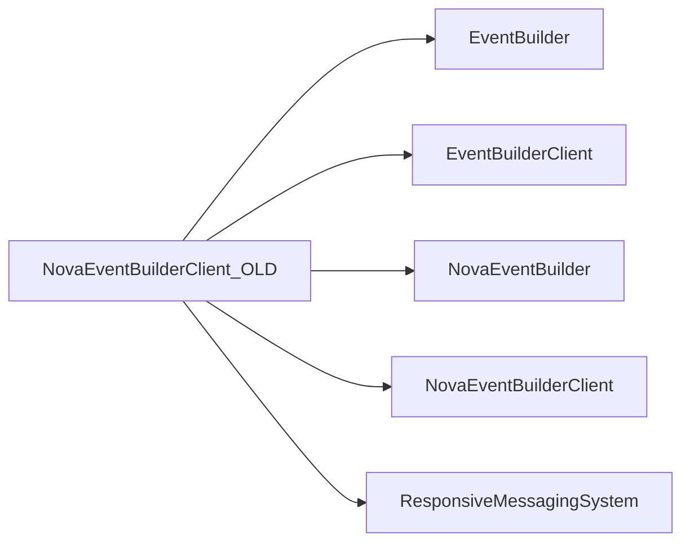

# NovaEventBuilderClient_OLD

Historical NOvA DCM/event-builder client with generator tests.

## Identity and scope

Repository: [NovaDAQ/NovaEventBuilderClient_OLD](https://github.com/NovaDAQ/NovaEventBuilderClient_OLD) · Reviewed commit: `d0de530f1417315ca2cbc92688c3d222ecbcaa36` · Domain: **Data path**.

Tracked files: **21**. Production deployment and owner are **unconfirmed**. The directory name marks a legacy variant; retirement has not been independently verified.

## Operation

Use only with the corresponding old server for reproduction until compatibility is established. Check simulated versus hardware initialization and descriptor ownership during shutdown.

For prerequisites, safe start/stop sequencing, health checks, and rollback see the [operations guide](../operations/index.md).

## Build and integration

This package uses the SRT/SoftRelTools release context. A standalone `make` in a fresh checkout is not a supported build recipe unless the required context is already configured. See [build and release](../operations/build.md).

| Build definition |
| --- |
| [GNUmakefile](https://github.com/NovaDAQ/NovaEventBuilderClient_OLD/blob/d0de530f1417315ca2cbc92688c3d222ecbcaa36/GNUmakefile) |

## Entry points

These are source entry points or operational scripts found statically. Installation names and enabled targets depend on the build/configuration; listing a script does not establish that it is deployed.

| Source |
| --- |
| [cxx/src/dcmclient.cc](https://github.com/NovaDAQ/NovaEventBuilderClient_OLD/blob/d0de530f1417315ca2cbc92688c3d222ecbcaa36/cxx/src/dcmclient.cc) |

## Interfaces

Headers and declared types form the API navigation map. Follow the source for method signatures, ownership, units, and error contracts. Generated DDS/XSD types are built from the schemas in the next section.

| Header | Declared types |
| --- | --- |
| [cxx/inc/NovaEventBuilderClient/DCMClient.hpp](https://github.com/NovaDAQ/NovaEventBuilderClient_OLD/blob/d0de530f1417315ca2cbc92688c3d222ecbcaa36/cxx/inc/NovaEventBuilderClient/DCMClient.hpp) | `DCMClient`, `DCMReaderTest` |
| [cxx/inc/NovaEventBuilderClient/DCMDispatcher.hpp](https://github.com/NovaDAQ/NovaEventBuilderClient_OLD/blob/d0de530f1417315ca2cbc92688c3d222ecbcaa36/cxx/inc/NovaEventBuilderClient/DCMDispatcher.hpp) | `DCMDispatcher`, `DCMDispatcherTest` |
| [cxx/inc/NovaEventBuilderClient/DCMReader.hpp](https://github.com/NovaDAQ/NovaEventBuilderClient_OLD/blob/d0de530f1417315ca2cbc92688c3d222ecbcaa36/cxx/inc/NovaEventBuilderClient/DCMReader.hpp) | `DCMReader`, `DCMReaderTest`, `microSliceHeader_t`, `nanoSlice_t` |
| [cxx/inc/NovaEventBuilderClient/DataGenerator.hpp](https://github.com/NovaDAQ/NovaEventBuilderClient_OLD/blob/d0de530f1417315ca2cbc92688c3d222ecbcaa36/cxx/inc/NovaEventBuilderClient/DataGenerator.hpp) | `DataGenerator`, `DataGeneratorTest` |
| [cxx/inc/NovaEventBuilderClient/Defs.hpp](https://github.com/NovaDAQ/NovaEventBuilderClient_OLD/blob/d0de530f1417315ca2cbc92688c3d222ecbcaa36/cxx/inc/NovaEventBuilderClient/Defs.hpp) | `ReturnValue`, `TraceLevel` |
| [cxx/inc/NovaEventBuilderClient/Trace.hpp](https://github.com/NovaDAQ/NovaEventBuilderClient_OLD/blob/d0de530f1417315ca2cbc92688c3d222ecbcaa36/cxx/inc/NovaEventBuilderClient/Trace.hpp) | `timeval` |

## Configuration and data contracts

| Source artifact |
| --- |
| [config/jcsc.xml](https://github.com/NovaDAQ/NovaEventBuilderClient_OLD/blob/d0de530f1417315ca2cbc92688c3d222ecbcaa36/config/jcsc.xml) |

## Environment and external dependencies

Environment names below are literal lookups found in source, not a guarantee that every value is mandatory. No environment values or credentials are copied into this documentation.

No literal environment lookup was identified by this scan; shell setup scripts may still provide required values.

Unresolved/non-package include roots (some are system or generated headers; this is not a package-manager lockfile):

| Include root | Evidence |
| --- | --- |
| `boost` | [cxx/inc/NovaEventBuilderClient/DCMClient.hpp:18](https://github.com/NovaDAQ/NovaEventBuilderClient_OLD/blob/d0de530f1417315ca2cbc92688c3d222ecbcaa36/cxx/inc/NovaEventBuilderClient/DCMClient.hpp#L18) |
| `cppunit` | [test/cxx/src/DataGeneratorTest.cpp:5](https://github.com/NovaDAQ/NovaEventBuilderClient_OLD/blob/d0de530f1417315ca2cbc92688c3d222ecbcaa36/test/cxx/src/DataGeneratorTest.cpp#L5) |
| `linux` | [cxx/inc/NovaEventBuilderClient/Trace.hpp:17](https://github.com/NovaDAQ/NovaEventBuilderClient_OLD/blob/d0de530f1417315ca2cbc92688c3d222ecbcaa36/cxx/inc/NovaEventBuilderClient/Trace.hpp#L17) |
| `sys` | [cxx/inc/NovaEventBuilderClient/Trace.hpp:19](https://github.com/NovaDAQ/NovaEventBuilderClient_OLD/blob/d0de530f1417315ca2cbc92688c3d222ecbcaa36/cxx/inc/NovaEventBuilderClient/Trace.hpp#L19) |

## Package dependencies

Arrow direction is **consumer → dependency**. This diagram includes source/build/runtime relationships and excludes test-only, release-membership, and build-tool edges. Conditional branches are not evaluated.

| Dependency | Relationship | Evidence |
| --- | --- | --- |
| [EventBuilder](EventBuilder.md) | source include | [cxx/inc/NovaEventBuilderClient/DCMClient.hpp:15](https://github.com/NovaDAQ/NovaEventBuilderClient_OLD/blob/d0de530f1417315ca2cbc92688c3d222ecbcaa36/cxx/inc/NovaEventBuilderClient/DCMClient.hpp#L15) |
| [EventBuilder](EventBuilder.md) | test include | [test/cxx/src/DataGeneratorTest.cpp:9](https://github.com/NovaDAQ/NovaEventBuilderClient_OLD/blob/d0de530f1417315ca2cbc92688c3d222ecbcaa36/test/cxx/src/DataGeneratorTest.cpp#L9) |
| [EventBuilderClient](EventBuilderClient.md) | build link | [GNUmakefile:155](https://github.com/NovaDAQ/NovaEventBuilderClient_OLD/blob/d0de530f1417315ca2cbc92688c3d222ecbcaa36/GNUmakefile#L155) |
| [EventBuilderClient](EventBuilderClient.md) | source include | [cxx/inc/NovaEventBuilderClient/DCMDispatcher.hpp:13](https://github.com/NovaDAQ/NovaEventBuilderClient_OLD/blob/d0de530f1417315ca2cbc92688c3d222ecbcaa36/cxx/inc/NovaEventBuilderClient/DCMDispatcher.hpp#L13) |
| [EventBuilderClient](EventBuilderClient.md) | test include | [test/cxx/src/NovaEventBuilderClient.cpp:8](https://github.com/NovaDAQ/NovaEventBuilderClient_OLD/blob/d0de530f1417315ca2cbc92688c3d222ecbcaa36/test/cxx/src/NovaEventBuilderClient.cpp#L8) |
| [NovaEventBuilder](NovaEventBuilder.md) | source include | [cxx/inc/NovaEventBuilderClient/DCMClient.hpp:16](https://github.com/NovaDAQ/NovaEventBuilderClient_OLD/blob/d0de530f1417315ca2cbc92688c3d222ecbcaa36/cxx/inc/NovaEventBuilderClient/DCMClient.hpp#L16) |
| [NovaEventBuilderClient](NovaEventBuilderClient.md) | source include | [cxx/inc/NovaEventBuilderClient/DCMClient.hpp:11](https://github.com/NovaDAQ/NovaEventBuilderClient_OLD/blob/d0de530f1417315ca2cbc92688c3d222ecbcaa36/cxx/inc/NovaEventBuilderClient/DCMClient.hpp#L11) |
| [NovaEventBuilderClient](NovaEventBuilderClient.md) | test include | [test/cxx/src/DataGeneratorTest.cpp:12](https://github.com/NovaDAQ/NovaEventBuilderClient_OLD/blob/d0de530f1417315ca2cbc92688c3d222ecbcaa36/test/cxx/src/DataGeneratorTest.cpp#L12) |
| [ResponsiveMessagingSystem](ResponsiveMessagingSystem.md) | source include | [cxx/inc/NovaEventBuilderClient/DCMDispatcher.hpp:15](https://github.com/NovaDAQ/NovaEventBuilderClient_OLD/blob/d0de530f1417315ca2cbc92688c3d222ecbcaa36/cxx/inc/NovaEventBuilderClient/DCMDispatcher.hpp#L15) |

Direct consumers: None resolved in this snapshot.

Explore upstream/downstream impact in the [dependency explorer](../architecture/explorer.md).

## Validation and review

Static analysis attempted **7 C/C++ translation units**, **0 shell scripts**, and parsed **0 Python files**. Counts are tool input coverage, not proof of successful compilation or exhaustive review. Source/build/configuration inventories and the operating surface were also assessed.

| Severity | Finding | GitHub |
| --- | --- | --- |
| P2 | [NDAQ-036: Initialize the DCM descriptor before simulated-reader cleanup](../review/issues/NDAQ-036.md) | [Issue](https://github.com/NovaDAQ/NovaEventBuilderClient_OLD/issues/1) |

Existing test/example sources (not executed against production):

| Source |
| --- |
| [test/cxx/src/DataGeneratorTest.cpp](https://github.com/NovaDAQ/NovaEventBuilderClient_OLD/blob/d0de530f1417315ca2cbc92688c3d222ecbcaa36/test/cxx/src/DataGeneratorTest.cpp) |
| [test/cxx/src/NovaEventBuilderClient.cpp](https://github.com/NovaDAQ/NovaEventBuilderClient_OLD/blob/d0de530f1417315ca2cbc92688c3d222ecbcaa36/test/cxx/src/NovaEventBuilderClient.cpp) |

## Existing documentation

| Source |
| --- |
| [README](https://github.com/NovaDAQ/NovaEventBuilderClient_OLD/blob/d0de530f1417315ca2cbc92688c3d222ecbcaa36/README) |
