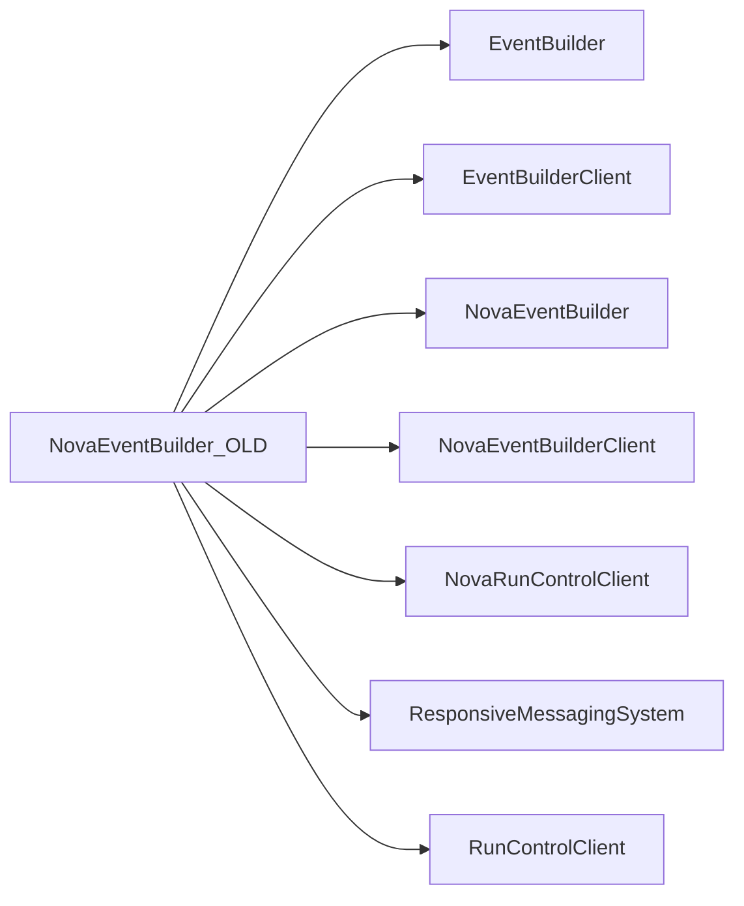

# NovaEventBuilder_OLD

Historical NOvA event builder and data-selector tests.

## Identity and scope

Repository: [NovaDAQ/NovaEventBuilder_OLD](https://github.com/NovaDAQ/NovaEventBuilder_OLD) · Reviewed commit: `2f8b3b17f4754841ddf6a8de2b2c8d527a36c607` · Domain: **Data path**.

Tracked files: **28**. Production deployment and owner are **unconfirmed**. The directory name marks a legacy variant; retirement has not been independently verified.

## Operation

Validate retained clients, message definitions, and file format as a complete historical set. Confirm active use before allocating operational remediation effort.

For prerequisites, safe start/stop sequencing, health checks, and rollback see the [operations guide](../operations/index.md).

## Build and integration

This package uses the SRT/SoftRelTools release context. A standalone `make` in a fresh checkout is not a supported build recipe unless the required context is already configured. See [build and release](../operations/build.md).

| Build definition |
| --- |
| [GNUmakefile](https://github.com/NovaDAQ/NovaEventBuilder_OLD/blob/2f8b3b17f4754841ddf6a8de2b2c8d527a36c607/GNUmakefile) |

## Entry points

These are source entry points or operational scripts found statically. Installation names and enabled targets depend on the build/configuration; listing a script does not establish that it is deployed.

| Source |
| --- |
| [cxx/src/novaeventbuilder.cc](https://github.com/NovaDAQ/NovaEventBuilder_OLD/blob/2f8b3b17f4754841ddf6a8de2b2c8d527a36c607/cxx/src/novaeventbuilder.cc) |

## Interfaces

Headers and declared types form the API navigation map. Follow the source for method signatures, ownership, units, and error contracts. Generated DDS/XSD types are built from the schemas in the next section.

| Header | Declared types |
| --- | --- |
| [cxx/inc/NovaEventBuilder/Acceptor.hpp](https://github.com/NovaDAQ/NovaEventBuilder_OLD/blob/2f8b3b17f4754841ddf6a8de2b2c8d527a36c607/cxx/inc/NovaEventBuilder/Acceptor.hpp) | `Acceptor` |
| [cxx/inc/NovaEventBuilder/DCMData.hpp](https://github.com/NovaDAQ/NovaEventBuilder_OLD/blob/2f8b3b17f4754841ddf6a8de2b2c8d527a36c607/cxx/inc/NovaEventBuilder/DCMData.hpp) | `HitBlock`, `JumboHeader`, `PointerFrame`, `SubFrame`, `SubFramePointer` |
| [cxx/inc/NovaEventBuilder/DataLogger.hpp](https://github.com/NovaDAQ/NovaEventBuilder_OLD/blob/2f8b3b17f4754841ddf6a8de2b2c8d527a36c607/cxx/inc/NovaEventBuilder/DataLogger.hpp) | `DataLogger` |
| [cxx/inc/NovaEventBuilder/DataLoggerHeader.hpp](https://github.com/NovaDAQ/NovaEventBuilder_OLD/blob/2f8b3b17f4754841ddf6a8de2b2c8d527a36c607/cxx/inc/NovaEventBuilder/DataLoggerHeader.hpp) | `DCMData`, `DCMPointer`, `DataLoggerEvent` |
| [cxx/inc/NovaEventBuilder/DataSelector.hpp](https://github.com/NovaDAQ/NovaEventBuilder_OLD/blob/2f8b3b17f4754841ddf6a8de2b2c8d527a36c607/cxx/inc/NovaEventBuilder/DataSelector.hpp) | `DataSelector`, `DataSelectorTest` |
| [cxx/inc/NovaEventBuilder/Defs.hpp](https://github.com/NovaDAQ/NovaEventBuilder_OLD/blob/2f8b3b17f4754841ddf6a8de2b2c8d527a36c607/cxx/inc/NovaEventBuilder/Defs.hpp) | `ReturnValue`, `TraceLevel` |
| [cxx/inc/NovaEventBuilder/Director.hpp](https://github.com/NovaDAQ/NovaEventBuilder_OLD/blob/2f8b3b17f4754841ddf6a8de2b2c8d527a36c607/cxx/inc/NovaEventBuilder/Director.hpp) | `AcceptorType`, `Director`, `DirectorTest`, `StateManagerType` |
| [cxx/inc/NovaEventBuilder/EventManager.hpp](https://github.com/NovaDAQ/NovaEventBuilder_OLD/blob/2f8b3b17f4754841ddf6a8de2b2c8d527a36c607/cxx/inc/NovaEventBuilder/EventManager.hpp) | `EventManager` |
| [cxx/inc/NovaEventBuilder/NovaConnection.hpp](https://github.com/NovaDAQ/NovaEventBuilder_OLD/blob/2f8b3b17f4754841ddf6a8de2b2c8d527a36c607/cxx/inc/NovaEventBuilder/NovaConnection.hpp) | `NovaConnection` |
| [cxx/inc/NovaEventBuilder/Processor.hpp](https://github.com/NovaDAQ/NovaEventBuilder_OLD/blob/2f8b3b17f4754841ddf6a8de2b2c8d527a36c607/cxx/inc/NovaEventBuilder/Processor.hpp) | `Processor` |
| [cxx/inc/NovaEventBuilder/Trace.hpp](https://github.com/NovaDAQ/NovaEventBuilder_OLD/blob/2f8b3b17f4754841ddf6a8de2b2c8d527a36c607/cxx/inc/NovaEventBuilder/Trace.hpp) | `timeval` |

## Configuration and data contracts

| Source artifact |
| --- |
| [config/jcsc.xml](https://github.com/NovaDAQ/NovaEventBuilder_OLD/blob/2f8b3b17f4754841ddf6a8de2b2c8d527a36c607/config/jcsc.xml) |

## Environment and external dependencies

Environment names below are literal lookups found in source, not a guarantee that every value is mandatory. No environment values or credentials are copied into this documentation.

No literal environment lookup was identified by this scan; shell setup scripts may still provide required values.

Unresolved/non-package include roots (some are system or generated headers; this is not a package-manager lockfile):

| Include root | Evidence |
| --- | --- |
| `arpa` | [cxx/inc/NovaEventBuilder/DCMData.hpp:11](https://github.com/NovaDAQ/NovaEventBuilder_OLD/blob/2f8b3b17f4754841ddf6a8de2b2c8d527a36c607/cxx/inc/NovaEventBuilder/DCMData.hpp#L11) |
| `cppunit` | [test/cxx/src/DataSelectorTest.cpp:5](https://github.com/NovaDAQ/NovaEventBuilder_OLD/blob/2f8b3b17f4754841ddf6a8de2b2c8d527a36c607/test/cxx/src/DataSelectorTest.cpp#L5) |
| `linux` | [cxx/inc/NovaEventBuilder/Trace.hpp:16](https://github.com/NovaDAQ/NovaEventBuilder_OLD/blob/2f8b3b17f4754841ddf6a8de2b2c8d527a36c607/cxx/inc/NovaEventBuilder/Trace.hpp#L16) |
| `netinet` | [test/cxx/src/DirectorTest.cpp:17](https://github.com/NovaDAQ/NovaEventBuilder_OLD/blob/2f8b3b17f4754841ddf6a8de2b2c8d527a36c607/test/cxx/src/DirectorTest.cpp#L17) |
| `sys` | [cxx/inc/NovaEventBuilder/Trace.hpp:18](https://github.com/NovaDAQ/NovaEventBuilder_OLD/blob/2f8b3b17f4754841ddf6a8de2b2c8d527a36c607/cxx/inc/NovaEventBuilder/Trace.hpp#L18) |

## Package dependencies

Arrow direction is **consumer → dependency**. This diagram includes source/build/runtime relationships and excludes test-only, release-membership, and build-tool edges. Conditional branches are not evaluated.

| Dependency | Relationship | Evidence |
| --- | --- | --- |
| [EventBuilder](EventBuilder.md) | build link | [GNUmakefile:156](https://github.com/NovaDAQ/NovaEventBuilder_OLD/blob/2f8b3b17f4754841ddf6a8de2b2c8d527a36c607/GNUmakefile#L156) |
| [EventBuilder](EventBuilder.md) | source include | [cxx/inc/NovaEventBuilder/Acceptor.hpp:14](https://github.com/NovaDAQ/NovaEventBuilder_OLD/blob/2f8b3b17f4754841ddf6a8de2b2c8d527a36c607/cxx/inc/NovaEventBuilder/Acceptor.hpp#L14) |
| [EventBuilder](EventBuilder.md) | test include | [test/cxx/src/DataSelectorTest.cpp:9](https://github.com/NovaDAQ/NovaEventBuilder_OLD/blob/2f8b3b17f4754841ddf6a8de2b2c8d527a36c607/test/cxx/src/DataSelectorTest.cpp#L9) |
| [EventBuilderClient](EventBuilderClient.md) | build link | [GNUmakefile:159](https://github.com/NovaDAQ/NovaEventBuilder_OLD/blob/2f8b3b17f4754841ddf6a8de2b2c8d527a36c607/GNUmakefile#L159) |
| [EventBuilderClient](EventBuilderClient.md) | source include | [cxx/inc/NovaEventBuilder/DataLogger.hpp:9](https://github.com/NovaDAQ/NovaEventBuilder_OLD/blob/2f8b3b17f4754841ddf6a8de2b2c8d527a36c607/cxx/inc/NovaEventBuilder/DataLogger.hpp#L9) |
| [NovaEventBuilder](NovaEventBuilder.md) | source include | [cxx/inc/NovaEventBuilder/Acceptor.hpp:9](https://github.com/NovaDAQ/NovaEventBuilder_OLD/blob/2f8b3b17f4754841ddf6a8de2b2c8d527a36c607/cxx/inc/NovaEventBuilder/Acceptor.hpp#L9) |
| [NovaEventBuilder](NovaEventBuilder.md) | test include | [test/cxx/src/DataSelectorTest.cpp:11](https://github.com/NovaDAQ/NovaEventBuilder_OLD/blob/2f8b3b17f4754841ddf6a8de2b2c8d527a36c607/test/cxx/src/DataSelectorTest.cpp#L11) |
| [NovaEventBuilderClient](NovaEventBuilderClient.md) | build link | [GNUmakefile:158](https://github.com/NovaDAQ/NovaEventBuilder_OLD/blob/2f8b3b17f4754841ddf6a8de2b2c8d527a36c607/GNUmakefile#L158) |
| [NovaEventBuilderClient](NovaEventBuilderClient.md) | source include | [cxx/inc/NovaEventBuilder/DataSelector.hpp:17](https://github.com/NovaDAQ/NovaEventBuilder_OLD/blob/2f8b3b17f4754841ddf6a8de2b2c8d527a36c607/cxx/inc/NovaEventBuilder/DataSelector.hpp#L17) |
| [NovaEventBuilderClient](NovaEventBuilderClient.md) | test include | [test/cxx/src/DataSelectorTest.cpp:12](https://github.com/NovaDAQ/NovaEventBuilder_OLD/blob/2f8b3b17f4754841ddf6a8de2b2c8d527a36c607/test/cxx/src/DataSelectorTest.cpp#L12) |
| [NovaRunControlClient](NovaRunControlClient.md) | build link | [GNUmakefile:154](https://github.com/NovaDAQ/NovaEventBuilder_OLD/blob/2f8b3b17f4754841ddf6a8de2b2c8d527a36c607/GNUmakefile#L154) |
| [NovaRunControlClient](NovaRunControlClient.md) | source include | [cxx/inc/NovaEventBuilder/Director.hpp:21](https://github.com/NovaDAQ/NovaEventBuilder_OLD/blob/2f8b3b17f4754841ddf6a8de2b2c8d527a36c607/cxx/inc/NovaEventBuilder/Director.hpp#L21) |
| [ResponsiveMessagingSystem](ResponsiveMessagingSystem.md) | build link | [GNUmakefile:148](https://github.com/NovaDAQ/NovaEventBuilder_OLD/blob/2f8b3b17f4754841ddf6a8de2b2c8d527a36c607/GNUmakefile#L148) |
| [ResponsiveMessagingSystem](ResponsiveMessagingSystem.md) | source include | [cxx/inc/NovaEventBuilder/DataLogger.hpp:17](https://github.com/NovaDAQ/NovaEventBuilder_OLD/blob/2f8b3b17f4754841ddf6a8de2b2c8d527a36c607/cxx/inc/NovaEventBuilder/DataLogger.hpp#L17) |
| [RunControlClient](RunControlClient.md) | build link | [GNUmakefile:155](https://github.com/NovaDAQ/NovaEventBuilder_OLD/blob/2f8b3b17f4754841ddf6a8de2b2c8d527a36c607/GNUmakefile#L155) |
| [RunControlClient](RunControlClient.md) | source include | [cxx/inc/NovaEventBuilder/DataLogger.hpp:16](https://github.com/NovaDAQ/NovaEventBuilder_OLD/blob/2f8b3b17f4754841ddf6a8de2b2c8d527a36c607/cxx/inc/NovaEventBuilder/DataLogger.hpp#L16) |

Direct consumers: None resolved in this snapshot.

Explore upstream/downstream impact in the [dependency explorer](../architecture/explorer.md).

## Validation and review

Static analysis attempted **9 C/C++ translation units**, **0 shell scripts**, and parsed **0 Python files**. Counts are tool input coverage, not proof of successful compilation or exhaustive review. Source/build/configuration inventories and the operating surface were also assessed.

No actionable defect was confirmed for this package in this review. This is a bounded review result, not a clean bill of health; unvalidated analyzer diagnostics were not filed as bugs.

Existing test/example sources (not executed against production):

| Source |
| --- |
| [test/cxx/src/DataSelectorTest.cpp](https://github.com/NovaDAQ/NovaEventBuilder_OLD/blob/2f8b3b17f4754841ddf6a8de2b2c8d527a36c607/test/cxx/src/DataSelectorTest.cpp) |
| [test/cxx/src/DirectorTest.cpp](https://github.com/NovaDAQ/NovaEventBuilder_OLD/blob/2f8b3b17f4754841ddf6a8de2b2c8d527a36c607/test/cxx/src/DirectorTest.cpp) |

## Existing documentation

| Source |
| --- |
| [README](https://github.com/NovaDAQ/NovaEventBuilder_OLD/blob/2f8b3b17f4754841ddf6a8de2b2c8d527a36c607/README) |
