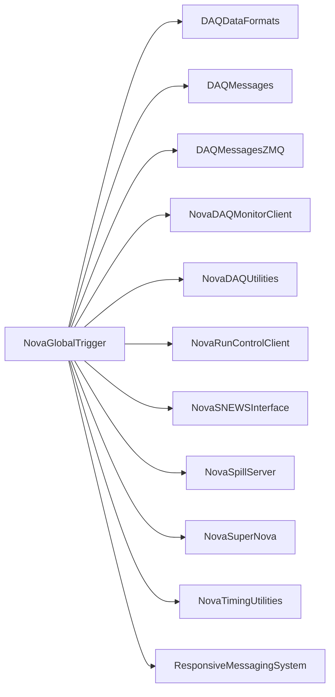

# NovaGlobalTrigger

Global trigger service implementing calibration, data-driven, beam, manual, long-window, and SNEWS trigger flows.

## Identity and scope

Repository: [NovaDAQ/NovaGlobalTrigger](https://github.com/NovaDAQ/NovaGlobalTrigger) · Reviewed commit: `60029922cf9f8adfded977ea1dc60e7a2925c216` · Domain: **Timing and triggers**.

Tracked files: **100**. Production deployment and owner are **unconfirmed**.

## Operation

Match trigger masks/prescales, detector, partition, timebase, and input mailbox endpoints. Confirm trigger counters at the producer and buffer nodes. Change enabled triggers through the controlled run lifecycle with recorded configuration.

For prerequisites, safe start/stop sequencing, health checks, and rollback see the [operations guide](../operations/index.md).

## Build and integration

This package uses the SRT/SoftRelTools release context. A standalone `make` in a fresh checkout is not a supported build recipe unless the required context is already configured. See [build and release](../operations/build.md).

CMake definitions are present. Most NOvA fragments use parent-provided cetbuildtools macros and dependency targets; consult the files below before treating this directory as a standalone CMake project.

| Build definition |
| --- |
| [CMakeLists.txt](https://github.com/NovaDAQ/NovaGlobalTrigger/blob/60029922cf9f8adfded977ea1dc60e7a2925c216/CMakeLists.txt) |
| [GNUmakefile](https://github.com/NovaDAQ/NovaGlobalTrigger/blob/60029922cf9f8adfded977ea1dc60e7a2925c216/GNUmakefile) |
| [cxx/CMakeLists.txt](https://github.com/NovaDAQ/NovaGlobalTrigger/blob/60029922cf9f8adfded977ea1dc60e7a2925c216/cxx/CMakeLists.txt) |
| [cxx/GNUmakefile](https://github.com/NovaDAQ/NovaGlobalTrigger/blob/60029922cf9f8adfded977ea1dc60e7a2925c216/cxx/GNUmakefile) |
| [cxx/src/CMakeLists.txt](https://github.com/NovaDAQ/NovaGlobalTrigger/blob/60029922cf9f8adfded977ea1dc60e7a2925c216/cxx/src/CMakeLists.txt) |
| [cxx/src/GNUmakefile](https://github.com/NovaDAQ/NovaGlobalTrigger/blob/60029922cf9f8adfded977ea1dc60e7a2925c216/cxx/src/GNUmakefile) |
| [cxx/src/plugins/GNUmakefile](https://github.com/NovaDAQ/NovaGlobalTrigger/blob/60029922cf9f8adfded977ea1dc60e7a2925c216/cxx/src/plugins/GNUmakefile) |
| [cxx/src/plugins/GTCalTrig/GNUmakefile](https://github.com/NovaDAQ/NovaGlobalTrigger/blob/60029922cf9f8adfded977ea1dc60e7a2925c216/cxx/src/plugins/GTCalTrig/GNUmakefile) |
| [cxx/src/plugins/GTSNEWSTrig/GNUmakefile](https://github.com/NovaDAQ/NovaGlobalTrigger/blob/60029922cf9f8adfded977ea1dc60e7a2925c216/cxx/src/plugins/GTSNEWSTrig/GNUmakefile) |
| [cxx/test/GNUmakefile](https://github.com/NovaDAQ/NovaGlobalTrigger/blob/60029922cf9f8adfded977ea1dc60e7a2925c216/cxx/test/GNUmakefile) |
| [cxx/unittest/GNUmakefile](https://github.com/NovaDAQ/NovaGlobalTrigger/blob/60029922cf9f8adfded977ea1dc60e7a2925c216/cxx/unittest/GNUmakefile) |
| [java/GNUmakefile](https://github.com/NovaDAQ/NovaGlobalTrigger/blob/60029922cf9f8adfded977ea1dc60e7a2925c216/java/GNUmakefile) |
| [java/src/GNUmakefile](https://github.com/NovaDAQ/NovaGlobalTrigger/blob/60029922cf9f8adfded977ea1dc60e7a2925c216/java/src/GNUmakefile) |
| [java/test/GNUmakefile](https://github.com/NovaDAQ/NovaGlobalTrigger/blob/60029922cf9f8adfded977ea1dc60e7a2925c216/java/test/GNUmakefile) |
| [java/unittest/GNUmakefile](https://github.com/NovaDAQ/NovaGlobalTrigger/blob/60029922cf9f8adfded977ea1dc60e7a2925c216/java/unittest/GNUmakefile) |

## Entry points

These are source entry points or operational scripts found statically. Installation names and enabled targets depend on the build/configuration; listing a script does not establish that it is deployed.

| Source |
| --- |
| [config/convert-config.pl](https://github.com/NovaDAQ/NovaGlobalTrigger/blob/60029922cf9f8adfded977ea1dc60e7a2925c216/config/convert-config.pl) |
| [cxx/src/NGTMaster.cc](https://github.com/NovaDAQ/NovaGlobalTrigger/blob/60029922cf9f8adfded977ea1dc60e7a2925c216/cxx/src/NGTMaster.cc) |
| [cxx/src/NovaGlobalTrigger.cc](https://github.com/NovaDAQ/NovaGlobalTrigger/blob/60029922cf9f8adfded977ea1dc60e7a2925c216/cxx/src/NovaGlobalTrigger.cc) |

## Interfaces

Headers and declared types form the API navigation map. Follow the source for method signatures, ownership, units, and error contracts. Generated DDS/XSD types are built from the schemas in the next section.

| Header | Declared types |
| --- | --- |
| [cxx/include/GT.h](https://github.com/NovaDAQ/NovaGlobalTrigger/blob/60029922cf9f8adfded977ea1dc60e7a2925c216/cxx/include/GT.h) | Functions, constants, or templates |
| [cxx/include/GTCalTrig.h](https://github.com/NovaDAQ/NovaGlobalTrigger/blob/60029922cf9f8adfded977ea1dc60e7a2925c216/cxx/include/GTCalTrig.h) | `GTCalTrig` |
| [cxx/include/GTDaqStatusTrig.h](https://github.com/NovaDAQ/NovaGlobalTrigger/blob/60029922cf9f8adfded977ea1dc60e7a2925c216/cxx/include/GTDaqStatusTrig.h) | `GTDaqStatusTrig` |
| [cxx/include/GTDataTrig.h](https://github.com/NovaDAQ/NovaGlobalTrigger/blob/60029922cf9f8adfded977ea1dc60e7a2925c216/cxx/include/GTDataTrig.h) | `GTDataTrig` |
| [cxx/include/GTGlobals.h](https://github.com/NovaDAQ/NovaGlobalTrigger/blob/60029922cf9f8adfded977ea1dc60e7a2925c216/cxx/include/GTGlobals.h) | Functions, constants, or templates |
| [cxx/include/GTInfo.h](https://github.com/NovaDAQ/NovaGlobalTrigger/blob/60029922cf9f8adfded977ea1dc60e7a2925c216/cxx/include/GTInfo.h) | `GTInfo` |
| [cxx/include/GTInit.h](https://github.com/NovaDAQ/NovaGlobalTrigger/blob/60029922cf9f8adfded977ea1dc60e7a2925c216/cxx/include/GTInit.h) | Functions, constants, or templates |
| [cxx/include/GTIssueTrig.h](https://github.com/NovaDAQ/NovaGlobalTrigger/blob/60029922cf9f8adfded977ea1dc60e7a2925c216/cxx/include/GTIssueTrig.h) | Functions, constants, or templates |
| [cxx/include/GTLongTrigs.h](https://github.com/NovaDAQ/NovaGlobalTrigger/blob/60029922cf9f8adfded977ea1dc60e7a2925c216/cxx/include/GTLongTrigs.h) | `GTLongTrigs` |
| [cxx/include/GTManualTrig.h](https://github.com/NovaDAQ/NovaGlobalTrigger/blob/60029922cf9f8adfded977ea1dc60e7a2925c216/cxx/include/GTManualTrig.h) | `GTManualTrig` |
| [cxx/include/GTNOverlap.h](https://github.com/NovaDAQ/NovaGlobalTrigger/blob/60029922cf9f8adfded977ea1dc60e7a2925c216/cxx/include/GTNOverlap.h) | `GTNOverlap` |
| [cxx/include/GTSNEWSTrig.h](https://github.com/NovaDAQ/NovaGlobalTrigger/blob/60029922cf9f8adfded977ea1dc60e7a2925c216/cxx/include/GTSNEWSTrig.h) | `GTSNEWSTrig` |
| [cxx/include/GTSendSNXTrig.h](https://github.com/NovaDAQ/NovaGlobalTrigger/blob/60029922cf9f8adfded977ea1dc60e7a2925c216/cxx/include/GTSendSNXTrig.h) | Functions, constants, or templates |
| [cxx/include/GTSendTrigAgent.h](https://github.com/NovaDAQ/NovaGlobalTrigger/blob/60029922cf9f8adfded977ea1dc60e7a2925c216/cxx/include/GTSendTrigAgent.h) | Functions, constants, or templates |
| [cxx/include/GTSimTrig.h](https://github.com/NovaDAQ/NovaGlobalTrigger/blob/60029922cf9f8adfded977ea1dc60e7a2925c216/cxx/include/GTSimTrig.h) | Functions, constants, or templates |
| [cxx/include/GTSpillTrig.h](https://github.com/NovaDAQ/NovaGlobalTrigger/blob/60029922cf9f8adfded977ea1dc60e7a2925c216/cxx/include/GTSpillTrig.h) | `GTSpillTrig` |
| [cxx/include/GTStreamerTrig.h](https://github.com/NovaDAQ/NovaGlobalTrigger/blob/60029922cf9f8adfded977ea1dc60e7a2925c216/cxx/include/GTStreamerTrig.h) | `GTStreamerTrig` |
| [cxx/include/GTSuperNovaTrigger.h](https://github.com/NovaDAQ/NovaGlobalTrigger/blob/60029922cf9f8adfded977ea1dc60e7a2925c216/cxx/include/GTSuperNovaTrigger.h) | `GTSuperNovaTrigger` |
| [cxx/include/GTTrigTime.h](https://github.com/NovaDAQ/NovaGlobalTrigger/blob/60029922cf9f8adfded977ea1dc60e7a2925c216/cxx/include/GTTrigTime.h) | `GTTrigTime` |
| [cxx/include/GT_InhibitQueue.h](https://github.com/NovaDAQ/NovaGlobalTrigger/blob/60029922cf9f8adfded977ea1dc60e7a2925c216/cxx/include/GT_InhibitQueue.h) | `inhibitCheckType`, `inhibitQueue` |
| [cxx/include/GT_Inst.h](https://github.com/NovaDAQ/NovaGlobalTrigger/blob/60029922cf9f8adfded977ea1dc60e7a2925c216/cxx/include/GT_Inst.h) | `GT_Inst` |
| [cxx/include/GT_MessageQueue.h](https://github.com/NovaDAQ/NovaGlobalTrigger/blob/60029922cf9f8adfded977ea1dc60e7a2925c216/cxx/include/GT_MessageQueue.h) | `messageQueue` |
| [cxx/include/GT_SendQueues.h](https://github.com/NovaDAQ/NovaGlobalTrigger/blob/60029922cf9f8adfded977ea1dc60e7a2925c216/cxx/include/GT_SendQueues.h) | `GT_SendQueues`, `QueueExceptions` |
| [cxx/include/GT_Stats.h](https://github.com/NovaDAQ/NovaGlobalTrigger/blob/60029922cf9f8adfded977ea1dc60e7a2925c216/cxx/include/GT_Stats.h) | `GT_Stats` |
| [cxx/include/GT_Throttle.h](https://github.com/NovaDAQ/NovaGlobalTrigger/blob/60029922cf9f8adfded977ea1dc60e7a2925c216/cxx/include/GT_Throttle.h) | `throttlePipeline` |
| [cxx/include/NGTMCStateMachine.h](https://github.com/NovaDAQ/NovaGlobalTrigger/blob/60029922cf9f8adfded977ea1dc60e7a2925c216/cxx/include/NGTMCStateMachine.h) | `NGTMCStateMachine` |
| [cxx/include/NGTMasterRC.h](https://github.com/NovaDAQ/NovaGlobalTrigger/blob/60029922cf9f8adfded977ea1dc60e7a2925c216/cxx/include/NGTMasterRC.h) | `NGTMasterRC` |
| [cxx/include/NGTRC.h](https://github.com/NovaDAQ/NovaGlobalTrigger/blob/60029922cf9f8adfded977ea1dc60e7a2925c216/cxx/include/NGTRC.h) | `NGTRC` |
| [cxx/include/NGTStateMachine.h](https://github.com/NovaDAQ/NovaGlobalTrigger/blob/60029922cf9f8adfded977ea1dc60e7a2925c216/cxx/include/NGTStateMachine.h) | `NGTStateMachine` |
| [cxx/include/SNGangliaLogger.h](https://github.com/NovaDAQ/NovaGlobalTrigger/blob/60029922cf9f8adfded977ea1dc60e7a2925c216/cxx/include/SNGangliaLogger.h) | `SNGangliaLogger` |
| [cxx/include/TriggerGenerator.h](https://github.com/NovaDAQ/NovaGlobalTrigger/blob/60029922cf9f8adfded977ea1dc60e7a2925c216/cxx/include/TriggerGenerator.h) | `TriggerGenerator` |

## Configuration and data contracts

| Source artifact |
| --- |
| [config/GTConfig-TB.xml](https://github.com/NovaDAQ/NovaGlobalTrigger/blob/60029922cf9f8adfded977ea1dc60e7a2925c216/config/GTConfig-TB.xml) |
| [config/GTConfig.xml](https://github.com/NovaDAQ/NovaGlobalTrigger/blob/60029922cf9f8adfded977ea1dc60e7a2925c216/config/GTConfig.xml) |
| [config/GTConfig.xsd](https://github.com/NovaDAQ/NovaGlobalTrigger/blob/60029922cf9f8adfded977ea1dc60e7a2925c216/config/GTConfig.xsd) |
| [config/GlobalTriggerMsgFac.fcl](https://github.com/NovaDAQ/NovaGlobalTrigger/blob/60029922cf9f8adfded977ea1dc60e7a2925c216/config/GlobalTriggerMsgFac.fcl) |
| [config/SNConfig.xml](https://github.com/NovaDAQ/NovaGlobalTrigger/blob/60029922cf9f8adfded977ea1dc60e7a2925c216/config/SNConfig.xml) |
| [config/SimGTConfig.xml](https://github.com/NovaDAQ/NovaGlobalTrigger/blob/60029922cf9f8adfded977ea1dc60e7a2925c216/config/SimGTConfig.xml) |

## Environment and external dependencies

Environment names below are literal lookups found in source, not a guarantee that every value is mandatory. No environment values or credentials are copied into this documentation.

No literal environment lookup was identified by this scan; shell setup scripts may still provide required values.

Unresolved/non-package include roots (some are system or generated headers; this is not a package-manager lockfile):

| Include root | Evidence |
| --- | --- |
| `boost` | [cxx/include/GTGlobals.h:4](https://github.com/NovaDAQ/NovaGlobalTrigger/blob/60029922cf9f8adfded977ea1dc60e7a2925c216/cxx/include/GTGlobals.h#L4) |
| `messagefacility` | [cxx/include/NGTMasterRC.h:7](https://github.com/NovaDAQ/NovaGlobalTrigger/blob/60029922cf9f8adfded977ea1dc60e7a2925c216/cxx/include/NGTMasterRC.h#L7) |
| `sys` | [cxx/include/GTInfo.h:4](https://github.com/NovaDAQ/NovaGlobalTrigger/blob/60029922cf9f8adfded977ea1dc60e7a2925c216/cxx/include/GTInfo.h#L4) |

## Package dependencies

Arrow direction is **consumer → dependency**. This diagram includes source/build/runtime relationships and excludes test-only, release-membership, and build-tool edges. Conditional branches are not evaluated.

| Dependency | Relationship | Evidence |
| --- | --- | --- |
| [DAQDataFormats](DAQDataFormats.md) | build link | [cxx/src/CMakeLists.txt:36](https://github.com/NovaDAQ/NovaGlobalTrigger/blob/60029922cf9f8adfded977ea1dc60e7a2925c216/cxx/src/CMakeLists.txt#L36) |
| [DAQDataFormats](DAQDataFormats.md) | source include | [cxx/include/GTDataTrig.h:6](https://github.com/NovaDAQ/NovaGlobalTrigger/blob/60029922cf9f8adfded977ea1dc60e7a2925c216/cxx/include/GTDataTrig.h#L6) |
| [DAQDataFormats](DAQDataFormats.md) | test include | [cxx/test/DDTSender.cc:14](https://github.com/NovaDAQ/NovaGlobalTrigger/blob/60029922cf9f8adfded977ea1dc60e7a2925c216/cxx/test/DDTSender.cc#L14) |
| [DAQDataFormats](DAQDataFormats.md) | test link | [cxx/test/GNUmakefile:25](https://github.com/NovaDAQ/NovaGlobalTrigger/blob/60029922cf9f8adfded977ea1dc60e7a2925c216/cxx/test/GNUmakefile#L25) |
| [DAQMessages](DAQMessages.md) | build link | [cxx/src/CMakeLists.txt:34](https://github.com/NovaDAQ/NovaGlobalTrigger/blob/60029922cf9f8adfded977ea1dc60e7a2925c216/cxx/src/CMakeLists.txt#L34) |
| [DAQMessages](DAQMessages.md) | source include | [cxx/include/GTSuperNovaTrigger.h:7](https://github.com/NovaDAQ/NovaGlobalTrigger/blob/60029922cf9f8adfded977ea1dc60e7a2925c216/cxx/include/GTSuperNovaTrigger.h#L7) |
| [DAQMessages](DAQMessages.md) | test include | [cxx/test/DDTSender.cc:19](https://github.com/NovaDAQ/NovaGlobalTrigger/blob/60029922cf9f8adfded977ea1dc60e7a2925c216/cxx/test/DDTSender.cc#L19) |
| [DAQMessages](DAQMessages.md) | test link | [cxx/test/GNUmakefile:25](https://github.com/NovaDAQ/NovaGlobalTrigger/blob/60029922cf9f8adfded977ea1dc60e7a2925c216/cxx/test/GNUmakefile#L25) |
| [DAQMessagesZMQ](DAQMessagesZMQ.md) | source include | [cxx/src/GTDataTrig.cpp:34](https://github.com/NovaDAQ/NovaGlobalTrigger/blob/60029922cf9f8adfded977ea1dc60e7a2925c216/cxx/src/GTDataTrig.cpp#L34) |
| [NovaDAQMonitorClient](NovaDAQMonitorClient.md) | source include | [cxx/include/GT_Stats.h:8](https://github.com/NovaDAQ/NovaGlobalTrigger/blob/60029922cf9f8adfded977ea1dc60e7a2925c216/cxx/include/GT_Stats.h#L8) |
| [NovaDAQUtilities](NovaDAQUtilities.md) | source include | [cxx/include/NGTMasterRC.h:4](https://github.com/NovaDAQ/NovaGlobalTrigger/blob/60029922cf9f8adfded977ea1dc60e7a2925c216/cxx/include/NGTMasterRC.h#L4) |
| [NovaDAQUtilities](NovaDAQUtilities.md) | test include | [cxx/test/GTSender.cc:25](https://github.com/NovaDAQ/NovaGlobalTrigger/blob/60029922cf9f8adfded977ea1dc60e7a2925c216/cxx/test/GTSender.cc#L25) |
| [NovaRunControlClient](NovaRunControlClient.md) | build link | [cxx/src/CMakeLists.txt:44](https://github.com/NovaDAQ/NovaGlobalTrigger/blob/60029922cf9f8adfded977ea1dc60e7a2925c216/cxx/src/CMakeLists.txt#L44) |
| [NovaRunControlClient](NovaRunControlClient.md) | source include | [cxx/include/NGTMasterRC.h:5](https://github.com/NovaDAQ/NovaGlobalTrigger/blob/60029922cf9f8adfded977ea1dc60e7a2925c216/cxx/include/NGTMasterRC.h#L5) |
| [NovaSNEWSInterface](NovaSNEWSInterface.md) | build link | [cxx/src/CMakeLists.txt:40](https://github.com/NovaDAQ/NovaGlobalTrigger/blob/60029922cf9f8adfded977ea1dc60e7a2925c216/cxx/src/CMakeLists.txt#L40) |
| [NovaSNEWSInterface](NovaSNEWSInterface.md) | source include | [cxx/src/GTSNEWSTrig.cpp:24](https://github.com/NovaDAQ/NovaGlobalTrigger/blob/60029922cf9f8adfded977ea1dc60e7a2925c216/cxx/src/GTSNEWSTrig.cpp#L24) |
| [NovaSpillServer](NovaSpillServer.md) | build link | [cxx/src/CMakeLists.txt:37](https://github.com/NovaDAQ/NovaGlobalTrigger/blob/60029922cf9f8adfded977ea1dc60e7a2925c216/cxx/src/CMakeLists.txt#L37) |
| [NovaSpillServer](NovaSpillServer.md) | source include | [cxx/src/GTSpillTrig.cpp:27](https://github.com/NovaDAQ/NovaGlobalTrigger/blob/60029922cf9f8adfded977ea1dc60e7a2925c216/cxx/src/GTSpillTrig.cpp#L27) |
| [NovaSuperNova](NovaSuperNova.md) | build link | [cxx/src/CMakeLists.txt:43](https://github.com/NovaDAQ/NovaGlobalTrigger/blob/60029922cf9f8adfded977ea1dc60e7a2925c216/cxx/src/CMakeLists.txt#L43) |
| [NovaSuperNova](NovaSuperNova.md) | source include | [cxx/include/GTSuperNovaTrigger.h:5](https://github.com/NovaDAQ/NovaGlobalTrigger/blob/60029922cf9f8adfded977ea1dc60e7a2925c216/cxx/include/GTSuperNovaTrigger.h#L5) |
| [NovaTimingUtilities](NovaTimingUtilities.md) | build link | [cxx/src/CMakeLists.txt:41](https://github.com/NovaDAQ/NovaGlobalTrigger/blob/60029922cf9f8adfded977ea1dc60e7a2925c216/cxx/src/CMakeLists.txt#L41) |
| [NovaTimingUtilities](NovaTimingUtilities.md) | source include | [cxx/include/GTTrigTime.h:9](https://github.com/NovaDAQ/NovaGlobalTrigger/blob/60029922cf9f8adfded977ea1dc60e7a2925c216/cxx/include/GTTrigTime.h#L9) |
| [NovaTimingUtilities](NovaTimingUtilities.md) | test include | [cxx/test/DDTSender.cc:16](https://github.com/NovaDAQ/NovaGlobalTrigger/blob/60029922cf9f8adfded977ea1dc60e7a2925c216/cxx/test/DDTSender.cc#L16) |
| [NovaTimingUtilities](NovaTimingUtilities.md) | test link | [cxx/test/GNUmakefile:25](https://github.com/NovaDAQ/NovaGlobalTrigger/blob/60029922cf9f8adfded977ea1dc60e7a2925c216/cxx/test/GNUmakefile#L25) |
| [ResponsiveMessagingSystem](ResponsiveMessagingSystem.md) | build link | [cxx/src/CMakeLists.txt:47](https://github.com/NovaDAQ/NovaGlobalTrigger/blob/60029922cf9f8adfded977ea1dc60e7a2925c216/cxx/src/CMakeLists.txt#L47) |
| [ResponsiveMessagingSystem](ResponsiveMessagingSystem.md) | source include | [cxx/src/GTDataTrig.cpp:44](https://github.com/NovaDAQ/NovaGlobalTrigger/blob/60029922cf9f8adfded977ea1dc60e7a2925c216/cxx/src/GTDataTrig.cpp#L44) |
| [ResponsiveMessagingSystem](ResponsiveMessagingSystem.md) | test include | [cxx/test/DDTSender.cc:7](https://github.com/NovaDAQ/NovaGlobalTrigger/blob/60029922cf9f8adfded977ea1dc60e7a2925c216/cxx/test/DDTSender.cc#L7) |
| [SRT_ONLINE](SRT_ONLINE.md) | build tool | [GNUmakefile:11](https://github.com/NovaDAQ/NovaGlobalTrigger/blob/60029922cf9f8adfded977ea1dc60e7a2925c216/GNUmakefile#L11) |

Direct consumers: [NovaDAQConfiguration](NovaDAQConfiguration.md), [NovaDataLogger](NovaDataLogger.md), [NovaRunControl](NovaRunControl.md).

Explore upstream/downstream impact in the [dependency explorer](../architecture/explorer.md).

## Validation and review

Static analysis attempted **36 C/C++ translation units**, **6 shell scripts**, and parsed **0 Python files**. Counts are tool input coverage, not proof of successful compilation or exhaustive review. Source/build/configuration inventories and the operating surface were also assessed.

No actionable defect was confirmed for this package in this review. This is a bounded review result, not a clean bill of health; unvalidated analyzer diagnostics were not filed as bugs.

Existing test/example sources (not executed against production):

| Source |
| --- |
| [cxx/test/DDTSender.cc](https://github.com/NovaDAQ/NovaGlobalTrigger/blob/60029922cf9f8adfded977ea1dc60e7a2925c216/cxx/test/DDTSender.cc) |
| [cxx/test/GTDDtest.sh](https://github.com/NovaDAQ/NovaGlobalTrigger/blob/60029922cf9f8adfded977ea1dc60e7a2925c216/cxx/test/GTDDtest.sh) |
| [cxx/test/GTMantest.sh](https://github.com/NovaDAQ/NovaGlobalTrigger/blob/60029922cf9f8adfded977ea1dc60e7a2925c216/cxx/test/GTMantest.sh) |
| [cxx/test/GTReceiver.cc](https://github.com/NovaDAQ/NovaGlobalTrigger/blob/60029922cf9f8adfded977ea1dc60e7a2925c216/cxx/test/GTReceiver.cc) |
| [cxx/test/GTSNEWStest.sh](https://github.com/NovaDAQ/NovaGlobalTrigger/blob/60029922cf9f8adfded977ea1dc60e7a2925c216/cxx/test/GTSNEWStest.sh) |
| [cxx/test/GTSender.cc](https://github.com/NovaDAQ/NovaGlobalTrigger/blob/60029922cf9f8adfded977ea1dc60e7a2925c216/cxx/test/GTSender.cc) |
| [cxx/test/GTSimSender.cc](https://github.com/NovaDAQ/NovaGlobalTrigger/blob/60029922cf9f8adfded977ea1dc60e7a2925c216/cxx/test/GTSimSender.cc) |
| [cxx/test/GTSpilltest.sh](https://github.com/NovaDAQ/NovaGlobalTrigger/blob/60029922cf9f8adfded977ea1dc60e7a2925c216/cxx/test/GTSpilltest.sh) |
| [cxx/test/GTstatetest.sh](https://github.com/NovaDAQ/NovaGlobalTrigger/blob/60029922cf9f8adfded977ea1dc60e7a2925c216/cxx/test/GTstatetest.sh) |
| [cxx/test/GTtest.sh](https://github.com/NovaDAQ/NovaGlobalTrigger/blob/60029922cf9f8adfded977ea1dc60e7a2925c216/cxx/test/GTtest.sh) |
| [cxx/test/ManSender.cc](https://github.com/NovaDAQ/NovaGlobalTrigger/blob/60029922cf9f8adfded977ea1dc60e7a2925c216/cxx/test/ManSender.cc) |

## Existing documentation

No package README/manual identified in the scoped inventory. Use this page and the source interfaces above.
