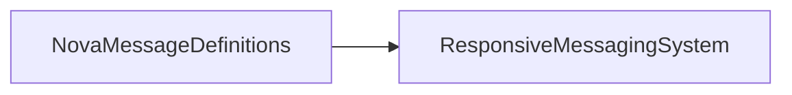

# NovaMessageDefinitions

Earlier RMS/XML message classes and message-registration constants.

## Identity and scope

Repository: [NovaDAQ/NovaMessageDefinitions](https://github.com/NovaDAQ/NovaMessageDefinitions) · Reviewed commit: `c49f4d03724fac4c4b7279b5284bbd6ed519ba49` · Domain: **Messaging**.

Tracked files: **23**. Production deployment and owner are **unconfirmed**.

## Operation

Keep factory registration and serialization names consistent across peers. Compare against DAQMessages before changing an old client; the two packages represent different contract layers.

For prerequisites, safe start/stop sequencing, health checks, and rollback see the [operations guide](../operations/index.md).

## Build and integration

This package uses the SRT/SoftRelTools release context. A standalone `make` in a fresh checkout is not a supported build recipe unless the required context is already configured. See [build and release](../operations/build.md).

| Build definition |
| --- |
| [GNUmakefile](https://github.com/NovaDAQ/NovaMessageDefinitions/blob/c49f4d03724fac4c4b7279b5284bbd6ed519ba49/GNUmakefile) |
| [cxx/GNUmakefile](https://github.com/NovaDAQ/NovaMessageDefinitions/blob/c49f4d03724fac4c4b7279b5284bbd6ed519ba49/cxx/GNUmakefile) |
| [cxx/src/GNUmakefile](https://github.com/NovaDAQ/NovaMessageDefinitions/blob/c49f4d03724fac4c4b7279b5284bbd6ed519ba49/cxx/src/GNUmakefile) |
| [cxx/test/GNUmakefile](https://github.com/NovaDAQ/NovaMessageDefinitions/blob/c49f4d03724fac4c4b7279b5284bbd6ed519ba49/cxx/test/GNUmakefile) |
| [cxx/unittest/GNUmakefile](https://github.com/NovaDAQ/NovaMessageDefinitions/blob/c49f4d03724fac4c4b7279b5284bbd6ed519ba49/cxx/unittest/GNUmakefile) |
| [java/GNUmakefile](https://github.com/NovaDAQ/NovaMessageDefinitions/blob/c49f4d03724fac4c4b7279b5284bbd6ed519ba49/java/GNUmakefile) |
| [java/src/GNUmakefile](https://github.com/NovaDAQ/NovaMessageDefinitions/blob/c49f4d03724fac4c4b7279b5284bbd6ed519ba49/java/src/GNUmakefile) |
| [java/test/GNUmakefile](https://github.com/NovaDAQ/NovaMessageDefinitions/blob/c49f4d03724fac4c4b7279b5284bbd6ed519ba49/java/test/GNUmakefile) |
| [java/unittest/GNUmakefile](https://github.com/NovaDAQ/NovaMessageDefinitions/blob/c49f4d03724fac4c4b7279b5284bbd6ed519ba49/java/unittest/GNUmakefile) |

## Entry points

These are source entry points or operational scripts found statically. Installation names and enabled targets depend on the build/configuration; listing a script does not establish that it is deployed.

No standalone executable entry point was identified; this package may provide libraries, contracts, configuration, or binary artifacts.

## Interfaces

Headers and declared types form the API navigation map. Follow the source for method signatures, ownership, units, and error contracts. Generated DDS/XSD types are built from the schemas in the next section.

| Header | Declared types |
| --- | --- |
| [cxx/include/NovaMsgConstants.h](https://github.com/NovaDAQ/NovaMessageDefinitions/blob/c49f4d03724fac4c4b7279b5284bbd6ed519ba49/cxx/include/NovaMsgConstants.h) | `NovaMsgConstants` |

## Configuration and data contracts

| Source artifact |
| --- |
| [config/CommonTypes.xsd](https://github.com/NovaDAQ/NovaMessageDefinitions/blob/c49f4d03724fac4c4b7279b5284bbd6ed519ba49/config/CommonTypes.xsd) |
| [config/ConfigurationMessages.xsd](https://github.com/NovaDAQ/NovaMessageDefinitions/blob/c49f4d03724fac4c4b7279b5284bbd6ed519ba49/config/ConfigurationMessages.xsd) |
| [config/ControlMessages.xsd](https://github.com/NovaDAQ/NovaMessageDefinitions/blob/c49f4d03724fac4c4b7279b5284bbd6ed519ba49/config/ControlMessages.xsd) |
| [config/MerlinMessages.xsd](https://github.com/NovaDAQ/NovaMessageDefinitions/blob/c49f4d03724fac4c4b7279b5284bbd6ed519ba49/config/MerlinMessages.xsd) |
| [config/RCMessages.xsd](https://github.com/NovaDAQ/NovaMessageDefinitions/blob/c49f4d03724fac4c4b7279b5284bbd6ed519ba49/config/RCMessages.xsd) |
| [config/StatusMessages.xsd](https://github.com/NovaDAQ/NovaMessageDefinitions/blob/c49f4d03724fac4c4b7279b5284bbd6ed519ba49/config/StatusMessages.xsd) |

## Environment and external dependencies

Environment names below are literal lookups found in source, not a guarantee that every value is mandatory. No environment values or credentials are copied into this documentation.

| Variable | Evidence |
| --- | --- |
| `HOSTNAME` | [cxx/test/NovaMsgTest.cc:61](https://github.com/NovaDAQ/NovaMessageDefinitions/blob/c49f4d03724fac4c4b7279b5284bbd6ed519ba49/cxx/test/NovaMsgTest.cc#L61) |

Unresolved/non-package include roots (some are system or generated headers; this is not a package-manager lockfile):

| Include root | Evidence |
| --- | --- |
| `novaMsg` | [cxx/test/NovaMsgTest.cc:1](https://github.com/NovaDAQ/NovaMessageDefinitions/blob/c49f4d03724fac4c4b7279b5284bbd6ed519ba49/cxx/test/NovaMsgTest.cc#L1) |

## Package dependencies

Arrow direction is **consumer → dependency**. This diagram includes source/build/runtime relationships and excludes test-only, release-membership, and build-tool edges. Conditional branches are not evaluated.

| Dependency | Relationship | Evidence |
| --- | --- | --- |
| [NovaDAQUtilities](NovaDAQUtilities.md) | test include | [cxx/test/NovaMsgTest.cc:5](https://github.com/NovaDAQ/NovaMessageDefinitions/blob/c49f4d03724fac4c4b7279b5284bbd6ed519ba49/cxx/test/NovaMsgTest.cc#L5) |
| [NovaDAQUtilities](NovaDAQUtilities.md) | test link | [cxx/test/GNUmakefile:11](https://github.com/NovaDAQ/NovaMessageDefinitions/blob/c49f4d03724fac4c4b7279b5284bbd6ed519ba49/cxx/test/GNUmakefile#L11) |
| [ResponsiveMessagingSystem](ResponsiveMessagingSystem.md) | build link | [cxx/src/GNUmakefile:40](https://github.com/NovaDAQ/NovaMessageDefinitions/blob/c49f4d03724fac4c4b7279b5284bbd6ed519ba49/cxx/src/GNUmakefile#L40) |
| [ResponsiveMessagingSystem](ResponsiveMessagingSystem.md) | test include | [cxx/test/NovaMsgTest.cc:4](https://github.com/NovaDAQ/NovaMessageDefinitions/blob/c49f4d03724fac4c4b7279b5284bbd6ed519ba49/cxx/test/NovaMsgTest.cc#L4) |
| [ResponsiveMessagingSystem](ResponsiveMessagingSystem.md) | test link | [cxx/test/GNUmakefile:11](https://github.com/NovaDAQ/NovaMessageDefinitions/blob/c49f4d03724fac4c4b7279b5284bbd6ed519ba49/cxx/test/GNUmakefile#L11) |
| [SRT_ONLINE](SRT_ONLINE.md) | build tool | [GNUmakefile:10](https://github.com/NovaDAQ/NovaMessageDefinitions/blob/c49f4d03724fac4c4b7279b5284bbd6ed519ba49/GNUmakefile#L10) |

Direct consumers: None resolved in this snapshot.

Explore upstream/downstream impact in the [dependency explorer](../architecture/explorer.md).

## Validation and review

Static analysis attempted **1 C/C++ translation units**, **0 shell scripts**, and parsed **0 Python files**. Counts are tool input coverage, not proof of successful compilation or exhaustive review. Source/build/configuration inventories and the operating surface were also assessed.

No actionable defect was confirmed for this package in this review. This is a bounded review result, not a clean bill of health; unvalidated analyzer diagnostics were not filed as bugs.

Existing test/example sources (not executed against production):

| Source |
| --- |
| [cxx/test/NovaMsgTest.cc](https://github.com/NovaDAQ/NovaMessageDefinitions/blob/c49f4d03724fac4c4b7279b5284bbd6ed519ba49/cxx/test/NovaMsgTest.cc) |

## Existing documentation

No package README/manual identified in the scoped inventory. Use this page and the source interfaces above.
