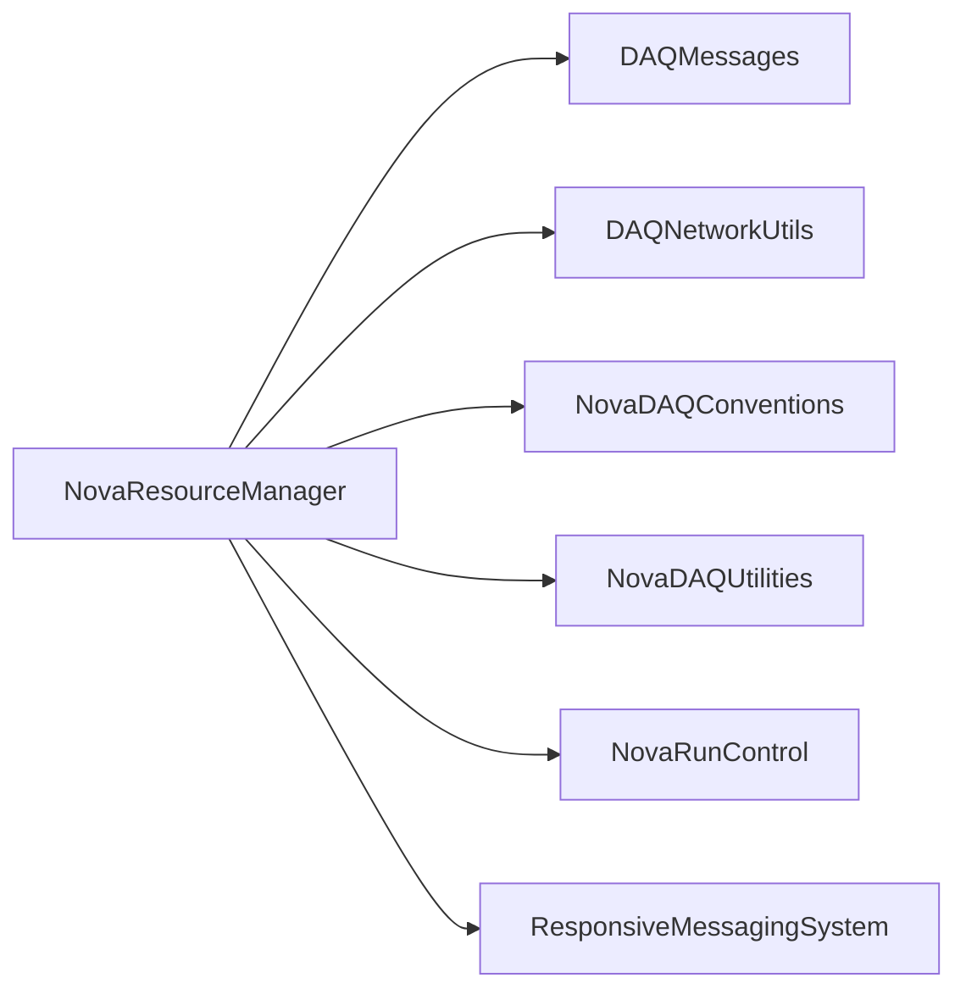

# NovaResourceManager

Qt TCP resource manager with partition reservation, resource XML persistence, and GUI clients.

## Identity and scope

Repository: [NovaDAQ/NovaResourceManager](https://github.com/NovaDAQ/NovaResourceManager) · Reviewed commit: `6264431d06372eab744d172ba916324ec23bc84c` · Domain: **Control**.

Tracked files: **44**. Production deployment and owner are **unconfirmed**.

## Operation

Source defaults are loopback and port 60890, overridable by NOVARSRCMGRHOST/NOVARSRCMGRPORT. Preserve resource files/backups and reconcile reservations before restart. Do not let two independent managers allocate the same hardware set.

For prerequisites, safe start/stop sequencing, health checks, and rollback see the [operations guide](../operations/index.md).

## Build and integration

This package uses the SRT/SoftRelTools release context. A standalone `make` in a fresh checkout is not a supported build recipe unless the required context is already configured. See [build and release](../operations/build.md).

| Build definition |
| --- |
| [GNUmakefile](https://github.com/NovaDAQ/NovaResourceManager/blob/6264431d06372eab744d172ba916324ec23bc84c/GNUmakefile) |
| [cxx/GNUmakefile](https://github.com/NovaDAQ/NovaResourceManager/blob/6264431d06372eab744d172ba916324ec23bc84c/cxx/GNUmakefile) |
| [cxx/src/GNUmakefile](https://github.com/NovaDAQ/NovaResourceManager/blob/6264431d06372eab744d172ba916324ec23bc84c/cxx/src/GNUmakefile) |
| [cxx/src/GUI/GNUmakefile](https://github.com/NovaDAQ/NovaResourceManager/blob/6264431d06372eab744d172ba916324ec23bc84c/cxx/src/GUI/GNUmakefile) |
| [cxx/src/XSD/GNUmakefile](https://github.com/NovaDAQ/NovaResourceManager/blob/6264431d06372eab744d172ba916324ec23bc84c/cxx/src/XSD/GNUmakefile) |
| [cxx/test/GNUmakefile](https://github.com/NovaDAQ/NovaResourceManager/blob/6264431d06372eab744d172ba916324ec23bc84c/cxx/test/GNUmakefile) |
| [cxx/unittest/GNUmakefile](https://github.com/NovaDAQ/NovaResourceManager/blob/6264431d06372eab744d172ba916324ec23bc84c/cxx/unittest/GNUmakefile) |
| [java/GNUmakefile](https://github.com/NovaDAQ/NovaResourceManager/blob/6264431d06372eab744d172ba916324ec23bc84c/java/GNUmakefile) |
| [java/src/GNUmakefile](https://github.com/NovaDAQ/NovaResourceManager/blob/6264431d06372eab744d172ba916324ec23bc84c/java/src/GNUmakefile) |
| [java/test/GNUmakefile](https://github.com/NovaDAQ/NovaResourceManager/blob/6264431d06372eab744d172ba916324ec23bc84c/java/test/GNUmakefile) |
| [java/unittest/GNUmakefile](https://github.com/NovaDAQ/NovaResourceManager/blob/6264431d06372eab744d172ba916324ec23bc84c/java/unittest/GNUmakefile) |

## Entry points

These are source entry points or operational scripts found statically. Installation names and enabled targets depend on the build/configuration; listing a script does not establish that it is deployed.

| Source |
| --- |
| [cxx/src/GUI/rsrcWindow.cc](https://github.com/NovaDAQ/NovaResourceManager/blob/6264431d06372eab744d172ba916324ec23bc84c/cxx/src/GUI/rsrcWindow.cc) |
| [cxx/src/XSD/getDAQResourceInfo.cc](https://github.com/NovaDAQ/NovaResourceManager/blob/6264431d06372eab744d172ba916324ec23bc84c/cxx/src/XSD/getDAQResourceInfo.cc) |
| [cxx/src/rmServer.cc](https://github.com/NovaDAQ/NovaResourceManager/blob/6264431d06372eab744d172ba916324ec23bc84c/cxx/src/rmServer.cc) |

## Interfaces

Headers and declared types form the API navigation map. Follow the source for method signatures, ownership, units, and error contracts. Generated DDS/XSD types are built from the schemas in the next section.

| Header | Declared types |
| --- | --- |
| [cxx/include/GUI/ResourceManagerClientConfigGUI.h](https://github.com/NovaDAQ/NovaResourceManager/blob/6264431d06372eab744d172ba916324ec23bc84c/cxx/include/GUI/ResourceManagerClientConfigGUI.h) | `ResourceManagerClientConfigGUI` |
| [cxx/include/GUI/ResourceManagerGUI.h](https://github.com/NovaDAQ/NovaResourceManager/blob/6264431d06372eab744d172ba916324ec23bc84c/cxx/include/GUI/ResourceManagerGUI.h) | `ResourceManagerGUI` |
| [cxx/include/GUI/ResourceManagerTabWidget.h](https://github.com/NovaDAQ/NovaResourceManager/blob/6264431d06372eab744d172ba916324ec23bc84c/cxx/include/GUI/ResourceManagerTabWidget.h) | `RMTabWidget` |
| [cxx/include/GUI/ResourceManagerTreeWidget.h](https://github.com/NovaDAQ/NovaResourceManager/blob/6264431d06372eab744d172ba916324ec23bc84c/cxx/include/GUI/ResourceManagerTreeWidget.h) | `NewResourceDialog`, `NewRsrcGroupDialog`, `RMTreeWidget` |
| [cxx/include/ResourceManager.h](https://github.com/NovaDAQ/NovaResourceManager/blob/6264431d06372eab744d172ba916324ec23bc84c/cxx/include/ResourceManager.h) | `ResourceManager` |
| [cxx/include/ResourceManagerConnection.h](https://github.com/NovaDAQ/NovaResourceManager/blob/6264431d06372eab744d172ba916324ec23bc84c/cxx/include/ResourceManagerConnection.h) | `ResourceManagerConnection` |
| [cxx/include/XSD/DAQPartition.h](https://github.com/NovaDAQ/NovaResourceManager/blob/6264431d06372eab744d172ba916324ec23bc84c/cxx/include/XSD/DAQPartition.h) | `DAQPartition`, `appState`, `rcClientType` |

## Configuration and data contracts

| Source artifact |
| --- |
| [config/FarDetDAQResources.xml](https://github.com/NovaDAQ/NovaResourceManager/blob/6264431d06372eab744d172ba916324ec23bc84c/config/FarDetDAQResources.xml) |
| [config/NDOSDAQResources.xml](https://github.com/NovaDAQ/NovaResourceManager/blob/6264431d06372eab744d172ba916324ec23bc84c/config/NDOSDAQResources.xml) |
| [config/NDSBTestDAQResources.xml](https://github.com/NovaDAQ/NovaResourceManager/blob/6264431d06372eab744d172ba916324ec23bc84c/config/NDSBTestDAQResources.xml) |
| [config/NearDetDAQResources.xml](https://github.com/NovaDAQ/NovaResourceManager/blob/6264431d06372eab744d172ba916324ec23bc84c/config/NearDetDAQResources.xml) |
| [config/NovaDAQResources.xml](https://github.com/NovaDAQ/NovaResourceManager/blob/6264431d06372eab744d172ba916324ec23bc84c/config/NovaDAQResources.xml) |
| [config/ResourceConfiguration.xml](https://github.com/NovaDAQ/NovaResourceManager/blob/6264431d06372eab744d172ba916324ec23bc84c/config/ResourceConfiguration.xml) |
| [config/ResourceConfiguration.xsd](https://github.com/NovaDAQ/NovaResourceManager/blob/6264431d06372eab744d172ba916324ec23bc84c/config/ResourceConfiguration.xsd) |
| [config/ResourceList.xsd](https://github.com/NovaDAQ/NovaResourceManager/blob/6264431d06372eab744d172ba916324ec23bc84c/config/ResourceList.xsd) |
| [config/ResourceManagerClientConfiguration.xsd](https://github.com/NovaDAQ/NovaResourceManager/blob/6264431d06372eab744d172ba916324ec23bc84c/config/ResourceManagerClientConfiguration.xsd) |
| [config/ResourceManagerConfiguration.xml](https://github.com/NovaDAQ/NovaResourceManager/blob/6264431d06372eab744d172ba916324ec23bc84c/config/ResourceManagerConfiguration.xml) |
| [config/ResourceManagerConfiguration.xsd](https://github.com/NovaDAQ/NovaResourceManager/blob/6264431d06372eab744d172ba916324ec23bc84c/config/ResourceManagerConfiguration.xsd) |
| [config/TestBeamDAQResources.xml](https://github.com/NovaDAQ/NovaResourceManager/blob/6264431d06372eab744d172ba916324ec23bc84c/config/TestBeamDAQResources.xml) |

## Environment and external dependencies

Environment names below are literal lookups found in source, not a guarantee that every value is mandatory. No environment values or credentials are copied into this documentation.

| Variable | Evidence |
| --- | --- |
| `DAQ_HOST` | [cxx/src/rmServer.cc:66](https://github.com/NovaDAQ/NovaResourceManager/blob/6264431d06372eab744d172ba916324ec23bc84c/cxx/src/rmServer.cc#L66) |
| `DAQ_LOG_ROOT` | [cxx/src/rmServer.cc:65](https://github.com/NovaDAQ/NovaResourceManager/blob/6264431d06372eab744d172ba916324ec23bc84c/cxx/src/rmServer.cc#L65) |
| `NOVADAQ_ENVIRONMENT` | [cxx/src/GUI/ResourceManagerGUI.cpp:79](https://github.com/NovaDAQ/NovaResourceManager/blob/6264431d06372eab744d172ba916324ec23bc84c/cxx/src/GUI/ResourceManagerGUI.cpp#L79) |
| `NOVARSRCMGRHOST` | [cxx/src/GUI/ResourceManagerGUI.cpp:69](https://github.com/NovaDAQ/NovaResourceManager/blob/6264431d06372eab744d172ba916324ec23bc84c/cxx/src/GUI/ResourceManagerGUI.cpp#L69) |
| `NOVARSRCMGRPORT` | [cxx/src/GUI/ResourceManagerGUI.cpp:62](https://github.com/NovaDAQ/NovaResourceManager/blob/6264431d06372eab744d172ba916324ec23bc84c/cxx/src/GUI/ResourceManagerGUI.cpp#L62) |
| `NOVARSRCMGRUSER` | [cxx/src/GUI/ResourceManagerGUI.cpp:110](https://github.com/NovaDAQ/NovaResourceManager/blob/6264431d06372eab744d172ba916324ec23bc84c/cxx/src/GUI/ResourceManagerGUI.cpp#L110) |
| `PWD` | [cxx/src/GUI/ResourceManagerGUI.cpp:439](https://github.com/NovaDAQ/NovaResourceManager/blob/6264431d06372eab744d172ba916324ec23bc84c/cxx/src/GUI/ResourceManagerGUI.cpp#L439) |
| `USER` | [cxx/src/GUI/ResourceManagerGUI.cpp:112](https://github.com/NovaDAQ/NovaResourceManager/blob/6264431d06372eab744d172ba916324ec23bc84c/cxx/src/GUI/ResourceManagerGUI.cpp#L112) |

Unresolved/non-package include roots (some are system or generated headers; this is not a package-manager lockfile):

| Include root | Evidence |
| --- | --- |
| `QtCore` | [cxx/include/GUI/ResourceManagerGUI.h:13](https://github.com/NovaDAQ/NovaResourceManager/blob/6264431d06372eab744d172ba916324ec23bc84c/cxx/include/GUI/ResourceManagerGUI.h#L13) |
| `QtGui` | [cxx/include/GUI/ResourceManagerGUI.h:14](https://github.com/NovaDAQ/NovaResourceManager/blob/6264431d06372eab744d172ba916324ec23bc84c/cxx/include/GUI/ResourceManagerGUI.h#L14) |
| `QtNetwork` | [cxx/include/GUI/ResourceManagerGUI.h:28](https://github.com/NovaDAQ/NovaResourceManager/blob/6264431d06372eab744d172ba916324ec23bc84c/cxx/include/GUI/ResourceManagerGUI.h#L28) |
| `QtXml` | [cxx/include/ResourceManager.h:16](https://github.com/NovaDAQ/NovaResourceManager/blob/6264431d06372eab744d172ba916324ec23bc84c/cxx/include/ResourceManager.h#L16) |
| `boost` | [cxx/include/ResourceManager.h:8](https://github.com/NovaDAQ/NovaResourceManager/blob/6264431d06372eab744d172ba916324ec23bc84c/cxx/include/ResourceManager.h#L8) |
| `sys` | [cxx/src/XSD/getDAQResourceInfo.cc:4](https://github.com/NovaDAQ/NovaResourceManager/blob/6264431d06372eab744d172ba916324ec23bc84c/cxx/src/XSD/getDAQResourceInfo.cc#L4) |

## Package dependencies

Arrow direction is **consumer → dependency**. This diagram includes source/build/runtime relationships and excludes test-only, release-membership, and build-tool edges. Conditional branches are not evaluated.

| Dependency | Relationship | Evidence |
| --- | --- | --- |
| [DAQMessages](DAQMessages.md) | source include | [cxx/src/GUI/ResourceManagerTreeWidget.cpp:8](https://github.com/NovaDAQ/NovaResourceManager/blob/6264431d06372eab744d172ba916324ec23bc84c/cxx/src/GUI/ResourceManagerTreeWidget.cpp#L8) |
| [DAQNetworkUtils](DAQNetworkUtils.md) | build link | [cxx/src/GUI/GNUmakefile:35](https://github.com/NovaDAQ/NovaResourceManager/blob/6264431d06372eab744d172ba916324ec23bc84c/cxx/src/GUI/GNUmakefile#L35) |
| [DAQNetworkUtils](DAQNetworkUtils.md) | source include | [cxx/include/GUI/ResourceManagerGUI.h:35](https://github.com/NovaDAQ/NovaResourceManager/blob/6264431d06372eab744d172ba916324ec23bc84c/cxx/include/GUI/ResourceManagerGUI.h#L35) |
| [NovaDAQConventions](NovaDAQConventions.md) | source include | [cxx/src/GUI/ResourceManagerGUI.cpp:3](https://github.com/NovaDAQ/NovaResourceManager/blob/6264431d06372eab744d172ba916324ec23bc84c/cxx/src/GUI/ResourceManagerGUI.cpp#L3) |
| [NovaDAQUtilities](NovaDAQUtilities.md) | build link | [cxx/src/GUI/GNUmakefile:35](https://github.com/NovaDAQ/NovaResourceManager/blob/6264431d06372eab744d172ba916324ec23bc84c/cxx/src/GUI/GNUmakefile#L35) |
| [NovaDAQUtilities](NovaDAQUtilities.md) | source include | [cxx/src/GUI/rsrcWindow.cc:3](https://github.com/NovaDAQ/NovaResourceManager/blob/6264431d06372eab744d172ba916324ec23bc84c/cxx/src/GUI/rsrcWindow.cc#L3) |
| [NovaDAQUtilities](NovaDAQUtilities.md) | test link | [cxx/test/GNUmakefile:11](https://github.com/NovaDAQ/NovaResourceManager/blob/6264431d06372eab744d172ba916324ec23bc84c/cxx/test/GNUmakefile#L11) |
| [NovaRunControl](NovaRunControl.md) | source include | [cxx/src/GUI/ResourceManagerTreeWidget.cpp:2](https://github.com/NovaDAQ/NovaResourceManager/blob/6264431d06372eab744d172ba916324ec23bc84c/cxx/src/GUI/ResourceManagerTreeWidget.cpp#L2) |
| [NovaRunControl](NovaRunControl.md) | test link | [cxx/test/GNUmakefile:11](https://github.com/NovaDAQ/NovaResourceManager/blob/6264431d06372eab744d172ba916324ec23bc84c/cxx/test/GNUmakefile#L11) |
| [ResponsiveMessagingSystem](ResponsiveMessagingSystem.md) | source include | [cxx/src/ResourceManager.cpp:1](https://github.com/NovaDAQ/NovaResourceManager/blob/6264431d06372eab744d172ba916324ec23bc84c/cxx/src/ResourceManager.cpp#L1) |
| [SRT_ONLINE](SRT_ONLINE.md) | build tool | [GNUmakefile:10](https://github.com/NovaDAQ/NovaResourceManager/blob/6264431d06372eab744d172ba916324ec23bc84c/GNUmakefile#L10) |

Direct consumers: [DAQApplicationManager](DAQApplicationManager.md), [DDTManager](DDTManager.md), [NovaDAQConfiguration](NovaDAQConfiguration.md), [NovaDAQMonitor](NovaDAQMonitor.md), [NovaResoureManager](NovaResoureManager.md), [NovaRunControl](NovaRunControl.md).

Explore upstream/downstream impact in the [dependency explorer](../architecture/explorer.md).

## Validation and review

Static analysis attempted **10 C/C++ translation units**, **0 shell scripts**, and parsed **0 Python files**. Counts are tool input coverage, not proof of successful compilation or exhaustive review. Source/build/configuration inventories and the operating surface were also assessed.

No actionable defect was confirmed for this package in this review. This is a bounded review result, not a clean bill of health; unvalidated analyzer diagnostics were not filed as bugs.

Existing test/example sources (not executed against production):

No test/example source identified in the scoped inventory.

## Existing documentation

No package README/manual identified in the scoped inventory. Use this page and the source interfaces above.
