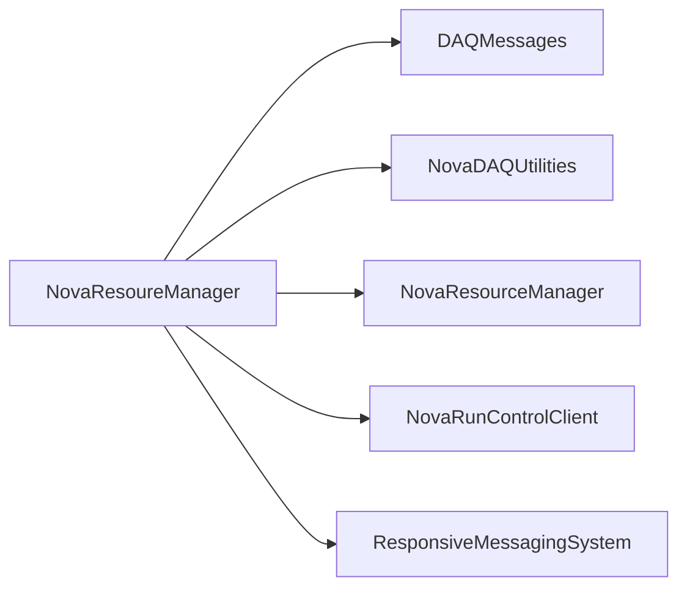

# NovaResoureManager

Earlier, misspelled resource-manager package implementing RMS discovery/reserve/release handlers.

## Identity and scope

Repository: [NovaDAQ/NovaResoureManager](https://github.com/NovaDAQ/NovaResoureManager) · Reviewed commit: `94f50269161143851d05e694237189de1389f3b8` · Domain: **Control**.

Tracked files: **17**. Production deployment and owner are **unconfirmed**.

## Operation

Keep its identity distinct from NovaResourceManager. Confirm historical deployment and contract compatibility before moving code or treating the spelling as an interchangeable alias.

For prerequisites, safe start/stop sequencing, health checks, and rollback see the [operations guide](../operations/index.md).

## Build and integration

This package uses the SRT/SoftRelTools release context. A standalone `make` in a fresh checkout is not a supported build recipe unless the required context is already configured. See [build and release](../operations/build.md).

| Build definition |
| --- |
| [GNUmakefile](https://github.com/NovaDAQ/NovaResoureManager/blob/94f50269161143851d05e694237189de1389f3b8/GNUmakefile) |
| [cxx/GNUmakefile](https://github.com/NovaDAQ/NovaResoureManager/blob/94f50269161143851d05e694237189de1389f3b8/cxx/GNUmakefile) |
| [cxx/src/GNUmakefile](https://github.com/NovaDAQ/NovaResoureManager/blob/94f50269161143851d05e694237189de1389f3b8/cxx/src/GNUmakefile) |
| [cxx/test/GNUmakefile](https://github.com/NovaDAQ/NovaResoureManager/blob/94f50269161143851d05e694237189de1389f3b8/cxx/test/GNUmakefile) |
| [cxx/unittest/GNUmakefile](https://github.com/NovaDAQ/NovaResoureManager/blob/94f50269161143851d05e694237189de1389f3b8/cxx/unittest/GNUmakefile) |
| [java/GNUmakefile](https://github.com/NovaDAQ/NovaResoureManager/blob/94f50269161143851d05e694237189de1389f3b8/java/GNUmakefile) |
| [java/src/GNUmakefile](https://github.com/NovaDAQ/NovaResoureManager/blob/94f50269161143851d05e694237189de1389f3b8/java/src/GNUmakefile) |
| [java/test/GNUmakefile](https://github.com/NovaDAQ/NovaResoureManager/blob/94f50269161143851d05e694237189de1389f3b8/java/test/GNUmakefile) |
| [java/unittest/GNUmakefile](https://github.com/NovaDAQ/NovaResoureManager/blob/94f50269161143851d05e694237189de1389f3b8/java/unittest/GNUmakefile) |

## Entry points

These are source entry points or operational scripts found statically. Installation names and enabled targets depend on the build/configuration; listing a script does not establish that it is deployed.

| Source |
| --- |
| [cxx/src/ResourceManagerApp.cc](https://github.com/NovaDAQ/NovaResoureManager/blob/94f50269161143851d05e694237189de1389f3b8/cxx/src/ResourceManagerApp.cc) |

## Interfaces

Headers and declared types form the API navigation map. Follow the source for method signatures, ownership, units, and error contracts. Generated DDS/XSD types are built from the schemas in the next section.

| Header | Declared types |
| --- | --- |
| [cxx/include/ResourceManager.h](https://github.com/NovaDAQ/NovaResoureManager/blob/94f50269161143851d05e694237189de1389f3b8/cxx/include/ResourceManager.h) | `ResourceManager` |

## Configuration and data contracts

| Source artifact |
| --- |
| [config/NovaResourceManager.xml](https://github.com/NovaDAQ/NovaResoureManager/blob/94f50269161143851d05e694237189de1389f3b8/config/NovaResourceManager.xml) |
| [config/NovaResourceManager.xsd](https://github.com/NovaDAQ/NovaResoureManager/blob/94f50269161143851d05e694237189de1389f3b8/config/NovaResourceManager.xsd) |
| [config/ResourceConfiguration.xml](https://github.com/NovaDAQ/NovaResoureManager/blob/94f50269161143851d05e694237189de1389f3b8/config/ResourceConfiguration.xml) |
| [config/ResourceConfiguration.xsd](https://github.com/NovaDAQ/NovaResoureManager/blob/94f50269161143851d05e694237189de1389f3b8/config/ResourceConfiguration.xsd) |

## Environment and external dependencies

Environment names below are literal lookups found in source, not a guarantee that every value is mandatory. No environment values or credentials are copied into this documentation.

No literal environment lookup was identified by this scan; shell setup scripts may still provide required values.

Unresolved/non-package include roots (some are system or generated headers; this is not a package-manager lockfile):

| Include root | Evidence |
| --- | --- |
| `MessageLogger` | [cxx/include/ResourceManager.h:7](https://github.com/NovaDAQ/NovaResoureManager/blob/94f50269161143851d05e694237189de1389f3b8/cxx/include/ResourceManager.h#L7) |
| `boost` | [cxx/include/ResourceManager.h:8](https://github.com/NovaDAQ/NovaResoureManager/blob/94f50269161143851d05e694237189de1389f3b8/cxx/include/ResourceManager.h#L8) |

## Package dependencies

Arrow direction is **consumer → dependency**. This diagram includes source/build/runtime relationships and excludes test-only, release-membership, and build-tool edges. Conditional branches are not evaluated.

| Dependency | Relationship | Evidence |
| --- | --- | --- |
| [DAQMessages](DAQMessages.md) | source include | [cxx/include/ResourceManager.h:6](https://github.com/NovaDAQ/NovaResoureManager/blob/94f50269161143851d05e694237189de1389f3b8/cxx/include/ResourceManager.h#L6) |
| [NovaDAQUtilities](NovaDAQUtilities.md) | build link | [cxx/src/GNUmakefile:26](https://github.com/NovaDAQ/NovaResoureManager/blob/94f50269161143851d05e694237189de1389f3b8/cxx/src/GNUmakefile#L26) |
| [NovaDAQUtilities](NovaDAQUtilities.md) | source include | [cxx/include/ResourceManager.h:4](https://github.com/NovaDAQ/NovaResoureManager/blob/94f50269161143851d05e694237189de1389f3b8/cxx/include/ResourceManager.h#L4) |
| [NovaDAQUtilities](NovaDAQUtilities.md) | test link | [cxx/test/GNUmakefile:11](https://github.com/NovaDAQ/NovaResoureManager/blob/94f50269161143851d05e694237189de1389f3b8/cxx/test/GNUmakefile#L11) |
| [NovaResourceManager](NovaResourceManager.md) | source include | [cxx/src/ResourceManager.cpp:7](https://github.com/NovaDAQ/NovaResoureManager/blob/94f50269161143851d05e694237189de1389f3b8/cxx/src/ResourceManager.cpp#L7) |
| [NovaRunControlClient](NovaRunControlClient.md) | source include | [cxx/include/ResourceManager.h:5](https://github.com/NovaDAQ/NovaResoureManager/blob/94f50269161143851d05e694237189de1389f3b8/cxx/include/ResourceManager.h#L5) |
| [ResponsiveMessagingSystem](ResponsiveMessagingSystem.md) | source include | [cxx/src/ResourceManager.cpp:6](https://github.com/NovaDAQ/NovaResoureManager/blob/94f50269161143851d05e694237189de1389f3b8/cxx/src/ResourceManager.cpp#L6) |
| [SRT_ONLINE](SRT_ONLINE.md) | build tool | [GNUmakefile:10](https://github.com/NovaDAQ/NovaResoureManager/blob/94f50269161143851d05e694237189de1389f3b8/GNUmakefile#L10) |

Direct consumers: None resolved in this snapshot.

Explore upstream/downstream impact in the [dependency explorer](../architecture/explorer.md).

## Validation and review

Static analysis attempted **2 C/C++ translation units**, **0 shell scripts**, and parsed **0 Python files**. Counts are tool input coverage, not proof of successful compilation or exhaustive review. Source/build/configuration inventories and the operating surface were also assessed.

No actionable defect was confirmed for this package in this review. This is a bounded review result, not a clean bill of health; unvalidated analyzer diagnostics were not filed as bugs.

Existing test/example sources (not executed against production):

No test/example source identified in the scoped inventory.

## Existing documentation

No package README/manual identified in the scoped inventory. Use this page and the source interfaces above.
