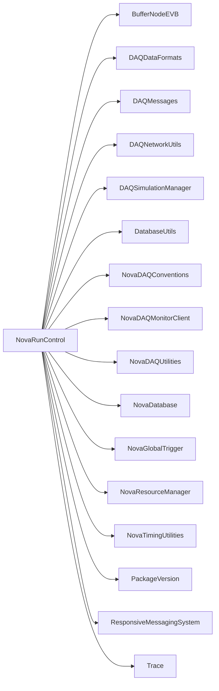

# NovaRunControl

Run-control server, GUI/CLI clients, state machine, run configuration, and resource selection.

## Identity and scope

Repository: [NovaDAQ/NovaRunControl](https://github.com/NovaDAQ/NovaRunControl) · Reviewed commit: `5d4a68ac55efac58bf7cb03c1d4163069f984a0b` · Domain: **Control**.

Tracked files: **115**. Production deployment and owner are **unconfirmed**.

## Operation

Establish resources, configure connections/hardware/run settings, and start/stop through the state machine. Require participant acknowledgements and record run/subrun IDs, configuration identity, and start/stop times. Preserve state/configuration logs when diagnosing transitions.

For prerequisites, safe start/stop sequencing, health checks, and rollback see the [operations guide](../operations/index.md).

## Build and integration

This package uses the SRT/SoftRelTools release context. A standalone `make` in a fresh checkout is not a supported build recipe unless the required context is already configured. See [build and release](../operations/build.md).

| Build definition |
| --- |
| [GNUmakefile](https://github.com/NovaDAQ/NovaRunControl/blob/5d4a68ac55efac58bf7cb03c1d4163069f984a0b/GNUmakefile) |
| [cxx/GNUmakefile](https://github.com/NovaDAQ/NovaRunControl/blob/5d4a68ac55efac58bf7cb03c1d4163069f984a0b/cxx/GNUmakefile) |
| [cxx/src/GNUmakefile](https://github.com/NovaDAQ/NovaRunControl/blob/5d4a68ac55efac58bf7cb03c1d4163069f984a0b/cxx/src/GNUmakefile) |
| [cxx/src/GUI/GNUmakefile](https://github.com/NovaDAQ/NovaRunControl/blob/5d4a68ac55efac58bf7cb03c1d4163069f984a0b/cxx/src/GUI/GNUmakefile) |
| [cxx/src/StateMachine/GNUmakefile](https://github.com/NovaDAQ/NovaRunControl/blob/5d4a68ac55efac58bf7cb03c1d4163069f984a0b/cxx/src/StateMachine/GNUmakefile) |
| [cxx/src/XSD/GNUmakefile](https://github.com/NovaDAQ/NovaRunControl/blob/5d4a68ac55efac58bf7cb03c1d4163069f984a0b/cxx/src/XSD/GNUmakefile) |
| [cxx/test/GNUmakefile](https://github.com/NovaDAQ/NovaRunControl/blob/5d4a68ac55efac58bf7cb03c1d4163069f984a0b/cxx/test/GNUmakefile) |
| [cxx/test/demo/GNUmakefile](https://github.com/NovaDAQ/NovaRunControl/blob/5d4a68ac55efac58bf7cb03c1d4163069f984a0b/cxx/test/demo/GNUmakefile) |
| [cxx/unittest/GNUmakefile](https://github.com/NovaDAQ/NovaRunControl/blob/5d4a68ac55efac58bf7cb03c1d4163069f984a0b/cxx/unittest/GNUmakefile) |
| [java/GNUmakefile](https://github.com/NovaDAQ/NovaRunControl/blob/5d4a68ac55efac58bf7cb03c1d4163069f984a0b/java/GNUmakefile) |
| [java/src/GNUmakefile](https://github.com/NovaDAQ/NovaRunControl/blob/5d4a68ac55efac58bf7cb03c1d4163069f984a0b/java/src/GNUmakefile) |
| [java/test/GNUmakefile](https://github.com/NovaDAQ/NovaRunControl/blob/5d4a68ac55efac58bf7cb03c1d4163069f984a0b/java/test/GNUmakefile) |
| [java/unittest/GNUmakefile](https://github.com/NovaDAQ/NovaRunControl/blob/5d4a68ac55efac58bf7cb03c1d4163069f984a0b/java/unittest/GNUmakefile) |

## Entry points

These are source entry points or operational scripts found statically. Installation names and enabled targets depend on the build/configuration; listing a script does not establish that it is deployed.

| Source |
| --- |
| [cxx/src/GUI/rcClient.cc](https://github.com/NovaDAQ/NovaRunControl/blob/5d4a68ac55efac58bf7cb03c1d4163069f984a0b/cxx/src/GUI/rcClient.cc) |
| [cxx/src/XSD/eclWriteTest.cc](https://github.com/NovaDAQ/NovaRunControl/blob/5d4a68ac55efac58bf7cb03c1d4163069f984a0b/cxx/src/XSD/eclWriteTest.cc) |
| [cxx/src/rcServer.cc](https://github.com/NovaDAQ/NovaRunControl/blob/5d4a68ac55efac58bf7cb03c1d4163069f984a0b/cxx/src/rcServer.cc) |

## Interfaces

Headers and declared types form the API navigation map. Follow the source for method signatures, ownership, units, and error contracts. Generated DDS/XSD types are built from the schemas in the next section.

| Header | Declared types |
| --- | --- |
| [cxx/include/GUI/RCClientGUI.h](https://github.com/NovaDAQ/NovaRunControl/blob/5d4a68ac55efac58bf7cb03c1d4163069f984a0b/cxx/include/GUI/RCClientGUI.h) | `RCClientConfigGUI`, `RCClientGUI`, `RCGlobalConfigGUI`, `rcGuiView` |
| [cxx/include/GUI/RCCmdLine.h](https://github.com/NovaDAQ/NovaRunControl/blob/5d4a68ac55efac58bf7cb03c1d4163069f984a0b/cxx/include/GUI/RCCmdLine.h) | `RCCmdLine`, `RCCmdLineEdit` |
| [cxx/include/GUI/RCConfigRunWindow.h](https://github.com/NovaDAQ/NovaRunControl/blob/5d4a68ac55efac58bf7cb03c1d4163069f984a0b/cxx/include/GUI/RCConfigRunWindow.h) | `RCConfigRunWindow` |
| [cxx/include/GUI/RCConfigWindow.h](https://github.com/NovaDAQ/NovaRunControl/blob/5d4a68ac55efac58bf7cb03c1d4163069f984a0b/cxx/include/GUI/RCConfigWindow.h) | `RCConfigDialog` |
| [cxx/include/GUI/RCExpertButtons.h](https://github.com/NovaDAQ/NovaRunControl/blob/5d4a68ac55efac58bf7cb03c1d4163069f984a0b/cxx/include/GUI/RCExpertButtons.h) | `RCExpertButtons` |
| [cxx/include/GUI/RCInfo.h](https://github.com/NovaDAQ/NovaRunControl/blob/5d4a68ac55efac58bf7cb03c1d4163069f984a0b/cxx/include/GUI/RCInfo.h) | `RCInfo` |
| [cxx/include/GUI/RCSimpleButtons.h](https://github.com/NovaDAQ/NovaRunControl/blob/5d4a68ac55efac58bf7cb03c1d4163069f984a0b/cxx/include/GUI/RCSimpleButtons.h) | `RCSimpleButtons` |
| [cxx/include/GUI/ResourceSelectionWindow.h](https://github.com/NovaDAQ/NovaRunControl/blob/5d4a68ac55efac58bf7cb03c1d4163069f984a0b/cxx/include/GUI/ResourceSelectionWindow.h) | `ResourceSelectionWindow` |
| [cxx/include/GUI/SimModeDialog.h](https://github.com/NovaDAQ/NovaRunControl/blob/5d4a68ac55efac58bf7cb03c1d4163069f984a0b/cxx/include/GUI/SimModeDialog.h) | `SimModeDialog` |
| [cxx/include/GUI/StartRunDialog.h](https://github.com/NovaDAQ/NovaRunControl/blob/5d4a68ac55efac58bf7cb03c1d4163069f984a0b/cxx/include/GUI/StartRunDialog.h) | `StartRunDialog` |
| [cxx/include/RCConnection.h](https://github.com/NovaDAQ/NovaRunControl/blob/5d4a68ac55efac58bf7cb03c1d4163069f984a0b/cxx/include/RCConnection.h) | `RunControlConnection` |
| [cxx/include/RCDefs.h](https://github.com/NovaDAQ/NovaRunControl/blob/5d4a68ac55efac58bf7cb03c1d4163069f984a0b/cxx/include/RCDefs.h) | `menu_opt` |
| [cxx/include/RCExtras.h](https://github.com/NovaDAQ/NovaRunControl/blob/5d4a68ac55efac58bf7cb03c1d4163069f984a0b/cxx/include/RCExtras.h) | Functions, constants, or templates |
| [cxx/include/RCServer.h](https://github.com/NovaDAQ/NovaRunControl/blob/5d4a68ac55efac58bf7cb03c1d4163069f984a0b/cxx/include/RCServer.h) | `RCDBWriter`, `RCECLWriter`, `RCServer`, `RsrcStatus`, `rcMode`, `timeval` |
| [cxx/include/StateMachine/RCStateMachine.h](https://github.com/NovaDAQ/NovaRunControl/blob/5d4a68ac55efac58bf7cb03c1d4163069f984a0b/cxx/include/StateMachine/RCStateMachine.h) | `RCEvent`, `RCState`, `RCStateMachine`, `RCStates`, `RCTransition`, `RCTransitions` |
| [cxx/include/XSD/ECL.h](https://github.com/NovaDAQ/NovaRunControl/blob/5d4a68ac55efac58bf7cb03c1d4163069f984a0b/cxx/include/XSD/ECL.h) | `Attachment_t`, `ECLEntry_t`, `Field_t`, `Form_t`, `Tag_t` |
| [cxx/include/XSD/ECLConnection.h](https://github.com/NovaDAQ/NovaRunControl/blob/5d4a68ac55efac58bf7cb03c1d4163069f984a0b/cxx/include/XSD/ECLConnection.h) | `ECLConnection` |
| [cxx/include/XSD/RCNamedConfigs.h](https://github.com/NovaDAQ/NovaRunControl/blob/5d4a68ac55efac58bf7cb03c1d4163069f984a0b/cxx/include/XSD/RCNamedConfigs.h) | `ConfigList_t`, `NamedConfig_t`, `RCNamedConfigs_t` |
| [cxx/include/XSD/RunControlConfiguration.h](https://github.com/NovaDAQ/NovaRunControl/blob/5d4a68ac55efac58bf7cb03c1d4163069f984a0b/cxx/include/XSD/RunControlConfiguration.h) | `RCConfig_t`, `RCLogToDB_t`, `RCLogToECL_t`, `ResourceList_t`, `Resource_t`, `RunTime_t` |

## Configuration and data contracts

| Source artifact |
| --- |
| [config/ECL.xsd](https://github.com/NovaDAQ/NovaRunControl/blob/5d4a68ac55efac58bf7cb03c1d4163069f984a0b/config/ECL.xsd) |
| [config/RCNamedConfigs.xml](https://github.com/NovaDAQ/NovaRunControl/blob/5d4a68ac55efac58bf7cb03c1d4163069f984a0b/config/RCNamedConfigs.xml) |
| [config/RCNamedConfigs.xsd](https://github.com/NovaDAQ/NovaRunControl/blob/5d4a68ac55efac58bf7cb03c1d4163069f984a0b/config/RCNamedConfigs.xsd) |
| [config/RunControlConfiguration.xml](https://github.com/NovaDAQ/NovaRunControl/blob/5d4a68ac55efac58bf7cb03c1d4163069f984a0b/config/RunControlConfiguration.xml) |
| [config/RunControlConfiguration.xsd](https://github.com/NovaDAQ/NovaRunControl/blob/5d4a68ac55efac58bf7cb03c1d4163069f984a0b/config/RunControlConfiguration.xsd) |
| [tables/DAQResourcesByRun.xml](https://github.com/NovaDAQ/NovaRunControl/blob/5d4a68ac55efac58bf7cb03c1d4163069f984a0b/tables/DAQResourcesByRun.xml) |
| [tables/Runs.xml](https://github.com/NovaDAQ/NovaRunControl/blob/5d4a68ac55efac58bf7cb03c1d4163069f984a0b/tables/Runs.xml) |
| [tables/Subruns.xml](https://github.com/NovaDAQ/NovaRunControl/blob/5d4a68ac55efac58bf7cb03c1d4163069f984a0b/tables/Subruns.xml) |
| [tables/TriggerBySubrun.xml](https://github.com/NovaDAQ/NovaRunControl/blob/5d4a68ac55efac58bf7cb03c1d4163069f984a0b/tables/TriggerBySubrun.xml) |

## Environment and external dependencies

Environment names below are literal lookups found in source, not a guarantee that every value is mandatory. No environment values or credentials are copied into this documentation.

| Variable | Evidence |
| --- | --- |
| `DAQ_HOST` | [cxx/src/GUI/rcClient.cc:75](https://github.com/NovaDAQ/NovaRunControl/blob/5d4a68ac55efac58bf7cb03c1d4163069f984a0b/cxx/src/GUI/rcClient.cc#L75) |
| `DAQ_LOG_ROOT` | [cxx/src/GUI/rcClient.cc:74](https://github.com/NovaDAQ/NovaRunControl/blob/5d4a68ac55efac58bf7cb03c1d4163069f984a0b/cxx/src/GUI/rcClient.cc#L74) |
| `NOVADAQRUNFILE` | [cxx/src/RCServer.cpp:417](https://github.com/NovaDAQ/NovaRunControl/blob/5d4a68ac55efac58bf7cb03c1d4163069f984a0b/cxx/src/RCServer.cpp#L417) |
| `NOVADAQ_ENVIRONMENT` | [cxx/src/GUI/RCClientGUI.cpp:176](https://github.com/NovaDAQ/NovaRunControl/blob/5d4a68ac55efac58bf7cb03c1d4163069f984a0b/cxx/src/GUI/RCClientGUI.cpp#L176) |
| `NOVADBHOST` | [cxx/src/RCServer.cpp:1143](https://github.com/NovaDAQ/NovaRunControl/blob/5d4a68ac55efac58bf7cb03c1d4163069f984a0b/cxx/src/RCServer.cpp#L1143) |
| `NOVADBNAME` | [cxx/src/RCServer.cpp:1128](https://github.com/NovaDAQ/NovaRunControl/blob/5d4a68ac55efac58bf7cb03c1d4163069f984a0b/cxx/src/RCServer.cpp#L1128) |
| `NOVADBPORT` | [cxx/src/RCServer.cpp:1158](https://github.com/NovaDAQ/NovaRunControl/blob/5d4a68ac55efac58bf7cb03c1d4163069f984a0b/cxx/src/RCServer.cpp#L1158) |
| `NOVADBUSER` | [cxx/src/RCServer.cpp:1113](https://github.com/NovaDAQ/NovaRunControl/blob/5d4a68ac55efac58bf7cb03c1d4163069f984a0b/cxx/src/RCServer.cpp#L1113) |
| `NOVARCSHOST` | [cxx/src/GUI/RCClientGUI.cpp:216](https://github.com/NovaDAQ/NovaRunControl/blob/5d4a68ac55efac58bf7cb03c1d4163069f984a0b/cxx/src/GUI/RCClientGUI.cpp#L216) |
| `NOVARCSPORT` | [cxx/src/GUI/RCClientGUI.cpp:163](https://github.com/NovaDAQ/NovaRunControl/blob/5d4a68ac55efac58bf7cb03c1d4163069f984a0b/cxx/src/GUI/RCClientGUI.cpp#L163) |
| `NOVARCSUSER` | [cxx/src/GUI/RCClientGUI.cpp:225](https://github.com/NovaDAQ/NovaRunControl/blob/5d4a68ac55efac58bf7cb03c1d4163069f984a0b/cxx/src/GUI/RCClientGUI.cpp#L225) |
| `NOVARSRCMGRHOST` | [cxx/src/RCServer.cpp:277](https://github.com/NovaDAQ/NovaRunControl/blob/5d4a68ac55efac58bf7cb03c1d4163069f984a0b/cxx/src/RCServer.cpp#L277) |
| `NOVARSRCMGRPORT` | [cxx/src/RCServer.cpp:271](https://github.com/NovaDAQ/NovaRunControl/blob/5d4a68ac55efac58bf7cb03c1d4163069f984a0b/cxx/src/RCServer.cpp#L271) |
| `PWD` | [cxx/src/GUI/RCClientGUI.cpp:1660](https://github.com/NovaDAQ/NovaRunControl/blob/5d4a68ac55efac58bf7cb03c1d4163069f984a0b/cxx/src/GUI/RCClientGUI.cpp#L1660) |
| `USER` | [cxx/src/GUI/RCClientGUI.cpp:227](https://github.com/NovaDAQ/NovaRunControl/blob/5d4a68ac55efac58bf7cb03c1d4163069f984a0b/cxx/src/GUI/RCClientGUI.cpp#L227) |

Unresolved/non-package include roots (some are system or generated headers; this is not a package-manager lockfile):

| Include root | Evidence |
| --- | --- |
| `.` | [cxx/test/RCDialogTester.cpp:1](https://github.com/NovaDAQ/NovaRunControl/blob/5d4a68ac55efac58bf7cb03c1d4163069f984a0b/cxx/test/RCDialogTester.cpp#L1) |
| `QtCore` | [cxx/include/GUI/RCClientGUI.h:6](https://github.com/NovaDAQ/NovaRunControl/blob/5d4a68ac55efac58bf7cb03c1d4163069f984a0b/cxx/include/GUI/RCClientGUI.h#L6) |
| `QtGui` | [cxx/include/GUI/RCClientGUI.h:4](https://github.com/NovaDAQ/NovaRunControl/blob/5d4a68ac55efac58bf7cb03c1d4163069f984a0b/cxx/include/GUI/RCClientGUI.h#L4) |
| `QtNetwork` | [cxx/include/GUI/RCClientGUI.h:8](https://github.com/NovaDAQ/NovaRunControl/blob/5d4a68ac55efac58bf7cb03c1d4163069f984a0b/cxx/include/GUI/RCClientGUI.h#L8) |
| `boost` | [cxx/include/RCConnection.h:14](https://github.com/NovaDAQ/NovaRunControl/blob/5d4a68ac55efac58bf7cb03c1d4163069f984a0b/cxx/include/RCConnection.h#L14) |
| `curl` | [cxx/include/XSD/ECLConnection.h:6](https://github.com/NovaDAQ/NovaRunControl/blob/5d4a68ac55efac58bf7cb03c1d4163069f984a0b/cxx/include/XSD/ECLConnection.h#L6) |
| `messagefacility` | [cxx/include/RCServer.h:29](https://github.com/NovaDAQ/NovaRunControl/blob/5d4a68ac55efac58bf7cb03c1d4163069f984a0b/cxx/include/RCServer.h#L29) |
| `sys` | [cxx/src/RCServer.cpp:4](https://github.com/NovaDAQ/NovaRunControl/blob/5d4a68ac55efac58bf7cb03c1d4163069f984a0b/cxx/src/RCServer.cpp#L4) |
| `xercesc` | [cxx/include/XSD/ECL.h:814](https://github.com/NovaDAQ/NovaRunControl/blob/5d4a68ac55efac58bf7cb03c1d4163069f984a0b/cxx/include/XSD/ECL.h#L814) |
| `xsd` | [cxx/include/XSD/ECL.h:42](https://github.com/NovaDAQ/NovaRunControl/blob/5d4a68ac55efac58bf7cb03c1d4163069f984a0b/cxx/include/XSD/ECL.h#L42) |

## Package dependencies

Arrow direction is **consumer → dependency**. This diagram includes source/build/runtime relationships and excludes test-only, release-membership, and build-tool edges. Conditional branches are not evaluated.

| Dependency | Relationship | Evidence |
| --- | --- | --- |
| [BufferNodeEVB](BufferNodeEVB.md) | build link | [cxx/src/GNUmakefile:27](https://github.com/NovaDAQ/NovaRunControl/blob/5d4a68ac55efac58bf7cb03c1d4163069f984a0b/cxx/src/GNUmakefile#L27) |
| [BufferNodeEVB](BufferNodeEVB.md) | test link | [cxx/test/GNUmakefile:31](https://github.com/NovaDAQ/NovaRunControl/blob/5d4a68ac55efac58bf7cb03c1d4163069f984a0b/cxx/test/GNUmakefile#L31) |
| [DAQDataFormats](DAQDataFormats.md) | build link | [cxx/src/GNUmakefile:24](https://github.com/NovaDAQ/NovaRunControl/blob/5d4a68ac55efac58bf7cb03c1d4163069f984a0b/cxx/src/GNUmakefile#L24) |
| [DAQDataFormats](DAQDataFormats.md) | source include | [cxx/src/RCServer.cpp:29](https://github.com/NovaDAQ/NovaRunControl/blob/5d4a68ac55efac58bf7cb03c1d4163069f984a0b/cxx/src/RCServer.cpp#L29) |
| [DAQMessages](DAQMessages.md) | build link | [cxx/src/GNUmakefile:25](https://github.com/NovaDAQ/NovaRunControl/blob/5d4a68ac55efac58bf7cb03c1d4163069f984a0b/cxx/src/GNUmakefile#L25) |
| [DAQMessages](DAQMessages.md) | source include | [cxx/include/RCServer.h:21](https://github.com/NovaDAQ/NovaRunControl/blob/5d4a68ac55efac58bf7cb03c1d4163069f984a0b/cxx/include/RCServer.h#L21) |
| [DAQMessages](DAQMessages.md) | test link | [cxx/test/GNUmakefile:29](https://github.com/NovaDAQ/NovaRunControl/blob/5d4a68ac55efac58bf7cb03c1d4163069f984a0b/cxx/test/GNUmakefile#L29) |
| [DAQNetworkUtils](DAQNetworkUtils.md) | build link | [cxx/src/GUI/GNUmakefile:53](https://github.com/NovaDAQ/NovaRunControl/blob/5d4a68ac55efac58bf7cb03c1d4163069f984a0b/cxx/src/GUI/GNUmakefile#L53) |
| [DAQNetworkUtils](DAQNetworkUtils.md) | source include | [cxx/include/GUI/RCClientGUI.h:21](https://github.com/NovaDAQ/NovaRunControl/blob/5d4a68ac55efac58bf7cb03c1d4163069f984a0b/cxx/include/GUI/RCClientGUI.h#L21) |
| [DAQSimulationManager](DAQSimulationManager.md) | build link | [cxx/src/GNUmakefile:25](https://github.com/NovaDAQ/NovaRunControl/blob/5d4a68ac55efac58bf7cb03c1d4163069f984a0b/cxx/src/GNUmakefile#L25) |
| [DAQSimulationManager](DAQSimulationManager.md) | source include | [cxx/include/GUI/SimModeDialog.h:24](https://github.com/NovaDAQ/NovaRunControl/blob/5d4a68ac55efac58bf7cb03c1d4163069f984a0b/cxx/include/GUI/SimModeDialog.h#L24) |
| [DAQSimulationManager](DAQSimulationManager.md) | test link | [cxx/test/GNUmakefile:30](https://github.com/NovaDAQ/NovaRunControl/blob/5d4a68ac55efac58bf7cb03c1d4163069f984a0b/cxx/test/GNUmakefile#L30) |
| [DatabaseUtils](DatabaseUtils.md) | build link | [cxx/src/GNUmakefile:26](https://github.com/NovaDAQ/NovaRunControl/blob/5d4a68ac55efac58bf7cb03c1d4163069f984a0b/cxx/src/GNUmakefile#L26) |
| [DatabaseUtils](DatabaseUtils.md) | source include | [cxx/include/GUI/RCClientGUI.h:23](https://github.com/NovaDAQ/NovaRunControl/blob/5d4a68ac55efac58bf7cb03c1d4163069f984a0b/cxx/include/GUI/RCClientGUI.h#L23) |
| [DatabaseUtils](DatabaseUtils.md) | test link | [cxx/test/GNUmakefile:32](https://github.com/NovaDAQ/NovaRunControl/blob/5d4a68ac55efac58bf7cb03c1d4163069f984a0b/cxx/test/GNUmakefile#L32) |
| [NovaDAQConventions](NovaDAQConventions.md) | source include | [cxx/src/GUI/RCClientGUI.cpp:9](https://github.com/NovaDAQ/NovaRunControl/blob/5d4a68ac55efac58bf7cb03c1d4163069f984a0b/cxx/src/GUI/RCClientGUI.cpp#L9) |
| [NovaDAQConventions](NovaDAQConventions.md) | test include | [cxx/test/RCDialogTester.cpp:3](https://github.com/NovaDAQ/NovaRunControl/blob/5d4a68ac55efac58bf7cb03c1d4163069f984a0b/cxx/test/RCDialogTester.cpp#L3) |
| [NovaDAQMonitorClient](NovaDAQMonitorClient.md) | source include | [cxx/include/RCServer.h:31](https://github.com/NovaDAQ/NovaRunControl/blob/5d4a68ac55efac58bf7cb03c1d4163069f984a0b/cxx/include/RCServer.h#L31) |
| [NovaDAQUtilities](NovaDAQUtilities.md) | source include | [cxx/include/XSD/ECL.h:98](https://github.com/NovaDAQ/NovaRunControl/blob/5d4a68ac55efac58bf7cb03c1d4163069f984a0b/cxx/include/XSD/ECL.h#L98) |
| [NovaDatabase](NovaDatabase.md) | build link | [cxx/src/GNUmakefile:28](https://github.com/NovaDAQ/NovaRunControl/blob/5d4a68ac55efac58bf7cb03c1d4163069f984a0b/cxx/src/GNUmakefile#L28) |
| [NovaDatabase](NovaDatabase.md) | source include | [cxx/include/RCServer.h:30](https://github.com/NovaDAQ/NovaRunControl/blob/5d4a68ac55efac58bf7cb03c1d4163069f984a0b/cxx/include/RCServer.h#L30) |
| [NovaDatabase](NovaDatabase.md) | test link | [cxx/test/GNUmakefile:32](https://github.com/NovaDAQ/NovaRunControl/blob/5d4a68ac55efac58bf7cb03c1d4163069f984a0b/cxx/test/GNUmakefile#L32) |
| [NovaGlobalTrigger](NovaGlobalTrigger.md) | build link | [cxx/src/GNUmakefile:27](https://github.com/NovaDAQ/NovaRunControl/blob/5d4a68ac55efac58bf7cb03c1d4163069f984a0b/cxx/src/GNUmakefile#L27) |
| [NovaGlobalTrigger](NovaGlobalTrigger.md) | test link | [cxx/test/GNUmakefile:31](https://github.com/NovaDAQ/NovaRunControl/blob/5d4a68ac55efac58bf7cb03c1d4163069f984a0b/cxx/test/GNUmakefile#L31) |
| [NovaMessageLogger](NovaMessageLogger.md) | test link | [cxx/test/demo/GNUmakefile:17](https://github.com/NovaDAQ/NovaRunControl/blob/5d4a68ac55efac58bf7cb03c1d4163069f984a0b/cxx/test/demo/GNUmakefile#L17) |
| [NovaResourceManager](NovaResourceManager.md) | build link | [cxx/src/GNUmakefile:26](https://github.com/NovaDAQ/NovaRunControl/blob/5d4a68ac55efac58bf7cb03c1d4163069f984a0b/cxx/src/GNUmakefile#L26) |
| [NovaResourceManager](NovaResourceManager.md) | source include | [cxx/include/GUI/RCClientGUI.h:20](https://github.com/NovaDAQ/NovaRunControl/blob/5d4a68ac55efac58bf7cb03c1d4163069f984a0b/cxx/include/GUI/RCClientGUI.h#L20) |
| [NovaTimingUtilities](NovaTimingUtilities.md) | build link | [cxx/src/GNUmakefile:29](https://github.com/NovaDAQ/NovaRunControl/blob/5d4a68ac55efac58bf7cb03c1d4163069f984a0b/cxx/src/GNUmakefile#L29) |
| [NovaTimingUtilities](NovaTimingUtilities.md) | test link | [cxx/test/GNUmakefile:33](https://github.com/NovaDAQ/NovaRunControl/blob/5d4a68ac55efac58bf7cb03c1d4163069f984a0b/cxx/test/GNUmakefile#L33) |
| [PackageVersion](PackageVersion.md) | build link | [cxx/src/GNUmakefile:29](https://github.com/NovaDAQ/NovaRunControl/blob/5d4a68ac55efac58bf7cb03c1d4163069f984a0b/cxx/src/GNUmakefile#L29) |
| [PackageVersion](PackageVersion.md) | test link | [cxx/test/GNUmakefile:33](https://github.com/NovaDAQ/NovaRunControl/blob/5d4a68ac55efac58bf7cb03c1d4163069f984a0b/cxx/test/GNUmakefile#L33) |
| [ResponsiveMessagingSystem](ResponsiveMessagingSystem.md) | source include | [cxx/include/RCServer.h:39](https://github.com/NovaDAQ/NovaRunControl/blob/5d4a68ac55efac58bf7cb03c1d4163069f984a0b/cxx/include/RCServer.h#L39) |
| [SRT_ONLINE](SRT_ONLINE.md) | build tool | [GNUmakefile:10](https://github.com/NovaDAQ/NovaRunControl/blob/5d4a68ac55efac58bf7cb03c1d4163069f984a0b/GNUmakefile#L10) |
| [Trace](Trace.md) | build link | [cxx/src/GNUmakefile:28](https://github.com/NovaDAQ/NovaRunControl/blob/5d4a68ac55efac58bf7cb03c1d4163069f984a0b/cxx/src/GNUmakefile#L28) |
| [Trace](Trace.md) | source include | [cxx/src/RCServer.cpp:31](https://github.com/NovaDAQ/NovaRunControl/blob/5d4a68ac55efac58bf7cb03c1d4163069f984a0b/cxx/src/RCServer.cpp#L31) |
| [Trace](Trace.md) | test link | [cxx/test/GNUmakefile:32](https://github.com/NovaDAQ/NovaRunControl/blob/5d4a68ac55efac58bf7cb03c1d4163069f984a0b/cxx/test/GNUmakefile#L32) |

Direct consumers: [NovaResourceManager](NovaResourceManager.md), [PedestalDataRunner](PedestalDataRunner.md).

Explore upstream/downstream impact in the [dependency explorer](../architecture/explorer.md).

## Validation and review

Static analysis attempted **21 C/C++ translation units**, **4 shell scripts**, and parsed **0 Python files**. Counts are tool input coverage, not proof of successful compilation or exhaustive review. Source/build/configuration inventories and the operating surface were also assessed.

No actionable defect was confirmed for this package in this review. This is a bounded review result, not a clean bill of health; unvalidated analyzer diagnostics were not filed as bugs.

Existing test/example sources (not executed against production):

| Source |
| --- |
| [cxx/test/RCDialogTester.cpp](https://github.com/NovaDAQ/NovaRunControl/blob/5d4a68ac55efac58bf7cb03c1d4163069f984a0b/cxx/test/RCDialogTester.cpp) |
| [cxx/test/RCDialogTester.h](https://github.com/NovaDAQ/NovaRunControl/blob/5d4a68ac55efac58bf7cb03c1d4163069f984a0b/cxx/test/RCDialogTester.h) |
| [cxx/test/eclWriteTest.cc](https://github.com/NovaDAQ/NovaRunControl/blob/5d4a68ac55efac58bf7cb03c1d4163069f984a0b/cxx/test/eclWriteTest.cc) |
| [cxx/test/showGUIDialogs.cc](https://github.com/NovaDAQ/NovaRunControl/blob/5d4a68ac55efac58bf7cb03c1d4163069f984a0b/cxx/test/showGUIDialogs.cc) |
| [java/test/cleanupDemoSystem.sh](https://github.com/NovaDAQ/NovaRunControl/blob/5d4a68ac55efac58bf7cb03c1d4163069f984a0b/java/test/cleanupDemoSystem.sh) |
| [java/test/startDemoSystem3CycleTest.sh](https://github.com/NovaDAQ/NovaRunControl/blob/5d4a68ac55efac58bf7cb03c1d4163069f984a0b/java/test/startDemoSystem3CycleTest.sh) |
| [java/test/startDemoSystemRateTest.sh](https://github.com/NovaDAQ/NovaRunControl/blob/5d4a68ac55efac58bf7cb03c1d4163069f984a0b/java/test/startDemoSystemRateTest.sh) |
| [java/test/startInteractiveDemoSystem.sh](https://github.com/NovaDAQ/NovaRunControl/blob/5d4a68ac55efac58bf7cb03c1d4163069f984a0b/java/test/startInteractiveDemoSystem.sh) |

## Existing documentation

No package README/manual identified in the scoped inventory. Use this page and the source interfaces above.
