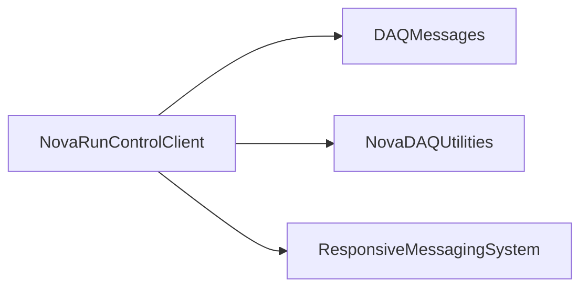

# NovaRunControlClient

RMS-based run-control and global-trigger receivers with shared message-client connection management.

## Identity and scope

Repository: [NovaDAQ/NovaRunControlClient](https://github.com/NovaDAQ/NovaRunControlClient) · Reviewed commit: `1005aac7bfaae11bac3032c20e50e0a7d4fdb221` · Domain: **Control**.

Tracked files: **42**. Production deployment and owner are **unconfirmed**.

## Operation

Register the intended partition and application identity; validate callbacks, disconnect, and destruction across start/stop cycles. Consumers depend on reliable teardown and reconnection after control services restart.

For prerequisites, safe start/stop sequencing, health checks, and rollback see the [operations guide](../operations/index.md).

## Build and integration

This package uses the SRT/SoftRelTools release context. A standalone `make` in a fresh checkout is not a supported build recipe unless the required context is already configured. See [build and release](../operations/build.md).

CMake definitions are present. Most NOvA fragments use parent-provided cetbuildtools macros and dependency targets; consult the files below before treating this directory as a standalone CMake project.

| Build definition |
| --- |
| [CMakeLists.txt](https://github.com/NovaDAQ/NovaRunControlClient/blob/1005aac7bfaae11bac3032c20e50e0a7d4fdb221/CMakeLists.txt) |
| [GNUmakefile](https://github.com/NovaDAQ/NovaRunControlClient/blob/1005aac7bfaae11bac3032c20e50e0a7d4fdb221/GNUmakefile) |
| [cxx/CMakeLists.txt](https://github.com/NovaDAQ/NovaRunControlClient/blob/1005aac7bfaae11bac3032c20e50e0a7d4fdb221/cxx/CMakeLists.txt) |
| [cxx/GNUmakefile](https://github.com/NovaDAQ/NovaRunControlClient/blob/1005aac7bfaae11bac3032c20e50e0a7d4fdb221/cxx/GNUmakefile) |
| [cxx/src/CMakeLists.txt](https://github.com/NovaDAQ/NovaRunControlClient/blob/1005aac7bfaae11bac3032c20e50e0a7d4fdb221/cxx/src/CMakeLists.txt) |
| [cxx/src/GNUmakefile](https://github.com/NovaDAQ/NovaRunControlClient/blob/1005aac7bfaae11bac3032c20e50e0a7d4fdb221/cxx/src/GNUmakefile) |
| [cxx/test/GNUmakefile](https://github.com/NovaDAQ/NovaRunControlClient/blob/1005aac7bfaae11bac3032c20e50e0a7d4fdb221/cxx/test/GNUmakefile) |
| [cxx/unittest/GNUmakefile](https://github.com/NovaDAQ/NovaRunControlClient/blob/1005aac7bfaae11bac3032c20e50e0a7d4fdb221/cxx/unittest/GNUmakefile) |
| [java/GNUmakefile](https://github.com/NovaDAQ/NovaRunControlClient/blob/1005aac7bfaae11bac3032c20e50e0a7d4fdb221/java/GNUmakefile) |
| [java/src/GNUmakefile](https://github.com/NovaDAQ/NovaRunControlClient/blob/1005aac7bfaae11bac3032c20e50e0a7d4fdb221/java/src/GNUmakefile) |
| [java/test/GNUmakefile](https://github.com/NovaDAQ/NovaRunControlClient/blob/1005aac7bfaae11bac3032c20e50e0a7d4fdb221/java/test/GNUmakefile) |
| [java/unittest/GNUmakefile](https://github.com/NovaDAQ/NovaRunControlClient/blob/1005aac7bfaae11bac3032c20e50e0a7d4fdb221/java/unittest/GNUmakefile) |

## Entry points

These are source entry points or operational scripts found statically. Installation names and enabled targets depend on the build/configuration; listing a script does not establish that it is deployed.

No standalone executable entry point was identified; this package may provide libraries, contracts, configuration, or binary artifacts.

## Interfaces

Headers and declared types form the API navigation map. Follow the source for method signatures, ownership, units, and error contracts. Generated DDS/XSD types are built from the schemas in the next section.

| Header | Declared types |
| --- | --- |
| [cxx/include/Action.h](https://github.com/NovaDAQ/NovaRunControlClient/blob/1005aac7bfaae11bac3032c20e50e0a7d4fdb221/cxx/include/Action.h) | `Action` |
| [cxx/include/Defs.h](https://github.com/NovaDAQ/NovaRunControlClient/blob/1005aac7bfaae11bac3032c20e50e0a7d4fdb221/cxx/include/Defs.h) | `ReturnValue`, `TraceLevel` |
| [cxx/include/GlobalTriggerReceiver.h](https://github.com/NovaDAQ/NovaRunControlClient/blob/1005aac7bfaae11bac3032c20e50e0a7d4fdb221/cxx/include/GlobalTriggerReceiver.h) | `GlobalTriggerReceiver` |
| [cxx/include/RmsMessageClient.h](https://github.com/NovaDAQ/NovaRunControlClient/blob/1005aac7bfaae11bac3032c20e50e0a7d4fdb221/cxx/include/RmsMessageClient.h) | `DefaultListener`, `MessageNotifier`, `MessageReceiver`, `PartitionDisconnecter`, `ReceiverWrapper`, `ReplySender`, `RmsMessageClient` |
| [cxx/include/RunControlReceiver.h](https://github.com/NovaDAQ/NovaRunControlClient/blob/1005aac7bfaae11bac3032c20e50e0a7d4fdb221/cxx/include/RunControlReceiver.h) | `RunControlReceiver` |
| [cxx/include/Trace.h](https://github.com/NovaDAQ/NovaRunControlClient/blob/1005aac7bfaae11bac3032c20e50e0a7d4fdb221/cxx/include/Trace.h) | `timeval` |

## Configuration and data contracts

No separate XML/IDL/XSD/FHiCL/INI/YAML/JSON configuration was identified. Inspect command-line parsing and site launchers for this package; defaults may be embedded in source.

## Environment and external dependencies

Environment names below are literal lookups found in source, not a guarantee that every value is mandatory. No environment values or credentials are copied into this documentation.

No literal environment lookup was identified by this scan; shell setup scripts may still provide required values.

Unresolved/non-package include roots (some are system or generated headers; this is not a package-manager lockfile):

| Include root | Evidence |
| --- | --- |
| `boost` | [cxx/include/RmsMessageClient.h:12](https://github.com/NovaDAQ/NovaRunControlClient/blob/1005aac7bfaae11bac3032c20e50e0a7d4fdb221/cxx/include/RmsMessageClient.h#L12) |
| `cppunit` | [cxx/unittest/NRCCUnitTestMain.cc:4](https://github.com/NovaDAQ/NovaRunControlClient/blob/1005aac7bfaae11bac3032c20e50e0a7d4fdb221/cxx/unittest/NRCCUnitTestMain.cc#L4) |
| `linux` | [cxx/include/Trace.h:16](https://github.com/NovaDAQ/NovaRunControlClient/blob/1005aac7bfaae11bac3032c20e50e0a7d4fdb221/cxx/include/Trace.h#L16) |
| `messagefacility` | [cxx/test/DAQAppDemo.h:10](https://github.com/NovaDAQ/NovaRunControlClient/blob/1005aac7bfaae11bac3032c20e50e0a7d4fdb221/cxx/test/DAQAppDemo.h#L10) |
| `sys` | [cxx/include/Trace.h:18](https://github.com/NovaDAQ/NovaRunControlClient/blob/1005aac7bfaae11bac3032c20e50e0a7d4fdb221/cxx/include/Trace.h#L18) |

## Package dependencies

Arrow direction is **consumer → dependency**. This diagram includes source/build/runtime relationships and excludes test-only, release-membership, and build-tool edges. Conditional branches are not evaluated.

| Dependency | Relationship | Evidence |
| --- | --- | --- |
| [DAQMessages](DAQMessages.md) | build link | [cxx/src/CMakeLists.txt:13](https://github.com/NovaDAQ/NovaRunControlClient/blob/1005aac7bfaae11bac3032c20e50e0a7d4fdb221/cxx/src/CMakeLists.txt#L13) |
| [DAQMessages](DAQMessages.md) | source include | [cxx/include/RmsMessageClient.h:10](https://github.com/NovaDAQ/NovaRunControlClient/blob/1005aac7bfaae11bac3032c20e50e0a7d4fdb221/cxx/include/RmsMessageClient.h#L10) |
| [DAQMessages](DAQMessages.md) | test include | [cxx/test/DAQAppDemo.h:6](https://github.com/NovaDAQ/NovaRunControlClient/blob/1005aac7bfaae11bac3032c20e50e0a7d4fdb221/cxx/test/DAQAppDemo.h#L6) |
| [NovaDAQUtilities](NovaDAQUtilities.md) | source include | [cxx/include/RmsMessageClient.h:5](https://github.com/NovaDAQ/NovaRunControlClient/blob/1005aac7bfaae11bac3032c20e50e0a7d4fdb221/cxx/include/RmsMessageClient.h#L5) |
| [NovaDAQUtilities](NovaDAQUtilities.md) | test include | [cxx/test/DAQAppDemo.h:4](https://github.com/NovaDAQ/NovaRunControlClient/blob/1005aac7bfaae11bac3032c20e50e0a7d4fdb221/cxx/test/DAQAppDemo.h#L4) |
| [ResponsiveMessagingSystem](ResponsiveMessagingSystem.md) | build link | [cxx/src/CMakeLists.txt:12](https://github.com/NovaDAQ/NovaRunControlClient/blob/1005aac7bfaae11bac3032c20e50e0a7d4fdb221/cxx/src/CMakeLists.txt#L12) |
| [ResponsiveMessagingSystem](ResponsiveMessagingSystem.md) | source include | [cxx/include/RmsMessageClient.h:7](https://github.com/NovaDAQ/NovaRunControlClient/blob/1005aac7bfaae11bac3032c20e50e0a7d4fdb221/cxx/include/RmsMessageClient.h#L7) |
| [ResponsiveMessagingSystem](ResponsiveMessagingSystem.md) | test include | [cxx/test/DAQAppDemo.cpp:2](https://github.com/NovaDAQ/NovaRunControlClient/blob/1005aac7bfaae11bac3032c20e50e0a7d4fdb221/cxx/test/DAQAppDemo.cpp#L2) |
| [SRT_ONLINE](SRT_ONLINE.md) | build tool | [GNUmakefile:10](https://github.com/NovaDAQ/NovaRunControlClient/blob/1005aac7bfaae11bac3032c20e50e0a7d4fdb221/GNUmakefile#L10) |

Direct consumers: [BufferNodeEVB](BufferNodeEVB.md), [DAQApplicationManager](DAQApplicationManager.md), [DAQSimulationManager](DAQSimulationManager.md), [DCMApplication](DCMApplication.md), [DDTManager](DDTManager.md), [ErrorHandler](ErrorHandler.md), [NDLTest](NDLTest.md), [NovaDAQConfiguration](NovaDAQConfiguration.md), [NovaDAQMonitor](NovaDAQMonitor.md), [NovaDataLogger](NovaDataLogger.md), [NovaDataLogger_OLD](NovaDataLogger_OLD.md), [NovaEventBuilder](NovaEventBuilder.md), [NovaEventBuilderClient](NovaEventBuilderClient.md), [NovaEventBuilder_OLD](NovaEventBuilder_OLD.md), [NovaGlobalTrigger](NovaGlobalTrigger.md), [NovaResoureManager](NovaResoureManager.md), [NovaRunControlClient_OLD](NovaRunControlClient_OLD.md), [SRT_ONLINE](SRT_ONLINE.md), [TDUControl](TDUControl.md).

Explore upstream/downstream impact in the [dependency explorer](../architecture/explorer.md).

## Validation and review

Static analysis attempted **10 C/C++ translation units**, **5 shell scripts**, and parsed **0 Python files**. Counts are tool input coverage, not proof of successful compilation or exhaustive review. Source/build/configuration inventories and the operating surface were also assessed.

| Severity | Finding | GitHub |
| --- | --- | --- |
| P1 | [NDAQ-004: Avoid incrementing erased map iterators during client destruction](../review/issues/NDAQ-004.md) | [Issue](https://github.com/NovaDAQ/NovaRunControlClient/issues/1) |

Existing test/example sources (not executed against production):

| Source |
| --- |
| [cxx/test/DAQAppDemo.cpp](https://github.com/NovaDAQ/NovaRunControlClient/blob/1005aac7bfaae11bac3032c20e50e0a7d4fdb221/cxx/test/DAQAppDemo.cpp) |
| [cxx/test/DAQAppDemo.h](https://github.com/NovaDAQ/NovaRunControlClient/blob/1005aac7bfaae11bac3032c20e50e0a7d4fdb221/cxx/test/DAQAppDemo.h) |
| [cxx/test/DummyDAQApp.cc](https://github.com/NovaDAQ/NovaRunControlClient/blob/1005aac7bfaae11bac3032c20e50e0a7d4fdb221/cxx/test/DummyDAQApp.cc) |
| [cxx/test/SampleDCM.cpp](https://github.com/NovaDAQ/NovaRunControlClient/blob/1005aac7bfaae11bac3032c20e50e0a7d4fdb221/cxx/test/SampleDCM.cpp) |
| [cxx/test/SampleDCM.h](https://github.com/NovaDAQ/NovaRunControlClient/blob/1005aac7bfaae11bac3032c20e50e0a7d4fdb221/cxx/test/SampleDCM.h) |
| [cxx/test/SampleDCMMain.cc](https://github.com/NovaDAQ/NovaRunControlClient/blob/1005aac7bfaae11bac3032c20e50e0a7d4fdb221/cxx/test/SampleDCMMain.cc) |
| [cxx/test/sendRunControlMessage.cc](https://github.com/NovaDAQ/NovaRunControlClient/blob/1005aac7bfaae11bac3032c20e50e0a7d4fdb221/cxx/test/sendRunControlMessage.cc) |
| [cxx/test/startDummyDAQApp.sh](https://github.com/NovaDAQ/NovaRunControlClient/blob/1005aac7bfaae11bac3032c20e50e0a7d4fdb221/cxx/test/startDummyDAQApp.sh) |
| [cxx/test/statusMessageRateTest.cc](https://github.com/NovaDAQ/NovaRunControlClient/blob/1005aac7bfaae11bac3032c20e50e0a7d4fdb221/cxx/test/statusMessageRateTest.cc) |
| [cxx/unittest/NRCCUnitTestMain.cc](https://github.com/NovaDAQ/NovaRunControlClient/blob/1005aac7bfaae11bac3032c20e50e0a7d4fdb221/cxx/unittest/NRCCUnitTestMain.cc) |
| [java/test/cleanupDemoSystem.sh](https://github.com/NovaDAQ/NovaRunControlClient/blob/1005aac7bfaae11bac3032c20e50e0a7d4fdb221/java/test/cleanupDemoSystem.sh) |
| [java/test/startDemoSystem3CycleTest.sh](https://github.com/NovaDAQ/NovaRunControlClient/blob/1005aac7bfaae11bac3032c20e50e0a7d4fdb221/java/test/startDemoSystem3CycleTest.sh) |
| [java/test/startDemoSystemRateTest.sh](https://github.com/NovaDAQ/NovaRunControlClient/blob/1005aac7bfaae11bac3032c20e50e0a7d4fdb221/java/test/startDemoSystemRateTest.sh) |
| [java/test/startInteractiveDemoSystem.sh](https://github.com/NovaDAQ/NovaRunControlClient/blob/1005aac7bfaae11bac3032c20e50e0a7d4fdb221/java/test/startInteractiveDemoSystem.sh) |

## Existing documentation

No package README/manual identified in the scoped inventory. Use this page and the source interfaces above.
